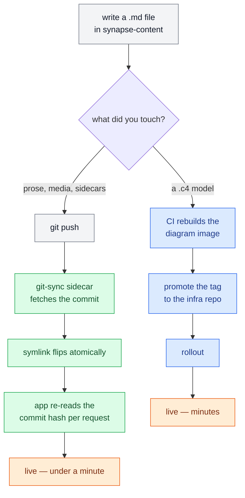

<header class="blog-post__hero">
  <div class="blog-post__hero-copy">
    <div class="blog-post__hero-eyebrow">Working Guide · Two Repositories · One Platform</div>
    <h1 class="blog-post__hero-title">How to work with <em>Synapse</em></h1>
    <p class="blog-post__hero-sub">Everything from an empty terminal to a published lesson with runnable code, a judged problem and a clickable architecture model. Setup is written for Mac, Windows and Linux, and assumes you have never used a terminal before.</p>
    <div class="blog-post__hero-meta">
      <div class="blog-post__hero-meta-item"><span>Repositories</span><span>2</span></div>
      <div class="blog-post__hero-meta-item"><span>Setup Steps</span><span>6</span></div>
      <div class="blog-post__hero-meta-item"><span>Reserved Fences</span><span>7</span></div>
      <div class="blog-post__hero-meta-item"><span>Publish By</span><span>git push</span></div>
    </div>
  </div>
  <div class="blog-post__hero-art" aria-hidden="true">
    <svg viewBox="0 0 600 700" fill="none" xmlns="http://www.w3.org/2000/svg">
      <circle cx="300" cy="350" r="260" fill="currentColor" opacity="0.14"/>
      <rect x="120" y="120" width="360" height="92" rx="10" fill="currentColor" opacity="0.5"/>
      <text x="300" y="156" font-family="monospace" font-size="17" fill="currentColor" text-anchor="middle" opacity="0.95">ani2fun/synapse</text>
      <text x="300" y="186" font-family="serif" font-size="13" fill="currentColor" text-anchor="middle" opacity="0.7" font-style="italic">the code — rebuilt when code changes</text>
      <path d="M300 212 V 268" stroke="currentColor" stroke-width="2" opacity="0.45"/>
      <path d="M292 258 L300 270 L308 258" stroke="currentColor" stroke-width="2" opacity="0.45"/>
      <rect x="150" y="272" width="300" height="66" rx="10" fill="none" stroke="currentColor" stroke-width="2" opacity="0.55"/>
      <text x="300" y="306" font-family="monospace" font-size="15" fill="currentColor" text-anchor="middle" opacity="0.95">reads at SYNAPSE_ROOT</text>
      <text x="300" y="326" font-family="serif" font-size="12" fill="currentColor" text-anchor="middle" opacity="0.7" font-style="italic">never writes</text>
      <path d="M300 338 V 394" stroke="currentColor" stroke-width="2" opacity="0.45"/>
      <path d="M292 384 L300 396 L308 384" stroke="currentColor" stroke-width="2" opacity="0.45"/>
      <rect x="120" y="398" width="360" height="92" rx="10" fill="currentColor" opacity="0.5"/>
      <text x="300" y="434" font-family="monospace" font-size="17" fill="currentColor" text-anchor="middle" opacity="0.95">ani2fun/synapse-content</text>
      <text x="300" y="464" font-family="serif" font-size="13" fill="currentColor" text-anchor="middle" opacity="0.7" font-style="italic">the writing — live in under a minute</text>
      <path d="M120 526 H480" stroke="currentColor" stroke-width="1" opacity="0.25"/>
      <text x="300" y="566" font-family="serif" font-size="15" fill="currentColor" text-anchor="middle" opacity="0.8" font-style="italic">no CMS · no content database</text>
      <text x="300" y="596" font-family="monospace" font-size="15" fill="currentColor" text-anchor="middle" opacity="0.9">git push IS the deploy</text>
    </svg>
  </div>
</header>

<nav class="blog-post__toc" aria-label="On this page">
  <ul>
    <li><a href="#two-repos">Two Repositories</a></li>
    <li><a href="#running">Running It Locally — Mac, Windows, Linux</a></li>
    <li><a href="#model">The Content Model</a></li>
    <li><a href="#fences">The Fence Vocabulary</a></li>
    <li><a href="#problems">Judged Problems</a></li>
    <li><a href="#diagrams">Diagrams &amp; Architecture</a></li>
    <li><a href="#media">Media, Blog Posts, Links</a></li>
    <li><a href="#in-app">Editing Without git</a></li>
    <li><a href="#verify">Verify Before You Push</a></li>
    <li><a href="#ship">How It Actually Ships</a></li>
    <li><a href="#traps">Traps That Fail Quietly</a></li>
  </ul>
</nav>

<p class="blog-post__lede">Synapse is two repositories that never merge: one holds an application, the other holds everything the application says. Publishing a lesson is a <code>git push</code> to the second one, and nothing is rebuilt.</p>

This is the working guide. It assumes nothing beyond a terminal and covers the whole path — cloning, running the stack, writing a lesson with every feature the renderer has, verifying it, and getting it live. Where something fails *quietly*, this guide says so, because a wrong fence does not throw an error; it just renders as a plain code block and leaves you wondering.

<div class="blog-post__divider"><span>The Split</span></div>

<h2 id="two-repos" class="blog-post__section">Two Repositories, and Why That Matters</h2>

| Repository | Holds | Changes reach production |
|---|---|---|
| [`ani2fun/synapse`](https://github.com/ani2fun/synapse) | the application — Rust server, Astro web tier, visualisation engine | image build → registry → deployment rollout, **minutes** |
| [`ani2fun/synapse-content`](https://github.com/ani2fun/synapse-content) | every book, lesson, diagram model, test suite and blog post | a sidecar pulls the commit, **under a minute**, no rebuild |

The application reads content off disk at a path it is given. In production that path is a checkout maintained by a git-sync sidecar; in development it is wherever you cloned the content repository. Neither the server nor the browser can write to it.

<aside class="blog-post__pullquote">
  <p>There is no CMS, no content database, no upload endpoint. Everything a content management system usually provides — drafts, review, revisions, rollback, an audit log — is delegated to git, which does all of it better and has already been written.</p>
  <cite>The one architectural decision that shapes every workflow below</cite>
</aside>

The practical consequences are worth internalising before you start:

<div class="blog-post__benefits">
  <div class="blog-post__benefit">
    <span class="blog-post__pill blog-post__pill--good">Fast loop</span>
    <span class="blog-post__benefit-icon">⚡</span>
    <h4>Save the file, refresh the page</h4>
    <p>In development the content index is re-checked per request, so an edit shows on the next refresh. No restart, no rebuild, no watcher to configure.</p>
  </div>
  <div class="blog-post__benefit">
    <span class="blog-post__pill blog-post__pill--good">Cheap rollback</span>
    <span class="blog-post__benefit-icon">↩️</span>
    <h4>A bad lesson is a revert</h4>
    <p>Content is never in a database, so undoing a publish is <code>git revert</code> and a poll interval — not a migration and an incident.</p>
  </div>
  <div class="blog-post__benefit">
    <span class="blog-post__pill blog-post__pill--warn">Watch for</span>
    <span class="blog-post__benefit-icon">👻</span>
    <h4>Every <code>.md</code> is a page</h4>
    <p>Drop a <code>README.md</code> into a book directory and it renders as a lesson in the sidebar. Notes belong outside the book tree.</p>
  </div>
  <div class="blog-post__benefit">
    <span class="blog-post__pill blog-post__pill--neutral">By design</span>
    <span class="blog-post__benefit-icon">🔗</span>
    <h4>Slugs are forever</h4>
    <p>The URL is built from directory and file names with the numeric prefix stripped. Renumbering is free; renaming breaks every link.</p>
  </div>
</div>

<div class="blog-post__divider"><span>Setup</span></div>

<h2 id="running" class="blog-post__section">Running It Locally</h2>

<p class="blog-post__lede">You do not need to be a developer to do this. You need to copy six commands into a black window and wait. Everything below is written for someone who has never opened a terminal.</p>

If you only want to **write** — fix a typo, add a lesson — you can skip this entire section twice over. Contributors edit lessons [inside the app itself](#in-app), with no installation at all, and writers who prefer files need only the content folder and a text editor. Running the whole platform is for people who want to change the *software*.

<div class="blog-post__callout blog-post__callout--info">
  <p><strong>What you are about to install, in plain terms.</strong> Synapse is made of a few separate programs that talk to each other. Four of them (a database, a code sandbox, a login server, a diagram viewer) come pre-packaged, so you never install them yourself — a tool called <strong>Docker</strong> downloads and runs them for you. Two you do install: <strong>Rust</strong>, which the main server is written in, and <strong>Node</strong>, which builds the web pages. Plus <strong>Git</strong>, which downloads the source code. That is the whole list: Git, Rust, Node, Docker.</p>
</div>

<h3 id="step0">Step 0 · Open a terminal</h3>

The terminal is a window where you type commands instead of clicking. Everything below gets pasted into it, one block at a time, pressing Enter after each.

<div class="blog-post__table-wrap">
  <table class="blog-post__table">
    <thead><tr><th>Your computer</th><th>How to open it</th></tr></thead>
    <tbody>
      <tr><td><strong>Mac</strong></td><td>Press <code>⌘ + Space</code>, type <em>Terminal</em>, press Enter.</td></tr>
      <tr><td><strong>Windows</strong></td><td>Click Start, type <em>PowerShell</em>, click <em>Windows PowerShell</em>. (You will switch to a second terminal in Step 1 — read on.)</td></tr>
      <tr><td><strong>Linux</strong></td><td>Press <code>Ctrl + Alt + T</code>, or search your applications for <em>Terminal</em>.</td></tr>
    </tbody>
  </table>
</div>

A line starting with `#` in the blocks below is a comment for you, not a command — you can paste it along with everything else and the computer will ignore it.

<div class="blog-post__callout blog-post__callout--warn">
  <p><strong>Windows users, read this before Step 1.</strong> Synapse's start-up script is written for Mac and Linux, and it uses tools Windows does not have. Rather than fight that, install <strong>WSL</strong> — Microsoft's official way to run Ubuntu Linux inside Windows. It takes one command, it is fully supported, and after it you follow the <strong>Linux</strong> instructions everywhere below.</p>
  <p>In PowerShell, right-click and choose <em>Run as administrator</em>, then:</p>
  <p><code>wsl --install</code></p>
  <p>Restart when it asks. You will be prompted to pick a username and password for Ubuntu — write them down. From then on, open <em>Ubuntu</em> from the Start menu instead of PowerShell, and use the Linux column in every table below.</p>
</div>

<h3 id="step1">Step 1 · Install the four tools</h3>

Pick your operating system and paste the block. Each installer prints a lot of text — that is normal. Wait for your prompt to come back before pasting the next thing.

**On a Mac**

```bash
# 1. Homebrew — the standard Mac installer for developer tools.
#    Skip this line if `brew --version` already prints something.
/bin/bash -c "$(curl -fsSL https://raw.githubusercontent.com/Homebrew/install/HEAD/install.sh)"

# 2. Git and Node (22 or newer).
brew install git node

# 3. Rust, from the official installer. Choose option 1 (default) when it asks.
curl --proto '=https' --tlsv1.2 -sSf https://sh.rustup.rs | sh
source "$HOME/.cargo/env"

# 4. Docker Desktop — this one has a normal installer window.
brew install --cask docker-desktop
```

Then **open Docker Desktop from your Applications folder once** and leave it running. Docker only works while that app is open; its whale icon sits in the menu bar at the top of the screen.

<div class="blog-post__callout blog-post__callout--info">
  <p><strong>Why Rust comes from its own installer rather than Homebrew.</strong> Homebrew's <code>rustup</code> is "keg-only" — it installs without putting anything on your PATH, so the commands appear not to exist until you edit a shell config file. The official installer above handles that itself, and it is what <a href="https://rust-lang.org">rust-lang.org</a> recommends. One less thing to get wrong.</p>
</div>

**On Windows (inside Ubuntu/WSL) or on Linux**

```bash
# 1. Git, curl and build tools.
sudo apt update && sudo apt install -y git curl build-essential

# 2. Node 22.
curl -fsSL https://deb.nodesource.com/setup_22.x | sudo -E bash -
sudo apt install -y nodejs

# 3. Rust. Choose option 1 (default) when it asks.
curl --proto '=https' --tlsv1.2 -sSf https://sh.rustup.rs | sh
source "$HOME/.cargo/env"

# 4. Docker.
sudo apt install -y docker.io docker-compose-v2
sudo usermod -aG docker $USER      # lets you use docker without typing sudo
```

On plain Linux, **close the terminal and open a new one** after that last line, or the permission change will not have taken effect. On Windows, install [Docker Desktop for Windows](https://www.docker.com/products/docker-desktop/) instead of the `apt` step above and enable *Settings → Resources → WSL integration* for your Ubuntu — then Docker works from inside Ubuntu automatically.

**Check it worked.** Paste this; you want four version numbers and no "command not found":

```bash
git --version && node --version && cargo --version && docker --version
```

<h3 id="step2">Step 2 · Download the two folders</h3>

```bash
# Make a working folder and move into it.
mkdir -p ~/synapse-workspace && cd ~/synapse-workspace

# The application, then the writing.
git clone https://github.com/ani2fun/synapse.git
git clone https://github.com/ani2fun/synapse-content.git
```

Keep them **side by side** like that. The application looks for the writing in a folder next to it, so this layout works with no configuration. (`~` means your home folder; on a Mac that is `/Users/yourname`.)

<h3 id="step3">Step 3 · Start the four helper services</h3>

Docker downloads and runs these for you. The first time takes a few minutes because it is fetching them; afterwards it is seconds.

```bash
cd ~/synapse-workspace/synapse
docker compose up -d db go-judge keycloak

# Optional — only if you want the interactive architecture diagrams.
docker compose --profile c4 up -d likec4
```

`-d` means "in the background". To check they are alive:

```bash
docker compose ps
```

<div class="blog-post__callout blog-post__callout--warn">
  <p><strong>Now one small manual step.</strong> Docker creates a database named <code>synapse</code>, but the server wants one named <code>synapse_rs</code>. Create it once:</p>
  <p><code>docker compose exec db createdb -U synapse synapse_rs</code></p>
  <p>If it says <em>already exists</em>, you are fine — it is done. Everything else about the database sets itself up on first launch.</p>
</div>

<h3 id="step4">Step 4 · Start Synapse</h3>

```bash
cd ~/synapse-workspace/synapse
dev-tools/dev
```

**The first run compiles the server and takes several minutes** — anywhere from two to ten depending on your machine. It looks like it has frozen. It has not; Rust is simply slow to build the first time and fast forever after. Later runs start in seconds.

Leave this window open — the site runs for as long as it does. Press `Ctrl + C` in it to stop everything.

<h3 id="step5">Step 5 · Open it</h3>

Go to **<code>http://localhost:5373</code>** in your browser. You should see the library, with every book in your content folder.

To sign in — needed only for running code and saving solutions — use username `tester`, password `tester`.

<div class="blog-post__table-wrap">
  <table class="blog-post__table">
    <thead><tr><th>Address</th><th>What it is</th><th>Do you need it?</th></tr></thead>
    <tbody>
      <tr><td><strong><code>localhost:5373</code></strong></td><td>the site</td><td><span class="blog-post__pill blog-post__pill--good">This is the one</span></td></tr>
      <tr><td><code>localhost:8280</code></td><td>the API the site talks to</td><td>only when debugging</td></tr>
      <tr><td><code>localhost:8181</code></td><td>the login server (admin / admin)</td><td>rarely</td></tr>
      <tr><td><code>localhost:5532</code></td><td>the database</td><td>rarely</td></tr>
      <tr><td><code>localhost:5150</code></td><td>the sandbox that runs reader code</td><td>no</td></tr>
      <tr><td><code>localhost:8190</code></td><td>the diagram viewer</td><td>only with the <code>c4</code> option on</td></tr>
    </tbody>
  </table>
</div>

<div class="blog-post__callout blog-post__callout--bad">
  <p><strong>Do not change 5373 to something else.</strong> The login server is configured to trust that exact address. Move the site to another port and sign-in fails silently — no error message, just a login that never completes. This one has cost real hours.</p>
</div>

<h3 id="step6">Step 6 · Change something and watch it appear</h3>

This is the moment the two-repository split pays off. With the site still running, open any lesson file in the *other* folder — say `~/synapse-workspace/synapse-content/blog/working-with-synapse.md` — in any text editor, change a word, and save.

Now refresh the page in your browser. Your change is there. **No rebuild, no restart, no publish button.** The server re-reads the content folder on every request, so writing feels like editing a document rather than deploying software.

<h3 id="troubleshooting">When something goes wrong</h3>

<div class="blog-post__table-wrap">
  <table class="blog-post__table">
    <thead><tr><th>What you see</th><th>What it means</th><th>What to do</th></tr></thead>
    <tbody>
      <tr><td><code>command not found</code></td><td>the tool did not install, or the terminal predates it</td><td>close the terminal, open a new one, try again</td></tr>
      <tr><td><code>Cannot connect to the Docker daemon</code></td><td>Docker is not running</td><td>Mac: open Docker Desktop. Linux: <code>sudo systemctl start docker</code></td></tr>
      <tr><td><code>permission denied</code> on a docker command</td><td>your user is not in the docker group yet</td><td>Linux: log out and back in after the <code>usermod</code> line</td></tr>
      <tr><td>the server exits immediately at startup</td><td>the database is missing or not up</td><td>re-run Step 3, including the <code>createdb</code> line</td></tr>
      <tr><td><code>address already in use</code></td><td>an older copy is still running</td><td>find its terminal and press <code>Ctrl + C</code>, then start again</td></tr>
      <tr><td>the site loads but lists no books</td><td>the two folders are not side by side</td><td>see the note below</td></tr>
      <tr><td>signing in does nothing</td><td>you are not on port 5373</td><td>use <code>http://localhost:5373</code> exactly</td></tr>
      <tr><td>it just sits there on first run</td><td>Rust is compiling</td><td>wait — two to ten minutes, once</td></tr>
    </tbody>
  </table>
</div>

If your two folders are not siblings, tell the server where the writing is:

```bash
SYNAPSE_ROOT=/full/path/to/synapse-content dev-tools/dev
```

And to check the server is answering at all, this should print `{"status":"ok"}`:

```bash
curl -s localhost:8280/api/health
```

<h3 id="settings">The settings worth knowing</h3>

Everything is configured by environment variables with working defaults, so you can ignore all of them until you want one. Set them in front of the start command, as in the `SYNAPSE_ROOT` example above.

<div class="blog-post__table-wrap">
  <table class="blog-post__table">
    <thead><tr><th>Setting</th><th>Default</th><th>What it does</th></tr></thead>
    <tbody>
      <tr><td><code>SYNAPSE_ROOT</code></td><td><code>../synapse-content</code></td><td>where the writing lives</td></tr>
      <tr><td><code>SYNAPSE_AUTO_RELOAD</code></td><td><code>true</code></td><td>re-read content on every request — what makes Step 6 work. Production pins it to the published commit instead</td></tr>
      <tr><td><code>SYNAPSE_PORT</code></td><td><code>8280</code></td><td>the API port</td></tr>
      <tr><td><code>TUTOR_ENABLED</code></td><td><code>false</code></td><td>the built-in Socratic coach, if you have a local language model running</td></tr>
      <tr><td><code>CONTENT_FORGE</code></td><td><code>dry-run</code></td><td>in-app editing: <code>off</code>, <code>dry-run</code> (everything except the final publish), or <code>github</code></td></tr>
    </tbody>
  </table>
</div>

<div class="blog-post__divider"><span>Writing</span></div>

<h2 id="model" class="blog-post__section">The Content Model</h2>

A directory becomes a **book** the moment it contains a `book.json`. Everything else follows from the filesystem.

```text
synapse-content/
  my-book/
    book.json                       ← this file is what makes it a book
    index.md                        ← the syllabus page, listed first
    01-foundations/                 ← a chapter (nestable, up to 6 deep)
      01-first-lesson.md
      02-second-lesson.md
      03-a-problem.md
      03-a-problem.editorial.md     ← worked solution, revealed on demand
      03-a-problem.tests.json       ← the judge's suite
      _c4-docs/                     ← click-docs for diagram elements
      system.c4                     ← an architecture model
  _media/my-book/first-lesson/…     ← images and video, at the REPO ROOT
  local-only/                       ← never published
```

```json
{
  "title": "My Book",
  "description": "One paragraph, shown on the library card.",
  "tags": ["architecture"],
  "estimatedReadingMinutes": 180,
  "order": 3,
  "slug": "my-book"
}
```

### Three rules that decide your URLs

<div class="blog-post__numbered">
  <p><span class="blog-post__numbered-num">1</span> <strong>Numeric prefixes order; slugs identify.</strong> <code>01-foundations/02-hashing.md</code> becomes <code>/synapse/my-book/foundations/hashing</code>. The prefix is stripped. Renumber freely to reorder a book — no URL changes. Rename the slug and every link to it breaks.</p>
  <p><span class="blog-post__numbered-num">2</span> <strong><code>index.md</code> sorts first</strong>, then numeric prefixes, then plain alphabetical. A chapter's displayed title is its folder name, humanised — there is no title override file, so <em>rename the folder</em> to change what the sidebar says.</p>
  <p><span class="blog-post__numbered-num">3</span> <strong>Every other <code>.md</code> under a book is a visible lesson.</strong> The walker skips names starting with <code>_</code> or <code>.</code>, files ending <code>.editorial.md</code>, and reserved companion directories. Nothing else. Author notes, TODO files and READMEs must live outside the book tree.</p>
</div>

### Lesson frontmatter

```text
---
title: "Consistent Hashing"
summary: "One line, shown wherever the lesson is listed."
essential: true
---
```

`title` and `summary` are required. `essential: false` marks an optional deep-cut. One more field changes the lesson's *kind*:

```text
kind: problem
```

That single line switches on the two-pane workbench, unlocks the `.editorial.md` sidecar and loads `.tests.json`. Without it, both sidecars are silently ignored — which is the most common reason a problem page renders as ordinary prose.

<div class="blog-post__divider"><span>The Interesting Part</span></div>

<h2 id="fences" class="blog-post__section">The Fence Vocabulary</h2>

This is what separates Synapse from a static site generator. **Seven language names are reserved** — the renderer claims them for widgets instead of syntax-highlighting them:

<p><code>mermaid</code> · <code>d2</code> · <code>viz</code> · <code>quiz</code> · <code>problem</code> · <code>testcases</code> · <code>editorial</code></p>

Everything else is a display language, and what it *does* is decided by the fence's **meta** — the text after the language name.

<div class="blog-post__table-wrap">
  <table class="blog-post__table">
    <thead><tr><th>Fence</th><th>Produces</th></tr></thead>
    <tbody>
      <tr><td><code>```python</code></td><td>a highlighted code card</td></tr>
      <tr><td><code>```python run</code></td><td>an editor with a Run button, executed in the sandbox</td></tr>
      <tr><td><code>```python run viz=array:nums</code></td><td>runnable <em>and</em> visualised, the picture rooted at <code>nums</code></td></tr>
      <tr><td><code>```python solution time=O(n) space=O(1)</code></td><td>a spoiler-safe revealed answer with complexity labels</td></tr>
      <tr><td><code>```mermaid</code> / <code>```d2</code></td><td>a rendered diagram</td></tr>
      <tr><td><code>```viz widget=array</code></td><td>a declarative visualisation from an authored payload</td></tr>
      <tr><td><code>```quiz</code></td><td>an interactive question</td></tr>
      <tr><td><code>```problem</code> + <code>```testcases</code> + <code>```editorial</code></td><td>the problem workbench and its attachments</td></tr>
    </tbody>
  </table>
</div>

### Runnable code, live

Eleven languages run in the sandbox: Python, Java, Scala, C, C++, Go, Rust, Kotlin, TypeScript, JavaScript and SQL. Add the bare word `run` to a fence and the reader gets an editor and a ▶ button.

Here is one, in this post — blog posts cross the identical pipeline a lesson does, so every feature described here works here too. Press ▶:

```python run
# A live runnable fence, inside a blog post. Edit it and run it again.
#
# NOTE the use of sha256 rather than Python's built-in hash(): Python randomises
# string hashing per process, so hash("alpha") differs between runs — and a fence
# whose output changes every time it is run is a broken fence. Determinism is a
# requirement here, not a nicety.
import hashlib
from typing import Dict, List

RING = 2**32
REPLICAS = 100


def point(text: str) -> int:
    """A stable position on the ring for any string."""
    return int.from_bytes(hashlib.sha256(text.encode()).digest()[:8], "big") % RING


def build_ring(nodes: List[str]) -> Dict[int, str]:
    """Each node claims REPLICAS points, so its share is many small arcs."""
    ring = {point(f"{node}#{i}"): node for node in nodes for i in range(REPLICAS)}
    return dict(sorted(ring.items()))


def owner_of(ring: Dict[int, str], key: str) -> str:
    """The first node clockwise from where the key lands."""
    slot = point(key)
    for at, node in ring.items():
        if at >= slot:
            return node
    return next(iter(ring.values()))  # wrapped past the last point


def placement(nodes: List[str], keys: List[str]) -> Dict[str, str]:
    ring = build_ring(nodes)
    return {key: owner_of(ring, key) for key in keys}


if __name__ == "__main__":
    keys = [f"key-{i}" for i in range(3000)]
    three = ["alpha", "beta", "gamma"]
    before = placement(three, keys)
    after = placement(three + ["delta"], keys)

    print(f"{len(keys)} keys over 3 nodes, {REPLICAS} virtual points each:\n")
    for node in three:
        n = sum(1 for owner in before.values() if owner == node)
        print(f"  {node:<6} {n:>5}  {'#' * (n // 25)}")

    moved = sum(1 for k in keys if before[k] != after[k])
    print(f"\nadd a fourth node -> {moved} of {len(keys)} keys move "
          f"({moved * 100 // len(keys)}%)")
    print("Ideal is 1/4 = 25%. A plain `hash(key) % n` scheme moves about 75%.")
```

<div class="blog-post__callout blog-post__callout--info">
  <p><strong>The rule that catches people out:</strong> every runnable fence must be a <em>complete, self-contained program</em>. Fences do not concatenate — each one is loaded into the editor alone, run with empty standard input, and must print something deterministic. If your example needs a driver, the driver goes in the same fence.</p>
</div>

### Adjacent fences group

Two `run` fences in different languages, written back to back, become **one card with a language switcher** — not two cards:

````text
```python run
def solve(): ...
```

```java run
class Main { }
```
````

The same grouping applies to `solution` fences and to plain display fences, which become tab groups. If you want two separate cards, put a sentence between them.

### Quizzes

A quiz fence carries one JSON object:

```json
{"prompt": "Which of these never reaches the origin?", "options": ["A cache hit at the edge", "A submission", "A code run"], "answer": "A cache hit at the edge"}
```

Written as a ` ```quiz ` fence, that renders as an interactive question. Here is a real one:

```quiz
{"prompt": "You rename a lesson file from 04-caching.md to 03-caching.md. What happens to its URL?", "options": ["It changes — the number is part of the URL", "Nothing — the numeric prefix is stripped", "The lesson 404s until the sidecar re-syncs", "Every link to it must be updated"], "answer": "Nothing — the numeric prefix is stripped"}
```

`answer` must match one of the `options` **exactly**, by string equality. A mismatch produces a question nobody can answer correctly, and nothing warns you.

### Visualisation

The feature the platform exists for: watch your own code execute, step by step, with the data structure drawn.

Add a `viz=` hint to a run fence and the traced execution becomes a picture:

````text
```python run viz=array:nums
```
````

The part after the colon is the **root** — the variable the picture is about. A heap contains many objects; naming the root is what makes the drawing about `nums` rather than about whichever object the tracer happened to see first.

Seventeen structures are available, and the spelling is exact:

```text
array · grid · stack · queue · deque · tree · heap · list · hashmap
graph · trie · union-find · fenwick · bitset · skiplist · segment-tree · callstack
```

Two of them are kebab-case, and they are the two everyone gets wrong: `union-find` and `segment-tree`. Write `unionFind` and the fence parses to nothing, renders as a plain code block, and tells you nothing. Tracing currently follows Python and Java.

<div class="blog-post__divider"><span>Practice</span></div>

<h2 id="problems" class="blog-post__section">Judged Problems</h2>

A problem is a lesson with `kind: problem` and up to two sidecars sharing its stem:

<div class="blog-post__table-wrap">
  <table class="blog-post__table">
    <thead><tr><th>File</th><th>Role</th><th>Who sees it</th></tr></thead>
    <tbody>
      <tr><td><code>03-two-sum.md</code></td><td>the description, plus the starter fences</td><td>everyone</td></tr>
      <tr><td><code>03-two-sum.editorial.md</code></td><td>worked approaches and solutions</td><td>revealed on demand, behind the Editorial tab</td></tr>
      <tr><td><code>03-two-sum.tests.json</code></td><td>the test suite</td><td><strong>samples only</strong> reach the browser</td></tr>
    </tbody>
  </table>
</div>

That last row is the important one. The suite is read twice by two different consumers: the reader's page is given only the cases marked as samples, while the judge — server-side — gets the whole thing. A suite can hold thirty cases and show three. The hidden ones are not hidden by the interface; they are never serialised into the response at all.

A malformed suite is a **loud error** on both paths rather than a silently empty one, because a problem that quietly grades against nothing is worse than a problem that fails to load.

### What happens when a reader submits

<div class="blog-post__callout blog-post__callout--info">
  <p><strong>The request is accepted, not answered.</strong> The server validates, writes a pending row, spawns a detached judging task and returns <code>202</code> with an id in milliseconds. The browser polls for the verdict.</p>
  <p>Judging runs someone else's code, including code that loops forever until a timeout kills it — so holding an HTTP connection open for it would mean a client timeout losing a result the work is still producing. And because a process can die mid-judge, a grace-windowed sweep at startup completes anything a dead process abandoned. <em>Every asynchronous accept needs a sweeper; a 202 without one is a promise with no mechanism behind it.</em></p>
</div>

Submitting requires signing in, and — in deployments that enforce it — being on a submit allowlist, because a saved submission spends shared compute and storage. Running code needs neither; anonymous readers are rate-limited per IP, signed-in ones per account with a larger budget.

<div class="blog-post__divider"><span>Pictures</span></div>

<h2 id="diagrams" class="blog-post__section">Diagrams and Architecture Models</h2>

Three engines, and they are not interchangeable.

<div class="blog-post__benefits">
  <div class="blog-post__benefit">
    <span class="blog-post__pill blog-post__pill--neutral">Default</span>
    <span class="blog-post__benefit-icon">🔀</span>
    <h4>Mermaid</h4>
    <p>Flowcharts, sequence diagrams, state machines, class diagrams, ER diagrams. Rendered in the browser, lazily, near the viewport.</p>
  </div>
  <div class="blog-post__benefit">
    <span class="blog-post__pill blog-post__pill--neutral">Structure</span>
    <span class="blog-post__benefit-icon">🧱</span>
    <h4>D2</h4>
    <p>Architecture boxes, topologies, deployments. <strong>Consecutive D2 fences merge into one slideshow</strong> — the sanctioned way to build a mechanism up step by step.</p>
  </div>
  <div class="blog-post__benefit">
    <span class="blog-post__pill blog-post__pill--warn">Special</span>
    <span class="blog-post__benefit-icon">🗺️</span>
    <h4>LikeC4</h4>
    <p>Interactive, pan-and-zoom C4 models with clickable per-element documentation. Not a fence — an <code>&lt;iframe&gt;</code> against a compiled model.</p>
  </div>
</div>

Here is a Mermaid diagram of the flow this whole post describes:



### LikeC4, and the one rule you must not break

Architecture models are `.c4` files placed next to the lessons that embed them. The build globs **every `.c4` in the content repository into one merged workspace**, which has two consequences:

<div class="blog-post__rules">
  <div class="blog-post__rules-do">
    <p><strong>Exactly one <code>specification {}</code> exists across the entire repository.</strong> It lives in <code>synapse-features/03-architecture-docs/client-server.c4</code> and declares every element kind, colour and shape. Extend it additively if you need a new kind. Adding a second specification block anywhere breaks <em>every</em> architecture diagram on the site.</p>
    <p><strong>Give every model a unique identifier prefix</strong> and <strong>list your <code>include</code>s explicitly</strong>. A bare <code>include *</code> pulls in every other book's model, because the namespace is global.</p>
  </div>
</div>

Embed a view with an iframe:

```html
<iframe src="/c4/view/my_container_view" width="100%" height="560"
        style="border:1px solid var(--border,#2b2b2b);border-radius:8px;"
        loading="lazy" title="What it shows"></iframe>
```

Then any element in that view can carry a click-doc at `_c4-docs/<elementId>.md`, resolved **relative to the lesson doing the embedding** — so the same element can have a one-paragraph doc in an overview chapter and a detailed one, with its own class diagram, in a deep dive. Nothing in the lesson wires this up; it is implicit by filename.

<div class="blog-post__callout blog-post__callout--bad">
  <p><strong>The diagram build exits 0 on invalid input.</strong> It returns success while silently dropping relationships it could not resolve. Always grep the log:</p>
  <p><code>npx -y likec4@latest build --base /c4/ --no-use-dot --output /tmp/c4 . 2>&1 | grep -iE "error|invalid"</code></p>
  <p>An exit code you cannot trust is worse than no check, because it looks like verification. Four broken relationships in one model were discovered this way, long after they had "built successfully".</p>
</div>

<div class="blog-post__divider"><span>Assets &amp; Prose</span></div>

<h2 id="media" class="blog-post__section">Media, Blog Posts and Links</h2>

### Media lives at the repository root

Not beside the lesson. One `_media/` tree, addressed by book and lesson slug:

```text
_media/my-book/consistent-hashing/ring.svg
```

```text

```

SVG, PNG, WebP, JPEG, GIF, MP4 and WebM are served, range-aware, with one shared hour of cache — media is path-addressed rather than content-hashed, because authors replace files in place.

### Links are not rewritten

The renderer does not touch your links, so intra-site links must be app-absolute and built from slugs:

<div class="blog-post__table-wrap">
  <table class="blog-post__table">
    <thead><tr><th></th><th>Form</th></tr></thead>
    <tbody>
      <tr><td><span class="blog-post__pill blog-post__pill--good">Works</span></td><td><code>/synapse/my-book/foundations/hashing</code></td></tr>
      <tr><td><span class="blog-post__pill blog-post__pill--bad">Dead</span></td><td><code>./02-hashing.md</code> — relative Markdown links do not resolve</td></tr>
      <tr><td><span class="blog-post__pill blog-post__pill--bad">Dead</span></td><td><code>/synapse/my-book/01-foundations/02-hashing</code> — prefixes are stripped from URLs</td></tr>
    </tbody>
  </table>
</div>

Only link to lessons that already exist. Nothing validates this for you, so a link-check before publishing is worth the thirty seconds.

### Blog posts

A blog post is a Markdown file in `blog/`. The slug is the filename; a leading `_` marks it a draft and it is skipped entirely.

```text
---
title: A Post
summary: One or two sentences for the listing.
publishedAt: 2026-07-23
tags: [engineering]
readMinutes: 8
eyebrow: Optional · Kicker · Line
meta: Read Time=8 min; Anything=You Like
---
```

Posts cross the identical markdown pipeline lessons do — the runnable fence, the quiz and the diagram above are all proof of it — plus a rich block vocabulary of heroes, callouts, comparison tables and pull-quotes that this post is built from. Read one of the existing posts' source as the reference; the classes are all `blog-post__*`.

<div class="blog-post__divider"><span>No Terminal Required</span></div>

<h2 id="in-app" class="blog-post__section">Editing Without git</h2>

There is a second way to change a lesson, added for people who should not have to learn git to fix a typo.

<div class="blog-post__timeline">
  <div class="blog-post__timeline-item">
    <span class="blog-post__timeline-week">1</span>
    <p>A signed-in, <strong>content-editor allow-listed</strong> reader sees a <em>Suggest an edit</em> link on a lesson.</p>
  </div>
  <div class="blog-post__timeline-item">
    <span class="blog-post__timeline-week">2</span>
    <p>It opens a dedicated editor page with the file's full source — frontmatter fence included — and a fingerprint of the bytes it loaded.</p>
  </div>
  <div class="blog-post__timeline-item">
    <span class="blog-post__timeline-week">3</span>
    <p>A <strong>rendered preview is step one of submitting and cannot be skipped</strong>. It uses the reader's exact pipeline, so what you see is what the page becomes. A blocking lint error disables Submit.</p>
  </div>
  <div class="blog-post__timeline-item">
    <span class="blog-post__timeline-week">4</span>
    <p>The server commits to <code>edit/&lt;username&gt;/&lt;lesson-path&gt;</code> and opens a pull request. The maintainer reviews and merges; the change then ships by the ordinary content pipeline.</p>
  </div>
</div>

Four things worth knowing before relying on it:

- **Existing `.md` lessons only.** No sidecars, no `book.json`, no new files, no media uploads.
- **A second edit while your pull request is open adds a commit to the same branch**, rather than opening a second one — so a reviewer gets one conversation per page.
- **The frontmatter fence is part of what you are editing.** Deleting it is refused, because it silently changes the page's title, summary and social tags. So is submitting a file with no title left.
- **If the file changed on disk while you had it open**, submitting is a `409` and you are asked to reload and reapply. There is no lock; a fingerprint comparison is the guard.

Locally this runs in `dry-run` by default: the entire flow executes — the allowlist gate, the drift guard, the validation, the branch derivation, the stored history — and only the final call to GitHub is skipped. You can exercise the whole feature without a credential anywhere near your machine.

<div class="blog-post__divider"><span>Discipline</span></div>

<h2 id="verify" class="blog-post__section">Verify Before You Push</h2>

Content has no compiler, so the checks are yours to run. In rough order of how often they catch something:

<div class="blog-post__numbered">
  <p><span class="blog-post__numbered-num">1</span> <strong>Open the page.</strong> The running app is the final authority. Diagrams draw, widgets mount, quizzes hydrate, no console errors. Nothing else proves a page renders.</p>
  <p><span class="blog-post__numbered-num">2</span> <strong>Render-gate every diagram.</strong> Extract each fence to a file and run <code>mmdc -i x.mmd -o /tmp/x.svg</code> or <code>d2 x.d2 /tmp/x.svg</code>. A diagram that fails to parse renders as an error card, or as nothing.</p>
  <p><span class="blog-post__numbered-num">3</span> <strong>Run every runnable fence.</strong> With standard input closed, twice, checking the output is identical. A fence that needs stdin or prints a timestamp is broken in a way that only shows up in front of a reader.</p>
  <p><span class="blog-post__numbered-num">4</span> <strong>Validate quiz JSON</strong>, and confirm each <code>answer</code> is character-for-character one of its <code>options</code>.</p>
  <p><span class="blog-post__numbered-num">5</span> <strong>Check your links</strong> resolve to lessons that exist, in the slug-stripped form.</p>
  <p><span class="blog-post__numbered-num">6</span> <strong>Grep the diagram build log</strong> if you touched a <code>.c4</code> file. It exits 0 either way.</p>
</div>

<div class="blog-post__callout blog-post__callout--info">
  <p><strong>Checking a page by <code>curl</code> tells you half the truth.</strong> Prose and code are server-rendered, so the text really is in the HTML — but every widget is a <em>placeholder</em> that an island claims on mount. A <code>&lt;div&gt;</code> carrying an encoded diagram source is what success looks like in the raw response; the picture only exists after hydration. And diagrams are viewport-lazy, so one far down the page has not rendered because nothing scrolled near it — which is not the same as having failed.</p>
</div>

If you are changing the *application* rather than the content, the gates are automated and worth running before you push:

```bash
cargo test --workspace
cargo clippy --workspace --all-targets -- -D warnings
dev-tools/check-conventions.sh      # layer purity + file-size caps
cd web && npx vitest run
dev-tools/e2e                       # browser suite + the per-page JS budget
```

That last one is the interesting gate. It fetches each page kind from a production-shaped serve and sums the gzipped weight of everything the HTML loads eagerly, failing the build over 250 KiB. The lazy parts — the editor, the diagram engines, the visualiser — are dynamic imports, so they cannot appear in that sum by construction rather than by an exclusion list somebody has to maintain.

<div class="blog-post__divider"><span>Shipping</span></div>

<h2 id="ship" class="blog-post__section">How It Actually Ships</h2>

Two paths, two very different speeds, and knowing which one you are on tells you whether to wait or to investigate.

**Prose, media and sidecars** take the fast path. A sidecar polls the content repository, fetches the new commit into its own directory, and atomically repoints a symlink. The application derives its content version from that checkout's git hash, re-read per request — so a new commit is a new version, a new cache key, and no redeploy. **Well under a minute.**

The symlink is doing real work there. Updating files in place would let a request landing mid-write see one lesson from the new commit and another from the old. A symlink swap is a single atomic operation: every request sees exactly one commit.

**`.c4` models** take the slow path, because the architecture model is *compiled* into a diagram application — a container image built in CI, promoted by a commit to the infrastructure repository, rolled out by the deployment controller. **Minutes, and a pod rollout.**

Then there is the cache. Pages and content are served with `max-age=60, stale-while-revalidate=600`, so a reader may see the previous version for up to a minute — and, if their edge node has not revalidated, a stale-but-instant copy for longer while the fresh one is fetched behind them. That is a deliberate trade: for a learning platform, a one-minute delay on a typo fix is invisible, and never showing anyone a spinner is worth far more.

<div class="blog-post__divider"><span>Field Notes</span></div>

<h2 id="traps" class="blog-post__section">Traps That Fail Quietly</h2>

Every item here has actually happened. None of them produces an error message.

<div class="blog-post__table-wrap">
  <table class="blog-post__table">
    <thead><tr><th>Symptom</th><th>Cause</th><th>Fix</th></tr></thead>
    <tbody>
      <tr><td>A widget renders as a plain code block</td><td>the fence meta did not match — <code>runs</code>, <code>run=true</code> and <code>Run</code> all fail; it must be the bare word</td><td>check the meta character by character</td></tr>
      <tr><td>Two code blocks became one tabbed card</td><td>adjacent fences group by design</td><td>put a sentence between them</td></tr>
      <tr><td>A quiz can never be answered correctly</td><td><code>answer</code> does not exactly equal one <code>option</code></td><td>string equality, not index — check whitespace</td></tr>
      <tr><td>An unexpected lesson in the sidebar</td><td>every <code>.md</code> under a book is a page</td><td>move notes out of the book tree, or prefix with <code>_</code></td></tr>
      <tr><td>The editorial tab is missing</td><td>the lesson has no <code>kind: problem</code></td><td>add it — the sidecar is ignored without it</td></tr>
      <tr><td>Every architecture diagram on the site broke</td><td>a second <code>specification {}</code> block</td><td>there is exactly one; extend it additively</td></tr>
      <tr><td>A relationship vanished from a C4 view</td><td>the build dropped it and still exited 0</td><td>grep the build log for <code>error</code></td></tr>
      <tr><td>An image 404s</td><td>media put beside the lesson instead of in the root <code>_media/</code></td><td>move it; the path is <code>_media/&lt;book&gt;/&lt;lesson&gt;/</code></td></tr>
      <tr><td>Sign-in fails with an invisible 403</td><td>the web dev server is not on 5373</td><td>free the port; the realm allow-lists that exact origin</td></tr>
      <tr><td>The server exits at boot</td><td>Postgres is unreachable, or <code>synapse_rs</code> does not exist</td><td>the system of record does not degrade — create the database</td></tr>
      <tr><td>An intra-book link 404s</td><td>the numeric prefix was left in the URL</td><td>strip it: <code>01-foundations</code> → <code>foundations</code></td></tr>
    </tbody>
  </table>
</div>

<div class="blog-post__divider"><span>In Short</span></div>

<h2 class="blog-post__section">The Whole Thing in Ten Lines</h2>

Once the four tools from Step 1 are installed, this is the entire thing:

```bash
mkdir -p ~/synapse-workspace && cd ~/synapse-workspace
git clone https://github.com/ani2fun/synapse.git
git clone https://github.com/ani2fun/synapse-content.git
cd synapse
docker compose up -d db go-judge keycloak
docker compose exec db createdb -U synapse synapse_rs
dev-tools/dev                                  # → http://localhost:5373

# then, in the other folder:
#   mkdir my-book && write book.json
#   mkdir my-book/01-foundations
#   write my-book/01-foundations/01-first.md with title + summary frontmatter
#   refresh the page — it is already there
```

That last line is the part worth keeping. There is no build step between writing a lesson and reading it, and no build step between merging one and it being live. The whole authoring pipeline is a file, a commit, and a symlink — and every feature in this guide is something you get by typing a word after a triple backtick.

<div class="blog-post__post-footer">
  <p>The architecture behind all of this — the ten bounded contexts, the ports and their adapters, the measured numbers and the two rewrites it took to get here — is documented in <a href="/synapse/synapse-app-from-scratch/index">Synapse App From Scratch</a>, which is written in the vocabulary this guide describes and lives in the repository it describes.</p>
</div>
