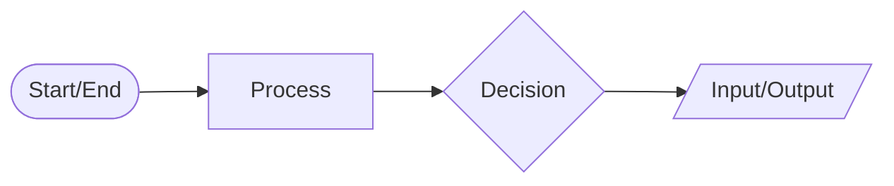
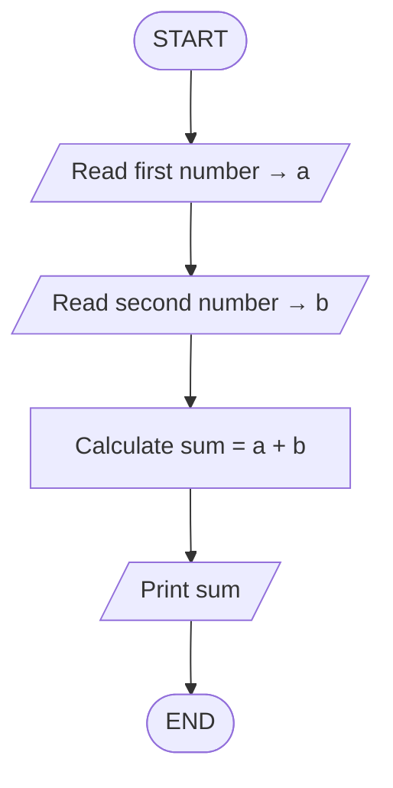
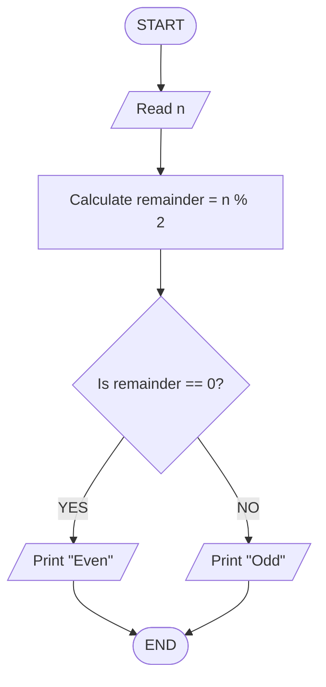
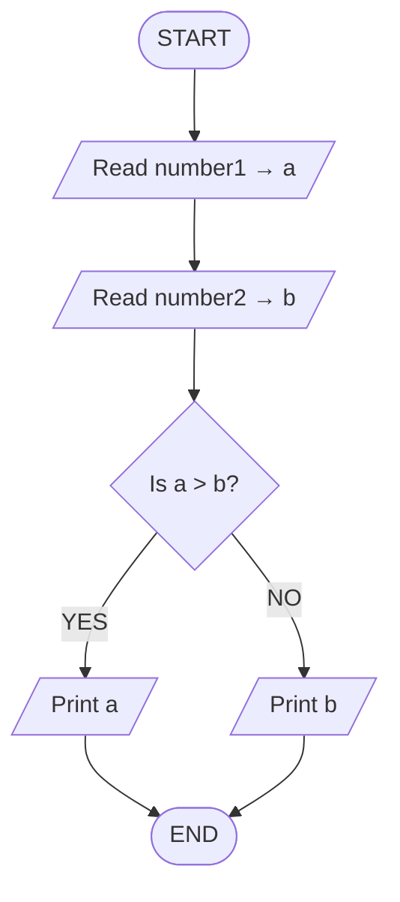
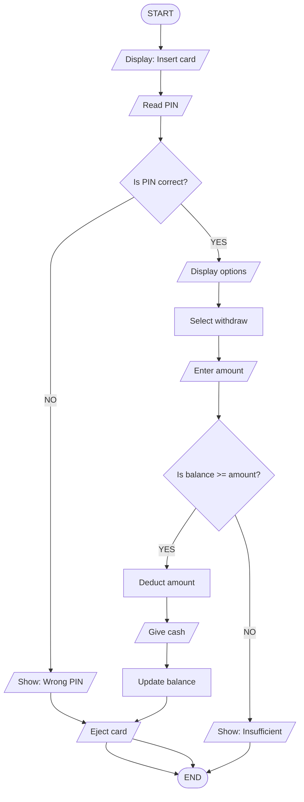
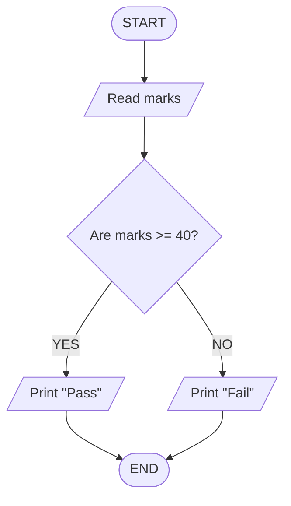
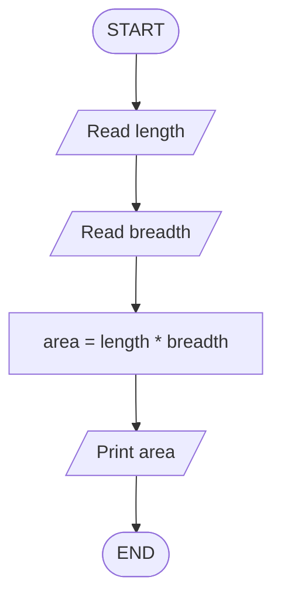
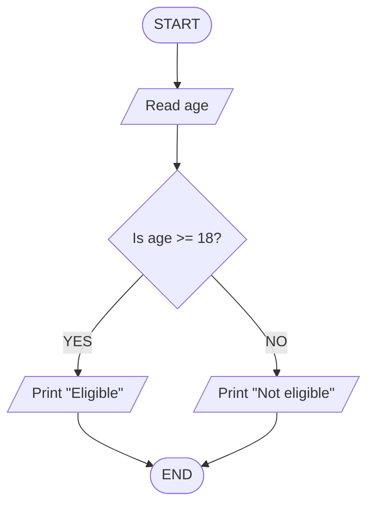
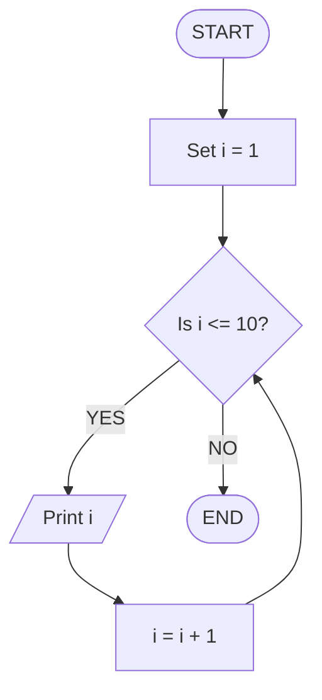

# What Is Programming and What Are Computers?

## Introduction
To begin with computers is bit overwhelming and challenging if you have not grown up with them. It may looks like everyone else knows exactly what they are doing while we are just starting out.

**Take Step Back and Relax.**

Consider the simple act of cooking rice. We follow specific steps: wash rice, add water, place on the stove, wait, and it's ready. Programming is fundamentally the same - it is simply the act of giving steps to a machine. If we can follow a recipe, we can learn programming.

There is no magic or rocket science involved. It is just a series of logical steps. Let's explore this further.

## What Is a Computer?

### Simple Definition:

<div style="border-left:4px solid #15448e;background:rgba(21,68,142,0.08);padding:0.6rem 1rem;border-radius:0 0.5rem 0.5rem 0;margin:1.25rem 0">

📘 **Definition.** A computer is a machine that follows instructions.

</div>

That is the core definition. Nothing more, nothing less.

Think of it like this:

> - A fan follows one instruction: `"Rotate when switch is ON"`
> - A tubelight follows one instruction: `"Glow when switch is ON"`
> - A computer? It can follow millions of instructions, one after another, at incredible speed.


So Basically Computer is:
> - A machine that follows instructions
> - Extremely Fast
> - ZERO brain of its own.


To give Analogy: **The Obedient Servant**

Imagine a servant who:

> - Never gets tired
> - Never forgets
> - Does exactly what is asked (neither more nor less)
> - Works extremely fast
> - But... has **zero** brain of their own
>

If instructed to `bring water`, they bring water.
If instructed to `bring water from the kitchen`, they bring it from the kitchen.
If **we forget to tell them** `in a glass`, they might bring it in their **hands🤣**!

A computer is exactly like this servant. It executes precisely what we tell it to do. If our instructions are wrong, the result will be wrong. The computer will not "think" to fix errors on its own.

Key Concept:

<div style="border-left:4px solid #195045;background:rgba(25,80,69,0.08);padding:0.6rem 1rem;border-radius:0 0.5rem 0.5rem 0;margin:1.25rem 0">

💡 **Insight.** Computer = Fast + Obedient + No Common Sense

</div>


## Hardware vs Software

To understand how a computer functions, we simply need to distinguish between its physical and non-physical components.

### What Is Hardware?

Hardware refers to the parts we can **touch and see**.

Examples:

- The screen (Monitor)
- The keyboard
- The mouse
- The CPU cabinet
- The internal wires and fans

A simple way to remember:

- **"Hard"** ware = Hard things = Physical things.

### What Is Software?

Software refers to the parts we **cannot touch**, yet they are what make the computer work.

Examples:
- WhatsApp
- YouTube
- Games
- Windows
- Calculator

A simple way to remember:

- **"Soft"** ware = Soft things = Non-physical instructions stored inside the computer.

### The Relationship: Body and Soul

Think of it like a human being:

- Body = Hardware (physical)
- Mind/Soul = Software (non-physical, drives the body)

Without the body, the mind has no home.
Without the mind, the body is inert.

Similarly:
- Without hardware, software has nowhere to run.
- Without software, hardware is just an expensive, lifeless box.

When purchasing a new phone:
- The phone itself (screen, battery, camera) is the Hardware.
- The apps and operating system (Android/iOS) inside are the Software.

## The Three Amigos: CPU, RAM, and Storage

Now that we understand the hardware/software distinction, let's look at the three most critical hardware components using a simple analogy: The Study Table.

Imagine a student studying for exams:

1. **The Brain = CPU (Central Processing Unit)**

   - Does all the thinking
   - Solves problems
   - Makes decisions
   - It is the `"brain"` of the computer
   - A faster brain means a faster computer

2. **The Study Table = RAM (Random Access Memory)**

   - Where we keep books we are currently reading
   - Limited space - cannot hold 100 books at once
   - When we close a book and remove it, it leaves the table
   - A bigger table allows working on more things simultaneously

   **Important:** RAM is temporary memory. When the computer switches off, RAM is cleared (like cleaning the table every night).

3. **The Bookshelf = Storage (Hard Disk / SSD)**

   - Where we store all books permanently
   - Even while sleeping, the books remain there
   - Has lots of space compared to the table
   - Slower to access (must walk to the shelf, find the book, and bring it to the table)

   Storage is permanent memory. Even when the computer switches off, the data remains.

### How They Work Together

Consider the process of studying History:

1. The History book is on the Bookshelf (Storage).
2. We bring it to the Table (RAM).
3. The Brain reads and understands it (CPU processes).
4. When finished, the book returns to the shelf, and the table is cleared.

The same process happens in a computer:

1. WhatsApp is stored in the phone's storage.
2. When opened, it loads into RAM.
3. The CPU runs the app and displays messages.
4. When closed, the RAM is freed.

### Why This Matters

- More RAM = Can run more apps simultaneously (bigger table).
- Faster CPU = Apps run faster (smarter brain).
- More Storage = Can keep more photos, videos, and apps (bigger shelf).

## What Is a Program?

We've mentioned `"instructions"` and `"software"`, but what exactly is a program?

Definition:

<div style="border-left:4px solid #15448e;background:rgba(21,68,142,0.08);padding:0.6rem 1rem;border-radius:0 0.5rem 0.5rem 0;margin:1.25rem 0">

📘 **Definition.** A program is a set of instructions that tells the computer what to do.

</div>

That is literally it.

### Analogy: The Recipe

Making Chai (Tea):

1. Take a pan
2. Add water
3. Add tea leaves
4. Boil for 2 minutes
5. Add milk
6. Add sugar
7. Boil again
8. Filter into a cup
9. Serve

This is a `"program"` for making chai. It is a set of step-by-step instructions.

In the computer world:

- Instructions are written in a specific format (programming language).
- The computer reads these instructions.
- It follows them one by one.
- Result: Something happens (an app opens, a game runs, a message is sent).

### Examples of Programs

1. **Calculator App**

   Instructions like: `"When user presses +, add the two numbers"`.

2. **Alarm App**

   Instructions like: `"When time = 6:00 AM, produce a loud sound"`.

3. **WhatsApp**

   Instructions like: `"When user types a message and presses send, transmit this message via the internet"`.

All apps are programs. They are simply sets of instructions.

### Who Writes These Instructions?

Programmers. Also known as:

- Developers
- Coders
- Software Engineers

These are the people who write instructions for computers. This is the skill we are learning.

## What Is a Bug?

Since programs are written by humans, they aren't always perfect.

Definition:

> **A bug is a mistake in the program. When the instructions are wrong, the computer does the wrong thing.**

Remember: The computer has no brain. It just follows instructions. If the instructions are flawed, the output will be flawed.

### The Chai Analogy Revisited

Correct recipe:

1. Add water
2. Add tea leaves
3. Boil
4. Add milk
5. Add sugar

What if we wrote:

1. Add water
2. Add tea leaves
3. Boil
4. Add **SALT** (instead of sugar) `<-- BUG!`
5. Add milk

The chai will taste terrible! But the person following the recipe did nothing wrong. The recipe (program) had a mistake (bug).

### Real Life Bugs

Have we ever seen:

- An app that suddenly closes? (Bug)
- A game that freezes? (Bug)
- A website that shows incorrect information? (Bug)
- An ATM that says `"error"`? (Bug)

All of these happen because a programmer wrote incorrect instructions somewhere.

### Why Is It Called a "Bug"?

Fun fact: In 1947, a computer stopped working. Engineers searched and found a real insect (a moth) stuck inside the machine! They removed the `"bug"` and the computer worked again. The name stuck.

Today, `"bug"` simply means any error or mistake in a program.

### What Is Debugging?

Debugging is the process of finding and fixing bugs.
It is like being a detective—finding what went wrong and correcting it.

As programmers, we spend a lot of time debugging. It is normal. Even the best programmers create bugs. The skill lies in finding and fixing them.

## Why Do Programming Languages Exist?

If instructions are just text, why strictly specific languages?

### The Problem

Computers understand only one language: `0` and `1` (Binary).

Everything for a computer is:

- ON or OFF
- YES or NO
- 1 or 0

This is called Machine Language or Binary.

Example of what a computer actually sees:

```text
01001000 01100101 01101100 01101100 01101111
```

Can we read that? Can we write that?

It is nearly impossible for humans to work with this directly.

### The Solution

Humans created Programming Languages.

These are languages that:

- Are easy for humans to read and write
- Can be converted to 0s and 1s for the computer

They act as a translator between humans and computers.

### Analogy: The Translator

Imagine wanting to talk to someone who speaks only Japanese, but we speak only Hindi.

The solution is a translator in between.

> We speak Hindi → Translator converts to Japanese → Japanese person understands.

Similarly:

> We write in Python → Translator (compiler/interpreter) converts to binary → Computer understands.

### Popular Programming Languages

- Python (Easy to learn, very popular)
- Java (Used in many companies, Android apps)
- C/C++ (Fast, used in games, systems)
- JavaScript (Used in websites)

### Why So Many Languages?

Different jobs require different tools.

- We don't use a hammer to cut vegetables.
- We don't use a knife to hit nails.

Similarly:

- Python is good for AI and data science.
- JavaScript is good for websites.
- C++ is good for games.
- Swift is good for iPhone apps.

But the concepts are the same in all languages. Once we learn one, the others become much easier.

## Real Examples: Everything Is a Program

Let's connect these concepts to the technology we use daily.

### 1. ATM Machine

When using an ATM:

- Insert card → Program instruction: `"Read card details"`
- Enter PIN → Program instruction: `"Check if PIN is correct"`
- Select `"Withdraw 500"` → Program instruction: `"Check balance, if sufficient, dispense 500"`
- Money dispensed → Program instruction: `"Open cash dispenser, release five 100 notes"`

An ATM is just a computer running a program written by a programmer.

### 2. WhatsApp

When sending `"Hi"` to a friend:

- Type `"Hi"` → Program instruction: `"Store text in memory"`
- Press send → Program instruction: `"Connect to internet, find friend's address, send text"`
- Friend receives → Program instruction: `"Show notification, display message in chat"`

WhatsApp is just a program.

### 3. Zomato / Swiggy

When ordering food:

- Open app → Program loads into RAM
- Search `"Biryani"` → Program instruction: `"Find all nearby restaurants serving biryani"`
- Add to cart → Program instruction: `"Store item, calculate price"`
- Pay → Program instruction: `"Connect to bank, transfer money"`
- Order placed → Program instruction: `"Send order details to restaurant"`

### 4. Traffic Lights

Even traffic lights run programs:

> - `"Stay RED for 60 seconds"`
> - `"Then YELLOW for 5 seconds"`
> - `"Then GREEN for 60 seconds"`
> - `"Repeat"`

Everything electronic that does something `"smart"` is running a program.
Someone wrote that program. That someone is a Programmer.

## What Happens When We Run a Program?

Let's trace what happens when opening Instagram:

1. **Step 1: Tap Instagram icon**

   The phone registers the touch (Hardware + Software).

2. **Step 2: Operating System (Android/iOS) responds**

   It sees `"User wants to open Instagram"` and finds the program files in Storage.

3. **Step 3: Instagram code loads into RAM**

   Now it is ready for quick access.

4. **Step 4: CPU starts executing instructions**

   `"Show login screen"` → `"Connect to internet"` → `"Fetch posts"`.

5. **Step 5: Results appear on screen**

   We see the feed with photos and reels.

All of this happens in less than 1-2 seconds because the CPU is incredibly fast, processing millions of instructions per second.

## Where Do We Fit In?

Currently:

> We are Users of programs (using WhatsApp, YouTube, etc.).

After learning programming:

- We will be Creators of programs.
- We will write the instructions.
- Computers will obey our instructions.
- We can build apps, websites, games, and more.

### The Journey

1. First, learn a programming language (how to give instructions).
2. Then, learn DSA (how to give efficient instructions).
3. Then, build projects (put knowledge to use).
4. Finally, get a job and build real products.

We are at step 1. This is exactly where everyone starts.
Tech leaders like Sundar Pichai or Mark Zuckerberg started here. No one is born knowing computers.

## Key Terms Summary

Let's revise what we've covered:

| Term | Simple Meaning |
| --- | --- |
| Computer | Machine that follows instructions |
| Hardware | Physical parts (can touch) |
| Software | Programs/Apps (cannot touch) |
| CPU | Brain of computer (does thinking) |
| RAM | Temporary memory (study table) |
| Storage | Permanent memory (almirah/bookshelf) |
| Program | Set of instructions for computer |
| Programmer | Person who writes programs |
| Bug | Mistake in a program |
| Debugging | Finding and fixing bugs |
| Binary | Computer's language (0s and 1s) |
| Programming Lang | Human-readable way to write instructions |
| Operating System | Main software that manages computer (Windows/iOS) |

## Exercise: Self-Explanation

Try to explain these concepts in your own words (in Hindi or your native language if easier):

1. What is a computer?
2. What is the difference between hardware and software?
3. What does the CPU do? What does RAM do? What does Storage do?
4. What is a program?
5. What is a bug?
6. Why do programming languages exist?
7. Give 3 examples of programs used daily.

If not understood this part, reading it again is a great way to reinforce the concepts.


# Flowcharts and Logical Thinking

**Solving Problems Before Coding**

We learned **what** programming is.
Now we will learn **how** to think like a programmer.

Before writing code, we must think. Flowcharts help us think clearly. Let's begin.

## Why Flowcharts Before Code?

The golden rule:

<div style="border-left:4px solid #195045;background:rgba(25,80,69,0.08);padding:0.6rem 1rem;border-radius:0 0.5rem 0.5rem 0;margin:1.25rem 0">

💡 **Insight.** Think Before We Code.

</div>

Just like:

- We plan a trip before traveling.
- We plan a meal before cooking.
- We measure before cutting wood.
- We must plan our program before writing code.

### Analogy: Building a House

If asked to build a house, what is done first?

- **Wrong way:** Start digging and building randomly.
- **Right way:** First make a blueprint (map/plan) of the house.

Similarly:

- **Wrong way:** Start writing code immediately.
- **Right way:** First make a flowchart (blueprint/plan) of the program.

### Why This Matters

- Makes us think clearly
- Shows mistakes **before** writing code
- Easy to explain to others
- Language doesn't matter (same flowchart works for Python, Java, C++)
- Visual = Easier to understand

### Real Life Example

Imagine we want to make a program that tells if a student passed or failed.

If we start coding directly:

- We might make mistakes
- We might get confused
- Code might not work
- We might waste hours

If we draw a flowchart first:

- We think: `"What are the steps?"`
- We see: `"Check marks > 40? If yes pass, if no fail"`
- Clear and simple
- Then code becomes easy

The bridge between problem and code:

> Problem (in English) → Flowchart (Visual Plan) → Code (Instructions)

We are learning the middle step today. Very important!

## What Is a Flowchart?

Simple Definition:

<div style="border-left:4px solid #15448e;background:rgba(21,68,142,0.08);padding:0.6rem 1rem;border-radius:0 0.5rem 0.5rem 0;margin:1.25rem 0">

📘 **Definition.** A flowchart is a diagram that shows the steps to solve a problem.

</div>

It uses:

- Boxes (to show actions)
- Diamonds (to show decisions/questions)
- Arrows (to show direction/flow)

It's like a map for our program.

### Everyday Example: Making Tea

Written steps:

1. Take pan
2. Add water
3. Add tea leaves
4. Boil
5. Add milk
6. Add sugar
7. Serve

In flowchart form, this becomes visual with boxes and arrows.
Much easier to follow!

### Another Example: ATM Withdrawal

Written steps:

1. Insert card
2. Enter PIN
3. Is PIN correct?
4. If YES: Continue
5. If NO: Reject card
6. Select withdraw
7. Enter amount
8. Is balance enough?
9. If YES: Give money
10. If NO: Show error
11. Take card back

Notice how decisions (questions) appear? That's what flowcharts show clearly!

## Flowchart Symbols: The Building Blocks

Just like alphabets make words, symbols make flowcharts.

Here are the main symbols we need to know:

### 1. START/END (Oval/Ellipse)

**Symbol:** Oval shape

**Meaning:** Beginning or end of the process

Used for:

- `"Start"` - Entry point
- `"Stop"` or `"End"` - Exit point

Easy way to remember:

- START = Where we begin (like START button on phone)
- END = Where we finish (like END call button)

Example: Every flowchart starts with START and ends with END.

### 2. PROCESS (Rectangle)

**Symbol:** Rectangle box

**Meaning:** Doing something / Performing an action

Used for:

- Calculations (add, subtract, multiply)
- Assigning values (`set x = 5`)
- Any action step

Easy way to remember:

> Rectangle = Regular work = Process

Examples:

- `"Add 5 to x"`
- `"Calculate total = price * quantity"`
- `"Print 'Hello'"`
- `"Read user input"`

### 3. DECISION (Diamond)

**Symbol:** Diamond shape

**Meaning:** Asking a question / Making a decision

Used for:

- Yes/No questions
- Checking conditions
- If-else decisions

Easy way to remember:

> Diamond = Decision = Question = Two paths (YES or NO)

Examples:

- `"Is age >= 18?"` (YES or NO)
- `"Is password correct?"` (YES or NO)
- `"Is number > 0?"` (YES or NO)

**Important:** Diamond always has **two exits**:

- One for YES/TRUE
- One for NO/FALSE

### 4. INPUT/OUTPUT (Parallelogram)

**Symbol:** Parallelogram - slanted rectangle

**Meaning:** Getting data (input) OR showing data (output)

Used for:

- Reading input from user (input)
- Displaying results to user (output)

Easy way to remember:

> Parallelogram = Data coming in or going out

Examples:

- `"Read age from user"` (INPUT)
- `"Print result"` (OUTPUT)
- `"Get password"` (INPUT)
- `"Show message"` (OUTPUT)

### 5. ARROWS (Flow Lines)

**Symbol:** Arrow lines

**Meaning:** Direction of flow / What comes next

Used for:

- Connecting all boxes
- Showing the order of steps
- Always goes from one box to next

Easy way to remember:

> Arrow = Next step = Flow direction

**Important:** Flow usually goes:

- Top to bottom
- Left to right

Arrows show where to go next.

### Diagram 1: Flowchart Symbols



| Symbol | Shape | Meaning | Example |
| --- | --- | --- | --- |
| Start/End | Oval | Beginning or end | START, STOP |
| Process | Rectangle | Do something | Add 5 to x |
| Decision | Diamond | Ask question | Is x > 10? |
| Input/Output | Parallelogram | Get or show data | Read age, Print result |
| Arrow | Line | Next step | Flow direction |

## Reading Flowcharts: Learning by Examples

### Example 1: Simple Addition Program



Flowchart:

> START → [Read first number → a] → [Read second number → b] → [Calculate sum = a + b] → [Print sum] → END

Explanation:

- Start at START
- Read first number, store in `a`
- Read second number, store in `b`
- Add `a` and `b`, store result in `sum`
- Show the sum to user
- End

This is a **sequential** flowchart - steps go one after another, no decisions.

### Example 2: Check If Number Is Even or Odd



Flowchart Logic:

> START → [Read n] → [Calculate remainder = n % 2] → Is remainder == 0?

- YES: [Print `"Even"`]
- NO: [Print `"Odd"`]
- END

Explanation:

- Start
- Read number `n`
- Calculate remainder when dividing `n` by `2`
- Ask: Is remainder equal to `0`?
- If YES: Number is even (print `"Even"`)
- If NO: Number is odd (print `"Odd"`)
- End

This has a **decision** (diamond) - the flowchart splits into two paths.

### Example 3: Finding Maximum of Two Numbers



Flowchart Logic:

> START → [Read number1 → a] → [Read number2 → b] → Is a > b?

- YES: [Print `a`]
- NO: [Print `b`]
- END

Explanation:

- Start
- Read two numbers: `a` and `b`
- Check: Is `a` greater than `b`?
- If YES: `a` is maximum (print `a`)
- If NO: `b` is maximum (print `b`)
- End

Notice: After decision, both paths meet again at END.

### Example 4: ATM Withdrawal (More Complex)



Flowchart Logic:

> START → [Display `"Insert card"`] → [Read PIN] → Is PIN correct?

- YES: [Display options] → [Select withdraw] → [Enter amount] → Is balance >= amount?
- YES: [Deduct amount] → [Give cash] → [Update balance] → [Eject card] → END
- NO: [Show `"Insufficient"`] → END
- NO: [Show `"Wrong PIN"`] → [Eject card] → END

Explanation:

- Multiple decisions
- Multiple paths
- Some paths lead to END early (if PIN wrong or balance low)
- Shows real-world complexity

## Drawing Our First Flowchart: Step by Step

Problem: Check if a student passed (`marks >= 40`) or failed.

### Step 1: Understand the Problem

- **Input:** Student's marks
- **Process:** Check if marks >= 40
- **Output:** Pass or Fail

### Step 2: Break into Steps

1. Start
2. Get marks from user
3. Check if marks >= 40
4. If YES: Pass
5. If NO: Fail
6. End



### Step 3: Verify with Examples

- Test Case 1: marks = 50 → Is 50 >= 40? → YES → Print `"Pass"` ✓
- Test Case 2: marks = 30 → Is 30 >= 40? → NO → Print `"Fail"` ✓
- Test Case 3: marks = 40 → Is 40 >= 40? → YES → Print `"Pass"` ✓

## Common Patterns in Flowcharts

### Pattern 1: Sequential (Linear)

Steps happen one after another, no decisions.

Example: Calculate area of rectangle



Flow:

> Straight line, top to bottom

### Pattern 2: Conditional (Decision Making)

Has at least one decision (diamond).

Example: Check if eligible to vote



Flow:

> Splits into branches, then joins

### Pattern 3: Loop (Repetition)

Repeats some steps multiple times.

Example: Print numbers from 1 to 10



Flow:

> Has a `"back arrow"` that goes back to previous step

## Problem-Solving Approach: The 5-Step Method

When we get **any** problem, let's follow these steps:

### Step 1: Understand the Problem

Read carefully. Ask:

- What is the input?
- What is the output?
- What needs to be done?

### Step 2: Break into Smaller Steps

Don't think about the whole problem. Break it into tiny pieces.

### Step 3: Draw the Flowchart

Use symbols. Connect with arrows. Show decisions clearly.

### Step 4: Verify with Examples

Test the flowchart with different inputs:

- Normal case (example: 5, 10, 3 → max is 10)
- Edge case (example: 5, 5, 5 → all same)
- Edge case (example: -5, -10, -3 → all negative)

If all cases work, the flowchart is correct.

### Step 5: Then Write Code (Future)

Once the flowchart is correct, writing code becomes easy. We just translate flowchart to code syntax.

Remember:

<div style="border-left:4px solid #195045;background:rgba(25,80,69,0.08);padding:0.6rem 1rem;border-radius:0 0.5rem 0.5rem 0;margin:1.25rem 0">

💡 **Insight.** Flowchart first, code second. Always.

</div>

## Tools for Drawing Flowcharts

### Method 1: Pen and Paper (Best to Start)

Why?

- Fast
- No software needed
- Easy to erase and redraw
- Good for practice

Start here. Don't jump to software immediately.

### Method 2: Draw.io (Online, Free)

Website: `draw.io` or `diagrams.net`

- Free to use
- Drag and drop symbols
- Clean and professional

## Flowcharts vs Pseudocode

### What Is Pseudocode?

Pseudocode = English-like steps that look like code, but not actual code.

### Flowchart vs Pseudocode

| Aspect | Flowchart | Pseudocode |
| --- | --- | --- |
| Format | Visual (boxes, arrows) | Text (words, lines) |
| Best for | Visual learners | Text-based thinkers |
| Showing flow | Excellent | Good |
| Showing logic | Good | Excellent |
| Drawing speed | Slower | Faster |

### When to Use What

- Simple problems: Either works
- Complex decisions: Flowchart (visual helps)
- Complex calculations: Pseudocode (text is clearer)
- Learning: Flowchart (builds visual thinking)

## Common Mistakes in Flowcharts

### Mistake 1: Missing START or END

- **Wrong:** Just boxes, no START/END
- **Right:** Every flowchart **must** have START and END

### Mistake 2: Unlabeled Arrows

- **Wrong:** Decision diamond has two arrows, but no labels
- **Right:** Always label decision arrows as `"YES"` and `"NO"`

### Mistake 3: Dead End

- **Wrong:** Some path leads to empty space
- **Right:** Every path must eventually reach END

### Mistake 4: No Flow Direction

- **Wrong:** Arrows missing, boxes just placed randomly
- **Right:** Clear arrows showing top-to-bottom, left-to-right flow

## Real-World Applications

### Why Companies Value This Skill

- Shows clear thinking
- Helps in team communication
- Reduces errors before coding
- Saves time and money

We are learning a professional skill, not just an academic exercise!

## Exercise: Test Yourself

Try to draw flowcharts for these problems:

1. Check if number is positive
2. Calculate area of circle (`area = π * r * r`)
3. Login system (Username `"admin"`, Password `"1234"`)
4. Check leap year

Try these yourself first. Then check logic.

## Summary

What you have learned in this article:

- Why flowcharts come before code
- What a flowchart is
- All flowchart symbols (Start/End, Process, Decision, Input/Output, Arrow)
- How to read and draw flowcharts
- Common patterns and the 5-step problem-solving approach
- Flowcharts vs Pseudocode

Most Important Points:

> - **Always think before coding** - draw flowchart first
> - Use correct symbols (diamond for decision, rectangle for process)
> - Every flowchart needs START and END
> - Label all decision paths (YES/NO)
> - Test with examples before moving to code

Flowcharts are our friend. They make coding 10x easier. Master this skill, and programming becomes smooth.

In the next part, we'll start with the actual programming language!

