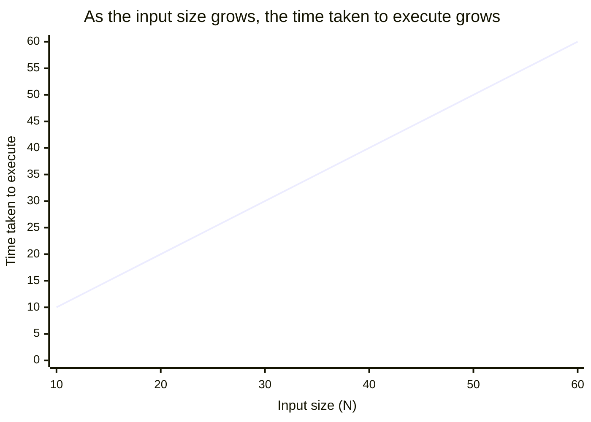

# Understanding Time and Space Complexity

In software engineering, every algorithm possesses a certain level of complexity, which is crucial in determining its efficiency. Complexity is typically measured in two ways:

- **Time Complexity:** The amount of time an algorithm takes to complete as a function of the input size. It provides a way to quantify the efficiency of an algorithm by expressing how the execution time grows as the input size increases.
- **Space Complexity:** The amount of memory an algorithm uses as a function of the input size. It accounts for the total amount of space required by the algorithm, including the space used by variables, data structures, and function call stacks.

Understanding both time and space complexity is essential for writing optimized code, as it helps in choosing the most efficient algorithm for a given problem. Efficient algorithms not only reduce the time taken to execute but also minimize the resources required, which is especially important in large-scale applications and systems with limited resources.

## Time Complexity

When code is executed, it undergoes several stages, from being written in an Integrated Development Environment (IDE) to running on a server. During this process, the code takes a certain amount of time to execute.

<div style="border-left:4px solid #da5233;background:rgba(218,82,51,0.08);padding:0.6rem 1rem;border-radius:0 0.5rem 0.5rem 0;margin:1.25rem 0">

⚠️ **Watch out.** However, the actual time taken to run the code cannot be solely relied upon to determine time complexity due to factors like server specifications and environmental conditions.

</div>

As the size of the input increases, the time taken by the program to execute also increases. This relationship between input size and execution time is fundamental in understanding time complexity.



## Rate of Change and Time Complexity

The rate of change in the execution time as the input size increases can be expressed as:

(input2 - input1) / (time2 - time1)

This rate of change is what defines the time complexity of an algorithm.

<div style="border-left:4px solid #15448e;background:rgba(21,68,142,0.08);padding:0.6rem 1rem;border-radius:0 0.5rem 0.5rem 0;margin:1.25rem 0">

📘 **Definition.** Time complexity is often measured using Big O notation, which provides an upper bound on the time taken as a function of the input size.

</div>

## Example: Measuring Time Complexity with Big O

Consider a simple example involving a single for loop:

```java
for (int i = 0; i < 5; i++) {
    // some constant time operation
}
```

In this case, the time complexity is O(5), because the loop runs five times regardless of the input size. However, when the loop runs N times (where N is the input size), the time complexity is O(N).

The thought process here involves understanding how the number of operations scales with the input size. If the number of operations is directly proportional to the input size, then the time complexity is linear, denoted as O(N).

## Rules for Solving Time Complexity

- **Avoid Constants:** When calculating time complexity, constant factors are ignored. For example, in the loop mentioned above, O(5) is simplified to O(1) since the constant does not change with the input size.
- **Consider the Worst Case:** Time complexity analysis typically considers the worst-case scenario, as this provides a guarantee on the maximum time an algorithm will take. For instance, in searching algorithms, the worst case occurs when the desired element is at the last position or not present at all.

<div style="border-left:4px solid #195045;background:rgba(25,80,69,0.08);padding:0.6rem 1rem;border-radius:0 0.5rem 0.5rem 0;margin:1.25rem 0">

💡 **Insight.** The focus is on how the algorithm scales, not on fixed numbers.

</div>

## Other Ways to Measure Time Complexity

Beyond Big O, time complexity can also be measured using Theta (Θ) and Omega (Ω):

- **Big O notation:** Represents the worst-case time complexity i.e. the upper bound
- **Theta notation (Θ):** Represents the average-case time complexity
- **Omega notation (Ω):** Represents the best-case time complexity i.e. the lower bound

## Example: Analyzing Time Complexity with Big O

Consider the following examples to understand how to measure time complexity using Big O notation:

### Example 1: Simple For Loop

```java
for (int i = 0; i < N; i++) {
    // some constant time operation
}
```

This loop runs N times, and each iteration performs a constant-time operation (e.g., addition, subtraction). The time complexity for this code is O(N) because the execution time scales linearly with the input size N.

### Example 2: Nested For Loop

```java
for (int i = 0; i < N; i++) {
    for (int j = 0; j < N; j++) {
        // some constant time operation
    }
}
```

Here, the outer loop runs N times, and for each iteration of the outer loop, the inner loop also runs N times. This results in a total of N * N = N2 operations. Therefore, the time complexity is O(N2), indicating a quadratic relationship between the input size and execution time.

### Example 3: Loop with Logarithmic Time Complexity

```java
for (int i = 1; i < N; i = i * 2) {
    // some constant time operation
}
```

In this example, the loop variable i is doubled each time, leading to a logarithmic growth in the number of iterations. The loop runs approximately log2(N) times, making the time complexity O(log N). This type of complexity is common in algorithms like binary search.

### Example 4: Constant Time Operation

```java
int sum = a + b;
```

This operation takes a fixed amount of time, regardless of the input size. The time complexity is O(1), indicating constant time.

### Example 5: Loop with Early Exit (Worst-Case Analysis)

```java
for (int i = 0; i < N; i++) {
    if (arr[i] == target) {
        break;
    }
}
```

In this loop, the best-case scenario occurs when the target is found on the first iteration, giving a time complexity of O(1). However, in the worst case, the target is either at the end or not present, requiring the loop to run N times, making the time complexity O(N). When analyzing algorithms, the worst-case scenario is typically used to ensure reliable performance.

Placing the examples above side by side shows how each shape of loop lands in a different complexity class, from cheapest to most expensive:

```d2
direction: right

classes: {
  cheap:  {style: {fill: "#dcfce7"; stroke: "#16a34a"}}
  ok:     {style: {fill: "#dbeafe"; stroke: "#2563eb"}}
  costly: {style: {fill: "#ffedd5"; stroke: "#ea580c"}}
  bad:    {style: {fill: "#fee2e2"; stroke: "#dc2626"}}
}

c1: "O(1) — constant\n\nint sum = a + b;\n(Example 4)" {class: cheap}
clog: "O(log N) — logarithmic\n\ni = i * 2\n(Example 3)" {class: ok}
cn: "O(N) — linear\n\nsingle for loop\n(Examples 1 & 5 worst case)" {class: costly}
cn2: "O(N²) — quadratic\n\nnested for loop\n(Example 2)" {class: bad}

c1 -> clog -> cn -> cn2: {style: {stroke: "#6b7280"}}
```

## Space Complexity

Space complexity measures the amount of memory an algorithm requires as a function of the input size. It is a critical aspect of algorithm efficiency, especially in memory-constrained environments. Space complexity can be broken down into two main components:

- **Auxiliary Space:** This refers to the extra space or temporary space used by the algorithm, apart from the input data. It includes variables, data structures, and function call stacks that the algorithm utilizes during execution.
- **Input Space:** This is the memory occupied by the input data itself. In many cases, the input space is considered negligible when analyzing space complexity, as it is independent of the algorithm's operations.

### Examples of Space Complexity

- **Array of Size N:** Consider an array with N elements. The space complexity in this case is O(N), as the memory required scales linearly with the number of elements in the array.
- **Recursive Function:** For a recursive algorithm, the space complexity is determined by the call stack, which grows with the depth of the recursion. For a recursive function that calls itself N times, the space complexity is O(N).

## Conclusion

Understanding time and space complexity is fundamental to evaluating and optimizing algorithms. Time complexity provides insight into how the execution time of an algorithm scales with input size, while space complexity measures the memory usage. By analyzing these complexities, one can choose the most efficient algorithm for a given problem, ensuring that both time and resources are used effectively.

Note : For a deeper understanding, users are encouraged to test their knowledge by analyzing different algorithms and comparing their complexities. Video editorial attached above can provide additional insights and help validate the analyses.
