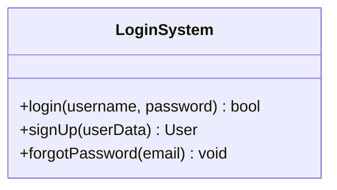
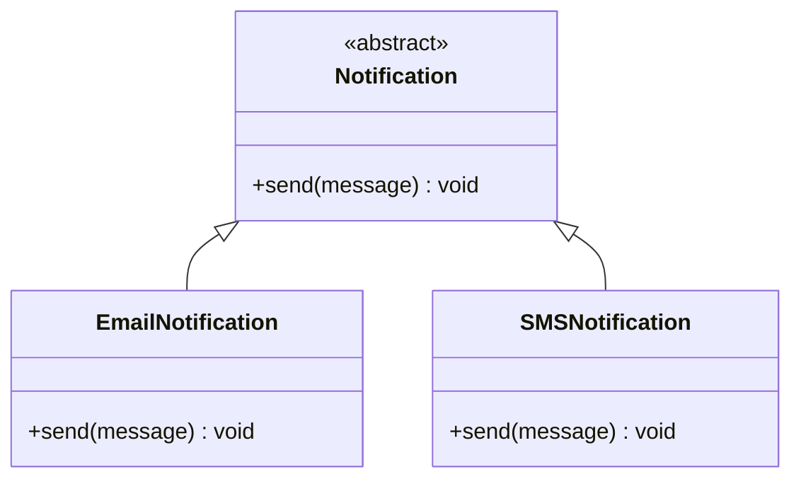

# Introduction to Low-Level Design

## The house analogy

Let us understand this with a simple real-life example. Think of building a house:

- **High-Level Design (HLD)** is like the architect's blueprint — it says where the rooms will be, how big they are, and how they're connected.
- **Low-Level Design (LLD)** is like deciding where the switches go, how the plumbing is laid out, what materials to use, and so on.

So LLD is all about the small, detailed planning you do before actually building the house (or writing code).

## What LLD actually means

A formal definition of Low-Level Design (LLD) goes like this:

LLD is where your code starts to take shape. It's a crucial phase in the software development lifecycle that focuses on the detailed design of individual components or modules of a system.

It involves specifying the internal structure, algorithms, and data structures that will be used to implement the system's functionality. It also acts as a bridge between high-level design and actual coding.

<div style="border-left:4px solid #15448e;background:rgba(21,68,142,0.08);padding:0.6rem 1rem;border-radius:0 0.5rem 0.5rem 0;margin:1.25rem 0">

📘 **The bridge.** HLD decides *what* the modules are and how they connect; LLD decides *how* each module is built — the classes, methods, and data structures. LLD is the step that turns an architecture into something you can actually code.

</div>

```d2
hld: "High-Level Design (HLD)\nmodules · architecture · how they connect" { shape: rectangle }
lld: "Low-Level Design (LLD)\nclasses · methods · data structures · algorithms" { shape: rectangle }
code: "Code\nthe actual implementation" { shape: rectangle }
hld -> lld: "refines into"
lld -> code: "guides"
```

## A concrete example

A simple example of LLD would be a basic login system for a website. Here, LLD would involve designing the individual components — like `login()`, `signUp()`, and `forgotPassword()` — along with their internal behavior.



That class-with-methods view is exactly what LLD produces: not "we need authentication," but *which* class handles it and *what* each method does.

## Key characteristics of LLD

### Granular and code-level

LLD dives deep into the fine details of how each component will function. It defines classes, functions, variables, and data structures.

For example, instead of just saying "we need user authentication," LLD shows how it's built — what classes handle it, what methods validate login, and what happens on failure.

### Implementation-focused

LLD is directly linked to how the actual code will be written. It acts as a blueprint for developers, guiding the logic, flow, and structure of modules. It often includes pseudocode, flow diagrams, and sequence diagrams that show real-time data flow between functions.

### Applies OOP principles

LLD makes heavy use of Object-Oriented Programming (OOP) concepts like classes, inheritance, abstraction, encapsulation, and polymorphism. This helps build modular, reusable, and maintainable systems.

For example, a base `Notification` class might have subclasses like `EmailNotification` and `SMSNotification`, using inheritance and polymorphism so each subtype defines its own way to `send()`.



Note that in LLD, the stakeholders are primarily the people directly involved in the actual implementation of the system — senior software developers, technical leads, managers, and the like.

## HLD vs. LLD

| Aspect | High-Level Design (HLD) | Low-Level Design (LLD) |
| --- | --- | --- |
| Purpose | System overview & modules | Detailed implementation & logic |
| Level of detail | Abstract | Highly detailed |
| Focus | Architecture, modules, interfaces | Class diagrams, methods, details |
| Outcome | Modules, system diagrams | Detailed class/method diagrams |

## Why LLD matters

Beyond its role in the software development lifecycle and its high demand for senior roles, Low-Level Design is crucial for several reasons:

- **Avoids rework:** Clearly defined logic and structure help catch design issues early, reducing costly changes during development.
- **Improves collaboration:** Acts as a shared reference for teams, ensuring everyone understands component behavior and integration points.
- **Promotes scalability:** Well-designed, modular components can handle growth and new features without major redesign.
- **Encourages best practices:** Enforces clean code, design patterns, and OOP principles, leading to maintainable and robust systems.

## Software design principles

Software design principles are guidelines that help developers create systems that are easy to understand, maintain, and extend. These principles can be applied at both the high-level and low-level design stages. Here are three cornerstone principles:

- DRY — Don't Repeat Yourself
- KISS — Keep It Simple, Stupid
- YAGNI — You Aren't Gonna Need It

<div style="border-left:4px solid #195045;background:rgba(25,80,69,0.08);padding:0.6rem 1rem;border-radius:0 0.5rem 0.5rem 0;margin:1.25rem 0">

💡 **Insight.** DRY, KISS, and YAGNI all push in the same direction — less duplication, less complexity, and less speculative code — so the system stays easy to change. Each also has a point past which applying it *hurts*, which is why the sections below cover when *not* to use them.

</div>

Let's understand each principle in detail.

### DRY — Don't Repeat Yourself

This principle states that every piece of knowledge must have a single, unambiguous, authoritative representation within a system. In simple terms: avoid duplicating logic or code. Repeating code makes the system hard to maintain and error-prone — if a change is required, you might forget to update all the occurrences.

**Why it helps.**

- Reduces redundancy
- Easier maintenance
- Single point of change

First, consider a bad example that violates the DRY principle:

```java
import java.util.*;
class Main {
    public static void main(String[] args) {
        int length1 = 10, width1 = 5;
        int area1 = length1 * width1;
        System.out.println("Area1: " + area1);

        int length2 = 8, width2 = 4;
        int area2 = length2 * width2;
        System.out.println("Area2: " + area2);
    }
}
```

The logic for calculating the area is repeated. If we need to change it, we have to do it in multiple places.

Now let's refactor to follow the DRY principle:

```java
import java.util.*;
class AreaCalculator {
    public static int calculateArea(int length, int width) {
        return length * width;
    }
}

class Main {
    public static void main(String[] args) {
        int area1 = AreaCalculator.calculateArea(10, 5);
        int area2 = AreaCalculator.calculateArea(8, 4);

        System.out.println("Area1: " + area1);
        System.out.println("Area2: " + area2);
    }
}
```

Now the area logic lives in a single method, `calculateArea`. If the logic changes, we update it in exactly one place.

**Applying DRY in practice.**

- Identify repetitive code and replace it with a single, reusable segment.
- Extract common functionality into methods or utility classes.
- Leverage libraries and frameworks when available.
- Refactor duplicate logic regularly across classes or layers.

**When *not* to use DRY.**

- **Premature abstraction:** Don't extract common code too early. Two blocks might *look* similar now but evolve differently later; merging them creates unnecessary coupling between unrelated parts.
- **Performance-critical code:** Sometimes repeating optimized low-level logic is faster than calling a generalized method. Function calls, indirection, or generic wrappers can reduce performance or block compiler optimizations like inlining.
- **Sacrificing readability:** If extracting repeated code makes it less readable, prefer clarity over DRYness.
- **Legacy codebases:** Legacy code may lack tests or complete documentation, so extracting shared logic can accidentally change behavior. Follow the "leave it alone unless you must touch it" rule.

<div style="border-left:4px solid #da5233;background:rgba(218,82,51,0.08);padding:0.6rem 1rem;border-radius:0 0.5rem 0.5rem 0;margin:1.25rem 0">

⚠️ **Watch out.** The most common DRY mistake is applying it too early. Code that merely *looks* the same is not the same thing as code that *is* the same — deduplicating on appearance couples parts that should have stayed independent, and you pay for it when they need to diverge.

</div>

### KISS — Keep It Simple, Stupid

This principle states that simplicity should be a key goal in design, and unnecessary complexity should be avoided. In simple terms: use the simplest solution that works. Avoid clever, convoluted code.

**Why it helps.**

- Easier debugging
- Improved readability
- Better maintainability
- Faster development

Suppose we're writing code to check whether a number is even. Compare a bad (overengineered) version with a good (simple) one.

Bad — too complex:

```java
import java.util.*;

// ⚠️ ANTI-PATTERN — this is the version we are about to fix. Do not copy it.
class NumberUtils {

    public static boolean isEven(int number) {
        // Using unnecessary logic to determine evenness
        boolean isEven = false;

        if (number % 2 == 0) {
            isEven = true;
        } else {
            isEven = false;
        }

        return isEven;
    }
}

// ── Driver ──────────────────────────────────────────────
class Main {
    public static void main(String[] args) {
        System.out.println("isEven(4) = " + NumberUtils.isEven(4));
        System.out.println("isEven(7) = " + NumberUtils.isEven(7));
        System.out.println("Violation: extra variable + redundant if-else instead of one boolean expression (KISS)");
    }
}
```

This is bad because it uses an extra variable, adds unnecessary if-else logic, and makes the code longer and harder to follow.

Good — simple and clear:

```java
import java.util.*;

class NumberUtils {

    public static boolean isEven(int number) {
        return number % 2 == 0;
    }
}

// ── Driver ──────────────────────────────────────────────
class Main {
    public static void main(String[] args) {
        System.out.println("isEven(4) = " + NumberUtils.isEven(4));
        System.out.println("isEven(7) = " + NumberUtils.isEven(7));
    }
}
```

This is good because it's a simple one-liner, easy to read, and avoids overengineering.

### YAGNI — You Aren't Gonna Need It

This principle states: "Always implement things when you actually need them, never when you just foresee that you need them." In simple terms, don't add functionality until it's necessary. Avoid building features you *think* you might need in the future — it keeps the codebase clean and reduces unnecessary complexity.

For example, suppose you've been asked to build a note-taking app that lets users create and view notes. You start thinking ahead: "What if later they want categories? Or tagging? Or syncing with Google Drive? I should prepare for that!" That line of thinking creates a lot of unnecessary complexity and wasted time.

**Why it helps.**

- Reduced waste
- Simplified codebase
- Faster development

**When *not* to use YAGNI.**

- **When the requirements are well known:** If a feature is guaranteed and coming soon, preparing for it now can be more efficient. For example, if your messaging service currently supports only text but the product team has committed to image support in two sprints, designing your data model to handle attachments now might save significant refactoring later.
- **Performance-critical areas:** In systems where performance is a first-class concern, preemptively building and testing real-world usage patterns can catch bottlenecks early.

## Summary

- **LLD** is the detailed, code-level design that bridges high-level architecture and actual implementation — it defines the classes, methods, data structures, and algorithms.
- It differs from **HLD**: HLD is the abstract, module-level view of a system; LLD is the concrete, class-and-method-level view.
- It matters because it catches design issues early, gives teams a shared reference, and keeps systems modular and scalable.
- Three principles keep LLD clean: **DRY** (one authoritative representation for each piece of logic), **KISS** (the simplest solution that works), and **YAGNI** (build only what you need now) — each with real exceptions where applying it blindly does more harm than good.
