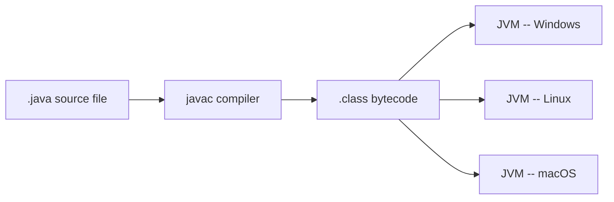
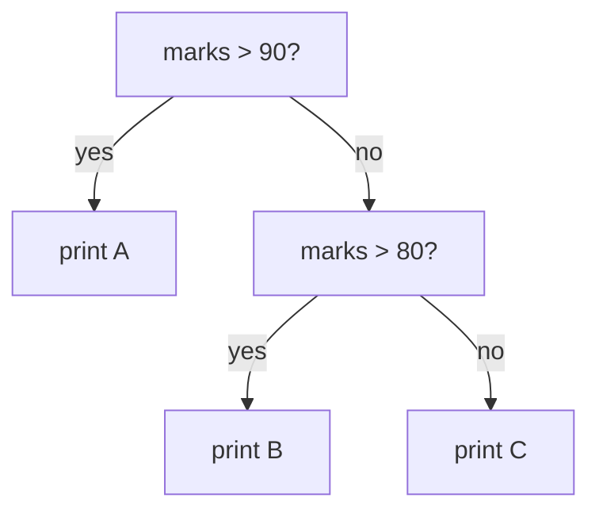

# Java Basics

## Write Once, Run Anywhere

Java is a high-level, class-based, object-oriented programming language that is designed to have as few implementation dependencies as possible. It is a general-purpose programming language intended to let application developers write once, run anywhere (WORA), meaning that compiled Java code can run on all platforms that support Java without the need for recompilation.



The compiler never targets a specific operating system -- it targets the JVM. Any machine with a JVM installed can run the same `.class` bytecode, which is what "write once, run anywhere" means in practice.

## Sample Code

Let's look at the most basic Java program: Hello World.

```java
public class Main {
    public static void main(String[] args) {
        System.out.println("Hello World");
    }
}
```

### Understanding the parts

- `class Main`: Everything in Java happens inside a class. We define a class named "Main". Ideally, the file name should also be `Main.java`.
- `public static void main(String[] args)`: This is the entry point.
  - `public`: Access modifier, means it can be accessed from anywhere.
  - `static`: It can be run without creating an object of the class.
  - `void`: It does not return any value.
  - `main`: The name of the method.
  - `String[] args`: Command line arguments. We can pass inputs to the program when running it from the command line.
- `System.out.println`: The command to print output to the screen. `println` means "print line", so it moves to a new line after printing.

## Comments

Comments are ignored by the computer. They are for humans to read.

```java
// This is a single line comment

/*
   This is a
   multi-line comment
*/
```

## Data Types

Java has 8 primitive data types to store different values.

| Type | Size | Description |
| --- | --- | --- |
| `byte` | 1 byte | Small integers (-128 to 127) |
| `short` | 2 bytes | Integers |
| `int` | 4 bytes | Integers (most common) |
| `long` | 8 bytes | Large integers |
| `float` | 4 bytes | Decimals (needs `f` suffix, e.g., `3.14f`) |
| `double` | 8 bytes | Decimals (most common for fractions) |
| `char` | 2 bytes | Single character (e.g., `'A'`) |
| `boolean` | 1 bit | `true` or `false` |

## Operators

### Arithmetic Operators

| Operator | Name | Description |
| --- | --- | --- |
| `+` | Addition | Adds two values. |
| `-` | Subtraction | Subtracts the right operand from the left. |
| `*` | Multiplication | Multiplies two values. |
| `/` | Division | Divides the left operand by the right. |
| `%` | Modulo | Returns the remainder of a division operation. |

### Unary Operators

Operators that require only one operand.

| Operator | Name | Description |
| --- | --- | --- |
| `++` | Increment | Increases a value by 1. |
| `--` | Decrement | Decreases a value by 1. |
| `!` | Logical NOT | Inverts the boolean value. |

### Relational Operators

Used to compare two values. They return a boolean result (`true` or `false`).

| Operator | Name | Description |
| --- | --- | --- |
| `==` | Equal to | Checks if two values are equal. |
| `!=` | Not equal to | Checks if two values are not equal. |
| `>` | Greater than | Checks if the left value is greater than the right. |
| `<` | Less than | Checks if the left value is less than the right. |
| `>=` | Greater than or equal to | Checks if the left value is greater than or equal to the right. |
| `<=` | Less than or equal to | Checks if the left value is less than or equal to the right. |

### Logical Operators

Used to determine the logic between variables or values.

| Operator | Name | Description |
| --- | --- | --- |
| `&&` | Logical AND | Returns true if both statements are true. |
| `\|\|` | Logical OR | Returns true if at least one of the statements is true. |

### Assignment Operators

Used to assign values to variables.

| Operator | Name | Description |
| --- | --- | --- |
| `=` | Assignment | Assigns the value on the right to the variable on the left. |
| `+=` | Add and Assign | Adds a value to the variable and assigns the result. |
| `-=` | Subtract and Assign | Subtracts a value from the variable and assigns the result. |
| `*=` | Multiply and Assign | Multiplies the variable by a value and assigns the result. |
| `/=` | Divide and Assign | Divides the variable by a value and assigns the result. |
| `%=` | Modulo and Assign | Assigns the remainder of the division to the variable. |

## Strings

Strings are objects in Java, not primitives. They store text.

<div style="border-left:4px solid #195045;background:rgba(25,80,69,0.08);padding:0.6rem 1rem;border-radius:0 0.5rem 0.5rem 0;margin:1.25rem 0">

💡 **Insight.** Strings in Java are objects, not primitives, and they're immutable -- once created, a `String` can never be changed in place. Every "modification" (concatenation, substring, replace) actually builds and returns a brand-new `String` object.

</div>

```java
String s1 = "Hello";
char[] arr = {'W', 'o', 'r', 'l', 'd'};
String s2 = new String(arr); // char array to string

System.out.println(s1 + " " + s2); // Concatenate: Hello World
System.out.println(s1.charAt(1)); // Char at index 1: 'e'
System.out.println(s1.length()); // Length: 5
System.out.println(s1.substring(0, 2)); // Substring: "He"
System.out.println(s1.equals("Hello")); // Check content equality: true
```

## Input Output

For input, we use the `Scanner` class.

```java
import java.util.Scanner;

public class InputExample {
    public static void main(String[] args) {
        Scanner sc = new Scanner(System.in);
        int age = sc.nextInt();
        String name = sc.next();
        System.out.println(name + " is " + age);
        sc.close();
    }
}
```

### What about BufferedReader?

`BufferedReader` is another way to read input. It is faster but harder to use (requires parsing strings to numbers manually). `Scanner` is easier and preferred for beginners.

## Type Casting

Converting one data type to another.

- **Implicit (Widening):** Small type to large type (e.g., `int` to `double`). This happens automatically by the compiler.
- **Explicit (Narrowing):** Large type to small type (e.g., `double` to `int`). This must be done manually by the programmer.

```java
int myInt = 9;
double myDouble = myInt; // Automatic casting: 9.0
int heavyInt = (int) 9.78; // Manual casting: 9 (fraction lost)
```

## Constants

Use the `final` keyword to create constants. These values cannot be changed.

```java
final float PI = 3.14f;
// PI = 3.15f; // This will cause an error
```

## Arrays

Storing multiple values of the same type.

```java
int[] scores = {90, 80, 70};
System.out.println(scores.length); // 3
System.out.println(scores[0]); // 90

// For-Each Loop
for (int i : scores) {
    System.out.println(i);
}

// 2D Array
int[][] matrix = { {1, 2}, {3, 4} };
```

## Conditional Statements

### If, Else If, Else

```java
int marks = 85;
if (marks > 90) {
    System.out.println("A");
} else if (marks > 80) {
    System.out.println("B");
} else {
    System.out.println("C");
}
```



**Explanation.** The program checks the condition `marks > 90`. Since 85 is not greater than 90, it moves to the next condition `marks > 80`. This is true, so it prints "B". The rest of the chain is skipped.

### Switch

```java
int day = 2;
switch (day) {
    case 1:
        System.out.println("Monday");
        break;
    case 2:
        System.out.println("Tuesday");
        break;
    default:
        System.out.println("Invalid");
}
```

**Explanation.** The computer checks the value of `day`. It matches with `case 2` and executes the code inside it.

- `break`: This keyword stops the code from running into the next case automatically (no "fall-through").
- `default`: This runs if no case matches the value (like an `else`).

## Loops

### For Loop

```java
for (int i = 0; i < 5; i++) {
    System.out.println(i);
}
```

### While Loop

```java
int i = 0;
while (i < 5) {
    System.out.println(i);
    i++;
}
```

### Do While Loop

```java
int i = 0;
do {
    System.out.println(i); // Runs at least once
    i++;
} while (i < 5);
```

## Exception Handling

Handling errors so the program doesn't crash.

```java
try {
    int[] myNumbers = {1, 2, 3};
    System.out.println(myNumbers[10]); // Error
} catch (Exception e) {
    System.out.println("Something went wrong.");
} finally {
    System.out.println("The 'try catch' is finished.");
}
```

## Recap: Java Language Basics

We covered the fundamental building blocks of Java:

- **Structure:** Class-based, `main` method
- **Data:** Types, variables, arrays, strings
- **Logic:** Operators, if-else, switch
- **Control:** Loops (`for`, `while`)
- **Safety:** Exception handling

## Object-Oriented Programming (OOP)

Object-Oriented Programming (OOP) is a programming paradigm (a style of writing code) based on the concept of objects which can contain data and code. The data is represented as fields (often called attributes or properties), and the code is represented as procedures (often called methods). Objects are instances of classes, which act as blueprints for creating objects.

It consists mainly of two things:

- **Class:** A class is a blueprint or template that defines the properties (attributes) and behaviors (methods) common to all objects of its type.
- **Object:** An object is an instance of a class, representing a specific entity with its own unique state (attribute values) and behavior.

### Procedural vs. object-oriented programming

There are two major programming paradigms: procedural programming and object-oriented programming. Both of these differ from each other in various aspects:

| Aspect | Procedural programming | Object-oriented programming |
| --- | --- | --- |
| Approach | Focuses on a step-by-step sequence of actions to perform tasks, where the control of the program moves in a sequential manner. | Focuses on modeling real-world entities as objects, combining data (attributes) and behavior (methods) without a particular flow of control. |
| Data handling | Data is globally accessible, which can lead to accidental modifications and harder-to-maintain programs. | Data is encapsulated within objects, and access is restricted through methods. This ensures better data security, as only authorized methods can modify the data. |
| Code reusability | Limited. Functions can be reused, but there is no concept of inheritance or polymorphism to extend and customize functionality easily. | High, due to features like inheritance (reusing code in child classes) and polymorphism (handling objects in a generic way for flexibility). |
| Scalability | Often harder to scale for complex projects because adding new functionality requires modifying multiple functions and potentially breaking existing code. | Scales better for larger systems. Adding new functionality typically involves creating new classes or modifying existing ones with minimal impact on unrelated parts. |
| Modularity | Programs are broken into functions, but the separation of logic and data is less structured, making large programs harder to manage. | Programs are modularized into classes and objects, ensuring better organization, maintainability, and scalability for large and complex systems. |
| Real-world modeling | Less aligned with real-world systems, as it focuses on actions and lacks an intuitive way to represent real-world entities or relationships. | Closely mirrors real-world scenarios by representing entities as objects with attributes and behaviors, making it easier to design and understand complex systems. |

### Use cases of object-oriented programming

There are four major factors that make OOP significantly used in the real world. These are as follows:

- **Modularity:** The process of breaking down a complex problem into smaller, manageable, and reusable components (such as classes), enhancing code organization and maintainability. Example: a banking application with separate classes for `Account`, `Customer`, `Transaction`, etc.
- **Code Reusability:** Refers to the ability to extend and reuse existing functionality, reducing the need to duplicate code and promoting maintainability. Example: `Vehicle` class extended by `Car` and `Bike`.
- **Scalability:** Refers to the ability to effortlessly add new features or functionality without modifying existing code, ensuring the system can grow and adapt without disruption.
- **Security:** Using OOP, users can protect sensitive data by encapsulating it within objects and exposing only the necessary functionality through controlled access methods, ensuring data integrity and security. Example: private `balance` in a `BankAccount` class.

### Real-life analogy: a bank codebase

Let us consider the codebase of a Bank.

- **Classes:** Represent different entities in the bank, such as `Account`, `Customer`, and `Transaction`.
- **Objects:** Specific instances of those classes, like Raj's `Account`, or John's `Transaction`.
- **Attributes:** Information associated with each entity, like a customer's name, balance, or account number.
- **Methods:** Actions the bank entities can perform, such as `deposit()`, `withdraw()`, and `transfer()`.

### Why is OOP better for large-scale applications?

OOP is ideal for large-scale applications because it promotes modularity, where complex systems are broken down into manageable components (classes and objects). It enhances code reusability through inheritance and polymorphism, making it easier to extend functionality without altering existing code.

Additionally, OOP ensures scalability by allowing new features to be added with minimal disruption and provides security by encapsulating sensitive data within objects.

These features make OOP well-suited for building and maintaining large, complex systems.

## Class

In object-oriented programming, a Class is a blueprint or template for creating objects. It is the logical representation that defines a set of attributes (data) and methods (functions) that the objects created from the class will have. A class does not occupy memory on its own. It's essentially a definition or a structure from which individual objects are instantiated.

For example, consider the following code snippet representing an `Employee` class:

```java
import java.util.*;

class Employee {
    private int salary; // to store the salary of employee

    public String employeeName; // to store the name of employee

    // Method to set the employee name as given input
    public void setName(String s) {
        employeeName = s;
    }

    // Method to set the salary as given input
    public void setSalary(int val) {
        salary = val;
    }

    // Method to get the salary of the employee
    public int getSalary() {
        return salary;
    }
}
```

**Key points.**

- The `Employee` class acts as a blueprint that has the set of attributes and methods defined in it, providing a logical meaning to a real-world entity employee.
- The `Employee` class has a set of attributes (`employeeName` and `salary`) and a set of methods (functions like `setName`, `setSalary`, `getSalary`) providing different functionality.

### Object

An object is an instance of a class. When an object is created from a class, memory is allocated for it, and it holds the data as specified by the class. An object interacts with other parts of the program, and methods can be called and attributes accessed that belong to it.

<div style="border-left:4px solid #15448e;background:rgba(21,68,142,0.08);padding:0.6rem 1rem;border-radius:0 0.5rem 0.5rem 0;margin:1.25rem 0">

📘 **Definition.** A class is a blueprint -- it defines structure but takes no memory of its own. An object is a concrete instance of that blueprint: creating one with `new` allocates memory, and each object gets its own independent copy of the class's attributes.

</div>

For example, consider the following code snippet demonstrating the creation of objects from the `Employee` class:

```java
import java.util.*;

class Main {
    public static void main(String[] args) {
        // Creating an object of Employee class
        Employee obj1 = new Employee();

        // Setting different attributes of object 1 using available methods
        obj1.setName("Raj"); // Set name to "Raj"
        obj1.setSalary(10000); // Set salary to 10,000

        // Creating another object of Employee class
        Employee obj2 = new Employee();

        // Setting different attributes of object 2 in a similar way
        obj2.setName("Rahul"); // Set name to "Rahul"
        obj2.setSalary(15000); // Set salary to 15,000

        // Accessing the attributes of different objects
        System.out.println("Salary of " + obj1.employeeName + " is " + obj1.getSalary());
        System.out.println("Salary of " + obj2.employeeName + " is " + obj2.getSalary());
    }
}
```

**Output.** Running the program above (with the `Employee` class declared before `main`) prints the salary line for each object.

**Key points.**

- The class by itself doesn't take any memory. It is the object that takes up the memory once initialized.
- The two objects (`obj1` and `obj2`) have separate memory allocated for them in the program though they have the same attributes and methods. Because of this, an object cannot access the attributes and methods of any other object and vice versa.
- The code creates two separate objects (instances) of the `Employee` class representing two separate employees (Raj and Rahul), representing two real-life entities.

### Attributes and behaviours

**Attributes.** Attributes (also called properties or fields) are the data or characteristics of an object. They represent the state of the object at any given moment. Attributes are typically defined within a class and can hold different types of information related to the object. For example, in the `Employee` class, there are two attributes: `employeeName` and `salary`.

**Behaviours.** Behaviors (also called methods or functions) are the actions or operations that an object can perform. They define how the object interacts with its environment or other objects. Behaviors are implemented in methods and represent the functionality of the object. For example, in the `Employee` class, there are three behaviours/methods: `setName()`, `setSalary()`, and `getSalary()`.

### Creation of an object

Objects are created from a class to access its attributes and behaviours.

In Java, objects are always created on the heap using the `new` keyword, and variables store references to them.

```java
Employee obj1 = new Employee(); // reference → heap object
```

### Deletion of an object

Object destruction and memory cleanup depend on the language's memory management model.

In Java, objects are automatically cleaned up by the Garbage Collector when no references remain.

```java
Employee obj1 = new Employee();

obj1 = null; // object becomes eligible for GC
// Garbage Collector deletes it automatically
```

### Stack and heap memory allocation

Different languages manage stack and heap memory differently. In Java:

- Primitive variables and object references are stored in the stack.
- All objects created using `new` are stored in the heap.
- Stack memory is cleared automatically when methods finish execution.
- Heap memory is managed automatically by the Garbage Collector.

```d2
stack: "Stack" {
  prim: "Primitive variables\n(int, double, boolean, ...)" { shape: rectangle }
  ref: "Object references\n(Employee obj1)" { shape: rectangle }
}
heap: "Heap" {
  obj: "Employee object\n(fields: employeeName, salary)" { shape: rectangle }
}
stack.ref -> heap.obj: "points to"
```

## Practice (Classes and Objects)

You are tasked with designing a class `Student` that stores and displays information about students.

The class must have the following:

**Attributes:**

- `name` (String): Stores the name of the student.
- `rollNumber` (int): Stores the roll number of the student.

**Methods:**

- `setDetails(String name, int rollNumber)`: This method initializes the attributes `name` and `rollNumber` with the values provided by the user.
- `displayDetails()`: This method prints the details of the student in the following format (the output consists of two separate lines).

Refer to the sample input example to understand the output format.

Refer to the commented code on the IDE for output statements.

**Example 1**

**Input:** Name - "Striver", Roll Number: 101

**Output:**

```text
Name : Striver
Roll Number : 101
```

**Explanation.**

- A `Student` object is created in the `Main` class.
- The `setDetails()` method is called with `"Striver"` and `101` as arguments. This initializes the `name` attribute to `"Striver"` and the `rollNumber` attribute to `101`.
- The `displayDetails()` method is invoked, which prints the student's details in the required format.

**Example 2**

**Input:** Name - "Jax", Roll Number: 10434

**Output:**

```text
Name : Jax
Roll Number : 10434
```

**Explanation.**

- A `Student` object is created in the `Main` class.
- The `setDetails()` method is called with `"Jax"` and `10434` as arguments. This initializes the `name` attribute to `"Jax"` and the `rollNumber` attribute to `10434`.
- The `displayDetails()` method is invoked, which prints the student's details in the required format.

**Constraints:** 1 <= roll number <= 106

**Solution.**

```java
import java.util.*;

class Student {

    private String name;
    private int rollNumber;

    // Method to set details
    public void setDetails(String name, int rollNumber) {
        this.name = name;
        this.rollNumber = rollNumber;
    }

    // Method to display details
    public void displayDetails() {
        System.out.println("Name : " + this.name);
        System.out.println("Roll Number : " + this.rollNumber);
    }
}

class Main {
    public static void main(String[] args) {
        // Creating a Student object
        Student student = new Student();

        // Hardcoded values
        String name = "Striver";
        int rollNumber = 101;

        // Setting details
        student.setDetails(name, rollNumber);

        // Displaying details
        student.displayDetails();
    }
}
```

## Attributes and Methods

**Attributes.**

Attributes (also called properties or fields) are the data or characteristics of an object. They represent the state of the object at any given moment. Attributes are typically defined within a class and can hold different types of information related to the object.

For example, we wish to create two data fields for our `BankAccount` class:

- **Name:** to store the name of the account holder. The `String` data type would be best suited for it.
- **Balance:** to store the account balance. The `double` data type would be the perfect fit for this.

Since the attribute `balance` is personal information of the account holder, in the real-world scenario, these things will be hidden from the outside world -- i.e., no user will be able to check the account balance of a different user. To handle such cases, the `balance` attribute must be declared with the access modifier set to `private`.

**Methods.**

Methods are functions that are defined inside a class and represent the behavior or actions that an object of the class can perform. Methods define what an object can do, and they often operate on the attributes (or fields) of the class. Every object of a class can call the methods of the class to perform specific tasks.

For example, in a `BankAccount` class, there are different functions that are provided to the user:

- **Check Balance:** The user can check the account balance.
- **Deposit:** The user can make a deposit of a certain amount.
- **Withdraw:** The user can withdraw money from his/her bank account.

Consider the following class implementing the `BankAccount` in the real world:

```java
import java.util.*;

class BankAccount {
    private String name; // to store the name of account holder
    private double balance; // to store the balance

    // Constructor
    public BankAccount(String name, double balance) {
        this.name = name;
        this.balance = balance;
    }

    // Method to set the name
    public void setName(String name) {
        this.name = name;
    }

    // Method to get the name
    public String getName() {
        return name;
    }

    // Method to get the balance
    public double getBalance() {
        return balance;
    }

    // Method to make a deposit
    public void deposit(double amount) {
        balance += amount; // Update the balance
    }

    // Method to make a withdrawal
    public boolean withdrawal(double amount) {
        if (amount > balance) {
            System.out.println("Insufficient amount");
            return false;
        }
        balance -= amount; // Update the balance
        return true;
    }
}
```

### Understanding the interaction between attributes and methods

In a class implementing a real-world scenario, the attributes and methods interact with each other constantly. Methods allow controlled access to the attributes. In many cases, attributes are marked as private to restrict direct access from outside the class, promoting encapsulation. Methods then provide a controlled way of interacting with those attributes.

For example, the `balance` attribute was set as private in the `BankAccount` class.

Now, in order to get the balance, there must be a method implemented that can access the private attribute. This brings the two major methods used in real-world OOP projects:

- **Setters:** A method to set the value of a particular attribute, say `setName()`.
- **Getters:** A method to get or retrieve the value of a particular attribute, say `getName()`.

These methods are necessary because they provide the user with access to the private data attributes, which otherwise cannot be accessed directly from the object.

<div style="border-left:4px solid #195045;background:rgba(25,80,69,0.08);padding:0.6rem 1rem;border-radius:0 0.5rem 0.5rem 0;margin:1.25rem 0">

💡 **Insight.** Marking an attribute `private` doesn't stop it from being used -- it stops it from being touched *directly*. Getters and setters are the controlled doorway: the object still decides what values are acceptable and can validate, transform, or log every access.

</div>

### Important points

Some important points must be taken care of while implementing real-world entities using object-oriented programming:

- **Accessing Attributes:** Use methods (getters and setters) to access private attributes to ensure controlled modification of data. Example: `getBalance()` retrieves the current balance.
- **Encapsulation:** Keep attributes private and provide controlled access using public methods to ensure data integrity. In Java, the `private` keyword strictly restricts outside access.
- **Default Values:** Attribute initialization rules depend on the language. In Java, class fields receive default values automatically (`0`, `null`, `false`, etc.).
- **Method Parameters:** Methods can take parameters to modify attributes (e.g., `deposit(amount)`).
- **Error Handling:** Always validate inputs inside methods (e.g., disallow negative deposits or withdrawals exceeding balance).

## Practice (Attributes and Methods)

Design a class `BankAccount` with the following specification:

**Attributes:**

- `accountNumber` (String): Represents the account number of the user's account.
- `balance` (double): Represents the balance of the account.

**Constructor:**

- Implement a parameterised constructor to have the `accountNumber` and `balance` initialised while creating the object.

**Methods:**

- `deposit(double amount)`: It adds the amount to the balance of the user's account.
- `withdraw(double amount)`: It deducts the money (amount) from the balance. If the balance is insufficient then print "Insufficient funds!" and do not change the original amount.
- `displayDetails()`: It displays the `accountNumber` and `balance` of the account.

Refer to the sample examples for understanding the output format.

**Note.** Use the exact output format given in the example, with matching case and whitespace, else you may face wrong answers. Use the naming convention for classes and methods as given in the IDE-commented code or the problem statement to avoid compilation errors. All outputs should always be displayed with exactly 2 decimal places.

**Example 1**

**Input:** accountNumber = "9662375274869", balance = 8655, addBalance = 5854, withdrawBalance = 9437

**Output:**

```text
Account Number : 9662375274869
Balance : 5072.00
```

**Explanation.**

- The object of the class `BankAccount` is created using the parameterised constructor with `accountNumber` and `balance` as the two arguments to the constructor.
- Then the `deposit()` method is called with parameter `addBalance`.
- Next the `withdraw()` method is called with parameter `withdrawBalance`. Here the withdrawal balance is 9437 and the balance is 14509, so we can withdraw the given amount.
- Next the `displayDetails()` method is called, which displays the account number and balance present in the account.

**Example 2**

**Input:** accountNumber = "9662375274869", balance = 8655, addBalance = 10, withdrawBalance = 9437

**Output:**

```text
Insufficient funds!
Account Number : 9662375274869
Balance : 8665.00
```

**Explanation.**

- The object of the class `BankAccount` is created using the parameterised constructor with `accountNumber` and `balance` as the two arguments to the constructor.
- Then the `deposit()` method is called with parameter `addBalance`.
- Next the `withdraw()` method is called with parameter `withdrawBalance`. Here the withdrawal balance is 9437 and the balance is 8665, so we cannot withdraw the given amount, and it prints "Insufficient funds!".
- Next the `displayDetails()` method is called, which displays the account number and balance present in the account.

**Constraints:** 1 <= amount <= 105

**Solution.**

```java
import java.util.*;

class BankAccount {
    private String accountNumber;
    private double balance;

    // Parameterized constructor
    public BankAccount(String accountNumber, double initialBalance) {
        this.accountNumber = accountNumber;
        if(initialBalance >= 0){
            this.balance = initialBalance;
        }
        else{
            this.balance = 0.00;
            System.out.println("Insufficient funds!");
        }
    }

    // Method to deposit money
    public void deposit(double amount) {
        balance += amount;
    }

    // Method to withdraw money
    public void withdraw(double amount) {
        if (amount <= balance) {
            balance -= amount;
        } else {
            System.out.println("Insufficient funds!");
        }
    }

    // Method to display account details
    public void displayDetails() {
        System.out.println("Account Number : " + accountNumber);
        System.out.printf("Balance : %.2f\n", balance);
    }
}

class Main {
    public static void main(String[] args) {
        // Hardcoded input
        String accountNumber = "9662375274869";
        double balance = 8655;
        double addBalance = 5854;
        double withdrawBalance = 9437;

        // Create BankAccount object
        BankAccount account = new BankAccount(accountNumber, balance);

        // Deposit and withdraw operations
        account.deposit(addBalance);
        account.withdraw(withdrawBalance);

        // Display final account details
        account.displayDetails();
    }
}
```

## Constructor in Java

A constructor in Java is a special member function of a class that is automatically called when an object is created. It initializes the data members of the class and prepares the object for use.

Consider the following example to understand the syntax and working of constructors in Java:

```java
import java.util.*;
class Employee {
    private int salary; // to store the salary of employee

    public String employeeName; // to store the name of employee

    // Constructor
    public Employee() {
        employeeName = "John Doe";
        salary = 5000;
    }

    // Method to set the employee name as given input
    public void setName(String s) {
        employeeName = s;
    }

    // Method to set the salary as given input
    public void setSalary(int val) {
        salary = val;
    }

    // Method to get the salary of the employee
    public int getSalary() {
        return salary;
    }
}

// Main Class
class Main {
    public static void main(String[] args) {
        // Creating an object of Employee class
        Employee obj = new Employee();

        // Attributes of object initialized by the constructor
        System.out.println("Default values initialized by the constructor:\n");
        System.out.println("Employee Name: " + obj.employeeName);
        System.out.println("Salary: " + obj.getSalary());
    }
}
```

**Key points.**

- The constructor name must be exactly the same as the class name.
- It does not have any return type (not even `void`).
- It runs automatically when the object is created.
- If no constructor is written, the compiler generates a default constructor, but it does NOT automatically initialize most attributes.

### Default constructor behavior in Java

In Java, if no constructor is explicitly defined inside a class, the compiler automatically generates a default constructor. This constructor:

- Has no parameters
- Calls the parent class constructor (`super()`)
- Does not perform any explicit initialization logic

It simply ensures the object can be instantiated.

Unlike C++, Java does not leave instance variables uninitialized. The values assigned depend on the data type of the variable.

- **Instance (object) variables:** Primitive data members such as `int`, `float`, or `double` are automatically initialized to their default values (e.g., `0`, `0.0`). Reference types such as `String` or arrays are initialized to `null`.
- **Local variables (inside methods):** These are not automatically initialized. The programmer must explicitly initialize them before use. Otherwise, the compiler throws an error.
- **Static variables:** These are also automatically initialized to default values during class loading.
- **Parent constructor invocation:** Every constructor (including the default one) implicitly calls `super()` as the first statement, which invokes the parent class constructor (ultimately the constructor of `Object`). If the parent class does not have a no-argument constructor, compilation fails unless explicitly handled.
- **If any constructor is defined:** The compiler does not generate the default constructor. If a no-argument constructor is needed, it must be explicitly written.

<div style="border-left:4px solid #da5233;background:rgba(218,82,51,0.08);padding:0.6rem 1rem;border-radius:0 0.5rem 0.5rem 0;margin:1.25rem 0">

⚠️ **Watch out.** The compiler only generates a default no-argument constructor when your class defines *no* constructor at all. The moment you write any constructor -- even a parameterized one -- that free default constructor disappears. If callers still need to create an object with no arguments, you must write that no-arg constructor yourself.

</div>

Example:

```java
import java.util.*;

class Employee {
    int id;
    double salary;
    String name;
}

class Main {
    public static void main(String[] args) {

        Employee e1 = new Employee();   // Default constructor called

        System.out.println("e1.id = " + e1.id);         // 0
        System.out.println("e1.salary = " + e1.salary); // 0.0
        System.out.println("e1.name = " + e1.name);     // null

    }
}
```

### Purpose of constructor

There are three major purposes behind creating a constructor for a class:

- **Object Initialization:** A constructor helps in initializing an object at the time of creation by assigning it default or user-defined values to object attributes.
- **Code Reusability:** Every time an object is created, the same code is reused, preventing the writing of multiple lines of code to initialize different objects.
- **Ensures Default Value:** Ensures that the object starts in a valid state -- either with Java's default values or with programmer-defined values.

### Types of constructor

There are three different types of constructors: non-parameterized constructor, parameterized constructor, and copy constructor.

**Non-parameterized constructor.** When a constructor does not take any arguments as input, it is called a non-parameterized constructor. For example, in the given code snippet, there are no arguments taken by the constructor.

```java
import java.util.*;

class Employee {
    // Non-parameterised constructor
    Employee() {
        System.out.println("Employee created!");
    }
 }
```

**Parameterized constructor.** It is a type of constructor that accepts arguments to initialize attributes with specific values. For example, the following code snippet shows a parameterized constructor initializing the attributes of the object with the arguments provided by the user.

```java
import java.util.*;

class Employee {
    public String employeeName; // To store the name of the employee
    public int salary;          // To store the salary of the employee

    // Parameterized constructor
    public Employee(String name, int salary) {
        this.employeeName = name;
        this.salary = salary;
    }
}

// Main Class
class Main {
    public static void main(String[] args) {
        /* Creating an object of Employee class and passing
        values for the parameterized constructor */
        Employee obj = new Employee("Raj", 10000);

        // Output
        System.out.println("The salary of employee named " + obj.employeeName + " is " + obj.salary);
    }
}
```

**Key points.**

- The keyword `this` in Java is a reference to the current instance of the class. It is used to distinguish between instance variables (attributes) and parameters or local variables with the same name.
- It is useful in cases when the object must be initialized with user-defined attributes.

**Copy constructor (manual implementation).** In Java, there is no built-in copy constructor like in C++. However, we can create a copy constructor manually by defining a constructor that takes an object of the same class as a parameter and copies its attributes.

Consider the following example:

```java
import java.util.*;

class Employee {
    public String employeeName; // To store the name of the employee
    public int salary;          // To store the salary of the employee

    // Parameterized constructor
    public Employee(String name, int salary) {
        this.employeeName = name;
        this.salary = salary;
    }

    // Copy Constructor
    public Employee(Employee employee) {
        // Calling another constructor
        this(employee.employeeName, employee.salary);
    }
}

// Main Class
class Main {
    public static void main(String[] args) {
        /* Creating an object of Employee class and passing
        values for the parameterized constructor */
        Employee obj = new Employee("Raj", 10000);

        // Creating a copy of obj using Copy constructor
        Employee objCopy = new Employee(obj);

        // Printing the attibutes of copied object
        System.out.println("Name of the copied employee: " + objCopy.employeeName);
        System.out.println("Salary of the copied employee: " + objCopy.salary);
    }
}
```

### Constructor overloading

Constructor overloading occurs when a class has more than one constructor, but each constructor has a different parameter list or different parameter types. It allows an object to be initialized in different ways depending on the parameters provided at the time of object creation. Consider the code snippet given below:

```java
import java.util.*;

class Employee {
    public String employeeName; // To store the name of the employee
    public int salary;          // To store the salary of the employee

    // Default Constructor
    public Employee() {
        this.employeeName = "Unknown";
        this.salary = 0;
    }

    // Constructor with one parameter
    public Employee(String employeeName) {
        this.employeeName = employeeName;
        this.salary = 0; // Default salary
    }

    // Constructor with two parameters
    public Employee(String employeeName, int salary) {
        this.employeeName = employeeName;
        this.salary = salary;
    }

    // Method to display employee details
    public void displayDetails() {
        System.out.println("Employee Name: " + employeeName);
        System.out.println("Salary: " + salary);
    }
}

// Main Class
class Main {
    public static void main(String[] args) {
        // Using Default Constructor
        Employee emp1 = new Employee();
        System.out.println("Details of Employee 1 (Default Constructor):");
        emp1.displayDetails();

        System.out.println(); // Line break for clarity

        // Using Constructor with one parameter
        Employee emp2 = new Employee("Raj");
        System.out.println("Details of Employee 2 (One Parameter Constructor):");
        emp2.displayDetails();

        System.out.println(); // Line break for clarity

        // Using Constructor with two parameters
        Employee emp3 = new Employee("Rahul", 5000);
        System.out.println("Details of Employee 3 (Two Parameters Constructor):");
        emp3.displayDetails();
    }
}
```

**Advantages.**

- **Flexibility:** It provides different ways to create and initialize objects based on available data.
- **Code Reusability:** Allows user to reuse the same class for different initialization scenarios without duplicating code.
- **Improved Readability:** Makes the code more readable and cleaner by grouping related logic in one class.

### Constructor chaining in Java

Constructor chaining is a technique where one constructor of a class calls another constructor of the same class to reuse initialization logic. Instead of repeating common initialization code inside multiple constructors, one constructor delegates the task to another. This improves code reuse, maintainability, and consistency.

Note: In Java, constructor chaining is achieved using the `this()` keyword to call another constructor in the same class.

**Key points.**

- The `this()` call must always be the first statement in the constructor.
- The chaining stops when the constructor without a `this()` call (usually the one with the least number of parameters) is invoked.
- There is no limit on the chain length in constructor chaining.

<div style="border-left:4px solid #da5233;background:rgba(218,82,51,0.08);padding:0.6rem 1rem;border-radius:0 0.5rem 0.5rem 0;margin:1.25rem 0">

⚠️ **Watch out.** A `this(...)` call must be the very first statement inside a constructor. You cannot run any other code -- not even a validation check -- before delegating to another constructor in the chain.

</div>

**Why chain constructors.** Constructor chaining is particularly useful when:

- Multiple constructors are needed for different initialization scenarios.
- Common initialization code is repeated across multiple constructors.
- Default values are used in multiple constructors.

**Example.**

Without constructor chaining:

```java
class Employee {
    String name;
    int salary;

    Employee() {
        name = "Unknown";
        salary = 0;
    }

    Employee(String n) {
        name = n;
        salary = 0;
    }

    Employee(String n, int s) {
        name = n;
        salary = s;
    }
}
```

With constructor chaining:

```java
class Employee {
    String name;
    int salary;

    // Main constructor
    Employee(String n, int s) {
        name = n;
        salary = s;
    }

    // Constructor chaining
    Employee(String n) {
        this(n, 0);
    }

    // Constructor chaining
    Employee() {
        this("Unknown", 0);
    }
}
```

## Practice (Constructors)

Design a class `Rectangle` with the following specifications:

**Attributes:**

- `length` (double): Represents the length of the rectangle.
- `width` (double): Represents the width of the rectangle.
- `area` (double): Represents the area of the rectangle.

**Constructors:**

- A default constructor that initializes both `length` and `width` to 1.0.
- A parameterized constructor that takes two arguments to initialize `length` and `width`.

**Methods:**

- `void calculateArea()`: Computes the area of the rectangle.
- `void displayDetails()`: Prints the rectangle's details, including its dimensions and area, in the format specified below.

Refer to the sample examples for understanding the output format.

Refer to the commented code on the IDE for output statements.

**Example 1**

**Input:** length = 5.0, width = 3.0

**Output:**

```text
Length : 1.00
Width : 1.00
Area : 1.00
Length : 5.00
Width : 3.00
Area : 15.00
```

**Explanation.**

- The program initializes the object `r1` of class `Rectangle` using the default constructor.
- Then it calls the `calculateArea()` method using the `r1` object.
- Then it calls the `displayDetails()` method using the `r1` object.
- Now the program initializes another object `r2` of class `Rectangle` using the parameterized constructor with `length` and `width` as parameters.
- Then it calls the `calculateArea()` method using the `r2` object.
- Then it calls the `displayDetails()` method using the `r2` object.

**Example 2**

**Input:** length = 2.5, width = 3.5

**Output:**

```text
Length : 1.00
Width : 1.00
Area : 1.00
Length : 2.50
Width : 3.50
Area : 8.75
```

**Explanation.**

- The program initializes the object `r1` of class `Rectangle` using the default constructor.
- Then it calls the `calculateArea()` method using the `r1` object.
- Then it calls the `displayDetails()` method using the `r1` object.
- Now the program initializes another object `r2` of class `Rectangle` using the parameterized constructor with `length` and `width` as parameters.
- Then it calls the `calculateArea()` method using the `r2` object.
- Then it calls the `displayDetails()` method using the `r2` object.

**Constraints:** 1 <= length, width <= 104

**Solution.**

```java
import java.util.*;

class Rectangle {
    private double length;
    private double width;
    private double area;

    // Default constructor
    public Rectangle() {
        this.length = 1.0;
        this.width = 1.0;
        this.area = 1.0;
    }

    // Parameterized constructor
    public Rectangle(double length, double width) {
        this.length = length;
        this.width = width;
    }

    // Method to calculate the area of the rectangle
    public void calculateArea() {
        this.area = this.length * this.width;
    }

    // Method to display the details of the rectangle
    public void displayDetails() {
        System.out.printf("Length : %.2f\n", this.length);
        System.out.printf("Width : %.2f\n", this.width);
        System.out.printf("Area : %.2f\n", this.area);
    }
}

class Main {
    public static void main(String[] args) {
        // Using default constructor
        Rectangle defaultRect = new Rectangle();
        defaultRect.displayDetails();

        // Using parameterized constructor
        Rectangle customRect = new Rectangle(5.0, 3.0);
        customRect.calculateArea();
        customRect.displayDetails();
    }
}
```

## Summary

- Java compiles to platform-independent bytecode (`javac` → `.class` → JVM), which is what "write once, run anywhere" means in practice.
- The language core: 8 primitive types, arithmetic/relational/logical/assignment operators, `String`s (immutable objects, not primitives), arrays, casting, `if`/`switch` branching, `for`/`while`/`do-while` loops, and `try`/`catch`/`finally` for exceptions.
- A **class** is a blueprint -- attributes and methods, no memory of its own. An **object** is an instance of that blueprint, allocated on the heap when created with `new`, with each object holding its own copy of the attributes.
- **Encapsulation** in practice: keep attributes `private`, expose controlled access through getters and setters.
- A **constructor** runs automatically at object creation to put the object into a valid state. Java auto-generates a no-arg default constructor only if you define none yourself; constructors can be non-parameterized, parameterized, or (manually) copy constructors, and can be overloaded or chained with `this(...)`.
- Primitive variables and object references live on the **stack**; the objects those references point to live on the **heap**, cleaned up automatically by the garbage collector once nothing references them anymore.
