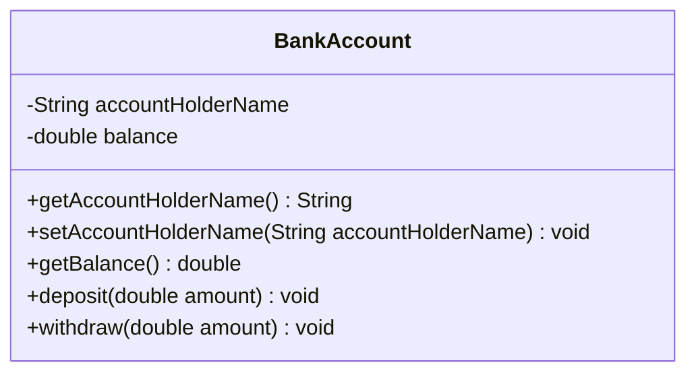
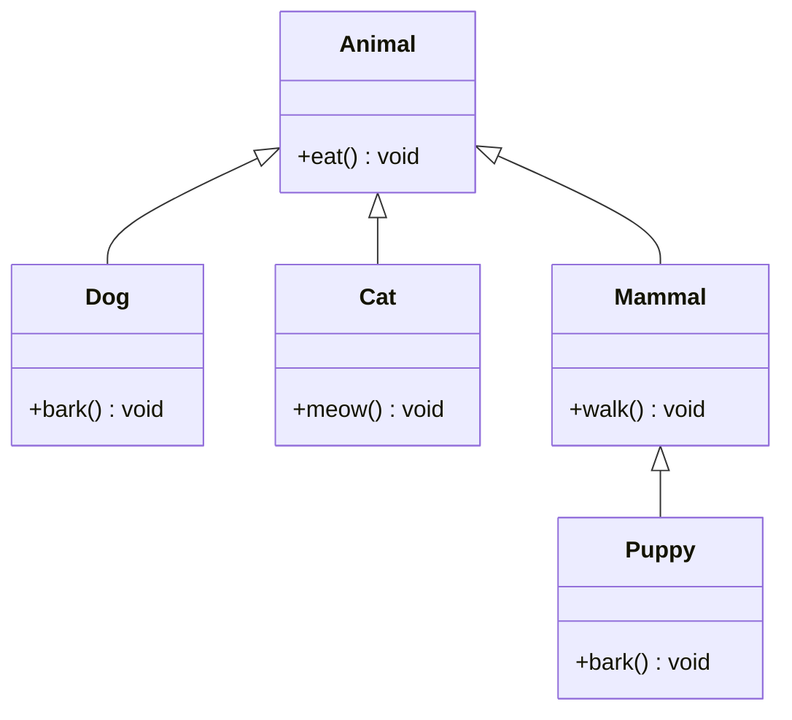
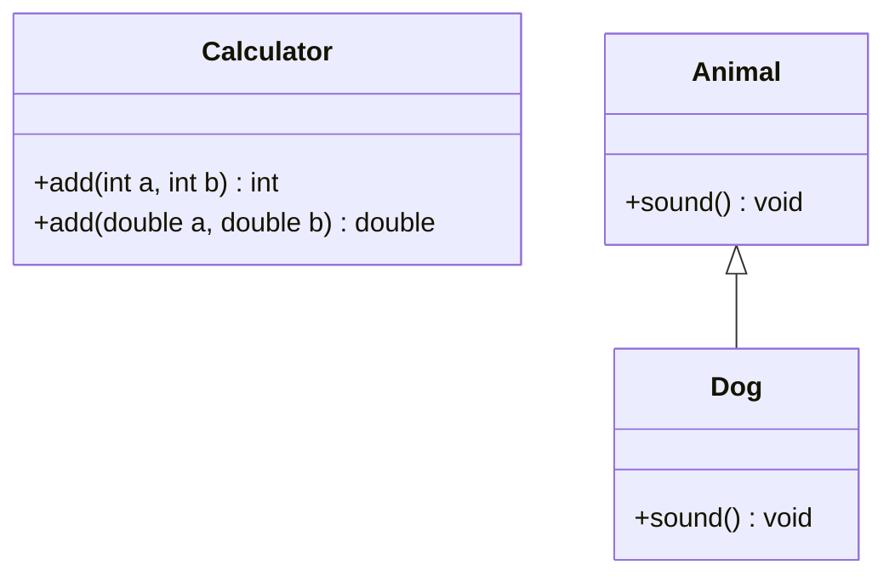

# Encapsulation, Access Modifiers, Inheritance & Polymorphism

## Encapsulation (Data Hiding in Java)

Encapsulation is a fundamental concept in object-oriented programming (OOP) where the internal details (data and logic) of an object are hidden from the outside world. It is the process of bundling the object's data (attributes) and methods (functions) together into a single unit or class. The primary goal is to protect the internal state of an object from unintended modifications and provide controlled access to it.

In simple terms, encapsulation ensures that the object's internal workings are hidden from other objects, allowing external entities to interact with the object only through well-defined interfaces (methods).

**Key concept.** Encapsulation enforces data hiding and ensures that attributes (variables) within a class are not directly accessible to other classes or external code. Instead, it provides getter and setter methods to access and modify these private attributes. By making attributes private, encapsulation maintains control over how the data is accessed and modified, preventing unwanted changes or access.

For example:

- Private attributes (fields) ensure that no one can directly alter the object's state.
- Public getter and setter methods allow controlled access and modification of private attributes, enabling additional business logic or validation during the process.

### Importance of Encapsulation

There are several benefits of using encapsulation, which are as follows:

- **Data Security:** The most significant benefit is data protection. Sensitive data can be hidden from external manipulation and can only be accessed or modified in a controlled manner.
- **Flexibility and Maintenance:** If the internal implementation needs to change, encapsulation allows you to modify the code without affecting external code. You can alter the internal representation of the data or how it's accessed, as long as the public interface (methods) remains the same.
- **Modular Code:** Encapsulation promotes cleaner, modular code by bundling related data and behaviors together. It helps in organizing the code, making it more readable and maintainable.
- **Improved Debugging and Testing:** Since all access to an object's internal state is controlled, debugging and testing become easier. You can validate the behavior of methods (like getters and setters) independently.
- **Reduced Complexity:** By hiding complex internal implementations and exposing only what is necessary, encapsulation simplifies the usage of objects and reduces the chances of errors in using the class.

<div style="border-left:4px solid #195045;background:rgba(25,80,69,0.08);padding:0.6rem 1rem;border-radius:0 0.5rem 0.5rem 0;margin:1.25rem 0">

💡 **Insight.** The flexibility payoff is the one that matters most day to day: because callers only ever touch the public interface, you're free to change how the data is represented or validated internally without breaking a single line of calling code — as long as the public methods keep their same signatures.

</div>

### Example

Consider the following code snippet:

```java
import java.util.*;

class BankAccount {
    // Private attributes
    private String accountHolderName;
    private double balance;

    // Constructor
    public BankAccount(String accountHolderName, double balance) {
        this.accountHolderName = accountHolderName;
        this.balance = balance;
    }

    // Public getter for accountHolderName
    public String getAccountHolderName() {
        return accountHolderName;
    }

    // Public setter for accountHolderName
    public void setAccountHolderName(String accountHolderName) {
        this.accountHolderName = accountHolderName;
    }

    // Public getter for balance
    public double getBalance() {
        return balance;
    }

    // Public setter for balance (only allows positive deposits)
    public void deposit(double amount) {
        if (amount > 0) {
            balance += amount;
        } else {
            System.out.println("Deposit amount must be positive.");
        }
    }

    // Public method to withdraw money
    public void withdraw(double amount) {
        if (amount > balance) {
            System.out.println("Insufficient funds.");
        } else {
            balance -= amount;
        }
    }
}

class Main {
    public static void main(String[] args) {
        // Creating an object of BankAccount
        BankAccount account = new BankAccount("John Doe", 5000);

        // Using getter to access private data
        System.out.println("Account Holder: " + account.getAccountHolderName());
        System.out.println("Balance: " + account.getBalance());

        // Modifying balance using setter method
        account.deposit(1500);
        System.out.println("Updated Balance: " + account.getBalance());

        // Trying to withdraw an amount
        account.withdraw(2000);
        System.out.println("Balance after Withdrawal: " + account.getBalance());
    }
}
```

The class's shape — private state, public interface — looks like this:



### Key Takeaways

- **Private Data:** In the example above, the `accountHolderName` and `balance` attributes are made private using the `private` keyword. This restricts direct access to the attributes from outside the class.
- **Getter and Setter Methods:** The `getBalance()` and `deposit()` methods are public and act as controlled interfaces to interact with the private data.
- **Controlled Access:** The `deposit()` method includes a check to ensure that only positive amounts are added to the balance, maintaining data integrity.

By encapsulating the `BankAccount` class, we make sure that the balance cannot be arbitrarily altered from outside the class, which protects it from unintended modifications and ensures proper validation is performed.

<div style="border-left:4px solid #15448e;background:rgba(21,68,142,0.08);padding:0.6rem 1rem;border-radius:0 0.5rem 0.5rem 0;margin:1.25rem 0">

📘 **Definition.** Encapsulation is just a design principle. Access modifiers and getters/setters are mechanisms used to achieve encapsulation.

</div>

Let us now understand access modifiers, which help us achieve encapsulation.

### Practice (Encapsulation)

You are tasked to design a class `Book` to manage the book details in a library. The class should contain the following specifications:

**Attributes:**

- `title` (`list<string>`) — the title of the book (public).
- `author` (`list<string>`) — the author of the book (public).
- `isAvailable` (`list<Boolean>`) — the availability status of the book (private).

**Methods:**

- Parameterised constructor to initialize the `title`, `author`, `isAvailable` list.
- `borrowBook(string bookName)` — if the availability status for book `bookName` is true then the book can be borrowed. Once borrowed mark its status as false. If availability status for book `bookName` is false then the book is already borrowed by some user and cannot be borrowed until its returned, so print "Book is not available.".
- `returnBook(string bookName)` — the book with `bookName` is returned and should be marked as available by setting its available flag to true.
- `getAvailability(string bookName)` — prints the availability status of the book with name `bookName` (true for available, false for unavailable).

Refer the sample example to understand the output format. Refer the commented code on the IDE to view the output statements.

The input is provided as mentioned below:

- `"1 <book name>"` — represents call to `borrowBook` method along with name of the book to borrow.
- `"2 <book name>"` — represents call to `returnBook` method along with name of the book to return.
- `"3 <book name>"` — represents call to `getAvailability` method along with name of book.

**Example 1**

```text
Input:
title = [ "Sherlock_Holmes", "Frankenstein", "King_Arthur_and_the_Round_Table", "Treasure_Island" ]
author = [ "Arthur_Conan_Doyle", "Mary_Shelley", "Roger_Lancelyn_Green", "Robert_Louis_Stevenson" ]
isAvailable = [ "false", "true", "false", "false" ]
methodCalls = [ ["1", "Frankenstein"] , ["1", "Sherlock_Holmes"] , ["2", "King_Arthur_and_the_Round_Table"], ["3", "Sherlock_Holmes"], ["1", "Frankenstein"] ]

Output:
Book is not available.
false
Book is not available.
```

**Explanation:**

- Program creates a object with the arguments title, author and isAvailable list.
- It then takes the methodCalls array as input.
- Iterate over the methodCalls array and gives call to the appropriate methods from the class Book.
- The first operation is to borrow the book named "Frankenstein". As the book is available then it can be borrowed.
- The second operation is to borrow book named "Sherlock Holmes". As the book is not available so we print "Book Not Available".
- The third operation is to return the book named "King_Arthur_and_the_Round_Table".
- The fourth operation we need the availability status of book named "Sherlock_Holmes", which is false.
- The fifth operation is to borrow the book named "Frankenstein". The book was already borrowed in 1st operation and not returned yet. So the availability status is false and So we print "Book Not Available".

**Constraints:** only one book can be borrowed at a time for a single instance.

**Solution:**

```java
import java.util.*;

class Book {
    private List<Boolean> isAvailable; // List of availability status
    public List<String> title;
    public List<String> author;

    // Constructor
    public Book(List<String> title, List<String> author, List<Boolean> isAvailable) {
        this.title = title;
        this.author = author;
        this.isAvailable = isAvailable;
    }

    // Method to borrow a book by its name
    public void borrowBook(String bookName) {
        for (int i = 0; i < title.size(); i++) {
            if (title.get(i).equals(bookName)) {
                if (isAvailable.get(i)) {
                    isAvailable.set(i, false);
                    return;
                } else {
                    System.out.println("Book is not available.");
                    return;
                }
            }
        }
        System.out.println("Book is not available.");
    }

    // Method to return a book by its name
    public void returnBook(String bookName) {
        for (int i = 0; i < title.size(); i++) {
            if (title.get(i).equals(bookName)) {
                if (!isAvailable.get(i)) {
                    isAvailable.set(i, true);
                    return;
                }
            }
        }
    }

    // Method to get the availability of a book by its name
    public void getAvailability(String bookName) {
        for (int i = 0; i < title.size(); i++) {
            if (title.get(i).equals(bookName)) {
                if (isAvailable.get(i)) {
                    System.out.println("true");
                    return;
                }
            }
        }
        System.out.println("false");
    }
}

public class Main {
    public static void main(String[] args) {
        List<String> title = Arrays.asList(
            "Sherlock_Holmes",
            "Frankenstein",
            "King_Arthur_and_the_Round_Table",
            "Treasure_Island"
        );

        List<String> author = Arrays.asList(
            "Arthur_Conan_Doyle",
            "Mary_Shelley",
            "Roger_Lancelyn_Green",
            "Robert_Louis_Stevenson"
        );

        List<Boolean> isAvailable = Arrays.asList(
            false,
            true,
            false,
            false
        );

        Book book = new Book(title, author, new ArrayList<>(isAvailable));

        // methodCalls
        book.borrowBook("Frankenstein");                       // Valid borrow
        book.borrowBook("Sherlock_Holmes");                    // Not available
        book.returnBook("King_Arthur_and_the_Round_Table");    // Return
        book.getAvailability("Sherlock_Holmes");               // Should be false
        book.borrowBook("Frankenstein");                       // Already borrowed
    }
}
```

## Access Modifiers

Access modifiers in object-oriented programming are keywords that define the visibility and accessibility of classes, methods, variables, and other members of a program. They determine which parts of the program can interact with a particular component, ensuring that code adheres to encapsulation, a key principle of object-oriented programming.

Access modifiers control interactions between objects and help enforce good design practices, making programs more reliable, scalable, and easier to debug.

### Purpose of Access Modifiers

In object-oriented programming, the access modifiers play a key role and serve the following purposes:

- **Encapsulation:** Ensures sensitive data and methods are protected from unintended access.
- **Controlled Access:** Allows programmers to specify which parts of the program can interact with certain components.
- **Modularity and Security:** Helps in maintaining the integrity of data by restricting unwanted modifications.
- **Flexibility:** Provides mechanisms for controlled sharing of data between classes and packages.

### Types of Access Modifiers

Most of the Object Oriented Programming languages provide the following four access levels:

- **Public:** Accessible everywhere (within the same class, same package, and outside the package).
- **Private:** Accessible only within the class where it is declared.
- **Protected:** Accessible within the same package and by subclasses in other packages.
- **Default:** (No Modifier) Accessible within the same package (package-private).

### Public Access Modifier

The public access modifier can make the attributes and methods of a class accessible from anywhere in the program, including classes outside the package. For example, consider the following code snippet:

```java
import java.util.*;

class Employee {
    public String name; // Public attribute

    public void displayName() { // Public method
        System.out.println("Employee Name: " + name);
    }
}

class Main {
    public static void main(String[] args) {
        Employee emp = new Employee();
        emp.name = "Alice"; // Accessible globally
        emp.displayName();  // Accessible globally
    }
}
```

Here, the `name` attribute and the `displayName()` method are set to public so they can be accessed from outside the class (in the main method).

**Keypoints:**

- Used to provide attributes and methods global access.
- Best suited for methods and attributes that need to be universally available.
- Does not restrict usage or visibility.
- Used for APIs.

### Private Access Modifier

The private access modifier can make the attributes and methods of a class accessible only within the class where they were declared. For example, consider the following code snippet:

```java
import java.util.*;

class BankAccount {
    private double balance; // Private attribute

    // Getter to provide controlled access
    public double getBalance() {
        return balance;
    }

    // Public method to deposit money
    public void deposit(double amount) {
        if (amount > 0) {
            balance += amount;
        }
    }
}

// Main Class
class Main {
    public static void main(String[] args) {
        // Creating an object
        BankAccount acnt = new BankAccount();

        System.out.println(acnt.balance); // Throws an error
        System.out.println(acnt.getBalance());
    }
}
```

Here, the `balance` attribute is set to private, so it can only be accessed from within the class (using the `getBalance()` method) and throws an error when accessed outside of the class.

**Keypoints:**

- Restricts access to sensitive data (`balance`) during compile-time providing compile-time protection.
- Encourages the use of getter and setter methods to provide controlled access.
- Not visible to subclasses or classes within the same package.

### Protected Access Modifier

The protected access modifier can make the attributes and methods of a class accessible within the same package and in subclasses (even if they are in different packages). For example, consider the following code snippet:

```java
import java.util.*;

class Vehicle {
    protected String type; // Protected attribute

    protected void displayType() { // Protected method
        System.out.println("Vehicle Type: " + type);
    }
}

class Car extends Vehicle {
    public Car() {
        this.type = "Car"; // Accessible in the subclass
    }
}
```

Here, the subclasses can inherit and use the `type` attribute and `displayType()` method.

**Keypoints:**

- Promotes inheritance by allowing child classes to access certain members of the parent class.
- Provides more visibility than private but less than public.
- Not accessible to unrelated classes outside the package.

### Default (No modifier)

When there is no access modifier specified, by default, the member is package-private in Java. This means that the member is accessible only in the package in which the class is declared, and nowhere else.

Consider the following code snippet:

```java
import java.util.*;

class PackageDemo {
    void showMessage() { // Default access
        System.out.println("Default access in the same package.");
    }
}

public class Main {
    public static void main(String[] args) {
        PackageDemo demo = new PackageDemo();
        demo.showMessage(); // Accessible because it's in the same package
    }
}
```

Here, the `showMessage()` method can be accessed from the `Main` class because it is set to package-private by default.

**Keypoints:**

- Accessible only within classes in the same package.
- Not accessible in subclasses or classes outside the package.
- Helps in maintaining package-level encapsulation.

### Comparison table

Here's a table showing whether different scopes like Class, Package, Subclass, or World can access the members and attributes defined under different access specifiers:

| Access Modifier | Class | Package | Subclass | World |
| --- | --- | --- | --- | --- |
| Public | ✔️ | ✔️ | ✔️ | ✔️ |
| Protected | ✔️ | ✔️ | ✔️ | ❌ |
| Default | ✔️ | ✔️ | ❌ | ❌ |
| Private | ✔️ | ❌ | ❌ | ❌ |

### Practice (Access Modifiers)

Design a class `Employee` to manage employee details securely using proper encapsulation and access modifiers. The class should implement the following attributes and methods:

**Attributes:**

- `name` (`string`) — public, represents the name of employee.
- `employeeId` (`Integer`) — protected, represents the unique Id of the employee.
- `salary` (`double`) — private, represents the salary of the employee.

**Methods:**

- `setSalary(double salary)` — sets the salary value. If salary is negative then print "Invalid salary" and set the salary to 0.
- `getSalary()` — return the salary value.
- Parameterised constructor to initialize the attributes. (If salary is negative then print "Invalid salary" and set the salary to 0.)
- `displayEmployeeDetails()` — display the employee details in format specified below.

Refer the sample examples for understanding the output format. Refer the commented code to check the output statements.

**Example 1**

```text
Input: name = "Striver" , employeeId = 9656 , salary = 10000 , newSalary = 15840

Output:
Salary : 10000.00
Name : Striver
Employee Id : 9656
Salary : 15840.00
```

**Explanation:**

- An object employee of class Employee is created with parameterised constructor.
- A call is given to the getSalary method and it is displayed through the driver program itself.
- We call the setSalary method with newSalary as argument.
- Then we call the displayEmployeeDetails() method to print the details of the employee.

**Example 2**

```text
Input: name = "Striver" , employeeId = 9656 , salary = -1050, newSalary = -9315

Output:
Invalid salary
Salary : 0.00
Invalid salary
Name : Striver
Employee Id : 9656
Salary : 0.00
```

**Explanation:**

- An object employee of class Employee is created with parameterised constructor. As the salary is in negative amount, so the constructor will print the text "Invalid salary" and set the salary to 0.00.
- A call is given to the getSalary method and it is displayed through the driver program itself.
- We call the setSalary method with newSalary as argument. As the newSalary is negative so we print the text "Invalid salary" and set the salary to 0.00.
- Then we call the displayEmployeeDetails() method to print the details of the employee.

**Constraints:** 1 <= salary, newSalary <= 106

**Solution:**

```java
import java.util.*;

class Employee {
    public String name; // Public attribute
    protected int employeeId; // Protected attribute
    private double salary; // Private attribute

    // Constructor
    public Employee(String name, int employeeId, double salary) {
        this.name = name;
        this.employeeId = employeeId;
        if (salary >= 0) {
            this.salary = salary;
        } else {
            this.salary = 0.0;
            System.out.println("Invalid salary");
        }
    }

    // Method to set the salary
    public void setSalary(double salary) {
        if (salary < 0) {
            System.out.println("Invalid salary");
            this.salary = 0.0;
            return;
        }
        this.salary = salary;
    }

    // Method to get the salary
    public double getSalary() {
        return this.salary;
    }

    // Method to display employee details
    public void displayEmployeeDetails() {
        System.out.println("Name : " + name);
        System.out.println("Employee Id : " + employeeId);
        System.out.printf("Salary : %.2f\n", salary);
    }
}

class Main {
    public static void main(String[] args) {
        // Hardcoded input
        String name = "Striver";
        int employeeId = 9656;
        double salary = 10000;
        double newSalary = 15840;

        // Creating Employee object
        Employee emp = new Employee(name, employeeId, salary);

        // Display initial salary
        System.out.printf("Salary : %.2f\n", emp.getSalary());

        // Update salary
        emp.setSalary(newSalary);

        // Display all details
        emp.displayEmployeeDetails();
    }
}
```

## Inheritance

Inheritance is a fundamental concept in object-oriented programming (OOP) that allows a class (subclass) to inherit the attributes (fields) and behaviors (methods) of another class (superclass). It is the mechanism that promotes code reuse and establishes a hierarchical relationship between classes.

In Java, this concept allows a subclass to inherit or extend the functionality of a superclass, enabling the subclass to reuse code and, in many cases, modify or add new behavior.

Consider the following example where a super class (parent/base class) `School` has a method `printSchoolName()`, which is inherited by the subclass `Student`. Because of this, the program can call the `printSchoolName()` method from an object of the `Student` class without causing any errors. Find the code snippet below:

```java
import java.util.*;
import java.util.*;

// Parent class or super class
class School {
    // Private attribute for school name
    private String schoolName;

    // Constructor initializes the school name
    School() {
        schoolName = "DPS"; // Default school name
    }

    // Method to print the school name
    void printSchoolName() {
        System.out.println("School name: " + schoolName);
    }
}

// Subclass or child class
class Student extends School {
    // Private attribute for student name
    private String studentName;

    // Constructor initializes the student name
    Student(String name) {
        this.studentName = name;
    }

    // Method to print the student name
    void printStudentName() {
        System.out.println("Student name: " + studentName);
    }
}

// Main class to execute the program
class Main {
    public static void main(String[] args) {
        // Create a new student object with the name "Raj"
        Student student = new Student("Raj");

        // Print the student's name
        student.printStudentName();

        // Print the school's name
        student.printSchoolName();
    }
}
```

### Parent Class

The parent class (also known as the superclass) is the class that provides common properties (attributes) and behaviors (methods) that are shared by one or more subclasses. It serves as a template or blueprint from which other classes (subclasses) can inherit. For example, `School` class.

### Subclass (Child Class)

A subclass (also known as a child class) is a class that inherits from a parent class. The subclass can reuse, extend, or override the attributes and methods of the parent class to specialize or modify the inherited functionality. For example, `Student` class.

In Java, there are three major types of inheritance:

- Single Inheritance
- Multilevel Inheritance
- Hierarchical Inheritance



`Animal <|-- Dog` and `Animal <|-- Cat` on their own would each be single inheritance; together, two children off one parent, that's hierarchical. `Animal <|-- Mammal <|-- Puppy` is a chain, one level becoming the next level's parent — that's multilevel.

### Single Inheritance

In Single Inheritance, a child class inherits from one parent class. This is the simplest and most common form of inheritance. Consider the following code snippet:

```java
import java.util.*;
// Parent class
class Animal {
    // Method to represent the eating behavior of an animal
    void eat() {
        System.out.println("This animal eats food.");
    }
}

// Child class inheriting from the Animal class
class Dog extends Animal {
    // Method specific to the Dog class to represent barking behavior
    void bark() {
        System.out.println("This dog barks.");
    }
}

// Main class to execute the program
class Main {
    public static void main(String[] args) {
        // Create an object of the Dog class
        Dog dog = new Dog();

        // Call the eat method inherited from the Animal class
        dog.eat();  // Output: This animal eats food.

        // Call the bark method defined in the Dog class
        dog.bark(); // Output: This dog barks.
    }
}
```

**Keypoints:**

- In a single inheritance, a one-to-one relationship is established.
- The child class inherits methods and properties from a single parent class.

### Multilevel Inheritance

In Multilevel Inheritance, a class derives from a child class, creating a chain of inheritance. Here, the child class of one level becomes the parent class for the next level. Consider the code snippet below:

```java
import java.util.*;
// Parent class representing general animals
class Animal {
    // Method to define the eating behavior of animals
    void eat() {
        System.out.println("This animal eats food.");
    }
}

// Intermediate class representing mammals, inheriting from Animal
class Mammal extends Animal {
    // Method to define the walking behavior of mammals
    void walk() {
        System.out.println("This mammal walks.");
    }
}

// Subclass representing dogs, inheriting from Mammal
class Dog extends Mammal {
    // Method to define the barking behavior specific to dogs
    void bark() {
        System.out.println("This dog barks.");
    }
}

// Main class to demonstrate multilevel inheritance
class Main {
    public static void main(String[] args) {
        // Create an object of the Dog class
        Dog dog = new Dog();

        // Call the eat method inherited from the Animal class
        dog.eat(); // Output: This animal eats food.

        // Call the walk method inherited from the Mammal class
        dog.walk(); // Output: This mammal walks.

        // Call the bark method defined in the Dog class
        dog.bark(); // Output: This dog barks.
    }
}
```

**Keypoints:**

- In a multilevel inheritance, a one-to-one-to-one relationship across multiple levels is established.
- Each child class inherits from its immediate parent, and the chain continues.

### Hierarchical Inheritance

In Hierarchical Inheritance, multiple child classes inherit from a single parent class. Consider the code snippet below:

```java
import java.util.*;
// Parent class representing general animals
class Animal {
    // Method to define the eating behavior common to all animals
    void eat() {
        System.out.println("This animal eats food.");
    }
}

// Subclass representing dogs, inheriting from Animal
class Dog extends Animal {
    // Method to define the barking behavior specific to dogs
    void bark() {
        System.out.println("This dog barks.");
    }
}

// Subclass representing cats, inheriting from Animal
class Cat extends Animal {
    // Method to define the meowing behavior specific to cats
    void meow() {
        System.out.println("This cat meows.");
    }
}

// Main class to demonstrate hierarchical inheritance
class Main {
    public static void main(String[] args) {
        // Create an object of the Dog class
        Dog dog = new Dog();

        // Create an object of the Cat class
        Cat cat = new Cat();

        // Call the eat method inherited from the Animal class using the Dog object
        dog.eat(); // Output: This animal eats food.

        // Call the bark method specific to the Dog class
        dog.bark(); // Output: This dog barks.

        // Call the eat method inherited from the Animal class using the Cat object
        cat.eat(); // Output: This animal eats food.

        // Call the meow method specific to the Cat class
        cat.meow(); // Output: This cat meows.
    }
}
```

**Keypoints:**

- In a hierarchical inheritance, a one-to-many relationship is established between classes.
- The child classes share the common methods and properties of the parent class but can also define their unique features.

### Advantages of Using Inheritance

Inheritance is a cornerstone of object-oriented programming, offering significant benefits such as:

- **Reusability:** It allows you to reuse the code of an existing class in a new class. Instead of rewriting code, the subclass (child class) can inherit the methods and attributes of the parent class. This reduces redundancy and promotes efficient coding.
- **Modularity:** It promotes a modular structure by separating concerns into different classes. Each class focuses on a specific part of the program, improving clarity and manageability.
- **Extensibility:** It enables adding new features or extending existing functionality without modifying the base class. This makes it easy to adapt to changing requirements.
- **Maintainability:** Inheritance makes code easier to maintain by centralizing common features in a parent class. Changes to shared functionality only need to be made in one place, reducing the risk of errors.

Inheritance also touches a few other important concepts, covered next: access modifiers (see [Access Modifiers](#access-modifiers) above), method overriding, and the `super` keyword.

### Method Overriding

Method overriding allows a subclass to provide a specific implementation of a method already defined in its parent class. This supports runtime polymorphism and enables dynamic behavior. There are some key rules for overriding:

- The method must have the same name, parameters, and return type as the parent class.
- The method in the child class cannot have a more restrictive access modifier than the parent method.
- Only inheritable methods (public or protected) can be overridden.
- The `@Override` annotation is recommended for clarity.

### The "super" Keyword

The `super` keyword is used in inheritance to:

- **Access Parent Class Members:** Refer to parent class methods or variables when they are shadowed by child class members.
- **Invoke Parent Class Constructor:** Call the parent class constructor to initialize the inherited state.

### Difference between Method Overloading and Method Overriding

**Definition:**

- Method Overloading occurs when two or more methods in the same class have the same name but different parameter lists (number, type, or order of parameters).
- Method Overriding occurs when a subclass provides a specific implementation of a method already defined in its parent class.

**Inheritance Dependency:**

- Method Overloading does not require inheritance. It happens within the same class.
- Method Overriding requires inheritance; occurs between a parent class and its subclass.

**Parameters:**

- In Method Overloading, methods must have different parameter lists (number, type, or order).
- In Method Overriding, the method must have the same parameter list as the method in the parent class.

**Access Modifiers:**

- In Method Overloading, methods can have any access modifier; no restrictions.
- The access modifier in the overriding method cannot be more restrictive than in the parent class.

### Multiple Inheritance

Along with the three types of inheritances discussed above, there is another type of inheritance — Multiple Inheritance.

Multiple inheritance refers to a feature in object-oriented programming where a class can inherit properties and methods from more than one parent class. This allows the child class to combine the functionality of multiple parent classes.

**Diamond Problem:** Diamond Problem occurs when a class inherits from two classes that have methods with the same name. The compiler cannot determine which method to execute.

If both `B` and `C` inherit from `A` and override a method, and `D` inherits from both `B` and `C`, which version of the method should `D` inherit? This ambiguity is why Java restricts multiple inheritance for classes.

<div style="border-left:4px solid #da5233;background:rgba(218,82,51,0.08);padding:0.6rem 1rem;border-radius:0 0.5rem 0.5rem 0;margin:1.25rem 0">

⚠️ **Watch out.** Java does not allow multiple inheritance using classes to avoid the diamond problem — it allows multiple inheritance through interfaces, as interfaces only declare method signatures (no method bodies initially), thus preventing conflicts.

</div>

### Practice (Inheritance)

You are tasked with creating a class hierarchy to represent employees in a company. Implement a base class `Employee` and derive classes `Manager` and `Engineer` from it. The base class should encapsulate common attributes, and the derived classes should add specific attributes while overriding methods. The derived classes should explicitly call the constructor of the parent class (`Employee`) to initialize common attributes.

The classes should consist of below specifications:

**Base Class: Employee**

Attributes:

- `name` (`string`) — represents the name of the employee.
- `id` (`Integer`) — unique identifier for the employee.

Methods:

- `displayDetails()` — prints the name and id.

**Derived Classes**

`Manager`:

- Attribute: `teamSize` (`Integer`) — the size of team managed.
- Method: `displayDetails()` — calls the parent class method `displayDetails()` and then prints teamSize.

`Engineer`:

- Attribute: `specialization` (`string`) — the engineer's area of interest.
- Method: `displayDetails()` — calls the parent class method `displayDetails()` and then prints the specialization.

Refer the sample examples for understanding the output format. The commented code has the output statements return, in order to avoid wrong answers due to case matching or whitespace.

The sample input follows below naming convention:

- `M` — prefix of M means input to class Manager.
- `E` — prefix of E means input to class Engineer.

**Example 1**

```text
Input: M_name = "Jax" , M_id = 101 , M_teamSize = 8
       E_name = "William" , E_id = 202 , E_specialization = "Backend Developer"

Output:
Manager Details
Name : Jax
Id : 101
Team Size : 8

Engineer Details
Name : William
Id : 202
Specialization : Backend Developer
```

**Explanation:**

- The object of Manager class is created with the parametrised constructor to initialize the attributes of both Manager and Employee class.
- Then we call the displayDetails of Manager class and print the data of both Employee and Manager class.
- We put an empty line between the data displayed for Manger and Engineer class as shown in output. (This is already written in driver code, user does not have to add this empty line.)
- The object of Engineer class is created with the parametrised constructor to initialize the attributes of both Engineer and Employee class.
- Then we call the displayDetails of Engineer class and print the data of both Employee and Engineer class.

**Example 2**

```text
Input: M_name = "Striver" , M_id = 10434 , M_teamSize = 50
       E_name = "Siddhant" , E_id = 41241, E_specialization = "Full Stack Developer"

Output:
Manager Details
Name : Striver
Id : 10434
Team Size : 50

Engineer Details
Name : Siddhant
Id : 41241
Specialization : Full Stack Developer
```

**Explanation:**

- The object of Manager class is created with the parametrised constructor to initialize the attributes of both Manager and Employee class.
- Then we call the displayDetails of Manager class and print the data of both Employee and Manager class.
- We put an empty line between the data displayed for Manger and Engineer class as shown in output. (This is already written in driver code, user does not have to add this new line.)
- The object of Engineer class is created with the parametrised constructor to initialize the attributes of both Engineer and Employee class.
- Then we call the displayDetails of Engineer class and print the data of both Employee and Engineer class.

**Constraints:**

- 1 <= Id <= 105
- 1 <= team size <= 105

**Solution:**

```java
import java.util.*;

// Base class Employee
class Employee {
    protected String name;
    protected int id;

    // Constructor for Employee
    public Employee(String name, int id) {
        this.name = name;
        this.id = id;
    }

    // Method to display details
    public void displayDetails() {
        System.out.println("Name : " + name);
        System.out.println("Id : " + id);
    }
}

// Derived class Manager
class Manager extends Employee {
    private int teamSize;

    // Constructor for Manager
    public Manager(String name, int id, int teamSize) {
        super(name, id);
        this.teamSize = teamSize;
    }

    @Override
    public void displayDetails() {
        super.displayDetails(); // Call to Employee displayDetails
        System.out.println("Team Size : " + teamSize);
    }
}

// Derived class Engineer
class Engineer extends Employee {
    private String specialization;

    // Constructor for Engineer
    public Engineer(String name, int id, String specialization) {
        super(name, id);
        this.specialization = specialization;
    }

    @Override
    public void displayDetails() {
        super.displayDetails(); // Call to Employee displayDetails
        System.out.println("Specialization : " + specialization);
    }
}

class Main {
    public static void main(String[] args) {
        // Hardcoded Manager input
        String M_name = "Jax";
        int M_id = 101;
        int M_teamSize = 8;

        // Hardcoded Engineer input
        String E_name = "William";
        int E_id = 202;
        String E_specialization = "Backend Developer";

        // Create Manager object
        Manager manager = new Manager(M_name, M_id, M_teamSize);
        System.out.println("Manager Details");
        manager.displayDetails();

        System.out.println();

        // Create Engineer object
        Engineer engineer = new Engineer(E_name, E_id, E_specialization);
        System.out.println("Engineer Details");
        engineer.displayDetails();
    }
}
```

## Polymorphism

Polymorphism is one of the key concepts in object-oriented programming (OOP) and refers to the ability of a single entity (like a method, operator, or object) to behave differently in different contexts. The term "polymorphism" is derived from Greek, meaning "many forms." In programming, it allows the same method or object to perform different tasks depending on the context.

There are two main types of polymorphism in Java:

- Compile-Time Polymorphism (Static Polymorphism)
- Run-Time Polymorphism (Dynamic Polymorphism)

### Compile-Time Polymorphism (Static Polymorphism)

In compile-time polymorphism, the method to be called is resolved at compile time. When we say the method is "resolved" at compile-time, it means that the compiler determines the correct method to invoke based on the method's signature (such as method name, parameters, etc.). It is achieved through method overloading or operator overloading (not supported in Java).

```java
import java.util.*;
// Calculator Class
class Calculator {
    // Method to add two integers
    int add(int a, int b) {
        return a + b;
    }

    // Method to add two decimal values
    double add(double a, double b) {
        return a + b;
    }
}

// Main class
class Main {
    public static void main(String[] args) {
        Calculator calc = new Calculator();

        // Method resolution happens here based on the argument types (int vs double)
        System.out.println(calc.add(5, 3));          // Calls int version
        System.out.println(calc.add(5.5, 3.3));      // Calls double version
    }
}
```

In this case, the compiler determines whether to call `add(int, int)` or `add(double, double)` at compile-time based on the types of arguments passed.

**Keypoints:**

- Determined at compile-time.
- Faster execution since the binding is done early.
- Examples: Method Overloading.

<div style="border-left:4px solid #da5233;background:rgba(218,82,51,0.08);padding:0.6rem 1rem;border-radius:0 0.5rem 0.5rem 0;margin:1.25rem 0">

⚠️ **Watch out.** The return type cannot be a differentiator for Method Overloading — the compiler resolves which overload to call from the argument list alone, so two methods that differ only in return type are a compile error, not an overload.

</div>

### Run-Time Polymorphism (Dynamic Polymorphism)

In run-time polymorphism, the method is resolved during the runtime. It is achieved through method overriding. When we say the method is "resolved" at run-time, it refers to the decision about which method (in the case of method overriding) to call being made at the time the program is actually running. This occurs due to the dynamic method dispatch mechanism, where the JVM decides which method of a subclass to call based on the actual object type (not the reference type) at runtime.

```java
import java.util.*;
// Parent class
class Animal {
    void sound() {
        System.out.println("Animal makes a sound");
    }
}

// Child class
class Dog extends Animal {
    @Override
    void sound() {
        System.out.println("Dog barks");
    }
}


// Main class
class Main {
    public static void main(String[] args) {
        Animal myAnimal = new Dog();  // Animal reference but Dog object

        // Method resolution happens here at runtime based on the object type (Dog)
        myAnimal.sound();  // Calls Dog's sound() method at runtime
    }
}
```

Here, the method to be executed is decided at runtime based on the object type.

**Keypoints:**

- Determined at runtime.
- Slower execution compared to compile-time polymorphism due to late binding.
- Examples: Method Overriding.

<div style="border-left:4px solid #195045;background:rgba(25,80,69,0.08);padding:0.6rem 1rem;border-radius:0 0.5rem 0.5rem 0;margin:1.25rem 0">

💡 **Insight.** `myAnimal` is declared as `Animal` but actually points to a `Dog` — calling `myAnimal.sound()` still runs `Dog`'s version, because dynamic dispatch resolves the call against the object's actual runtime type, not the type of the reference used to call it.

</div>

Both flavors of polymorphism can be seen side by side: overloading picks a signature at compile time, overriding picks an implementation at runtime.



### Practice (Polymorphism)

Design a class `ShapeCalculator` that calculates the area of different shapes using method overloading. Implement the below attributes and methods to calculate the area of different shapes:

**Methods:**

- `area(integer radius)` — calculates and print the area of circle using the formula π×radius².
- `area(integer length, integer width)` — calculates and print the area of rectangle using the formula (length * width).
- `area(integer base1, integer base2, integer height)` — calculates and print the area of Trapezoid using the formula ((base1 + base2) * height) / 2.

Refer the sample examples for understanding the output format. Refer the commented code for the output statements. Consider π = 3.14.

Note: print the area in integer format. Round down to nearest integer, i.e. 3.9 should be 3, 2.1 should be 2.

**Example 1**

```text
Input: base1 = 2 , base2 = 3, height = 2, length = 2, radius = 2 , width = 3

Output:
Area of Circle : 12
Area of Rectangle : 6
Area of Trapezoid : 5
```

**Explanation:**

- We create the object of the class ShapeCalculator.
- Calls the area method with radius as argument. It calculates and prints the area of circle.
- Calls the area method with length and width as arguments. It calculates and prints the area of rectangle.
- Calls the area method with base1, base2, height as arguments. It calculates and prints the area of trapezoid.

**Example 2**

```text
Input: base1 = 4, base2 = 3, height = 5, length = 2, radius = 3 , width = 5

Output:
Area of Circle : 28
Area of Rectangle : 10
Area of Trapezoid : 17
```

**Explanation:**

- We create the object of the class ShapeCalculator.
- Calls the area method with radius as argument. It calculates and prints the area of circle.
- Calls the area method with length and width as arguments. It calculates and prints the area of rectangle.
- Calls the area method with base1, base2, height as arguments. It calculates and prints the area of trapezoid.

**Constraints:** 1 <= radius, length, width, base1, base2, height <= 104

**Solution:**

```java
import java.util.*;

class ShapeCalculator {

    // Area of Circle
    public void area(int radius) {
        double ans = 3.14 * radius * radius;
        System.out.println("Area of Circle : " + (int) ans);
    }

    // Area of Rectangle
    public void area(int length, int width) {
        int ans = length * width;
        System.out.println("Area of Rectangle : " + (int) ans);
    }

    // Area of Trapezoid
    public void area(int base1, int base2, int height) {
        double ans = 0.5 * (base1 + base2) * height;
        System.out.println("Area of Trapezoid : " + (int) ans);
    }
}

class Main {
    public static void main(String[] args) {
        // Hardcoded inputs
        int radius = 2;
        int length = 2;
        int width = 3;
        int base1 = 2;
        int base2 = 3;
        int height = 2;

        // Create object and call overloaded methods
        ShapeCalculator calc = new ShapeCalculator();
        calc.area(radius);
        calc.area(length, width);
        calc.area(base1, base2, height);
    }
}
```

## Summary

- **Encapsulation** bundles an object's data and behavior together and hides the data behind a controlled public interface (getters/setters), so internal representation can change without breaking callers.
- **Access modifiers** (`public`, `private`, `protected`, default/package-private) are the mechanism Java gives you to enforce that hiding, each with a different visibility scope across class, package, subclass, and world.
- **Inheritance** lets a subclass reuse a superclass's fields and methods, in single, multilevel, or hierarchical shapes — it also introduces method overriding, the `super` keyword, and the constraint that Java disallows multiple inheritance via classes (the diamond problem) while allowing it via interfaces.
- **Polymorphism** lets the same method name behave differently depending on context: compile-time (method overloading, resolved by signature) or run-time (method overriding, resolved by the object's actual type via dynamic dispatch).
