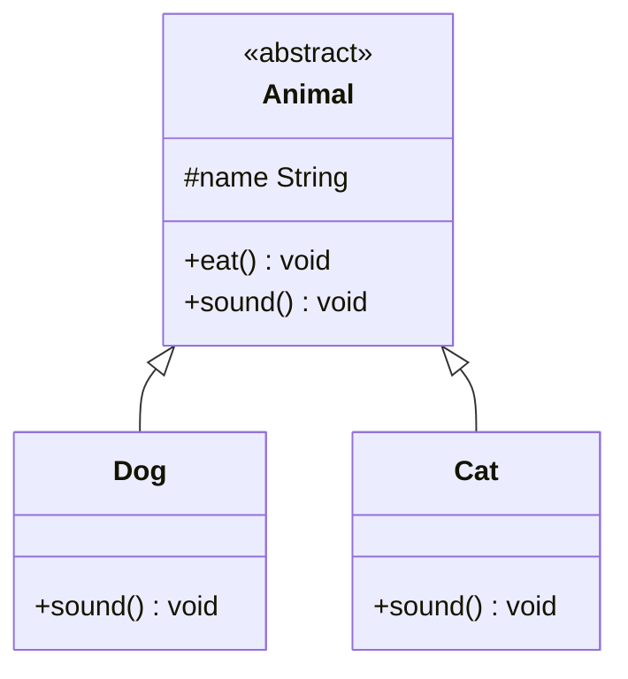
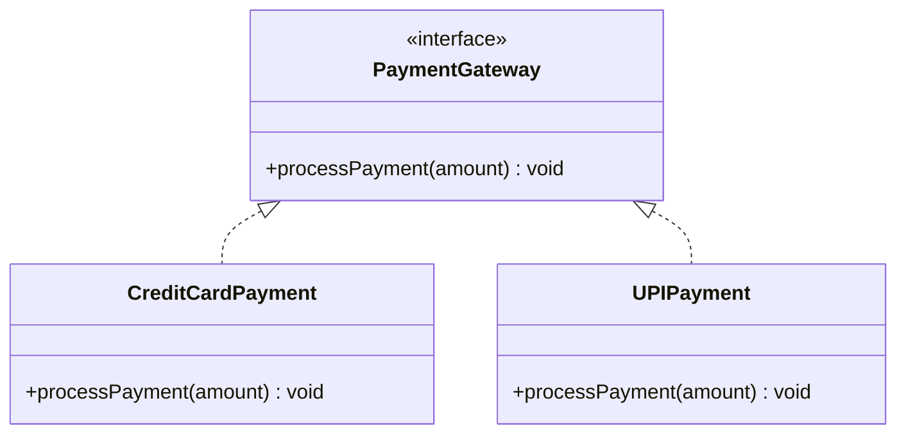

# Abstraction, Interfaces, Static Members & Inner Classes

## Abstraction

Abstraction is one of the fundamental concepts of Object-Oriented Programming (OOP). It is the process of hiding the implementation details and showing only the necessary features or interface to the user. In simpler terms, abstraction allows us to focus on what an object does, rather than how it does it.

Abstraction is achieved through abstract classes and interfaces in languages like Java. It allows programmers to create a blueprint or template for objects without having to worry about their specific implementation details, making the system easier to use and manage.

### Key features of abstraction

- **Hiding implementation details:** The goal of abstraction is to hide the complex implementation details of a system and provide a simpler interface for interaction. For example, when you drive a car, you don't need to know how the engine works internally; you just need to know how to start the car, steer, and stop.
- **Abstract methods:** These are methods declared in abstract classes or interfaces but have no body (i.e., they have no implementation). The implementation must be provided by the subclass or the class that implements the interface.
- **Concrete methods:** These are methods with complete implementation in an abstract class. Subclasses inherit these methods, but they are also allowed to override them if necessary.

### Benefits of abstraction in programming

Abstraction allows the programmers to:

- **Simplify the system:** By hiding unnecessary details, it reduces complexity.
- **Improve maintainability:** It makes the code more manageable, as changes to implementation details don't affect the rest of the system.
- **Increase reusability:** It allows code to be reused across different parts of the system with different implementations.
- **Provide security:** It ensures that the user interacts with the system at a higher level, without the risk of them modifying or interacting with internal mechanisms directly.

<div style="border-left:4px solid #195045;background:rgba(25,80,69,0.08);padding:0.6rem 1rem;border-radius:0 0.5rem 0.5rem 0;margin:1.25rem 0">

💡 **Insight.** Abstraction is about *what* an object does, not *how* it does it — the driving-a-car analogy is exact: you learn the pedals and the wheel once, and that interface stays the same whether the engine underneath is a combustion engine or an electric motor.

</div>

In Java, abstraction can be implemented using **abstract classes** and **interfaces**.

### Abstract classes

An abstract class is a class that cannot be instantiated on its own and must be inherited by a subclass. It can have both abstract methods (without implementation) and concrete methods (with implementation).

Abstract methods are those that are declared but not implemented in the abstract class, leaving the actual implementation to be provided by the subclasses. Consider the following code snippet:

```java
import java.util.*;
// Abstract class
abstract class Animal {
    // Concrete method
    void eat() {
        System.out.println("This animal eats food.");
    }

    // Abstract method (no implementation)
    abstract void sound();
}

// Concrete class that extends the abstract class
class Dog extends Animal {
    // Providing implementation for the abstract method
    @Override
    void sound() {
        System.out.println("The dog barks.");
    }
}

class Cat extends Animal {
    // Providing implementation for the abstract method
    @Override
    void sound() {
        System.out.println("The cat meows.");
    }
}

class Main {
    public static void main(String[] args) {
        Animal myDog = new Dog();
        Animal myCat = new Cat();

        myDog.eat();  // Inherited concrete method
        myDog.sound(); // Overridden method in Dog class

        myCat.eat();  // Inherited concrete method
        myCat.sound(); // Overridden method in Cat class
    }
}
```

**Explanation.**

- The `Animal` class is abstract and defines both an abstract method `sound()` (which has no body) and a concrete method `eat()` (which has a body).
- The `Dog` and `Cat` classes are concrete classes that extend the `Animal` class. They provide their own implementations for the abstract `sound()` method.
- When we create objects of `Dog` and `Cat`, we can call both the inherited concrete `eat()` method and the overridden `sound()` method.



### Interfaces

An interface is similar to an abstract class, but it can only contain abstract methods (until Java 8, after which default methods were introduced). All methods in an interface are implicitly abstract, and it is used to represent a contract that the implementing classes must fulfill.

Consider the following code snippet:

```java
import java.util.*;
// Interface
interface Animal {
    void sound(); // Abstract method
    void eat();   // Abstract method
}

// Implementing the interface in the Dog class
class Dog implements Animal {
    @Override
    public void sound() {
        System.out.println("The dog barks.");
    }

    @Override
    public void eat() {
        System.out.println("The dog eats food.");
    }
}

class Main {
    public static void main(String[] args) {
        Animal myDog = new Dog();
        myDog.eat();  // Implemented method
        myDog.sound(); // Implemented method
    }
}
```

**Explanation.**

- The `Animal` interface defines two abstract methods: `sound()` and `eat()`.
- The `Dog` class implements the `Animal` interface and provides concrete implementations for both methods.
- When we create an object of type `Dog`, we can call the `eat()` and `sound()` methods that were defined in the interface and implemented by the `Dog` class.

<div style="border-left:4px solid #15448e;background:rgba(21,68,142,0.08);padding:0.6rem 1rem;border-radius:0 0.5rem 0.5rem 0;margin:1.25rem 0">

📘 **Definition.** An abstract class can mix abstract and concrete methods and hold instance state (like `name` in the `Animal` example above); an interface is a pure contract — a class implements it with `implements` rather than extending it, and (pre-Java 8) every method was implicitly abstract.

</div>

### Static and default methods

**Static methods.** Static methods belong to the class rather than any instance of the class. This means that they can be called without creating an object of the class. Static methods can only directly access static members of the class, not instance variables or instance methods. They are defined using the `static` keyword.

```java
import java.util.*;
class Example {
    static void staticMethod() {
        System.out.println("This is a static method.");
    }
}

class Main {
    public static void main(String[] args) {
        Example.staticMethod();  // Accessing static method directly using the class name
    }
}
```

**Keypoints.**

- They are called on the class itself, not on an instance of the class.
- They can be used to perform operations that are common to all instances of a class.
- They can access only other static members (variables, methods) of the class.
- They cannot access instance variables or methods.

**Default methods.** Default methods were introduced in Java 8 to allow adding new functionality to interfaces without breaking existing implementations. Prior to Java 8, interfaces could only declare method signatures, leaving the implementation to the classes that implemented the interface. With the introduction of default methods, interfaces can now provide default implementations for methods.

```java
import java.util.*;
interface Example {
    default void defaultMethod() {
        System.out.println("This is a default method.");
    }
}

class Demo implements Example {
    public static void main(String[] args) {
        Example obj = new Demo();
        obj.defaultMethod();  // Accessing default method
    }
}
```

**Keypoints.**

- Default methods have a body and are defined using the `default` keyword in the interface.
- They can be called on objects that implement the interface.
- They allow user to add new methods to an interface without affecting existing classes that implement the interface.
- If a class implements an interface with a default method, the class can override the method if needed.

**Why default methods were introduced.** Before Java 8, adding a new method to an interface would break all existing implementations of that interface. This was a limitation when you wanted to evolve libraries and APIs without breaking backward compatibility. To solve this, Java 8 introduced default methods, allowing interfaces to provide method implementations, ensuring existing classes can still work without modification.

**Use cases for default methods.**

- **Backward compatibility:** Allows the addition of new methods to interfaces without affecting existing classes that implement the interface.
- **Multiple interfaces:** In cases where a class implements multiple interfaces that may have the same method signature, a default method can be used to avoid conflicts by providing a default implementation.

### Common abstraction questions

**Can an abstract class extend another abstract class?**

Yes, an abstract class can extend another abstract class in Java. An abstract class can inherit from another abstract class just like a regular class would. The subclass (child abstract class) will inherit the abstract methods and behaviors of the parent class, but it is not required to implement the abstract methods from the parent class unless it is a concrete class (i.e., a class that is not abstract).

If the subclass is also abstract, it can either:

- Implement the abstract methods from the parent class, or
- Leave them unimplemented (in which case, the subclass must also be declared as abstract).

**Can an abstract class have a constructor and can we create an instance of it?**

No, you cannot create an instance of an abstract class directly in Java. An abstract class is designed to be inherited by other classes, and it is not meant to be instantiated on its own.

However, an abstract class can have a constructor, which can be invoked by a subclass when an instance of the subclass is created. This allows the abstract class to initialize its fields before the subclass adds its own specific behaviors.

**Keypoints.**

- **Abstract class constructor:** An abstract class can have constructors, but you cannot create an instance of the abstract class directly. The constructor is only called when a subclass object is created.
- **Subclass constructor:** When a subclass is instantiated, its constructor can call the constructor of the abstract class using the `super()` keyword.

## Practice (Abstraction)

You are required to design a program that utilizes an abstract class `Animal` to serve as the foundation for specific animal classes. The objective is to demonstrate runtime polymorphism where derived classes override the behaviour of the abstract method `makeSound()`. The program should include:

An abstract class `Animal`:

- Attributes: `name` (string) — represents the name of the animal.
- Abstract method: `makeSound()` — to print the sound specific to the animal.

Derived classes:

- **Dog class:** Inherits class `Animal` and overrides the `makeSound()` method to print "Woof!".
- **Cat class:** Inherits class `Animal` and overrides the `makeSound()` method to print "Meow!".

Refer sample example to understand about the output format.

Refer the commented code on IDE to view the output statements.

**Example 1**

Input: `d_name = "Buddy"`, `c_name = "Whiskers"`

Output:

```text
The dog Buddy says : Woof!

The cat Whiskers says : Meow!
```

Explanation:

- First the object of Dog class is created with the name provided for the dog.
- Then the dog object is used to call the `makeSound()` method to print the output for the dog.
- Now the object of Cat class is created with name provided for the cat.
- Then the cat object is used to call the `makeSound()` method to print the output for the cat.

**Solution**

```java
// Abstract Class
abstract class Animal {
    protected String name;

    Animal(String name) {
        this.name = name;
    }

    // Abstract Method
    abstract void makeSound();
}

// Derived Class: Dog
class Dog extends Animal {
    Dog(String name) {
        super(name);
    }

    @Override
    void makeSound() {
        System.out.println("The dog " + name + " says : Woof!");
    }
}

// Derived Class: Cat
class Cat extends Animal {
    Cat(String name) {
        super(name);
    }

    @Override
    void makeSound() {
        System.out.println("The cat " + name + " says : Meow!");
    }
}
```

## Interfaces

An interface in Java is a blueprint of a class that defines a contract for behavior but does not provide an implementation. It contains a set of abstract methods (methods without a body) that a class must implement if it chooses to "sign the contract" by implementing the interface. Think of it as a way to specify what a class should do without dictating how it should do it.

Consider the following code snippet:

```java
import java.util.*;
interface Animal {
    void eat();
    void sleep();
}

class Dog implements Animal {
    @Override
    public void eat() {
        System.out.println("Dog eats bones.");
    }

    @Override
    public void sleep() {
        System.out.println("Dog sleeps in a kennel.");
    }
}
```

Here, `Animal` is the interface, and `Dog` is a class implementing it by providing specific behaviors for `eat` and `sleep` methods.

### Interface fields and constructors

**Can an interface have instance variables?**

No, an interface cannot have instance variables. All fields in an interface are implicitly `public`, `static`, and `final`. This means they act as constants and cannot be changed. Attempting to declare a non-static or non-final field will result in a compilation error.

<div style="border-left:4px solid #da5233;background:rgba(218,82,51,0.08);padding:0.6rem 1rem;border-radius:0 0.5rem 0.5rem 0;margin:1.25rem 0">

⚠️ **Watch out.** Every field you declare in an interface is silently `public static final`, whether you write those modifiers or not. There's no such thing as per-instance state in an interface — if a design needs mutable fields, that belongs in the implementing class or in an abstract class instead.

</div>

**Can interfaces have constructors?**

No, interfaces cannot have constructors. This is because constructors are used to initialize the state of an object, and interfaces cannot have state (no instance variables). Since interfaces are not classes and cannot be instantiated directly, they do not need constructors.

However, a class that implements an interface can have its own constructors to initialize its objects. For example:

```java
import java.util.*;
interface Vehicle {
    void start();
}

class Car implements Vehicle {
    private String brand;

    Car(String brand) {
        this.brand = brand;
    }

    @Override
    public void start() {
        System.out.println(brand + " car is starting.");
    }
}
```

In the above example, the `Car` class provides a constructor for initialization, but the `Vehicle` interface does not.

### Multiple interface implementation

**Can a class implement multiple interfaces?**

Yes, a class in Java can implement multiple interfaces. This is one of the key advantages of using interfaces because Java does not support multiple inheritance with classes, but it does with interfaces. For example:

```java
import java.util.*;
interface Flyable {
    void fly();
}

interface Swimmable {
    void swim();
}

class Duck implements Flyable, Swimmable {
    @Override
    public void fly() {
        System.out.println("Duck is flying.");
    }

    @Override
    public void swim() {
        System.out.println("Duck is swimming.");
    }
}
```

Here, the `Duck` class implements both `Flyable` and `Swimmable` interfaces, providing specific behaviors for flying and swimming.

### Key features of interfaces

Interfaces are powerful because they enable several key benefits:

- **Multiple inheritance:** As mentioned earlier, a class can implement multiple interfaces, allowing for functionality from various sources to be combined.
- **Contracts:** An interface acts as a contract that a class must fulfill. This ensures consistency across different classes implementing the interface.
- **Loosely coupled systems:** By programming to an interface rather than a concrete class, your code becomes more flexible and easier to maintain.

To better understand, consider the given code snippet:

```java
import java.util.*;
interface PaymentGateway {
    void processPayment(double amount);
}

class PayPal implements PaymentGateway {
    @Override
    public void processPayment(double amount) {
        System.out.println("Processing payment via PayPal: $" + amount);
    }
}

class Stripe implements PaymentGateway {
    @Override
    public void processPayment(double amount) {
        System.out.println("Processing payment via Stripe: $" + amount);
    }
}
```

Here, a client can use any implementation of `PaymentGateway` (e.g., `PayPal` or `Stripe`) without being tightly coupled to a specific one.



<div style="border-left:4px solid #195045;background:rgba(25,80,69,0.08);padding:0.6rem 1rem;border-radius:0 0.5rem 0.5rem 0;margin:1.25rem 0">

💡 **Insight.** This is polymorphism through an interface: the caller only ever talks to `PaymentGateway`, and which concrete class runs — `CreditCardPayment` or `UPIPayment` — is decided at runtime by whatever object was assigned. The caller's code never has to change when a new payment method is added.

</div>

### Default and static methods in interfaces

**Static methods in interfaces.** Static methods in interfaces belong to the interface itself rather than any instance of a class that implements the interface. This means that they can be called directly using the interface name without creating an object of the implementing class. Static methods in interfaces can only access other static members of the interface, not instance variables or instance methods. They are defined using the `static` keyword.

```java
import java.util.*;

interface Example {
    static void staticMethod() {
        System.out.println("This is a static method in an interface.");
    }
}

class Main {
    public static void main(String[] args) {
        Example.staticMethod(); // Accessing static method directly using the interface name
    }
}
```

**Keypoints.**

- They are called on the interface itself, not on an instance of a class implementing the interface.
- They can be used to perform operations that are related to the interface itself, not the implementing class.
- They can only access other static members (variables, methods) of the interface.
- They cannot access instance variables or instance methods of the implementing class.

**Default methods in interfaces.** Default methods were introduced in Java 8 to allow adding new functionality to interfaces without breaking existing implementations. Prior to Java 8, interfaces could only declare method signatures, leaving the implementation to the classes that implemented the interface. With the introduction of default methods, interfaces can now provide default implementations for methods.

```java
import java.util.*;
interface Example {
    default void defaultMethod() {
        System.out.println("This is a default method.");
    }
}

class Demo implements Example {
    public static void main(String[] args) {
        Example obj = new Demo();
        obj.defaultMethod();  // Accessing default method
    }
}
```

**Keypoints.**

- Default methods have a body and are defined using the `default` keyword in the interface.
- They can be called on objects that implement the interface.
- They allow user to add new methods to an interface without affecting existing classes that implement the interface.
- If a class implements an interface with a default method, the class can override the method if needed.

**Why default methods were introduced.** Before Java 8, adding a new method to an interface would break all existing implementations of that interface. This was a limitation when you wanted to evolve libraries and APIs without breaking backward compatibility. To solve this, Java 8 introduced default methods, allowing interfaces to provide method implementations, ensuring existing classes can still work without modification.

**Use cases for default methods.**

- **Backward compatibility:** Allows the addition of new methods to interfaces without affecting existing classes that implement the interface.
- **Multiple interfaces:** In cases where a class implements multiple interfaces that may have the same method signature, a default method can be used to avoid conflicts by providing a default implementation.

### Interface inheritance

Interfaces in Java can extend other interfaces, allowing for inheritance. When an interface inherits another, it can add new methods to the contract defined by the parent interface.

Consider the following code snippet:

```java
import java.util.*;
interface Animal {
    void eat();
}

interface Mammal extends Animal {
    void walk();
}

class Human implements Mammal {
    @Override
    public void eat() {
        System.out.println("Human eats food.");
    }

    @Override
    public void walk() {
        System.out.println("Human walks on two legs.");
    }
}
```

Here, the `Mammal` interface inherits the `eat` method from `Animal` and adds the `walk` method. The `Human` class implements both methods.

## Practice (Interfaces)

You are required to design an interface `PaymentGateway` that defines a common method for processing payments. Implement two classes, `CreditCardPayment` and `UPIPayment`, which provide specific implementations of the `processPayment()` method. Use polymorphism to demonstrate how different payment methods can be processed through the same interface.

Interface `PaymentGateway`:

- Abstract method `processPayment(double amount)`: This method processes a payment of the specified amount.

Implementing classes:

- **CreditCardPayment** — method `processPayment(double amount)`: Implements to print "Processing credit card payment of amount".
- **UPIPayment** — method `processPayment(double amount)`: Implements to print "Processing UPI payment of amount".

Refer the sample input example to understand about the output format.

Refer the commented code on IDE for output statements.

**Example 1**

Input: `paymentMethod = ["credit", "upi"]`, `paymentValue = [284.5, 27476.2]`

Output:

```text
Processing credit card payment of 284.50

Processing UPI payment of 27476.20
```

Explanation:

- We iterate over the `paymentMethod` list.
- If the payment is through the credit card: we create the object of class `CreditCardPayment`. Then call the `processPayment()` method with the amount to print the corresponding output text.
- If the payment is through the UPI: we create the object of class `UPIPayment`. Then call the `processPayment()` method with the amount to print the corresponding output text.

**Solution**

```java run
import java.util.*;

// Interface
interface PaymentGateway {
    void processPayment(double amount);
}

// CreditCardPayment Class
class CreditCardPayment implements PaymentGateway {
    @Override
    public void processPayment(double amount) {
        System.out.printf("Processing credit card payment of %.2f%n", amount);
    }
}

// UPIPayment Class
class UPIPayment implements PaymentGateway {
    @Override
    public void processPayment(double amount) {
        System.out.printf("Processing UPI payment of %.2f%n", amount);
    }
}

class Main {
    public static void main(String[] args) {
        // Hardcoded input
        String[] paymentMethod = { "credit", "upi" };
        double[] paymentValue = { 284.5, 27476.2 };

        // Process payments based on method
        for (int i = 0; i < paymentMethod.length; i++) {
            PaymentGateway paymentGateway;
            if (paymentMethod[i].equals("credit")) {
                paymentGateway = new CreditCardPayment();
            } else if (paymentMethod[i].equals("upi")) {
                paymentGateway = new UPIPayment();
            } else {
                continue; // If payment method is unknown
            }
            paymentGateway.processPayment(paymentValue[i]);
        }
    }
}
```

## The static keyword

In Java, the `static` keyword is used to indicate that a member belongs to the class rather than to any specific instance of the class. It can be applied to variables, methods, blocks, and nested classes. Members marked as static are shared across all instances of the class, meaning they are loaded only once in memory during the class's lifecycle.

### Static variables

Static variables, also known as class variables, are shared by all instances of a class. They are declared with the `static` keyword and are initialized only once when the class is loaded into memory. They are useful for storing common values or constants that are the same for all objects.

To better understand, consider the following example:

```java
import java.util.*;

// Counter class
class Counter {
    static int count = 0; // static variable

    // Constructor
    Counter() {
        count++;
    }

    // Method to display count
    static void displayCount() {
        System.out.println("Count: " + count);
    }
}

// Main class
class Main {
    public static void main(String[] args) {
        Counter c1 = new Counter();
        Counter c2 = new Counter();
        Counter.displayCount(); // Output: Count: 2
    }
}
```

Here, the `count` variable is shared among all objects of the `Counter` class giving the output as 2 instead of 0.

### Static methods

Static methods belong to the class rather than to any instance. They can be called without creating an object of the class. These methods are commonly used for utility or helper functions like mathematical calculations.

To better understand, consider the following example:

```java
import java.util.*;

// Math Utility class
class MathUtils {
    static int add(int a, int b) {
        return a + b;
    }
}

class Main {
    public static void main(String[] args) {
        // Calling static method without object creation
        int result = MathUtils.add(5, 3);

        System.out.println("Result: " + result); // Output: Result: 8
    }
}
```

Here, the program was able to call the `add` utility function without creating an object (instance) of the class because it is a static method.

**Keypoints.**

- Static methods cannot access non-static members (variables or methods) directly because non-static members require an instance of the class.
- Static methods can only directly call other static methods and access static variables.

### Static blocks

Static blocks, also known as static initialization blocks, are used to initialize static variables. They are executed when the class is loaded into memory, before any objects are created or static methods are called.

Consider the following code snippet:

```java
import java.util.*;

class Example {
    static int value;

    // Static block
    static {
        value = 10; // Initialization of static variable
        System.out.println("Static block executed.");
    }
}

// Main class
class Main {
    public static void main(String[] args) {
        System.out.println("Value: " + Example.value);
        // Output: Static block executed. Value: 10
    }
}
```

Static blocks are executed in the order they appear in the class.

### Interaction between static and non-static members

Static methods cannot directly access or invoke non-static methods or variables because static methods do not depend on a class instance. However, non-static members can be accessed indirectly by creating an instance of the class.

```java
import java.util.*;

class Example {
    int instanceVar = 10;

    static void staticMethod() {
        // Creating an instance to access non-static members
        Example obj = new Example();

        System.out.println("Instance variable: " + obj.instanceVar);
    }
}

class Main {
    public static void main(String[] args) {
        Example.staticMethod();
    }
}
```

In the above example, the static method `staticMethod` uses an object to access the non-static `instanceVar`.

### Advantages of static members in Java

There are several benefits of using static members:

- **Memory efficiency:** Static variables are loaded into memory only once, reducing memory usage.
- **Utility functions:** Static methods are ideal for utility or helper methods that do not require object-specific data (e.g., `Math.sqrt()`).
- **Initialization:** Static blocks allow for the initialization of static variables, ensuring that common resources are ready for use.

Consider the following code snippet:

```java
import java.util.*;

// Utility Class
class Utils {
    static void printMessage(String message) {
        System.out.println(message);
    }
}

class Main {
    public static void main(String[] args) {
        Utils.printMessage("Hello, Static!"); // Output: Hello, Static!
    }
}
```

As you can see, static members simplify scenarios where sharing resources or creating reusable methods is required.

<div style="border-left:4px solid #195045;background:rgba(25,80,69,0.08);padding:0.6rem 1rem;border-radius:0 0.5rem 0.5rem 0;margin:1.25rem 0">

💡 **Insight.** Every static member — variable, method, or block — lives on the class, not on any object of it. That's why `count` in the `Counter` example is shared across every instance, and why a static method can't reach an instance field unless it first creates (or is handed) an object to read it from.

</div>

## Practice (Static Keyword)

You are required to design a class `Counter` to keep track of how many objects have been created from it. The tracking must be done using the `static` keyword to ensure a single shared variable across all instances of the class. The class should contain below specification:

Attributes:

- `count` (Integer) — a static variable that tracks the total number of objects created.

Methods:

- A default constructor that increments the `count` variable each time a new object is instantiated.
- `getCount()` — a static method that returns the current value of the `count` variable.
- `resetCount()` — a static method to reset the value of `count` variable to 0.

Refer the sample examples for understanding the output format.

Refer the commented code on IDE for output statements.

**Example 1**

Input: `count = 10`

Output:

```text
Number of objects created : 10
```

Explanation:

- Total count of objects that will be created is taken as input.
- Then `count` number of different objects are instantiated.
- At each instantiation the constructor increments the count of object.
- Now `getCount` method is called which returns the total number of objects instantiated.
- At end we call the `resetCount()` method to reset the count to 0.

Constraints: 1 <= count <= 10^5

**Solution**

```java run
import java.util.*;

class Counter {
    // Static variable to track the number of objects created
    private static int count = 0;

    // Default constructor increments the count
    public Counter() {
        count++;
    }

    // Static method to get the current count
    public static int getCount() {
        return count;
    }

    public static void resetCount() {
        count = 0;
    }
}

class Main {
    public static void main(String[] args) {
        // Hardcoded input count = 10
        int count = 10;

        // Create 10 objects
        for (int i = 0; i < count; i++) {
            new Counter();  // Creating Counter objects
        }

        // Output the count of objects created
        System.out.println("Number of objects created : " + Counter.getCount());
    }
}
```

## Inner classes

Inner classes are classes that are defined within another class. They are a powerful feature in Java that allows you to logically group classes that are only used in one place, making the code more readable and encapsulated. They have direct access to all the members (both static and non-static) of the outer class.

Java provides several types of inner classes to suit different use cases:

- Static Nested Classes
- Non-Static Inner Classes
- Local Inner Classes
- Anonymous Inner Classes

```d2
OuterClass: "OuterClass" {
  StaticNestedClass: "Static Nested Class\nno outer instance needed" { shape: rectangle }
  InnerClass: "Non-static Inner Class\nholds implicit outer reference" { shape: rectangle }
  LocalInnerClass: "Local Inner Class\nscoped to a method" { shape: rectangle }
  AnonymousInnerClass: "Anonymous Inner Class\nno name, one-time use" { shape: rectangle }
}
```

### Static nested classes

A static nested class is defined with the `static` modifier. Since it is static, it does not require an instance of the outer class to be created. Static nested classes can only access the static members of the outer class.

Consider the code snippet:

```java
import java.util.*;

class OuterClass {
    static int staticVar = 100;

    // Static Nested Class
    static class StaticNestedClass {
        void display() {
            System.out.println("Static variable: " + staticVar);
        }
    }
}

// Main class
class Main {
    public static void main(String[] args) {
        OuterClass.StaticNestedClass nestedObj =
            new OuterClass.StaticNestedClass();

        nestedObj.display(); // Output: Static variable: 100
    }
}
```

Here, the `StaticNestedClass` can access the `OuterClass`'s static members directly without requiring an instance of the outer class.

**Keypoints.**

- Declared using the `static` keyword.
- Can only access the static members of the outer class.
- No reference to an outer class instance is maintained.

Static nested classes are often used to group classes that are tightly related and do not need access to instance-specific data.

### Non-static inner classes

A non-static inner class is associated with an instance of the outer class. It has access to all members (both static and non-static) of the outer class, including private members.

Consider the given code snippet:

```java
import java.util.*;

class OuterClass {
    int instanceVar = 42;

    // Non-static Nested Inner class
    class InnerClass {
        void display() {
            System.out.println("Instance variable: " + instanceVar);
        }
    }
}

class Main {
    public static void main(String[] args) {
        OuterClass outerObj = new OuterClass();
        OuterClass.InnerClass innerObj = outerObj.new InnerClass();
        innerObj.display(); // Output: Instance variable: 42
    }
}
```

In the example, the `InnerClass` can access `instanceVar` directly because it is tied to an instance of `OuterClass`.

**Keypoints.**

- Declared without the `static` keyword.
- Requires an instance of the outer class to be instantiated.
- Can access all members of the outer class.

Non-static inner classes are used when you need access to instance-specific data of the outer class.

<div style="border-left:4px solid #da5233;background:rgba(218,82,51,0.08);padding:0.6rem 1rem;border-radius:0 0.5rem 0.5rem 0;margin:1.25rem 0">

⚠️ **Watch out.** A non-static inner class object always carries an implicit reference back to the outer instance that created it (`outerObj.new InnerClass()` makes that reference explicit). Hold on to an inner-class instance longer than you need to, and you keep its outer object alive too — a classic memory-leak trap in long-lived caches or listener registrations.

</div>

### Local inner classes

Local inner classes are defined within a method or a block of code. They are only accessible within the scope of that method or block. Local inner classes can access all members of the outer class but can only access the effectively final local variables of the enclosing method.

Consider the code snippet given below:

```java
import java.util.*;

class OuterClass {
    void outerMethod() {
        int localVar = 10; // Effectively final

        // class defined inside a method
        class LocalInnerClass {
            void display() {
                System.out.println("Local variable: " + localVar);
            }
        }

        LocalInnerClass localInner = new LocalInnerClass();
        localInner.display(); // Output: Local variable: 10
    }
}

// Main Class
class Main {
    public static void main(String[] args) {
        OuterClass outerObj = new OuterClass();
        outerObj.outerMethod();
    }
}
```

In the example, `LocalInnerClass` accesses the `localVar` because it is effectively final.

**Keypoints.**

- Defined within a method or block.
- Can access all members of the outer class.
- Can only access effectively final local variables of the enclosing method.

Local inner classes are useful for encapsulating logic within a method.

### Anonymous inner classes

Anonymous inner classes are a type of local inner class without a name. They are often used to implement interfaces or extend classes for one-time use.

Consider the following code snippet:

```java
import java.util.*;

abstract class Greeting {
    abstract void sayHello();
}

class Main {
    public static void main(String[] args) {
        // Anonymous inner class
        Greeting greeting = new Greeting() {
            void sayHello() {
                System.out.println("Hello, World!");
            }
        };

        greeting.sayHello(); // Output: Hello, World!
    }
}
```

In the example, an instance of the `Greeting` class is created with an overridden `sayHello()` method, allowing custom behavior without explicitly defining a new class.

**Keypoints.**

- Do not have a name.
- Are instantiated at the point of declaration.
- Typically used when a class is needed only once.

Anonymous inner classes are commonly used in GUI applications or when implementing event listeners.

## Practice (Inner classes)

You are tasked with designing a `Robot` class to demonstrate the functionality of different types of inner classes. Implement the following:

Class `Robot`:

- Attribute: `name` (string)
- Method: `performAction()` — prints the robot's action

Class `Arm` (non-static inner class):

- Method: `pickItem()` to print the message "Arm picking an item.".

Class `Processor` (static nested class):

- Method: `process()` to print the message "Processor analyzing the data.".

Local inner class: `manageSensors()` method is used to implement the local inner class sensor.

- Method: `sense()` to print the message "Sensor detecting obstacles." which is defined inside the local inner class.

Anonymous inner class:

- Implements an interface `Task` with a single method `execute()`.
- Method: `executeTask()` method to implement the overrides of `execute()` method of interface to print "Executing a custom task".

Refer the commented code on IDE to see the output statements.

**Example 1**

Input: `name = "Robot-1"`

Output:

```text
Robot-1 is performing an action.

Robot-1 arm picking an item.

Processor analyzing the data.

Robot-1 sensor detecting obstacles.

Robot-1 executing a custom task.
```

Explanation:

- First we create the Robot class object and initialize the name of robot.
- Then we call method `performAction` and print the corresponding text.
- Then we call method `pickItem` and print the corresponding text.
- Then we call method `process` and print the corresponding text.
- Then we call method `manageSensors` and print the corresponding text.
- Then we call method `executeTask` and print the corresponding text.

**Solution**

```java run
import java.util.*;

class Robot {
    private String name;

    public Robot(String name) {
        this.name = name;
    }

    public void performAction() {
        System.out.println(name + " is performing an action.");
    }

    // Non-static inner class
    class Arm {
        public void pickItem() {
            System.out.println(name + " arm picking an item.");
        }
    }

    // Static nested class
    static class Processor {
        public void process() {
            System.out.println("Processor analyzing the data.");
        }
    }

    // Method demonstrating a local inner class
    public void manageSensors() {
        class Sensor {
            public void sense() {
                System.out.println(name + " sensor detecting obstacles.");
            }
        }

        Sensor sensor = new Sensor();
        sensor.sense();
    }

    // Anonymous inner class
    public void executeTask() {
        Task task = new Task() {
            @Override
            public void execute() {
                System.out.println(name + " executing a custom task.");
            }
        };
        task.execute();
    }

    interface Task {
        void execute();
    }
}

class Main {
    public static void main(String[] args) {
        // Hardcoded input
        String name = "Robot-1";

        // Create Robot object
        Robot robot = new Robot(name);

        // Call methods to demonstrate the inner classes and task
        robot.performAction();

        Robot.Arm arm = robot.new Arm();
        arm.pickItem();

        Robot.Processor processor = new Robot.Processor();
        processor.process();

        robot.manageSensors();

        robot.executeTask();
    }
}
```

## Summary

- **Abstraction** hides implementation details behind a simpler interface, achieved in Java through **abstract classes** (can mix abstract and concrete methods, hold state, be extended) and **interfaces** (a pure contract, implicitly `public static final` fields, implemented rather than extended).
- Both abstract classes and interfaces can carry **static methods** (called on the type itself) and, since Java 8, interfaces can carry **default methods** (a body, overridable, added without breaking existing implementers).
- The **static keyword** marks a variable, method, or block as belonging to the class rather than any instance — static variables are shared across all objects, static methods can only touch other static members, and static blocks run once when the class loads.
- Java has four kinds of **inner classes**: static nested classes (no outer-instance link), non-static inner classes (carry an implicit reference to their outer instance — watch for memory leaks), local inner classes (scoped to a method, see effectively-final locals), and anonymous inner classes (no name, one-time use, common for interface/abstract-class implementations).
