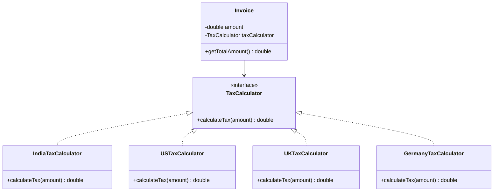
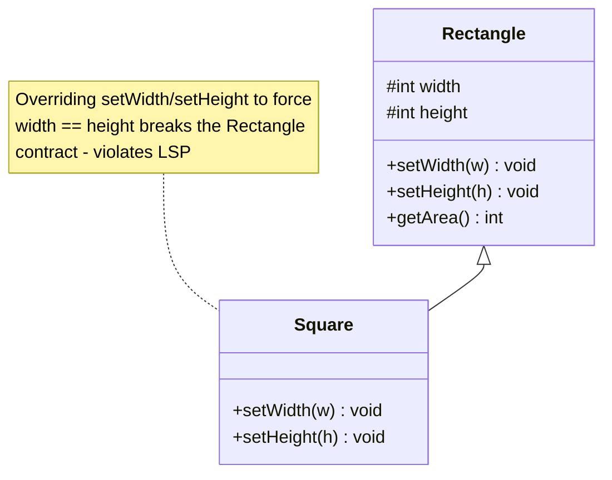
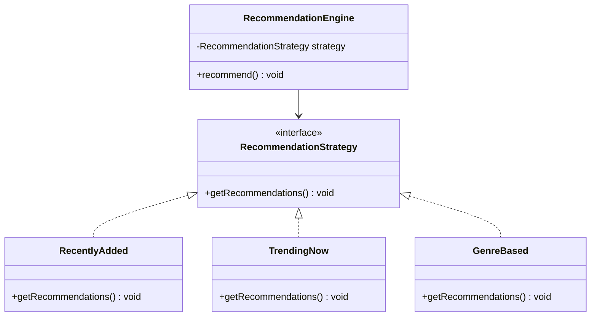

# SOLID Principles

There is a set of five principles for writing clean, scalable, maintainable object-oriented code. These principles are known as SOLID principles.

## SRP — Single Responsibility Principle

The S in SOLID stands for Single Responsibility Principle.

<div style="border-left:4px solid #15448e;background:rgba(21,68,142,0.08);padding:0.6rem 1rem;border-radius:0 0.5rem 0.5rem 0;margin:1.25rem 0">

📘 **Definition.** A class should have only one reason to change. In other words, a class should only have one job, one responsibility, and one purpose.

</div>

If a class takes more than one responsibility, it becomes coupled. This means that if one responsibility changes, the other responsibilities may also be affected, leading to a ripple effect of changes throughout the codebase.

### Real-life analogy

Imagine a chef who is responsible for cooking, cleaning, serving food and ordering groceries. If the chef is busy cleaning, they can't focus on cooking, and the quality of the food may suffer.

Instead, different people should handle each task: one person cooks (chef), another cleans (cleaner), a third serves (waiter), and another orders groceries (manager). This way, each person can focus on their specific responsibility, leading to better results overall.

### Significance of SRP

Let us understand this with the example of an online compiler. Currently, the online compiler does the following things:

- Adds driver code
- Performs syntax check
- Runs code with already fed test cases
- Stores the output in the database
- Returns the necessary output to the user

Now, implementing all the above functionalities in a single `OnlineCompiler` class would violate the Single Responsibility Principle (SRP).

Instead, we can break it down into smaller classes, each with a single responsibility:

- `DriverCodeGenerator` — responsible for adding driver code.
- `SyntaxChecker` — responsible for performing syntax checks.
- `TestRunner` — responsible for running code with test cases.
- `DatabaseManager` — responsible for storing output in the database.
- `UserOutputHandler` — responsible for returning output to the user.

Another class named `Coordinator` can be added to coordinate between all these classes/modules.

By following the Single Responsibility Principle, we can make the code more modular, easier to maintain, and less prone to bugs. Each class can be modified or replaced independently without affecting the others.

### Advantages of SRP

- **Improved maintainability:** Changes in one part of the system won't affect other parts, making it easier to maintain and update.
- **Enhanced readability:** Smaller, focused classes are easier to read and understand.
- **Better reusability:** Classes with a single responsibility can be reused in different contexts without bringing unnecessary dependencies.
- **Facilitates testing:** Smaller classes are easier to test, as they have fewer dependencies and responsibilities.
- **Lower risk in changes:** Since each class handles only one concern, changes made to it are less likely to cause unintended side effects in other parts of the system.

### Common mistakes when violating SRP

There are a few common mistakes that developers make when violating the Single Responsibility Principle (SRP). Here are some examples:

- **Mixing database logic with business logic:** Putting both data access (e.g., SQL, JDBC) and core business rules in the same class. This makes it hard to change the database layer without affecting business logic.
- **Coupling UI code with business logic:** Embedding application logic directly in the UI layer. This makes it tedious to change the UI without affecting the underlying logic.

**Is SRP just for classes?** No. SRP can be applied to methods, modules, microservices, and even entire systems. The key is to ensure that each component has a single responsibility and that changes in one area do not affect others unnecessarily — it's a mindset you can apply from the smallest method to the largest system design.

## OCP — Open/Closed Principle

The O in SOLID stands for Open/Closed Principle.

**Definition.** Software entities (classes, modules, functions, etc.) should be open for extension, but closed for modification.

This means that the behavior of a module can be extended without modifying its source code. The goal is to reduce the risk of breaking existing functionality when requirements change.

### Real-life analogy

Let's understand the application of OCP in real life with the help of power adapters. Imagine you travel from India to the UK. Your Indian charger doesn't fit into UK power sockets. Instead of buying a new charger, you use a travel adapter.

- The adapter extends your existing charger's usability (now works in the UK).
- You did not modify the charger itself.

Similarly, in code, OCP encourages adding new functionality via extension, rather than altering existing, stable code.

### Real-world example: region-based tax calculation

Let's now use region-based tax calculation (e.g., India, US, UK) in an invoicing system to explain the Open/Closed Principle. As an invoicing system grows, it must handle tax rules for different regions (the values might not be accurate):

- India: GST 18%
- US: Sales Tax 8%
- UK: VAT 12%

New regions may be added over time.

**Bad design — violates OCP:**

```java
class InvoiceProcessor {
    public double calculateTotal(String region, double amount) {
        if (region.equalsIgnoreCase("India")) {
            return amount + amount * 0.18;
        } else if (region.equalsIgnoreCase("US")) {
            return amount + amount * 0.08;
        } else if (region.equalsIgnoreCase("UK")) {
            return amount + amount * 0.12;
        } else {
            return amount; // No tax for unknown region
        }
    }
}
```

The above code is considered bad practice because:

- Adding a new region (e.g., Germany) requires modifying this method.
- You risk breaking existing logic while adding new functionality.
- It's hard to test, maintain, or scale.
- It violates the Open/Closed Principle.

**Good design — follows OCP:**

```java
// Tax strategy Interface
interface TaxCalculator {
    double calculateTax(double amount);
}

// Implementing Region-Specific Tax Calculators
class IndiaTaxCalculator implements TaxCalculator {
    public double calculateTax(double amount) {
        return amount * 0.18; // GST
    }
}
class USTaxCalculator implements TaxCalculator {
    public double calculateTax(double amount) {
        return amount * 0.08; // Sales Tax
    }
}
class UKTaxCalculator implements TaxCalculator {
    public double calculateTax(double amount) {
        return amount * 0.12; // VAT
    }
}

// Using dependency Injection
class Invoice {
    private double amount;
    private TaxCalculator taxCalculator;

    public Invoice(double amount, TaxCalculator taxCalculator) {
        this.amount = amount;
        this.taxCalculator = taxCalculator;
    }

    public double getTotalAmount() {
        return amount + taxCalculator.calculateTax(amount);
    }
}

// Main class
class Main {
    public static void main(String[] args) {
        double amount = 1000.0;

        Invoice indiaInvoice = new Invoice(amount, new IndiaTaxCalculator());
        System.out.println("Total (India): ₹" + indiaInvoice.getTotalAmount());

        Invoice usInvoice = new Invoice(amount, new USTaxCalculator());
        System.out.println("Total (US): $" + usInvoice.getTotalAmount());

        Invoice ukInvoice = new Invoice(amount, new UKTaxCalculator());
        System.out.println("Total (UK): £" + ukInvoice.getTotalAmount());
    }
}
```

Explanation:

- **Define a tax strategy interface:** The `TaxCalculator` interface defines a contract for all region-specific tax classes to follow, enabling polymorphism and extension.
- **Implement region-specific tax calculators:** The `IndiaTaxCalculator`, `USTaxCalculator`, and `UKTaxCalculator` classes provide concrete implementations of the `TaxCalculator` interface for each region, encapsulating tax logic.
- **Use dependency injection:** The `Invoice` class is decoupled from specific tax types by receiving a `TaxCalculator` from the outside (this is called dependency injection).
- **Main running code:** In the `main` function, we create the appropriate tax calculator and inject it into the `Invoice` class, making the system easily extensible for new regions.

Assume that now we want to support Germany with 15% tax. In such a case, a simple code snippet can be introduced in the file:

```java
class GermanyTaxCalculator implements TaxCalculator {
    public double calculateTax(double amount) {
        return amount * 0.15;
    }
}
```

...and just pass `new GermanyTaxCalculator()` to `Invoice`. No modification to `Invoice` or the main logic is needed.



`Invoice` depends only on the `TaxCalculator` abstraction — every new region is a new class that implements it, and nothing that already works has to change.

### When to apply OCP

The Open/Closed Principle is especially useful in the following scenarios:

- When a module is expected to change or evolve due to shifting business or technical requirements.
- When there is a need to extend functionality without modifying existing, tested code.
- When developing frameworks, plugins, or extensible systems such as billing engines, tax calculators, or UI components.
- When aiming to safeguard stable, production-ready modules from regression caused by direct changes.
- When a class is becoming a God Class — handling too many responsibilities or branching logic — which signals a need to extract behaviors into separate, extendable components.

That said, applying the principle preemptively without clear extension needs can introduce unnecessary abstraction and complexity. It is generally most effective when applied in response to observed patterns of change or a well-understood need for scalability.

### Common misconceptions about OCP

There are a few misconceptions that revolve around OCP. Let's talk about them, one by one:

- **"Open/Closed means code should never be changed again."** This interpretation overlooks the intent of OCP. The principle emphasizes avoiding changes to core logic while allowing behavior to be extended safely.
- **"OCP leads to too many classes, so it's overkill."** It's true that applying OCP often results in more classes or interfaces. However, this trade-off typically improves modularity, testability, and maintainability, especially in systems expected to evolve.
- **"OCP makes the code harder to read."** In small or short-lived projects, added abstraction can feel unnecessary. But in systems with complex behavior or frequent changes, well-structured extensibility can actually improve clarity by separating concerns and reducing conditional logic.
- **"OCP should always be applied upfront."** Applying OCP preemptively can result in unnecessary abstraction and complexity. It is often more effective when used in response to emerging patterns of change.
- **"Refactoring contradicts OCP."** Refactoring is not a violation of OCP. On the contrary, it is frequently a step toward making code compliant with OCP by improving its structure and extensibility.
- **"OCP makes retesting legacy code unnecessary."** While the principle aims to reduce the need for modifying and retesting stable components, new extensions still require thorough testing to ensure correctness and integration.

## LSP — Liskov Substitution Principle

The L in SOLID stands for Liskov Substitution Principle.

**Definition.** If S is a subtype of T, then objects of type T may be replaced with objects of type S without altering the correctness of the program. This means that any subclass should be substitutable for its parent class without breaking the functionality.

Think of it like this:

- If you write code using a parent class (say `Shape`), and later swap in a child class (using the child class object in place of the parent class object, like `Circle`), the code should still work without errors or unexpected behavior.
- If the subclass changes behavior in a way that breaks expectations, it violates LSP.

### Real-life analogy

Imagine you run a pet hotel, and you have a general policy: "Any pet staying here must be able to be fed, walked, and groomed." So you design your hotel to handle pets, and you've had dogs, cats, and rabbits as guests, and things work fine.

**The problem.** Assume someone brings in a pet snake. Here are the issues:

- You try to walk it. Can't.
- You try to groom it. Doesn't make sense.
- You offer pet food. The snake needs live mice.

Suddenly, your normal pet hotel process breaks. Your system expected all pets to behave like dogs or cats, but this snake breaks the assumptions. This creates an LSP violation.

**A valid substitution.** If instead someone brings in a pet hamster, it still eats food, needs care, and maybe doesn't walk outside, but it still fits within the expected "pet" behavior. You just make a minor adjustment (like putting it in a wheel instead of walking it). Still fine, no big surprises.

**Understanding.** The pet hotel needs to trust that any "pet" will behave in expected ways. If a new pet completely changes the rules, the whole system becomes fragile. That's exactly what the Liskov Substitution Principle protects us from in software — making sure substituting one thing for another doesn't break the expected behavior.

### LSP violation: the Rectangle-Square example

Let's illustrate this with the classic Rectangle-Square example, which is a famous LSP violation case. Consider the code given below:

```java
// Rectangle class
class Rectangle {
    int width, height;

    void setWidth(int w) { width = w; }
    void setHeight(int h) { height = h; }
    int getArea() { return width * height; }
}

// Square class extending the Rectangle class
class Square extends Rectangle {
    @Override
    void setWidth(int w) {
        width = w;
        height = w; // makes it a square
    }

    @Override
    void setHeight(int h) {
        height = h;
        width = h; // makes it a square
    }
}

// Main class
class Main {
    //  main method
    public static void main(String args[]) {
        // Replacing object of Rectangle class with Square class
        Rectangle r = new Square();

        // Method call to print the area of the rectangle
        printArea(r);
    }

    // Method to print the area of the given rectangle object
    private static void printArea(Rectangle r) {
        r.setWidth(5);
        r.setHeight(10);
        System.out.println(r.getArea()); // Expected: 50 but Actual: 100
    }
}
```

In the above code:

- `Square` is a subclass of `Rectangle`.
- The `printArea()` function takes a `Rectangle` object as an argument and prints its area.
- To demonstrate the violation of LSP, the object of the `Rectangle` class is replaced with an object of the `Square` class.



<div style="border-left:4px solid #da5233;background:rgba(218,82,51,0.08);padding:0.6rem 1rem;border-radius:0 0.5rem 0.5rem 0;margin:1.25rem 0">

⚠️ **Watch out.** Expected output: 50. Actual output: 100 (since both width and height became 10). `Square` violates LSP because it changes the behavior of `setWidth` and `setHeight`, breaking the assumptions callers make about any `Rectangle`.

</div>

### Why LSP matters

Consider the example of a notification system:

```java
// Notification class
class Notification {
    // method implementing send notification functionality
    public void sendNotification() {
        System.out.println("Notification sent");
    }
}

// Main class
class Main {
    //  main method
    public static void main(String args[]) {
        // Creating an object of Notification class
        Notification notification = new Notification();

        // Working code on the notification object
        notification.sendNotification();
    }
}
```

Assume we wish to introduce some new types of notifications, say email notification or text notification. In such a case, we can create a new class for each type of notification, and we can easily extend the system without breaking existing code using the Liskov Substitution Principle.

```java
// Notification class
class Notification {
    // method implementing send notification functionality
    public void sendNotification() {
        System.out.println("Notification sent");
    }
}

// Subclass of Notification class for Email Notification
class EmailNotification extends Notification {
    @Override
    public void sendNotification() {
        System.out.println("Email Notification sent");
    }
}

// Subclass of Notification class for Text Notification
class TextNotification extends Notification {
    @Override
    public void sendNotification() {
        System.out.println("Text Notification sent");
    }
}


// Main class
class Main {
    //  main method
    public static void main(String args[]) {
        /* Replaced the Notification class object
        with one of its subclass' objects */
        Notification notification = new EmailNotification();

        // Working code on the notification object
        notification.sendNotification();
    }
}
```

Here, the only change needed for introducing two different types of the notification system is to create two subclasses of the `Notification` class with an overridden `sendNotification()` method. The main class can remain unchanged. The only change needed in the main method is the declaration of the `notification` object.

This is the power of LSP. It allows us to extend our system without breaking existing code.

### Why does LSP matter?

When LSP is violated, the code becomes:

- **Unpredictable:** Code relying on base class assumptions will break with certain subclasses.
- **Hard to maintain:** Adding new subclasses requires rechecking all usages.
- **Bug-prone:** Runtime errors, wrong outputs, or inconsistent behavior.
- **Less reusable:** Substituting child objects becomes dangerous.
- **Tightly coupled:** Client code ends up getting tightly coupled to specific types, making it less maintainable.

Hence, to avoid these problems while working on a huge codebase, it is recommended to follow the Liskov Substitution Principle (LSP) wherever possible.

### How to spot LSP violations

To spot LSP violations, ask yourself these questions:

- Does the subclass override methods in a way that changes meaning or assumptions?
- Can I replace the base class with the subclass everywhere without changing expected behavior or breaking correctness?
- Does the subclass throw unexpected exceptions or return wrong values?
- Does the subclass weaken any preconditions or strengthen postconditions?

If the answer to any of these questions is "yes," there might be an LSP violation in the code.

### Key principles to follow

There are some key principles to follow to avoid LSP violations. These are:

- Subclasses should honor the contract (expectations) of the parent class.
- Avoid overriding methods in a way that changes behavior drastically.
- Prefer composition over inheritance when possible.
- Think in terms of interfaces and behavioral compatibility.
- Subclasses should only extend, not restrict, behavior.

## ISP — Interface Segregation Principle

The I in SOLID stands for Interface Segregation Principle.

**Definition.** Don't force a class to depend on methods it does not use.

### Understanding

Suppose you order an Uber. You're just a rider — you only care about booking rides, tracking the driver, and paying. You don't care about picking up passengers, verifying driver's licenses, or managing earnings; that's for drivers!

But what if the app gave you one massive interface with everything — rider features and driver features? It would be confusing, right? That's exactly what ISP helps prevent in software.

### Uber example: applying ISP

Let's say you're designing Uber's app interfaces.

**Bad interface design (violates ISP):**

```java
interface UberUser {
    void bookRide();
    void acceptRide();
    void trackEarnings();
    void ratePassenger();
    void rateDriver();
}
```

Using such an interface would force riders to implement methods they don't need, like `acceptRide()` and `trackEarnings()`. For instance:

```java
class Rider implements UberUser {
    public void bookRide() { /* yes */ }
    public void acceptRide() { /* not needed */ }
    public void trackEarnings() { /* not needed */ }
    public void ratePassenger() { /* not needed */ }
    public void rateDriver() { /* yes */ }
}
```

This is extremely messy. `Rider` is forced to implement stuff it never uses!

**Good interface design (follows ISP):**

A better interface design would separate the concerns:

```java
interface RiderInterface {
    void bookRide();
    void rateDriver();
}

interface DriverInterface {
    void acceptRide();
    void trackEarnings();
    void ratePassenger();
}
```

Now, each class only implements what it actually needs:

```java
class Rider implements RiderInterface {
    public void bookRide() { /* yes */ }
    public void rateDriver() { /* yes */ }
}

class Driver implements DriverInterface {
    public void acceptRide() { /* yes */ }
    public void trackEarnings() { /* yes */ }
    public void ratePassenger() { /* yes */ }
}
```

Now, each class has exactly what it needs — no more, no less. Thus, following the ISP keeps the code clean and easy to maintain.

### Benefits of using ISP

There are several benefits to using the Interface Segregation Principle (ISP) in software design. Here are some of the key advantages:

- **Cleaner codebase:** Classes are not bloated with irrelevant methods.
- **Better flexibility:** Easier to change one part without affecting others.
- **High maintainability:** Smaller interfaces are easier to understand and test.
- **Fewer bugs:** Less chance of someone accidentally using or overriding a method they don't need.
- **Scalability:** As your app grows, adding new roles (like delivery partners in Uber Eats) becomes easier.

### When to apply ISP

The Interface Segregation Principle (ISP) is a valuable guideline in software design, but it should be applied judiciously. Here are some scenarios where you should consider applying ISP:

- You see a class implementing methods it doesn't use.
- An interface starts to grow too big and is being used by multiple types of classes.
- Adding a new feature requires modifying several unrelated classes.
- You're working with APIs or plugins where exposing only relevant methods improves usability.

### Conclusion

The Interface Segregation Principle is all about designing interfaces that are tailored to the needs of each client — just like Uber doesn't show driver options to passengers. This leads to modular, understandable, and future-proof code.

<div style="border-left:4px solid #195045;background:rgba(25,80,69,0.08);padding:0.6rem 1rem;border-radius:0 0.5rem 0.5rem 0;margin:1.25rem 0">

💡 **Insight.** Fat interfaces are bad. Slim, purpose-specific interfaces are good.

</div>

## DIP — Dependency Inversion Principle

The D in SOLID stands for Dependency Inversion Principle.

To better understand DIP, it is recommended to have a basic understanding of the following terms:

- **High-level modules:** The parts of your code that contain the core logic — the brains of your application. They make big decisions and coordinate how different features work together. Example: a CEO (makes decisions, plans strategies).
- **Low-level modules:** The ones that handle the details — like talking to a database, making API calls, reading files, or providing data. They support the high-level logic by doing the grunt work. Example: employees (do the actual implementation, logistics, and execution).

<div style="border-left:4px solid #15448e;background:rgba(21,68,142,0.08);padding:0.6rem 1rem;border-radius:0 0.5rem 0.5rem 0;margin:1.25rem 0">

📘 **Definition.** High-level modules should not depend on low-level modules. Both should depend on abstractions. Abstractions should not depend on details. Details should depend on abstractions.

</div>

In simpler words, rather than high-level classes controlling and depending on the details of lower-level ones, both should rely on interfaces or abstract classes. This makes your code flexible, testable, and easier to maintain.

### Real-life analogy

Let's say you're hungry and you want pizza. You use a food delivery app, and don't contact the chef directly.

- You (user) → use → Food App (abstraction)
- Food App → deals with → Restaurant/Chef (implementation)

**Understanding.** You don't care which chef will make the pizza, how the pizza is made, or who your delivery partner is — you just want it delivered from your selected restaurant on time. Here:

- You = high-level module
- Food App interface = abstraction
- Restaurant = low-level module

You're not directly dependent on any specific details, only on the food delivery system (abstraction). This is exactly what DIP suggests when writing code to industry standards: high-level modules should not depend on low-level modules. Instead, both should depend on abstractions.

### Example: Netflix recommendation engine

Let's illustrate the Dependency Inversion Principle with a simple example of a Netflix recommendation engine.

Netflix uses various recommendation strategies:

- **Recently added:** shows/movies recently added to the catalog.
- **Trending now:** based on what's currently popular.
- **Genre-based:** what you've watched and liked before.

Now let's see how Netflix might (badly) and should (correctly) implement this using the Dependency Inversion Principle.

**Without DIP — tightly coupled code:**

```java
// Class implementing the recommendations based on recently added
class RecentlyAdded {
    // Method to get the recommendations
    public void getRecommendations() {
        System.out.println("Showing recently added content...");
    }
}

// Class implementing the overall Recommendation Engine
class RecommendationEngine {
    private RecentlyAdded recommender = new RecentlyAdded();

    public void recommend() {
        recommender.getRecommendations();
    }
}
```

Issues in the above code:

- `RecommendationEngine` is tightly coupled to `RecentlyAdded`.
- If we want to switch to `TrendingNow` or `GenreBased` strategies, we have to modify the engine.

**With DIP — using abstraction:**

```java
// Interface provided for classes to implement different recommendation strategies
interface RecommendationStrategy {
    void getRecommendations();
}

// Class implementing recommendations based on recently added
class RecentlyAdded implements RecommendationStrategy {
    public void getRecommendations() {
        System.out.println("Showing recently added content...");
    }
}

// Class implementing recommendations based on trending now
class TrendingNow implements RecommendationStrategy {
    public void getRecommendations() {
        System.out.println("Showing trending content...");
    }
}

// Class implementing recommendations based on Genre
class GenreBased implements RecommendationStrategy {
    public void getRecommendations() {
        System.out.println("Showing content based on your favorite genres...");
    }
}

// Class implementing the Recommendation Engine (High - level module)
class RecommendationEngine {
    private RecommendationStrategy strategy;

    public RecommendationEngine(RecommendationStrategy strategy) {
        this.strategy = strategy;
    }

    public void recommend() {
        strategy.getRecommendations();
    }
}

// Main driver code
class Main {
    public static void main(String[] args) {
        RecommendationStrategy strategy = new TrendingNow(); // could also be RecentlyAdded or GenreBased
        RecommendationEngine engine = new RecommendationEngine(strategy);
        engine.recommend();
    }
}
```

Here:

- `RecommendationEngine` doesn't care how recommendations are made — it just needs a recommendation.
- The strategies (`TrendingNow`, `RecentlyAdded`, `GenreBased`) can be switched or upgraded anytime, without changing the engine.



The high-level `RecommendationEngine` depends only on the `RecommendationStrategy` abstraction, never on a concrete strategy — that inversion is what makes swapping strategies free.

### Easier switching between strategies at runtime

Let's say a user switches from "Recently Added" to "Genre-Based" dynamically:

```java
// Interface provided for classes to implement different recommendation strategies
interface RecommendationStrategy {
    void getRecommendations();
}

// Class implementing recommendations based on recently added
class RecentlyAdded implements RecommendationStrategy {
    public void getRecommendations() {
        System.out.println("Showing recently added content...");
    }
}

// Class implementing recommendations based on trending now
class TrendingNow implements RecommendationStrategy {
    public void getRecommendations() {
        System.out.println("Showing trending content...");
    }
}

// Class implementing recommendations based on Genre
class GenreBased implements RecommendationStrategy {
    public void getRecommendations() {
        System.out.println("Showing content based on your favorite genres...");
    }
}

// Class implementing the Recommendation Engine (High - level module)
class RecommendationEngine {
    private RecommendationStrategy strategy;

    public RecommendationEngine(RecommendationStrategy strategy) {
        this.strategy = strategy;
    }

    public void recommend() {
        strategy.getRecommendations();
    }
}

// Main driver code
class Main {
    public static void main(String[] args) {
        RecommendationEngine engine = new RecommendationEngine(new GenreBased());
        engine.recommend();
    }
}
```

No changes required in the `RecommendationEngine` class — just pass a new strategy. That's the power of the Dependency Inversion Principle used in designing the recommendation strategy.

### Benefits of using DIP

There are various benefits to using the Dependency Inversion Principle (DIP) in software design. Here are some of the key advantages:

- **Flexibility:** Easily swap out implementations without modifying high-level code.
- **Testability:** You can mock or stub the abstractions during testing.
- **Reusability:** Code becomes reusable since it's not tightly bound to one specific implementation.
- **Maintainability:** Makes it easier to change one part of the system without affecting others.
- **Scalability:** You can scale or upgrade parts of your codebase without a massive rewrite.

## Summary

- **SRP** — a class (or method, module, or service) should have only one reason to change.
- **OCP** — software entities should be open for extension but closed for modification; extend behavior through new code, not edits to stable code.
- **LSP** — a subclass must be substitutable for its parent class without breaking the correctness callers rely on.
- **ISP** — don't force a class to depend on methods it doesn't use; prefer several small, purpose-specific interfaces over one fat one.
- **DIP** — high-level modules and low-level modules should both depend on abstractions, not on each other's concrete details.
