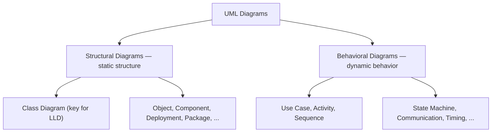
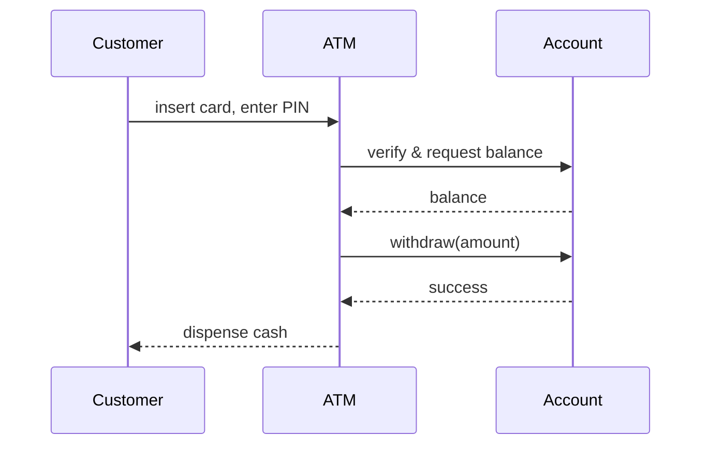
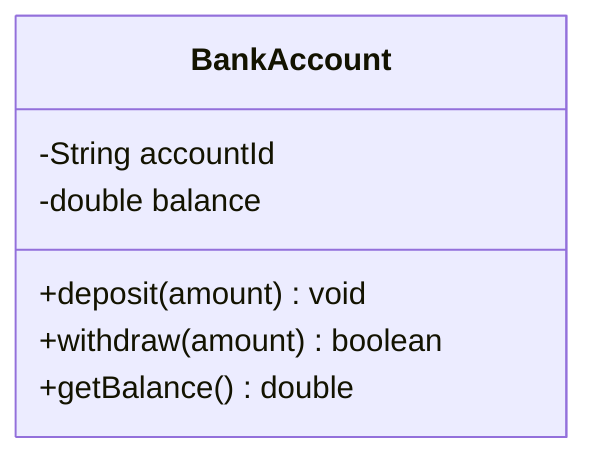
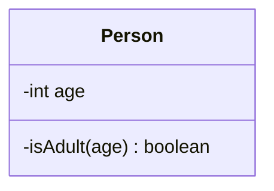
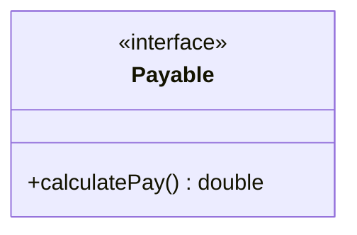
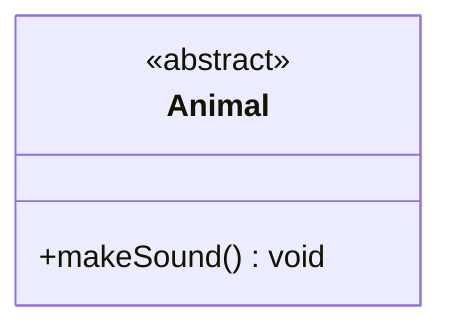
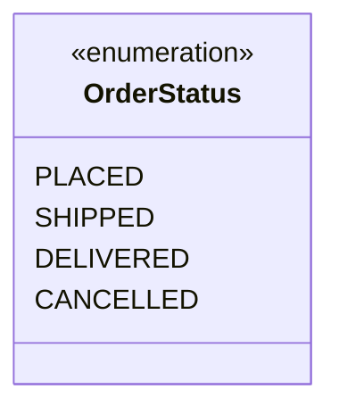
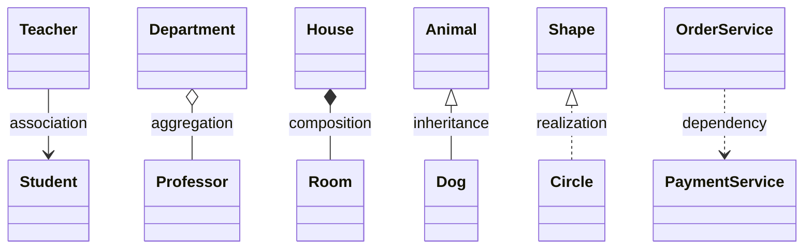

# UML — Unified Modeling Language

## What is UML?

<div style="border-left:4px solid #15448e;background:rgba(21,68,142,0.08);padding:0.6rem 1rem;border-radius:0 0.5rem 0.5rem 0;margin:1.25rem 0">

📘 **Definition.** UML (Unified Modeling Language) is a standardized modeling language used to visualize, specify, construct, and document the structure and behavior of software systems.

</div>

It provides a set of graphic notation techniques to create abstract models of systems, covering both static and dynamic aspects.

## Understanding

Think of UML as a toolkit of diagrams that helps software developers and designers map out how a system works, before or alongside writing the actual code. It's like planning a journey with a map — you get a clear picture of where everything is and how it all connects.

**Real-life analogy.** Imagine you're building a house. Before laying bricks, you'd need blueprints — diagrams that show where each room goes, how pipes connect, and how electricity flows. Without these, things can get messy, expensive, and confusing.

In the same way, UML diagrams are the blueprints of software systems. They help teams design systems clearly, avoid confusion, and catch problems early — before any code is written.

## Two families of UML diagrams

UML diagrams are divided into two main categories, each serving a different purpose in modeling software systems.

### Structural diagrams

These describe the static structure of a system — what it contains, how different parts relate to each other, and how data is organized.

They are like the architectural blueprints of the system, showing the foundation, components, and their connections. Structural diagrams focus on the elements that exist in the system (like classes, objects, and hardware), rather than what happens during execution.

### Behavioral diagrams

These describe the dynamic behavior of a system — how it behaves over time, how users interact with it, and how parts communicate during execution.

They are like the scripts and animations in a movie — showing what happens, when it happens, and who is involved. Behavioral diagrams focus on actions, interactions, processes, and state changes.

<div style="border-left:4px solid #15448e;background:rgba(21,68,142,0.08);padding:0.6rem 1rem;border-radius:0 0.5rem 0.5rem 0;margin:1.25rem 0">

📘 **The split in one line.** Structural = the parts that *exist* (classes, objects, hardware). Behavioral = what *happens* over time (actions, interactions, state changes).

</div>



## Structural diagrams in detail

There are seven main types of structural diagrams in UML, each serving a specific purpose in modeling the static aspects of a system:

- **Class Diagram:** Shows classes, their properties, methods, and relationships — a map of the code structure.
- **Object Diagram:** Shows a snapshot of instances of classes and their relationships at a specific point in time.
- **Component Diagram:** Depicts how software components (modules) are organized and connected.
- **Composite Structure Diagram:** Shows the internal parts of a class and how they interact to carry out behavior.
- **Deployment Diagram:** Illustrates how software is physically deployed onto hardware devices or servers.
- **Package Diagram:** Groups related elements (like classes) into packages for better organization.
- **Profile Diagram:** Used to customize UML for specific platforms or domains by extending its elements.

## Behavioral diagrams in detail

There are seven main types of behavioral diagrams in UML, each serving a specific purpose in modeling the dynamic aspects of a system:

- **Use Case Diagram:** Captures what users (actors) can do with the system — its high-level functionalities.
- **Activity Diagram:** Models workflows and business processes — similar to flowcharts.
- **Sequence Diagram:** Shows the order of messages exchanged between objects over time.
- **Communication Diagram:** Emphasizes interactions between objects and how they're connected.
- **State Machine Diagram:** Depicts how an object transitions between states based on events.
- **Interaction Overview Diagram:** Combines features of sequence and activity diagrams to model interaction flow.
- **Timing Diagram:** Focuses on object behavior with respect to time, particularly useful for real-time systems.

For example, a **sequence diagram** — one of the most common behavioral diagrams — captures how objects talk to each other over time. Here's a customer withdrawing cash from an ATM:



## Class Diagram

A UML Class Diagram provides a high-level overview of the system architecture. It captures the system's classes, interfaces, enumerations, their attributes and operations (methods), and the relationships among them. It is instrumental in both forward and reverse engineering processes and is widely used in modeling object-oriented systems.

Class diagrams support various design activities including domain modeling, data modeling, and the architectural representation of systems. These diagrams are often created during the early stages of the software development lifecycle and refined as the project progresses.

Looking at a class diagram, you must quickly be able to understand the system's structure and how different components interact with each other. This is particularly useful for new team members or stakeholders who need to get up to speed with the system's design regardless of understanding the underlying code.

In this section, we will explore the various components of UML Class Diagrams, including classes, attributes, methods, and relationships. We will also discuss the notations used to represent these elements and how they can be effectively utilized in software design.

### UML Class Notations

#### 1. Class representation

A class in UML is depicted as a rectangle divided into three compartments:

- **Top compartment:** Contains the class name (bold and centered).
- **Middle compartment:** Lists the attributes.
- **Bottom compartment:** Lists the operations (methods).



Each attribute or method is listed with its visibility marker, name, and type (for attributes) or return type (for methods). Parameters for methods are also specified in the parentheses.

#### 2. Visibility Markers

Visibility markers define access levels for attributes and operations:

- **Public (`+`):** Accessible from any other class.
- **Private (`-`):** Accessible only within the class itself.
- **Protected (`#`):** Accessible within the class and its subclasses.
- **Package (`~`):** Accessible within the same package.

These markers help enforce encapsulation, a core principle in object-oriented design.

#### 3. Attributes and Method System

Attributes and methods follow this syntax in class diagrams:

**3.1 Attributes**

```text
visibility name: Type [multiplicity] = DefaultValue
```

Let's break this down:

- **visibility:** The visibility marker (e.g., `+`, `-`, `#`, `~`).
- **name:** The name of the attribute.
- **Type:** The data type of the attribute (e.g., `int`, `String`).
- **multiplicity:** An optional field indicating how many instances of the attribute can exist (e.g., `0..1`, `1..*`, etc.).
- **DefaultValue:** An optional default value for the attribute.

For example, if you wish to represent the following statement: `public int age = 21;` using class diagram, then the conversion will look like this: `+ age: int = 21`

**3.2 Methods (Operations)**

```text
visibility name(parameterName1: Type1,...): ReturnType
```

Let's break this down:

- **visibility:** The visibility marker (e.g., `+`, `-`, `#`, `~`).
- **name:** The name of the method.
- **parameterName:** The name of the parameter.
- **Type:** The data type of the parameter.
- **ReturnType:** The return type of the method.

For example, if you wish to represent the method inside the class:

```java
class Person {
    private boolean isAdult(int age) {
        return age >= 18;
    }

    // Added only so the driver below can exercise isAdult() — the private
    // method above is the point being illustrated in the UML mapping.
    public boolean checkAdult(int age) {
        return isAdult(age);
    }
}

// ── Driver ──────────────────────────────────────────────
class Main {
    public static void main(String[] args) {
        Person person = new Person();
        System.out.println("Is 20 an adult? " + person.checkAdult(20));
        System.out.println("Is 15 an adult? " + person.checkAdult(15));
    }
}
```

using class diagram, then the conversion will look like this: `- isAdult(age:int): boolean`



Optional elements like multiplicity, default values, and stereotypes (e.g., `<<constructor>>`, `<<static>>`) can also be included to enrich the diagram.

#### 4. Interface

An interface defines a contract that other classes must follow. It contains only abstract methods (no implementation). UML class diagram for interfaces contains the following compartments:

- **Name compartment:** Contains the stereotype `<<interface>>` and the name of the interface.
- **Operation compartment:** Contains method signatures (i.e., abstract operations to be implemented).

For example, consider the following interface that can be represented as the diagram given below:

```java
// Interface for classes that can calculate pay
interface Payable {

    // Method to calculate pay
    double calculatePay();
}

// DemoPayable exists only to demonstrate the contract — not the canonical implementation.
class DemoPayable implements Payable {
    private final double hours;
    private final double rate;

    DemoPayable(double hours, double rate) {
        this.hours = hours;
        this.rate = rate;
    }

    @Override
    public double calculatePay() {
        return hours * rate;
    }
}

// ── Driver ──────────────────────────────────────────────
class Main {
    public static void main(String[] args) {
        Payable payable = new DemoPayable(40, 25.0);
        System.out.println("Calculated pay: " + payable.calculatePay());
    }
}
```



Note that by default, interfaces don't have a compartment for attributes like regular classes. However, there is an exception, i.e., If the interface declares constants, you may include an attribute compartment to show them.

#### 5. Abstract Class

An abstract class is a class that cannot be instantiated and may contain both implemented and unimplemented (abstract) methods. It is represented in UML class diagrams with the `<<abstract>>` stereotype above the class name and the class name being italic.

```java
// Abstract class representing an Animal
abstract class Animal {

    // Abstract method to make sound
    public abstract void makeSound();
}

// DemoAnimal exists only to demonstrate the contract — not the canonical implementation.
class DemoAnimal extends Animal {
    @Override
    public void makeSound() {
        System.out.println("Some generic animal sound");
    }
}

// ── Driver ──────────────────────────────────────────────
class Main {
    public static void main(String[] args) {
        Animal animal = new DemoAnimal();
        animal.makeSound();
    }
}
```

The diagram representation of the above code will look like this:



#### 6. Enumeration (Enum)

An enumeration is a data type consisting of a fixed set of named values, often called literals. It is represented in UML class diagrams with the `<<enumeration>>` stereotype above the name in one compartment and list of literals in another compartment.




### Perspectives of Class Diagrams

#### 1. Conceptual Perspective

Its purpose is to provide a high-level view of the system, focusing on the main concepts and their relationships. It is often used in the early stages of system design to establish a common understanding among stakeholders (Business Analysts, Domain Experts).

**Diagram Style:**

- Classes represent real-world concepts, like Customer, Order, Invoice.
- No attributes or operations are shown unless absolutely necessary.
- Relationships depict business-level associations, not implementation details.

#### 2. Specification Perspective

Its purpose is to define the structure and behavior of the system's classes, focusing on responsibilities, roles, and collaborations without specifying code-level details. This view highlights what operations a class should support, enabling interface and design-level planning. It is meant for System Architects and Software Designers.

**Diagram Style:**

- Includes abstract classes, interfaces, and key public methods.
- Shows associations and inheritance relationships between classes and interfaces.
- Focuses on contract-based design (e.g., what a class promises to do).

#### 3. Implementation Perspective

Its purpose is to present a concrete, code-level view of the system. This perspective includes complete class definitions, access modifiers, attributes with types and default values, and full method signatures. It is mainly used by developers and software engineers during the implementation phase.

**Diagram Style:**

- Shows all attributes (public, private, etc.) and methods.
- Includes visibility markers (+ public, - private, # protected).
- May show data types, default values, and even constructors.
- All relationships — including association, aggregation, composition, inheritance, and dependency — are explicitly visualized.

### Relationship Between Classes

The six relationship types are summarized in one diagram below, then explained individually:



#### 1. Association (USE-A)

Association represents a general relationship between two classes where one class uses or interacts with another. It can be: one-to-one, one-to-many or many-to-many.

- **Example:** A teacher can teach multiple students, and a student can be taught by multiple teachers (many-to-many association).
- **UML Notation:** A solid line between the two classes.

#### 2. Aggregation (HAS-A)

Aggregation is a "whole-part" relationship where a class is made up of one or more classes, but those parts can exist independently.

- **Example:** A Department has multiple Professors. If the department is removed, the professors still exist.
- **UML Notation:** A hollow diamond at the container (whole) class.

#### 3. Composition (Strong HAS-A)

Composition is a stronger form of aggregation where the part cannot exist without the whole. It is a "whole-part" relationship where the part is dependent on the whole.

- **Example:** A House has Rooms. If the House is destroyed, so are the Rooms.
- **UML Notation:** A filled diamond at the whole side.

#### 4. Inheritance

Inheritance defines an IS-A relationship where a subclass inherits properties and behavior from a superclass. The subclass can extend or override the superclass's attributes and methods.

- **Example:** A Dog is an Animal.
- **UML Notation:** A solid line with a hollow triangle pointing to the parent class.

#### 5. Realization (Implementation)

Realization is the relationship between a class and an interface. The class agrees to implement the behavior declared by the interface.

- **Example:** A Circle class implements the Shape interface.
- **UML Notation:** A dashed line with a hollow triangle pointing to the interface.

#### 6. Dependency

Dependency indicates that a class uses another class temporarily. Changes to the used class may affect the dependent class.

- **Example:** OrderService depends on PaymentService to process payments.
- **UML Notation:** A dashed line with an open arrow pointing to the class being used.

### Summary Table

| Relationship | UML Notation | Example |
| --- | --- | --- |
| **Association** | ─── | Student ─── Teacher |
| **Aggregation** | ───◇ | Department ◇─── Professor |
| **Composition** | ───◆ | House ◆─── Room |
| **Inheritance** | ───▷ | Dog ───▷ Animal |
| **Realization** | ╌╌╌▷ | Circle ╌╌╌▷ Shape Interface |
| **Dependency** | ╌╌╌> | Order ╌╌╌> Payment Services |
