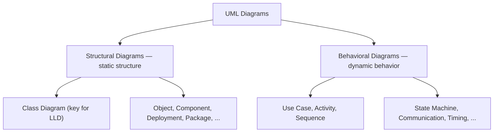
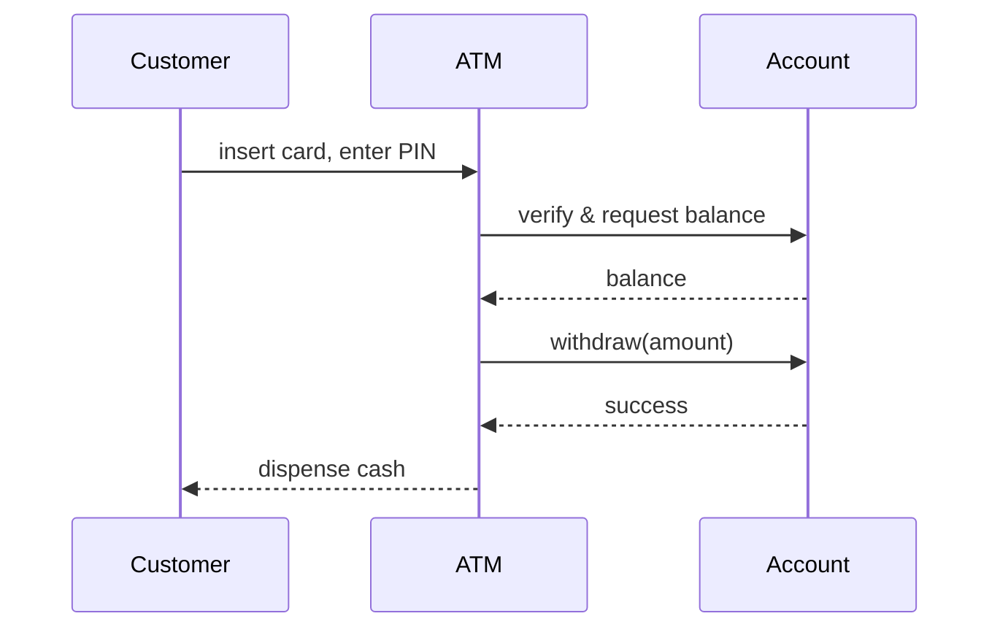
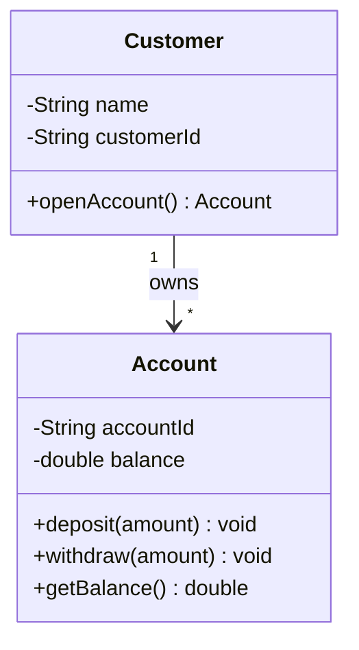

# UML — Unified Modeling Language

## What is UML?

📘 **Definition.** UML (Unified Modeling Language) is a standardized modeling language used to visualize, specify, construct, and document the structure and behavior of software systems.

It provides a set of graphic notation techniques to create abstract models of systems, covering both static and dynamic aspects.

## Understanding

Think of UML as a toolkit of diagrams that helps software developers and designers map out how a system works, before or alongside writing the actual code. It's like planning a journey with a map — you get a clear picture of where everything is and how it all connects.

**Real-life analogy.** Imagine you're building a house. Before laying bricks, you'd need blueprints — diagrams that show where each room goes, how pipes connect, and how electricity flows. Without these, things can get messy, expensive, and confusing.

In the same way, UML diagrams are the blueprints of software systems. They help teams design systems clearly, avoid confusion, and catch problems early — before any code is written.

## Two families of UML diagrams

UML diagrams are divided into two main categories, each serving a different purpose in modeling software systems.

### Structural diagrams

These describe the static structure of a system — what it contains, how different parts relate to each other, and how data is organized.

They are like the architectural blueprints of the system, showing the foundation, components, and their connections. Structural diagrams focus on the elements that exist in the system (like classes, objects, and hardware), rather than what happens during execution.

### Behavioral diagrams

These describe the dynamic behavior of a system — how it behaves over time, how users interact with it, and how parts communicate during execution.

They are like the scripts and animations in a movie — showing what happens, when it happens, and who is involved. Behavioral diagrams focus on actions, interactions, processes, and state changes.

📘 **The split in one line.** Structural = the parts that *exist* (classes, objects, hardware). Behavioral = what *happens* over time (actions, interactions, state changes).

## Structural diagrams in detail

There are seven main types of structural diagrams in UML, each serving a specific purpose in modeling the static aspects of a system:

- **Class Diagram:** Shows classes, their properties, methods, and relationships — a map of the code structure.
- **Object Diagram:** Shows a snapshot of instances of classes and their relationships at a specific point in time.
- **Component Diagram:** Depicts how software components (modules) are organized and connected.
- **Composite Structure Diagram:** Shows the internal parts of a class and how they interact to carry out behavior.
- **Deployment Diagram:** Illustrates how software is physically deployed onto hardware devices or servers.
- **Package Diagram:** Groups related elements (like classes) into packages for better organization.
- **Profile Diagram:** Used to customize UML for specific platforms or domains by extending its elements.

## Behavioral diagrams in detail

There are seven main types of behavioral diagrams in UML, each serving a specific purpose in modeling the dynamic aspects of a system:

- **Use Case Diagram:** Captures what users (actors) can do with the system — its high-level functionalities.
- **Activity Diagram:** Models workflows and business processes — similar to flowcharts.
- **Sequence Diagram:** Shows the order of messages exchanged between objects over time.
- **Communication Diagram:** Emphasizes interactions between objects and how they're connected.
- **State Machine Diagram:** Depicts how an object transitions between states based on events.
- **Interaction Overview Diagram:** Combines features of sequence and activity diagrams to model interaction flow.
- **Timing Diagram:** Focuses on object behavior with respect to time, particularly useful for real-time systems.

For example, a **sequence diagram** — one of the most common behavioral diagrams — captures how objects talk to each other over time. Here's a customer withdrawing cash from an ATM:

## Why the class diagram matters most for LLD

When diving into Low-Level Design, the focus is on the internal structure and detailed interaction of software components. While all UML diagrams have their place, the **class diagram** is considered the most important for mastering LLD. It provides a clear view of the classes, their attributes, methods, and relationships, making it essential for understanding how to design and implement software systems effectively.

💡 **Insight.** If you learn one UML diagram for low-level design, make it the class diagram — it maps the classes, their attributes and methods, and how they relate, which is exactly what LLD is about.

Here's what a class diagram looks like: an `Account` and the `Customer` who owns it, each with its attributes (`-` private) and methods (`+` public), plus an association showing that one customer can own many accounts.

## Summary

- **UML** is a standardized visual language for modeling the structure and behavior of software systems — the blueprints you draw before (or alongside) writing code.
- Its diagrams fall into two families: **structural** (the static parts that exist — classes, objects, hardware) and **behavioral** (the dynamic behavior over time — interactions, workflows, state changes).
- There are seven structural and seven behavioral diagram types, each with a specific purpose.
- For **low-level design**, the **class diagram** is the one to master — it captures classes, attributes, methods, and relationships, the core of how a system is designed and implemented.
