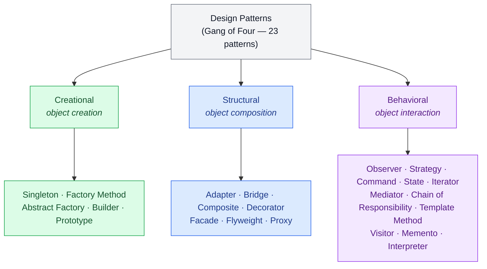

# Introduction to Design Patterns

Design patterns are a foundational concept in software engineering, especially when building scalable and maintainable systems. In this article, we explore what design patterns are, why they matter, how they originated, and how they are categorized. This introduction sets the stage for deeper dives into individual patterns in upcoming discussions.

## What Are Design Patterns?

Design patterns are standard, time-tested solutions to common software design problems. They are not code templates but abstract descriptions or blueprints that help developers solve issues in code architecture and system design.

To put it simply: Design patterns help you avoid reinventing the wheel when facing recurring design challenges.

### Real-World Analogy

💡 **Insight.** Think of design patterns like recipes in cooking. If you want to bake a cake, you don't experiment from scratch each time - you follow a proven recipe. Similarly, design patterns are tried-and-tested “recipes” for solving common coding problems efficiently and consistently.

## The Origin of Design Patterns

The idea of design patterns was formalized by the Gang of Four (GoF) - Erich Gamma, Richard Helm, Ralph Johnson, and John Vlissides - in their seminal 1994 book "Design Patterns: Elements of Reusable Object-Oriented Software."

They cataloged 23 design patterns that were repeatedly seen in object-oriented software development and grouped them into three major categories.

## The Three Categories of Design Patterns

### 1. Creational Patterns

These focus on object creation mechanisms, trying to create objects in a manner suitable to the situation. They abstract the instantiation process, making the system independent of how its objects are created.

### Real-World Analogy

💡 **Insight.** Imagine ordering a drink at a vending machine. You press a button (say “Orange Juice”), and the machine internally figures out how to prepare it - whether to pour from a bottle, mix a concentrate, or use a fresh dispenser. You don't care how it's made - you just get your drink.

This is similar to the Factory Pattern, where the creation logic is hidden from the user and abstracted for flexibility.

Examples include:

- Singleton Pattern
- Factory Method
- Abstract Factory Pattern
- Builder Pattern
- Prototype Pattern

### 2. Structural Patterns

These deal with object composition - how classes and objects can be combined to form larger structures while keeping the system flexible and efficient. It helps systems to work together that otherwise could not because of incompatible interfaces.

### Real-World Analogy

💡 **Insight.** Suppose you have a modern smartphone (your system) that uses a USB-C charger, but your old power adapter only supports micro-USB. Instead of replacing either device, you use an adapter that connects the two.

That adapter is like a structural pattern (specifically, the Adapter Pattern) - it allows incompatible components to work together seamlessly without changing their internals.

Examples include:

- Adapter Pattern
- Bridge Pattern
- Composite Pattern
- Decorator Pattern
- Facade Pattern
- Flyweight Pattern
- Proxy Pattern

### 3. Behavioral Patterns

These are concerned with object interaction and responsibility - how they communicate and assign responsibilities while ensuring loose coupling.

### Real-World Analogy

💡 **Insight.** Think of a restaurant. The waiter takes your order and passes it to the kitchen. You don't talk directly to the chef - the waiter acts as a mediator between you and the kitchen.

This reflects the Mediator Pattern, which defines an object that controls communication between other objects, preventing tight interdependencies.

Examples include:

- Observer Pattern
- Strategy Pattern
- Interpreter Pattern
- Command Pattern
- Chain of Responsibility
- Mediator Pattern
- State Pattern
- Template Method
- Visitor Pattern
- Iterator Pattern
- Memento Pattern

This is just a brief overview of design patterns. Each pattern has its own unique characteristics, advantages, and use cases. In the following topics, we will delve deeper into each category and explore specific patterns in detail.
</content>
