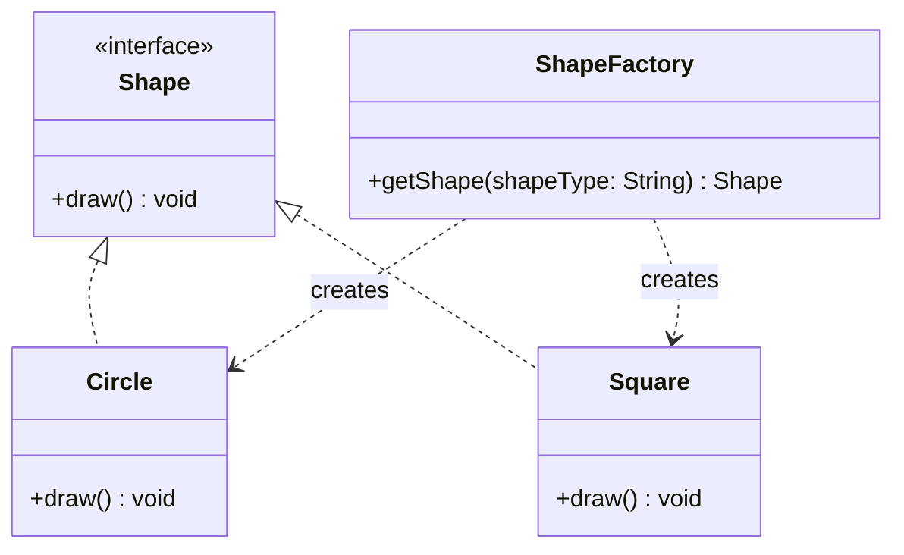
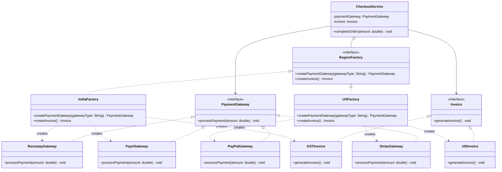
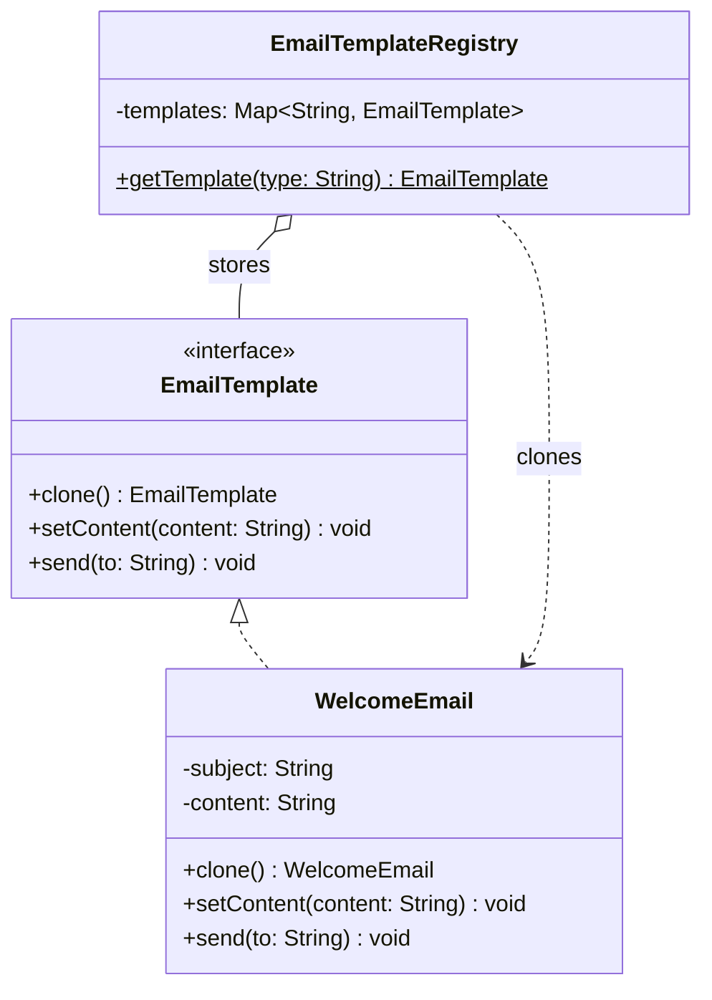

# Creational Design Patterns

## Singleton Pattern

The Singleton Pattern ensures that a class has only one instance and provides a global point of access to that instance.

### In simpler terms

Imagine you're building an application where you only want one shared object throughout the lifecycle of the program. This is where Singleton comes into play - it restricts object creation and guarantees that all parts of your application use the same object.

### The Problem It Solves

In a typical application, creating multiple objects of a class might not be problematic. However, in certain scenarios - like logging, configuration handling, or managing a database connection - you want just one instance to avoid redundancy, excessive memory use, or inconsistent behavior.

#### Real-World Analogy: The Operating System's Print Spooler

Imagine you're in an office with multiple employees, and everyone sends documents to a single shared printer. Now, if each computer tried to talk directly to the printer on its own terms, the printer would get overwhelmed - prints might get jumbled, overlap, or crash the device.

<div style="border-left:4px solid #195045;background:rgba(25,80,69,0.08);padding:0.6rem 1rem;border-radius:0 0.5rem 0.5rem 0;margin:1.25rem 0">

💡 **Insight.** Instead, there's a Print Spooler - a background service that manages all print jobs.

</div>

No matter who initiates the print, they all go through one centralized spooler instance that queues and handles the tasks in order.

### Why Is It a Creational Pattern?

The Singleton Pattern falls under the creational design patterns. This is because it deals with how objects are created. Unlike simple instantiation (new), Singleton controls the object creation process by returning an existing instance rather than creating a new one.

### Identifying the Need for a Singleton

Imagine you're developing a logging service. You need a class that writes logs to a file. If every part of your application creates a new logger instance, the result might be:

- Overwritten logs
- Multiple file handles
- Synchronization issues

Instead, if there's only one logger instance (a Singleton), all parts of the program write to the same log file in a controlled manner.

### Working of Singleton Pattern

The Singleton Pattern typically involves the following steps:

- **Private constructor:** Prevents instantiation from outside the class.
- **Static variable:** Holds the single instance of the class.
- **Public static method:** Provides a global access point to get the instance.

This ensures that no matter how many times you call the method to get an instance, it will always return the same object.

### Approaches to Implement Singleton Pattern

In the real world, while designing the product, there are two primary ways to implement the Singleton pattern:

- Eager Loading
- Lazy Loading

Each with its own trade-offs in terms of performance, memory usage, and thread safety.

#### 1. Eager Loading (Early Initialization)

In Eager Loading, the Singleton instance is created as soon as the class is loaded, regardless of whether it's ever used. Let's understand this with a real-life analogy.

##### Real-World Analogy: Fire Extinguisher in a Building

A fire extinguisher is always present, even if a fire never occurs. Similarly, eager loading creates the Singleton instance upfront, just in case it's needed.

Example Code:

```java
// Class implementing Eager Loading
class EagerSingleton {
    private static final EagerSingleton instance = new EagerSingleton();

    // private constructor
    private EagerSingleton() {
        // Declaring it private prevents creation of its object using the new keyword
    }

    // Method to get the instance of class
    public static EagerSingleton getInstance() {
        return instance; // Always returns the same instance
    }
}
```

##### Understanding

- The object is created immediately when the class is loaded.
- It's always available and inherently thread-safe.

##### Pros

- Very simple to implement.
- Thread-safe without any extra handling.

##### Cons

- Wastes memory if the instance is never used.
- Not suitable for heavy objects.

#### 2. Lazy Loading (On-Demand Initialization)

In Lazy Loading, the Singleton instance is created only when it's needed - the first time the getInstance() method is called.

##### Real-World Analogy: Coffee Machine

Imagine a coffee machine that only brews coffee when you press the button. It doesn't waste energy or resources until you actually want a cup. Similarly, lazy loading creates the Singleton instance only when it's requested.

Example Code:

```java
// Class implementing Lazy Loading
class LazySingleton {
    // Object declaration
    private static LazySingleton instance;

    // private constructor
    private LazySingleton() {
        // Declaring it private prevents creation of its object using the new keyword
    }

    // Method to get the instance of class
    public static LazySingleton getInstance() {
        // If the object is not created
        if (instance == null) {
            // A new object is created
            instance = new LazySingleton();
        }

        // Otherwise the already created object is returned
        return instance;
    }
}
```

##### Understanding

- The instance starts as null.
- It is only created when getInstance() is first called.
- Future calls return the already created instance.

##### Pros

- Saves memory if the instance is never used.
- Object creation is deferred until required.

##### Cons

- Lazy Loading is Not thread-safe by default. Thus, it requires synchronization in multi-threaded environments.

### Thread Safety: A Critical Concern in Singleton Pattern

In a single-threaded environment, implementing a Singleton is straightforward. However, things get complicated in multi-threaded applications, which are very common in modern software (especially web servers, mobile apps, etc.).

#### The Problem

Let's say two threads simultaneously call getInstance() for the first time in a lazy-loaded Singleton.

<div style="border-left:4px solid #da5233;background:rgba(218,82,51,0.08);padding:0.6rem 1rem;border-radius:0 0.5rem 0.5rem 0;margin:1.25rem 0">

⚠️ **Watch out.** If the instance hasn't been created yet, both threads might pass the null check and end up creating two different instances - completely breaking the Singleton guarantee.

</div>

This kind of bug is:

- Hard to detect, as it may not occur every time.
- Severe, because it defeats the whole purpose of the pattern.
- Costly, especially if the Singleton manages critical resources like logging, configuration, or DB connections.

#### Different Ways to Achieve Thread Safety

There are several ways to make the Singleton pattern thread-safe. Here are a few common approaches:

##### 1. Synchronized Method

This is the simplest way to ensure thread safety. By synchronizing the method that creates the instance, we can prevent multiple threads from creating separate instances at the same time. However, this approach can lead to performance issues due to the overhead of synchronization.

Consider the following code snippet for better understanding:

```java
public class Singleton {
    // Object declaration
    private static Singleton instance;

    // Private constructor
    private Singleton() {}

    // Synchronized keyword used
    public static synchronized Singleton getInstance() {
        if (instance == null) {
            instance = new Singleton();
        }
        return instance;
    }
}
```

**What synchronized keyword does?** The synchronized keyword ensures that only one thread at a time can execute the getInstance() method. This prevents multiple threads from entering the method simultaneously and creating multiple instances.

**Pros:**

- Simple and easy to implement.
- Thread-safe without needing complex logic.

**Cons:**

- **Performance overhead:** Every call to getInstance() is synchronized, even after the instance is created.
- May slow down the application in high-concurrency scenarios.

##### 2. Double-Checked Locking

This is a more efficient way to achieve thread safety. The idea is to check if the instance is null before acquiring the lock. If it is, then we synchronize the block and check again. This reduces the overhead of synchronization after the instance has been created.

Consider the following code snippet for better understanding:

```java
public class Singleton {
    // Volatile object declaration
    private static volatile Singleton instance;

    // Private constructor
    private Singleton() {}

    // Thread-safe method using double-checked locking
    public static Singleton getInstance() {
        if (instance == null) {
            synchronized (Singleton.class) {
                if (instance == null) {
                    instance = new Singleton();
                }
            }
        }
        return instance;
    }
}
```

**Understanding:**

- The outer if check avoids synchronization once the instance is created.
- The inner if inside synchronized ensures that only one thread creates the instance.
- volatile keyword ensures changes made by one thread are visible to others. Without volatile, one thread might create the Singleton instance, but other threads may not see the updated value due to caching. volatile ensures that the instance is always read from the main memory, so all threads see the most up-to-date version.

**Pros:**

- **Efficient:** Synchronization only happens once, when the instance is created.
- Safe and fast in concurrent environments.

**Cons:**

- Slightly more complex than the synchronized method.
- Requires Java 1.5 or above due to reliance on volatile.

##### 3. Bill Pugh Singleton (Best Practice for Lazy Loading)

This is a highly efficient way to implement the Singleton pattern. It uses a static inner helper class to hold the Singleton instance. The instance is created only when the inner class is loaded, which happens only when getInstance() is called for the first time.

Consider the following code snippet for better understanding:

```java
public class Singleton {
    // Private constructor
    private Singleton() {}

    // Static inner class to hold the Singleton instance
    private static class Holder {
        private static final Singleton INSTANCE = new Singleton();
    }

    // Public method to return the Singleton instance
    public static Singleton getInstance() {
        return Holder.INSTANCE;
    }
}
```

**Explanation:**

- The Singleton instance is not created until getInstance() is called.
- The static inner class (Holder) is not loaded until referenced, thanks to Java's class loading mechanism.
- It ensures thread safety, lazy loading, and high performance without synchronization overhead.

**Pros:**

- **Best of both worlds:** Lazy + Thread-safe.
- No need for synchronized or volatile.
- Clean and efficient.

**Cons:**

- It is slightly less intuitive for beginners due to the use of a nested static class.

##### 4. Eager Loading

As discussed earlier, eager loading does not face thread safety issues. This approach avoids thread issues altogether by creating the instance upfront - at the cost of potential memory waste. Thus, it is not a preferred method in most cases but is still a valid option.

### Pros of Singleton Pattern

- **Cleaner Implementation:** Singleton offers a straightforward and tidy way to manage a single instance of a class, especially when designed with thread safety and simplicity in mind.
- **Guarantees One Instance:** This pattern enforces that only one instance of the class can exist, making it ideal for shared resources.
- **Provides a Way to Maintain a Global Resource:** It allows centralized access to a global resource or service, which can be useful in managing application-wide configurations or state.
- **Supports Lazy Loading:** Many Singleton implementations allow the instance to be created only when it is first accessed, optimizing memory usage and startup performance.

### Cons of Singleton Pattern

- **Used with Parameters and Confused with Factory:** When a Singleton class requires parameters for instantiation, it may blur lines with the Factory pattern, leading to design confusion.
- **Hard to Write Unit Tests:** Since the Singleton holds a global state, it becomes difficult to isolate and mock for unit testing, thus potentially hindering testability.
- **Classes Using It Are Highly Coupled to It:** Components that depend on the Singleton become tightly coupled to its implementation, which reduces flexibility and makes code harder to maintain or refactor.
- **Special Cases to Avoid Race Conditions:** In multi-threaded environments, care must be taken to avoid race conditions during the instance creation phase, complicating implementation.
- **Violates the Single Responsibility Principle (SRP):** A Singleton often handles both instance control and its core functionality, thereby violating the SRP, a key principle of clean software design.

### Conclusion

The Singleton pattern can be a powerful tool when used appropriately, particularly for managing global states and shared resources. However, developers should be mindful of its drawbacks, especially regarding testing and maintainability. Consider alternatives or enhanced implementations (like dependency injection) where appropriate to maintain clean and scalable codebases.

## Factory Pattern

The Factory Pattern is a creational design pattern that provides an interface for creating objects but allows subclasses to alter the type of objects that will be created.

### In simpler terms

Rather than calling a constructor directly to create an object, we use a factory method to create that object based on some input or condition.

### When Should You Use It?

We can use the Factory Pattern when:

- The client code needs to work with multiple types of objects.
- The decision of which class to instantiate must be made at runtime.
- The instantiation process is complex or needs to be controlled.

### Real-World Analogy: Ordering Pizza

Imagine you walk into a pizza shop and say, "I'd like a pizza." The shop doesn't ask you to go into the kitchen and make it yourself. Instead, it asks, "Which type? Margherita? Pepperoni? Veggie?" Based on your choice, the kitchen (factory) creates the specific pizza for you and hands it over.

You (the client), don't care how it's made or what specific class of ingredients is used. You just want your pizza. The factory (kitchen) handles the creation logic behind the scenes.

<div style="border-left:4px solid #195045;background:rgba(25,80,69,0.08);padding:0.6rem 1rem;border-radius:0 0.5rem 0.5rem 0;margin:1.25rem 0">

💡 **Insight.** This is exactly what the Factory Pattern does in code: it creates an object based on some input without exposing the instantiation logic to the client.

</div>

### Basic Structure of Factory Pattern

The Factory Pattern typically consists of the following components:

- **Product:** It is an interface or abstract class that defines the methods the product must implement.
- **Concrete Products:** The concrete classes that implement the Product interface.
- **Factory:** A class with a method that returns different concrete products based on input.

Consider the following example code snippet:

```java
// Interface
interface Shape {
    void draw();
}

// Class implementing the Shape Interface
class Circle implements Shape {
    @Override
    public void draw() {
        System.out.println("Drawing Circle");
    }
}

// Class implementing the Shape Interface
class Square implements Shape {
    @Override
    public void draw() {
        System.out.println("Drawing Square");
    }
}

// Factory Class
class ShapeFactory {
    /* Method that takes the type of shape as input
    and returns the cirresponding object */
    public Shape getShape(String shapeType) {
        if (shapeType.equalsIgnoreCase("CIRCLE")) {
            return new Circle();
        } else if (shapeType.equalsIgnoreCase("SQUARE")) {
            return new Square();
        }
        return null;
    }
}

// Driver code
class Main {
    public static void main(String[] args) {
        // Object of ShapeFactory is initialized
        ShapeFactory shapeFactory = new ShapeFactory();

        // Get a Circle object and call its draw method
        Shape shape1 = shapeFactory.getShape("CIRCLE");
        shape1.draw();

        // Get a Square object and call its draw method
        Shape shape2 = shapeFactory.getShape("SQUARE");
        shape2.draw();
    }
}
```

Here, ShapeFactory is the factory that returns different objects (Circle, Square) based on input.

### Real-life Product Example - Logistics Services

Let's say you are building a logistics application that needs to handle different types of transport services: By Road, By Air, etc.

#### Bad Practice: Not Following Factory Pattern

Consider the following code snippet where object creation logic is tightly coupled with business logic:

```java
// Logistics Interface
interface Logistics {
    void send();
}

// Class implementing the Logistics Interface
class Road implements Logistics {
    @Override
    public void send() {
        System.out.println("Sending by road logic");
    }
}

// Class implementing the Logistics Interface
class Air implements Logistics {
    @Override
    public void send() {
        System.out.println("Sending by air logic");
    }
}

// Class implementing Logistics Service
class LogisticsService {
    public void send(String mode) {
        if (mode.equals("Air")) {
            Logistics logistics = new Air();
            logistics.send();
        } else if (mode.equals("Road")) {
            Logistics logistics = new Road();
            logistics.send();
        }
    }
}

// Driver code
class Main {
    public static void main(String[] args) {
        LogisticsService service = new LogisticsService();
        service.send("Air");
        service.send("Road");
    }
}
```

##### Understanding the Issue:

In the LogisticsService class:

- The object of Air or Road is directly instantiated based on string comparison.
- The object creation logic is embedded inside the business logic (send method).
- This violates the Open/Closed Principle — if you want to add a new mode (e.g., Ship), you have to modify the send method.

##### Problems:

- **Tight Coupling:** LogisticsService depends directly on Air and Road classes.
- **Hard to Extend:** Adding a new mode (e.g., Drone, Ship) requires modifying existing code.
- **No Separation of Concerns:** Object creation and business logic are mixed.
- **Code Duplication:** Repeated instantiation and send() logic.
- **Testing & Maintenance Nightmare:** Hard to test independently or mock logistics.

#### Good Practice: Following Factory Pattern

Let's now apply the Factory Pattern to clean this up and make it scalable.

```java
// Logistic Interface
interface Logistics {
    void send();
}

// Class implementing the Logistics Interface
class Road implements Logistics {
    @Override
    public void send() {
        System.out.println("Sending by road logic");
    }
}

// Class implementing the Logistics Interface
class Air implements Logistics {
    @Override
    public void send() {
        System.out.println("Sending by air logic");
    }
}

// Factory Class taking care of Logistics
class LogisticsFactory {
    public static Logistics getLogistics(String mode) {
        if (mode.equalsIgnoreCase("Air")) {
            return new Air();
        } else if (mode.equalsIgnoreCase("Road")) {
            return new Road();
        }
        throw new IllegalArgumentException("Unknown logistics mode: " + mode);
    }
}

// Class implementing the Logistics Services
class LogisticsService {
    public void send(String mode) {
        /* Using the Logistics Factory to get the
        desired object based on the mode */
        Logistics logistics = LogisticsFactory.getLogistics(mode);
        logistics.send();
    }
}

// Driver Code
class Main {
    public static void main(String[] args) {
        LogisticsService service = new LogisticsService();
        service.send("Air");
        service.send("Road");
    }
}
```

##### Understanding the Improvement:

In this refactored code:

- The object creation logic is moved to the LogisticsFactory.
- The LogisticsService class now only focuses on business logic.
- Adding a new mode (e.g., Ship) only requires modifying the factory, not the service.

##### Benefits:

- **Loose Coupling:** The service is decoupled from specific logistics classes.
- **Open/Closed Principle:** New modes can be added without modifying existing code.
- **Separation of Concerns:** Object creation and business logic are separated.
- **No Code Duplication:** Instantiation logic is centralized in the factory.
- **Easier Testing & Maintenance:** Each component can be tested independently.

### Pros of Factory Pattern

- **Promotes Loose Coupling:**
  - The client code is decoupled from the actual instantiation of classes.
  - You work with interfaces rather than concrete classes.
- **Enhances Extensibility (OCP - Open/Closed Principle):**
  - You can introduce new classes (e.g., new types of logistics like Ship) without modifying existing client code.
  - The system becomes easier to scale and extend.
- **Centralizes Object Creation (SRP - Single Responsibility Principle):**
  - The responsibility of object creation is moved to a dedicated factory class.
  - Business logic stays clean and focused only on "what to do" with the object.
- **Increases Flexibility:**
  - The decision of "which object to create" can be deferred to runtime based on input, config, or logic.
  - Makes your system adaptable to dynamic requirements.
- **Improves Code Reusability:**
  - Common instantiation logic can be reused from a single factory.
  - Avoids code duplication when creating similar objects in different parts of the system.

### Cons of Factory Pattern

- **Increased Complexity:** Introduces additional layers (factory classes/interfaces) which might be overkill for very small programs.
- **More Code Overhead:** Requires writing extra code like factory classes and interfaces, which might look unnecessary in simpler use-cases.

### Class Diagram



## Builder Pattern

The Builder Pattern is a creational design pattern that separates the construction of a complex object from its representation. This allows you to create different types and representations of an object using the same construction process.

<div style="border-left:4px solid #15448e;background:rgba(21,68,142,0.08);padding:0.6rem 1rem;border-radius:0 0.5rem 0.5rem 0;margin:1.25rem 0">

📘 **Definition.** "Builder pattern builds a complex object step by step. It separates the construction of a complex object from its representation, so that the same construction process can create different representations."

</div>

### In simpler terms

Imagine you're ordering a custom burger. You choose the bun, patty, toppings, sauces, and whether you want it grilled or toasted. The chef follows your instructions step by step to build your custom burger. This is what the Builder Pattern does - it lets you construct complex objects by specifying their parts one at a time, giving you flexibility and control over the object creation process.

### Real-life Analogy (Custom Pizza Order)

Think of ordering a pizza online. You select the crust type, size, toppings, cheese, and sauce - all step by step. The pizza shop then builds your pizza according to your selections. Different customers can use the same process to get entirely different pizzas. This is the essence of the Builder Pattern: a structured, step-wise approach to creating customized complex objects.

### Understanding the Problem

Imagine you're building a BurgerMeal in your application. A burger must have some mandatory components like: Bun and Patty. And it can also include option components like: Sides, Toppings, and Cheese.

Now let's try to implement this using a traditional constructor approach:

```java
import java.util.*;

// Represents a customizable Burger Meal
class BurgerMeal {
    // Mandatory components
    private String bun;
    private String patty;

    // Optional components
    private String sides;
    private List<String> toppings;
    private boolean cheese;

    // Constructor trying to handle all combinations
    public BurgerMeal(String bun, String patty, String sides, List<String> toppings, boolean cheese) {
        this.bun = bun;
        this.patty = patty;
        this.sides = sides;
        this.toppings = toppings;
        this.cheese = cheese;
    }
}

class Main {
    public static void main(String[] args) {
        // Constructing the object with only required details
        BurgerMeal burgerMeal = new BurgerMeal("wheat", "veg", null, null, false);
    }
}
```

#### Issues in Code:

This constructor approach works, but it creates multiple problems:

- **Hard to Read and Maintain:** The user has to remember the order of parameters and their types. It becomes difficult to read when more optional parameters are added.
- **Unnecessary null values:** Even if the user doesn't want toppings or sides, they still have to pass null explicitly. This clutters the object creation code.
- **Risk of NullPointerException:** If we forget to null-check before accessing optional values inside the class, it may lead to runtime exceptions.
- **Too Many Constructor Overloads:** To handle various combinations (e.g., with cheese, without sides, only toppings, etc.), you'd need to create multiple overloaded constructors - which is not scalable.
- **Tight Coupling Between Parameters and Construction:** There is no flexibility to set values step by step. The entire object must be built in one go, which doesn't match the natural way of ordering or customizing a burger.

### Telescoping Constructor Anti-Pattern

To manage optional parameters, many developers try to solve this by writing multiple overloaded constructors - each with one more optional parameter than the last. For example:

```java
class BurgerMeal {
    public BurgerMeal(String bun, String patty) { ... }
    public BurgerMeal(String bun, String patty, boolean cheese) { ... }
    public BurgerMeal(String bun, String patty, boolean cheese, String side) { ... }
    public BurgerMeal(String bun, String patty, boolean cheese, String side, String drink) { ... }
}
```

This is called Telescoping Constructor Anti-Pattern.

But this creates a cascade of constructors that become:

- Hard to read and write
- Error-prone due to confusing parameter order
- Difficult to maintain when more fields are added
- Inflexible, as users must use parameters in a specific order

It occurs most commonly in Java, which lacks support for optional or default parameters (unlike C++ or Python). Because of this limitation, developers are forced to create multiple constructor overloads to handle different combinations of parameters.

Clearly, this approach doesn't scale well. And this is exactly the kind of problem that the Builder Pattern is designed to solve. It gives the user full control over which parts to build while keeping the construction code clean, readable, and safe.

### The Solution

To solve the problems we saw earlier with constructors, we use the Builder Pattern. It separates object construction from its representation, allowing us to build step-by-step while keeping the object immutable and readable.

```java
import java.util.*;

// Represents a customizable Burger Meal
class BurgerMeal {
    // Required components
    private final String bunType;
    private final String patty;

    // Optional components
    private final boolean hasCheese;
    private final List<String> toppings;
    private final String side;
    private final String drink;

    // Private constructor to force use of Builder
    private BurgerMeal(BurgerBuilder builder) {
        this.bunType = builder.bunType;
        this.patty = builder.patty;
        this.hasCheese = builder.hasCheese;
        this.toppings = builder.toppings;
        this.side = builder.side;
        this.drink = builder.drink;
    }

    // Static nested Builder class
    public static class BurgerBuilder {
        // Required
        private final String bunType;
        private final String patty;

        // Optional
        private boolean hasCheese;
        private List<String> toppings;
        private String side;
        private String drink;

        // Builder constructor with required fields
        public BurgerBuilder(String bunType, String patty) {
            this.bunType = bunType;
            this.patty = patty;
        }

        // Method to set cheese
        public BurgerBuilder withCheese(boolean hasCheese) {
            this.hasCheese = hasCheese;
            return this;
        }

        // Method to set toppings
        public BurgerBuilder withToppings(List<String> toppings) {
            this.toppings = toppings;
            return this;
        }

        // Method to set side
        public BurgerBuilder withSide(String side) {
            this.side = side;
            return this;
        }

        // Method to set drink
        public BurgerBuilder withDrink(String drink) {
            this.drink = drink;
            return this;
        }

        // Final build method
        public BurgerMeal build() {
            return new BurgerMeal(this);
        }
    }
}

class Main {
    public static void main(String[] args) {
        // Creating burger with only required fields
        BurgerMeal plainBurger = new BurgerMeal.BurgerBuilder("wheat", "veg")
                                    .build();

        // Burger with cheese only
        BurgerMeal burgerWithCheese = new BurgerMeal.BurgerBuilder("wheat", "veg")
                                        .withCheese(true)
                                        .build();

        // Fully loaded burger
        List<String> toppings = Arrays.asList("lettuce", "onion", "jalapeno");
        BurgerMeal loadedBurger = new BurgerMeal.BurgerBuilder("multigrain", "chicken")
                                        .withCheese(true)
                                        .withToppings(toppings)
                                        .withSide("fries")
                                        .withDrink("coke")
                                        .build();
    }
}
```

#### Understanding the Code

- **Private Constructor:** The constructor of BurgerMeal is made private so that object creation is restricted to the Builder only.
- **Nested Static BurgerBuilder Class:** This builder class holds the same fields as BurgerMeal. It ensures immutability and keeps construction controlled.
- **Fluent API Style:** Each method (like withCheese, withSide) returns the builder itself, enabling method chaining in a fluent and readable manner.
- **Selective Configuration:** Only required fields (bunType, patty) are passed to the builder's constructor. Everything else is optional and set via withXYZ() methods.
- **Final Step: build():** Once all desired fields are set, calling .build() finalizes the object construction and returns the BurgerMeal instance.

### Why This is Better

| Aspect | Constructor Approach | Builder Pattern |
| --- | --- | --- |
| Object readability | Poor (nulls, long argument list) | Excellent (fluent and expressive) |
| Flexibility | Low (all-or-nothing setup) | High (configure only what's needed) |
| Maintainability | Hard to scale with more fields | Easy to extend with more options |
| Safety | High chance of errors with nulls | Controlled and safe instantiation |

### When to Use and When to Avoid the Builder Pattern

#### When to Use?

You should consider using the Builder Pattern in the following scenarios:

- An object has multiple fields, especially when many of them are optional. Managing such objects using constructors becomes messy and error-prone.
- Immutability is preferred - Builder lets you construct an object step by step and then make it immutable once built.
- You want readable, maintainable object creation, especially when dealing with domain models or configuration objects. The fluent interface style improves clarity and flexibility.

#### When to Avoid?

The Builder Pattern can be overkill in simpler use cases. Avoid it when:

- **Your class has only 1-2 fields:** Using a constructor or setter methods is simpler and more concise.
- **You don't need object customization or immutability:** If the object is small, mutable, or built only in one place, a builder adds unnecessary complexity.

### Pros and Cons of Builder Pattern

Understanding both the advantages and limitations of the Builder Pattern helps in deciding when to use it effectively.

#### Pros

- **Avoids constructor telescoping:** You no longer need to write multiple overloaded constructors for different configurations.
- **Ensures immutability:** The final object can be made immutable once built, which improves safety and thread-safety.
- **Clean, readable object creation:** The fluent API makes object construction expressive and easy to follow.
- **Great for complex configurations:** If your object has many optional parameters or conditional setup, the builder pattern keeps it organized.

#### Cons

- **Slightly tough to set up:** Initial setup requires writing a separate builder class, which adds to boilerplate.
- **Overkill for small classes:** If a class only has one or two fields, using a builder adds unnecessary complexity.
- **Separate builder class needed:** You need to maintain a second class or static inner class just to construct the main object, increasing maintenance.

### Real World Products Using Builder Pattern

Understanding where the Builder Pattern is used in real products helps solidify its relevance. Let's look at two real-world examples:

#### 1. Lombok's @Builder Annotation (Java)

Lombok is a Java library that reduces boilerplate code using annotations. One of its popular features is the @Builder annotation, which automatically generates a builder class behind the scenes.

Instead of writing the builder logic manually, you just annotate your class:

```java
@Builder
public class User {
    private String name;
    private int age;
    private String address;
}
```

Now, you can build objects using a fluent API:

```java
User user = User.builder()
            .name("John")
            .age(30)
            .address("NYC")
            .build();
```

#### 2. Amazon Cart Configuration

Think about Amazon's shopping cart system. When you add an item to your cart, you're not just storing an item ID. You're building a complex object with fields like:

- Quantity
- Size or color (for apparel)
- Delivery option
- Gift wrap
- Save for later status
- Discounted price or offer tag

Each user may customize these options differently. Internally, such cart items are likely created using a Builder Pattern to allow step-by-step configuration while ensuring data consistency and immutability.

## Abstract Factory Pattern

<div style="border-left:4px solid #15448e;background:rgba(21,68,142,0.08);padding:0.6rem 1rem;border-radius:0 0.5rem 0.5rem 0;margin:1.25rem 0">

📘 **Definition.** The Abstract Factory Pattern is a creational design pattern that provides an interface for creating families of related or dependent objects without specifying their concrete classes.

</div>

### In simpler terms

You use it when you have multiple factories, each responsible for producing objects that are meant to work together.

### When Should You Use It?

Use of the Abstract Factory Pattern is appropriate in the following scenarios:

- When multiple related objects must be created as part of a cohesive set (e.g., a payment gateway and its corresponding invoice generator).
- When the type of objects to be instantiated depends on a specific context, such as country, theme, or platform.
- When client code should remain independent of concrete product classes.
- When consistency across a family of related products must be maintained (e.g., a US payment gateway paired with a US-style invoice).

### Real-life Example

Imagine we're building a Checkout Service for our platform:

#### Bad Design: Hardcoded Object Creation in CheckoutService

This version of the CheckoutService tightly couples business logic with object creation. It works for a simple scenario but quickly becomes problematic as the application scales or needs to support multiple payment gateways and invoice formats.

```java
// Interface representing any payment gateway
interface PaymentGateway {
    void processPayment(double amount);
}

// Concrete implementation: Razorpay
class RazorpayGateway implements PaymentGateway {
    public void processPayment(double amount) {
        System.out.println("Processing INR payment via Razorpay: " + amount);
    }
}

// Concrete implementation: PayU
class PayUGateway implements PaymentGateway {
    public void processPayment(double amount) {
        System.out.println("Processing INR payment via PayU: " + amount);
    }
}

// Interface representing invoice generation
interface Invoice {
    void generateInvoice();
}

// Concrete invoice implementation for India
class GSTInvoice implements Invoice {
    public void generateInvoice() {
        System.out.println("Generating GST Invoice for India.");
    }
}

// CheckoutService that directly handles object creation (bad practice)
class CheckoutService {
    private String gatewayType;

    // Constructor accepts a string to determine which gateway to use
    public CheckoutService(String gatewayType) {
        this.gatewayType = gatewayType;
    }

    // Checkout process hardcodes logic for gateway and invoice creation
    public void checkOut(double amount) {
        PaymentGateway paymentGateway;

        // Hardcoded decision logic
        if (gatewayType.equals("razorpay")) {
            paymentGateway = new RazorpayGateway();
        } else {
            paymentGateway = new PayUGateway();
        }

        // Process payment using selected gateway
        paymentGateway.processPayment(amount);

        // Always uses GSTInvoice, even though more types may exist later
        Invoice invoice = new GSTInvoice();
        invoice.generateInvoice();
    }
}

// Main method
class Main {
    public static void main(String[] args) {
        // Example: Using Razorpay
        CheckoutService razorpayService = new CheckoutService("razorpay");
        razorpayService.checkOut(1500.00);
    }
}
```

##### Issues with this design

- **Tight Coupling:** The CheckoutService directly creates instances of RazorpayGateway, PayUGateway, and GSTInvoice, making it dependent on specific implementations.
- **Violation of the Open/Closed Principle:** Any addition of new payment gateways or invoice types will require modifying the CheckoutService class.
- **Lack of Extensibility:** Hardcoding limits the ability to support other countries or multiple combinations of payment methods and invoice formats.

Now, let's refactor this code using the Abstract Factory Pattern to improve its design and flexibility.

#### Improved Design: Abstract Factory Pattern for CheckoutService

This version follows the Abstract Factory Pattern to cleanly separate the creation of PaymentGateway and Invoice objects from the business logic of CheckoutService.

```java
// ========== Interfaces ==========
interface PaymentGateway {
    void processPayment(double amount);
}

interface Invoice {
    void generateInvoice();
}

// ========== India Implementations ==========
class RazorpayGateway implements PaymentGateway {
    public void processPayment(double amount) {
        System.out.println("Processing INR payment via Razorpay: " + amount);
    }
}

class PayUGateway implements PaymentGateway {
    public void processPayment(double amount) {
        System.out.println("Processing INR payment via PayU: " + amount);
    }
}

class GSTInvoice implements Invoice {
    public void generateInvoice() {
        System.out.println("Generating GST Invoice for India.");
    }
}

// ========== US Implementations ==========
class PayPalGateway implements PaymentGateway {
    public void processPayment(double amount) {
        System.out.println("Processing USD payment via PayPal: " + amount);
    }
}

class StripeGateway implements PaymentGateway {
    public void processPayment(double amount) {
        System.out.println("Processing USD payment via Stripe: " + amount);
    }
}

class USInvoice implements Invoice {
    public void generateInvoice() {
        System.out.println("Generating Invoice as per US norms.");
    }
}

// ========== Abstract Factory ==========
interface RegionFactory {
    PaymentGateway createPaymentGateway(String gatewayType);
    Invoice createInvoice();
}

// ========== Concrete Factories ==========
class IndiaFactory implements RegionFactory {
    public PaymentGateway createPaymentGateway(String gatewayType) {
        if (gatewayType.equalsIgnoreCase("razorpay")) {
            return new RazorpayGateway();
        } else if (gatewayType.equalsIgnoreCase("payu")) {
            return new PayUGateway();
        }
        throw new IllegalArgumentException("Unsupported gateway for India: " + gatewayType);
    }

    public Invoice createInvoice() {
        return new GSTInvoice();
    }
}

class USFactory implements RegionFactory {
    public PaymentGateway createPaymentGateway(String gatewayType) {
        if (gatewayType.equalsIgnoreCase("paypal")) {
            return new PayPalGateway();
        } else if (gatewayType.equalsIgnoreCase("stripe")) {
            return new StripeGateway();
        }
        throw new IllegalArgumentException("Unsupported gateway for US: " + gatewayType);
    }

    public Invoice createInvoice() {
        return new USInvoice();
    }
}

// ========== Checkout Service ==========
class CheckoutService {
    private PaymentGateway paymentGateway;
    private Invoice invoice;
    private String gatewayType;

    public CheckoutService(RegionFactory factory, String gatewayType) {
        this.gatewayType = gatewayType;
        this.paymentGateway = factory.createPaymentGateway(gatewayType);
        this.invoice = factory.createInvoice();
    }

    public void completeOrder(double amount) {
        paymentGateway.processPayment(amount);
        invoice.generateInvoice();
    }
}

// ========== Main Method ==========
class Main {
    public static void main(String[] args) {
        // Using Razorpay in India
        CheckoutService indiaCheckout = new CheckoutService(new IndiaFactory(), "razorpay");
        indiaCheckout.completeOrder(1999.0);

        System.out.println("---");

        // Using PayPal in US
        CheckoutService usCheckout = new CheckoutService(new USFactory(), "paypal");
        usCheckout.completeOrder(49.99);
    }
}
```

##### How This Code Fixes the Original Issues

- **Object creation logic was mixed with business logic:** Now moved to separate factory classes like IndiaFactory and USFactory.
- **Concrete classes like Razorpay and PayU were hardcoded in the service:** Replaced with abstractions (PaymentGateway, Invoice) and created via interfaces.
- **Adding a new gateway or invoice type required modifying CheckoutService:** Now, new gateways or invoices can be added by updating/adding a new factory - no changes required in the service class.
- **The code was difficult to maintain and scale across regions:** Now easy to maintain and scale by plugging in region-specific factories (e.g., USFactory, IndiaFactory, etc.).

##### Key Benefits of this design

- **Scalable:** Add new countries or payment systems by simply creating new factories.
- **Clean and Maintainable:** CheckoutService doesn't care what kind of gateway or invoice it's using.
- **Easy to Test:** Each factory can be tested independently with its own unit tests.
- **Follows SOLID Principles:** Especially the Open/Closed Principle and Dependency Inversion Principle.

### Pros and Cons

#### Pros of the Abstract Factory Pattern

- **Encapsulates Object Creation:** Centralizes and abstracts the instantiation logic for related objects, making client code cleaner and more focused on behavior.
- **Promotes Consistency Across Products:** Ensures that related objects (e.g., UI components or payment modules) are used together correctly and consistently.
- **Enhances Scalability:** Adding new product families or regions can be done by introducing new factory classes, without modifying existing logic.
- **Supports Open/Closed Principle:** Code is open for extension (new factories/products) but closed for modification, improving long-term maintainability.
- **Improves Code Maintainability:** Reduces tight coupling between components and specific implementations, making it easier to modify, test, and debug individual parts.
- **Provides a Layer of Abstraction:** Abstracts away platform-specific or environment-specific details from the client, enhancing code portability.

#### Cons of the Abstract Factory Pattern

- **Increased Complexity:** Adds additional layers (interfaces, factories, families of products) which might be overkill for small or simple projects.
- **Difficult to Extend Product Families:** Adding a new product to an existing family requires updating all factory implementations.
- **More Boilerplate Code:** Requires writing multiple classes and interfaces even for basic use cases.
- **Reduced Flexibility in Runtime Decisions:** Factories are often chosen at compile-time, making dynamic switching at runtime more complex.

### Class Diagram

The class diagram below illustrates the structure of the Abstract Factory Pattern, showing how the various components interact with each other.



## Prototype Pattern

The Prototype Pattern is a creational design pattern used to clone existing objects instead of constructing them from scratch. It enables efficient object creation, especially when the initialization process is complex or costly.

<div style="border-left:4px solid #15448e;background:rgba(21,68,142,0.08);padding:0.6rem 1rem;border-radius:0 0.5rem 0.5rem 0;margin:1.25rem 0">

📘 **Definition.** "Prototype pattern creates duplicate objects while keeping performance in mind. It provides a mechanism to copy the original object to a new one without making the code dependent on their classes."

</div>

### In simpler terms

Imagine you already have a perfectly set-up object - like a well-written email template or a configured game character. Instead of building a new one every time (which can be repetitive and expensive), you just copy the existing one and make small adjustments. This is what the Prototype Pattern does. It allows you to create new objects by copying existing ones, saving time and resources.

### Real-life Analogy (Photocopy Machine)

Think of preparing ten offer letters. Instead of typing the same letter ten times, you write it once, photocopy it, and change just the name on each copy.

<div style="border-left:4px solid #195045;background:rgba(25,80,69,0.08);padding:0.6rem 1rem;border-radius:0 0.5rem 0.5rem 0;margin:1.25rem 0">

💡 **Insight.** This is how the Prototype Pattern works: start with a base object and produce modified copies with minimal changes.

</div>

### Understanding

Let's understand better through a common challenge in software systems.

Consider an email notification system where each email instance requires extensive setup-loading templates, configurations, user settings, and formatting. Creating every email from scratch introduces redundancy and inefficiency.

Now imagine having a pre-configured prototype email, and simply cloning it for each user while modifying a few fields (like the name or content). That would save time, reduce errors, and simplify the logic.

### Suitable Use Cases

Apply the Prototype Pattern in these situations:

- Object creation is resource-intensive or complex.
- You require many similar objects with slight variations.
- You want to avoid writing repetitive initialization logic.
- You need runtime object creation without tight class coupling.

### Real-life Example

Imagine we're building a Email Template System for our platform:

#### Bad Code: Incomplete Use of Design Principles

```java
import java.util.*;

interface EmailTemplate {
    void setContent(String content);
    void send(String to);
}

// A concrete email class, hardcoded
class WelcomeEmail implements EmailTemplate {
    private String subject;
    private String content;

    public WelcomeEmail() {
        this.subject = "Welcome to the platform";
        this.content = "Hi there! Thanks for joining us.";
    }

    @Override
    public void setContent(String content) {
        this.content = content;
    }

    @Override
    public void send(String to) {
        System.out.println("Sending to " + to + ": [" + subject + "] " + content);
    }
}

class Main {
    public static void main(String[] args) {
        // Create a welcome email
        WelcomeEmail email1 = new WelcomeEmail();
        email1.send("user1@example.com");

        // Suppose we want a similar email with slightly different content
        WelcomeEmail email2 = new WelcomeEmail();
        email2.setContent("Hi there! Welcome to the premium plan.");
        email2.send("user2@example.com");

        // Yet another variation
        WelcomeEmail email3 = new WelcomeEmail();
        email3.setContent("Thanks for signing up. Let's get started!");
        email3.send("user3@example.com");
    }
}
```

##### Issues in the Bad design

- **Tight Coupling to Concrete Class:**
  - The code uses the WelcomeEmail class directly.
  - No abstraction for cloning-client code is tightly bound to object creation logic (new WelcomeEmail() everywhere).
- **Repetitive Instantiation:**
  - For every variation, a new instance is created using the constructor-even though most data remains the same.
  - This leads to unnecessary duplication of code and logic.
- **Violates DRY Principle:** Repeated calls to new WelcomeEmail() and then setContent() for slight modifications break the Don't Repeat Yourself principle.
- **No Cloning or Copy Mechanism:** There is no concept of cloning or reusing a pre-defined template and just modifying small parts.

#### Good Code (Prototype Pattern Applied)

```java
import java.util.*;

// Defining the Prototype Interface
interface EmailTemplate extends Cloneable {
    EmailTemplate clone(); // Recommended to perform deep copy
    void setContent(String content);
    void send(String to);
}

// Concrete Class implementing clone logic
class WelcomeEmail implements EmailTemplate {
    private String subject;
    private String content;

    public WelcomeEmail() {
        this.subject = "Welcome to the platform";
        this.content = "Hi there! Thanks for joining us.";
    }

    @Override
    public WelcomeEmail clone() {
        try {
            return (WelcomeEmail) super.clone();
        } catch (CloneNotSupportedException e) {
            throw new RuntimeException("Clone failed", e);
        }
    }

    @Override
    public void setContent(String content) {
        this.content = content;
    }

    @Override
    public void send(String to) {
        System.out.println("Sending to " + to + ": [" + subject + "] " + content);
    }
}

// Template Registry to store and provide clones
class EmailTemplateRegistry {
    private static final Map<String, EmailTemplate> templates = new HashMap<>();

    static {
        templates.put("welcome", new WelcomeEmail());
        // templates.put("discount", new DiscountEmail());
        // templates.put("feature-update", new FeatureUpdateEmail());
    }

    public static EmailTemplate getTemplate(String type) {
        return templates.get(type).clone(); // clone to avoid modifying original
    }
}

// Driver code
class Main {
    public static void main(String[] args) {
        EmailTemplate welcomeEmail1 = EmailTemplateRegistry.getTemplate("welcome");
        welcomeEmail1.setContent("Hi Alice, welcome to the premium plan!");
        welcomeEmail1.send("alice@example.com");

        EmailTemplate welcomeEmail2 = EmailTemplateRegistry.getTemplate("welcome");
        welcomeEmail2.setContent("Hi Bob, thanks for joining!");
        welcomeEmail2.send("bob@example.com");

        // Reuse the base WelcomeEmail structure, just changing dynamic content
    }
}
```

##### Benefits of Good Design

- **Implements clone():** Allows object copying instead of recreation.
- **Introduces Registry:** Central location (EmailTemplateRegistry) holds template prototypes.
- **Decouples creation from usage:** Client code doesn't depend on how WelcomeEmail is constructed.
- **Improves performance:** Avoids complex re-initialization logic by cloning pre-configured templates.

### Deep Cloning VS Shallow Cloning

There are two types of cloning in Java: Shallow Cloning and Deep Cloning.

In the context of the Prototype Pattern, Deep Cloning is often preferred. This means that when you clone an object, not only the object itself is copied, but also all the objects it references. This ensures that changes to the cloned object do not affect the original object or any of its referenced objects.

Deep cloning is considered safer as well than shallow cloning because it avoids unintended side effects and ensures each clone is truly independent - especially important when templates contain complex internal structures (like nested configuration objects, lists, etc.).

### Pros of Prototype Pattern

- **Faster object creation:** No need to reinitialize objects from scratch.
- **Reduces subclassing:** No need to create multiple subclasses for variations.
- **Runtime object configuration:** Easy to modify a clone on the fly.
- **Ideal for UI/UX cloning:** Useful when duplicating component trees or screen states.

### Cons of Prototype Pattern

- **Deep cloning can be hard:** Implementing a true deep copy takes extra effort.
- **Trouble with circular references:** Cloning objects that refer to each other can lead to complex issues.
- **Potential for bugs:** If cloning isn't handled carefully, it may introduce unexpected behavior.

### Class Diagram

The class diagram below illustrates the structure of the Prototype Pattern, showing how the various components interact with each other. Only the specification perspective is shown here, as the implementation perspective is not relevant for this pattern.


