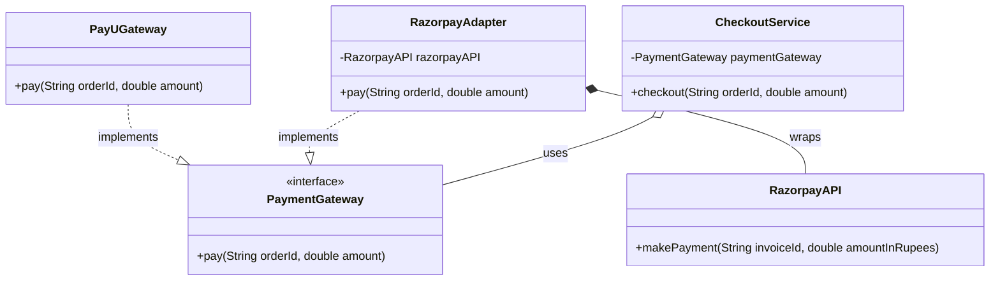
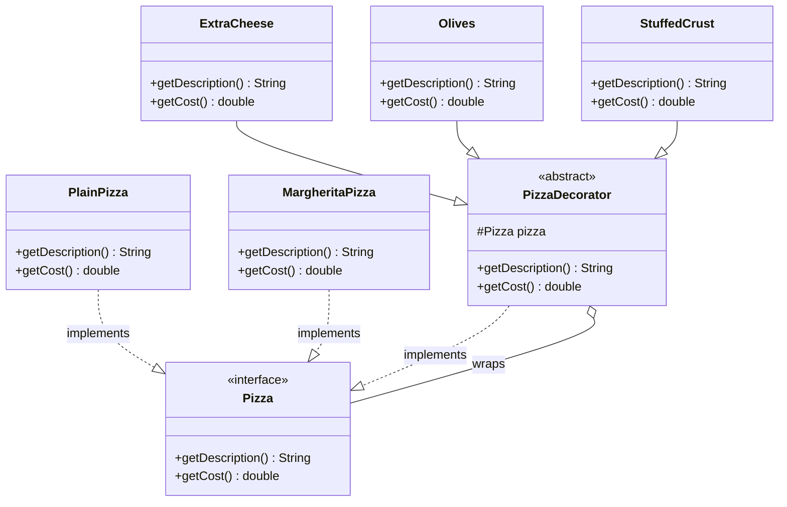
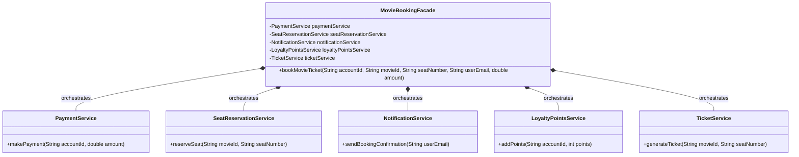
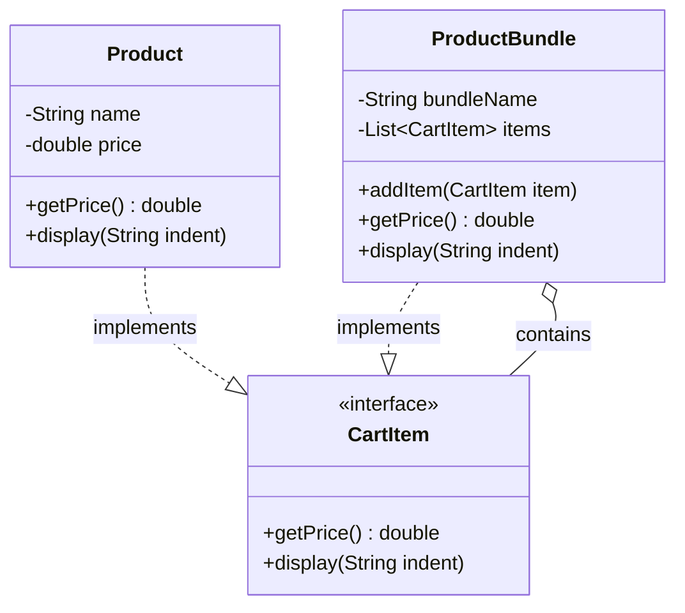
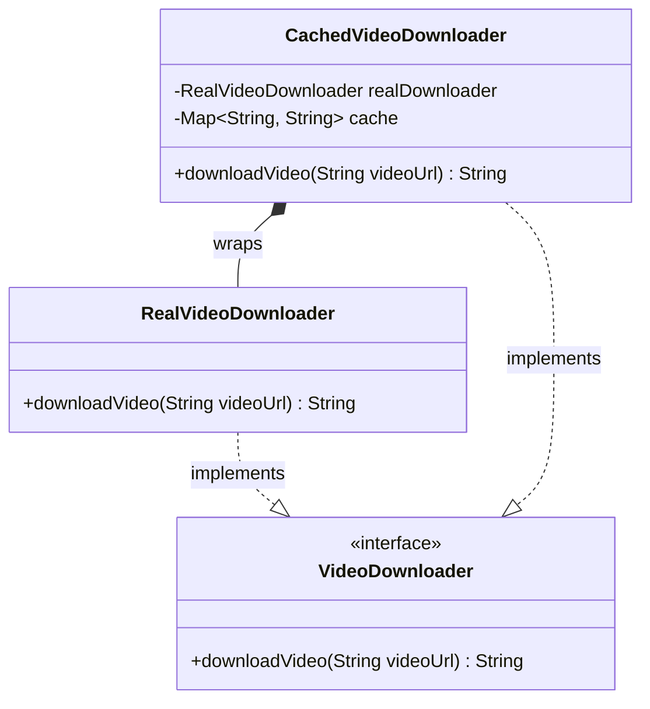
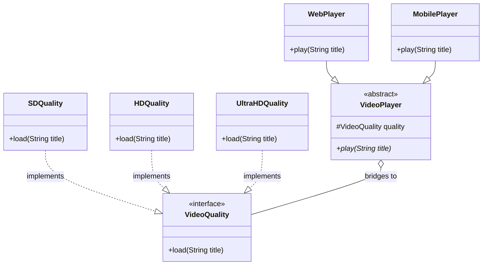
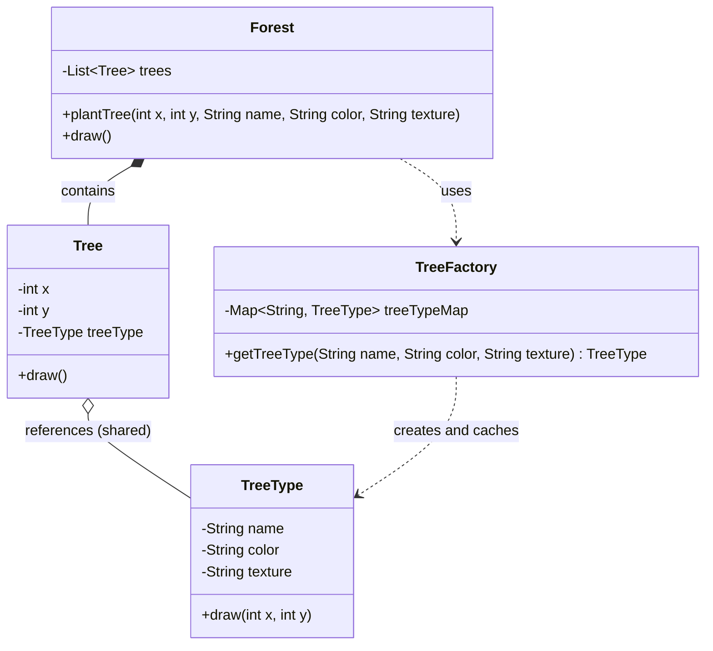

# Structural Design Patterns

Structural design patterns are concerned with the composition of classes and objects. They focus on how to assemble classes and objects into larger structures while keeping these structures flexible and efficient. Adapter Pattern is one of the most important structural design patterns. Let's understand in depth.

## Adapter Pattern

The Adapter Pattern allows incompatible interfaces to work together by acting as a translator or wrapper around an existing class. It converts the interface of a class into another interface that a client expects.

It acts as a bridge between the Target interface (expected by the client) and the Adaptee (an existing class with a different interface). This structural wrapping enables integration and compatibility across diverse systems.

### Real-Life Analogy

<div style="border-left:4px solid #195045;background:rgba(25,80,69,0.08);padding:0.6rem 1rem;border-radius:0 0.5rem 0.5rem 0;margin:1.25rem 0">

💡 **Insight.** Imagine traveling from India to Europe. Your mobile charger doesn't fit into European sockets. Instead of buying a new charger, you use a plug adapter. The adapter allows your charger (with its Indian plug) to fit the European socket, enabling charging without modifying either the socket or the charger.

</div>

### Problem It Solves

- Interface incompatibility between classes.
- Reusability of existing classes without modifying their source code.
- Enables systems to communicate that otherwise couldn't due to differing method signatures.

Similarly, the Adapter Pattern allows objects with incompatible interfaces to collaborate by introducing an adapter.

### Real-Life Coding Example

Let's consider a scenario where we are implementing the Payment Gateway System. And we have two different payment methods: PayU and Razorpay. While the PayU gateway already conforms to this interface, Razorpay follows a different structure as shown in the code below.

### Using Incompatible Interface (Without Adapter)

```java
// ⚠️ ANTI-PATTERN — this is the version we are about to fix. Do not copy it.
import java.util.*;

// Target Interface:
// Standard interface expected by the CheckoutService
interface PaymentGateway {
    void pay(String orderId, double amount);
}

// Concrete implementation of PaymentGateway for PayU
class PayUGateway implements PaymentGateway {
    @Override
    public void pay(String orderId, double amount) {
        System.out.println("Paid Rs. " + amount + " using PayU for order: " + orderId);
    }
}

// Adaptee:
// An existing class with an incompatible interface
class RazorpayAPI {
    public void makePayment(String invoiceId, double amountInRupees) {
        System.out.println("Paid Rs. " + amountInRupees + " using Razorpay for invoice: " + invoiceId);
    }
}

// Client Class:
// Uses PaymentGateway interface to process payments
class CheckoutService {
    private PaymentGateway paymentGateway;

    // Constructor injection for dependency inversion
    public CheckoutService(PaymentGateway paymentGateway) {
        this.paymentGateway = paymentGateway;
    }

    // Business logic to perform checkout
    public void checkout(String orderId, double amount) {
        paymentGateway.pay(orderId, amount);
    }
}

// ── Driver ──────────────────────────────────────────────
class Main {
    public static void main(String[] args) {
        // Using PayU payment gateway to process payment
        CheckoutService checkoutService = new CheckoutService(new PayUGateway());
        checkoutService.checkout("12", 1780);

        // RazorpayAPI cannot be passed to CheckoutService at all — it does not
        // implement PaymentGateway, so `new CheckoutService(new RazorpayAPI())`
        // is a compile error. The only way to use it is to bypass
        // CheckoutService entirely and call its own method directly.
        System.out.println();
        System.out.println("Falling back to RazorpayAPI directly, bypassing CheckoutService:");
        RazorpayAPI razorpayAPI = new RazorpayAPI();
        razorpayAPI.makePayment("13", 1780);

        System.out.println();
        System.out.println("ANTI-PATTERN: RazorpayAPI cannot be used through CheckoutService - interface incompatibility.");
    }
}
```

### Understanding the Issues

- CheckoutService expects any payment provider to implement the PaymentGateway interface.
- PayUGateway fits this requirement and works correctly.
- RazorpayAPI, however, uses a different method (makePayment) and does not implement PaymentGateway.
- Due to this mismatch, RazorpayAPI cannot be used directly with CheckoutService.

This is a case of interface incompatibility, where similar functionalities can't work together because of structural differences. To solve this without modifying existing code, we use the Adapter Pattern to make RazorpayAPI compatible with the expected interface.

### Using Adapter Pattern

```java
import java.util.*;

// Target Interface:
// Standard interface expected by the CheckoutService
interface PaymentGateway {
    void pay(String orderId, double amount);
}

// Concrete implementation of PaymentGateway for PayU
class PayUGateway implements PaymentGateway {
    @Override
    public void pay(String orderId, double amount) {
        System.out.println("Paid Rs. " + amount + " using PayU for order: " + orderId);
    }
}

// Adaptee:
// An existing class with an incompatible interface
class RazorpayAPI {
    public void makePayment(String invoiceId, double amountInRupees) {
        System.out.println("Paid Rs. " + amountInRupees + " using Razorpay for invoice: " + invoiceId);
    }
}

// Adapter Class:
// Allows RazorpayAPI to be used where PaymentGateway is expected
class RazorpayAdapter implements PaymentGateway {
    private RazorpayAPI razorpayAPI;

    public RazorpayAdapter() {
        this.razorpayAPI = new RazorpayAPI();
    }

    // Translates the pay() call to RazorpayAPI's makePayment() method
    @Override
    public void pay(String orderId, double amount) {
        razorpayAPI.makePayment(orderId, amount);
    }
}

// Client Class:
// Uses PaymentGateway interface to process payments
class CheckoutService {
    private PaymentGateway paymentGateway;

    // Constructor injection for dependency inversion
    public CheckoutService(PaymentGateway paymentGateway) {
        this.paymentGateway = paymentGateway;
    }

    // Business logic to perform checkout
    public void checkout(String orderId, double amount) {
        paymentGateway.pay(orderId, amount);
    }
}

// ── Driver ──────────────────────────────────────────────
class Main {
    public static void main(String[] args) {
        // Using PayU payment gateway to process payment
        CheckoutService payuCheckout = new CheckoutService(new PayUGateway());
        payuCheckout.checkout("12", 1780);

        System.out.println();

        // Using the Razorpay adapter to process payment through the same
        // CheckoutService - no incompatibility this time.
        CheckoutService razorpayCheckout = new CheckoutService(new RazorpayAdapter());
        razorpayCheckout.checkout("13", 1780);

        System.out.println();
        System.out.println("GOOD DESIGN: RazorpayAdapter lets RazorpayAPI flow through CheckoutService like any other gateway.");
    }
}
```

**The same idea in Python**

```python
from abc import ABC, abstractmethod


class PaymentGateway(ABC):
    # Target interface. Duck typing means Python doesn't strictly need this --
    # any object with a matching pay() method would work -- but abc.ABC makes
    # the contract explicit and fails fast (TypeError) if a subclass forgets pay().
    @abstractmethod
    def pay(self, order_id: str, amount: float) -> None:
        ...


class PayUGateway(PaymentGateway):
    def pay(self, order_id: str, amount: float) -> None:
        print(f"Paid Rs. {amount} using PayU for order: {order_id}")


class RazorpayAPI:
    """Adaptee: an existing class with an incompatible interface."""

    def make_payment(self, invoice_id: str, amount_in_rupees: float) -> None:
        print(f"Paid Rs. {amount_in_rupees} using Razorpay for invoice: {invoice_id}")


class RazorpayAdapter(PaymentGateway):
    """Adapter: translates pay() calls to RazorpayAPI's make_payment()."""

    def __init__(self) -> None:
        self._razorpay_api = RazorpayAPI()

    def pay(self, order_id: str, amount: float) -> None:
        self._razorpay_api.make_payment(order_id, amount)


class CheckoutService:
    def __init__(self, payment_gateway: PaymentGateway) -> None:
        self._payment_gateway = payment_gateway

    def checkout(self, order_id: str, amount: float) -> None:
        self._payment_gateway.pay(order_id, amount)


# ── Driver ──────────────────────────────────────────────
if __name__ == "__main__":
    payu_checkout = CheckoutService(PayUGateway())
    payu_checkout.checkout("12", 1780)

    print()

    razorpay_checkout = CheckoutService(RazorpayAdapter())
    razorpay_checkout.checkout("13", 1780)

    print()
    print("GOOD DESIGN: RazorpayAdapter lets RazorpayAPI flow through CheckoutService like any other gateway.")
```

Note: unlike Java, Python doesn't require `RazorpayAdapter` to declare `implements PaymentGateway` for duck typing to work — any object with a matching `pay()` method would satisfy `CheckoutService`. The `abc.ABC` base is used anyway so the contract is explicit and a missing method fails fast at instantiation, rather than at the first call.

Here, we created an adapter class RazorpayAdapter that implements the PaymentGateway interface. The adapter internally uses the RazorpayAPI class and translates the method calls from the expected interface to the actual implementation.

This allows us to use RazorpayAPI seamlessly with the CheckoutService without modifying either class.

### When to Use Adapter Pattern

The Adapter Pattern is ideal in scenarios where you're trying to integrate components that were not originally designed to work together. It proves especially useful when:

- You need to use an existing class, but its interface does not match the one your system expects.
- You want to reuse legacy code without modifying its internal structure.
- You're integrating third-party APIs or external services into your application.

In such cases, the Adapter Pattern serves as a bridge, allowing seamless compatibility without altering existing codebases.

### Advantages and Disadvantages

Like any design pattern, the Adapter Pattern comes with its own set of pros and cons:

#### Pros

- **Code Reusability:** Encourages the reuse of existing classes without changing their implementation.
- **Code Extensibility:** Makes systems more flexible and adaptable to change.
- **Minimal Changes to Client Code:** Enables integration without requiring modifications to existing client logic.
- **Simplifies Third-party Integration:** Makes it easier to incorporate external services and APIs.

#### Cons

- **Adds an Extra Layer of Abstraction:** Can introduce unnecessary complexity if not used judiciously.
- **Overuse Can Obscure System Design:** Excessive use of adapters might make the architecture harder to understand and maintain.

### Real Product Use Cases

The Adapter Pattern is not just a theoretical concept - it plays a crucial role in real-world software products and systems. Many enterprise-level applications rely on this pattern to integrate with third-party tools, legacy systems, and platform-specific APIs. Below are some common and impactful use cases:

1. **Payment Gateways** — Different payment providers (e.g., PayPal, Stripe, Razorpay, PayU) expose their own APIs with varying method names, parameters, and response formats. By implementing a common PaymentGateway interface and creating adapters for each provider, businesses can switch or support multiple gateways without rewriting business logic. This decouples the checkout flow from provider-specific implementations.
2. **Logging Frameworks** — Enterprise applications often need to support different logging libraries like Log4j, SLF4J, or custom logging solutions. An adapter can unify the logging interface so developers can write log.debug(...), regardless of whether the underlying implementation is Log4j or java.util.logging. This makes it easier to switch or support multiple logging backends with minimal changes.
3. **Cloud Providers and SDKs** — Cloud platforms like AWS, Azure, and Google Cloud offer similar functionalities (storage, compute, database) but expose them through different SDKs and APIs. Using an adapter layer, developers can abstract cloud operations behind a common interface, enabling them to change providers (e.g., from AWS S3 to Google Cloud Storage) without impacting the rest of the application. This is particularly useful for hybrid-cloud or multi-cloud strategies.

### Class Diagram



The class diagram below illustrates the Adapter Pattern. The PaymentGateway interface is the target interface, while RazorpayAPI is the adaptee. The RazorpayAdapter acts as a bridge, allowing the client to interact with the adaptee through the target interface.

## Decorator Pattern

The Decorator Pattern is a structural design pattern that allows behavior to be added to individual objects, dynamically at runtime, without affecting the behavior of other objects from the same class.

It wraps an object inside another object that adds new behaviors or responsibilities at runtime, keeping the original object's interface intact.

### Real-Life Analogy

<div style="border-left:4px solid #195045;background:rgba(25,80,69,0.08);padding:0.6rem 1rem;border-radius:0 0.5rem 0.5rem 0;margin:1.25rem 0">

💡 **Insight.** Think of a coffee shop: you order a simple coffee, then you can add milk, add sugar, add whipped cream, and so on. You don't need a whole new drink class for every combination — each addition wraps the original and adds something more.

</div>

### Problem It Solves

It solves the problem of class explosion that occurs when you try to use inheritance to add combinations of behavior. For example, imagine you have:

- A Pizza
- A CheesePizza
- A CheeseAndOlivePizza
- A CheeseAndOliveStuffedPizza

Every combination would need a new subclass as shown in the code below.

```java
// ⚠️ ANTI-PATTERN — this is the version we are about to fix. Do not copy it.
import java.util.*;

// Each combination of pizza requires a new class
class PlainPizza {}
class CheesePizza extends PlainPizza {}
class OlivePizza extends PlainPizza {}
class StuffedPizza extends PlainPizza {}
class CheeseStuffedPizza extends CheesePizza {}
class CheeseOlivePizza extends CheesePizza {}
class CheeseOliveStuffedPizza extends CheeseOlivePizza {}

// ── Driver ──────────────────────────────────────────────
class Main {
    public static void main(String[] args) {
        // Base pizza
        PlainPizza plainPizza = new PlainPizza();
        System.out.println("Created: " + plainPizza.getClass().getSimpleName());

        // Pizzas with individual toppings
        CheesePizza cheesePizza = new CheesePizza();
        System.out.println("Created: " + cheesePizza.getClass().getSimpleName());
        OlivePizza olivePizza = new OlivePizza();
        System.out.println("Created: " + olivePizza.getClass().getSimpleName());
        StuffedPizza stuffedPizza = new StuffedPizza();
        System.out.println("Created: " + stuffedPizza.getClass().getSimpleName());

        // Combinations of toppings require separate classes
        CheeseStuffedPizza cheeseStuffedPizza = new CheeseStuffedPizza();
        System.out.println("Created: " + cheeseStuffedPizza.getClass().getSimpleName());
        CheeseOlivePizza cheeseOlivePizza = new CheeseOlivePizza();
        System.out.println("Created: " + cheeseOlivePizza.getClass().getSimpleName());

        // Further combinations increase complexity exponentially
        CheeseOliveStuffedPizza cheeseOliveStuffedPizza = new CheeseOliveStuffedPizza();
        System.out.println("Created: " + cheeseOliveStuffedPizza.getClass().getSimpleName());

        System.out.println();
        System.out.println("ANTI-PATTERN: 7 classes for 4 toppings, and every new combination needs one more.");
    }
}
```

This quickly becomes unmanageable. Here, the Decorator Pattern comes into play. It lets you compose behaviors using wrappers instead of subclassing.

### Solution to Pizza Problem

The Decorator Pattern solves the above discussed Pizza problem. It allows us to add responsibilities (like toppings) to objects dynamically without modifying their structure.

Instead of relying on a rigid class hierarchy, we compose objects using wrappers. This promotes flexibility, scalability, and cleaner code architecture.

### Using Decorator Pattern

```java
import java.util.*;

// =========== Component Interface ============
interface Pizza {
    String getDescription();
    double getCost();
}

// ============= Concrete Components: Base pizza ==============
class PlainPizza implements Pizza {
    @Override
    public String getDescription() {
        return "Plain Pizza";
    }

    @Override
    public double getCost() {
        return 150.00;
    }
}

class MargheritaPizza implements Pizza {
    @Override
    public String getDescription() {
        return "Margherita Pizza";
    }

    @Override
    public double getCost() {
        return 200.00;
    }
}

// ======================== Abstract Decorator ===========================
// ====== Implements Pizza and holds a reference to a Pizza object =======
abstract class PizzaDecorator implements Pizza {
    protected Pizza pizza;

    public PizzaDecorator(Pizza pizza) {
        this.pizza = pizza;
    }
}

// ============ Concrete Decorator: Adds Extra Cheese ================
class ExtraCheese extends PizzaDecorator {
    public ExtraCheese(Pizza pizza) {
        super(pizza);
    }

    @Override
    public String getDescription() {
        return pizza.getDescription() + ", Extra Cheese";
    }

    @Override
    public double getCost() {
        return pizza.getCost() + 40.0;
    }
}

// ============ Concrete Decorator: Adds Olives ================
class Olives extends PizzaDecorator {
    public Olives(Pizza pizza) {
        super(pizza);
    }

    @Override
    public String getDescription() {
        return pizza.getDescription() + ", Olives";
    }

    @Override
    public double getCost() {
        return pizza.getCost() + 30.0;
    }
}

// =========== Concrete Decorator: Adds Stuffed Crust Cheese ==============
class StuffedCrust extends PizzaDecorator {
    public StuffedCrust(Pizza pizza) {
        super(pizza);
    }

    @Override
    public String getDescription() {
        return pizza.getDescription() + ", Stuffed Crust";
    }

    @Override
    public double getCost() {
        return pizza.getCost() + 50.0;
    }
}

// ── Driver ──────────────────────────────────────────────
class Main {
    public static void main(String[] args) {
        // Start with a basic Margherita Pizza
        Pizza myPizza = new MargheritaPizza();

        // Add Extra Cheese
        myPizza = new ExtraCheese(myPizza);

        // Add Olives
        myPizza = new Olives(myPizza);

        // Add Stuffed Crust
        myPizza = new StuffedCrust(myPizza);

        // Final Description and Cost
        System.out.println("Pizza Description: " + myPizza.getDescription());
        System.out.println("Total Cost: ₹" + myPizza.getCost());

        System.out.println();
        System.out.println("GOOD DESIGN: one class per topping, composed at runtime instead of multiplying subclasses.");
    }
}
```

**The same idea in Python**

```python
from abc import ABC, abstractmethod


class Pizza(ABC):
    @abstractmethod
    def get_description(self) -> str:
        ...

    @abstractmethod
    def get_cost(self) -> float:
        ...


class PlainPizza(Pizza):
    def get_description(self) -> str:
        return "Plain Pizza"

    def get_cost(self) -> float:
        return 150.00


class MargheritaPizza(Pizza):
    def get_description(self) -> str:
        return "Margherita Pizza"

    def get_cost(self) -> float:
        return 200.00


class PizzaDecorator(Pizza, ABC):
    # Abstract decorator: implements Pizza and holds a reference to a Pizza --
    # this is the GoF object-wrapping Decorator. Python also has function
    # decorators (@syntax), a different mechanism for wrapping callables, not
    # objects; don't conflate the two -- this block is the GoF pattern only.
    def __init__(self, pizza: Pizza) -> None:
        self._pizza = pizza


class ExtraCheese(PizzaDecorator):
    def get_description(self) -> str:
        return self._pizza.get_description() + ", Extra Cheese"

    def get_cost(self) -> float:
        return self._pizza.get_cost() + 40.0


class Olives(PizzaDecorator):
    def get_description(self) -> str:
        return self._pizza.get_description() + ", Olives"

    def get_cost(self) -> float:
        return self._pizza.get_cost() + 30.0


class StuffedCrust(PizzaDecorator):
    def get_description(self) -> str:
        return self._pizza.get_description() + ", Stuffed Crust"

    def get_cost(self) -> float:
        return self._pizza.get_cost() + 50.0


# ── Driver ──────────────────────────────────────────────
if __name__ == "__main__":
    my_pizza: Pizza = MargheritaPizza()
    my_pizza = ExtraCheese(my_pizza)
    my_pizza = Olives(my_pizza)
    my_pizza = StuffedCrust(my_pizza)

    print(f"Pizza Description: {my_pizza.get_description()}")
    print(f"Total Cost: ₹{my_pizza.get_cost()}")

    print()
    print("GOOD DESIGN: one class per topping, composed at runtime instead of multiplying subclasses.")
```

Note: Python also has *function* decorators (the `@decorator` syntax used on functions and methods elsewhere in this book) — that is a different mechanism, for wrapping a callable, not an object. The GoF Decorator Pattern shown here is about wrapping objects that share an interface; the two ideas are related in spirit but not the same tool.

### Understanding the Code

The above code:

- Defines a Pizza interface that all pizzas (base and decorated) must implement.
- Implements two concrete PlainPizza and MargheritaPizza as the base pizzas.
- Defines an abstract PizzaDecorator which wraps a Pizza object and forwards method calls to it.
- Implements concrete decorators like ExtraCheese, Olives, and StuffedCrust which extend the functionality of the pizza object.

In the main method:

- A plain Margherita pizza is created.
- It is then wrapped successively with different decorators: ExtraCheese, Olives, and StuffedCrust.
- Each decorator adds to the pizza's description and cost.
- Finally, the composed pizza's description and total cost are printed.

### How Decorator Pattern Solves the Issue

- **Avoids Class Explosion:** You no longer need a separate class for each combination of toppings. Just create new decorators as needed.
- **Flexible & Scalable:** Toppings can be added, removed, or reordered at runtime, offering high customization.
- **Follows Open/Closed Principle:** The base Pizza classes are open for extension (via decorators) but closed for modification.
- **Cleaner Code Architecture:** Composition is used instead of inheritance, resulting in loosely coupled components.
- **Promotes Reusability:** Each topping is a self-contained decorator and can be reused across different pizza compositions.

### Key Takeaways

- **Abstract Classes and Constructors:** Abstract classes can have constructors, and these constructors are executed when a subclass is instantiated. This is important for initializing common properties or behavior shared across all subclasses.
- **Decorator as Layers:** Each decorator acts like a layer, similar to wrapping a gift box. Every decorator adds behavior on top of the previous one, allowing for flexible and dynamic composition of functionality.
- **Call Stack Analogy:** The Decorator Pattern functions like a call stack, where behavior is accumulated step by step as each decorator wraps the component. This stacked behavior is then unwrapped during method calls, preserving the order and layering.
- **Loose Coupling Between Classes:** The use of interfaces and composition in the Decorator Pattern ensures loose coupling between components. This makes the system more flexible, testable, and easier to extend without affecting existing code.

### When Should You Use the Decorator Pattern?

The Decorator Pattern is particularly useful in scenarios where flexibility, modularity, and extensibility are key. Consider using it when:

- **You need to add responsibilities to objects dynamically:** Instead of hardcoding behaviors into a class, decorators allow you to attach additional functionality at runtime, offering great flexibility.
- **You want to avoid an explosion of subclasses:** For every possible combination of features, creating separate subclasses leads to unmanageable and bloated class hierarchies. Decorators eliminate this by composing behaviors.
- **You want to follow the Open/Closed Principle (OCP):** The pattern supports the OCP by allowing classes to be open for extension but closed for modification. You enhance behavior without altering existing code.
- **You want reusable and composable behaviors:** Decorators can be reused across different components and can be composed in various combinations to achieve desired functionality.
- **You need layered, step-by-step enhancements:** Decorators can be applied one after another, layering features gradually in a controlled and traceable way — much like wrapping layers around an object.

### Advantages

A few advantages of using the Decorator Pattern are:

- **Adheres to the Open/Closed Principle (OCP):** Enhancements can be made without modifying existing code, supporting scalability and maintainability.
- **Runtime Flexibility to Compose Features:** Behaviors can be added or removed dynamically, allowing for highly customizable solutions.
- **Avoids Subclass Explosion:** Instead of creating multiple subclasses for every feature combination, decorators provide a cleaner, more modular approach.
- **Promotes Single Responsibility for Each Add-on:** Each decorator focuses on a specific functionality, leading to better code organization and readability.

### Disadvantages

A few trade-offs while using the Decorator Pattern are:

- **Can Result in Many Small Classes:** Each feature typically requires its own decorator class, which can clutter the codebase.
- **Stack Trace Debugging is Difficult:** Debugging layered decorators can be challenging, as stack traces may become complex and harder to trace.
- **Overhead of Multiple Wrapping Classes:** Composing many decorators can introduce runtime overhead and make the class structure harder to follow.
- **Developers Must Understand Decorator Flow:** Proper implementation requires developers to grasp the decorator chaining logic, which may introduce a learning curve.

### Real-World Use Cases

The Decorator Pattern is widely used in real-life software products to enable dynamic behavior composition without bloating the class hierarchy. Below are practical examples where it plays a critical role:

1. **Food Delivery Applications (e.g., Swiggy, Zomato)** — Customers can customize food items with add-ons like extra cheese, sauces, toppings, or side dishes. Each add-on modifies the base food item's description and price dynamically. Instead of creating subclasses for every combination (e.g., PizzaWithCheeseAndOlives), decorators like CheeseDecorator, OliveDecorator, etc., can be stacked over a base Pizza. This allows the system to stay open for extension (new add-ons) but closed for modification.
2. **Google Docs or Word Processors** — Users can apply text formatting like bold, italic, or underline independently or in combination. Each text style is implemented as a decorator that wraps the plain text object, allowing flexible layering of styles, e.g., UnderlineDecorator(BoldDecorator(ItalicDecorator(Text))). This avoids subclassing for all combinations like BoldItalicUnderlineText, keeping the design clean and extensible.

### Class Diagram

The class diagram for the Decorator Pattern illustrates the relationship between the component interface, concrete components, and decorators. It shows how decorators extend the functionality of components without modifying their structure.



## Facade Pattern

The Facade Pattern is a structural design pattern that provides a simplified, unified interface to a complex subsystem or group of classes.

It acts as a single entry point for clients to interact with the system, hiding the underlying complexity and making the system easier to use.

### Real-Life Analogy

<div style="border-left:4px solid #195045;background:rgba(25,80,69,0.08);padding:0.6rem 1rem;border-radius:0 0.5rem 0.5rem 0;margin:1.25rem 0">

💡 **Insight.** Think of a manual vs. an automatic car. Driving a manual car requires intricate knowledge of multiple components (clutch, gear shifter, accelerator) and their precise coordination to shift gears and drive — it's complex and requires the driver to manage many interactions. An automatic car acts as a facade: it provides a simplified interface (e.g., "Drive," "Reverse," "Park") to the complex underlying mechanics of gear shifting, so the driver no longer needs to manually coordinate the clutch and gears; the automatic transmission handles these complexities internally, making driving much easier.

</div>

In short, the manual car exposes the complexity, while the automatic car (the facade) simplifies it for the user.

### Problem It Solves

It solves the problem of dealing with complex subsystems by hiding the complexities behind a single, unified interface. For example, imagine a movie ticket booking system with:

- PaymentService
- SeatReservationService
- NotificationService
- LoyaltyPointsService
- TicketService

Instead of making the client interact with all of these directly, the Facade Pattern provides a single class like MovieBookingFacade, which internally coordinates all the services.

### Real-Life Coding Example

Imagine you're developing a movie ticket booking application, like BookMyShow. Let's first take a look at a poorly structured approach to implementing the booking functionality.

### The Bad Way (Without Using Facade Pattern)

```java
// ⚠️ ANTI-PATTERN — this is the version we are about to fix. Do not copy it.

// Service class responsible for handling payments
class PaymentService {
    public void makePayment(String accountId, double amount) {
        System.out.println("Payment of ₹" + amount + " successful for account " + accountId);
    }
}

// Service class responsible for reserving seats
class SeatReservationService {
    public void reserveSeat(String movieId, String seatNumber) {
        System.out.println("Seat " + seatNumber + " reserved for movie " + movieId);
    }
}

// Service class responsible for sending notifications
class NotificationService {
    public void sendBookingConfirmation(String userEmail) {
        System.out.println("Booking confirmation sent to " + userEmail);
    }
}

// Service class for managing loyalty/reward points
class LoyaltyPointsService {
    public void addPoints(String accountId, int points) {
        System.out.println(points + " loyalty points added to account " + accountId);
    }
}

// Service class for generating movie tickets
class TicketService {
    public void generateTicket(String movieId, String seatNumber) {
        System.out.println("Ticket generated for movie " + movieId + ", Seat: " + seatNumber);
    }
}

// ── Driver ──────────────────────────────────────────────
class Main {
    public static void main(String[] args) {
        // Booking a movie ticket manually (without a facade)

        // Step 1: Make payment
        PaymentService paymentService = new PaymentService();
        paymentService.makePayment("user123", 500);

        // Step 2: Reserve seat
        SeatReservationService seatReservationService = new SeatReservationService();
        seatReservationService.reserveSeat("movie456", "A10");

        // Step 3: Send booking confirmation via email
        NotificationService notificationService = new NotificationService();
        notificationService.sendBookingConfirmation("user@example.com");

        // Step 4: Add loyalty points to user's account
        LoyaltyPointsService loyaltyPointsService = new LoyaltyPointsService();
        loyaltyPointsService.addPoints("user123", 50);

        // Step 5: Generate the ticket
        TicketService ticketService = new TicketService();
        ticketService.generateTicket("movie456", "A10");

        System.out.println();
        System.out.println("ANTI-PATTERN: the client orchestrates all five services itself, in the right order, every time.");
    }
}
```

While this code works, it's tightly coupled. The Main class (or client code) is manually calling each subsystem service in the correct order and with the correct parameters.

This leads to:

- High complexity for the client
- Duplicate code if you have to do this in multiple places
- Violation of the Single Responsibility Principle (the Main class knows too much)

This sets the stage for the Facade Pattern, which will encapsulate all these steps in one high-level method like bookTicket() and make the client code clean and readable.

### Using Facade Pattern

```java
// Service class responsible for handling payments
class PaymentService {
    public void makePayment(String accountId, double amount) {
        System.out.println("Payment of ₹" + amount + " successful for account " + accountId);
    }
}

// Service class responsible for reserving seats
class SeatReservationService {
    public void reserveSeat(String movieId, String seatNumber) {
        System.out.println("Seat " + seatNumber + " reserved for movie " + movieId);
    }
}

// Service class responsible for sending notifications
class NotificationService {
    public void sendBookingConfirmation(String userEmail) {
        System.out.println("Booking confirmation sent to " + userEmail);
    }
}

// Service class for managing loyalty/reward points
class LoyaltyPointsService {
    public void addPoints(String accountId, int points) {
        System.out.println(points + " loyalty points added to account " + accountId);
    }
}

// Service class for generating movie tickets
class TicketService {
    public void generateTicket(String movieId, String seatNumber) {
        System.out.println("Ticket generated for movie " + movieId + ", Seat: " + seatNumber);
    }
}

// ========== The MovieBookingFacade class ==============
class MovieBookingFacade {
    private PaymentService paymentService;
    private SeatReservationService seatReservationService;
    private NotificationService notificationService;
    private LoyaltyPointsService loyaltyPointsService;
    private TicketService ticketService;

    // Constructor to initialize all the subsystem services.
    public MovieBookingFacade() {
        this.paymentService = new PaymentService();
        this.seatReservationService = new SeatReservationService();
        this.notificationService = new NotificationService();
        this.loyaltyPointsService = new LoyaltyPointsService();
        this.ticketService = new TicketService();
    }

    // Method providing a simplified interface for booking a movie ticket
    public void bookMovieTicket(String accountId, String movieId, String seatNumber, String userEmail, double amount) {
        paymentService.makePayment(accountId, amount);
        seatReservationService.reserveSeat(movieId, seatNumber);
        ticketService.generateTicket(movieId, seatNumber);
        loyaltyPointsService.addPoints(accountId, 50);
        notificationService.sendBookingConfirmation(userEmail);

        // Indicate successful completion of the entire booking process.
        System.out.println("Movie ticket booking completed successfully!");
    }
}

// ── Driver ──────────────────────────────────────────────
class Main {
    public static void main(String[] args) {
        // Booking a movie ticket manually (using facade)
        MovieBookingFacade movieBookingFacade = new MovieBookingFacade();
        movieBookingFacade.bookMovieTicket("user123", "movie456", "A10", "user@example.com", 500);

        System.out.println();
        System.out.println("GOOD DESIGN: the client makes one call - MovieBookingFacade orchestrates the five services.");
    }
}
```

**The same idea in Python**

```python
class PaymentService:
    def make_payment(self, account_id: str, amount: float) -> None:
        print(f"Payment of ₹{amount} successful for account {account_id}")


class SeatReservationService:
    def reserve_seat(self, movie_id: str, seat_number: str) -> None:
        print(f"Seat {seat_number} reserved for movie {movie_id}")


class NotificationService:
    def send_booking_confirmation(self, user_email: str) -> None:
        print(f"Booking confirmation sent to {user_email}")


class LoyaltyPointsService:
    def add_points(self, account_id: str, points: int) -> None:
        print(f"{points} loyalty points added to account {account_id}")


class TicketService:
    def generate_ticket(self, movie_id: str, seat_number: str) -> None:
        print(f"Ticket generated for movie {movie_id}, Seat: {seat_number}")


class MovieBookingFacade:
    def __init__(self) -> None:
        self._payment_service = PaymentService()
        self._seat_reservation_service = SeatReservationService()
        self._notification_service = NotificationService()
        self._loyalty_points_service = LoyaltyPointsService()
        self._ticket_service = TicketService()

    def book_movie_ticket(
        self,
        account_id: str,
        movie_id: str,
        seat_number: str,
        user_email: str,
        amount: float,
    ) -> None:
        self._payment_service.make_payment(account_id, amount)
        self._seat_reservation_service.reserve_seat(movie_id, seat_number)
        self._ticket_service.generate_ticket(movie_id, seat_number)
        self._loyalty_points_service.add_points(account_id, 50)
        self._notification_service.send_booking_confirmation(user_email)

        print("Movie ticket booking completed successfully!")


# ── Driver ──────────────────────────────────────────────
if __name__ == "__main__":
    movie_booking_facade = MovieBookingFacade()
    movie_booking_facade.book_movie_ticket(
        "user123", "movie456", "A10", "user@example.com", 500
    )

    print()
    print("GOOD DESIGN: the client makes one call - MovieBookingFacade orchestrates the five services.")
```

### How Facade Pattern Solves the Issue

By introducing MovieBookingFacade, we:

- Provide a simple, unified interface (bookMovieTicket()).
- Hide the complexity of internal service calls from the client.
- Reduce coupling, so changes in internal services don't affect the client.
- Centralize the workflow logic, making it easier to update and reuse.

### When to use Facade Pattern?

You should use the Facade pattern when:

- **Subsystems are complex:** This means there are too many classes and too many dependencies within the system you are trying to simplify.
- **You want to provide a simpler API for the outer world:** The Facade acts as a simplified entry point, hiding the complexity from clients.
- **You want to reduce coupling between subsystems and client code:** By interacting with the facade, the client code becomes less dependent on the individual components of the subsystem.
- **You want to layer your architecture cleanly:** The Facade helps in organizing the system into distinct layers, making it more modular and understandable.

### Advantages

A few advantages of using the Facade Pattern are:

- **Lightweight coupling:** It reduces the dependencies between the client and the subsystem.
- **Flexibility:** It allows the subsystem to evolve without impacting the client code.
- **Simplifies client design:** Clients interact with a single, simplified interface instead of multiple complex objects.
- **Promotes layered architecture:** It helps organize the system into distinct layers, improving maintainability and scalability.
- **Better testability:** Individual subsystem components can be tested independently, and the facade itself can be tested for its orchestration logic.

### Disadvantages

A few disadvantages of using the Facade Pattern are:

- **Fragile coupling:** If the facade itself changes frequently, it can still lead to ripple effects on client code.
- **Hidden complexity:** While it simplifies the client's view, the underlying complexity of the subsystem still exists, just hidden. This can make debugging or understanding the full flow more challenging for developers working on the subsystem.
- **Runtime errors:** Errors originating from the complex subsystem might be harder to diagnose when only interacting through the facade.
- **Difficult to trace:** Debugging can be more challenging as the facade adds another layer of indirection.
- **Violation of SRP (Single Responsibility Principle):** A facade might take on too many responsibilities if it orchestrates a very large and diverse set of operations, potentially becoming a "god object."

### Class Diagram



## Composite Pattern

The Composite Pattern is a structural design pattern that allows you to compose objects into tree structures to represent part-whole hierarchies. It lets clients treat individual objects and compositions of objects uniformly.

### Problem It Solves

The Composite Pattern solves the problem of treating individual objects and groups of objects in the same way. The main problem arises when:

- You want to work with a hierarchy of objects.
- You want the client code to be agnostic to whether it's dealing with a single object or a collection of them.

### Understanding the Problem

Consider you are building the checkout service of an e-commerce application and you take the following approach as shown in the code below.

### Code (Without Composite Pattern)

```java
// ⚠️ ANTI-PATTERN — this is the version we are about to fix. Do not copy it.
import java.util.*;

// Represents a single product
class Product {
    private String name;
    private double price;

    public Product(String name, double price) {
        this.name = name;
        this.price = price;
    }

    public double getPrice() {
        return price;
    }

    public void display(String indent) {
        System.out.println(indent + "Product: " + name + " - ₹" + price);
    }
}

// Represents a bundle of products
class ProductBundle {
    private String bundleName;
    private List<Product> products = new ArrayList<>();

    public ProductBundle(String bundleName) {
        this.bundleName = bundleName;
    }

    public void addProduct(Product product) {
        products.add(product);
    }

    public double getPrice() {
        double total = 0;
        for (Product product : products) {
            total += product.getPrice();
        }
        return total;
    }

    public void display(String indent) {
        System.out.println(indent + "Bundle: " + bundleName);
        for (Product product : products) {
            product.display(indent + "  ");
        }
    }
}

// ── Driver ──────────────────────────────────────────────
class Main {
    public static void main(String[] args) {
        // Individual Items
        Product book = new Product("Book", 500);
        Product headphones = new Product("Headphones", 1500);
        Product charger = new Product("Charger", 800);
        Product pen = new Product("Pen", 20);
        Product notebook = new Product("Notebook", 60);

        // Bundle: Iphone Combo
        ProductBundle iphoneCombo = new ProductBundle("iPhone Combo Pack");
        iphoneCombo.addProduct(headphones);
        iphoneCombo.addProduct(charger);

        // Bundle: School Kit
        ProductBundle schoolKit = new ProductBundle("School Kit");
        schoolKit.addProduct(pen);
        schoolKit.addProduct(notebook);

        // Add to cart logic
        List<Object> cart = new ArrayList<>();
        cart.add(book);
        cart.add(iphoneCombo);
        cart.add(schoolKit);

        // Display Cart
        double total = 0;
        System.out.println("Cart Details:\n");

        for (Object item : cart) {
            if (item instanceof Product) {
                ((Product) item).display("  ");
                total += ((Product) item).getPrice();
            } else if (item instanceof ProductBundle) {
                ((ProductBundle) item).display("  ");
                total += ((ProductBundle) item).getPrice();
            }
        }

        System.out.println("\nTotal Price: ₹" + total);
        System.out.println("ANTI-PATTERN: List<Object> plus instanceof checks - Product and ProductBundle have no shared type.");
    }
}
```

### Working of Code

- Product class represents a simple item with name and price.
- ProductBundle class represents a group of products bundled together.
- Both classes have methods to display and return their prices.
- In main(), individual products and bundles are created and added to the cart.
- The cart is a List<Object> that holds both products and bundles.
- During checkout, the code checks each item's type using instanceof.
- Based on the type, it casts the object and calls its respective methods.
- Finally, it displays all items and calculates the total price.

### Problem in above code

In the above example, the code lacks the structure to treat individual and group items uniformly, i.e., in the current implementation, individual products (Product) and product bundles (ProductBundle) are completely separate types with no shared interface or superclass. This means we cannot write code that treats both uniformly and the logic always has to check which type we're working with.

Other than these, there are some other problems as well:

- instanceof is used repeatedly, breaking polymorphism.
- Cart uses List<Object>, which is unsafe and violates abstraction.
- ProductBundle cannot contain another ProductBundle (no recursive structure).
- Display and price logic are duplicated instead of unified.

### Refactored Code Using Composite Pattern

Let's refactor the code using the Composite Pattern. The idea is to create a common interface CartItem for both Product and ProductBundle, allowing us to treat them uniformly.

```java
import java.util.*;

// Interface for items that can be added to the cart
interface CartItem {
    double getPrice();
    void display(String indent);
}

// Product class implementing CartItem
class Product implements CartItem {
    private String name;
    private double price;

    public Product(String name, double price) {
        this.name = name;
        this.price = price;
    }

    @Override
    public double getPrice() {
        return price;
    }

    @Override
    public void display(String indent) {
        System.out.println(indent + "Product: " + name + " - ₹" + price);
    }
}

// ProductBundle class implementing CartItem
class ProductBundle implements CartItem {
    private String bundleName;
    private List<CartItem> items = new ArrayList<>();

    public ProductBundle(String bundleName) {
        this.bundleName = bundleName;
    }

    public void addItem(CartItem item) {
        items.add(item);
    }

    @Override
    public double getPrice() {
        double total = 0;
        for (CartItem item : items) {
            total += item.getPrice();
        }
        return total;
    }

    @Override
    public void display(String indent) {
        System.out.println(indent + "Bundle: " + bundleName);
        for (CartItem item : items) {
            item.display(indent + "  ");
        }
    }
}

// ── Driver ──────────────────────────────────────────────
class Main {
    public static void main(String[] args) {
        // Individual Products
        CartItem book = new Product("Atomic Habits", 499);
        CartItem phone = new Product("iPhone 15", 79999);
        CartItem earbuds = new Product("AirPods", 15999);
        CartItem charger = new Product("20W Charger", 1999);

        // Combo Deal
        ProductBundle iphoneCombo = new ProductBundle("iPhone Essentials Combo");
        iphoneCombo.addItem(phone);
        iphoneCombo.addItem(earbuds);
        iphoneCombo.addItem(charger);

        // Back to School Kit
        ProductBundle schoolKit = new ProductBundle("Back to School Kit");
        schoolKit.addItem(new Product("Notebook Pack", 249));
        schoolKit.addItem(new Product("Pen Set", 99));
        schoolKit.addItem(new Product("Highlighter", 149));

        // Add everything to cart
        List<CartItem> cart = new ArrayList<>();
        cart.add(book);
        cart.add(iphoneCombo);
        cart.add(schoolKit);

        // Display cart
        System.out.println("Your Amazon Cart:");
        double total = 0;
        for (CartItem item : cart) {
            item.display("  ");
            total += item.getPrice();
        }

        System.out.println("\nTotal: ₹" + total);
        System.out.println("GOOD DESIGN: List<CartItem> and one polymorphic loop - no instanceof, and bundles can nest bundles.");
    }
}
```

**The same idea in Python**

```python
from abc import ABC, abstractmethod
from typing import List


class CartItem(ABC):
    @abstractmethod
    def get_price(self) -> float:
        ...

    @abstractmethod
    def display(self, indent: str) -> None:
        ...


class Product(CartItem):
    def __init__(self, name: str, price: float) -> None:
        self._name = name
        self._price = price

    def get_price(self) -> float:
        return self._price

    def display(self, indent: str) -> None:
        print(f"{indent}Product: {self._name} - ₹{self._price}")


class ProductBundle(CartItem):
    """Composite: can hold Products (leaves) and other ProductBundles (nested composites)."""

    def __init__(self, bundle_name: str) -> None:
        self._bundle_name = bundle_name
        self._items: List[CartItem] = []

    def add_item(self, item: CartItem) -> None:
        self._items.append(item)

    def get_price(self) -> float:
        return sum(item.get_price() for item in self._items)

    def display(self, indent: str) -> None:
        print(f"{indent}Bundle: {self._bundle_name}")
        for item in self._items:
            item.display(indent + "  ")


# ── Driver ──────────────────────────────────────────────
if __name__ == "__main__":
    book: CartItem = Product("Atomic Habits", 499)
    phone: CartItem = Product("iPhone 15", 79999)
    earbuds: CartItem = Product("AirPods", 15999)
    charger: CartItem = Product("20W Charger", 1999)

    iphone_combo = ProductBundle("iPhone Essentials Combo")
    iphone_combo.add_item(phone)
    iphone_combo.add_item(earbuds)
    iphone_combo.add_item(charger)

    school_kit = ProductBundle("Back to School Kit")
    school_kit.add_item(Product("Notebook Pack", 249))
    school_kit.add_item(Product("Pen Set", 99))
    school_kit.add_item(Product("Highlighter", 149))

    cart: List[CartItem] = [book, iphone_combo, school_kit]

    print("Your Amazon Cart:")
    total = 0.0
    for item in cart:
        item.display("  ")
        total += item.get_price()

    print(f"\nTotal: ₹{total}")
    print("GOOD DESIGN: a list[CartItem] and one polymorphic loop - no isinstance, and bundles can nest bundles.")
```

### Working of Refactored Code

- CartItem interface defines the common methods for both products and bundles.
- Product and ProductBundle classes implement the CartItem interface.
- The cart now holds a list of CartItem, allowing us to treat both products and bundles uniformly.
- The display and price calculation logic is simplified, as we no longer need to check types.

### Understanding Leaf and Composite in the Composite Pattern

In the Composite Design Pattern, we categorize components into two main roles:

- **Leaf (Individual Object):** A Leaf is a simple, atomic object in the structure. It does not contain any child components. In our example, Product is a Leaf — it represents individual purchasable items like books, phones, pens, etc., and implements CartItem, providing its own getPrice() and display() logic.
- **Composite (Container of Components):** A Composite is a complex object that can hold multiple CartItem objects, including both Leaf and other Composite objects. In our example, ProductBundle is a Composite — it can contain Products (leaves) and even other ProductBundles (nested composites), implementing CartItem and delegating actions (getPrice() and display()) to its children.

### How it Solves the Issues

- **Uniform Treatment via Shared Interface (CartItem):** Now, both Product and ProductBundle implement CartItem, so the cart can contain any of them without special handling. This eliminates the need for type checking (instanceof).
- **Enables Polymorphism:** All operations like getPrice() and display() are defined in the CartItem interface, so they can be called uniformly on both products and bundles. This simplifies logic and improves code extensibility.
- **Recursive Composition Made Easy:** Bundles can now include other bundles or products seamlessly. This supports deeply nested combos or kits which is a common real-world scenario.
- **No Code Duplication:** The cart-handling logic like computing total and displaying items is written once and works for any CartItem. This promotes cleaner, DRY (Don't Repeat Yourself) code.

### When to Use Composite Pattern

The Composite Pattern is particularly useful when:

- **You have a hierarchical structure:** Use the composite pattern when your objects form a tree-like structure (e.g., folders inside folders, or products inside bundles).
- **You want to treat individual and groups in the same way:** When operations on single items and collections of items should be uniform (e.g., calculating total price, displaying structure).
- **You want to avoid client-side logic to differentiate leaf and composite:** Let polymorphism handle the differences between simple and composite objects, keeping client code clean and maintainable.

### Advantages and Disadvantages

#### Pros

- **Uniformity:** Treats individual and composite objects in the same way.
- **Extensible:** Easy to add new item types or structures.
- **Cleaner client code:** Reduces complexity for the user of the structure.
- **Supports OCP (Open/Closed Principle):** Add new components without modifying existing code.

#### Cons

- **Violates SRP on scale:** Components manage both hierarchy and business logic.
- **Overkill for flat and simple structures:** Adds unnecessary complexity.
- **Can hide important distinctions:** In regulated or sensitive systems, uniform treatment might blur critical differences between types.

### Class Diagram

The class diagram below illustrates the structure of the Composite Pattern.



## Proxy Pattern

The Proxy Pattern is a structural design pattern that provides a surrogate or placeholder for another object to control access to it.

A proxy acts as an intermediary that implements the same interface as the original object, allowing it to intercept and manage requests to the real object.

### Real-Life Analogy

<div style="border-left:4px solid #195045;background:rgba(25,80,69,0.08);padding:0.6rem 1rem;border-radius:0 0.5rem 0.5rem 0;margin:1.25rem 0">

💡 **Insight.** Think of a personal assistant: a busy CEO may not respond to everyone directly. Instead, their assistant takes calls, filters emails, manages the calendar, and only involves the CEO when necessary. The assistant controls access to the CEO while still providing essential services to others.

</div>

Here, the assistant is the proxy that controls and optimizes access to the real resource (the CEO).

### Problem It Solves

It solves the problem of uncontrolled or expensive access to an object. For example, consider a scenario where:

- You have a heavy object like a video player that consumes a lot of resources on initialization.
- You want to delay its creation until it's actually needed (lazy loading).
- Or maybe the object resides on a remote server and you want to add a layer to manage the network communication.

The Proxy Pattern allows you to control access, defer initialization, add logging, caching, or security without modifying the original object.

### Real-Life Coding Example

Imagine you're building a feature like a video streaming app (think YouTube or Netflix) where users can download videos. Now, consider this: multiple users might try to download the same video multiple times - or even the same user may repeat the request. In such scenarios, if we go ahead and download the video from the internet every single time, it leads to unnecessary network calls, longer wait times, and wasted bandwidth.

Let's consider a scenario where we want to download a video multiple times, perhaps from different places in the code or by different users. A poor design would look like this:

### Bad Design: Without Proxy

```java
// ⚠️ ANTI-PATTERN — this is the version we are about to fix. Do not copy it.

// ========== RealVideoDownloader Class ==========
class RealVideoDownloader {
    public String downloadVideo(String videoUrl) {
        // caching logic missing
        // filtering logic missing
        // access logic missing
        System.out.println("Downloading video from URL: " + videoUrl);
        String content = "Video content from " + videoUrl;
        System.out.println("Downloaded Content: " + content);
        return content;
    }
}

// ── Driver ──────────────────────────────────────────────
class Main {
    public static void main(String[] args) {
        System.out.println("User 1 tries to download the video.");
        RealVideoDownloader downloader1 = new RealVideoDownloader();
        downloader1.downloadVideo("https://video.com/proxy-pattern");

        System.out.println();

        System.out.println("User 2 tries to download the same video again.");
        RealVideoDownloader downloader2 = new RealVideoDownloader();
        downloader2.downloadVideo("https://video.com/proxy-pattern");

        System.out.println();
        System.out.println("ANTI-PATTERN: the same video was downloaded twice - there is no caching to skip the repeat work.");
    }
}
```

### Understanding the Issues

- There's no caching, so the same video is downloaded again and again even if it's already available.
- There's no access control or content filtering - any video URL is downloaded without restrictions.
- The client directly depends on the RealVideoDownloader, meaning there's no way to intercept, log, or modify the download behavior without changing core logic.
- It results in multiple object creations and redundant resource usage.

The previous implementation made direct use of the RealVideoDownloader class for every download request, even if the same video was requested multiple times. This meant the system would re-download and reprocess the same video repeatedly, leading to unnecessary network usage and redundant computation.

To solve this, we use the Proxy Design Pattern - a structural pattern that provides a placeholder or surrogate for another object to control access to it.

### Good Design: Using Proxy Pattern

```java
import java.util.*;

interface VideoDownloader {
    String downloadVideo(String videoURL);
}

// ========== RealVideoDownloader Class ==========
class RealVideoDownloader implements VideoDownloader {

    @Override
    public String downloadVideo(String videoUrl) {
        System.out.println("Downloading video from URL: " + videoUrl);
        return "Video content from " + videoUrl;
    }
}

// =============== Proxy With Cache ====================
class CachedVideoDownloader implements VideoDownloader {

    private RealVideoDownloader realDownloader;
    private Map<String, String> cache;

    public CachedVideoDownloader() {
        this.realDownloader = new RealVideoDownloader();
        this.cache = new HashMap<>();
    }

    @Override
    public String downloadVideo(String videoUrl) {
        if (cache.containsKey(videoUrl)) {
            System.out.println("Returning cached video for: " + videoUrl);
            return cache.get(videoUrl);
        }

        System.out.println("Cache miss. Downloading...");
        String video = realDownloader.downloadVideo(videoUrl);
        cache.put(videoUrl, video);
        return video;
    }
}

// ── Driver ──────────────────────────────────────────────
class Main {
    public static void main(String[] args) {
        VideoDownloader cacheVideoDownloader = new CachedVideoDownloader();
        System.out.println("User 1 tries to download the video.");
        cacheVideoDownloader.downloadVideo("https://video.com/proxy-pattern");

        System.out.println();

        System.out.println("User 2 tries to download the same video again.");
        cacheVideoDownloader.downloadVideo("https://video.com/proxy-pattern");

        System.out.println();
        System.out.println("GOOD DESIGN: the second request is served from cache - the real downloader runs only once.");
    }
}
```

**The same idea in Python**

```python
from abc import ABC, abstractmethod
from typing import Dict


class VideoDownloader(ABC):
    @abstractmethod
    def download_video(self, video_url: str) -> str:
        ...


class RealVideoDownloader(VideoDownloader):
    def download_video(self, video_url: str) -> str:
        print(f"Downloading video from URL: {video_url}")
        return f"Video content from {video_url}"


class CachedVideoDownloader(VideoDownloader):
    # Proxy: controls access to RealVideoDownloader and caches results.
    # A pure caching function could reach for functools.lru_cache as a
    # one-line idiomatic shortcut instead of hand-rolling this class; the
    # explicit proxy class is kept here for structural parity with the Java.
    def __init__(self) -> None:
        self._real_downloader = RealVideoDownloader()
        self._cache: Dict[str, str] = {}

    def download_video(self, video_url: str) -> str:
        if video_url in self._cache:
            print(f"Returning cached video for: {video_url}")
            return self._cache[video_url]

        print("Cache miss. Downloading...")
        video = self._real_downloader.download_video(video_url)
        self._cache[video_url] = video
        return video


# ── Driver ──────────────────────────────────────────────
if __name__ == "__main__":
    cache_video_downloader: VideoDownloader = CachedVideoDownloader()
    print("User 1 tries to download the video.")
    cache_video_downloader.download_video("https://video.com/proxy-pattern")

    print()

    print("User 2 tries to download the same video again.")
    cache_video_downloader.download_video("https://video.com/proxy-pattern")

    print()
    print("GOOD DESIGN: the second request is served from cache - the real downloader runs only once.")
```

Note: for a case this simple — one pure function, one cache key — `functools.lru_cache` as a decorator on a plain `download_video(url)` function is the idiomatic Python shortcut. The explicit `CachedVideoDownloader` class above is kept for structural parity with the Java and because it generalizes better once the proxy needs more than caching (access control, logging).

### How Proxy Pattern Solves the Issue

In this example, the proxy (CachedVideoDownloader Class) was used that implements a caching logic that checks if a video has already been downloaded. If so, it simply returns the cached result, saving time and resources.

This way, the real object is accessed only when absolutely necessary, while repeated requests are served efficiently through the proxy - resulting in faster response times and optimized performance.

### When to Use Proxy Pattern?

The proxy pattern can be used when:

- When object creation is expensive, and you want to delay or control its instantiation.
- When you need to control access to sensitive operations or enforce permission checks.
- When interacting with remote objects that are costly or slow to fetch.
- When lazy loading is needed to optimize system performance and resource usage.

### Types of Proxy

At a high level, proxies can be categorized into several types based on the specific purpose they serve:

- **Virtual Proxy** — Controls access to a resource that is expensive to create. Commonly used for lazy initialization - where the real object is created only when absolutely necessary. Example: a video downloader app that only fetches and loads the video data when the user hits "Play".
- **Protection Proxy** — Controls access to an object based on user permissions or roles. Useful in systems with multi-level access control, such as admin vs. regular users. Example: in a document editor, only editors can modify content while viewers can only read.
- **Remote Proxy** — Controls access to an object located on a remote server or in a different address space. Enables local code to access remote services as if they were local. Example: a Java RMI object or API wrapper that abstracts out network communication.
- **Smart Proxy** — Adds additional behavior when accessing the real object. Often used for logging, access counting, or reference counting. Example: automatically logging every time a file is accessed or updated.

### Advantages

A few advantages of using the Proxy Pattern are:

- **Performance Optimization:** By introducing features like caching or lazy initialization, proxies can significantly reduce resource consumption and improve application performance.
- **Access Control:** Proxies act as a gatekeeper, controlling access to sensitive or expensive resources, and ensuring that only authorized users can access them.
- **Lazy Initialization:** Proxies delay the creation of costly resources until they are actually needed, optimizing resource usage and startup times.
- **Added Functionality:** Without modifying the original object, proxies can add additional behavior such as logging, security checks, or usage tracking.

### Disadvantages

A few disadvantages of using the Proxy Pattern are:

- **Increased Complexity:** Introducing a proxy layer adds more components to the system, which can make the overall design harder to understand and maintain.
- **Potential Delays:** The proxy may introduce delays in accessing the actual object, especially when additional logic like permission checks or data fetching is involved.
- **Maintenance Overhead:** With extra layers and duplicated interfaces, maintaining proxies alongside real objects can increase the development and debugging effort.

### Class Diagram



## Bridge Pattern

The Bridge Pattern is a structural design pattern that is used to decouple an abstraction from its implementation so that the two can vary independently.

### Problem It Solves

When you have multiple dimensions of variability, such as different types of features (abstractions) and multiple implementations of those features, you might end up with a combinatorial explosion of subclasses if you try to use inheritance to handle all combinations. Thus the Bridge Pattern:

- Avoids tight coupling between abstraction and implementation.
- Eliminates code duplication that would occur if every combination of abstraction and implementation had its own class.
- Promotes composition over inheritance, allowing more flexible code evolution.

### Real-Life Analogy

<div style="border-left:4px solid #195045;background:rgba(25,80,69,0.08);padding:0.6rem 1rem;border-radius:0 0.5rem 0.5rem 0;margin:1.25rem 0">

💡 **Insight.** Think of a TV remote and a TV: the remote is the abstraction (the interface the user interacts with), and the TV is the implementation (the actual functionality). You can have different types of remotes (basic, advanced) and different brands of TVs (Samsung, Sony) — Bridge Pattern allows any remote to work with any TV without creating a separate class for each combination.

</div>

### Real-Life Coding Example

Assume we are building a video player that aims to model different video players (like Web, Mobile, Smart TV) each with different quality types (HD, Ultra HD, 4K).

### Using Tight Coupling Causing Class Explosion

```java
// ⚠️ ANTI-PATTERN — this is the version we are about to fix. Do not copy it.
import java.util.*;

// ======= Interface for video quality =======
interface PlayQuality {
    void play(String title);
}

// Each class here represents a combination of platform and quality
class WebHDPlayer implements PlayQuality {
    public void play(String title) {
        // Web player plays in HD
        System.out.println("Web Player: Playing " + title + " in HD");
    }
}

class MobileHDPlayer implements PlayQuality {
    public void play(String title) {
        // Mobile player plays in HD
        System.out.println("Mobile Player: Playing " + title + " in HD");
    }
}

class SmartTVUltraHDPlayer implements PlayQuality {
    public void play(String title) {
        // Smart TV plays in Ultra HD
        System.out.println("Smart TV: Playing " + title + " in ultra HD");
    }
}

class Web4KPlayer implements PlayQuality {
    public void play(String title) {
        // Web player plays in 4K
        System.out.println("Web Player: Playing " + title + " in 4K");
    }
}

// ── Driver ──────────────────────────────────────────────
class Main {
    public static void main(String[] args) {
        PlayQuality webHd = new WebHDPlayer();
        webHd.play("Interstellar");

        PlayQuality mobileHd = new MobileHDPlayer();
        mobileHd.play("Interstellar");

        PlayQuality smartTvUltraHd = new SmartTVUltraHDPlayer();
        smartTvUltraHd.play("Interstellar");

        PlayQuality web4k = new Web4KPlayer();
        web4k.play("Interstellar");

        System.out.println();
        System.out.println("ANTI-PATTERN: 4 platform x quality combinations already need 4 classes - a 5th platform or quality multiplies them further.");
    }
}
```

### Understanding the Issue

In the given design, platform types (like Web, Mobile, Smart TV) are tightly coupled with video quality types (like HD, Ultra HD, 4K). This results in a rigid system where every combination requires a separate class - for example, WebHDPlayer, MobileHDPlayer, SmartTVUltraHDPlayer, and so on.

As new platforms or quality types are introduced, the number of classes grows rapidly. Adding just one new platform or one new quality level leads to multiple new classes. If you have 5 platforms and 5 quality types, you end up with 25 distinct classes - most of which share very similar code.

Such tightly coupled designs are hard to test, extend, and manage over time. This is where the Bridge Pattern proves valuable - by decoupling the abstraction (platform) from its implementation (quality), it allows both to evolve independently, eliminating unnecessary class combinations.

### Using Bridge Pattern

```java
import java.util.*;

// ======== Implementor Interface =========
interface VideoQuality {
    void load(String title);
}

// ============ Concrete Implementors ==============
class SDQuality implements VideoQuality {
    public void load(String title) {
        System.out.println("Streaming " + title + " in SD Quality");
    }
}

class HDQuality implements VideoQuality {
    public void load(String title) {
        System.out.println("Streaming " + title + " in HD Quality");
    }
}

class UltraHDQuality implements VideoQuality {
    public void load(String title) {
        System.out.println("Streaming " + title + " in 4K Ultra HD Quality");
    }
}

// ========== Abstraction ==========
abstract class VideoPlayer {
    protected VideoQuality quality;

    public VideoPlayer(VideoQuality quality) {
        this.quality = quality;
    }

    public abstract void play(String title);
}

// =========== Refined Abstractions ==============
class WebPlayer extends VideoPlayer {
    public WebPlayer(VideoQuality quality) {
        super(quality);
    }

    public void play(String title) {
        System.out.println("Web Platform:");
        quality.load(title);
    }
}

class MobilePlayer extends VideoPlayer {
    public MobilePlayer(VideoQuality quality) {
        super(quality);
    }

    public void play(String title) {
        System.out.println("Mobile Platform:");
        quality.load(title);
    }
}

// ── Driver ──────────────────────────────────────────────
class Main {
    public static void main(String[] args) {
        // Playing on Web with HD Quality
        VideoPlayer player1 = new WebPlayer(new HDQuality());
        player1.play("Interstellar");

        // Playing on Mobile with Ultra HD Quality
        VideoPlayer player2 = new MobilePlayer(new UltraHDQuality());
        player2.play("Inception");

        System.out.println();
        System.out.println("GOOD DESIGN: 2 platforms x 3 qualities need only 5 classes total, and adding one more of either needs just one new class.");
    }
}
```

**The same idea in Python**

```python
from abc import ABC, abstractmethod


class VideoQuality(ABC):
    """Implementor interface."""

    @abstractmethod
    def load(self, title: str) -> None:
        ...


class SDQuality(VideoQuality):
    def load(self, title: str) -> None:
        print(f"Streaming {title} in SD Quality")


class HDQuality(VideoQuality):
    def load(self, title: str) -> None:
        print(f"Streaming {title} in HD Quality")


class UltraHDQuality(VideoQuality):
    def load(self, title: str) -> None:
        print(f"Streaming {title} in 4K Ultra HD Quality")


class VideoPlayer(ABC):
    """Abstraction: holds a reference to (bridges to) a VideoQuality implementor."""

    def __init__(self, quality: VideoQuality) -> None:
        self._quality = quality

    @abstractmethod
    def play(self, title: str) -> None:
        ...


class WebPlayer(VideoPlayer):
    def play(self, title: str) -> None:
        print("Web Platform:")
        self._quality.load(title)


class MobilePlayer(VideoPlayer):
    def play(self, title: str) -> None:
        print("Mobile Platform:")
        self._quality.load(title)


# ── Driver ──────────────────────────────────────────────
if __name__ == "__main__":
    player1: VideoPlayer = WebPlayer(HDQuality())
    player1.play("Interstellar")

    player2: VideoPlayer = MobilePlayer(UltraHDQuality())
    player2.play("Inception")

    print()
    print("GOOD DESIGN: 2 platforms x 3 qualities need only 5 classes total, and adding one more of either needs just one new class.")
```

### How Bridge Pattern Solves the Issue

- **Separation of Concerns:** VideoPlayer (abstraction) focuses on the platform-specific behavior, while VideoQuality (implementor) handles quality-specific streaming logic.
- **Flexible Combinations:** You can mix and match any platform with any quality at runtime without creating new classes.
- **Easier to Extend:** Adding a new platform or a new quality only requires one new class, not multiple combinations. Add SmartTVPlayer → works with all existing qualities. Add FullHDQuality → works with all existing players.
- **Cleaner Code Structure:** Each class has a single responsibility. This promotes maintainability, scalability, and adheres to the Open/Closed Principle.

### When to use Bridge Pattern?

Bridge Pattern is particularly useful when:

- You have multiple dimensions of variation
- You want to decouple abstraction from implementation
- You anticipate frequent changes or additions
- You want to follow SOLID principles
- You want runtime flexibility

### Advantages

A few advantages of using the Bridge Pattern are:

- **Decouples abstraction and implementation:** Changes in one side (abstraction or implementation) do not affect the other.
- **Avoids class explosion:** You don't need to create a separate class for every combination of abstraction and implementation.
- **Supports the Open/Closed Principle (OCP):** You can extend functionalities without modifying existing code.
- **Ideal for cross-platform development:** Useful when developing for multiple platforms that share similar features.
- **Improves maintainability and testing:** Easier to manage and test each part independently.

### Disadvantages

A few disadvantages of using the Bridge Pattern are:

- **Increased complexity:** Might be overkill if your application is simple or has limited variations.
- **Can be confused with other patterns:** Especially with patterns like Strategy or Adapter, due to structural similarities.
- **Coordination needed between teams:** If abstraction and implementation are developed separately, good communication is essential.

### Class Diagram



## Flyweight Pattern

The Flyweight Pattern is a structural design pattern used to minimize memory usage by sharing as much data as possible with similar objects.

It separates the intrinsic (shared) state from the extrinsic (unique) state, so that shared parts of objects are stored only once and reused wherever needed.

### Real-Life Analogy

<div style="border-left:4px solid #195045;background:rgba(25,80,69,0.08);padding:0.6rem 1rem;border-radius:0 0.5rem 0.5rem 0;margin:1.25rem 0">

💡 **Insight.** Think of trees in a video game. In an open-world video game, you might see thousands of trees: all oak trees have the same texture, shape, and behavior (shared/intrinsic), but their location, size, or health status may differ (extrinsic). Rather than loading the same tree model thousands of times, the game engine uses a single shared tree model and passes different parameters when rendering.

</div>

### Problem It Solves

It solves the problem of high memory usage when a large number of similar objects are created. For example, imagine a system rendering:

- Thousands of tree objects in a forest
- Each with the same shape and texture but a different location

Instead of creating thousands of identical objects, the Flyweight Pattern lets you share the common parts (shape, texture) and store the unique parts (location) externally, dramatically reducing memory consumption.

### Core Concepts

- **Intrinsic State:** The immutable, shared data stored inside the flyweight. It is independent of context.
- **Extrinsic State:** The context-specific data passed from the client and not stored in the flyweight.

### Real-Life Coding Example

Imagine you're building a feature like Google Maps where you need to visually represent trees across the globe. Now, even though millions of trees are shown, most of them belong to only a few common types like "Oak", "Pine", or "Birch". However, if we were to create a separate object for each individual tree — storing the same data repeatedly for tree type, color, and texture — it would lead to massive memory consumption.

Let's consider a scenario where we want to create 1 million trees, all with the same name, color, and texture. A poor design would look like this:

### Bad Design: Without Flyweight

```java
// ⚠️ ANTI-PATTERN — this is the version we are about to fix. Do not copy it.
import java.util.*;

// ================ Tree Class =================
class Tree {
    // Attributes that keep on changing
    private int x;
    private int y;

    // Attributes that remain constant
    private String name;
    private String color;
    private String texture;

    public Tree(int x, int y, String name, String color, String texture) {
        this.x = x;
        this.y = y;
        this.name = name;
        this.color = color;
        this.texture = texture;
    }

    public void draw() {
        System.out.println("Drawing tree at (" + x + ", " + y + ") with type " + name);
    }
}

// ================ Forest Class =================
class Forest {

    private List<Tree> trees = new ArrayList<>();

    public void plantTree(int x, int y, String name, String color, String texture) {
        Tree tree = new Tree(x, y, name, color, texture);
        trees.add(tree);
    }

    public void draw() {
        for (Tree tree : trees) {
            tree.draw();
        }
    }
}

// ── Driver ──────────────────────────────────────────────
class Main {
    public static void main(String[] args) {
        Forest forest = new Forest();

        // Planting 1 million trees
        for (int i = 0; i < 1000000; i++) {
            forest.plantTree(i, i, "Oak", "Green", "Rough");
        }

        System.out.println("Planted 1 million trees.");
        System.out.println("ANTI-PATTERN: every one of the 1,000,000 Tree objects stores its own copy of name, color, and texture - identical data, duplicated a million times.");
    }
}
```

### Understanding the Issues

Although the above code works absolutely fine, there are a few problems associated with it:

- **Redundant memory usage:** Same tree data duplicated a million times.
- **Inefficient:** Slower rendering, higher GC overhead.

The previous implementation created a new Tree object for each of the 1 million trees, even when most of them had identical properties like name, color, and texture. This led to unnecessary duplication of memory for the shared attributes.

To solve this, we use the Flyweight Design Pattern — a structural pattern focused on minimizing memory usage by sharing as much data as possible between similar objects.

### Good Design: Using Flyweight Pattern

```java
import java.util.*;

// ============= TreeType Class ================
class TreeType {
    // Properties that are common among all trees of this type
    private String name;
    private String color;
    private String texture;

    public TreeType(String name, String color, String texture) {
        this.name = name;
        this.color = color;
        this.texture = texture;
    }

    public void draw(int x, int y) {
        System.out.println("Drawing " + name + " tree at (" + x + ", " + y + ")");
    }
}

// ================ Tree Class =================
class Tree {
    // Attributes that keep on changing
    private int x;
    private int y;

    // Attributes that remain constant
    private TreeType treeType;

    public Tree(int x, int y, TreeType treeType) {
        this.x = x;
        this.y = y;
        this.treeType = treeType;
    }

    public void draw() {
        treeType.draw(x, y);
    }
}

// ============ TreeFactory Class ==============
class TreeFactory {

    static Map<String, TreeType> treeTypeMap = new HashMap<>();

    public static TreeType getTreeType(String name, String color, String texture) {
        String key = name + " - " + color + " - " + texture;

        if (!treeTypeMap.containsKey(key)) {
            treeTypeMap.put(key, new TreeType(name, color, texture));
        }
        return treeTypeMap.get(key);
    }
}

// ================ Forest Class =================
class Forest {
    private List<Tree> trees = new ArrayList<>();

    public void plantTree(int x, int y, String name, String color, String texture) {
        Tree tree = new Tree(x, y, TreeFactory.getTreeType(name, color, texture));
        trees.add(tree);
    }

    public void draw() {
        for (Tree tree : trees) {
            tree.draw();
        }
    }
}

// ── Driver ──────────────────────────────────────────────
class Main {
    public static void main(String[] args) {
        Forest forest = new Forest();

        // Planting 1 million trees
        for (int i = 0; i < 1000000; i++) {
            forest.plantTree(i, i, "Oak", "Green", "Rough");
        }

        System.out.println("Planted 1 million trees.");
        System.out.println("Distinct TreeType objects created: " + TreeFactory.treeTypeMap.size());
        System.out.println("GOOD DESIGN: all 1,000,000 trees share a single \"Oak - Green - Rough\" TreeType instance.");
    }
}
```

**The same idea in Python**

```python
from typing import Dict, List


class TreeType:
    """Flyweight: stores intrinsic (shared) state -- name, color, texture."""

    def __init__(self, name: str, color: str, texture: str) -> None:
        self._name = name
        self._color = color
        self._texture = texture

    def draw(self, x: int, y: int) -> None:
        print(f"Drawing {self._name} tree at ({x}, {y})")


class Tree:
    """Extrinsic state (x, y) plus a reference to a shared TreeType."""

    def __init__(self, x: int, y: int, tree_type: TreeType) -> None:
        self._x = x
        self._y = y
        self._tree_type = tree_type

    def draw(self) -> None:
        self._tree_type.draw(self._x, self._y)


class TreeFactory:
    # Ensures TreeType instances are shared across identical
    # (name, color, texture) keys. Python does something similar for its own
    # primitives: small ints (-5..256) and short identifier-like strings are
    # interned and shared by the runtime -- the same intrinsic/extrinsic idea,
    # applied to the language's own objects.
    _tree_types: Dict[str, TreeType] = {}

    @classmethod
    def get_tree_type(cls, name: str, color: str, texture: str) -> TreeType:
        key = f"{name} - {color} - {texture}"
        if key not in cls._tree_types:
            cls._tree_types[key] = TreeType(name, color, texture)
        return cls._tree_types[key]


class Forest:
    def __init__(self) -> None:
        self._trees: List[Tree] = []

    def plant_tree(self, x: int, y: int, name: str, color: str, texture: str) -> None:
        tree = Tree(x, y, TreeFactory.get_tree_type(name, color, texture))
        self._trees.append(tree)

    def draw(self) -> None:
        for tree in self._trees:
            tree.draw()


# ── Driver ──────────────────────────────────────────────
if __name__ == "__main__":
    forest = Forest()

    for i in range(1_000_000):
        forest.plant_tree(i, i, "Oak", "Green", "Rough")

    print("Planted 1 million trees.")
    print(f"Distinct TreeType objects created: {len(TreeFactory._tree_types)}")
    print('GOOD DESIGN: all 1,000,000 trees share a single "Oak - Green - Rough" TreeType instance.')
```

Note: Python's own runtime leans on the same idea for its most common objects — small integers (-5 to 256) and short identifier-like strings are interned and shared automatically, so `a = 5; b = 5; a is b` is `True` without either variable ever asking for it.

### How Flyweight Pattern Solves the Issue

Let's break it down:

- **TreeType Class:** This acts as the flyweight object. It stores data common to all trees of a given type — like name, color, and texture. Instead of duplicating this data, we create only one instance per unique combination.
- **Tree Class:** This now only stores intrinsic data (x, y — unique to each tree) and a reference to shared data (a TreeType instance).
- **TreeFactory Class:** This is the central factory that ensures TreeType instances are reused. Even with 1 million trees, if they all share the same TreeType ("Oak", "Green", "Rough"), only one TreeType object is created and shared across all trees, reducing memory usage dramatically.

### When to Use Flyweight Pattern?

The flyweight pattern can be used when:

- When you need to create a large number of similar objects.
- When memory and performance optimization is crucial.
- When the object's intrinsic properties could be shared independently of its extrinsic properties.

### Advantages

A few advantages of using the Flyweight Pattern are:

- Greatly reduces memory usage when there are a lot of similar objects.
- Improves performance in resource-constrained environments.
- Enables faster object creation.

### Disadvantages

A few disadvantages of using the Flyweight Pattern are:

- Adds complexity (especially around factory and object management).
- Harder to debug due to shared state.
- Can lead to tight coupling between flyweight and client code if not designed carefully.

### Real-World Applications of Flyweight Pattern

The Flyweight pattern is widely used in large-scale applications where rendering or managing many similar objects efficiently is essential. Here are some real-world examples:

1. **Google Maps** — When displaying millions of trees or similar visual landmarks, Google Maps avoids creating separate objects for each tree. Instead, it shares the same data (like tree type, color, texture) across all trees and only varies extrinsic properties like position — a classic use of the Flyweight pattern.
2. **Uber App** — Uber renders many nearby cars on the map, but most of them are visually identical (same icon, color, etc.). Instead of creating a new object for each car from scratch, Uber reuses a common flyweight object and just changes the coordinates — reducing memory and improving performance.
3. **Web Browsers (Chrome, Firefox, etc.)** — When rendering complex webpages with thousands of similar DOM elements (like repeated icons, buttons, text styles), modern browsers internally use the Flyweight pattern to optimize memory. A webpage might have hundreds of `<div>` or `<button>` elements styled identically; instead of allocating separate memory for each element's styling and behavior, browsers reuse the same shared style object (like CSS rules or rendering data) across all similar components. This allows browsers to load and display large webpages faster and with less RAM usage.

### Class Diagram


