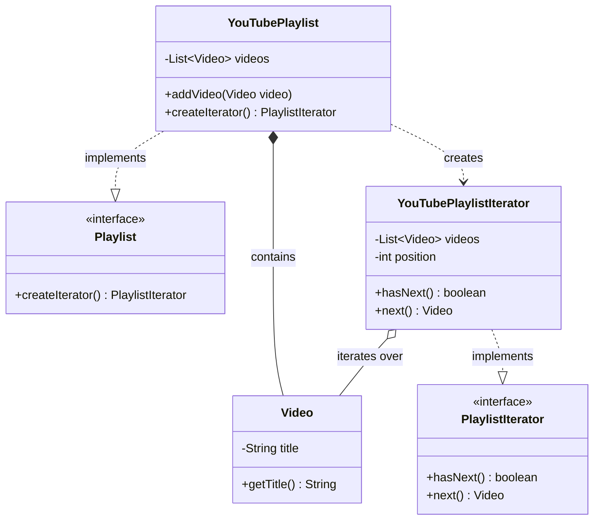
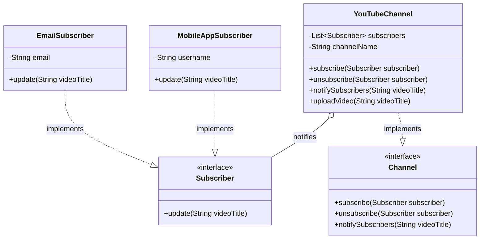
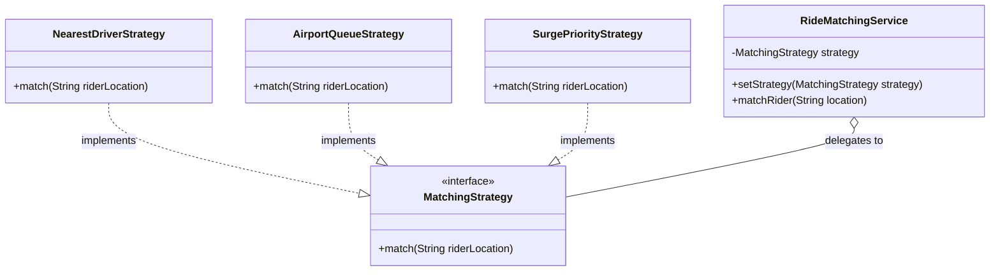
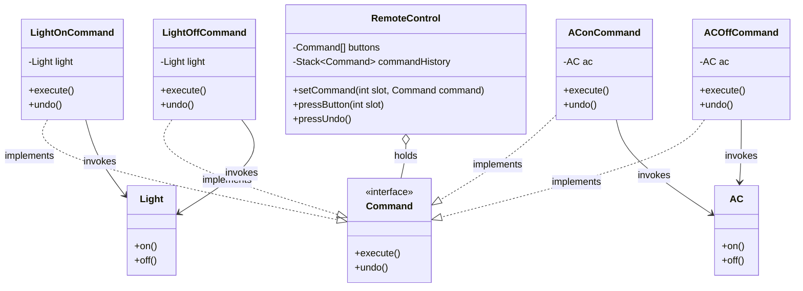
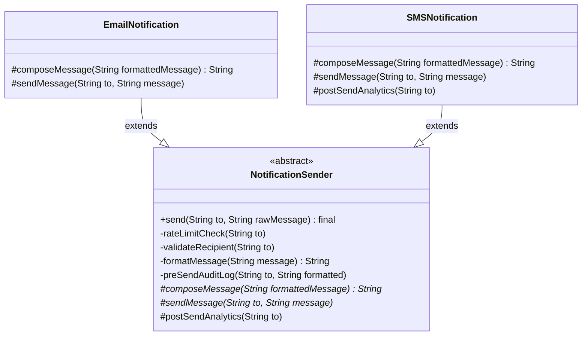
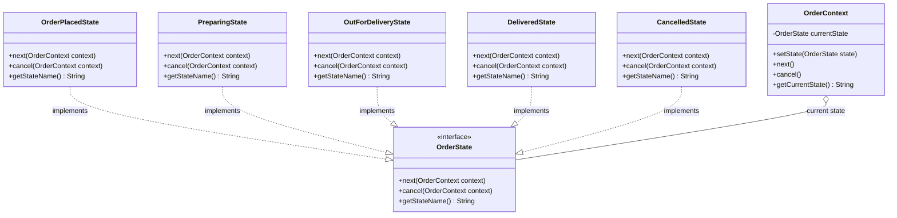
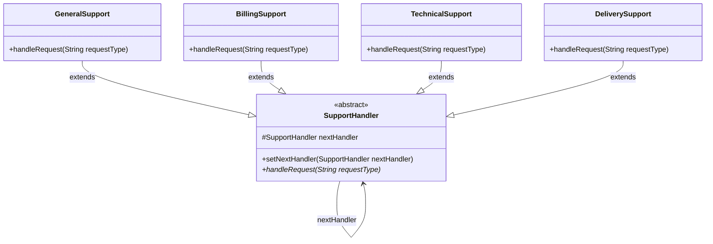
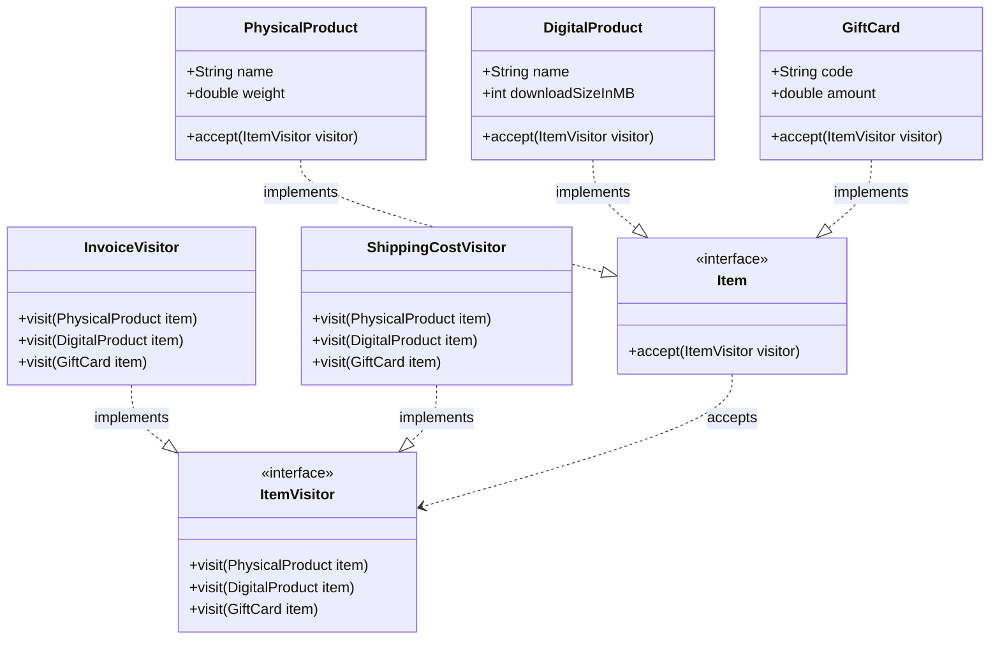
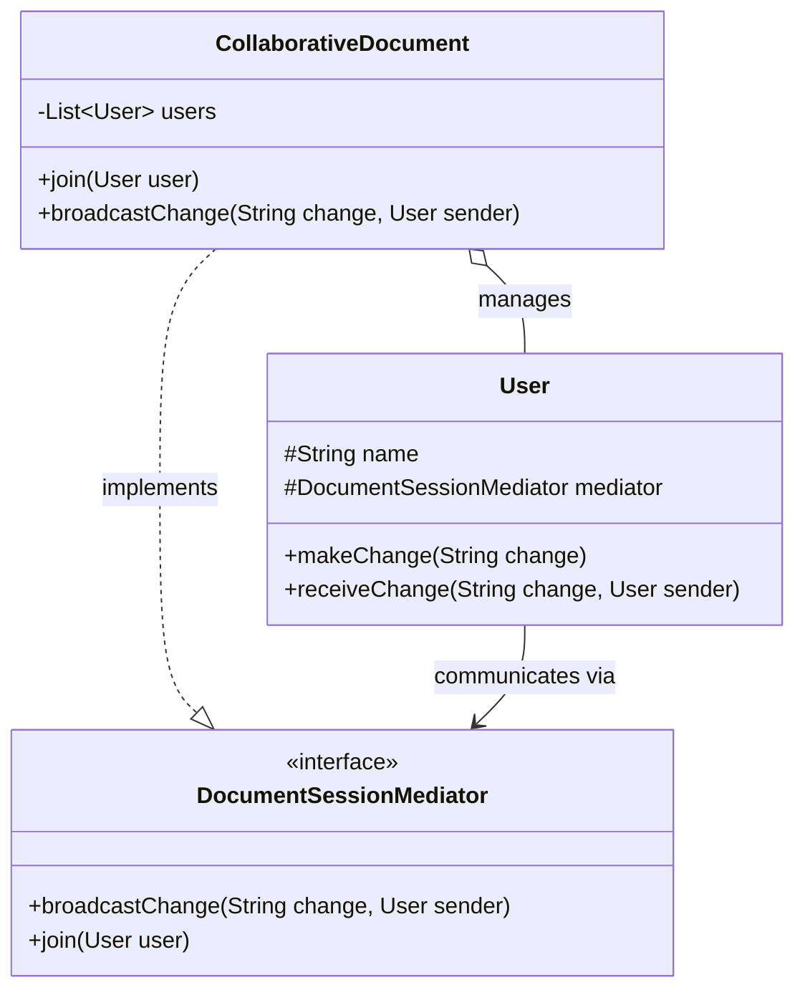
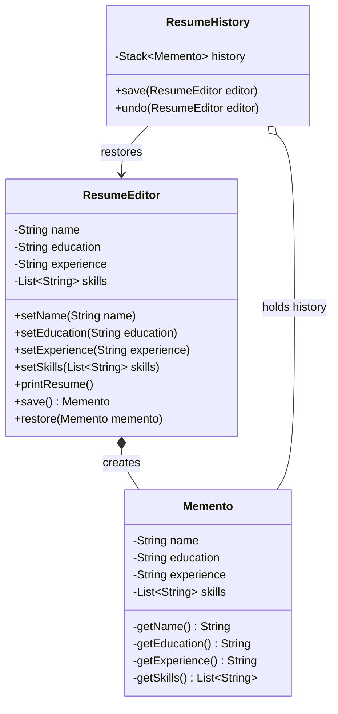

# Behavioural Design Patterns

Behavioral design patterns focus on how objects interact and communicate with each other, helping to define the flow of control in a system. These patterns simplify complex communication logic between objects while promoting loose coupling.

Imagine a TV remote that lets you switch through channels one by one, without needing to know how the channels are stored internally. This kind of controlled access is exactly what behavioral patterns help us achieve.

One such pattern is the Iterator Pattern. Let's understand the Iterator Pattern in depth in the upcoming sections.

## Iterator Pattern

The Iterator Pattern is a behavioral design pattern that provides a way to access the elements of a collection sequentially without exposing the underlying representation.

### Formal Definition

The Iterator Pattern is a behavioral design pattern that entrusts the traversal behavior of a collection to a separate design object. It traverses the elements without exposing the underlying operations.

This means whether your collection is an array, a list, a tree, or something custom, you can use an iterator to traverse it in a consistent manner, one element at a time, without worrying about how the data is stored or managed internally.

### Real-Life Analogy

<div style="border-left:4px solid #195045;background:rgba(25,80,69,0.08);padding:0.6rem 1rem;border-radius:0 0.5rem 0.5rem 0;margin:1.25rem 0">

💡 **Insight.** Think of a vending machine. You don’t need to know how the snacks are arranged inside or where exactly your favorite drink is stored. You just press the "Next" button to scroll through options one by one. The vending machine controls the order and pace of traversal.

</div>

Similarly, an iterator acts like that "Next" button, giving you one item at a time, hiding the complexity of what’s going on behind the scenes.

### Understanding the Problem

Let’s say we’re building a YouTube Playlist system. We want to store a list of videos and print their titles one by one. Let's look at the initial code setup:

```java
import java.util.*;

// A simple Video class with title
class Video {
    String title;

    public Video(String title) {
        this.title = title;
    }

    public String getTitle() {
        return title;
    }
}

// YouTubePlaylist class holds a list of Video objects
class YouTubePlaylist {
    private List<Video> videos = new ArrayList<>();

    // Add a video to the playlist
    public void addVideo(Video video) {
        videos.add(video);
    }

    // Expose the video list
    public List<Video> getVideos() {
        return videos;
    }
}

// Client Code
class Main {
    public static void main(String[] args) {
        YouTubePlaylist playlist = new YouTubePlaylist();
        playlist.addVideo(new Video("LLD Tutorial"));
        playlist.addVideo(new Video("System Design Basics"));

        // Loop through videos and print titles
        for (Video v : playlist.getVideos()) {
            System.out.println(v.getTitle());
        }
    }
}
```

### What are the Issues?

While the code works, there are several design-level concerns:
- **Exposes internal structure:** The internal list or array is directly returned via getVideos() or similar methods. This breaks encapsulation, as clients can access or even modify the internal collection outside the owning class.
- **Tight coupling with underlying structure:** The external code is tightly bound to the specific type of collection used (like vector, list, etc.). Any change in the internal structure may require changes in client code.
- **No control over traversal:** Traversal logic is managed outside the class. You can't enforce custom traversal behaviors (e.g., reverse, skip elements, filter) without modifying external code.
- **Difficult to support multiple independent traversals:** If two parts of your program want to iterate over the same playlist independently, there's no built-in way to do that cleanly. You have to manage indexing and traversal state manually.

Let us now understand how we can solve this problem using the Iterator Pattern.

### The Solution

To fix the issues like exposing internal data and lacking control over traversal, we can apply the Iterator Pattern. This pattern lets external code access playlist items sequentially without knowing or modifying the internal data structure.

Let’s implement this using custom interfaces and iterator classes.

```java
import java.util.*;

// ========== Video class representing a single video ==========
class Video {
    private String title;

    public Video(String title) {
        this.title = title;
    }

    public String getTitle() {
        return title;
    }
}

// ========== YouTubePlaylist class (Aggregate) ==========
class YouTubePlaylist {
    private List<Video> videos = new ArrayList<>();

    // Method to add video to playlist
    public void addVideo(Video video) {
        videos.add(video);
    }

    // Method to expose internal video list
    public List<Video> getVideos() {
        return videos;
    }
}

// ========== Iterator interface ==========
interface PlaylistIterator {
    boolean hasNext();
    Video next();
}

// ========== Concrete Iterator class ==========
class YouTubePlaylistIterator implements PlaylistIterator {
    private List<Video> videos;
    private int position;

    // Constructor takes the list to iterate on
    public YouTubePlaylistIterator(List<Video> videos) {
        this.videos = videos;
        this.position = 0;
    }

    // Check if more videos are left to iterate
    @Override
    public boolean hasNext() {
        return position < videos.size();
    }

    // Return the next video in sequence
    @Override
    public Video next() {
        return hasNext() ? videos.get(position++) : null;
    }
}

// ========== Main method (Client code) ==========
public class Main {
    public static void main(String[] args) {
        // Create a playlist and add videos
        YouTubePlaylist playlist = new YouTubePlaylist();
        playlist.addVideo(new Video("LLD Tutorial"));
        playlist.addVideo(new Video("System Design Basics"));

        // Client directly creates the iterator using internal list (not ideal)
        PlaylistIterator iterator = new YouTubePlaylistIterator(playlist.getVideos());

        // Use the iterator to loop through the playlist
        while (iterator.hasNext()) {
            System.out.println(iterator.next().getTitle());
        }
    }
}
```

### How This Solves the Problem:

With the iterator pattern in place, we’ve clearly separated the concern of how elements are traversed from the actual data structure that stores them. Here's how this improves our design:

| Problem | How Iterator Pattern Solves It |
| --- | --- |
| Direct access to internal data structure | The collection no longer exposes its internal data (like a list or array) directly for traversal. Instead, an iterator is used to access elements one-by-one, encapsulating the structure. |
| No standard way to iterate | All traversal is now handled through a consistent interface (hasNext() / next()), regardless of how the data is stored internally. This ensures uniformity in how iteration happens. |
| Traversal logic spread across client code | The logic for maintaining iteration state (e.g., index or position) is encapsulated within the iterator class itself, keeping the client code clean and focused only on usage. |
| Difficult to customize traversal | Custom iterator classes can easily be extended to provide different traversal strategies (e.g., reverse, filtering, skipping), without changing the underlying collection. |
| Tight coupling to collection type | Client code no longer depends on the exact type of data structure (like array, list, vector). It interacts only with the iterator, reducing dependencies and improving flexibility. |

### One Major Issue Still Remains...

Even though we’ve abstracted the traversal logic into an iterator class, the client is still responsible for creating and using the iterator, which is not ideal. The goal of true encapsulation would be to hide even the creation of the iterator, something we’ll address now with a more refined approach in the next section.

### More Refined Approach

This version fully aligns with the Iterator Design Pattern, where the collection itself provides the iterator, and the client is decoupled from the internal list structure.

```java
import java.util.*;

// ========== Video class representing a single video ==========
class Video {
    private String title;

    public Video(String title) {
        this.title = title;
    }

    public String getTitle() {
        return title;
    }
}

// ================ Playlist interface ================
// (acts as a contract for collections that are iterable)
interface Playlist {
    // Method to return an iterator for the collection
    PlaylistIterator createIterator();
}

// ========== YouTubePlaylist class (Aggregate) ==========
// Implements Playlist to guarantee it provides an iterator
class YouTubePlaylist implements Playlist {
    private List<Video> videos = new ArrayList<>();

    // Method to add a video to the playlist
    public void addVideo(Video video) {
        videos.add(video);
    }

    // Instead of exposing the list, return an iterator
    @Override
    public PlaylistIterator createIterator() {
        return new YouTubePlaylistIterator(videos);
    }
}

// ========== Iterator interface (defines traversal contract) ==========
interface PlaylistIterator {
    boolean hasNext();   // Checks if more elements are left
    Video next();        // Returns the next element
}

// ========== Concrete Iterator class ==========
// Implements the actual logic for traversing the YouTubePlaylist
class YouTubePlaylistIterator implements PlaylistIterator {
    private List<Video> videos;
    private int position;

    // Constructor takes the collection to iterate over
    public YouTubePlaylistIterator(List<Video> videos) {
        this.videos = videos;
        this.position = 0;
    }

    // Check if more videos are left
    @Override
    public boolean hasNext() {
        return position < videos.size();
    }

    // Return the next video in the playlist
    @Override
    public Video next() {
        return hasNext() ? videos.get(position++) : null;
    }
}

// ========== Main method (Client code) ==========
public class Main {
    public static void main(String[] args) {
        // Create a playlist and add videos to it
        YouTubePlaylist playlist = new YouTubePlaylist();
        playlist.addVideo(new Video("LLD Tutorial"));
        playlist.addVideo(new Video("System Design Basics"));

        // Client simply asks for an iterator — no access to internal data structure
        PlaylistIterator iterator = playlist.createIterator();

        // Iterate through the playlist using the provided interface
        while (iterator.hasNext()) {
            System.out.println(iterator.next().getTitle());
        }
    }
}
```

**The same idea in Python**

```python
from __future__ import annotations
from typing import List


class Video:
    def __init__(self, title: str) -> None:
        self._title = title

    @property
    def title(self) -> str:
        return self._title


class YouTubePlaylistIterator:
    """Concrete Iterator -- implements Python's iterator protocol directly."""

    def __init__(self, videos: List[Video]) -> None:
        self._videos = videos
        self._position = 0

    def __iter__(self) -> "YouTubePlaylistIterator":
        return self

    def __next__(self) -> Video:
        # __next__ raising StopIteration IS hasNext()/next() rolled into one --
        # Python bakes the Iterator Pattern into the language itself.
        if self._position >= len(self._videos):
            raise StopIteration
        video = self._videos[self._position]
        self._position += 1
        return video


class YouTubePlaylist:
    """Aggregate -- implements __iter__ instead of a createIterator() method."""

    def __init__(self) -> None:
        self._videos: List[Video] = []

    def add_video(self, video: Video) -> None:
        self._videos.append(video)

    def __iter__(self) -> YouTubePlaylistIterator:
        return YouTubePlaylistIterator(self._videos)


# ── Driver ──────────────────────────────────────────────
if __name__ == "__main__":
    playlist = YouTubePlaylist()
    playlist.add_video(Video("LLD Tutorial"))
    playlist.add_video(Video("System Design Basics"))

    # `for video in playlist:` calls __iter__ then __next__ automatically --
    # this IS the Iterator Pattern, already built into the language.
    for video in playlist:
        print(video.title)
```

### Key Improvements

- The YouTubePlaylist class no longer exposes its internal implementation of Videos.
- The client does not manage or know about the internal structure.
- The Playlist interface allows us to make other types of playlists (e.g., MusicPlaylist) that can also be iterable.
- Fully aligns with the Iterator Design Pattern principles.

### Ideal Scenarios for Using the Iterator Pattern

The Iterator Pattern isn’t meant for every situation, but it becomes incredibly useful in specific cases. Here are the key situations where this pattern shines:
You want to traverse a collection without exposing its internal structure:
Instead of revealing whether it's an ArrayList, Vector, or a custom tree, the pattern lets clients access elements one-by-one, safely and uniformly.
- **You need multiple ways to traverse a collection:** For example, forward traversal, reverse traversal, or skipping every second element. Each of these can be handled by a different iterator implementation without changing the collection itself. You want a unified way to traverse different types of collections: Whether it’s a list of videos, a set of songs, or a stack of documents, clients should be able to iterate over them using a common interface.
- **You want to decouple iteration logic from collection logic:** By separating how elements are stored from how they’re accessed, you reduce complexity and improve maintainability. Changes in iteration logic won’t affect how the collection is structured, and vice versa.

### Real World Examples

The Iterator Pattern is deeply embedded in software systems where data needs to be traversed without exposing its internal structure. Here are two crisp, real-world examples:

#### 1. Java Collection Framework

In Java, every collection class, like ArrayList, HashSet, TreeSet, implements the Iterable interface, which returns an Iterator via the iterator() method:

```java
import java.util.*;

class Main {
    public static void main(String[] args) {
        List<String> fruits = new ArrayList<>();
        fruits.add("Apple");
        fruits.add("Banana");

        Iterator<String> iterator = fruits.iterator();
        while (iterator.hasNext()) {
            System.out.println(iterator.next());
        }
    }
}
```

The client doesn’t need to know how the list is implemented internally, just how to get the next element.

#### 2. Java Streams and Spliterator

Java Streams internally rely on a traversal mechanism called Spliterator (Split + Iterator). It is designed to iterate elements efficiently and also supports splitting the data for parallel processing. This becomes extremely useful when dealing with large datasets, where Java can process data in multiple threads using parallel streams.

For example, when you call stream() or parallelStream() on a collection, Java obtains a Spliterator behind the scenes to traverse elements and optionally split the workload.

```java
import java.util.*;

class Main {
    public static void main(String[] args) {
        List<Integer> nums = Arrays.asList(10, 20, 30, 40);

        // Stream traversal (internally uses a Spliterator)
        nums.stream().forEach(System.out::println);

        // Parallel stream traversal (Spliterator can split work across threads).
        // forEachOrdered (not forEach) keeps this demo's output deterministic —
        // forEach would interleave unpredictably across threads.
        nums.parallelStream().forEachOrdered(System.out::println);
    }
}
```

So even though you do not explicitly create an iterator here, Java is still using the same underlying idea: traversing elements sequentially without exposing how the collection is structured, which is exactly what the Iterator Pattern is about.

### Pros and Cons

#### Pros of Iterator Pattern

- **Hides internal structure:** You can traverse a collection without knowing how it's built internally.
- **Unified way to traverse:** You use the same methods (hasNext, next) regardless of the collection type.
- **Supports multiple traversal strategies:** You can easily create different iterators (e.g., forward, reverse, filtered).
- **Follows SRP and OCP principles:** Iteration logic is separated (Single Responsibility), and new iterators can be added without modifying existing code (Open/Closed).

#### Cons of Iterator Pattern

- **Adds extra classes/interfaces:** Requires more boilerplate code to set up custom iterators.
- **Can be overkill for simple data structures:** For small lists, a direct for loop might be more straightforward.
- **External iteration is manual:** Client has to manage the loop using hasNext() and next() unless abstracted further.

### Class Diagram



Behavioral design patterns focus on how objects interact and communicate with each other, helping to define the flow of control in a system. These patterns simplify complex communication logic between objects while promoting loose coupling.

Imagine a notification system where multiple users get alerts when a new blog post is published. The publisher shouldn't have to worry about who all are subscribed or how they get notified. This kind of automatic, event-driven update mechanism is exactly what behavioral patterns help us achieve.

One such pattern is the Observer Pattern. Let’s explore the Observer Pattern in depth in the upcoming sections.

## Observer Pattern

The Observer Pattern is a behavioral design pattern that defines a one-to-many dependency between objects so that when one object (the subject) changes its state, all its dependents (called observers) are notified and updated automatically.

### Formal Definition

The Observer Pattern is a behavioral design pattern where an object, known as the subject, maintains a list of dependents (observers) and notifies them of any state changes, usually by calling one of their methods.

This means if multiple objects are watching another object for updates, they don’t need to keep checking repeatedly. Instead, they get notified as soon as something changes — making the system more efficient and loosely coupled.

### Real-Life Analogy

<div style="border-left:4px solid #195045;background:rgba(25,80,69,0.08);padding:0.6rem 1rem;border-radius:0 0.5rem 0.5rem 0;margin:1.25rem 0">

💡 **Insight.** Think of subscribing to a YouTube channel. Once you hit the Subscribe button and turn on notifications, you don’t have to keep visiting the channel to check for new videos. As soon as a new video is uploaded, you get notified instantly.

</div>

In this case:

- The channel is the subject.
- The subscribers are the observers.
- The notification is the automatic update mechanism triggered by the subject.

Similarly, in software, when an object (subject) undergoes a change, all registered observers get notified, just like YouTube alerts its subscribers.

### Understanding the Problem

Let’s say we’re building a simple YouTube-like Notification System. Whenever a creator uploads a new video, all their subscribers should get notified.

Below is a naive implementation of this logic:

```java
import java.util.*;

class YouTubeChannel {
    public void uploadNewVideo(String videoTitle) {
        // Upload the video
        System.out.println("Uploading: " + videoTitle + "\n");

        // Manually notify users
        System.out.println("Sending email to user1@example.com");
        System.out.println("Pushing in-app notification to user3@example.com");
    }
}

class Main {
    public static void main(String[] args) {
        // Create a channel and upload a new video
        YouTubeChannel channel = new YouTubeChannel();
        channel.uploadNewVideo("Design Patterns in Java");
    }
}
```

### What’s Wrong with This Approach?

While the code works, there are several design-level concerns:
- **Tightly Coupled Code:** The YouTubeChannel class is directly responsible for how users are notified. If tomorrow we want to send an SMS or push notification, we’ll have to edit this class.
- **No Reusability:** The notification logic (email, app, etc.) is hardcoded. You can't reuse or extend this behavior in other places without copying code.
- **Scalability Issues:** Imagine having hundreds of users and multiple notification types. You’d end up cluttering this class with all the notification logic.
- **Violation of Single Responsibility Principle (SRP):** The class is doing two things: handling video uploads and managing user notifications. Ideally, each class should have one responsibility.

Let us now understand how we can solve this problem using the Observer Pattern.

### The Solution

Let’s now refactor our system using the Observer Pattern. This version ensures a clean separation of concerns and solves all the issues we discussed earlier.

```java
import java.util.*;

// ==============================
// Observer Interface
// ==============================
interface Subscriber {
    void update(String videoTitle);
}

// ==============================
// Concrete Observer: Email
// ==============================
class EmailSubscriber implements Subscriber {
    private String email;

    public EmailSubscriber(String email) {
        this.email = email;
    }

    @Override
    public void update(String videoTitle) {
        System.out.println("Email sent to " + email + ": New video uploaded - " + videoTitle);
    }
}

// ==============================
// Concrete Observer: Mobile App
// ==============================
class MobileAppSubscriber implements Subscriber {
    private String username;

    public MobileAppSubscriber(String username) {
        this.username = username;
    }

    @Override
    public void update(String videoTitle) {
        System.out.println("In-app notification for " + username + ": New video - " + videoTitle);
    }
}

// ==============================
// Subject Interface
// ==============================
interface Channel {
    void subscribe(Subscriber subscriber);
    void unsubscribe(Subscriber subscriber);
    void notifySubscribers(String videoTitle);
}

// ==============================
// Concrete Subject: YouTubeChannel
// ==============================
class YouTubeChannel implements Channel {
    private List<Subscriber> subscribers = new ArrayList<>();
    private String channelName;

    public YouTubeChannel(String channelName) {
        this.channelName = channelName;
    }

    @Override
    public void subscribe(Subscriber subscriber) {
        subscribers.add(subscriber);
    }

    @Override
    public void unsubscribe(Subscriber subscriber) {
        subscribers.remove(subscriber);
    }

    @Override
    public void notifySubscribers(String videoTitle) {
        for (Subscriber subscriber : subscribers) {
            subscriber.update(videoTitle);
        }
    }

    // Simulates video upload and triggers notifications
    public void uploadVideo(String videoTitle) {
        System.out.println(channelName + " uploaded: " + videoTitle + "\n");
        notifySubscribers(videoTitle);
    }
}

// ==============================
// Client Code
// ==============================
class Main {
    public static void main(String[] args) {
        YouTubeChannel channel = new YouTubeChannel("techchannel");

        // Add subscribers
        channel.subscribe(new MobileAppSubscriber("alex"));
        channel.subscribe(new EmailSubscriber("rahul@example.com"));

        // Upload video and notify all observers
        channel.uploadVideo("observer-pattern");
    }
}
```

**The same idea in Python**

```python
from __future__ import annotations
from abc import ABC, abstractmethod
from typing import List


class Subscriber(ABC):
    # Java's `interface` has no direct Python counterpart with a compiler-
    # enforced contract; abc.ABC + @abstractmethod makes the contract
    # explicit and fails fast if a concrete subscriber forgets update().
    @abstractmethod
    def update(self, video_title: str) -> None: ...


class EmailSubscriber(Subscriber):
    def __init__(self, email: str) -> None:
        self._email = email

    def update(self, video_title: str) -> None:
        print(f"Email sent to {self._email}: New video uploaded - {video_title}")


class MobileAppSubscriber(Subscriber):
    def __init__(self, username: str) -> None:
        self._username = username

    def update(self, video_title: str) -> None:
        print(f"In-app notification for {self._username}: New video - {video_title}")


class YouTubeChannel:
    def __init__(self, channel_name: str) -> None:
        self._channel_name = channel_name
        self._subscribers: List[Subscriber] = []

    def subscribe(self, subscriber: Subscriber) -> None:
        self._subscribers.append(subscriber)

    def unsubscribe(self, subscriber: Subscriber) -> None:
        self._subscribers.remove(subscriber)

    def notify_subscribers(self, video_title: str) -> None:
        for subscriber in self._subscribers:
            subscriber.update(video_title)

    def upload_video(self, video_title: str) -> None:
        print(f"{self._channel_name} uploaded: {video_title}\n")
        self.notify_subscribers(video_title)


# ── Driver ──────────────────────────────────────────────
if __name__ == "__main__":
    channel = YouTubeChannel("techchannel")

    channel.subscribe(MobileAppSubscriber("alex"))
    channel.subscribe(EmailSubscriber("rahul@example.com"))

    channel.upload_video("observer-pattern")
```

### How This Solves the Problem:

| Problem in Old Approach | How Observer Pattern Solves It |
| --- | --- |
| Channel is tightly coupled with notification logic | Each subscriber handles its own notification via update() |
| Not extensible for new notification types | Add new subscriber classes without modifying existing code |
| No reusability of logic | Notification logic is encapsulated in reusable subscriber classes |
| SRP Violation (upload + notify in one class) | Upload logic stays in YouTubeChannel; notification logic is external |
| Difficult to manage large number of subscribers | subscribe() and unsubscribe() methods handle this cleanly |

### Use Cases and Limitations

#### Recommended Scenarios for Applying the Observer Pattern

- **State Change Propagation:** When a change in one object must be immediately reflected across multiple dependent objects, the Observer Pattern provides a clean way to propagate this change without direct coupling.
- **Decoupling Between Core Components:** In systems where the subject (publisher) should remain agnostic of how many observers exist or what actions they perform, the Observer Pattern promotes separation of concerns. This makes the system easier to extend and maintain.
- **Dynamic Subscriptions at Runtime:** Situations that involve modules being added or removed dynamically (e.g., plugins, UI listeners, notification modules) benefit from the Observer Pattern, as it allows flexible attachment and detachment of observers without affecting the subject.

#### Situations Where the Observer Pattern May Fall Short

- **Excessive Observer Load:** In high-scale systems with millions of observers (e.g., when a celebrity with 10M followers goes live), a direct notification loop becomes inefficient. Such cases are better handled using event queues, pub-sub architectures, or broadcast systems optimized for massive concurrency.
- **Strict Control Over Notification Timing:** In environments where the timing of notifications must be tightly managed—such as financial systems or real-time analytics, deterministic control is critical. The Observer Pattern lacks fine-grained scheduling control. Systems like message brokers (e.g., Kafka, RabbitMQ) are more suitable in such scenarios, providing features like buffering, retries, and ordering.

In short, Observer Pattern works really well with a small number of observers, but to scale, it becomes essential to move toward an event-driven architecture.

### Pros and Cons

#### Pros

- **Promotes Loose Coupling:** Observers and subjects are decoupled. They interact only through a common interface, which improves flexibility and modularity.
- **Open for Extension:** New types of observers can be added without modifying the subject class, adhering to the Open/Closed Principle.
- **Supports Dynamic Subscription:** Observers can be attached or detached at runtime, enabling highly configurable and adaptable systems.
- **Encourages Reusability:** Different observer implementations can be reused across subjects or contexts without duplication of logic.

#### Cons

- **Unpredictable Update Sequences:** If the order of observer notifications matters, it may be hard to manage as the pattern does not guarantee update order.
- **Performance Bottlenecks at Scale:** Notifying a large number of observers synchronously can degrade performance in high-scale systems.
- **Risk of Memory Leaks:** Failure to unsubscribe unused observers may result in lingering references and memory issues.
- **Difficult Debugging:** Since interactions happen indirectly through interfaces, tracing the source of bugs or unwanted updates can be challenging.
- **Tight Timing Coupling:** All observers are notified immediately. Delayed or controlled delivery of events is not supported natively.

### Real-Life Use Cases

The Observer Pattern is widely used in real-world systems that require automatic propagation of changes across dependent components. Here are a few notable examples:
- **UI Event Handling:** In GUI frameworks, buttons, sliders, and input fields use observers (listeners) to respond to user actions like clicks or typing.
- **News or Blog Subscriptions:** Readers subscribe to news feeds or blog updates. When new content is published, all subscribers are notified instantly.
- **Stock Market Tickers:** Trading platforms subscribe to stock price changes. Whenever prices update, relevant modules (charts, alerts, watchlists) are notified in real-time.
- **File System Watchers:** IDEs or OS-level watchers use observers to track file changes. Once a file is modified, all registered tools or services (like compilers or sync tools) are triggered.
- **Social Media Notifications:** Platforms like YouTube or Instagram notify followers when someone they follow posts new content.

### Class Diagram



## Strategy Pattern

Imagine a navigation app that can switch between driving, walking, or cycling routes. The algorithm used to calculate the path depends on the selected mode of travel. Instead of hardcoding all possible strategies inside one class, wouldn’t it be better if each strategy was defined separately and chosen dynamically?

That’s exactly what the Strategy Pattern enables. It allows a class to choose its behavior at runtime by encapsulating related algorithms into interchangeable objects. Let's explore the Strategy Pattern in detail in the upcoming sections.

The Strategy Pattern is a behavioral design pattern that defines a family of algorithms, encapsulates each one into a separate class, and makes them interchangeable at runtime depending on the context.

### Formal Definition

The Strategy Pattern is a behavioral design pattern that enables selecting an algorithm's behavior at runtime by defining a set of strategies (algorithms), each encapsulated in its own class, and making them interchangeable via a common interface.

It is primarily focused on changing the behavior of an object dynamically, without modifying its class. This promotes better organization of related algorithms and enhances code flexibility and scalability.

### Real-Life Analogy

<div style="border-left:4px solid #195045;background:rgba(25,80,69,0.08);padding:0.6rem 1rem;border-radius:0 0.5rem 0.5rem 0;margin:1.25rem 0">

💡 **Insight.** Consider how Uber matches a rider with a driver. The underlying algorithm may change depending on the context, like matching with the nearest driver, giving priority to surge zones, or choosing from an airport queue.

</div>

In this case:

- The ride-matching service is the context.
- The different matching algorithms (nearest, surge-priority, airport-queue) are the strategies.
- The strategy interface allows the system to switch between these algorithms seamlessly, depending on real-time conditions.

Similarly, in software, the Strategy Pattern allows a class to use different algorithms or behaviors at runtime, without altering its code structure, just like Uber switches matching strategies based on need.

### Understanding the Problem

Let’s say we are building a ride-matching service for a ride-hailing platform. The matching behavior changes depending on conditions such as proximity, surge areas, or airport queues.

Here’s a naive implementation of this logic:

```java
import java.util.*;

// Class implementing Ride Matching Service
class RideMatchingService {
    public void matchRider(String riderLocation, String matchingType) {
        // Match rider using different hardcoded strategies
        if (matchingType.equals("NEAREST")) {
            // Find nearest driver
            System.out.println("Matching rider at " + riderLocation + " with nearest driver.");
        } else if (matchingType.equals("SURGE_PRIORITY")) {
            // Match based on surge area logic
            System.out.println("Matching rider at " + riderLocation + " based on surge pricing priority.");
        } else if (matchingType.equals("AIRPORT_QUEUE")) {
            // Use FIFO-based airport queue logic
            System.out.println("Matching rider at " + riderLocation + " from airport queue.");
        } else {
            System.out.println("Invalid matching strategy provided.");
        }
    }
}

// Client Code
public class Main {
    public static void main(String[] args) {
        RideMatchingService service = new RideMatchingService();

        // Try different strategies
        service.matchRider("Downtown", "NEAREST");
        service.matchRider("City Center", "SURGE_PRIORITY");
        service.matchRider("Airport Terminal 1", "AIRPORT_QUEUE");
    }
}
```

### Problems with This Approach:

| Issue | Explanation |
| --- | --- |
| Violation of Open/Closed Principle | Adding a new strategy (e.g., VIP rider matching) would require modifying the RideMatchingService class. This tightly couples strategy logic with the core class. |
| Code Becomes Messy | As more conditions are added, the number of if-else branches grows, making the code harder to maintain and read. |
| Difficult to Test or Reuse | Individual matching strategies are not reusable or testable in isolation. All logic is embedded inside a single method. |
| No Separation of Concerns | The class handles both coordination (service logic) and implementation (strategy logic), which reduces flexibility. |

### The Solution

The Strategy Pattern helps eliminate complex conditional logic by encapsulating each matching algorithm into its own class. The ride-matching service then delegates the decision-making to the selected strategy at runtime. This makes the system flexible, extensible, and easier to maintain.

Let's look at the implementation in code:

```java
import java.util.*;

// ==============================
// Strategy Interface
// ==============================
interface MatchingStrategy {
    void match(String riderLocation);
}

// ==============================
// Concrete Strategy: Nearest Driver
// ==============================
class NearestDriverStrategy implements MatchingStrategy {
    @Override
    public void match(String riderLocation) {
        System.out.println("Matching with the nearest available driver to " + riderLocation);
        // Distance-based matching logic
    }
}

// ==============================
// Concrete Strategy: Airport Queue
// ==============================
class AirportQueueStrategy implements MatchingStrategy {
    @Override
    public void match(String riderLocation) {
        System.out.println("Matching using FIFO airport queue for " + riderLocation);
        // Match first-in-line driver for airport pickup
    }
}

// ==============================
// Concrete Strategy: Surge Priority
// ==============================
class SurgePriorityStrategy implements MatchingStrategy {
    @Override
    public void match(String riderLocation) {
        System.out.println("Matching rider using surge pricing priority near " + riderLocation);
        // Prioritize high-surge zones or premium drivers
    }
}

// ==============================
// Context Class: RideMatchingService
// ==============================
class RideMatchingService {
    private MatchingStrategy strategy;

    // Constructor injection of strategy
    public RideMatchingService(MatchingStrategy strategy) {
        this.strategy = strategy;
    }

    // Setter injection for changing strategy dynamically
    public void setStrategy(MatchingStrategy strategy) {
        this.strategy = strategy;
    }

    // Delegates the matching logic to the strategy
    public void matchRider(String location) {
        strategy.match(location);
    }
}

// ==============================
// Client Code
// ==============================
public class Main {
    public static void main(String[] args) {
        // Using airport queue strategy
        RideMatchingService rideMatchingService = new RideMatchingService(new AirportQueueStrategy());
        rideMatchingService.matchRider("Terminal 1");

        // Using nearest driver strategy and later switching to surge priority
        RideMatchingService rideMatchingService2 = new RideMatchingService(new NearestDriverStrategy());
        rideMatchingService2.matchRider("Downtown");
        rideMatchingService2.setStrategy(new SurgePriorityStrategy());
        rideMatchingService2.matchRider("Downtown");
    }
}
```

**The same idea in Python**

```python
from __future__ import annotations
from abc import ABC, abstractmethod


class MatchingStrategy(ABC):
    @abstractmethod
    def match(self, rider_location: str) -> None: ...


class NearestDriverStrategy(MatchingStrategy):
    def match(self, rider_location: str) -> None:
        print(f"Matching with the nearest available driver to {rider_location}")


class AirportQueueStrategy(MatchingStrategy):
    def match(self, rider_location: str) -> None:
        print(f"Matching using FIFO airport queue for {rider_location}")


class SurgePriorityStrategy(MatchingStrategy):
    def match(self, rider_location: str) -> None:
        print(f"Matching rider using surge pricing priority near {rider_location}")


class RideMatchingService:
    # Python's first-class functions mean a plain function or lambda would
    # often be enough here (e.g. self._strategy = lambda loc: print(...));
    # the class-based form below mirrors the Java structure one-to-one.
    def __init__(self, strategy: MatchingStrategy) -> None:
        self._strategy = strategy

    def set_strategy(self, strategy: MatchingStrategy) -> None:
        self._strategy = strategy

    def match_rider(self, location: str) -> None:
        self._strategy.match(location)


# ── Driver ──────────────────────────────────────────────
if __name__ == "__main__":
    service = RideMatchingService(AirportQueueStrategy())
    service.match_rider("Terminal 1")

    service2 = RideMatchingService(NearestDriverStrategy())
    service2.match_rider("Downtown")
    service2.set_strategy(SurgePriorityStrategy())
    service2.match_rider("Downtown")
```

### How This Solves the Earlier Problems

| Problem in Old Approach | How Strategy Pattern Solves It |
| --- | --- |
| Violation of Open/Closed Principle | New strategies can be added without modifying existing service code, just create a new class implementing MatchingStrategy. |
| Code Becomes Messy | Eliminates complex if-else logic by delegating behavior to separate classes. |
| Difficult to Test or Reuse | Each strategy is independently testable and reusable across services or contexts. |
| No Separation of Concerns | RideMatchingService is only concerned with coordination, actual logic lies in strategy classes. |

### Suitable Scenarios for Strategy Pattern

The Strategy Pattern is an ideal choice in the following scenarios:
- **Multiple Interchangeable Algorithms:** When a system supports different algorithms or behaviors that can be swapped in and out based on context or configuration.
- **Compliance with Open/Closed Principle (OCP):** When new strategies need to be introduced without modifying the existing business logic, keeping the core code closed for modification and open for extension.
- **Elimination of Conditionals:** When large blocks of if-else or switch statements are used to select behavior, Strategy Pattern helps to cleanly separate these into dedicated classes.
- **Behavior-Specific Unit Testing:** When there's a need to test behaviors independently and isolate them from the context, Strategy Pattern offers clear test boundaries.
- **Runtime Behavior Selection:** When the behavior of a class needs to be selected dynamically during execution based on user input, configuration, or environment.

### Pros and Cons

#### Pros

- **Supports the Open/Closed Principle (OCP):** New strategies can be added without modifying existing code, keeping the system extensible.
- **Easy to Add New Behaviors:** Each behavior is encapsulated in its own class, making it simple to plug in new logic.
- **Enables Runtime Behavior Changes:** Behavior can be changed dynamically at runtime by swapping strategy objects.
- **Encourages Composition Over Inheritance:** Promotes flexible design by favoring object composition rather than rigid class hierarchies.

#### Cons

- **May Lead to Too Many Small Classes:** Each strategy is implemented in a separate class, which can increase code volume.
- **Requires Awareness of All Strategies:** The client needs to know which strategies exist and when to use each one.
- **Slight Overhead Due to Interfaces:** Involves extra structure around interfaces, which may be unnecessary for simple logic.
- **Slightly More Complex Than if-else:** For very simple cases, the Strategy Pattern may introduce more complexity than needed.

### Class Diagram



## Command Pattern

Imagine a remote control that sends commands to various devices, like turning on the lights or adjusting the volume. The user doesn’t need to understand the internal workings of the devices, just the commands they can give. This is a perfect example of what behavioral patterns like the Command Pattern help us achieve.

The Command Pattern encapsulates a request as an object, allowing for more flexible and dynamic command handling. In the upcoming sections, we’ll dive deeper into how the Command Pattern works and how it can be applied in real-world scenarios.

The Command Pattern is a behavioral design pattern that turns a request into a separate object, allowing you to decouple the code that issues the request from the code that performs it.

### Formal Definition

The Command Pattern is a behavioral design pattern that encapsulates a request as an object, allowing for parameterization of clients with different requests, queuing of requests, and logging of the requests. It lets you add features like undo, redo, logging, and dynamic command execution without changing the core business logic.

This allows you to execute commands at a later time, in a flexible manner, without having to interact directly with the request's execution details.

### Real-Life Analogy

<div style="border-left:4px solid #195045;background:rgba(25,80,69,0.08);padding:0.6rem 1rem;border-radius:0 0.5rem 0.5rem 0;margin:1.25rem 0">

💡 **Insight.** Think of a remote control used to turn on or off the lights or an air conditioner (AC). When you press a button to turn on the lights or adjust the temperature, you don’t need to understand how the internal circuits work or how the AC receives the signal. You just press the "On" or "Off" button, and the remote control takes care of sending the command.

</div>

Similarly, the Command Pattern decouples the sender of a request (the remote control) from the receiver (the light or AC), providing flexibility and simplicity in handling commands.

### Four Key Components

- **Client:** Initiates the request and sets up the command object.
- **Invoker:** Asks the command to execute the request.
- **Command:** Defines a binding between a receiver object and an action.
- **Receiver:** Knows how to perform the actions to satisfy a request.

### Understanding the Problem

Let's say we're building a simple remote control system where devices like lights and air conditioner can be turned on and off. Here's a naive implementation of the code:

```java
import java.util.*;

// Receiver classes - Light and AC with basic on/off methods
class Light {
    public void on() {
        System.out.println("Light turned ON");
    }

    public void off() {
        System.out.println("Light turned OFF");
    }
}

class AC {
    public void on() {
        System.out.println("AC turned ON");
    }

    public void off() {
        System.out.println("AC turned OFF");
    }
}

// Invoker - NaiveRemoteControl class to control devices
class NaiveRemoteControl {
    private Light light;
    private AC ac;
    private String lastAction = "";

    public NaiveRemoteControl(Light light, AC ac) {
        this.light = light;
        this.ac = ac;
    }

    // Command methods
    public void pressLightOn() {
        light.on();
        lastAction = "LIGHT_ON";
    }

    public void pressLightOff() {
        light.off();
        lastAction = "LIGHT_OFF";
    }

    public void pressACOn() {
        ac.on();
        lastAction = "AC_ON";
    }

    public void pressACOff() {
        ac.off();
        lastAction = "AC_OFF";
    }

    // Undo last action
    public void pressUndo() {
        switch (lastAction) {
            case "LIGHT_ON": light.off(); lastAction = "LIGHT_OFF"; break;
            case "LIGHT_OFF": light.on(); lastAction = "LIGHT_ON"; break;
            case "AC_ON": ac.off(); lastAction = "AC_OFF"; break;
            case "AC_OFF": ac.on(); lastAction = "AC_ON"; break;
            default: System.out.println("No action to undo."); break;
        }
    }
}

// Client Code
public class Main {
    public static void main(String[] args) {
        Light light = new Light();
        AC ac = new AC();
        NaiveRemoteControl remote = new NaiveRemoteControl(light, ac);

        remote.pressLightOn();
        remote.pressACOn();
        remote.pressLightOff();
        remote.pressUndo(); // Should undo LIGHT_OFF -> Light ON
        remote.pressUndo(); // Should undo AC_ON -> AC OFF
    }
}
```

While the implementation works, it suffers from some significant issues.

### Issues in the Code

- **1. Tight Coupling:** The NaiveRemoteControl class directly calls methods on the Light and AC classes. If additional devices need to be added in the future, changes will be required in the remote control class. This violates the open/closed principle, where classes should be open for extension but closed for modification.
- **2. Lack of Flexibility:** The commands are hardcoded in the remote control class. If new actions or different command sequences are required, modifying the remote control code is necessary, leading to potential maintenance challenges.
- **3. Undo Functionality:** The pressUndo method is tightly coupled with the commands. This makes it difficult to add more complex undo functionality, especially when dealing with multiple actions or a variety of devices.
- **4. Hardcoded Commands:** The remote control class directly defines commands like pressLightOn, pressACOn, etc. This makes the system rigid and difficult to modify. Adding new actions or commands would require changing the remote control code, leading to challenges in maintaining or extending the system.
- **5. Maintaining Command History:** The original approach doesn’t have a centralized mechanism to track previously executed commands. This leads to difficulties in implementing features like undo, where the last action needs to be reversed efficiently.

### The Solution

The issues in the previous implementation can be addressed by using the Command Pattern. By applying this pattern, it becomes easier to encapsulate requests as objects, allowing for flexible and reusable command handling. The command pattern decouples the request sender (Invoker) from the receiver (Light/AC) and provides a unified way to handle multiple commands and actions.

#### Code Implementation:

```java
import java.util.*;

// ========= Receiver classes ===========
// Light and AC with basic on/off methods
class Light {
    public void on() {
        System.out.println("Light turned ON");
    }

    public void off() {
        System.out.println("Light turned OFF");
    }
}

class AC {
    public void on() {
        System.out.println("AC turned ON");
    }

    public void off() {
        System.out.println("AC turned OFF");
    }
}

// ========= Command interface ===========
//    defines the command structure
interface Command {
    void execute();
    void undo();
}

// Concrete commands for Light ON and OFF
class LightOnCommand implements Command {
    private Light light;

    public LightOnCommand(Light light) {
        this.light = light;
    }

    public void execute() {
        light.on();
    }

    public void undo() {
        light.off();
    }
}

class LightOffCommand implements Command {
    private Light light;

    public LightOffCommand(Light light) {
        this.light = light;
    }

    public void execute() {
        light.off();
    }

    public void undo() {
        light.on();
    }
}

// Concrete commands for AC ON and OFF
class AConCommand implements Command {
    private AC ac;

    public AConCommand(AC ac) {
        this.ac = ac;
    }

    public void execute() {
        ac.on();
    }

    public void undo() {
        ac.off();
    }
}

class ACOffCommand implements Command {
    private AC ac;

    public ACOffCommand(AC ac) {
        this.ac = ac;
    }

    public void execute() {
        ac.off();
    }

    public void undo() {
        ac.on();
    }
}

// ========== Remote control class (Invoker) ==========
class RemoteControl {
    private Command[] buttons = new Command[4];  // Assigning 4 slots for commands
    private Stack<Command> commandHistory = new Stack<>();

    // Assign command to slot
    public void setCommand(int slot, Command command) {
        buttons[slot] = command;
    }

    // Press the button to execute the command
    public void pressButton(int slot) {
        if (buttons[slot] != null) {
            buttons[slot].execute();
            commandHistory.push(buttons[slot]);
        } else {
            System.out.println("No command assigned to slot " + slot);
        }
    }

    // Undo the last action
    public void pressUndo() {
        if (!commandHistory.isEmpty()) {
            commandHistory.pop().undo();
        } else {
            System.out.println("No commands to undo.");
        }
    }
}

// ========= Client code ===========
public class Main {
    public static void main(String[] args) {
        Light light = new Light();
        AC ac = new AC();

        Command lightOn = new LightOnCommand(light);
        Command lightOff = new LightOffCommand(light);
        Command acOn = new AConCommand(ac);
        Command acOff = new ACOffCommand(ac);

        RemoteControl remote = new RemoteControl();
        remote.setCommand(0, lightOn);
        remote.setCommand(1, lightOff);
        remote.setCommand(2, acOn);
        remote.setCommand(3, acOff);

        remote.pressButton(0); // Light ON
        remote.pressButton(2); // AC ON
        remote.pressButton(1); // Light OFF
        remote.pressUndo();    // Undo Light OFF -> Light ON
        remote.pressUndo();    // Undo AC ON -> AC OFF
    }
}
```

**The same idea in Python**

```python
from __future__ import annotations
from abc import ABC, abstractmethod
from typing import List, Optional


class Light:
    def on(self) -> None:
        print("Light turned ON")

    def off(self) -> None:
        print("Light turned OFF")


class AC:
    def on(self) -> None:
        print("AC turned ON")

    def off(self) -> None:
        print("AC turned OFF")


class Command(ABC):
    @abstractmethod
    def execute(self) -> None: ...

    @abstractmethod
    def undo(self) -> None: ...


class LightOnCommand(Command):
    def __init__(self, light: Light) -> None:
        self._light = light

    def execute(self) -> None:
        self._light.on()

    def undo(self) -> None:
        self._light.off()


class LightOffCommand(Command):
    def __init__(self, light: Light) -> None:
        self._light = light

    def execute(self) -> None:
        self._light.off()

    def undo(self) -> None:
        self._light.on()


class ACOnCommand(Command):
    def __init__(self, ac: AC) -> None:
        self._ac = ac

    def execute(self) -> None:
        self._ac.on()

    def undo(self) -> None:
        self._ac.off()


class ACOffCommand(Command):
    def __init__(self, ac: AC) -> None:
        self._ac = ac

    def execute(self) -> None:
        self._ac.off()

    def undo(self) -> None:
        self._ac.on()


class RemoteControl:
    # A plain function/lambda could stand in for each Command here too
    # (Python has first-class functions); the class-based form is kept for
    # structural parity with the Java, and because undo() needs state
    # (which device, which prior action) that a bare lambda would lose.
    def __init__(self) -> None:
        self._buttons: List[Optional[Command]] = [None] * 4
        self._history: List[Command] = []

    def set_command(self, slot: int, command: Command) -> None:
        self._buttons[slot] = command

    def press_button(self, slot: int) -> None:
        command = self._buttons[slot]
        if command is not None:
            command.execute()
            self._history.append(command)
        else:
            print(f"No command assigned to slot {slot}")

    def press_undo(self) -> None:
        if self._history:
            self._history.pop().undo()
        else:
            print("No commands to undo.")


# ── Driver ──────────────────────────────────────────────
if __name__ == "__main__":
    light = Light()
    ac = AC()

    remote = RemoteControl()
    remote.set_command(0, LightOnCommand(light))
    remote.set_command(1, LightOffCommand(light))
    remote.set_command(2, ACOnCommand(ac))
    remote.set_command(3, ACOffCommand(ac))

    remote.press_button(0)   # Light ON
    remote.press_button(2)   # AC ON
    remote.press_button(1)   # Light OFF
    remote.press_undo()      # Undo Light OFF -> Light ON
    remote.press_undo()      # Undo AC ON -> AC OFF
```

Let's now understand how the Command Pattern resolves the above discussed issues:

| Issue | How Command Pattern Resolves the Issue |
| --- | --- |
| Tight Coupling | By using the Command Pattern, the RemoteControl class no longer directly interacts with the devices. It now interacts with command objects (e.g., LightOnCommand, ACOffCommand), which decouples the logic. |
| Lack of Flexibility | With the Command Pattern, new commands (e.g., for new devices or actions) can be created as new Command implementations without changing the RemoteControl class. This allows for easy extension. |
| Undo Functionality | The Command Pattern provides a consistent structure for undoing commands. Each concrete command (e.g., LightOnCommand, ACOffCommand) has its own undo() method, which allows easy reversal of actions. |
| Hardcoded Commands | The Command Pattern uses an interface for commands, which allows dynamic assignment of different commands to slots in the remote. This makes the command assignments flexible and customizable. |
| Maintaining Command History | The Command Pattern introduces a stack (commandHistory) in the RemoteControl class, which tracks previously executed commands. This makes the undo functionality centralized and easier to manage. |

### Impact Without the Command Pattern

- **Tight Coupling Between Invoker and Receiver:** The invoker and receiver are directly linked, making future changes or additions to the system difficult without modifying both components.
- **Lack of Reusability:** No abstraction for actions limits the ability to reuse code for different functionalities or scenarios across various parts of the application.
- **Undo/Redo Operations Not Supported:** Implementing undo or redo functionality becomes complex and error-prone when operations are directly tied to specific actions.
- **Difficulty in Implementing Batch Actions:** Implementing batch operations, like night mode changes, becomes cumbersome as each action needs to be handled individually.
- **No Plug-and-Play Flexibility:** The system lacks the flexibility to add or modify commands dynamically without impacting other parts of the application.
- **Scalability Issues:** As the system grows, managing commands and handling new features becomes increasingly difficult without a structured approach like the Command Pattern.

### When to Use the Command Pattern

- **Decoupling Sender from Receiver:** Use the Command Pattern when there is a need to decouple the sender (Invoker) from the receiver (the object performing the action).
- **Undo/Redo Support:** The Command Pattern is useful when you require built-in support for undoing or redoing actions.
- **Batch Operations:** When multiple actions need to be executed as part of a batch (e.g., applying night mode), the Command Pattern allows easy implementation.
- **Plug-in Architecture:** It facilitates the creation of flexible, extensible systems where new commands can be added without affecting the core system.
- **Creating Macros or Composite Commands:** Use the pattern to group multiple commands together, enabling complex actions to be executed in sequence as a single macro.

### Pros and Cons of the Command Pattern

#### Pros

- **Decouples Sender and Receiver:** The sender (Invoker) and receiver (the device or action) are decoupled, allowing for flexibility and easier maintenance.
- **Supports Undo/Redo Functionality:** The Command Pattern inherently supports undo and redo actions, allowing for easier management of state reversals.
- **Easily Extensible and Reusable:** New commands can be added without modifying existing code, and commands can be reused across different parts of the application.

#### Cons

- **Increases the Number of Classes:** Implementing the Command Pattern can result in a large number of small classes for each command, potentially increasing the complexity.
- **Can Add Unnecessary Complexity for Simple Tasks:** For simple applications, the Command Pattern may introduce unnecessary complexity, making it harder to manage than simpler alternatives.
- **Requires Careful Design for Undo/Redo:** Implementing undo/redo functionality correctly requires careful design and additional effort, especially for complex command chains.

### Class Diagram



## Template Pattern

Imagine you are baking a cake using a predefined recipe. The recipe lays out the general steps you need to follow, like mixing ingredients, preheating the oven, and baking the cake. While the basic steps are fixed, the specific details (such as the ingredients or the flavor) can be varied. The Template Pattern helps to manage this by defining the basic structure of an algorithm while allowing certain steps to be implemented by subclasses.

Let’s explore the Template Pattern in more detail in the upcoming sections.

### Formal Definition

<div style="border-left:4px solid #15448e;background:rgba(21,68,142,0.08);padding:0.6rem 1rem;border-radius:0 0.5rem 0.5rem 0;margin:1.25rem 0">

📘 **Definition.** The Template Pattern is a behavioral design pattern that provides a blueprint for executing an algorithm. It allows subclasses to override specific steps of the algorithm, but the overall structure remains the same. This ensures that the invariant parts of the algorithm are not changed, while enabling customization in the variable parts.

</div>

### Real Life Analogy

Imagine you are following a recipe to bake a cake. The overall process of baking a cake (preheat oven, mix ingredients, bake, and cool) is fixed, but the specific ingredients or flavors may vary (chocolate, vanilla, etc.).

The Template Pattern is like the recipe: it defines the basic structure of the process (steps), while allowing the specific ingredients (or steps) to be varied depending on the cake type.

### Key Steps in Template Pattern

The Template Pattern generally consists of four key steps:
- **Template Method (Final Method in Base Class):** This method defines the skeleton of the algorithm. It calls the various steps and determines their sequence. This method is final to prevent overriding in subclasses, ensuring that the algorithm’s structure stays consistent.
- **Primitive Operations (Abstract Methods):** These are abstract methods that subclasses must implement. These methods represent the variable parts of the algorithm that may change based on the subclass’s specific requirements.
- **Concrete Operations (Final or Concrete Methods):** These are methods that contain behavior common to all subclasses. They are defined in the base class and are shared by all subclasses.
- **Hooks (Optional Methods with Default Behavior):** Hooks are optional methods in the base class that provide default behavior. Subclasses can override these methods to modify the behavior when needed, but they are not mandatory for all subclasses to implement.

By using the Template Pattern, one can ensure that the common steps of an algorithm remain unchanged while allowing subclasses to modify the specific details of the algorithm.

### Understanding the Problem

Let’s assume we are building a Notification Service where we need to send notifications via multiple channels, such as Email and SMS. Below is a simple way of how it might be implemented:

```java
import java.util.*;

// EmailNotification handles sending emails
class EmailNotification {

    public void send(String to, String message) {
        System.out.println("Checking rate limits for: " + to);
        System.out.println("Validating email recipient: " + to);
        String formatted = message.trim();
        System.out.println("Logging before send: " + formatted + " to " + to);

        // Compose Email
        String composedMessage = "<html><body><p>" + formatted + "</p></body></html>";

        // Send Email
        System.out.println("Sending EMAIL to " + to + " with content:\n" + composedMessage);

        // Analytics
        System.out.println("Analytics updated for: " + to);
    }
}

// SMSNotification handles sending SMS messages
class SMSNotification {

    public void send(String to, String message) {
        System.out.println("Checking rate limits for: " + to);
        System.out.println("Validating phone number: " + to);
        String formatted = message.trim();
        System.out.println("Logging before send: " + formatted + " to " + to);

        // Compose SMS
        String composedMessage = "[SMS] " + formatted;

        // Send SMS
        System.out.println("Sending SMS to " + to + " with message: " + composedMessage);

        // Analytics (custom)
        System.out.println("Custom SMS analytics for: " + to);
    }
}

class Main {
    public static void main(String[] args) {
        // Create objects for both notification services
        EmailNotification emailNotification = new EmailNotification();
        SMSNotification smsNotification = new SMSNotification();

        // Sending email notification
        emailNotification.send("example@example.com", "Your order has been placed!");

        System.out.println(" ");

        // Sending SMS notification
        smsNotification.send("1234567890", "Your OTP is 1234.");
    }
}
```

### Issues In This Code

- **Code Duplication:** Both EmailNotification and SMSNotification contain nearly identical logic for rate limit checking, message formatting, logging, and analytics. This violates the DRY (Don't Repeat Yourself) principle, making the code harder to maintain.
- **Hardcoded Behavior:** The behavior for sending emails and SMS is tightly coupled with the send() method. If we need to add a new notification type (e.g., Push Notification), we would need to duplicate the entire logic and modify each notification class.
- **Lack of Extensibility:** If we need to change the logic for rate limit checks, logging, or analytics, we will have to modify it across all notification classes, leading to potential errors and inconsistencies.
- **Maintenance Overhead:** With each new notification type, you are adding more classes with similar code, making the system increasingly difficult to manage as it grows.

### The Solution

The Template Pattern can be used to improve the structure of the previous code. By using the Template Pattern, we can eliminate duplicated logic (e.g., rate limit checks, recipient validation, logging, etc.) and define a skeleton method in a base class, while allowing the subclasses to define the specific steps such as message composition and sending.

Here's is the revised code using the Template Pattern:

```java
import java.util.*;

// Abstract class defining the template method and common steps
abstract class NotificationSender {

    // Template method
    public final void send(String to, String rawMessage) {
        // Common Logic
        rateLimitCheck(to);
        validateRecipient(to);
        String formatted = formatMessage(rawMessage);
        preSendAuditLog(to, formatted);

        // Specific Logic: defined by subclassese
        String composedMessage = composeMessage(formatted);
        sendMessage(to, composedMessage);

        // Optional Hook
        postSendAnalytics(to);
    }

    // Common step 1: Check rate limits
    private void rateLimitCheck(String to) {
        System.out.println("Checking rate limits for: " + to);
    }

    // Common step 2: Validate recipient
    private void validateRecipient(String to) {
        System.out.println("Validating recipient: " + to);
    }

    // Common step 3: Format the message (can be customized)
    private String formatMessage(String message) {
        return message.trim(); // could include HTML escaping, emoji processing, etc.
    }

    // Common step 4: Pre-send audit log
    private void preSendAuditLog(String to, String formatted) {
        System.out.println("Logging before send: " + formatted + " to " + to);
    }

    // Hook for subclasses to implement custom message composition
    protected abstract String composeMessage(String formattedMessage);

    // Hook for subclasses to implement custom message sending
    protected abstract void sendMessage(String to, String message);

    // Optional hook for analytics (can be overridden)
    protected void postSendAnalytics(String to) {
        System.out.println("Analytics updated for: " + to);
    }
}

// Concrete class for email notifications
class EmailNotification extends NotificationSender {

    // Implement message composition for email
    @Override
    protected String composeMessage(String formattedMessage) {
        return "<html><body><p>" + formattedMessage + "</p></body></html>";
    }

    // Implement email sending logic
    @Override
    protected void sendMessage(String to, String message) {
        System.out.println("Sending EMAIL to " + to + " with content:\n" + message);
    }
}

// Concrete class for SMS notifications
class SMSNotification extends NotificationSender {

    // Implement message composition for SMS
    @Override
    protected String composeMessage(String formattedMessage) {
        return "[SMS] " + formattedMessage;
    }

    // Implement SMS sending logic
    @Override
    protected void sendMessage(String to, String message) {
        System.out.println("Sending SMS to " + to + " with message: " + message);
    }

    // Override optional hook for custom SMS analytics
    @Override
    protected void postSendAnalytics(String to) {
        System.out.println("Custom SMS analytics for: " + to);
    }
}

// Client code
class Main {
    public static void main(String[] args) {
        NotificationSender emailSender = new EmailNotification();
        emailSender.send("john@example.com", "Welcome to the platform!");

        System.out.println(" ");

        NotificationSender smsSender = new SMSNotification();
        smsSender.send("9876543210", "Your OTP is 4567.");
    }
}
```

**The same idea in Python**

```python
from __future__ import annotations
from abc import ABC, abstractmethod


class NotificationSender(ABC):
    # `send` is Java's `final` template method -- Python has no `final`
    # keyword, so nothing stops a subclass from overriding send() itself;
    # sealing the algorithm's shape is a convention here, not a
    # compiler-enforced guarantee the way Java's `final` seals it.
    def send(self, to: str, raw_message: str) -> None:
        self._rate_limit_check(to)
        self._validate_recipient(to)
        formatted = self._format_message(raw_message)
        self._pre_send_audit_log(to, formatted)

        composed_message = self.compose_message(formatted)
        self.send_message(to, composed_message)

        self.post_send_analytics(to)

    def _rate_limit_check(self, to: str) -> None:
        print(f"Checking rate limits for: {to}")

    def _validate_recipient(self, to: str) -> None:
        print(f"Validating recipient: {to}")

    def _format_message(self, message: str) -> str:
        return message.strip()

    def _pre_send_audit_log(self, to: str, formatted: str) -> None:
        print(f"Logging before send: {formatted} to {to}")

    @abstractmethod
    def compose_message(self, formatted_message: str) -> str: ...

    @abstractmethod
    def send_message(self, to: str, message: str) -> None: ...

    def post_send_analytics(self, to: str) -> None:
        # Optional hook -- default behaviour, overridable by subclasses.
        print(f"Analytics updated for: {to}")


class EmailNotification(NotificationSender):
    def compose_message(self, formatted_message: str) -> str:
        return f"<html><body><p>{formatted_message}</p></body></html>"

    def send_message(self, to: str, message: str) -> None:
        print(f"Sending EMAIL to {to} with content:\n{message}")


class SMSNotification(NotificationSender):
    def compose_message(self, formatted_message: str) -> str:
        return f"[SMS] {formatted_message}"

    def send_message(self, to: str, message: str) -> None:
        print(f"Sending SMS to {to} with message: {message}")

    def post_send_analytics(self, to: str) -> None:
        print(f"Custom SMS analytics for: {to}")


# ── Driver ──────────────────────────────────────────────
if __name__ == "__main__":
    email_sender = EmailNotification()
    email_sender.send("john@example.com", "Welcome to the platform!")

    print(" ")

    sms_sender = SMSNotification()
    sms_sender.send("9876543210", "Your OTP is 4567.")
```

### Key Steps of Template Pattern Used in Above Code

- **Template Method (Final Method in Base Class):** The send() method is the template method that defines the skeleton of the algorithm. It calls common steps such as rateLimitCheck, validateRecipient, preSendAuditLog, etc., and delegates customizable actions like composeMessage and sendMessage to subclasses.
- **Primitive Operations (Abstract Methods):** The methods composeMessage() and sendMessage() are abstract, meaning they must be implemented by subclasses (EmailNotification and SMSNotification) to define specific behaviors for each notification type.
- **Concrete Operations (Final or Concrete Methods):** Methods like rateLimitCheck, validateRecipient, preSendAuditLog, and postSendAnalytics are defined in the base class as concrete operations because they contain common logic shared by both email and SMS notifications.
- **Hooks (Optional Methods with Default Behavior):** The postSendAnalytics method is an optional hook that can be overridden by subclasses (e.g., SMSNotification overrides this method to provide custom analytics behavior). Subclasses can choose to use or skip this method based on specific requirements.

### How This Approach Solves the Issues

| Issue | Solution with Template Pattern |
| --- | --- |
| Code Duplication | The common steps (rate limit checks, recipient validation, logging, etc.) are now centralized in the base class, reducing duplication. |
| Hardcoded Behavior | The specific behaviors (email vs SMS) are handled by subclasses, making the code more flexible and extensible. |
| Lack of Extensibility | New types of notifications (e.g., PushNotification) can be added by subclassing NotificationSender and implementing the abstract methods. |
| Maintenance Overhead | Common logic is handled in one place (the base class), so updating behaviors (like rate limit checks or logging) only requires changes in the base class. |

### When to Use the Template Pattern

The Template Pattern is best suited in the following scenarios:
When multiple classes follow the same algorithm but differ in a few steps.When multiple classes follow the same algorithm but differ in a few steps. This pattern allows the core structure to remain the same while enabling flexibility in specific steps of the algorithm.
When you want to avoid code duplication of common steps. The Template Pattern centralizes shared logic in the base class, promoting code reusability.
When you need to enforce a fixed order of steps. This pattern ensures that the steps of an algorithm follow a specific sequence, which can be crucial in certain operations.
When you want to provide optional customizations. Subclasses can override specific steps to customize the behavior while still maintaining the overall algorithm.
When you need a structured flow. The Template Pattern ensures that subclasses follow a certain framework, with the flexibility to implement specific details.

### Advantages and Disadvantages of Template Method

#### Pros

- **Promotes code reusability by sharing the same steps:** The Template Pattern helps in sharing common steps across different classes, ensuring that they follow the same algorithm without duplicating code.
- **Supports OCP (Open/Closed Principle):** New behaviors (custom steps) can be added by extending the base class without modifying its existing code, supporting the Open/Closed Principle.
- **Enforces a consistent flow:** The pattern ensures a fixed sequence of steps, making the flow predictable and consistent across all subclasses.
- **Allows optional customization via hook methods:** The use of hooks allows subclasses to modify or extend behavior when needed without changing the base structure.

#### Cons

- **Inheritance-based, limits flexibility:** The Template Pattern uses inheritance, which can reduce flexibility as the behavior is tightly coupled with the base class.
- **Subclasses are tightly coupled with the base class:** Any changes in the base class may affect all subclasses, making it harder to modify or extend certain features independently.
- **Not ideal if the algorithm varies, switch to Strategy Pattern:** If the algorithm changes significantly, the Template Pattern becomes less suitable, and using the Strategy Pattern may be a better choice.
- **May result in too many subclasses:** If the number of steps to be customized grows, you might end up creating too many subclasses, making the codebase harder to maintain.

### Real World Products where Template Pattern is Used

The Template Pattern is commonly used in real-world applications where the overall structure of an operation is fixed, but specific steps need to be customizable. Here are some examples:

#### 1. Payment Flow

In an online payment platform, the payment flow for both Indian and International transactions follows a predefined sequence. This sequence includes steps like validating the payment method, processing the payment, and updating the account. While these steps remain the same, the specifics (such as validating a UPI ID for Indian payments or a credit card for international payments) can vary between subclasses, providing flexibility and customization.

#### 2. Game Engines

Game engines like Unity or Unreal Engine use the Template Pattern in their game loop and rendering process. The framework for rendering a frame is common (input handling, physics update, rendering), but specific actions (e.g., rendering techniques or AI decision-making) can be customized in different games through subclassing.

#### 3. Frameworks

Many web frameworks, like Spring or Django, use the Template Pattern for handling requests. These frameworks define the common flow for handling HTTP requests (e.g., URL mapping, request handling, response formatting), but allow developers to override certain steps like request validation, database queries, or rendering logic.

### Class Diagram



## State Pattern

Imagine a vending machine that changes its behavior based on the coins inserted — when you insert enough money, the machine gives you a snack and when you haven’t inserted enough, it asks for more. This dynamic change in behavior depending on the machine's state is what the State Pattern addresses.

Let's understand explore State Pattern in detail in the upcoming sections.

### Formal Definition

The State Pattern is a behavioral design pattern that encapsulates state-specific behavior into separate classes and delegates the behavior to the appropriate state object. This allows the object to change its behavior without altering the underlying code.

This pattern makes it easy to manage state transitions by isolating state-specific behavior into distinct classes. It helps achieve loose coupling by ensuring that each state class is independent and can evolve without affecting others.

### Real-Life Analogy

Consider a food delivery app. As an order progresses, its state changes through multiple stages:

- The order is placed.
- The order is being prepared.
- A delivery partner is assigned.
- The order is picked up.
- The order is out for delivery.
- Finally, the order is delivered.

At each stage, the app behaves differently:

- In the "Order Placed" state, you can cancel the order.
- In the "Order Preparing" state, you can track the preparation status.
- In the "Delivery Partner Assigned" state, you can see the details of the assigned driver.
- And so on until the order is delivered.

<div style="border-left:4px solid #195045;background:rgba(25,80,69,0.08);padding:0.6rem 1rem;border-radius:0 0.5rem 0.5rem 0;margin:1.25rem 0">

💡 **Insight.** Each of these states represents a distinct phase, and the app's behavior changes based on which state the order is in. The State Pattern manages these transitions seamlessly, with each state class controlling the behavior for that phase. It also follows Open Closed Principle (OCP), as states can be added without modifying the existing code.

</div>

Let's now understand the working of State Pattern through the help of a problem statement.

### Understanding The Problem

Let's assume we are building a food delivery app, and we need to manage the different states of an order. The order can transition between multiple states, such as placed, preparing, out for delivery, and delivered.

Below is a simplified version of how we might implement this without using the State Pattern:

```java
import java.util.*;

class Order {
    private String state;

    // Constructor initializes the state to ORDER_PLACED
    public Order() {
        this.state = "ORDER_PLACED";
    }

    // Method to cancel the order
    // only allows cancellation if in ORDER_PLACED or PREPARING states
    public void cancelOrder() {
        if (state.equals("ORDER_PLACED") || state.equals("PREPARING")) {
            state = "CANCELLED";
            System.out.println("Order has been cancelled.");
        } else {
            System.out.println("Cannot cancel the order now.");
        }
    }

    // Method to move the order to the next state based on its current state
    public void nextState() {
        switch (state) {
            case "ORDER_PLACED":
                state = "PREPARING";
                break;
            case "PREPARING":
                state = "OUT_FOR_DELIVERY";
                break;
            case "OUT_FOR_DELIVERY":
                state = "DELIVERED";
                break;
            default:
                System.out.println("No next state from: " + state);
                return;
        }
        System.out.println("Order moved to: " + state);
    }

    // Getter for the state
    public String getState() {
        return state;
    }
}

class Main {
    // Main method to test the order flow
    public static void main(String[] args) {
        Order order = new Order();

        // Display initial state
        System.out.println("Initial State: " + order.getState());

        // Moving through states
        order.nextState(); // ORDER_PLACED -> PREPARING
        order.nextState(); // PREPARING -> OUT_FOR_DELIVERY
        order.nextState(); // OUT_FOR_DELIVERY -> DELIVERED

        // Attempting to cancel an order after it is out for delivery
        order.cancelOrder(); // Should not allow cancellation

        // Display final state
        System.out.println("Final State: " + order.getState());
    }
}
```

The above code works fine, but there are some critical issues in the code.

### Issues In The Code

- **State Transition Management:** The state transitions are hardcoded in the nextState() method using a switch statement. This approach becomes cumbersome if new states need to be added.
- **Lack of Encapsulation:** The state transition logic and cancel behavior are directly handled within the Order class. This violates the Single Responsibility Principle by combining multiple responsibilities within a single class.
- **Code Duplication:** The logic for the cancelOrder() and nextState() methods could lead to duplicate logic if more states and actions are added.
- **Missing Flexibility for Future Changes:** Adding new states or changing existing behaviors can be error-prone and cumbersome, as the Order class needs to be updated each time.

### Solution

The previous code can be improved using the State Pattern. Below is the refactored code implementing the State Pattern:

```java
import java.util.*;

// OrderContext class manages the current state of the order
class OrderContext {
    private OrderState currentState;

    // Constructor initializes the state to ORDER_PLACED
    public OrderContext() {
        this.currentState = new OrderPlacedState(); // default state
    }

    // Method to set a new state for the order
    public void setState(OrderState state) {
        this.currentState = state;
    }

    // Method to move the order to the next state
    public void next() {
        currentState.next(this);
    }

    // Method to cancel the order
    public void cancel() {
        currentState.cancel(this);
    }

    // Method to get the current state of the order
    public String getCurrentState() {
        return currentState.getStateName();
    }
}

// OrderState interface defines the behavior of the order states
interface OrderState {
    void next(OrderContext context); // Move to the next state
    void cancel(OrderContext context); // Cancel the order
    String getStateName(); // Get the name of the state
}

// Concrete states for each stage of the order

// OrderPlacedState handles the behavior when the order is placed
class OrderPlacedState implements OrderState {
    public void next(OrderContext context) {
        context.setState(new PreparingState());
        System.out.println("Order is now being prepared.");
    }

    public void cancel(OrderContext context) {
        context.setState(new CancelledState());
        System.out.println("Order has been cancelled.");
    }

    public String getStateName() {
        return "ORDER_PLACED";
    }
}

// PreparingState handles the behavior when the order is being prepared
class PreparingState implements OrderState {
    public void next(OrderContext context) {
        context.setState(new OutForDeliveryState());
        System.out.println("Order is out for delivery.");
    }

    public void cancel(OrderContext context) {
        context.setState(new CancelledState());
        System.out.println("Order has been cancelled.");
    }

    public String getStateName() {
        return "PREPARING";
    }
}

// OutForDeliveryState handles the behavior when the order is out for delivery
class OutForDeliveryState implements OrderState {
    public void next(OrderContext context) {
        context.setState(new DeliveredState());
        System.out.println("Order has been delivered.");
    }

    public void cancel(OrderContext context) {
        System.out.println("Cannot cancel. Order is out for delivery.");
    }

    public String getStateName() {
        return "OUT_FOR_DELIVERY";
    }
}

// DeliveredState handles the behavior when the order is delivered
class DeliveredState implements OrderState {
    public void next(OrderContext context) {
        System.out.println("Order is already delivered.");
    }

    public void cancel(OrderContext context) {
        System.out.println("Cannot cancel a delivered order.");
    }

    public String getStateName() {
        return "DELIVERED";
    }
}

// CancelledState handles the behavior when the order is cancelled
class CancelledState implements OrderState {
    public void next(OrderContext context) {
        System.out.println("Cancelled order cannot move to next state.");
    }

    public void cancel(OrderContext context) {
        System.out.println("Order is already cancelled.");
    }

    public String getStateName() {
        return "CANCELLED";
    }
}

public class Main {
    public static void main(String[] args) {
        OrderContext order = new OrderContext();

        // Display initial state
        System.out.println("Current State: " + order.getCurrentState());

        // Moving through states
        order.next();  // ORDER_PLACED -> PREPARING
        order.next();  // PREPARING -> OUT_FOR_DELIVERY
        order.cancel(); // Should fail, as order is out for delivery
        order.next();  // OUT_FOR_DELIVERY -> DELIVERED
        order.cancel(); // Should fail, as order is delivered

        // Display final state
        System.out.println("Final State: " + order.getCurrentState());
    }
}
```

**The same idea in Python**

```python
from __future__ import annotations
from abc import ABC, abstractmethod


class OrderState(ABC):
    @abstractmethod
    def next(self, context: "OrderContext") -> None: ...

    @abstractmethod
    def cancel(self, context: "OrderContext") -> None: ...

    @abstractmethod
    def state_name(self) -> str: ...


class OrderPlacedState(OrderState):
    def next(self, context: "OrderContext") -> None:
        context.set_state(PreparingState())
        print("Order is now being prepared.")

    def cancel(self, context: "OrderContext") -> None:
        context.set_state(CancelledState())
        print("Order has been cancelled.")

    def state_name(self) -> str:
        return "ORDER_PLACED"


class PreparingState(OrderState):
    def next(self, context: "OrderContext") -> None:
        context.set_state(OutForDeliveryState())
        print("Order is out for delivery.")

    def cancel(self, context: "OrderContext") -> None:
        context.set_state(CancelledState())
        print("Order has been cancelled.")

    def state_name(self) -> str:
        return "PREPARING"


class OutForDeliveryState(OrderState):
    def next(self, context: "OrderContext") -> None:
        context.set_state(DeliveredState())
        print("Order has been delivered.")

    def cancel(self, context: "OrderContext") -> None:
        print("Cannot cancel. Order is out for delivery.")

    def state_name(self) -> str:
        return "OUT_FOR_DELIVERY"


class DeliveredState(OrderState):
    def next(self, context: "OrderContext") -> None:
        print("Order is already delivered.")

    def cancel(self, context: "OrderContext") -> None:
        print("Cannot cancel a delivered order.")

    def state_name(self) -> str:
        return "DELIVERED"


class CancelledState(OrderState):
    def next(self, context: "OrderContext") -> None:
        print("Cancelled order cannot move to next state.")

    def cancel(self, context: "OrderContext") -> None:
        print("Order is already cancelled.")

    def state_name(self) -> str:
        return "CANCELLED"


class OrderContext:
    def __init__(self) -> None:
        self._current_state: OrderState = OrderPlacedState()

    def set_state(self, state: OrderState) -> None:
        self._current_state = state

    def next(self) -> None:
        self._current_state.next(self)

    def cancel(self) -> None:
        self._current_state.cancel(self)

    @property
    def current_state(self) -> str:
        return self._current_state.state_name()


# ── Driver ──────────────────────────────────────────────
if __name__ == "__main__":
    order = OrderContext()

    print(f"Current State: {order.current_state}")

    order.next()     # ORDER_PLACED -> PREPARING
    order.next()     # PREPARING -> OUT_FOR_DELIVERY
    order.cancel()   # Should fail, order is out for delivery
    order.next()     # OUT_FOR_DELIVERY -> DELIVERED
    order.cancel()   # Should fail, order is delivered

    print(f"Final State: {order.current_state}")
```

### How This Solves The Issues

| Issue | Solution with State Pattern |
| --- | --- |
| State Transition Management | The transitions are now handled by the respective state classes, making it easy to add new states or modify transitions without altering the OrderContext class. Each state handles its own behavior. |
| Lack of Encapsulation | Each state is now encapsulated in its own class, adhering to the Single Responsibility Principle and ensuring better maintainability. |
| Code Duplication | The behavior for each state is encapsulated in the corresponding class, avoiding duplicate logic for state transitions and cancellations. |
| Flexibility for Future Changes | New states can be added easily by creating new classes implementing the OrderState interface, without modifying existing code. This follows the Open/Closed Principle. |

### When to Use the State Pattern

Here are some scenarios where the State Pattern proves to be highly effective:
- **Object behavior depends on internal state:** When an object needs to change its behavior based on its internal condition or current phase.
- **Well-defined and finite state transitions:** When the states and their transitions are clearly structured and limited in number.
- **Avoiding complex if-else or switch-case blocks:** When you want to eliminate bulky conditional logic that checks for current state and executes accordingly.
- **Need for explicit state transitions:** When it’s important to have clear and maintainable transitions from one state to another.
- **Distinct behavior for each state:** When each state has its own behavior and rules, making it better to isolate them into separate classes.

### Differences Between State and Strategy Pattern

Some users might be confused between the Strategy Pattern and the State Pattern because both involve the idea of changing behaviors based on conditions. However, they have distinct purposes and use cases.

Below is a comparison to clarify the differences:

| Aspect | State Pattern | Strategy Pattern |
| --- | --- | --- |
| Intent | Change behavior based on the object's internal state. | Select an algorithm or behavior at runtime based on content. |
| Dependency | States can be dependent as you can easily jump from one state to another. | Strategies are completely independent and unaware of each other. |
| Final Result | It’s about doing different things based on the state, hence the results may vary. | Strategies may end up having the same result, depending on the algorithm selected. |
| Usage | Workflow models, lifecycle processes, and state machines. | Algorithm selection, formatting, and dynamic behavior handling. |

### Advantages and Disadvantages of the State Pattern

The State Pattern offers several benefits, but also comes with a few trade-offs. Below is an overview of the pros and cons associated with this pattern:

#### Pros

- **Clear Separation of State Behavior:** The State Pattern enables a clean separation of behaviors based on the object's state. Each state is encapsulated in its own class, making it easier to manage and modify individual behaviors without affecting the rest of the system.
- **Easy to Add New States:** Adding new states becomes straightforward, as you simply need to create a new class that implements the OrderState interface, and it can be integrated with the existing structure with minimal changes.
- **Follows Open/Closed Principle (OCP):** The pattern follows the Open/Closed Principle, meaning that it is open for extension but closed for modification. New states can be added without modifying existing code, promoting better maintainability and scalability.
- **Avoids Complex if-else or Switch-case Blocks:** With the State Pattern, you can avoid cluttering your code with large and difficult-to-manage conditional statements (such as if-else or switch-case). Each state class handles its own logic, improving readability and maintainability.

#### Cons

- **Adds More Classes:** The introduction of new state classes can make the overall design more complex, as each state behavior requires a dedicated class. This can lead to an increase in the number of classes in the system.
- **Slightly More Complex Initial Setup:** The initial setup of the State Pattern requires defining multiple state classes and interfaces, which can make the implementation slightly more complex compared to other simpler alternatives.
- **Context Needs to Manage State Transitions:** The management of state transitions is typically handled by the context or the object holding the states. This introduces an additional layer of complexity in ensuring that state transitions are handled properly throughout the system.
- **Requires Familiarity:** Developers need to be familiar with the State Pattern, which could be a learning curve for teams or individuals not accustomed to this design. Proper understanding is necessary to implement the pattern effectively.

### Real Life Examples

The State Pattern is widely used in various real-life applications where an object's behavior changes depending on its state. Here are three examples of how the State Pattern is implemented in systems:

#### 1. Swiggy (Food Delivery App)

In Swiggy, the order lifecycle is a great example of the State Pattern. As a customer places an order, the order goes through several states:
Order Placed
Order Preparing
Out for Delivery
Order Delivered
Order Cancelled

Each of these states has distinct behaviors. For instance, when the order is in the "Order Placed" state, the user can only cancel the order. When it’s "Out for Delivery", the order cannot be cancelled, and different actions such as live tracking become available. Each state is managed by its own class, implementing the OrderState interface. This approach allows easy transitions between states and simplifies managing order-related actions.

#### 2. Uber (Ride-Hailing App)

Uber also utilizes the State Pattern for managing the different stages of a ride. The ride can be in one of several states such as:
Ride Requested
Driver Assigned
Ride Accepted
Ride In Progress
Ride Completed
Ride Cancelled

The behavior of the app varies based on the current state of the ride. For example, if the ride is in the "Ride Requested" state, the system allows the user to cancel the ride. Once the ride is "In Progress", cancellation is no longer allowed, and the interface changes to show real-time tracking. The state classes handle these transitions, ensuring that the app behaves appropriately at each stage of the ride lifecycle.

#### 3. ATM (Automated Teller Machine)

ATMs are another classic example of the State Pattern. The ATM machine can be in one of the following states:
Idle
Card Inserted
PIN Entered
Transaction In Progress
Transaction Completed
Out of Service

Each state dictates the behavior of the machine. For instance, when the machine is in the "Card Inserted" state, the user can input their PIN. Once the correct PIN is entered, the machine transitions to the "Transaction In Progress" state, where the user can withdraw money or check the balance. The state transition logic ensures that the machine operates in a seamless manner and prevents the user from taking actions that are not allowed in the current state (e.g., entering a PIN after completing a transaction).

### Class Diagram



## Chain of Responsibility

Behavioral design patterns are focused on the interaction and delegation of responsibilities between objects. One such pattern is the Chain of Responsibility Pattern, which allows a request to be passed along a chain of potential handlers until one of them processes it. This pattern is particularly useful for scenarios where multiple handlers might be responsible for processing a request, and we want to avoid tightly coupling the sender of the request to the receivers.

Imagine you're building a customer support system with different levels of support, such as basic inquiries, technical issues, and advanced troubleshooting. A customer can send in a request, and depending on its complexity, the request should be forwarded to the appropriate team. Instead of each team individually checking if they can handle every possible request, the Chain of Responsibility Pattern sets up a chain where each team can either process the request or pass it to the next team in the chain. This enables a flexible and extensible system where adding new handlers (teams) is easy and doesn't require changes to the existing code.

In the following sections, we will explore the Chain of Responsibility Pattern in more detail, understanding how it helps in decoupling sender and receiver objects, and how it creates a flexible chain of handlers for processing requests in various contexts.

### Formal Definition

The Chain of Responsibility Pattern is a behavioral design pattern that transforms particular behaviors into standalone objects called handlers. It allows a request to be passed along a chain of handlers, where each handler decides whether to process the request or pass it to the next handler in the chain.

This pattern decouples the sender of a request from its receivers, giving multiple objects a chance to handle the object.

### Key Components

This pattern consists of the following components:
- **Handler:** An abstract class or interface that defines the method for handling requests and a reference to the next handler in the chain.
- **Concrete Handler:** A class that implements the handler and processes the request if it can. Otherwise, it forwards the request to the next handler.
- **Client:** The object that sends the request, typically unaware of the specific handler that will process it.

### Real-Life Analogy: Customer Support

<div style="border-left:4px solid #195045;background:rgba(25,80,69,0.08);padding:0.6rem 1rem;border-radius:0 0.5rem 0.5rem 0;margin:1.25rem 0">

💡 **Insight.** Imagine you're working in a customer support system. A customer submits a request that can be handled by multiple support teams, such as basic inquiries, technical issues, or billing problems. The Chain of Responsibility Pattern allows the system to forward the request through a chain of support teams (handlers), with each team deciding if they can resolve the issue or pass it along to the next team. This ensures that each team handles only the requests they are best suited to process, and the customer remains unaware of the chain of responsibility.

</div>

### How It Works

The client sends a request to the first handler in the chain. If that handler can process the request, it does so. If not, it forwards the request to the next handler. This continues until either the request is handled or the end of the chain is reached. The pattern allows for flexibility by enabling new handlers to be added to the chain without altering existing code. Let's now understand the working of the Chain of Responsibility Pattern through a problem statement.

### Understanding the Problem

Assume we are building a customer support system for an e-commerce platform, where users raise tickets that can be of various types, such as general inquiries, refund requests, technical issues, and delivery complaints.

The following code snippet demonstrates how this functionality might be implemented in a naive way:

```java
import java.util.*;

// SupportService class: Handles different types of support requests
class SupportService {

    // Method to handle the support request based on the type of issue
    public void handleRequest(String type) {
        if (type.equals("general")) {
            System.out.println("Handled by General Support");
        } else if (type.equals("refund")) {
            System.out.println("Handled by Billing Team");
        } else if (type.equals("technical")) {
            System.out.println("Handled by Technical Support");
        } else if (type.equals("delivery")) {
            System.out.println("Handled by Delivery Team");
        } else {
            System.out.println("No handler available");
        }
    }
}

// Main class: Entry point to test the chain of responsibility pattern
public class Main {

    public static void main(String[] args) {
        // Create an instance of SupportService
        SupportService supportService = new SupportService();

        // Test with different types of requests
        supportService.handleRequest("general");
        supportService.handleRequest("refund");
        supportService.handleRequest("technical");
        supportService.handleRequest("delivery");
        supportService.handleRequest("unknown");
    }
}
```

### Issues in the Above Code

| Issue | Description |
| --- | --- |
| Violation of the Open-Closed Principle | Every time a new type of request is added, the handleRequest method must be modified, violating the Open-Closed Principle, which states that a class should be open for extension but closed for modification. |
| Monolithic Code | All logic is contained within a single method, making it difficult to maintain, test, and extend the system. Each handler (support team) is tightly coupled with the others. |
| Scalability and Flexibility | As the number of support teams grows, we cannot change the order of processing without modifying the core logic. It makes adding new handlers or changing the order of requests cumbersome. |

### The Solution

The previous code implementation can be refactored using the Chain of Responsibility principle, which helps break down the system into individual handlers responsible for different types of requests. Each handler will either process the request or pass it on to the next handler in the chain, creating a more modular and maintainable structure.

In this refactor, the SupportHandler class acts as the base class, and each specific support type (General, Billing, Technical, Delivery) will extend the SupportHandler class. This allows us to create a chain of responsibility, where each handler checks if it can process the request and, if not, passes it to the next handler in the chain.

#### Code

```java
import java.util.*;

// Abstract class defining the SupportHandler
abstract class SupportHandler {
    protected SupportHandler nextHandler;

    // Method to set the next handler in the chain
    public void setNextHandler(SupportHandler nextHandler) {
        this.nextHandler = nextHandler;
    }

    // Abstract method to handle the request
    public abstract void handleRequest(String requestType);
}

// Concrete Handler for General Support
class GeneralSupport extends SupportHandler {
    public void handleRequest(String requestType) {
        if (requestType.equalsIgnoreCase("general")) {
            System.out.println("GeneralSupport: Handling general query");
        } else if (nextHandler != null) {
            nextHandler.handleRequest(requestType);
        }
    }
}

// Concrete Handler for Billing Support
class BillingSupport extends SupportHandler {
    public void handleRequest(String requestType) {
        if (requestType.equalsIgnoreCase("refund")) {
            System.out.println("BillingSupport: Handling refund request");
        } else if (nextHandler != null) {
            nextHandler.handleRequest(requestType);
        }
    }
}

// Concrete Handler for Technical Support
class TechnicalSupport extends SupportHandler {
    public void handleRequest(String requestType) {
        if (requestType.equalsIgnoreCase("technical")) {
            System.out.println("TechnicalSupport: Handling technical issue");
        } else if (nextHandler != null) {
            nextHandler.handleRequest(requestType);
        }
    }
}

// Concrete Handler for Delivery Support
class DeliverySupport extends SupportHandler {
    public void handleRequest(String requestType) {
        if (requestType.equalsIgnoreCase("delivery")) {
            System.out.println("DeliverySupport: Handling delivery issue");
        } else if (nextHandler != null) {
            nextHandler.handleRequest(requestType);
        } else {
            System.out.println("DeliverySupport: No handler found for request");
        }
    }
}

// Client Code
class Main {
    public static void main(String[] args) {
        SupportHandler general = new GeneralSupport();
        SupportHandler billing = new BillingSupport();
        SupportHandler technical = new TechnicalSupport();
        SupportHandler delivery = new DeliverySupport();

        // Setting up the chain: general -> billing -> technical -> delivery
        general.setNextHandler(billing);
        billing.setNextHandler(technical);
        technical.setNextHandler(delivery);

        // Testing the chain of responsibility with different request types
        general.handleRequest("refund");
        general.handleRequest("delivery");
        general.handleRequest("unknown");
    }
}
```

**The same idea in Python**

```python
from __future__ import annotations
from abc import ABC, abstractmethod
from typing import Optional


class SupportHandler(ABC):
    def __init__(self) -> None:
        self._next_handler: Optional["SupportHandler"] = None

    def set_next_handler(self, next_handler: "SupportHandler") -> None:
        self._next_handler = next_handler

    @abstractmethod
    def handle_request(self, request_type: str) -> None: ...


class GeneralSupport(SupportHandler):
    def handle_request(self, request_type: str) -> None:
        if request_type.lower() == "general":
            print("GeneralSupport: Handling general query")
        elif self._next_handler is not None:
            self._next_handler.handle_request(request_type)


class BillingSupport(SupportHandler):
    def handle_request(self, request_type: str) -> None:
        if request_type.lower() == "refund":
            print("BillingSupport: Handling refund request")
        elif self._next_handler is not None:
            self._next_handler.handle_request(request_type)


class TechnicalSupport(SupportHandler):
    def handle_request(self, request_type: str) -> None:
        if request_type.lower() == "technical":
            print("TechnicalSupport: Handling technical issue")
        elif self._next_handler is not None:
            self._next_handler.handle_request(request_type)


class DeliverySupport(SupportHandler):
    def handle_request(self, request_type: str) -> None:
        if request_type.lower() == "delivery":
            print("DeliverySupport: Handling delivery issue")
        elif self._next_handler is not None:
            self._next_handler.handle_request(request_type)
        else:
            print("DeliverySupport: No handler found for request")


# ── Driver ──────────────────────────────────────────────
if __name__ == "__main__":
    general = GeneralSupport()
    billing = BillingSupport()
    technical = TechnicalSupport()
    delivery = DeliverySupport()

    general.set_next_handler(billing)
    billing.set_next_handler(technical)
    technical.set_next_handler(delivery)

    general.handle_request("refund")
    general.handle_request("delivery")
    general.handle_request("unknown")
```

### How Chain of Responsibility Fixes the Previously Discussed Issues

| Issue | Solution in Refactored Code |
| --- | --- |
| Violation of the Open-Closed Principle | Now, new types of requests can be handled by adding a new handler class without modifying the existing code. Each handler is open for extension and closed for modification. |
| Monolithic Code | The logic is now separated into individual handler classes, each responsible for one type of request, making the code more modular and easier to maintain. |
| Scalability and Flexibility | The chain of responsibility allows new handlers to be easily added without changing the existing logic. The order of handling can be changed by simply rearranging the chain. |

### When to Use

The Chain of Responsibility pattern is useful in several scenarios, particularly when you need to manage complex systems that involve multiple objects or entities interacting with each other. Here are some common situations where this pattern should be considered:
When multiple objects can handle a request, but the handler is not known beforehand:
This pattern is ideal when you have several objects capable of processing a request, but you don't know which one should handle it at the time the request is made. The request is passed along the chain of handlers until one of them is able to process it.
- **When you want to decompose requests, senders, and receivers:** In systems where requests can be processed by different entities, this pattern allows you to decouple the sender of the request from the receivers, making it easier to manage the flow of requests across various objects.
- **When you want to dynamically specify the chain of processing:** The Chain of Responsibility allows you to dynamically alter the sequence of handlers that process a request. You can adjust the chain based on various conditions, offering greater flexibility in how requests are handled.

This pattern is particularly valuable in situations that require flexibility and scalability, such as customer support systems, event handling systems, or any application where a sequence of actions or checks need to be performed based on varying conditions.

### Advantages and Disadvantages of Chain of Responsibility

Like any design pattern, the Chain of Responsibility pattern comes with its advantages and challenges. Below, we explore both the pros and cons of using this pattern in your systems.

#### Pros

- **Reduces coupling between sender and receiver:** The sender of a request does not need to know which handler will process it. This decoupling allows for more flexibility in the system and reduces dependencies between objects.
- **Easy to add or remove handlers without changing existing code:** New handlers can be introduced into the chain or existing handlers can be removed without modifying the existing code structure, making the system more maintainable.
- **Follows Single Responsibility Principle (SRP) and Open-Closed Principle (OCP):** Each handler has a single responsibility (processing a specific type of request), and the system is open for extension (by adding new handlers) but closed for modification (no need to alter existing handlers).
- **Dynamic control over handler execution sequence:** The chain of handlers can be dynamically configured, allowing you to adjust the order in which handlers process requests.

#### Cons

May lead to performance issues if the chain is too long:
If there are too many handlers in the chain, the request may need to pass through many objects before being processed, potentially leading to performance problems.
Debugging can be harder due to the dynamic flow of the chain:
The dynamic nature of the chain can make it difficult to trace the flow of execution, making debugging more complex.
- **Risk of request not being handled at all:** If none of the handlers in the chain can process the request, it may end up unhandled, which could lead to issues in the system if no fallback mechanism is implemented.
- **Sequence is important, as the order can break the logic:** The order in which handlers are set up in the chain is crucial. If the order is incorrect, the request may be passed along the wrong sequence of handlers, breaking the logic of processing.

### Real-Life Examples

There are various real-world applications of Chain of Responsibility principle. Some of them are:

#### 1. Sign-Up Process in Website

In many online platforms, the sign-up process involves multiple steps, such as validating the email, confirming user age, checking for terms and conditions acceptance, and verifying CAPTCHA. Each of these checks can be handled by separate handlers (or objects), with each handler either processing the request or passing it to the next handler in the sequence. The chain of responsibility allows these checks to be dynamically handled in a sequence without tightly coupling them together.

#### 2. Customer Support Ticket Routing

A typical customer support system can involve multiple departments such as general inquiries, billing, technical issues, and delivery problems. When a user submits a request, it needs to be passed through a chain of handlers, where each handler checks if the request matches its domain. For instance, the billing department handles refund requests, the technical support team handles technical issues, and so on. This approach helps keep the system flexible and extensible without changing the core logic every time a new department is added.

#### 3. Event Handling in GUI Applications

In graphical user interface (GUI) applications, events like mouse clicks, keyboard presses, or other actions may be handled by multiple listeners. For example, a button click might trigger a series of events that are passed along a chain of responsibility. Each handler (listener) checks if it should process the event (like updating the button’s state) or pass it to the next listener in the chain. This approach makes it easy to manage complex event-driven systems while keeping the components loosely coupled.

### Class Diagram



## Visitor Pattern

Behavioral design patterns focus on the interaction between objects and the communication flow within a system. They help simplify complex logic by promoting clear and efficient communication between different components, reducing dependencies, and enhancing flexibility.

Think of a scenario where a tax calculator visits various types of products - books, electronics, and clothes - and calculates the tax based on the specific type of product. The behavior of how the tax is calculated differs for each product type, but the structure remains flexible and scalable. This is the essence of the Visitor Pattern.

In the upcoming sections, we will explore the Visitor Pattern in detail, understanding how it allows for the addition of new operations without changing the existing classes.

### Formal Definition

<div style="border-left:4px solid #15448e;background:rgba(21,68,142,0.08);padding:0.6rem 1rem;border-radius:0 0.5rem 0.5rem 0;margin:1.25rem 0">

📘 **Definition.** The Visitor Pattern is a behavioral design pattern that lets you add new operations to existing class hierarchies without modifying the classes themselves. This is achieved by moving the logic of the operation into a separate class, known as the "visitor".

</div>

The main advantage of the Visitor Pattern is that it allows you to decouple operations from the objects on which they operate, enabling you to add new operations without changing the classes that contain the objects. This promotes Open-Closed Principle (OCP), as new functionality can be added without modifying existing code.

### Real-Life Analogy

Imagine a shopping mall where various shops sell different kinds of products. Each shop (element) has a unique way of applying a discount (operation). Rather than having each shop implement its own method for calculating discounts, we create a discount visitor that visits each shop and applies the appropriate discount logic. This way, we can easily add new types of discounts in the future without changing the shop classes.

The Visitor Pattern simplifies complex systems by providing a way to add operations (like discounts) that can be applied to different elements without altering the elements themselves. It decouples operations from the element objects and moves them to separate visitor classes, adhering to the principle of separation of concerns.

Now, let’s explore how the Visitor Pattern works in detail through an example.

### Understanding the Problem

Let's assume we are building the checkout page of an e-commerce website like Amazon. The checkout process involves various product types such as physical products, gift cards, and digital products. For each product, we need to perform specific operations like calculating shipping costs, discounts, and printing invoices.

Here's a simple way to implement the above requirement:

```java
import java.util.*;

// Class representing a Physical Product
class PhysicalProduct {
    // Method to print invoice for physical product
    void printInvoice() {
        System.out.println("Printing invoice for Physical Product...");
    }

    // Method to calculate shipping cost for physical product
    double calculateShippingCost() {
        System.out.println("Calculating shipping cost for Physical Product...");
        return 10.0; // Example shipping cost
    }
}

// Class representing a Digital Product
class DigitalProduct {
    // Method to print invoice for digital product
    void printInvoice() {
        System.out.println("Printing invoice for Digital Product...");
    }

    // No shipping cost for digital product
}

// Class representing a Gift Card Product
class GiftCard {
    // Method to print invoice for gift card
    void printInvoice() {
        System.out.println("Printing invoice for Gift Card...");
    }

    // Method to calculate discount for gift card
    double calculateDiscount() {
        System.out.println("Calculating discount for Gift Card...");
        return 5.0; // Example discount
    }
}

class Main {
    public static void main(String[] args) {
        // Create instances of different products
        List<Object> cart = Arrays.asList(new PhysicalProduct(), new DigitalProduct(), new GiftCard());

        // Loop through cart and perform actions based on product type
        for (Object item : cart) {
            if (item instanceof PhysicalProduct) {
                PhysicalProduct physicalProduct = (PhysicalProduct) item;
                physicalProduct.printInvoice();
                double shippingCost = physicalProduct.calculateShippingCost();
                System.out.println("Shipping cost: " + shippingCost + "\n");
            }
            else if (item instanceof DigitalProduct) {
                DigitalProduct digitalProduct = (DigitalProduct) item;
                digitalProduct.printInvoice();
                System.out.println("No shipping cost for Digital Product." + "\n");
            }
            else if (item instanceof GiftCard) {
                GiftCard giftCard = (GiftCard) item;
                giftCard.printInvoice();
                double discount = giftCard.calculateDiscount();
                System.out.println("Discount applied: " + discount + "\n");
            }
        }
    }
}
```

### Issues with the Code

- **Doesn't Follow Single Responsibility Principle (SRP):** The classes PhysicalProduct, DigitalProduct, and GiftCard contain both business logic and actions that should ideally be in separate classes. For example, printing invoices and calculating shipping costs or discounts are two separate responsibilities, but they're tightly coupled inside the same class.
- **Product Type Checking in the Client Code:** In the client code, we are performing checks like instanceof PhysicalProduct, instanceof DigitalProduct, and so on. This violates the Open-Closed Principle (OCP), as adding a new product type would require modifying this client code. Ideally, we want to avoid such checks by delegating the operation logic to the product classes themselves.
- **Lack of Flexibility:** Adding a new product type in the future (say, SubscriptionProduct) would require modifying the Client Code, which is not ideal for scalability. Every time a new product is added, the client code would have to be changed to account for new logic.
- **Tight Coupling:** The product classes are tightly coupled to the specific operations (printing invoices, calculating shipping costs, and applying discounts). If you want to add more operations, you'd have to modify each product class, which can lead to a codebase that's hard to maintain.

### The Solution

The issues in the previous code can be effectively addressed using the Visitor Pattern. The Visitor Pattern allows you to decouple operations from the objects on which they operate. It introduces two key components:
- **Element:** This represents the objects on which operations (such as calculating shipping costs or generating invoices) will be performed. Each concrete element class (like PhysicalProduct, DigitalProduct, GiftCard) will implement an interface (such as Item) that defines an accept() method.
- **Visitor:** The visitor is responsible for implementing the operations on the elements. It defines a visit method for each concrete element type, allowing new operations to be added without modifying the element classes themselves.

By using the Visitor Pattern, we can easily add new operations (like printing invoices or calculating shipping costs) without changing the classes of the products. We only need to implement a new visitor class.

Here's the updated code implementing the Visitor Pattern:

```java
import java.util.*;

// ======= Element Interface ==========
interface Item {
    void accept(ItemVisitor visitor);
}

// ======= Concrete elements ===========
class PhysicalProduct implements Item {
    String name;
    double weight;

    public PhysicalProduct(String name, double weight) {
        this.name = name;
        this.weight = weight;
    }

    public void accept(ItemVisitor visitor) {
        visitor.visit(this);
    }
}

// ======= Concrete elements ===========
class DigitalProduct implements Item {
    String name;
    int downloadSizeInMB;

    public DigitalProduct(String name, int downloadSizeInMB) {
        this.name = name;
        this.downloadSizeInMB = downloadSizeInMB;
    }

    public void accept(ItemVisitor visitor) {
        visitor.visit(this);
    }
}

// ======= Concrete elements ===========
class GiftCard implements Item {
    String code;
    double amount;

    public GiftCard(String code, double amount) {
        this.code = code;
        this.amount = amount;
    }

    public void accept(ItemVisitor visitor) {
        visitor.visit(this);
    }
}

// ======== Visitor Interface ============
interface ItemVisitor {
    void visit(PhysicalProduct item);
    void visit(DigitalProduct item);
    void visit(GiftCard item);
}

// ============ Concrete Visitors ==============
class InvoiceVisitor implements ItemVisitor {
    public void visit(PhysicalProduct item) {
        System.out.println("Invoice: " + item.name + " - Shipping to customer");
    }

    public void visit(DigitalProduct item) {
        System.out.println("Invoice: " + item.name + " - Email with download link");
    }

    public void visit(GiftCard item) {
        System.out.println("Invoice: Gift Card - Code: " + item.code);
    }
}

// ============ Concrete Visitors ==============
class ShippingCostVisitor implements ItemVisitor {
    public void visit(PhysicalProduct item) {
        System.out.println("Shipping cost for " + item.name + ": Rs. " + (item.weight * 10));
    }

    public void visit(DigitalProduct item) {
        System.out.println(item.name + " is digital -- No shipping cost.");
    }

    public void visit(GiftCard item) {
        System.out.println("GiftCard delivery via email -- No shipping cost.");
    }
}

// Client Code
public class Main {
    public static void main(String[] args) {
        List<Item> items = new ArrayList<>();
        items.add(new PhysicalProduct("Shoes", 1.2));
        items.add(new DigitalProduct("Ebook", 100));
        items.add(new GiftCard("GIFT500", 500));

        ItemVisitor invoiceGenerator = new InvoiceVisitor();
        ItemVisitor shippingCalculator = new ShippingCostVisitor();

        for (Item item : items) {
            item.accept(invoiceGenerator);
            item.accept(shippingCalculator);

            System.out.println("");
        }
    }
}
```

**The same idea in Python**

```python
from __future__ import annotations
from abc import ABC, abstractmethod


class Item(ABC):
    @abstractmethod
    def accept(self, visitor: "ItemVisitor") -> None: ...


class PhysicalProduct(Item):
    def __init__(self, name: str, weight: float) -> None:
        self.name = name
        self.weight = weight

    def accept(self, visitor: "ItemVisitor") -> None:
        visitor.visit_physical_product(self)


class DigitalProduct(Item):
    def __init__(self, name: str, download_size_mb: int) -> None:
        self.name = name
        self.download_size_mb = download_size_mb

    def accept(self, visitor: "ItemVisitor") -> None:
        visitor.visit_digital_product(self)


class GiftCard(Item):
    def __init__(self, code: str, amount: float) -> None:
        self.code = code
        self.amount = amount

    def accept(self, visitor: "ItemVisitor") -> None:
        visitor.visit_gift_card(self)


class ItemVisitor(ABC):
    # Java overloads visit() per parameter type; Python has no method
    # overloading -- a later `def visit(...)` would simply replace the
    # earlier one. Each element type gets its own visit_<type> method
    # instead, and accept() picks the right one -- that dispatch through
    # accept() IS the double dispatch this pattern relies on.
    @abstractmethod
    def visit_physical_product(self, item: PhysicalProduct) -> None: ...

    @abstractmethod
    def visit_digital_product(self, item: DigitalProduct) -> None: ...

    @abstractmethod
    def visit_gift_card(self, item: GiftCard) -> None: ...


class InvoiceVisitor(ItemVisitor):
    def visit_physical_product(self, item: PhysicalProduct) -> None:
        print(f"Invoice: {item.name} - Shipping to customer")

    def visit_digital_product(self, item: DigitalProduct) -> None:
        print(f"Invoice: {item.name} - Email with download link")

    def visit_gift_card(self, item: GiftCard) -> None:
        print(f"Invoice: Gift Card - Code: {item.code}")


class ShippingCostVisitor(ItemVisitor):
    def visit_physical_product(self, item: PhysicalProduct) -> None:
        print(f"Shipping cost for {item.name}: Rs. {item.weight * 10}")

    def visit_digital_product(self, item: DigitalProduct) -> None:
        print(f"{item.name} is digital -- No shipping cost.")

    def visit_gift_card(self, item: GiftCard) -> None:
        print("GiftCard delivery via email -- No shipping cost.")


# ── Driver ──────────────────────────────────────────────
if __name__ == "__main__":
    items = [
        PhysicalProduct("Shoes", 1.2),
        DigitalProduct("Ebook", 100),
        GiftCard("GIFT500", 500),
    ]

    invoice_generator = InvoiceVisitor()
    shipping_calculator = ShippingCostVisitor()

    for item in items:
        item.accept(invoice_generator)
        item.accept(shipping_calculator)
        print("")
```

### How the Visitor Pattern Solves the Issues

| Issue | How it is Solved |
| --- | --- |
| Doesn't Follow Single Responsibility Principle (SRP) | Each element class (PhysicalProduct, DigitalProduct, GiftCard) now only handles the representation of the product, delegating operations like printing invoices and calculating shipping costs to separate visitor classes. |
| Product Type Checking in Client Code | The client code (in Main) no longer needs to check the type of product with instanceof. Instead, it delegates the operation to the appropriate visitor via the accept method, which eliminates the need for explicit type checks. |
| Lack of Flexibility | New operations (like printing invoices or calculating shipping costs) can now be added by simply creating a new visitor (e.g., InvoiceVisitor or ShippingCostVisitor). This adheres to the Open-Closed Principle (OCP), as the product classes don’t need to be modified to add new functionality. |
| Tight Coupling | The coupling between operations (like invoice generation and shipping cost calculation) and product classes is eliminated. The operations are isolated in the visitor classes, which can be added or modified without affecting the product classes. |

### Double Dispatch

Double Dispatch is a technique used in object-oriented programming where a function call is dispatched to the method of an object, but the specific method is determined at runtime based on the type of two objects involved in the call.

It is commonly used in the Visitor Pattern to enable different actions depending on both the type of the visitor and the type of the element being visited. Here's how it works:
- **First Dispatch:** When an element (such as a product in the e-commerce example) accepts a visitor, the accept() method is called on the element, and the element dispatches the call to the visitor's visit() method.
- **Second Dispatch:** The visit() method in the visitor class is then responsible for determining the type of the element (like PhysicalProduct, DigitalProduct, or GiftCard). The second dispatch occurs as the method is chosen based on the type of both the visitor and the element.

Double Dispatch helps achieve flexibility and extendability in the system without introducing tight coupling between the classes involved. It ensures that the correct method is called at runtime based on the actual types of both the element and the visitor.

### When to Use the Visitor Pattern

The Visitor Pattern is a powerful tool when dealing with complex object structures and performing operations that are independent of the object classes. It is especially useful in the following scenarios:
- **Complex Object Structure:** If you have a complex object structure and need to perform unrelated operations on the elements, the Visitor Pattern helps by encapsulating these operations in separate visitor classes.
- **Adding Operations Without Modifying Element Classes:** When you need to add new operations without modifying the existing element classes, the Visitor Pattern allows you to introduce new functionality in a way that is decoupled from the existing object structure.
- **Distinct Types of Elements:** If you have distinct types of elements that each require different logic for operations, the Visitor Pattern ensures that each element can interact with its own corresponding logic via the visitor.
- **Avoid Frequent Changes in Object Structure:** The Visitor Pattern should be avoided if the object structure changes frequently, as it relies on the elements being stable in order to implement operations effectively.

### Advantages and Disadvantages of Visitor Pattern

#### Pros

- **Follows OCP (Open-Closed Principle):** The Visitor Pattern allows adding new operations without modifying the existing classes of the elements. This promotes extensibility without altering the core classes.
- **Clean Separation of Logic:** The pattern helps keep the element classes free from operation-specific logic by centralizing all operations in separate visitor classes.
- **Easy to Add New Operations:** When new operations need to be performed on elements, new visitor classes can be created without modifying the element classes, which makes the code more maintainable and flexible.
- **Helps Centralize Operations:** The visitor centralizes operations related to specific tasks, making the code easier to understand, manage, and modify, especially when dealing with multiple different operations on the same object structure.

#### Cons

- **Adding New Elements Requires Modifying the Visitor Interface:** When new element types are introduced, the visitor interface must be updated to accommodate the new type, requiring modifications to the existing visitor classes.
- **Can Be an Overkill for Simple Object Structures:** For simple systems with few operations and elements, the Visitor Pattern might introduce unnecessary complexity, making the design harder to understand.
- **Double Dispatch Might Be Unintuitive for Some:** The concept of double dispatch (where method calls depend on both the element type and visitor type) can be confusing and hard to follow for some developers.
- **Element and Visitor Classes are Tightly Coupled:** While the pattern decouples operations from the elements, it still tightly couples the elements with the visitors, meaning any change in the visitor's interface could lead to changes in all element classes.

### Real-Life Use Cases

The Visitor Pattern is widely used in various real-world applications due to its ability to add new operations without altering the object structures. Below are three examples of how the Visitor Pattern can be applied in real-life scenarios:

#### 1. E-commerce Applications

In an e-commerce platform, different types of products (e.g., physical products, digital products, and gift cards) require different operations (e.g., calculating shipping costs, applying discounts, and generating invoices). The Visitor Pattern can be used to centralize these operations.
How it Works:
Each product type (physical, digital, gift card) would accept a visitor (like ShippingCostVisitor or InvoiceVisitor) that performs the appropriate operation on the product. When a new operation (e.g., tax calculation) is needed, you can simply create a new visitor without modifying the product classes.

#### 2. Compilers

In compilers, the Visitor Pattern is commonly used to traverse abstract syntax trees (ASTs). Different types of nodes in the tree (representing different parts of the code) require different operations, such as semantic analysis, optimization, or code generation.
How it Works:
The visitor can define specific actions (e.g., optimization or code generation) for different node types (e.g., loops, variables, conditionals) without modifying the node classes. As the compiler parses the code, the appropriate visitor is used to perform various operations on the AST nodes.

#### 3. Abstract System Trees (Hierarchical Structures):

In complex systems that involve hierarchical data (e.g., file systems or organizational structures), the Visitor Pattern can be used to apply various operations like searching, filtering, or reporting across the entire tree structure.
How it Works:
Each node in the tree represents an object in the hierarchy (e.g., a file or directory). The visitor performs operations such as calculating total storage space, generating reports, or searching for specific files. Adding new operations (like encryption or backup) can be easily done by creating new visitors without altering the tree structure.

### Class Diagram



## Mediator Pattern

Behavioral design patterns are focused on how objects communicate and interact with one another, providing solutions to complex communication scenarios. These patterns help reduce dependencies between components and promote loose coupling, resulting in systems that are easier to modify and scale.

Imagine a scenario where multiple components (e.g., buttons, text fields, and labels) within a user interface need to interact with each other. Instead of directly communicating with each other, the components rely on a central mediator that facilitates communication between them. This decouples the components, making the system more maintainable and flexible. This is the essence of the Mediator Pattern.

In the upcoming sections, we will explore the Mediator Pattern in detail, understanding how it centralizes communication and reduces the complexity of interactions between objects within a system.

### Formal Definition

The Mediator Pattern is a behavioral design pattern that centralizes complex communication between objects into a single mediation object. It promotes loose coupling and organizes the interaction between components.

Instead of objects communicating directly with each other, they interact through the mediator, which helps simplify and manage their communication.

### Real-Life Analogy: Air Traffic Control (ATC)

<div style="border-left:4px solid #195045;background:rgba(25,80,69,0.08);padding:0.6rem 1rem;border-radius:0 0.5rem 0.5rem 0;margin:1.25rem 0">

💡 **Insight.** In an airport, multiple airplanes communicate with the air traffic control (ATC) tower instead of directly with each other. The ATC coordinates their movements, ensuring safe distances and smooth operations. This simplifies communication, as planes rely on the ATC to manage the flow of information, just like the Mediator Pattern centralizes communication between objects in a system.

</div>

Let's now understand the working of Mediator Pattern through the help of a problem statement.

### Understanding the Problem

Let’s imagine a collaborative document editor where users can make changes to a shared document. Each user has the ability to give access to other users, enabling them to collaborate on the same document.

The following code snippet demonstrates how this functionality might be implemented:

```java
import java.util.*;

// Class representing a User in a collaborative document editor.
class User {
    private String name;
    private List<User> others;  // List of users that have access to this user

    // Constructor for creating a User with a name.
    public User(String name) {
        this.name = name;
        this.others = new ArrayList<>();
    }

    // Method to add a collaborator to this user (grants access to the user).
    public void addCollaborator(User user) {
        others.add(user);
    }

    // Method to make a change to the document and notify all collaborators.
    // Each collaborator will receive the change notification.
    public void makeChange(String change) {
        System.out.println(name + " made a change: " + change);
        for (User u : others) {
            u.receiveChange(change, this);  // Notify each collaborator about the change.
        }
    }

    // Method to receive a change notification from another user.
    public void receiveChange(String change, User from) {
        System.out.println(name + " received: \"" + change + "\" from " + from.name);
    }
}

// Client Code
class Main {
    public static void main(String[] args) {
        // Creating users
        User alice = new User("Alice");
        User bob = new User("Bob");
        User charlie = new User("Charlie");

        // Adding collaborators (Alice gives access to Bob and Charlie)
        alice.addCollaborator(bob);
        alice.addCollaborator(charlie);

        // Alice makes a change, notifying Bob and Charlie
        alice.makeChange("Updated the document title");

        // Bob makes a change, but no collaborators are notified because Bob has no collaborators added
        bob.makeChange("Added a new section to the document");
    }
}
```

### Explanation of The Code:

- **addCollaborator(User user):** This method allows a user to give access to another user, adding them to the list of collaborators.
- **makeChange(String change):** This method allows the user to make a change to the document. It notifies all the collaborators by calling the receiveChange method on each of them.
- **receiveChange(String change, User from):** This method is called to notify a user about a change made by another user. It prints out the change and the name of the user who made it.

### Issues with the Current Approach

- **Tight Coupling Between Users:** Each user has references to every other user they collaborate with, creating a tight coupling. This makes it difficult to manage the system when changes (like adding/removing users) need to be made.
- **Adding/Removing Users Breaks the Structure:** Modifying the list of collaborators (adding or removing users) can easily break the structure, especially in larger systems where users are dynamically managed. This increases the complexity of maintaining the system.
- **Hard to Orchestrate Roles (Editor/Viewer/Admin):** The current design does not account for different roles (e.g., editor, viewer, admin). Managing these roles within the existing structure would require significant changes, violating the Open-Closed Principle and making the system hard to scale.
- **Difficulty in Managing Permissions, States, and Notifications:** The current approach makes it difficult to manage user-specific permissions (e.g., read-only or full access) and notifications (e.g., user roles influencing change notifications). A single user’s changes are broadcasted to all collaborators, which makes it challenging to customize behavior based on user roles or states.
- **Lack of Separation of Concerns:** The User class is responsible for managing collaborators, making changes, and notifying collaborators. This violates the Single Responsibility Principle (SRP) as the class is handling multiple responsibilities (collaboration management, change notifications, etc.).
- **Scalability Issues:** As the number of users increases, the system becomes harder to manage and maintain due to the direct references between users. The complexity grows rapidly with the addition of new features or users.

### The Solution

The current implementation of the collaborative document editor can be improved by refactoring the code using the Mediator Pattern. Instead of having users directly communicate with each other to notify changes, the CollaborativeDocument will act as the mediator. This way, users only interact with the document (mediator) to communicate changes, promoting loose coupling and simplifying the overall structure.

#### Code:

```java
import java.util.*;

// Mediator Interface
interface DocumentSessionMediator {
    void broadcastChange(String change, User sender);
    void join(User user);
}

// Concrete Mediator Class
class CollaborativeDocument implements DocumentSessionMediator {
    private List<User> users = new ArrayList<>();

    @Override
    public void join(User user) {
        users.add(user);
    }

    @Override
    public void broadcastChange(String change, User sender) {
        for (User user : users) {
            if (user != sender) {
                user.receiveChange(change, sender);
            }
        }
    }
}

// User Class
class User {
    protected String name;
    protected DocumentSessionMediator mediator;

    public User(String name, DocumentSessionMediator mediator) {
        this.name = name;
        this.mediator = mediator;
    }

    // Method for users to make a change
    public void makeChange(String change) {
        System.out.println(name + " edited the document: " + change);
        mediator.broadcastChange(change, this);
    }

    // Method to receive a change from another user
    public void receiveChange(String change, User sender) {
        System.out.println(name + " saw change from " + sender.name + ": \"" + change + "\"");
    }
}

// Client Code
class Main {
    public static void main(String[] args) {
        CollaborativeDocument doc = new CollaborativeDocument();

        // Creating users
        User alice = new User("Alice", doc);
        User bob = new User("Bob", doc);
        User charlie = new User("Charlie", doc);

        // Joining the collaborative document
        doc.join(alice);
        doc.join(bob);
        doc.join(charlie);

        // Users making changes
        alice.makeChange("Added project title");
        bob.makeChange("Corrected grammar in paragraph 2");
    }
}
```

**The same idea in Python**

```python
from __future__ import annotations
from abc import ABC, abstractmethod
from typing import List


class DocumentSessionMediator(ABC):
    @abstractmethod
    def broadcast_change(self, change: str, sender: "User") -> None: ...

    @abstractmethod
    def join(self, user: "User") -> None: ...


class CollaborativeDocument(DocumentSessionMediator):
    def __init__(self) -> None:
        self._users: List["User"] = []

    def join(self, user: "User") -> None:
        self._users.append(user)

    def broadcast_change(self, change: str, sender: "User") -> None:
        for user in self._users:
            if user is not sender:
                user.receive_change(change, sender)


class User:
    def __init__(self, name: str, mediator: DocumentSessionMediator) -> None:
        self._name = name
        self._mediator = mediator

    @property
    def name(self) -> str:
        return self._name

    def make_change(self, change: str) -> None:
        print(f"{self._name} edited the document: {change}")
        self._mediator.broadcast_change(change, self)

    def receive_change(self, change: str, sender: "User") -> None:
        print(f'{self._name} saw change from {sender.name}: "{change}"')


# ── Driver ──────────────────────────────────────────────
if __name__ == "__main__":
    doc = CollaborativeDocument()

    alice = User("Alice", doc)
    bob = User("Bob", doc)
    charlie = User("Charlie", doc)

    doc.join(alice)
    doc.join(bob)
    doc.join(charlie)

    alice.make_change("Added project title")
    bob.make_change("Corrected grammar in paragraph 2")
```

### Explanation of Changes

- **Mediator Interface (DocumentSessionMediator):** Defines the methods for broadcasting changes and adding users to the document.
- **Concrete Mediator (CollaborativeDocument):** Implements the DocumentSessionMediator and manages users. It broadcasts changes to all users except the sender.
- **User Class:** Now interacts only with the CollaborativeDocument (mediator) rather than directly notifying other users. This reduces the coupling between users.

Let's now understand how the Mediator pattern solves the previously discussed issues.

### How the Mediator Pattern Solves the Issues

| Issue | How it is Solved |
| --- | --- |
| Tight Coupling Between Users | The users no longer hold references to each other. They communicate through the mediator (CollaborativeDocument), reducing direct dependencies between them. |
| Adding/Removing Users Breaks the Structure | The CollaborativeDocument now manages the users and their interactions. Adding or removing users is handled centrally, making the system more maintainable. |
| Hard to Orchestrate Roles (Editor/Viewer/Admin) | Roles can now be managed through the mediator. Different roles and permissions can be introduced in the CollaborativeDocument class, making the structure more flexible. |
| Difficulty in Managing Permissions, States, and Notifications | The mediator centralizes the notifications and can be extended to manage permissions, states, and notifications more efficiently. |
| Lack of Separation of Concerns | The User class now only handles user-specific behavior (making changes and receiving changes), while the mediator handles all communication, adhering to the Single Responsibility Principle. |
| Scalability Issues | With the mediator handling communication, it is easier to scale the system, as new users or features (like different types of notifications) can be added without altering the existing structure. |

### When to Use the Mediator Pattern

The Mediator Pattern is most useful in scenarios where multiple objects need to communicate with each other, but direct communication between them would lead to high complexity or tight coupling. Consider using the Mediator Pattern in the following situations:
- **Multiple Users or Services Interacting, but Should Remain Decoupled:** When you have several users or services that need to interact, but you want to avoid direct dependencies between them, the Mediator Pattern is ideal. By centralizing communication through a mediator, you ensure that the users can communicate without knowing the details of each other's existence or operations.
- **Managing Rules or Permissions Centrally:** If you need to manage rules or permissions (such as access control or user roles) across multiple components or users, the Mediator Pattern allows you to centralize the logic, making it easier to enforce consistent rules and permissions without modifying each component.
- **Flexible Broadcasting, Filtering, or Transformation of Messages:** The Mediator Pattern helps when you need to broadcast messages, filter messages, or transform them before they're delivered. By using a mediator, you can introduce flexibility, allowing for dynamic filtering or transformation without affecting the communicating components directly.

### Advantages and Disadvantages of Mediator Pattern

#### Pros

- **Users Don’t Need to Know About Other Users:** The Mediator Pattern decouples the users or components, meaning that they only communicate with the mediator rather than directly with each other. This reduces dependencies and makes the system more flexible and maintainable.
- **Easy to Manage User Roles and Access Centrally:** Managing user roles (such as admin, editor, and viewer) and permissions becomes easier with the mediator. The mediator can handle access control centrally without modifying the individual users, ensuring a consistent rule enforcement across the system.
- **Easier to Test and Extend:** Since the communication between users is centralized in the mediator, testing and extending the system becomes simpler. You can modify or add new users or operations without affecting the entire system.
- **Clean Separation of Business Logic and Interaction:** The mediator centralizes the logic for interactions between components, which results in a clean separation of concerns. Business logic can be handled separately from the interaction logic, making the system easier to understand and maintain.

#### Cons

- **Mediator Can Become Complex Over Time:** As the system grows and more components are added, the mediator may become complex and difficult to maintain. The mediator can end up managing too many responsibilities, making the system harder to scale and debug.
- **One Point of Failure:** Since the mediator is responsible for handling communication between all components, it becomes a single point of failure. If the mediator encounters issues, it can affect the entire system, leading to potential downtime or failure in communication.
- **Adds an Abstraction Layer:** Introducing the mediator adds an extra abstraction layer, which may make the system more difficult to understand for developers who are unfamiliar with the pattern. While this abstraction is useful for decoupling components, it can also add complexity to simpler systems.

### Real Life Use Cases

The Mediator Pattern is highly useful in systems where multiple components interact, but their communication needs to be centralized or streamlined. Here are two real-world examples of where this pattern can be applied effectively:

#### 1. Airline Management System:

In an airline management system, multiple services (such as booking, customer service, flight status, and payment) need to communicate with each other. Rather than each service directly interacting with the others, a mediator can handle the communication. The mediator ensures that services only communicate with it, reducing dependencies and making the system more maintainable. For instance, when a flight status is updated, the mediator ensures that the booking service, customer service, and payment service all receive the updated information without directly connecting these services.

#### 2. Auction System:

An auction system involves multiple users (bidders) and the auctioneer. Instead of each bidder interacting with every other bidder, the auctioneer can act as a mediator. When a bid is placed, the auctioneer broadcasts the update to all participants. The mediator ensures that all the participants are notified about the bid changes in real-time, ensuring smooth communication and coordination during the auction process.

These examples demonstrate how the Mediator Pattern can simplify complex interactions and centralize control, making the system more flexible and easier to maintain.

### Class Diagram



## Memento Pattern

Behavioral design patterns deal with the communication and responsibility between objects, helping to design more flexible and robust systems. One such pattern is the Memento Pattern, which provides a way to capture and restore an object's state without violating encapsulation. This is particularly useful in applications where undo or rollback functionality is required.

Imagine you're working in a document editing application. As you make changes to the text, you'd like the ability to undo your edits and revert to a previous version. Instead of exposing the internal structure of the document object, the system uses a memento to store its state at a given point in time. These mementos can later be used to restore the document to that state, all while keeping the implementation details hidden from the outside world.

In the following sections, we’ll dive deeper into the Memento Pattern, understanding how it allows us to preserve snapshots of an object’s state and restore them as needed, without breaching the principle of encapsulation.

### Formal Definition

The Memento Pattern is a behavioral design pattern that allows an object to capture its internal state and restore it later without violating encapsulation. It is especially useful when implementing features like undo/redo or rollback.

### Key Components

This pattern defines three key components:
- **Originator:** The object whose internal state we want to save and restore.
- **Memento:** A storage object that holds the snapshot of the originator’s state.
- **Caretaker:** The object responsible for requesting the memento and keeping track of it. It neither modifies nor examines the contents of the memento.

### Real-Life Analogy: Undo/Redo in Text Editors

<div style="border-left:4px solid #195045;background:rgba(25,80,69,0.08);padding:0.6rem 1rem;border-radius:0 0.5rem 0.5rem 0;margin:1.25rem 0">

💡 **Insight.** Think of the Memento Pattern as an undo/redo mechanism. When you type or edit something in a text editor, the application captures snapshots of the document at different points. Each snapshot (memento) is stored by an external caretaker (like a history stack), and the editor (originator) can revert to these snapshots when needed, without exposing its internal logic.

</div>

A key strength of the pattern is that the originator alone is responsible for creating its snapshots, thus preserving encapsulation while still allowing state recovery.

Let's now understand the working of the Memento Pattern through the help of a problem statement.

### Understanding the Problem

Assume we are building a resume editor where a user can make changes to their resume - such as name, education, experience, or skills, and may also want the ability to undo or redo changes. To do this, we need a way to take a snapshot of the resume at any point in time and restore it later.

Below is a basic implementation trying to mimic this functionality:

```java
import java.util.*;

// Originator class: stores the current state of the resume
class ResumeEditor {
    String name;
    String education;
    String experience;
    List<String> skills;
}

// ResumeSnapshot acts like a memento, but isn't encapsulated properly
class ResumeSnapshot {
    public String name;
    public String education;
    public String experience;
    public List<String> skills;

    // Constructor: captures the current state from ResumeEditor
    public ResumeSnapshot(ResumeEditor editor) {
        this.name = editor.name;
        this.education = editor.education;
        this.experience = editor.experience;
        this.skills = new ArrayList<>(editor.skills); // Deep copy
    }

    // Restore function: applies the stored state back to ResumeEditor
    public void restore(ResumeEditor editor) {
        editor.name = this.name;
        editor.education = this.education;
        editor.experience = this.experience;
        editor.skills = new ArrayList<>(this.skills); // Deep copy
    }
}

// Main driver to demonstrate snapshot creation and restoration
class Main {
    public static void main(String[] args) {
        ResumeEditor editor = new ResumeEditor();
        editor.name = "Alice";
        editor.education = "B.Tech in CS";
        editor.experience = "2 years at ABC Corp";
        editor.skills = new ArrayList<>(Arrays.asList("Java", "SQL"));

        // Step 1: Create a snapshot before making changes
        ResumeSnapshot snapshot = new ResumeSnapshot(editor);

        // Step 2: Modify the resume
        editor.name = "Alice Johnson";
        editor.skills.add("Spring Boot");

        System.out.println("After changes:");
        System.out.println("Name: " + editor.name);
        System.out.println("Skills: " + editor.skills);

        // Step 3: Restore previous state using snapshot
        snapshot.restore(editor);

        System.out.println("\nAfter undo:");
        System.out.println("Name: " + editor.name);
        System.out.println("Skills: " + editor.skills);
    }
}
```

### Issues in the Above Code

- **No Caretaker Role:** The snapshot is being manually handled inside the main() method. There's no dedicated class to manage multiple states.
- **No Undo/Redo Stack:** Only a single snapshot is supported. You can't perform multiple levels of undo or redo.
- **Breaks Encapsulation:** The fields in ResumeSnapshot are public. This exposes internal details and violates encapsulation.
- **Tightly Coupled Implementation:** ResumeSnapshot directly accesses and depends on the internal structure of ResumeEditor. If the fields change, the snapshot class must change too.
- **No Abstraction:** There's no abstraction to hide how snapshots are created or restored. Everything is directly visible and modifiable.

### The Solution

The issues in the previous implementation can be effectively solved using the Memento Pattern. This pattern enables the originator (the object whose state we want to save) to produce a memento (a snapshot of its internal state), which can then be managed by a caretaker. The key advantage is that the object’s internal state is restored without breaking encapsulation, and we can maintain a history of changes.

The Memento Pattern introduces three components:

- **Originator:** The object whose state we want to capture and restore. (In this case: ResumeEditor)
- **Memento:** An immutable object that stores the internal state of the originator.
- **Caretaker:** The object that holds and manages multiple mementos, enabling undo operations. (In this case: ResumeHistory)

Here’s the updated code implementing the Memento Pattern:

```java
import java.util.*;

// Originator with Memento inside
class ResumeEditor {
    private String name;
    private String education;
    private String experience;
    private List<String> skills;

    public void setName(String name) {
        this.name = name;
    }

    public void setEducation(String education) {
        this.education = education;
    }

    public void setExperience(String experience) {
        this.experience = experience;
    }

    public void setSkills(List<String> skills) {
        this.skills = skills;
    }

    public void printResume() {
        System.out.println("x:----- Resume -----");
        System.out.println("Name: " + name);
        System.out.println("Education: " + education);
        System.out.println("Experience: " + experience);
        System.out.println("Skills: " + skills);
        System.out.println("x:------------------");
    }

    // Save the current state as a Memento
    public Memento save() {
        return new Memento(name, education, experience, List.copyOf(skills));
    }

    // Restore state from Memento
    public void restore(Memento memento) {
        this.name = memento.getName();
        this.education = memento.getEducation();
        this.experience = memento.getExperience();
        this.skills = memento.getSkills();
    }

    // Inner Memento class
    static class Memento {
        private final String name;
        private final String education;
        private final String experience;
        private final List<String> skills;

        private Memento(String name, String education, String experience, List<String> skills) {
            this.name = name;
            this.education = education;
            this.experience = experience;
            this.skills = skills;
        }

        private String getName() {
            return name;
        }

        private String getEducation() {
            return education;
        }

        private String getExperience() {
            return experience;
        }

        private List<String> getSkills() {
            return skills;
        }
    }
}

// Caretaker
class ResumeHistory {
    private Stack<ResumeEditor.Memento> history = new Stack<>();

    public void save(ResumeEditor editor) {
        history.push(editor.save());
    }

    public void undo(ResumeEditor editor) {
        if (!history.isEmpty()) {
            editor.restore(history.pop());
        }
    }
}

// Main driver
class Main {
    public static void main(String[] args) {
        ResumeEditor editor = new ResumeEditor();
        ResumeHistory history = new ResumeHistory();

        editor.setName("Alice");
        editor.setEducation("B.Tech CSE");
        editor.setExperience("Fresher");
        editor.setSkills(Arrays.asList("Java", "DSA"));
        history.save(editor);

        editor.setExperience("SDE Intern at a tech company");
        editor.setSkills(Arrays.asList("Java", "DSA", "LLD", "Spring Boot"));
        history.save(editor);

        editor.printResume(); // Shows updated experience
        System.out.println("");

        history.undo(editor);
        editor.printResume(); // Shows resume after one undo
        System.out.println("");

        history.undo(editor);
        editor.printResume(); // Shows resume after second undo (initial state)
    }
}
```

**The same idea in Python**

```python
from __future__ import annotations
from typing import List


class ResumeEditor:
    class Memento:
        # Name-mangled "__" fields simulate Java's private fields on the
        # nested Memento -- Python's privacy is a convention, not an
        # enforcement: __name only mangles to _Memento__name, it isn't
        # truly inaccessible.
        def __init__(self, name: str, education: str, experience: str, skills: List[str]) -> None:
            self.__name = name
            self.__education = education
            self.__experience = experience
            self.__skills = list(skills)

        @property
        def name(self) -> str:
            return self.__name

        @property
        def education(self) -> str:
            return self.__education

        @property
        def experience(self) -> str:
            return self.__experience

        @property
        def skills(self) -> List[str]:
            return self.__skills

    def __init__(self) -> None:
        self._name = ""
        self._education = ""
        self._experience = ""
        self._skills: List[str] = []

    def set_name(self, name: str) -> None:
        self._name = name

    def set_education(self, education: str) -> None:
        self._education = education

    def set_experience(self, experience: str) -> None:
        self._experience = experience

    def set_skills(self, skills: List[str]) -> None:
        self._skills = skills

    def print_resume(self) -> None:
        print("x:----- Resume -----")
        print(f"Name: {self._name}")
        print(f"Education: {self._education}")
        print(f"Experience: {self._experience}")
        print(f"Skills: {self._skills}")
        print("x:------------------")

    def save(self) -> "ResumeEditor.Memento":
        return ResumeEditor.Memento(self._name, self._education, self._experience, self._skills)

    def restore(self, memento: "ResumeEditor.Memento") -> None:
        self._name = memento.name
        self._education = memento.education
        self._experience = memento.experience
        self._skills = memento.skills


class ResumeHistory:
    def __init__(self) -> None:
        self._history: List["ResumeEditor.Memento"] = []

    def save(self, editor: ResumeEditor) -> None:
        self._history.append(editor.save())

    def undo(self, editor: ResumeEditor) -> None:
        if self._history:
            editor.restore(self._history.pop())


# ── Driver ──────────────────────────────────────────────
if __name__ == "__main__":
    editor = ResumeEditor()
    history = ResumeHistory()

    editor.set_name("Alice")
    editor.set_education("B.Tech CSE")
    editor.set_experience("Fresher")
    editor.set_skills(["Java", "DSA"])
    history.save(editor)

    editor.set_experience("SDE Intern at a tech company")
    editor.set_skills(["Java", "DSA", "LLD", "Spring Boot"])
    history.save(editor)

    editor.print_resume()
    print("")

    history.undo(editor)
    editor.print_resume()
    print("")

    history.undo(editor)
    editor.print_resume()
```

Let's now understand how the Memento pattern solves the previously discussed issues.

### How Memento Pattern Solves The Issues

| Issues | How Memento Pattern Fixes It |
| --- | --- |
| No Caretaker | ResumeHistory class manages all snapshots (mementos) and performs undo operations. |
| Only one level of undo | Stack<ResumeEditor.Memento> maintains history of states, enabling multiple undo levels. |
| Public fields in snapshot | Memento fields are private final, ensuring proper encapsulation. |
| Tight coupling with ResumeEditor | Memento acts as a data capsule, hiding internal structure of ResumeEditor. |
| Snapshot logic spread outside class | Snapshot creation/restoration is internal to ResumeEditor, improving cohesion. |

Additionally, the Memento Pattern delegates the responsibility of creating state snapshots to the actual owner of the state, i.e., the originator itself. Since the originator has full access to its internal state, it is the most suitable component to generate accurate and complete mementos. This maintains encapsulation while still enabling full rollback capabilities.

### When to Use Memento Pattern

The Memento Pattern is most useful in scenarios where an object’s state needs to be saved and restored at various points in time, without exposing its internal structure. Consider using the Memento Pattern in the following situations:
- **You need to implement undo/redo functionality:** The Memento Pattern allows you to store and restore previous states, enabling seamless undo/redo operations.
- **You want to preserve the encapsulation of the object's state:** The pattern lets you save an object's internal state without exposing its private fields to the outside world.
- **You are handling non-trivial state history management:** For scenarios requiring multiple checkpoints or rollbacks, mementos offer a structured and maintainable solution.

### Advantages and Disadvantages of Memento Pattern

#### Pros

- **Preserves encapsulation:** The originator can save and restore its own state without exposing its internal structure.
- **Simplifies undo/redo functionality:** By maintaining snapshots of state, the pattern provides a clean way to implement undo/redo features.
- **Cleaner separation of concerns:** The originator handles state, while the caretaker manages history—leading to modular and maintainable code.

#### Cons

- **Can be memory-intensive if storing too many states:** Saving large or frequent snapshots can consume significant memory.
- **Might introduce caretaker complexity:** The caretaker must manage memento creation, storage, and retrieval carefully, especially when there are many states.
- **Needs careful management of old mementos:** Without proper pruning, the buildup of old mementos can lead to performance or memory issues.

### Real Life Use Cases

The Memento Pattern is highly useful in systems where object states need to be saved and restored over time without exposing their internal structure. Here are two real-world examples of where this pattern can be applied effectively:

#### 1. Text Editors (e.g., Notepad, Google Docs):

In text editors, users often rely on undo and redo functionalities to reverse or repeat changes. Every time the user makes an edit, the current state of the document can be stored as a memento. When the user presses undo, the editor restores the previous state from the most recent memento. This allows users to seamlessly navigate back and forth through changes without accessing or modifying the internal details of the document object.

#### 2. Graphic Design or Drawing Applications:

Applications like Photoshop or Figma allow users to apply changes step by step (e.g., drawing, coloring, transforming objects). With each significant operation, a snapshot (memento) of the canvas or component’s state is saved. Users can then use undo to revert to a specific state. This keeps the design process non-destructive and flexible while ensuring encapsulation of the canvas data.

These examples demonstrate how the Memento Pattern enables powerful undo/redo support and history management, all while preserving encapsulation and reducing system complexity.

### Class Diagram


