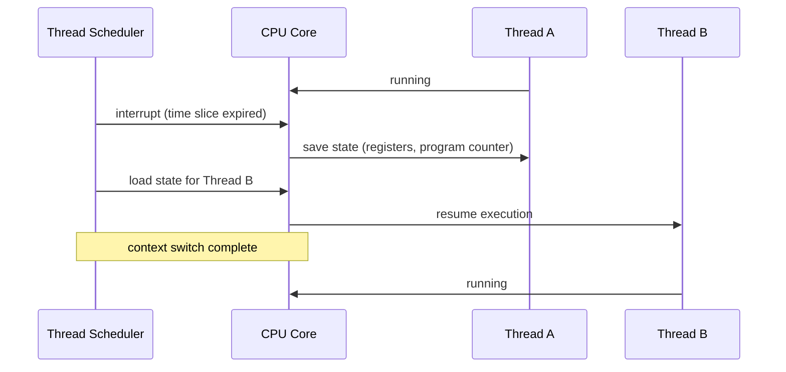
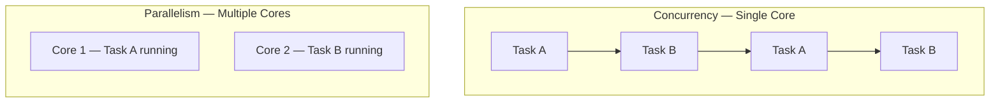
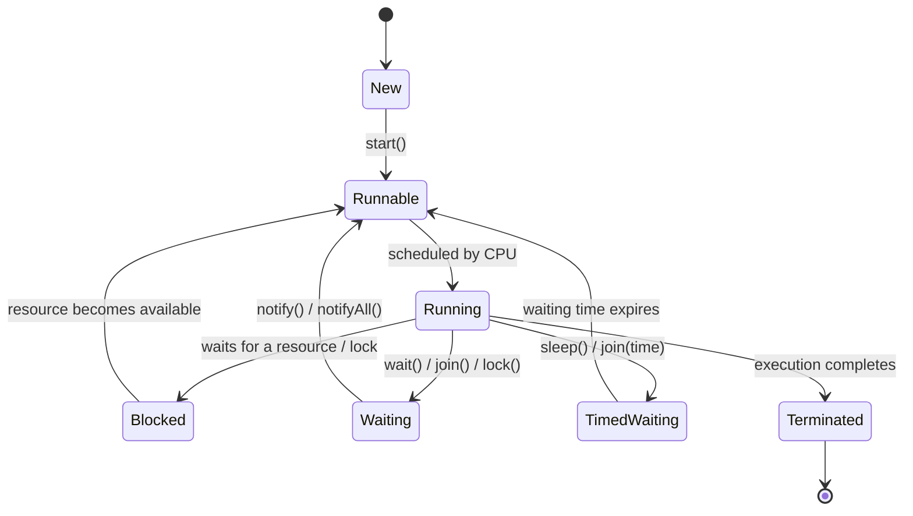

# Multithreading & Concurrency Basics

## Why This Matters

In modern software development, performance and efficiency are essential. Imagine you're using a video streaming platform like Netflix. When you hit play on a video, two important tasks happen: loading the video data and buffering the content. If each task takes 5 seconds, you'll be waiting for a total of 10 seconds before you can watch your video. But what if these tasks could happen at the same time? Instead of waiting 10 seconds, you could reduce the total time to just 5 seconds, drastically improving your user experience.

**Real-life analogy.** Think of a restaurant kitchen where multiple chefs are working on different tasks — one chopping vegetables, another cooking, and another plating the food. Instead of waiting for one chef to finish their task before the next can begin, all tasks happen in parallel. This parallel work speeds up the process and leads to better overall efficiency.

This principle of performing multiple tasks at the same time, without unnecessary delays, is crucial in today's applications. Whether it's a web server handling hundreds of requests or a mobile app providing real-time updates, understanding how to execute tasks efficiently is the key to building fast, responsive systems. But how do we make this possible in software development? That's where concepts like multithreading and concurrency come in — and learning how to leverage them is essential for any developer.

<div style="border-left:4px solid #195045;background:rgba(25,80,69,0.08);padding:0.6rem 1rem;border-radius:0 0.5rem 0.5rem 0;margin:1.25rem 0">

💡 **Insight.** Run two 5-second tasks one after another and you wait 10 seconds. Run them at the same time and the total drops to 5 seconds — that gap is the entire reason multithreading and concurrency exist.

</div>

## Program, Process and Thread

In software development, we often come across the terms program, process, and thread. While they may seem similar at first glance, they represent different concepts that are crucial to understanding how computers execute tasks. To make it easier to grasp, let's first start with a real-world analogy.

**Real-life analogy.** Imagine you're running a bakery. Here's how we can relate the terms program, process, and thread:

- **Program:** Think of a recipe book. A recipe book is a collection of instructions, but it doesn't do anything on its own. It's just a set of written plans for making different types of cakes, bread, etc. The recipe book is like a program: a static set of instructions to be followed.
- **Process:** Now, imagine you decide to bake a cake. You pick a recipe from the book and follow the instructions. The baking process is the process: it's the execution of the recipe (the program) in action. A process is a running instance of a program, actively working in memory.
- **Thread:** Inside your bakery, there may be multiple bakers working at the same time. One might be mixing ingredients, another might be preheating the oven, and another might be icing the cake. Each baker represents a thread: a smaller task within the overall process. Multiple threads can run concurrently, each handling part of the job.

### Program

A program is a collection of instructions written in a programming language that is intended to perform a specific task or solve a particular problem. It's like the recipe book mentioned earlier — static, not doing anything until it is run.

Example: If you download chrome.exe from the internet, chrome.exe is a program. It's just a file sitting on your computer. It contains instructions on how to launch and interact with Google Chrome, but it's not doing anything until you run it.

### Process

A process is an instance of a program that is being executed. When you launch a program (like opening chrome.exe), it gets loaded into memory and starts running. This running instance is called a process. A process includes the program code, current activity, and other resources like memory, CPU usage, and input/output.

Example: Continuing with the chrome.exe example, once you double-click on the Chrome icon to launch the browser, a process is created. The program code in chrome.exe is now running in memory as a process, using system resources like memory and CPU time.

**Key points.**

- Each process has its own address space.
- Runs independently from other processes.
- Can execute without interfering unless allowed (e.g., inter-process communication).
- Managed by the operating system, ensuring it gets the necessary resources.

### Thread

A thread is the smallest unit of execution within a process. A process can contain multiple threads, which share the same resources but run independently. Each thread can perform a separate task within the same process. Threads allow for parallelism, where multiple tasks are executed simultaneously.

Example: Within the chrome.exe process, there might be several threads running concurrently. For instance, one thread might be responsible for rendering the UI (user interface), another for managing network requests, and another for handling user inputs like clicks or key presses. These threads all operate within the chrome.exe process but perform different tasks at the same time.

**Key points.**

- Threads are referred to as "lightweight" processes.
- They share resources like memory and CPU time with other threads in the same process.
- Threads within the same process share memory, allowing them to communicate more easily than separate processes.

### Why Understanding These Concepts Matters

- **Program:** Understanding the program is essential for writing efficient code that can be turned into a process.
- **Process:** Processes allow us to execute programs, but they come with limitations like memory and resource allocation, which is why understanding how processes are managed is crucial for optimizing applications.
- **Thread:** Threads are at the heart of performance optimization. By breaking a process into multiple threads, we can perform tasks concurrently, speeding up execution and improving user experience.

```d2
program: "Program\n(chrome.exe on disk)" { shape: rectangle }
process: "Process\n(chrome.exe running)" {
  thread1: "Thread — UI rendering" { shape: rectangle }
  thread2: "Thread — network requests" { shape: rectangle }
  thread3: "Thread — input handling" { shape: rectangle }
}
program -> process: "run"
```

## Cores in CPU

A core in a CPU (Central Processing Unit) is a physical processing unit capable of executing instructions. Modern CPUs often have multiple cores, allowing them to handle several tasks simultaneously.

Each core can independently execute a thread, meaning more cores lead to the ability to run more threads concurrently, thus improving performance and speed.

**Real-life analogy.** CPU cores are like workers in an office: imagine a company with a group of workers (cores). Each worker can independently complete their tasks (execute threads). If the company has more workers, it can handle more tasks simultaneously, making the overall workflow faster. Similarly, a single-core CPU is like having only one worker handling all tasks one by one, while a multi-core CPU is like having several workers who can work on different tasks at the same time.

### Significance of Understanding Cores in CPU

- **Performance:** More cores mean more tasks can be processed simultaneously, which speeds up overall performance. For tasks like video editing, gaming, or data analysis, having multiple cores can lead to smoother experiences.
- **Parallelism:** Cores allow for parallel execution of threads, which is crucial for multi-threaded applications. Tasks like web browsing, running multiple apps, or handling server requests benefit from having multiple cores.
- **Energy efficiency:** Modern CPUs are designed to manage power more efficiently. Multiple cores allow a CPU to divide work, enabling it to complete tasks more efficiently, thus consuming less power.
- **Scaling applications:** Understanding the number of cores helps optimize software, especially for multi-threaded programs. You can write programs that take advantage of all available cores, resulting in better performance and responsiveness.

## Hyperthreading

Hyperthreading is a technology developed by Intel that allows a single physical core to act as two logical cores. It enables one core to run two threads simultaneously, effectively doubling the number of threads the CPU can handle.

**Real-life analogy.** If a worker could perform two tasks at once, they would complete more work without needing additional workers.

```d2
cpu: "CPU" {
  core1: "Core 1" { shape: rectangle }
}
```

```d2
cpu: "CPU" {
  core1: "Core 1" { shape: rectangle }
  core2: "Core 2" { shape: rectangle }
  core3: "Core 3" { shape: rectangle }
  core4: "Core 4" { shape: rectangle }
}
```

```d2
cpu: "CPU" {
  core1: "Physical Core 1" {
    logical1: "Logical Core A — Thread 1" { shape: rectangle }
    logical2: "Logical Core B — Thread 2" { shape: rectangle }
  }
}
```

### Intelligent Time Slicing

In Hyperthreading, each logical core (created by the physical core) takes turns executing tasks. Time slicing refers to dividing the core's time between multiple threads, ensuring both threads get execution time without wasting resources. This is done intelligently, so when one thread is waiting for data or performing a slower operation (like I/O), the other thread can continue executing, making better use of the core's resources.

### Resource Sharing

Both threads running on a single physical core share resources like the cache, execution units, and memory bandwidth. Although the two threads are executing on the same core, the resources are distributed in such a way that performance is enhanced without needing additional physical cores.

<div style="border-left:4px solid #da5233;background:rgba(218,82,51,0.08);padding:0.6rem 1rem;border-radius:0 0.5rem 0.5rem 0;margin:1.25rem 0">

⚠️ **Watch out.** Hyperthreading's two logical cores are not two real cores — they still share one physical core's cache and execution units. The gain is real, but smaller than adding an actual second core.

</div>

### Benefits of Hyperthreading

- **Better resource utilization:** Reduces idle time of cores by allowing two threads to run concurrently on the same core.
- **Enhanced multitasking:** Improves performance for applications designed to take advantage of it by keeping the core busy and minimizing wasted cycles.

## Context Switching

Context switching is the process of storing and restoring the state (or context) of a thread or process so that it can be resumed later. This allows the CPU to switch between different tasks or threads without interrupting their execution entirely, giving the illusion of parallelism, even on a single-core system.

**Real-life analogy.** Think of context switching like a chef in a kitchen who is working on multiple dishes: the chef is cooking a soup and suddenly needs to check on the roast in the oven. To do this, they stop stirring the soup (save its current state), go to check the roast, and then return to the soup (restore the saved state) once the roast is done. The chef switches between tasks, saving the current state of one dish while working on another, and then returns to the previous dish without losing progress.

### How Does Context Switching Happen?

For the context switch to execute, the following steps are executed in order:

1. **Interrupt:** A context switch happens when a running thread is interrupted by the operating system or when a higher-priority thread needs to be executed.
2. **Save state:** The state (such as registers, program counter, and other vital data) of the current thread is saved to memory, so that it can be resumed from the exact point it was paused.
3. **Load state:** The state of the next thread or process to be executed is loaded from memory, allowing the CPU to pick up where that thread left off.
4. **Switch execution:** The CPU starts executing the new thread, continuing from where it was last stopped, and the process repeats when a new thread is scheduled.



### Importance of Context Switching

- **Multitasking:** Allows multiple threads or processes to run "concurrently" on a single core by switching between them rapidly.
- **Resource management:** Ensures that no single task hogs the CPU, allowing better distribution of resources.
- **Efficiency:** Context switching enables the CPU to remain busy, optimizing performance even when handling multiple tasks.

### Thread Scheduler

The thread scheduler is the part of the operating system that manages context switching. It decides when a thread should be paused and another should be run. The scheduler ensures efficient utilization of CPU resources, balancing the workload and giving the CPU time to execute multiple tasks. It uses scheduling algorithms (like round-robin, priority-based scheduling, etc.) to determine which thread should run next, triggering a context switch as necessary.

### Performance Considerations

- **Task scheduler overhead:** The task scheduler takes time to load and save the states of threads during context switching, which can add overhead to the system.
- **Decreased performance:** As the number of threads increases, the time spent on context switching can grow significantly, leading to a performance degradation due to the extra CPU cycles spent on switching rather than executing tasks.

<div style="border-left:4px solid #da5233;background:rgba(218,82,51,0.08);padding:0.6rem 1rem;border-radius:0 0.5rem 0.5rem 0;margin:1.25rem 0">

⚠️ **Watch out.** More threads isn't automatically faster. Past a point, the CPU spends more cycles switching between threads than actually executing them.

</div>

## Multithreading

Multithreading is a programming technique that allows a CPU to execute multiple threads concurrently, with each thread being the smallest unit of a process. It enables a program to perform more than one task at a time within the same process.

Instead of executing one task after another, multithreading allows the CPU to switch between tasks quickly, creating the illusion that multiple tasks are being performed simultaneously.

In simpler terms, multithreading breaks a program into smaller parts (threads) that can run in parallel. Each thread runs independently, but they share the same memory space, which allows them to communicate with each other and work together.

### Significance of Multithreading

- **Better performance:** Multithreading allows tasks to run concurrently, improving overall performance by executing multiple tasks at once, like reading files and processing data in parallel.
- **Non-blocking nature:** Threads don't need to wait for each other, allowing non-blocking behavior. For example, one thread can process data while another waits for I/O operations like database queries.
- **Resource sharing:** Threads within the same process share memory and data, reducing overhead and allowing faster communication between threads, making them more efficient than separate processes.
- **Scalability in backend services:** Multithreading helps scale backend services by handling multiple requests simultaneously, improving throughput and response time, especially in high-traffic applications.
- **Responsiveness in UI applications:** Multithreading offloads time-consuming tasks to background threads, keeping the main thread free to respond to user actions, improving UI responsiveness.
- **Efficient CPU utilization:** On multi-core processors, multithreading uses all cores, ensuring better CPU utilization and faster task execution.
- **Real-time processing:** For real-time applications like gaming or video streaming, multithreading processes different data parts in parallel, reducing latency and ensuring smooth performance.

## Concurrency vs. Parallelism

Learners often confuse concurrency and parallelism, considering them to be the same. However, it's important to understand the difference between the two as they represent different approaches to task execution in computing.

<div style="border-left:4px solid #15448e;background:rgba(21,68,142,0.08);padding:0.6rem 1rem;border-radius:0 0.5rem 0.5rem 0;margin:1.25rem 0">

📘 **Definition.** Concurrency is about managing multiple tasks over time — it can happen on a single core. Parallelism is genuinely simultaneous execution — it needs multiple cores.

</div>



| Concurrency | Parallelism |
| --- | --- |
| It involves managing multiple tasks over time, but not necessarily at the same time. | It is the simultaneous execution of tasks, usually across multiple cores or processors. |
| It can run on a single core by switching between tasks rapidly. | It requires multiple cores or processors for true simultaneous execution. |
| In concurrency, tasks appear to run together, managed by efficient context switching. | In parallelism, tasks run at the same time, with no context switching required. |
| It focuses on how to manage and interleave multiple tasks. | It focuses on executing tasks simultaneously to reduce completion time. |

## Process vs. Thread

The terms process and thread are often confused by learners, but they represent two distinct concepts. Understanding the differences between the two is crucial for efficient software development. Let's break down the key distinctions between a process and a thread:

| Process | Thread |
| --- | --- |
| An independent program in execution, with its own resources and execution context. | A sub-unit or a lightweight part of a process, responsible for executing specific tasks within the process. |
| Each process has its own dedicated memory space, isolated from others. | Threads within the same process share memory, allowing for efficient communication. |
| Processes are fully isolated from each other, ensuring that one process cannot directly interfere with another. | Threads are not isolated; they can directly communicate and share data with other threads in the same process. |
| Communication between processes (e.g., Inter-Process Communication or IPC) is more complex and requires mechanisms like sockets or shared files. | Communication between threads is simple as they share the same memory space, making data sharing efficient. |
| Processes are considered "heavyweight" due to the substantial overhead involved in creation, execution, and switching. | Threads are "lightweight," requiring minimal overhead for creation and context switching. |
| A crash in one process generally does not affect others because each process runs in its own isolated memory space. | A crash in one thread can potentially affect other threads within the same process since they share the same resources. |
| **Example.** A database instance like PostgreSQL, where each instance runs as a separate process. | **Example.** Individual tabs in a Chrome browser, where each tab is a thread within the browser process. |

To summarize, processes are more isolated and independent, while threads are lighter, faster, and more interconnected. The choice between using a process or a thread depends on the requirements of the application, whether you need isolation and robustness (processes) or lightweight multitasking and shared resources (threads).

```d2
processA: "Process A" {
  memA: "Memory Space A" { shape: rectangle }
  t1: "Thread 1" { shape: rectangle }
  t2: "Thread 2" { shape: rectangle }
  t1 -> memA: "shares"
  t2 -> memA: "shares"
}
processB: "Process B" {
  memB: "Memory Space B" { shape: rectangle }
  t3: "Thread 1" { shape: rectangle }
  t4: "Thread 2" { shape: rectangle }
  t3 -> memB: "shares"
  t4 -> memB: "shares"
}
processA -> processB: "isolated — no direct access"
```

## Shared Memory vs. Isolated Memory

This is the same underlying picture as the process/thread diagram above, viewed from the memory side: threads inside one process share that process's memory (shared memory); separate processes each get their own, walled off from each other (isolated memory).

In computing, memory plays a critical role in how processes and threads interact with each other. One key distinction in memory management is between shared memory and isolated memory. Understanding these two concepts is important for managing how data is accessed and how processes or threads communicate.

| Shared Memory | Isolated Memory |
| --- | --- |
| Memory that is accessible by multiple processes or threads, allowing them to share data and communicate efficiently. | Memory that is dedicated to a single process or thread, isolated from other processes or threads to prevent direct access. |
| Commonly used in multi-threaded applications where threads need to share data quickly and efficiently. | Used in scenarios where processes need to operate independently, with each process having its own private memory space. |
| Enables fast inter-process or inter-thread communication, as data is directly accessible to all relevant entities. | Requires explicit mechanisms (e.g., Inter-Process Communication) for communication between processes, which may involve more complexity and overhead. |
| Potential risks of data corruption or race conditions, especially when multiple threads or processes access the shared memory simultaneously. | Since the memory is isolated, there's less risk of data corruption from other processes or threads, but communication can be slower and more complex. |
| Often used in multi-threaded applications, memory-mapped files, or shared memory regions in operating systems. | Common in processes with independent execution contexts, where memory isolation is needed for stability and security (e.g., web browsers, database processes). |
| **Example.** A multi-threaded video processing application where different threads need to access and modify the same image data. | **Example.** Two independent processes such as a word processor and a web browser, where each has its own memory space and cannot access each other's memory directly. |

In summary, shared memory enables efficient communication and data sharing between threads and processes but comes with the challenge of ensuring synchronization and avoiding race conditions. On the other hand, isolated memory offers better security and stability by preventing direct access between processes but requires more complex communication mechanisms.

## When to Use Thread and Process

In software development, choosing between using a thread or a process for executing tasks depends on the specific requirements of the application. Both threads and processes have distinct characteristics, and selecting the appropriate one can greatly affect the performance, reliability, and scalability of the system. Below are the guidelines for when to use each:

### When to Use a Thread

- **Tasks need to share data:** Threads share memory, making it easy to exchange data quickly and efficiently within the same process.
- **Low overhead is important:** Threads are lightweight, with minimal overhead compared to processes, offering faster context switching.
- **Tasks are part of the same logic:** Threads work best when tasks are closely related and need to run concurrently, such as in web servers or video rendering.
- **High performance needed:** Threads are ideal for high-performance applications, utilizing multiple CPU cores for concurrent execution.
- **Tightly coupled behavior:** Threads are suitable for tasks that are highly dependent on each other and need frequent communication.
- **Responsiveness is key:** Threads ensure the main task remains responsive by offloading time-consuming tasks to background threads.

### When to Use a Process

- **Tasks require isolation:** Processes run independently, with isolated memory, ensuring that tasks don't interfere with each other.
- **One crash shouldn't affect others:** A crash in one process won't affect others, providing better error isolation.
- **Security boundaries needed:** Processes offer strong isolation for security, preventing direct access to memory and ensuring data privacy.
- **Different tech stack:** Processes are suitable for tasks using different technology stacks or runtimes, as they run independently.
- **Resource limits needed:** Processes are useful when specific resource limits (e.g., CPU, memory) are required for tasks.
- **Used by different users:** Processes provide isolation and security when tasks need to be executed by different users.

<div style="border-left:4px solid #195045;background:rgba(25,80,69,0.08);padding:0.6rem 1rem;border-radius:0 0.5rem 0.5rem 0;margin:1.25rem 0">

💡 **Insight.** Choose threads when tasks need to share data, have low overhead, and are tightly coupled, such as in high-performance applications. Choose processes when isolation, security, and fault tolerance are crucial, especially when tasks need to run independently or use different resources.

</div>

## Fault Tolerance

Fault tolerance refers to the ability of a system to continue functioning correctly even in the presence of faults or failures. In other words, fault tolerance ensures that the system can handle unexpected situations (such as hardware failures, software crashes, or network issues) without disrupting the service. It involves designing systems in a way that prevents a single failure from causing the entire system to collapse.

**Real-life analogy.** Think of fault tolerance as a redundant system in an airplane. An airplane is equipped with multiple engines and backup systems. If one engine fails, the other engines can continue to power the plane, ensuring a safe flight. Similarly, fault-tolerant systems are designed with redundancy — if one component fails, backup components or mechanisms automatically take over, keeping the system running without interruption.

**Key points.**

- **Redundancy:** Fault tolerance often relies on redundancy — having backup systems or components that can take over in case of failure. This can include duplicate hardware, backup power supplies, or mirrored data storage.
- **Error detection and correction:** Fault-tolerant systems can detect errors in real-time and correct them, ensuring that operations continue without interruption. Techniques such as checksums, parity bits, and error-correcting codes are used to detect and fix errors in data transmission.
- **Graceful degradation:** A fault-tolerant system may degrade its performance in the event of a failure but continue to function. For example, if a server fails, a web application may route traffic to a backup server, reducing the impact on users.
- **Automatic recovery:** Many fault-tolerant systems have mechanisms for automatic recovery, where failed components are detected, and the system either restarts them or redirects the workload to functioning components without manual intervention.

## Isolation

Isolation in computing refers to the separation of tasks, processes, or environments so that they do not interfere with each other. It ensures that the failure or malfunction of one part of the system does not affect other parts. Isolation is essential in multi-user or multi-tasking systems to protect resources and maintain security and stability.

**Real-life analogy.** Consider separate rooms in a hotel. Each room has its own lock and is isolated from others, so any issues in one room (e.g., a plumbing leak) do not affect the other rooms. Similarly, in computing, processes or tasks in isolated environments do not interfere with each other, providing security and stability.

**Key points.**

- **Memory separation:** Isolation ensures that different tasks or processes operate within their own distinct memory space. This prevents one task from accessing or modifying the memory of another, ensuring that processes are independent and secure.
- **Failure containment:** When a failure occurs in one process or task, isolation ensures that it does not affect others. If one component crashes, it is contained within its own isolated environment, preventing system-wide disruptions.
- **Security boundaries:** Isolation creates clear security boundaries between processes, preventing unauthorized access. For example, in multi-user systems, isolation ensures that one user cannot access or alter another user's data, maintaining privacy and integrity.
- **Predictable behavior:** By isolating tasks and processes, systems exhibit more predictable behavior. Since each process or task is isolated, developers can rely on their expected performance and avoid interference from other parts of the system.

## Summary

- A **program** is static instructions; a **process** is that program in execution, with its own memory; a **thread** is the smallest unit of execution inside a process, sharing that process's memory with its sibling threads.
- More **cores** let more threads genuinely run at once. **Hyperthreading** lets one physical core juggle two logical threads, but they still share that core's execution resources — it's not the same as a second real core.
- **Context switching** is how a single core fakes running many threads at once. The **thread scheduler** decides who runs next, and every switch costs a little overhead — more threads isn't automatically faster.
- **Concurrency** is managing multiple tasks over time (possible on a single core); **parallelism** is genuinely simultaneous execution (needs multiple cores).
- Reach for a **thread** when tasks share data and need to be fast and tightly coupled. Reach for a **process** when you need isolation, security, or fault tolerance.


## Creating and Managing Threads

In many real-world applications, tasks are performed sequentially, where one task must be completed before the next one begins. While this approach is simple, it may not always be the most efficient, especially when tasks take time to complete. In this article, we will explore how multithreading can help optimize such scenarios by allowing multiple tasks to run concurrently, improving efficiency.

Let's explore a simple problem where multiple operations need to be executed sequentially, each taking a certain amount of time to complete.

### Problem Statement

Imagine you've placed an order, and the next steps involve sending three notifications:

- **Send an SMS:** This takes 2 seconds.
- **Send an Email:** This takes 3 seconds.
- **Send ETA (Estimated Time of Arrival):** This takes 5 seconds.

To simulate these delays in Java, we will use the Thread.sleep() from the java.lang.

Let's look at the code that tries to solve this problem, performing the tasks in a sequential manner (without using Multithreading).

### Code Simulating Delays Sequentially Without Multithreading

```java
import java.util.*;

// OrderService class
class OrderService {

    // Main method simulates placing an order and executing tasks sequentially
    public static void main(String[] args) throws InterruptedException {
        System.out.println("Placing order...\n");

        // Send SMS and simulate the delay of 2 seconds
        sendSMS();
        System.out.println("Task 1 done.\n");

        // Send Email and simulate the delay of 3 seconds
        sendEmail();
        System.out.println("Task 2 done.\n");

        // Calculate ETA (Estimated Time of Arrival) with a delay of 5 seconds
        String eta = calculateETA();
        System.out.println("Order placed. Estimated Time of Arrival: " + eta);
        System.out.println("Task 3 done.\n");
    }

    // Method to simulate sending SMS with a 2-second delay
    private static void sendSMS() {
        try{
            Thread.sleep(2000); // Delay of 2 seconds
            System.out.println("SMS Sent!");
        }
        catch (InterruptedException e) {
            e.printStackTrace();
        }
    }

    // Method to simulate sending Email with a 3-second delay
    private static void sendEmail(){
        try{
            Thread.sleep(3000); // Delay of 3 seconds
            System.out.println("Email Sent!");
        }
        catch (InterruptedException e) {
            e.printStackTrace();
        }
    }

    // Method to simulate calculating the ETA with a 5-second delay
    private static String calculateETA() {
        try {
            Thread.sleep(5000); // Delay of 5 seconds
        }
        catch (InterruptedException e) {
            e.printStackTrace();
        }

        return "25 minutes"; // Returning the calculated ETA
    }
}

// Main class
class Main {

    public static void main(String[] args) {
        // Initiating the order processing by calling the OrderService main method
        try {
            OrderService.main(args); // Call the OrderService's main method
        } catch (InterruptedException e) {
            e.printStackTrace();
        }
    }
}
```

### Understanding the Issue

In real-world applications, executing tasks sequentially like this can lead to significant inefficiencies, especially when tasks involve waiting periods, such as sending SMS, emails, or calculating ETAs. In our current approach, each operation must complete before the next one begins, causing unnecessary delays and making the system slower than it needs to be.

For instance, while waiting for an SMS to be sent, the program is effectively "idle", unable to do anything else. This results in wasted time, especially in systems where responsiveness and speed are critical. By running tasks sequentially, we also limit the system's ability to handle multiple operations concurrently, which can lead to poor user experiences, slower processing times, and bottlenecks in performance.

This is where multithreading comes into play. By executing tasks concurrently, we can ensure that while one task is waiting (like sending an SMS), others can proceed without delay. Instead of idly waiting for each operation to finish, multithreading allows the system to be more responsive, efficiently utilizing time and resources. In the next section, we will explore how multithreading can help overcome these issues, making the system more efficient and responsive.

### Implementing Multithreading by Extending the Thread Class

In Java, multithreading can be implemented using many different ways. One such way is by creating a subclass of the Thread class and overriding the run() method. Each thread will execute the run() method, allowing concurrent execution of tasks.

#### Key Concepts

- **Thread Class:** The Thread class is used to represent a thread in Java. By extending the Thread class, we can override its run() method to specify the operations or actions that the thread will perform. In other words, the run() method contains the code that defines what the thread will do when it is executed.
- **start() method:** This method is used to start a new thread of execution. It internally calls the run() method.
- **join() method:** This method makes the main thread wait for the thread to finish before proceeding.

#### Code

```java
import java.util.*;

// Creating a subclass of Thread to send SMS
class SMSThread extends Thread {
    public void run() {
        try {
            Thread.sleep(2000); // 2-second delay for SMS
            System.out.println("SMS Sent using Thread.");
        } catch(InterruptedException e) {
            e.printStackTrace();
        }
    }
}

// Creating a subclass of Thread to send Email
class EmailThread extends Thread {
    public void run() {
        try {
            Thread.sleep(3000); // 3-second delay for Email
            System.out.println("Email Sent using Thread.");
        } catch(InterruptedException e) {
            e.printStackTrace();
        }
    }
}

// Creating a subclass of Thread to calculate ETA
class ETACalculationThread extends Thread {
    public void run() {
        try {
            Thread.sleep(5000); // 5-second delay for ETA calculation
            System.out.println("ETA Calculated using Thread. Estimated Time: 25 minutes.");
        } catch(InterruptedException e) {
            e.printStackTrace();
        }
    }
}

class Main {
    public static void main(String[] args) {
        // Create thread objects for SMS, Email, and ETA Calculation
        SMSThread smsThread = new SMSThread();
        EmailThread emailThread = new EmailThread();
        ETACalculationThread etaThread = new ETACalculationThread();

        System.out.println("Task Started.\n");

        // Start all threads
        smsThread.start();
        System.out.println("Task 1 ongoing...");

        emailThread.start();
        System.out.println("Task 2 ongoing...");

        etaThread.start();
        System.out.println("Task 3 ongoing...");

        // Wait for all threads to finish
        try {
            smsThread.join();
            emailThread.join();
            etaThread.join();
            System.out.println("All tasks completed.");
        } catch (InterruptedException e) {
            e.printStackTrace();
        }
    }
}
```

#### Explanation

- The SMSThread, EmailThread and ETACalculationThread classes extend Thread and override the run() method to simulate sending SMS and Email with a delay.
- The start() method initiates the execution of each thread.
- join() ensures the main thread waits for both SMS and Email tasks to finish before continuing.

The above code demonstrates three concurrent tasks: sending an SMS, sending an email, and calculating the ETA, each using a separate thread by extending the Thread class.

#### Demerit: No Return Type in the run() Method

<div style="border-left:4px solid #da5233;background:rgba(218,82,51,0.08);padding:0.6rem 1rem;border-radius:0 0.5rem 0.5rem 0;margin:1.25rem 0">

⚠️ **Watch out.** A limitation of the Thread class in Java is that the run() method cannot return a value (because it's void). This means that if you need to return a result, like an ETA string, you cannot directly do so from the run() method.

</div>

This is a key drawback of using the Thread class for tasks that require returning values.

Note: The methods to get a result from a thread is discussed in the later part of the article.

### Implementing Multithreading by Using the Runnable Interface

In Java, another way to implement multithreading is by using the Runnable interface. Unlike the Thread class approach, where we extend Thread, the Runnable interface allows us to define a task that can be executed by multiple threads. The Runnable interface represents a task that can be executed concurrently, but it does not manage the thread itself. We need to pass it to a Thread object for execution.

#### Key Concepts

- **Runnable Interface:** The Runnable interface is a functional interface that contains a single method, run(). By implementing this interface, we can define the task to be executed by a thread. The run() method contains the code that will be executed concurrently.
- **run() Method:** Unlike the Thread class, where we override run() directly, in this case, we provide the task's code by implementing the run() method of the Runnable interface.
- **Thread Class:** While Runnable defines the task, the actual thread of execution is created by passing the Runnable object to a Thread object. The Thread class is responsible for managing and executing the thread.
- **start() Method:** The start() method is used to begin the thread's execution. It internally calls the run() method.
- **join() Method:** Similar to the Thread class, join() is used to ensure that the main thread waits for the other threads to finish before continuing.

#### Code

```java
import java.util.*;

// Implementing the Runnable interface for sending SMS
class SMSTask implements Runnable {
    public void run() {
        try {
            Thread.sleep(2000); // 2-second delay for SMS
            System.out.println("SMS Sent using Runnable.");
        } catch (InterruptedException e) {
            e.printStackTrace();
        }
    }
}

// Implementing the Runnable interface for sending Email
class EmailTask implements Runnable {
    public void run() {
        try {
            Thread.sleep(3000); // 3-second delay for Email
            System.out.println("Email Sent using Runnable.");
        } catch (InterruptedException e) {
            e.printStackTrace();
        }
    }
}

// Implementing the Runnable interface for calculating ETA
class ETATask implements Runnable {
    public void run() {
        try {
            Thread.sleep(5000); // 5-second delay for ETA calculation
            System.out.println("ETA Calculated using Runnable. Estimated Time: 25 minutes.");
        } catch (InterruptedException e) {
            e.printStackTrace();
        }
    }
}

class Main {
    public static void main(String[] args) {
        // Create Runnable objects for SMS, Email, and ETA calculation
        SMSTask smsTask = new SMSTask();
        EmailTask emailTask = new EmailTask();
        ETATask etaTask = new ETATask();

        // Create Thread objects and pass the Runnable tasks to them
        Thread smsThread = new Thread(smsTask);
        Thread emailThread = new Thread(emailTask);
        Thread etaThread = new Thread(etaTask);

        System.out.println("Task Started.\n");

        // Start all threads
        smsThread.start();
        System.out.println("Task 1 ongoing...");

        emailThread.start();
        System.out.println("Task 2 ongoing...");

        etaThread.start();
        System.out.println("Task 3 ongoing...");

        // Wait for all threads to finish
        try {
            smsThread.join();
            emailThread.join();
            etaThread.join();
            System.out.println("All tasks completed.");
        } catch (InterruptedException e) {
            e.printStackTrace();
        }
    }
}
```

#### Explanation

- **Runnable Interface:** Each task (SMS, Email, ETA calculation) is represented by a class implementing the Runnable interface. The run() method defines the task's behavior.
- **Thread Creation:** Instead of subclassing Thread, we create instances of Thread and pass a Runnable object to the constructor. The Thread class is responsible for managing and executing the task defined in the run() method.
- **Thread Execution:** The start() method begins the execution of the thread, invoking the run() method in a separate thread of execution. The join() method ensures the main thread waits for all tasks to finish before printing "All tasks completed."

The above code demonstrates three concurrent tasks: sending an SMS, sending an email, and calculating the ETA, each using a separate thread by implementing the Runnable interface.

#### Advantages of Using Runnable

- **Separation of Concerns:** By using Runnable, we separate the task logic from the thread management. This is particularly useful when you need to share the same task between multiple threads.
- **Flexibility:** Since Runnable can be passed to any Thread object, it provides more flexibility compared to extending the Thread class. You can implement multiple interfaces along with Runnable, whereas extending Thread limits you to just the Thread class.

#### Demerit: No Return Type in the run() Method

A limitation of the Runnable interface in Java is that the run() method cannot return a value (because it's void). This means that if you need to return a result, like an ETA string, you cannot directly do so from the run() method.

This is a key drawback of using the Runnable interface for tasks that require returning values.

### Fire and Forget: A Pattern in Multithreading

Both the Runnable interface and the Thread class, as discussed, naturally follow the Fire and Forget pattern.

In this pattern, tasks are initiated (fired), but the system doesn't wait for a result or confirmation of their completion. Instead, the tasks are executed independently in the background, and the caller doesn't need to know when or how they finish.

This approach works well when the result of the task is not critical or when tasks do not need to communicate their results back to the main thread. For instance, sending SMS, emails, or calculating an ETA can be handled using the Runnable method without waiting for confirmation of completion.

However, while the Runnable method is great for many cases, it does have limitations, especially when the result of the task is needed. This is where the Callable interface comes into play. In the next section, we will explore how to use Callable to handle tasks that require returning results.

### Implementing Multithreading by Using the Callable Interface and Future

In Java, the Callable interface provides an enhanced way to implement multithreading when you need tasks to return a result. Unlike the previously discussed methods, which do not return any result, Callable allows the thread to return a value once the task completes. However, since the run() method of Runnable cannot return a result (it's void), the Callable interface provides a call() method, which can return any type of value.

In addition, Future is an interface that represents the result of an asynchronous computation. It provides methods to check the status of a task and retrieve the result once it's available, thus allowing you to avoid the limitations of the Thread and Runnable approaches.

#### Key Concepts

- **Callable Interface:** The Callable interface is similar to Runnable, but its call() method is designed to return a result, unlike run(). It also allows for throwing exceptions, which is useful for more complex tasks.
- **call() Method:** The call() method in the Callable interface contains the code for the task and can return any value (unlike run() in Runnable). It also allows the task to throw checked exceptions.
- **ExecutorService:** While you can directly use Thread with Callable, it's recommended to use ExecutorService for better thread management. The ExecutorService provides a method called submit() to submit a Callable task and returns a Future object that can be used to retrieve the result later.

#### Code

```java
import java.util.concurrent.*;

// Implementing Callable to calculate ETA (only this task requires a return value)
class ETACalculationTask implements Callable<String> {
    public String call() throws InterruptedException {
        Thread.sleep(5000); // Simulate 5-second delay for ETA calculation
        System.out.println("Calculation ETA using Callable.");
        return "ETA: 25 minutes"; // Return the ETA result
    }
}

// Implementing Runnable to send SMS (no return value required)
class SMSTask implements Runnable {
    public void run() {
        try {
            Thread.sleep(2000); // Simulate 2-second delay for SMS
            System.out.println("SMS Sent using Runnable.");
        } catch (InterruptedException e) {
            e.printStackTrace();
        }
    }
}

// Implementing Runnable to send Email (no return value required)
class EmailTask implements Runnable {
    public void run() {
        try {
            Thread.sleep(3000); // Simulate 3-second delay for Email
            System.out.println("Email Sent using Runnable.");
        } catch (InterruptedException e) {
            e.printStackTrace();
        }
    }
}

class Main {
    public static void main(String[] args) {
        // Create ExecutorService to manage threads
        ExecutorService executorService = Executors.newFixedThreadPool(3);

        // Create Callable task for ETA calculation and Runnable tasks for SMS and Email
        SMSTask smsTask = new SMSTask();
        EmailTask emailTask = new EmailTask();
        ETACalculationTask etaTask = new ETACalculationTask();

        // Submit tasks and get Future objects for the ETA task
        Future<String> etaResult = executorService.submit(etaTask);

        // Submit the SMS and Email tasks (no result required)
        executorService.submit(smsTask);
        executorService.submit(emailTask);

        try {
            // Get the result from the Future object for ETA
            System.out.println(etaResult.get()); // Wait for ETA task to finish and print result
        } catch (InterruptedException | ExecutionException e) {
            e.printStackTrace();
        }

        // Shutdown the ExecutorService
        executorService.shutdown();
    }
}
```

#### Explanation

- **Runnable and Callable Tasks:** In this example, the SMS and Email tasks implement the Runnable interface because they only perform an action and do not return any value. The ETA calculation task implements the Callable interface because it needs to return the calculated ETA result.
- **Thread Management with ExecutorService:** We create an ExecutorService using Executors.newFixedThreadPool(3). This creates a thread pool with 3 worker threads, allowing the SMS, Email, and ETA tasks to run concurrently.
- **Submitting Tasks:** The submit() method is used to submit both Runnable and Callable tasks to the executor. The SMS and Email tasks are submitted as Runnable tasks, while the ETA task is submitted as a Callable task.
- **Result Retrieval with Future:** Since the ETA task returns a value, executorService.submit(etaTask) returns a Future<String>. We use the get() method on this Future object to wait for the ETA task to complete and retrieve its result.
- **Blocking Nature of get():** The etaResult.get() method blocks the main thread until the ETA calculation is completed. Once the ETA task finishes, the returned value is printed.
- **shutdown():** Finally, we call shutdown() on the ExecutorService. This prevents new tasks from being submitted and allows already submitted tasks to complete before the executor terminates.

### Using Future to Retrieve Results

When you submit a task using Callable, the ExecutorService returns a Future object. The Future interface provides methods to check the status of a task and retrieve its result once it completes.

#### Key Concepts

**Future Interface:** The Future interface represents the result of an asynchronous computation. You can use it to:

- **Retrieve the result:** The get() method blocks the main thread until the task completes and returns the result.
- **Check the status:** Methods like isDone() and isCancelled() help you check if the task is completed or canceled.
- **Cancel the task:** The cancel() method attempts to cancel the task before it finishes.

As shown in the code above, the result after the ETA Calculation is retrieved using the Future interface. Another method to retrieve results from Callable() is to use FutureTask.

### Using FutureTask to Retrieve Results

FutureTask is a concrete implementation of the Future interface. It is used to wrap a Callable task and execute it asynchronously. The benefit of using FutureTask is that it can be executed like a Runnable (i.e., passed to a Thread), and it can also store and return the result of the task.

#### Key Concepts

- **FutureTask Class:** It implements both Runnable and Future, making it a versatile tool for concurrent tasks. You can submit a FutureTask to a thread pool or execute it directly via a Thread.
- **get() Method:** Just like Future, FutureTask allows you to retrieve the result of the task via get().

#### Example Code: Using FutureTask for Retrieval

```java
import java.util.*;

// Implementing Callable to calculate ETA (only this task requires a return value)
class ETACalculationTask implements Callable<String> {
    public String call() throws InterruptedException {
        Thread.sleep(5000); // Simulate 5-second delay for ETA calculation
        System.out.println("ETA calculated using Callable.");
        return "ETA: 25 minutes"; // Return the ETA result
    }
}

// Implementing Runnable to send SMS (no return value required)
class SMSTask implements Runnable {
    public void run() {
        try {
            Thread.sleep(2000); // Simulate 2-second delay for SMS
            System.out.println("SMS Sent using Runnable.");
        } catch (InterruptedException e) {
            e.printStackTrace();
        }
    }
}

// Implementing Runnable to send Email (no return value required)
class EmailTask implements Runnable {
    public void run() {
        try {
            Thread.sleep(3000); // Simulate 3-second delay for Email
            System.out.println("Email Sent using Runnable.");
        } catch (InterruptedException e) {
            e.printStackTrace();
        }
    }
}

class Main {
    public static void main(String[] args) {
        // Create FutureTask object for ETA calculation task (since it returns a result)
        FutureTask<String> etaTask = new FutureTask<>(new ETACalculationTask());

        // Create Runnable tasks for SMS and Email
        SMSTask smsTask = new SMSTask();
        EmailTask emailTask = new EmailTask();

        // Create Thread objects to run all tasks
        Thread etaThread = new Thread(etaTask);
        Thread smsThread = new Thread(smsTask);
        Thread emailThread = new Thread(emailTask);

        System.out.println("Task Started.\n");

        // Start all threads
        etaThread.start();
        System.out.println("Task 1 ongoing...");

        smsThread.start();
        System.out.println("Task 2 ongoing...");

        emailThread.start();
        System.out.println("Task 3 ongoing...");

        try {
            // Get the result from the FutureTask for ETA
            System.out.println((String)etaTask.get()); // Wait for ETA task to finish and print result

            // Wait for SMS and Email tasks to finish (no result needed)
            smsThread.join();
            emailThread.join();
        } catch (InterruptedException | ExecutionException e) {
            e.printStackTrace();
        }

        System.out.println("All tasks completed.");
    }
}
```

### Other Ways to Implement Multithreading in Java

In addition to the methods we've discussed so far, there are other ways to implement multithreading in Java. These methods offer different levels of simplicity and flexibility, depending on the task at hand.

#### 1. Directly Defining a Runnable Instance

In Java, you don't always need to create a separate class to implement the Runnable interface. You can define a Runnable instance directly using an anonymous class or a simple lambda expression (discussed next). This is a concise and efficient way to handle simple tasks without needing an entire class structure.

Here's how you can define a Runnable directly:

```java
class Main {
    public static void main(String[] args) {
        // Define Runnable directly as an anonymous class
        Runnable task = new Runnable() {
            @Override
            public void run() {
                try {
                    Thread.sleep(2000); // Simulate delay
                    System.out.println("Task completed using direct Runnable.");
                } catch (InterruptedException e) {
                    e.printStackTrace();
                }
            }
        };

        // Create and start the thread
        Thread thread = new Thread(task);
        thread.start();
    }
}
```

In this example:

- The Runnable interface is implemented directly within the main method using an anonymous class.
- The run() method defines the task to be executed in the new thread.

This approach is particularly useful for short-lived tasks where you don't need to create a separate class.

#### 2. Using Lambda Expressions (Java 8 and Above)

With Java 8, the introduction of lambda expressions made it easier to write concise, functional-style code. Lambda expressions provide a cleaner and more readable way to define Runnable tasks without the boilerplate code of an anonymous class.

Here's how you can use a lambda expression to define a Runnable:

```java
class Main {
    public static void main(String[] args) {
        // Define Runnable using a lambda expression
        Runnable task = () -> {
            try {
                Thread.sleep(2000); // Simulate delay
                System.out.println("Task completed using Lambda expression.");
            } catch (InterruptedException e) {
                e.printStackTrace();
            }
        };

        // Create and start the thread
        Thread thread = new Thread(task);
        thread.start();
    }
}
```

In this example:

- The Runnable interface is implemented using a lambda expression, making the code shorter and easier to read.
- The task (defined in the run() method) is executed in a new thread when start() is called.

#### Advantages of Lambda Expressions

- **Conciseness:** Lambda expressions reduce the need for boilerplate code (e.g., no need for new Runnable() and method overrides).
- **Readability:** The code is more readable and expresses the task logic directly.

Lambda expressions are especially helpful when you need to pass short tasks to a thread and when you want to minimize the verbosity of the code.

### Thread Lifecycle Flow

The lifecycle of a thread in Java follows a specific flow as shown in the diagram:



#### States in Thread Lifecycle

A thread undergoes various states during its execution. These states represent different phases a thread can be in from its creation to termination. Below are the key states in the lifecycle:

- **New:** The thread is created but not started yet.
- **Runnable:** The thread is eligible to run but is not necessarily executing. It transitions to Running when the CPU picks it for execution.
- **Running:** The thread is actively executing.
- **Blocked:** The thread is waiting for a resource or lock.
- **Waiting:** The thread is waiting indefinitely for another thread to perform an action (e.g., wait() or join()).
- **Timed Waiting:** The thread is waiting for a specific amount of time (e.g., sleep() or join(time)).
- **Terminated:** The thread has completed its execution or is stopped.The thread has completed its execution or is stopped.

#### State Transitions

- New → Runnable: When start() is called.
- Runnable → Running: When the thread is scheduled to execute.
- Running → Blocked: When the thread waits for a resource.
- Blocked → Runnable: When the resource becomes available.
- Running → Waiting: When the thread calls wait(), join(), or lock().
- Waiting → Runnable: When the thread is notified (notify(), notifyAll()).
- Timed Waiting → Runnable: When the waiting time expires.
- Runnable → Terminated: When the thread completes its execution.
