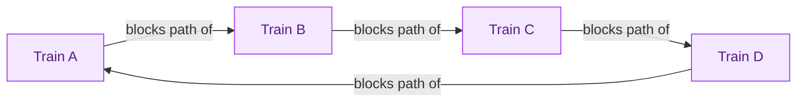

# Thread Pools & Executors

In concurrent programming, managing threads can quickly become complicated. While threads provide a way to execute multiple tasks simultaneously, creating and managing threads manually is often inefficient and error-prone in real-world systems. Let's understand this with the help of an example.

## Understanding

Imagine building a ride-matching system like Uber, where the system needs to handle requests from drivers and riders simultaneously. Each time a rider requests a ride, the system has to find an available driver. To do this efficiently, the system may need to handle multiple tasks concurrently, such as processing requests, matching riders with drivers, updating their statuses, and sending notifications.

In a simple approach, you might decide to create a new thread every time a ride request comes in, so each request gets processed independently. The code implementing this approach is given below:

```java
import java.util.*;

// Ride Matching Service Class
class RideMatchingService {

    // Method handling ride request
    public void requestRide(String riderId) {

        // Creating a new thread for the ride
        Thread matchThread = new Thread(() -> {
            System.out.println("Matching rider " + riderId + " to a driver...");
            // Simulate some processing
            try {
                Thread.sleep(1000); // Simulate a 1-second matching process
            } catch (InterruptedException e) {
                Thread.currentThread().interrupt();
            }
            System.out.println("Ride matched for rider " + riderId);
        });
        matchThread.start();
    }
}

class Main {
    public static void main(String[] args) {
        RideMatchingService rideService1 = new RideMatchingService();
        RideMatchingService rideService2 = new RideMatchingService();

        rideService1.requestRide("Alex");
        System.out.println("task1 running...");

        rideService2.requestRide("John Doe");
        System.out.println("task2 running...");
    }
}
```

While this seems like a good idea at first, creating and managing a large number of threads can quickly become a nightmare as the system scales. Let's formally understand why we should not create thread manually in real-world systems.

## Issues while Creating Thread Manually in Real-World Systems

- **Thread Explosion:** Creating a new thread for each task can quickly lead to an excessive number of threads, overwhelming the system and degrading performance.
- **Memory Issue:** Each thread consumes system memory for its stack. Creating too many threads can lead to memory exhaustion, causing crashes or slowdowns.
- **Thread Leaks:** Failing to properly terminate threads results in thread leaks, where unused threads continue consuming resources, leading to performance degradation.
- **Context Switching Overhead:** Managing too many threads increases context switching, where the system saves and loads thread states. This overhead reduces overall system efficiency as the CPU spends more time switching between threads than doing real computational work.

## A Better Approach: Thread Pools

A better approach is to use Thread Pools, where a fixed number of threads are available to handle tasks.

### Real-life Analogy

<div style="border-left:4px solid #195045;background:rgba(25,80,69,0.08);padding:0.6rem 1rem;border-radius:0 0.5rem 0.5rem 0;margin:1.25rem 0">

💡 **Insight.** This is similar to hiring a set number of chefs for a kitchen: instead of hiring a new chef every time an order comes in, you use your existing chefs efficiently to handle multiple orders as they come in. This ensures that resources are optimized and the kitchen (or system) runs smoothly without overloading.

</div>

## Executor Framework

The Executor Framework in Java is a high-level API that provides a simple and flexible mechanism for managing and controlling thread execution. It decouples:

- **Task Submission:** What you want to do.
- **Task Execution:** How and when it runs.

allowing you to manage threads more efficiently. This framework is part of Java's `java.util.concurrent` package and simplifies the process of handling threads. Let's us understand the key concepts of Executor Frameworks first.

### 1. Executor Interface

The Executor interface is the foundation of the Executor Framework. It defines a single method:

`void execute(Runnable command)`: The execute method takes a Runnable task and runs it asynchronously in a thread. It doesn't return any result, and you can't track the execution outcome directly.

### 2. ExecutorService Interface

ExecutorService extends the Executor interface and adds methods for managing and controlling the lifecycle of threads.

**Key Methods:**

- `submit(Callable task)`: Returns a Future object which allows you to track the progress of the task.
- `shutdown()`: Initiates an orderly shutdown of the executor, rejecting any new tasks but processing the already submitted ones.
- `shutdownNow()`: Tries to stop all actively executing tasks and halts the processing of waiting tasks.

### 3. ThreadPoolExecutor Class

ThreadPoolExecutor is a concrete implementation of ExecutorService and is one of the most commonly used classes. It allows you to define a pool of threads to execute tasks.

**Key Parameters:**

- `corePoolSize`: The number of threads to keep in the pool.
- `maximumPoolSize`: The maximum number of threads allowed in the pool.
- `keepAliveTime`: Time for which idle threads will be kept alive before being terminated.
- `workQueue`: A queue used to hold tasks before they are executed.

### 4. Executors Class

Executors is a utility class that provides factory methods to create predefined types of executor services.

**Common Methods:**

- `newFixedThreadPool(int nThreads)`: Creates a thread pool with a fixed number of threads.
- `newCachedThreadPool()`: Creates a thread pool that can dynamically grow and shrink.
- `newSingleThreadExecutor()`: Creates a single-threaded executor.

#### Code

Here's a code snippet using the Executor Framework to handle email sending tasks efficiently.

```java
import java.util.concurrent.*;

// Using the newFixedThreadPool to manage threads
class EmailService {
    private static final ExecutorService executor = Executors.newFixedThreadPool(10); // Thread pool with 10 threads

    // Method to send email
    public static void sendEmail(String recipient) {
        executor.execute(() -> {
            System.out.println("Sending email to " + recipient + " on " + Thread.currentThread().getName());
            try {
                // Simulate dummy work (sending an email)
                Thread.sleep(1000);  // Simulate delay
            } catch (InterruptedException e) {
                Thread.currentThread().interrupt();  // Handle interruption
            }
            System.out.println("Email sent to " + recipient);
        });
    }

    // Main method to simulate sending multiple emails
    public static void main(String[] args) {
        for (int i = 1; i <= 25; i++) {
            sendEmail("user" + i + "@gmail.com");  // Send email to 1000 users
        }
        executor.shutdown();  // Gracefully shut down the executor
    }
}
```

#### Understanding

`ExecutorService executor = Executors.newFixedThreadPool(10);`
This creates a thread pool with 10 threads. It means the system can process a maximum of 10 email sending tasks concurrently.

`executor.execute(() -> { ... });`
This method is used to submit a task to the executor. The task here is a Runnable that sends an email. The task is executed by one of the threads from the thread pool.

`Thread.sleep(1000);`
This simulates some dummy work (like sending an email). The thread sleeps for 1 second to simulate the time it takes to send an email.

`executor.shutdown();`
This initiates an orderly shutdown of the executor. It ensures that all submitted tasks are completed before the program terminates.

### Why Use Executor Frameworks?

- **Simplified Thread Management:** The framework handles thread creation, task execution, and management for you, reducing boilerplate code.
- **Efficient Resource Management:** By using thread pools, you avoid the overhead of creating new threads for every task, leading to better performance.
- **Graceful Shutdown:** Executor services allow for a clean shutdown, ensuring that all tasks complete before the system terminates.

## Methods to Submit Tasks

In Java's Executor Framework, submitting tasks is a fundamental operation that determines how tasks are executed asynchronously. The ExecutorService provides several methods to submit tasks for execution. Let's understand them one by one.

### 1: execute() Method

- **Purpose:** It is used to submit Runnable tasks (tasks that do not return any result).
- **Return Type:** It does not return a result. This method simply submits the task for execution and doesn't provide a way to track the result or exceptions.
- **Usage:** It's ideal for tasks where you don't need a result back from the task (e.g., logging, sending an email, etc.).

Note that we've studied this method in the previous section.

### 2: submit() Method

- **Purpose:** It is used to submit both Runnable and Callable tasks (tasks that can return a result).
- **Return Type:** It returns a Future object, which allows you to track the result and handle exceptions thrown during the task's execution.
- **Usage:** It's ideal for tasks where you need to capture and process the result (e.g., performing calculations or retrieving data).

Let's understand the submit() method through a detailed example in the next section.

**When to Use Each:**

- `execute()` is best used for fire-and-forget tasks where you don't need a result back and don't need to track task completion.
- `submit()` is used when you need to retrieve a result or track progress with the help of a Future object.

## submit() method

In this section, we'll break down how the submit() method works and how it interacts with the Future object to manage task results. Let's understand this better through the below code:

```java
import java.util.concurrent.*;

// Future and Submit example
class FutureExample {
    public static void main(String[] args) throws Exception {
        ExecutorService executor = Executors.newFixedThreadPool(2);

        Future<Integer> future = executor.submit(() -> {
            Thread.sleep(1000);
            return 77;
        });

        System.out.println("Doing other work...");

        Integer result = future.get(); // blocks until result is ready
        System.out.println("Result: " + result);

        executor.shutdown();
    }
}
```

**Key Concepts to Understand:**

### 1. submit() Method

The submit() method is a versatile way to submit tasks to an executor. It accepts both Runnable and Callable tasks:

- **Runnable:** A task that doesn't return a result.
- **Callable:** A task that can return a result (like our example where 77 is returned).

The method returns a Future object, which can be used to monitor the task's progress and retrieve the result once it completes.

### 2. Future Object

The Future object represents the result of an asynchronous computation. It allows you to:

- Track the completion of the task.
- Get the result using get(), which blocks the calling thread until the task finishes.
- Cancel the task if it hasn't started yet.

### 3. get() Method

The get() method of the Future object is blocking, meaning it will pause the calling thread until the task has finished executing and the result is ready.

If the task has already completed, get() will return the result immediately. Otherwise, it will wait for the task to finish.

### 4. Graceful Shutdown

The shutdown() method is used to stop the executor service after all submitted tasks have been completed. It's important to always call shutdown() to release resources and properly shut down the thread pool.

### Why Use submit() and Future?

- **Asynchronous Task Execution:** submit() allows tasks to run asynchronously, meaning they won't block the main thread. This is useful for performing background tasks such as handling user requests, processing data, etc.
- **Result Handling:** The Future object provides a way to handle the result of the task, including retrieving the outcome once it's ready.
- **Control and Flexibility:** You can monitor the progress of the task, cancel it if necessary, and manage its lifecycle effectively.

## Shutdown Methods in Executor Class

The ExecutorService in Java provides two important methods for shutting down an executor: shutdown() and shutdownNow(). These methods are essential for gracefully terminating the execution of tasks and releasing resources when they are no longer needed.

### 1. shutdown() method

```java
executor.shutdown();
```

- **Purpose:** Initiates an orderly shutdown of the executor service. Once this method is called, the executor will stop accepting new tasks but will continue to process the tasks that have already been submitted.
- **Return Type:** void (No return value)
- **Usage:**
  - shutdown() is typically used when you want to allow the executor to finish executing all tasks in the queue before shutting down.
  - It ensures that the executor doesn't accept any new tasks but still processes the tasks that have already been submitted.

### 2. shutdownNow() method

```java
List<Runnable> pendingTasks = executor.shutdownNow();
```

- **Purpose:** Attempts to stop all actively executing tasks, halts the processing of waiting tasks, and returns a list of the tasks that were waiting to be executed.
- **Return Type:** `List<Runnable>` — Returns a list of the tasks that were in the executor's queue but were not executed.
- **Usage:**
  - shutdownNow() tries to immediately stop all tasks, including those that are currently running.
  - It does not guarantee that all tasks will be stopped; it may just attempt to interrupt them.
  - It returns a list of tasks that have not yet started executing, so you can handle those tasks or retry them later if needed.

## Thread Starvation and Fairness

In multi-threaded systems, thread starvation and fairness are key concepts that ensure threads are scheduled properly without some being unfairly blocked or neglected.

### Thread Starvation

Thread starvation occurs when a thread is perpetually unable to access the resources it needs for execution due to high contention, often caused by prioritizing certain threads over others. As a result, low-priority threads or threads with resource dependencies may never get a chance to execute.

**Cause of Thread Starvation:**

- **High Thread Priority:** Higher-priority threads monopolize CPU time, blocking lower-priority threads.
- **Infinite Blocking:** Threads waiting for resources may never gain access due to constant contention.
- **Lack of Fair Scheduling:** Systems that don't implement fairness may neglect certain threads, causing starvation.

### Fairness in Thread Scheduling

Fairness ensures that all threads get an opportunity to execute, preventing some threads from being permanently blocked. A fair scheduler allocates CPU time evenly across all threads, preventing starvation.

### Fixes for Thread Safety

- Adjusting Thread Priorities
- Implementing Fair Locks
- Using Time Slicing or Round Robin Scheduling
- Adopting Fair Scheduling Algorithms
- Leveraging Executor Services for Task Management

## Fixed vs Cached vs Scheduled Thread Pools

Java's ExecutorService provides different types of thread pools that help manage and execute tasks in a concurrent environment. The three most common types of thread pools are Fixed Thread Pool, Cached Thread Pool, and Scheduled Thread Pool. Each type has specific use cases, advantages, and disadvantages.

### 1. Fixed Thread Pool

A Fixed Thread Pool creates a pool with a fixed number of threads. Once a task is submitted, the executor assigns it to an available thread from the pool. If all threads are busy, new tasks are queued until a thread becomes available.

**Use Case:** Applications where the number of tasks is known in advance, and the system should process a fixed number of concurrent tasks (e.g., handling a fixed number of user requests simultaneously).

**Advantages:**

- **Predictable resource usage:** The number of threads is fixed, so system resources are predictable.
- **Better control:** You can control the maximum number of concurrent threads, avoiding system overload.

**Disadvantages:**

- **Limited scalability:** If all threads are busy and the task queue fills up, tasks must wait in the queue, potentially delaying execution.
- **Underutilization:** If fewer tasks are available than the number of threads, some threads may remain idle, wasting system resources.

### 2. Cached Thread Pool

A Cached Thread Pool creates new threads as needed but reuses previously constructed threads when they are available. If a thread remains idle for more than 60 seconds, it is terminated and removed from the pool.

**Use Case:** Short-lived tasks that are executed intermittently, such as handling burst traffic or processing small background tasks where thread usage is unpredictable.

**Advantages:**

- **Scalable:** Threads are created dynamically, and the pool can grow as needed to handle bursts of tasks.
- **Efficient resource use:** Threads are reused whenever possible, reducing the cost of thread creation.

**Disadvantages:**

- **Potential for thread explosion:** If the system experiences a high volume of tasks at once, a large number of threads may be created, leading to resource exhaustion.
- **Less predictable resource usage:** The number of threads can fluctuate significantly, making resource management more difficult.

### 3. Scheduled Thread Pools

A Scheduled Thread Pool allows you to schedule tasks with fixed-rate or fixed-delay execution policies. It supports delayed or periodic execution of tasks, making it useful for scheduling tasks at regular intervals or after a specific delay. Let's understand with the code given:

```java
class SessionCleaner {
    public static void main(String[] args) {
        ScheduledExecutorService scheduler = Executors.newScheduledThreadPool(1);

        Runnable task = () -> System.out.println("Cleaning up expired sessions...");

        scheduler.scheduleAtFixedRate(task, 0, 5, TimeUnit.SECONDS);
    }
}
```

**Explanation:** In the above example, a session-cleaning task is scheduled to run every 5 seconds, starting immediately (initialDelay = 0). This is achieved using scheduleAtFixedRate(), which ensures periodic execution using a ScheduledExecutorService.

**Use Case:** Applications that need to perform tasks at fixed intervals or after a certain delay, such as periodic data synchronization, background maintenance tasks, or scheduled jobs.

**Advantages:**

- **Task scheduling:** Allows scheduling tasks with a delay or periodic execution.
- **Flexible:** Provides methods for scheduling tasks at fixed-rate intervals or with a fixed delay between executions.

**Disadvantages:**

- **Less efficient for short-lived tasks:** Not ideal for tasks that are short-lived or don't need to be scheduled periodically.
- **Thread management overhead:** Managing scheduled tasks requires additional overhead for tracking execution times and intervals.

## Thread Safety and Synchronisation

In today's world, almost every app or system does many things at once. Whether it's a mobile app loading content while you're scrolling, or a backend server handling hundreds of users at the same time - everything is happening together, side by side.

But when many things run at once, they often bump into each other. Imagine a busy kitchen with several chefs working on the same dish without talking to each other. What happens? Confusion, mistakes, and maybe even a spoiled meal. The same kind of chaos can happen in software if things aren't managed properly.

This article is about that hidden chaos, and how we can bring order to it. We'll explore what really goes on behind the scenes when different parts of a program run at the same time, and how to make sure they don't get in each other's way.

### Thread Safety

<div style="border-left:4px solid #15448e;background:rgba(21,68,142,0.08);padding:0.6rem 1rem;border-radius:0 0.5rem 0.5rem 0;margin:1.25rem 0">

📘 **Definition.** Thread safety means that a piece of code, object, or method works correctly and consistently when used by multiple threads at the same time. It makes sure that no wrong result is produced and no data gets corrupted - even if many threads are accessing or changing the same thing.

</div>

In simple words, thread safety ensures everything stays in order, even when many things are happening at once.

#### Real-life Analogy: Premium Purchase Counter

Imagine a flash sale going live. Hundreds of users try to buy the premium version at the same time. There's a counter keeping track of how many purchases have happened.

If two users hit "Buy" at the same time, and the counter isn't protected, both may see the same count and increase it incorrectly - leading to messed-up records or over-selling.

Thread safety ensures that the purchase counter is updated properly, no matter how many users are trying to buy at once.

#### Why it Matters

Without thread safety, apps can behave unpredictably. Bugs appear that are hard to track, and things break randomly. That's why making code thread-safe is a must when multiple threads or users are involved.

### Race Condition

When two or more tasks reach for the same data at the same moment, the first one to finish "wins," and the final result depends on sheer timing - not on logic. That timing lottery is called a race condition.

#### Real Life Analogy

Picture two cashiers writing today's sales total on a whiteboard. Each walks up, reads "₹ 10,000," adds "+₹1,000," and writes "₹11,000." They never saw the other cashier's update, so one sale is lost. The number you read depends on who grabbed the marker last.

#### Understanding

Let's understand this better with the help of a code example where two threads are incrementing the same counter at the same time, racing to update the shared value without coordination.

```java
import java.util.concurrent.*;

// Purchase counter with no protection
class PurchaseCounter {
    // Shared count value
    private int count = 0;

    // Increment the counter
    public void increment() {
        // READ current value
        // INCREMENT it
        // WRITE it back
        count++;                 // <-- not atomic, unsafe
    }

    // Fetch the current count
    public int getCount() {
        return count;
    }
}

// Demonstrates the race condition
class RaceConditionDemo {
    public static void main(String[] args) throws InterruptedException {
        // Create a shared counter
        PurchaseCounter counter = new PurchaseCounter();

        // Task that bumps the counter 1000 times
        Runnable task = () -> {
            for (int i = 0; i < 1000; i++) {
                counter.increment();
            }
        };

        // Run the same task in two threads
        Thread t1 = new Thread(task);
        Thread t2 = new Thread(task);
        t1.start();
        t2.start();
        t1.join();
        t2.join();

        // Expect 2000, but rarely get it
        System.out.println("Final Count: " + counter.getCount());
    }
}
```

When you run the above code, you won't always get the expected output. Ideally, the result should be 2000, since both threads are supposed to increment the counter 1000 times each.

However, you'll often get a smaller number, because both threads are interfering with each other while updating the shared value.

#### Why the output is Inconsistent?

- count++ looks like one step but is really three: read, add 1, write back.
- If both threads read the same value (say 42) before either writes, each writes 43. One increment vanishes.
- With many interleavings, the final count lands anywhere below 2000.

#### Wrap-up

Race conditions hide in plain sight and only appear under load - exactly when reliability matters most. In the next sections, we'll see how synchronization tools (locks, atomic classes, etc.) eliminate these timing hazards while keeping our code fast and correct.

### Synchronized Keyword

#### Why We Need It

We just saw how two threads can clash over the same data. To stop that clash, Java offers the synchronized keyword - a built-in way to let only one thread touch a critical section at a time.

#### How it Fixes Race Condition

When a thread enters a synchronized region, it grabs a monitor lock tied to an object (or the class itself).

- **If the lock is available:** the thread enters and safely runs the code inside.
- **If the lock is already held by another thread:** the thread waits (is blocked) until the lock is released.

This way, only one thread at a time can execute the synchronized part, which avoids conflicts and ensures thread safety.

Let us now understand the two common forms of using the synchronized keyword.

#### 1. Synchronized Method

```java
class SafeCounter {
    private int count = 0;

    // Entire method is protected by the instance's monitor lock
    public synchronized void increment() {
        count++;          // atomic under the lock
    }

    public synchronized int getCount() {
        return count;
    }
}
```

- The method implicitly locks on this (the current object).
- Only one thread can run increment() (or any other synchronized method of the same object) at a time.

#### Drawback

Sometimes, using the synchronized keyword on an entire method can be too restrictive, especially when only a small part of the method actually deals with shared data.

In such cases, it's better to use a synchronized block to limit locking to just the critical section, improving both performance and flexibility.

#### 2. Synchronized block

```java
class SafeCounter {
    private final Object lock = new Object();
    private int count = 0;

    public void increment() {
        // Lock only the code that truly needs protection
        synchronized (lock) {
            count++;
        }
    }

    public int getCount() {
        // No lock needed for simple read, or use block if strict consistency required
        return count;
    }
}
```

You pick the exact section to lock, improving performance.

To do this, you use a separate object (often named lock) just for synchronization. This object can be any normal Java object - commonly created once and reused inside the class to keep things organized and safe.

Using a synchronized block allows you to define exactly which part of the code should be protected, instead of locking the entire method.

This gives you the ability to place synchronization only around the shared resource, reducing unnecessary blocking and making your code more efficient and maintainable in the long run.

### Monitor Locks

At the core of synchronization in Java lies the concept of Monitor Locks, which manage access by allowing only one thread to execute a synchronized section at any given time. Let's take a closer look at how Monitor Locks work through the given key points.

#### Key Points

- One lock per object (plus one per Class for static sync).
- **Re-entrant:** The same thread can enter the lock multiple times without deadlocking itself.
- **Queueing:** If a lock is taken, other threads wait (block) until it's released.
- Scope matters:
  - synchronized instance method → lock on this.
  - synchronized static method → lock on the Class object.
  - synchronized (obj) block → lock on obj.

#### Drawback

Using monitor locks via synchronized removes data races, but over-locking can slow your app or cause deadlocks if locks are acquired in inconsistent order.

While monitor locks help manage exclusive access, they also introduce overhead by forcing threads to wait, especially when only visibility of changes - not atomicity - is needed.

In such cases, where synchronization might be too heavy, Java provides a lighter option: the volatile keyword.

### volatile Keyword

The volatile keyword in Java is used to ensure visibility, not atomicity. It tells the JVM that a variable's value may be updated by multiple threads and that every read or write should go directly to and from main memory, rather than being cached in a thread's local memory (CPU cache).

#### What it Guarantees

**1. Visibility**

Any update made to a volatile variable by one thread becomes immediately visible to all other threads.

- **Without volatile:** one thread might keep reading an old value from its local cache.
- **With volatile:** all threads will always see the latest value in memory.

```java
class SharedData {
    volatile boolean flag = false;

    public void writer() {
        flag = true;
    }

    public void reader() {
        if (flag) {
            // guaranteed to see true if another thread wrote it
        }
    }
}
```

**2. No Caching**

A volatile variable is always read from and written to main memory. This ensures there's no outdated copy sitting in a CPU register or thread-local cache.

**3. Not Atomic**

Even though volatile ensures visibility, it does not make operations atomic. For example, the following is not thread-safe even if count is declared as volatile:

```java
class Counter {
    volatile int count = 0;

    public void increment() {
        count++; // Still unsafe!
    }
}
```

This is because count++ involves three steps (read, modify, write), and volatile cannot stop two threads from performing these steps simultaneously, leading to race conditions.

#### When to Use volatile

volatile is best suited for scenarios where:

- One thread writes to a variable, and others only read it.
- There's no need for atomic operations, just fresh visibility.

For example: flags, status checks, or configuration values that might change during runtime.

#### Comparison Table: volatile vs synchronized

| Feature | volatile | synchronized |
| --- | --- | --- |
| Visibility | Ensures latest value is visible | Ensures visibility |
| Atomicity | Not guaranteed | Guaranteed for synchronized blocks |
| Lock Overhead | No locking, low cost | Involves locking, more overhead |
| Use Case | Simple flags, config variables | Shared counters, critical sections |
| Blocking | Non-blocking | Can block other threads |

### Atomic Variables

Java provides a set of classes under the `java.util.concurrent.atomic` package, designed to handle common types like integers and booleans in a thread-safe, high-performance way - without using locks.

#### Real-Life Analogy: Social Media Likes

Think of a "Like" counter on a popular Instagram post. Millions of users can tap the Like button at the same time. The system needs to safely update the like count without missing any, and it must do this without slowing everyone down with locks.

Atomic variables work the same way - offering safe, fast updates even under heavy traffic.

#### Common Atomic Classes

- **AtomicInteger:** for atomic operations on integers
- **AtomicBoolean:** for managing flags safely

(There are also AtomicLong, AtomicReference, etc., for more advanced use cases.)

#### How Atomic Variables Work

All atomic classes use a technique called Compare-And-Swap (CAS) at the hardware level. This is what makes them lock-free and highly performant.

**CAS Concept**

CAS stands for Compare-And-Swap. It is a low-level CPU/hardware instruction that checks if a memory location holds an expected value, and if so, swaps it with a new value - all in one atomic step. Here's how it works in simple terms:

"If the current value is what I expect it to be, update it with a new value. Otherwise, try again."

This way, threads don't block each other-they simply keep retrying until they succeed, avoiding race conditions without using locks.

#### Example: Using AtomicInteger and compareAndSet

```java
import java.util.concurrent.atomic.AtomicInteger;

class PurchaseAtomicCounter {

    // A thread-safe integer backed by hardware-level CAS
    private final AtomicInteger likes = new AtomicInteger(0);

    // Atomically add 1 to the like counter
    public void incrementLikes() {
        int prev, next;
        do {

            // Step 1  – read the current value.
            //           (May be outdated if another thread wins the race.)
            prev = likes.get();

            // Step 2  – compute the desired next value.
            next = prev + 1;

            // Step 3  – attempt to swap:
            /*          "If current value is still 'prev', set it to 'next'."
             *          Returns true on success, false if another thread
             *          already changed the value (retry needed).
             */
        } while (!likes.compareAndSet(prev, next));
    }

    // Read-only accessor
    public int getCount() {
        return likes.get();
    }
}
```

#### Why AtomicInteger?

- Holds a single int that can be updated without locks.
- Internally uses the CPU's Compare-And-Swap (CAS) instruction, giving high throughput under moderate contention.

#### What is compareAndSet(old, new)?

- Compare the variable's current value to old.
- If equal, swap in new atomically and return true.
- If not, do nothing and return false (someone else changed it first).

#### How the Loop Works

The table below assumes both threads (U1 and U2) are trying to increment the same atomic counter simultaneously. The operations are broken down step by step to show how compareAndSet() ensures safe updates using Compare-And-Swap (CAS) internally.

| Iteration Step | Thread U1 Value Flow | Thread U2 Value Flow | Outcome |
| --- | --- | --- | --- |
| prev = get() | reads 10 | reads 10 | both see same start |
| next = prev + 1 | computes 11 | computes 11 | both want 11 |
| compareAndSet() | U1 succeeds (10 → 11) | U2 fails (value now 11) | U1 wins |
| Retry loop | exits | retries with new prev=11, next=12 | eventually U2 sets 12 |

#### Compare-And-Set vs Compare-And-Swap

They refer to the same underlying concept, but in different contexts:

| Term | Meaning |
| --- | --- |
| Compare-And-Swap (CAS) | A low-level CPU/hardware instruction that checks if a memory location holds an expected value, and if so, swaps it with a new value - all in one atomic step. |
| Compare-And-Set | A Java-level method (like AtomicInteger.compareAndSet()) that uses the hardware CAS under the hood to implement safe, lock-free updates. |

#### Pros

- High performance: No locking or blocking
- Simple API: Methods like get(), set(), incrementAndGet(), compareAndSet()

#### Cons

- May fail under high contention (many threads retrying at once)
- Only works well for single variables (not ideal for compound or group updates)

### Synchronized vs Volatile vs Atomic Variables

Different concurrency tools serve different purposes. Here's a quick comparison of synchronized, volatile, and AtomicInteger to understand when and why each one should be used.

| Feature | synchronized | volatile | AtomicInteger |
| --- | --- | --- | --- |
| Guarantees Atomicity | ✅ | ❌ | ✅ |
| Guarantees Visibility | ✅ | ✅ | ✅ |
| Blocking | ✅ | ❌ | ❌ |
| Performance | Lower | High | High |
| Use Case | Complex operations | One writer, many readers | Simple counters or flags |

## Locks and Synchronisation Mechanism

In a multithreaded environment, ensuring that shared resources are accessed safely is critical. But not every synchronization mechanism is designed to handle real-world constraints effectively. When it comes to designing scalable and responsive systems, certain limitations begin to surface.

### Problem Statement

Let's consider a real-world scenario from BookMyShow. Suppose a user begins booking a movie ticket, and this booking operation runs inside a thread. However, midway through the booking process, the user goes idle - maybe they switch tabs or walk away from the screen.

Now, if this operation is guarded using the synchronized keyword in Java, the thread will continue holding the lock for the entire duration. Other users trying to access the same seat will be blocked indefinitely until that thread completes. This becomes a serious bottleneck in systems that expect real-time performance and responsiveness.

#### Why not just rely on synchronized?

- No timeout support: the lock waits forever.
- No explicit control over acquiring/releasing the lock.
- You can't interrupt a thread stuck waiting for a lock.
- No guarantee of fairness: Some threads may wait longer than others.

Such limitations make synchronized unsuitable for modern concurrent applications where responsiveness and control are essential.

To solve this issue, a better alternative like a Mutex can be used. But before we dive into it, we first need to understand the difference between a Lock and a Mutex.

### Lock Vs Mutex

| Lock | Mutex |
| --- | --- |
| A general synchronization mechanism used to control access to a shared resource. | A specific type of lock used to achieve mutual exclusion, allowing only one thread to access a resource at a time. |
| A lock may or may not enforce ownership depending on its implementation. In Java, both synchronized and ReentrantLock are ownership-bound. | A mutex strictly follows ownership semantics, meaning only the thread that acquired it should release it. |
| In Java, a monitor lock acquired using synchronized is automatically released when the same thread exits the synchronized block or method. | In Java, ReentrantLock behaves like a mutex because only the owning thread can call unlock() successfully. |
| Locks are a broader concept and can include monitors, reentrant locks, read-write locks, spin locks, and other synchronization mechanisms. | A mutex is mainly focused on exclusive ownership, where one thread enters the critical section, and others must wait. |
| Real-life analogy: A general access-control system, like a door lock used to protect a room. | Real-life analogy: A key-based room where only the person who took the key is expected to return it. |

### ReentrantLock - A Better Alternative to synchronized

We have already seen how the synchronized keyword can leave threads waiting forever when a user simply goes idle in the middle of a critical section.

This is where ReentrantLock steps in to give us finer, explicit control over locking behaviour.

#### What is ReentrantLock?

<div style="border-left:4px solid #15448e;background:rgba(21,68,142,0.08);padding:0.6rem 1rem;border-radius:0 0.5rem 0.5rem 0;margin:1.25rem 0">

📘 **Definition.** ReentrantLock (in java.util.concurrent.locks) is a mutual-exclusion lock with ownership semantics: the thread that acquires it is the only one allowed to release it. The same thread may acquire the lock multiple times ("re-enter") without deadlocking itself - hence reentrant.

</div>

#### When Should You Use It?

| Use Case | Why ReentrantLock Helps |
| --- | --- |
| Explicit control over locking and unlocking | You can decide exactly when to acquire and release the lock, unlike synchronized which is block-scoped. |
| Attempt to acquire a lock with or without timeout | Methods like tryLock() and tryLock(long, TimeUnit) prevent threads from being blocked indefinitely. |
| Fine-grained synchronization | Enables locking only the necessary portions of code, reducing contention and increasing concurrency. |

#### Code Walk-through

Below is a simplified ticket-booking example that replaces synchronized with ReentrantLock.

```java
import java.util.concurrent.locks.ReentrantLock;

class TicketBooking {
    // Number of seats initially available
    private int availableSeats = 1;

    // Dedicated lock for this shared resource
    private final ReentrantLock lock = new ReentrantLock();

    // Public method to book a ticket
    public void bookTicket(String user) {
        System.out.println(user + " is trying to book...");

        // Acquire the lock – blocks until available
        lock.lock();
        try {
            System.out.println(user + " acquired lock.");

            // Critical section: check and update shared state
            if (availableSeats > 0) {
                System.out.println(user + " successfully booked the ticket.");
                availableSeats--;
            } else {
                System.out.println(user + " could not book the ticket. No seats left.");
            }
        } finally {
            // Always release the lock in a finally block
            System.out.println(user + " is releasing the lock.");
            lock.unlock();
        }
    }
}

class Main {
    public static void main(String[] args) {
        // Shared instance of TicketBooking
        TicketBooking bookingSystem = new TicketBooking();

        // Create two threads representing two users trying to book at the same time
        Thread user1 = new Thread(() -> bookingSystem.bookTicket("User 1"));
        Thread user2 = new Thread(() -> bookingSystem.bookTicket("User 2"));

        // Start both threads
        user1.start();
        user2.start();

        // Wait for both threads to finish
        try {
            user1.join();
            user2.join();
        } catch (InterruptedException e) {
            System.out.println("Thread interrupted: " + e.getMessage());
        }
    }
}
```

**Key Points:**

- lock.lock() – blocks the calling thread until it secures exclusive access.
- lock.unlock() – must always execute (hence the finally block) to avoid deadlocks.

Even though this removes the indefinite blocking of other threads once the critical section ends, it still does not handle the case where the user acquires the lock and then sits idle for a long time inside the critical section. To overcome that, we need a non-blocking approach as discussed in the next section.

### Expiring Reentrant Lock: Auto-Releasing Idle Threads

Previously, a user who went idle while holding the lock kept everyone else waiting.

The code below adds an expiry timer so the lock is freed automatically when such scenarios arise.

Important note on ownership: ReentrantLock.unlock() may only be called by the thread that owns the lock - calling it from a scheduler thread will throw an IllegalMonitorStateException. The pattern below handles this correctly: the expiry task only sets a flag (isLocked = false), and the owning thread checks that flag before acting. In production systems, a Semaphore (no ownership) or an interrupted flag is often a cleaner fit for true timer-based release.

```java
import java.util.concurrent.*;
import java.util.concurrent.locks.ReentrantLock;

// ───────────────────────── ExpiringReentrantLock ─────────────────────────

// Lock with a built-in "auto-release after N ms" timer
class ExpiringReentrantLock {
    // underlying mutual-exclusion lock
    private final ReentrantLock lock = new ReentrantLock();

    // single-thread scheduler to run the expiry task
    private final ScheduledExecutorService scheduler =
            Executors.newSingleThreadScheduledExecutor();

    // volatile flag: set to true by the owner, cleared by the timer or owner
    private volatile boolean isLocked = false;

    // Tries to acquire immediately; if successful, schedules auto-unlock signal
    public boolean tryLockWithExpiry(long timeoutMillis) {

        // attempt immediate acquisition (no blocking)
        boolean acquired = lock.tryLock();
        if (acquired) {
            isLocked = true; // signal that a timed session is active

            // schedule a flag-clearing task after timeout
            // NOTE: the scheduler thread cannot call lock.unlock() directly
            // because ReentrantLock only permits the OWNER thread to unlock.
            // Instead, we clear the flag so the owner thread knows to release.
            scheduler.schedule(() -> {
                if (isLocked) {
                    System.out.println("Timeout reached – signalling owner to release.");
                    isLocked = false; // owner thread will pick this up
                }
            }, timeoutMillis, TimeUnit.MILLISECONDS);
        }
        return acquired;
    }

    // Called by the owner thread to release the lock.
    // If the timer already cleared the flag, this still performs cleanup.
    public void unlockSafely() {
        if (lock.isHeldByCurrentThread()) {
            isLocked = false;
            lock.unlock();
            System.out.println("Lock released by " + Thread.currentThread().getName());
        }
    }

    // Graceful shutdown for the scheduler
    public void shutdown() {
        scheduler.shutdownNow();
    }
}

// ───────────────────────────── Driver code ──────────────────────────────

public class Main {
    public static void main(String[] args) {
        // shared expiring lock
        ExpiringReentrantLock expLock = new ExpiringReentrantLock();

        /* Idle user grabs the lock, simulates going idle for 5 s,
           then checks the flag and releases the lock */
        Thread idleUser = new Thread(() -> {
            if (expLock.tryLockWithExpiry(3000)) {
                System.out.println("IdleUser acquired lock, going idle...");
                try { Thread.sleep(5000); } // simulate long idle
                catch (InterruptedException ignored) {}
                // Release – timer has already cleared isLocked by now
                expLock.unlockSafely();
            }
        }, "IdleUser");

        /* Active user starts after 1 s and keeps retrying every 1000 ms
           until the idle thread releases the lock */
        Thread activeUser = new Thread(() -> {
            try { Thread.sleep(1000); } catch (InterruptedException ignored) {}
            while (true) {
                if (expLock.tryLockWithExpiry(3000)) {
                    System.out.println("ActiveUser booked!");
                    expLock.unlockSafely();
                    break;
                } else {
                    System.out.println("ActiveUser still waiting...");
                    try { Thread.sleep(1000); } catch (InterruptedException ignored) {}
                }
            }
        }, "ActiveUser");

        idleUser.start();
        activeUser.start();

        try {
            idleUser.join();
            activeUser.join();
        } catch (InterruptedException ignored) {}

        expLock.shutdown();
    }
}
```

**Key Methods Used:**

- lock.tryLock() – Tries to acquire the lock immediately, returns true if successful, false otherwise. Doesn't block.
- lock.isHeldByCurrentThread() – Checks whether the current thread holds the lock. Used to safely guard unlock() calls.
- lock.unlock() – Releases the lock. Only the owning thread may call this - calling it from any other thread (e.g. a scheduler) throws IllegalMonitorStateException.

**Key Takeaways:**

- **Problem Solved:** Prevents a thread from holding the lock indefinitely by introducing a timer that signals the owner to release the lock.
- **Immediate Lock Acquisition:** The method tryLockWithExpiry() tries to acquire the lock immediately using lock.tryLock() without blocking.
- **Timer as a Signal, Not a Force:** Because ReentrantLock enforces ownership, the scheduler thread does not call unlock() directly. Instead it clears the isLocked flag, and the owning thread is responsible for releasing the lock when it next checks.
- **Safe Unlocking:** The unlockSafely() method uses isHeldByCurrentThread() to ensure only the owning thread releases the lock.
- **Thread Retry Logic:** The ActiveUser retries acquiring the lock periodically until the idle thread's session ends.

### Using tryLock(timeout, unit): Non-Blocking Wait with an Escape Hatch

In the last example we called lock.tryLock() which is a one-shot attempt that either succeeds or fails immediately.

But what if we're willing to wait a little while, yet don't want to block forever? That is exactly what tryLock(long timeout, TimeUnit unit) provides.

#### Code Demo – Ticket Booking with a 2-second timeout

```java
import java.util.concurrent.TimeUnit;
import java.util.concurrent.locks.ReentrantLock;

// Booking system that waits up to 2 s for a lock
class TicketBookingTryLock {

    // shared resource: initial seat count
    private int availableSeats = 1;

    // exclusive lock protecting seat updates
    private final ReentrantLock lock = new ReentrantLock();

    // attempts to book a ticket for the given user
    public void bookTicket(String user) {
        System.out.println(user + " is trying to book...");

        // remember whether we actually got the lock
        boolean lockAcquired = false;
        try {
            // wait up to 2 s before giving up
            lockAcquired = lock.tryLock(2, TimeUnit.SECONDS);

            if (lockAcquired) {
                System.out.println(user + " acquired lock.");

                // critical section – safe to inspect/update seats
                if (availableSeats > 0) {
                    System.out.println(user + " successfully booked the ticket.");
                    availableSeats--;
                } else {
                    System.out.println(user + " could not book the ticket. No seats left.");
                }

                // simulate a long operation that holds the lock
                // this helps demonstrate the timeout behavior for the next user
                Thread.sleep(3000);
            } else {
                System.out.println(user + " could not acquire lock. Try again later.");
            }
        }
        catch (InterruptedException e) {
            // restore interrupt status and log
            Thread.currentThread().interrupt();
            e.printStackTrace();
        }
        finally {
            // release only if we were the owner
            if (lockAcquired) {
                System.out.println(user + " is releasing the lock.");
                lock.unlock();
            }
        }
    }
}


public class Main {
    public static void main(String[] args) {

        // one shared booking system
        TicketBookingTryLock booking = new TicketBookingTryLock();

        // first user attempts booking immediately
        Thread user1 = new Thread(() -> booking.bookTicket("User 1"));

        // second user arrives 500 ms later and may time-out
        Thread user2 = new Thread(() -> {
            try { Thread.sleep(500); } catch (InterruptedException ignored) {}
            booking.bookTicket("User 2");
        });

        user1.start();
        user2.start();
    }
}
```

#### Understanding

- `tryLock(long timeout, TimeUnit unit)`: Waits up to the given time for the lock; returns true if obtained, otherwise false.
- `TimeUnit.SECONDS`: Convenience enum to express the timeout unit cleanly (SECONDS, MILLISECONDS, etc.).

#### Key Takeaways

- **Timed Wait:** tryLock(2, SECONDS) blocks only up to the limit; the thread remains responsive.
- **Graceful Fallback:** If the lock isn't obtained within the window, the thread can log, retry, or take another path instead of hanging.
- **Safe Release:** Always check lockAcquired before unlocking to avoid IllegalMonitorStateException.

### Read-Write Locks

When a data structure is read-heavy (e.g., stock quotes, configuration caches, product catalogs), blocking every reader while one writer updates a single value wastes parallelism.

ReadWriteLock solves this by giving us two independent locks:

- **Read lock** – many threads can hold it simultaneously as long as no thread is writing.
- **Write lock** – exclusive; once held, it blocks all other readers and writers.

#### Real-life Analogy

Think of a public library:

- Visitors may read books at the same time without disturbing one another.
- When the librarian must update (re-shelve) a book, the aisle is temporarily closed - nobody may read or shelve until the update ends.

#### Code: Live Stock Price Feed

```java
import java.util.concurrent.locks.*;

// Shared stock price data guarded by a ReadWriteLock
class StockData {
    private double price = 100.0;  // initial price
    private final ReadWriteLock lock = new ReentrantReadWriteLock();

    // Writer: updates price
    public void updatePrice(double newPrice) {
        lock.writeLock().lock();  // acquire write lock
        try {
            System.out.printf("%s updating price to %.2f%n",
                    Thread.currentThread().getName(), newPrice);
            price = newPrice;
        } finally {
            lock.writeLock().unlock(); // release write lock
        }
    }

    // Reader: reads price
    public void readPrice() {
        lock.readLock().lock();   // acquire read lock
        try {
            System.out.printf("%s read price: %.2f%n",
                    Thread.currentThread().getName(), price);
        } finally {
            lock.readLock().unlock();  // release read lock
        }
    }
}
```

#### Key Takeaways

- **Separation of Read and Write Access:** The class uses a ReadWriteLock to separate read operations (readPrice()) from write operations (updatePrice()), allowing for better concurrency.
- **Multiple Readers Allowed Simultaneously:** Multiple threads can safely call readPrice() at the same time without blocking each other, as long as no thread is writing.
- **Only One Writer Allowed at a Time:** When updatePrice() is called, it uses writeLock(), which blocks all other readers and writers until the update is complete.
- **Thread Safety Guaranteed:** Locks ensure that reads and writes to the shared price variable happen without race conditions, preserving data consistency.
- **Use Case Fit:** This pattern is ideal for read-heavy systems like stock market apps, product catalogs, or analytics dashboards, where frequent reads and infrequent updates are expected.
- **Clean and Safe Resource Handling:** Both methods use try-finally blocks to guarantee that the lock is always released, even if an exception occurs during the operation.

### Semaphores

#### The Problem

Imagine a scenario where a premium platform allows access to only a limited number of devices per account. However, users may try to share credentials and log in from multiple devices simultaneously, violating this policy. This leads to uncontrolled concurrency and degraded service quality for genuine users.

#### Real World Analogy

To understand how we can control such access, think of a token bucket system at the entrance of a private club. The club has exactly N tokens, and anyone who wishes to enter must pick one up. Once inside, they use the club facilities, and upon leaving, return the token to the bucket. If there are no tokens left, new visitors must wait until someone exits. This simple system ensures that no more than N people are inside at any time.

#### The Solution

The solution to the above discussed problem is a Semaphore in Java which is a concurrency tool that maintains a fixed number of permits, like tokens. A thread must acquire a permit to proceed and release it after completing its task. If no permits are available, it either waits or fails based on the method used. This helps limit the number of threads accessing a resource at once, making it ideal for enforcing device limits, rate limiting, or managing connection pools.

```java
import java.util.concurrent.Semaphore;

// Enforces a max-devices policy for a premium account
class PremiumAccount {

    // fixed number of login permits (tokens)
    private final Semaphore deviceSlots;

    // constructor sets permit count
    public PremiumAccount(int maxDevices) {
        this.deviceSlots = new Semaphore(maxDevices);
    }

    // user attempts to log in
    public boolean login(String user) throws InterruptedException {
        System.out.println(user + " trying to log in...");

        // try to grab a permit immediately (non-blocking)
        if (deviceSlots.tryAcquire()) {
            System.out.println(user + " successfully logged in.");
            return true;
        } else {
            System.out.println(user + " denied login - too many devices.");
            return false;
        }
    }

    // user logs out and returns the permit
    public void logout(String user) {
        System.out.println(user + " logging out.");
        deviceSlots.release();  // release permit for next device
    }
}

// Quick demo – 2 device limit
class Main {
    public static void main(String[] args) throws InterruptedException {
        PremiumAccount account = new PremiumAccount(2);

        Thread u1 = new Thread(() -> trySession(account, "User-A"));
        Thread u2 = new Thread(() -> trySession(account, "User-B"));
        Thread u3 = new Thread(() -> trySession(account, "User-C")); // should fail first

        u1.start(); u2.start();
        Thread.sleep(100);  // ensure first two log in
        u3.start();

        u1.join(); u2.join(); u3.join();
    }

    // helper for a user session
    private static void trySession(PremiumAccount acc, String name) {
        try {
            if (acc.login(name)) {
                Thread.sleep(500);  // simulate watching a video
                acc.logout(name);
            }
        } catch (InterruptedException ignored) { }
    }
}
```

#### Key Semaphore Methods

- **tryAcquire():** Attempts to grab a permit immediately; returns true or false (non-blocking: does not wait if no permit is available).
- **acquire():** Blocks until a permit is available.
- **release():** Returns a permit, incrementing the semaphore's count.

#### Key Takeaways

- **Fixed-size gate:** only N simultaneous log-ins are allowed; extras are rejected or block.
- **Fairness Option:** new Semaphore(n, true) grants permits FIFO if you need fairness.
- **Non-blocking vs blocking:** choose tryAcquire() for fail-fast behaviour, or acquire() when the thread should wait.
- Unlike ReentrantLock, Semaphore has no ownership: any thread may call release(), which makes it suitable for producer-consumer and timer-based release patterns.
- **Always release:** failing to call release() will leak permits and eventually lock everyone out.

#### Use Cases

- Database Connection Pools
- API Rate Limiting
- Parking Lot Capacity
- Concurrent Task Execution

These scenarios require precise concurrency limits, which semaphores handle better than basic locks.

### Comparing Monitors, Reentrant Locks, and Semaphores

To wrap up this article, here's a quick summary comparing Monitors, Reentrant Locks, and Semaphores - three core concurrency tools in Java. Each has different strengths, use cases, and trade-offs. The comparison below is based on key characteristics and practical applications:

| Feature | Monitor (synchronized) | ReentrantLock | Semaphore |
| --- | --- | --- | --- |
| Type | Intrinsic | Explicit Lock API | Permit-based access |
| Concurrency Limit | 1 thread | 1 thread | N threads |
| Reentrant | ✅ | ✅ | ❌ |
| Timeout Support | ❌ | ✅ | ✅ |
| Wait/Notify | ✅ (wait/notify) | ✅ (Condition.await()) | ❌ |
| Ownership Semantics | Thread-bound | Thread-bound | No ownership (permits only) |
| Best Use Case | Simple mutual exclusion | Fine-grained locking | Limiting concurrent access |
| Example Use Case | Producer-Consumer | BMS ticket booking | DB connection pool |

This comparison helps clarify when to use what:

- Use Monitors for simple thread coordination and mutual exclusion.
- Use ReentrantLocks when you need flexibility, timeouts, or multiple condition variables.
- Use Semaphores when you want to control the number of concurrent accesses, not just mutual exclusion.

Each primitive is powerful when used in the right scenario - understanding their differences ensures safer and more scalable concurrency design.

#### Conclusion

As we conclude, it's important to understand that all these tools - whether it's a simple monitor, a reentrant lock, or a semaphore - serve one underlying purpose: safe coordination in a concurrent world. These aren't just utilities to pick and choose from casually.

In reality, synchronization is not optional - it's infrastructure. It's what keeps threads from colliding, ensures data stays consistent, and allows systems to scale without breaking. Much like electricity powers everything silently in the background, synchronization quietly powers every reliable multithreaded application.

## Deadlock and Prevention Techniques

In the world of software systems, especially those involving concurrent processes or threads, there are moments when everything seems to come to a halt, quite literally. These situations can bring critical operations to a standstill, leading to system crashes, unresponsive applications, and frustrated users. Understanding why such scenarios occur and how to prevent them is not just a theoretical exercise, it's a necessity for building robust, scalable, and responsive software.

This article dives into one such fundamental challenge faced in concurrent programming. We'll explore how certain conditions can bring systems to a grinding stop, the patterns that lead to this, and most importantly, the practical strategies developers use to avoid them. Whether you're building multithreaded applications, designing databases, or working with operating systems, mastering these concepts is crucial for creating software that performs reliably under pressure.

### Deadlock

A deadlock is a situation that arises in multithreaded or concurrent applications when two or more threads are permanently blocked, each waiting for the other to release a resource. In this state, none of the threads can proceed, and the system essentially freezes in that part of execution. Deadlocks are one of the most notorious problems in concurrent programming, often difficult to detect and debug.

<div style="border-left:4px solid #15448e;background:rgba(21,68,142,0.08);padding:0.6rem 1rem;border-radius:0 0.5rem 0.5rem 0;margin:1.25rem 0">

📘 **Definition.** A deadlock is a situation in multithreaded applications where two or more threads are blocked forever, each waiting for the other to release the lock.

</div>

#### Real-Life Analogy: Train Deadlock



Imagine four trains arriving at a four-way crossing from different directions - A, B, C, and D. Each train blocks the path of the next, forming a perfect cycle where no train can move unless another backs off. But since every train is waiting for another to move first, nothing progresses. This is exactly what happens in a deadlock: a circular wait with no resolution.

#### Example Code: Bank Transfers

Let's now look at a practical coding example where such a deadlock scenario can happen, especially in operations like bank transfers where multiple locks are acquired in different orders.

```java
// ──────────────────────────────────────────────────────────────
// A simple mutable account object guarded by its intrinsic lock
// ──────────────────────────────────────────────────────────────
class BankAccount {

    // Name helps us identify the account in logs
    private final String name;

    // Shared mutable state that needs protection
    private int balance;

    // Constructor – sets initial state
    public BankAccount(String name, int balance) {
        this.name = name;
        this.balance = balance;
    }

    // Read-only helper used only for logging
    public String getName() {
        return name;
    }

    // Deposit is a critical section – guard with the object's lock
    public synchronized void deposit(int amount) {
        balance += amount;
    }

    public synchronized void withdraw(int amount) { balance -= amount; }

    public int getBalance() { return balance; }
}

class TransferTask implements Runnable {
    private final BankAccount from;
    private final BankAccount to;
    private final int amount;

    public TransferTask(BankAccount from, BankAccount to, int amount) {
        this.from = from; this.to = to; this.amount = amount;
    }

    @Override
    public void run() {
        // First lock: 'from' account
        synchronized (from) {
            System.out.println(Thread.currentThread().getName() +
                               " locked " + from.getName());

            // Artificial delay widens timing window
            try { Thread.sleep(100); } catch (InterruptedException ignored) {}

            // Second lock: 'to' account - may block if another thread owns it
            synchronized (to) {
                System.out.println(Thread.currentThread().getName() +
                                   " locked " + to.getName());
                from.withdraw(amount);
                to.deposit(amount);
                System.out.println("Transferred " + amount + " from " +
                                   from.getName() + " to " + to.getName());
            }
        }
    }
}

class DeadlockDemoMain {
    public static void main(String[] args) throws Exception {
        BankAccount accountA = new BankAccount("Account-A", 1000);
        BankAccount accountB = new BankAccount("Account-B", 1000);

        // T1 transfers A to B
        Thread t1 = new Thread(new TransferTask(accountA, accountB, 100), "T1");
        // T2 transfers B to A (reverse order - causes deadlock)
        Thread t2 = new Thread(new TransferTask(accountB, accountA, 200), "T2");

        t1.start();
        t2.start();
        t1.join();
        t2.join();

        // This line is never reached - deadlock occurred
        System.out.println("Both threads finished execution.");
    }
}
```

#### Deadlock Indicator

Note that when you try to run the code, the final statement System.out.println("Both threads finished execution.") is never reached.

If the program pauses indefinitely right before this line, it confirms that both threads are stuck - each holding one lock and waiting for the other. This "missing" completion message is a quick signal that a deadlock has occurred.

#### Understanding: Why this was a Deadlock?

- T1 starts first and locks Account-A, then goes to sleep for 100ms.
- T2 starts during this sleep period and locks Account-B.
- After 100ms, T1 wakes up and tries to lock Account-B, but T2 is still holding it - T1 is blocked.
- T2 then tries to lock Account-A, which is still held by T1 - T2 is also blocked.
- Now both threads are waiting for each other to release a lock they'll never get - this is a classic deadlock.

### Four Necessary Conditions for Deadlocks

For a deadlock to occur, four specific conditions must hold simultaneously. If even one of them is broken, the system can avoid deadlock. These four conditions are known as Coffman Conditions, and here's how they apply to our train analogy:

#### 1. Mutual Exclusion

Only one thread can hold a particular resource at a time.

Example: Each train occupies a unique portion of the track that others cannot use at the same time.

#### 2. Hold and Wait

A thread holds one resource and waits to acquire another.

Example: Train 1 holds track A and waits for track B, while Train 2 holds track B and waits for track C, and so on.

#### 3. No Preemption

A resource cannot be forcibly taken away, and it must be released voluntarily.

Example: No train is pushed back or removed from its current track segment - even if others are waiting.

#### 4. Circular Wait

There exists a closed loop where each thread is waiting for a resource held by the next in the chain.

Example: A to B to C to D back to A - each train waits for the next segment occupied by the other, forming a perfect cycle.

**Key Insight:** To prevent deadlocks, we must break at least one of these four conditions. This principle forms the foundation of all deadlock prevention techniques.

But before we dive into those techniques, let's first understand a classical concurrency problem known as the Dining Philosophers.

### Dining Philosophers Problem

The Dining Philosophers Problem is a classic concurrency problem that illustrates how deadlock can occur when multiple threads (or processes) compete for limited shared resources.


#### The Scenario

Imagine five philosophers sitting around a circular dining table. Between each pair of philosophers lies a single fork, meaning there are five forks in total. Philosophers follow a routine:

1. Think for some time,
2. Get hungry,
3. Pick up the two forks (left and right),
4. Eat,
5. Then put down the forks and go back to thinking.

Each philosopher needs both forks (the one on their left and right) to eat.

#### The Problem

The problem arises if every philosopher picks up their left fork at the same time, they'll all be waiting for the right fork - which is held by their neighbor. Since none of them is willing to put down the left fork they already picked up, they all wait indefinitely.

This results in a deadlock, where:

- Every philosopher holds one fork,
- Everyone waits for another fork that never becomes available,
- No one eats,
- The program freezes.

#### How It Demonstrates Deadlock

The dining philosophers scenario fulfills all four Coffman conditions:

- **Mutual Exclusion:** A fork can be used by only one philosopher at a time.
- **Hold and Wait:** Each philosopher holds one fork and waits for the other.
- **No Preemption:** Forks can't be forcibly taken from a neighbor.
- **Circular Wait:** Each philosopher waits for a fork held by the philosopher to their right, forming a cycle.

This elegant but simple setup clearly shows how deadlocks can occur when multiple entities compete for limited shared resources in an uncoordinated way.

### Deadlock Prevention Techniques

To prevent deadlocks, we need to ensure that at least one of the four Coffman conditions does not hold. Each technique in this section focuses on breaking a specific condition to make the system deadlock-free.

#### 1. Lock Ordering

Lock Ordering is a widely used and effective technique to prevent deadlocks in multithreaded applications. The idea is simple yet powerful: ensure that all threads acquire locks in a predefined global order, regardless of their execution context.

**Condition Broken:** Circular Wait

By strictly maintaining this order, we prevent the Circular Wait condition - one of the four conditions required for a deadlock to occur.

If threads always acquire multiple locks in the same sequence (say A to B to C), the possibility of forming a cycle is eliminated, because no thread will ever wait on a lock held by another while holding a higher-order lock.

```java
import java.util.*;

class LockOrderingSimple {

    static class Resource {
        int id;
        int value;

        public Resource(int id, int value) {
            this.id = id;
            this.value = value;
        }
    }

    public static void main(String[] args) {
        Resource r1 = new Resource(101, 500);
        Resource r2 = new Resource(102, 300);

        Runnable task1 = () -> transfer(r1, r2, 50);
        Runnable task2 = () -> transfer(r2, r1, 30);

        new Thread(task1, "T1").start();
        new Thread(task2, "T2").start();
    }

    public static void transfer(Resource a, Resource b, int amount) {
        Resource[] locks = new Resource[] {a, b};

        // Sort by unique ID - guarantees a consistent global lock order
        Arrays.sort(locks, (x, y) -> Integer.compare(x.id, y.id));

        synchronized (locks[0]) {
            System.out.println(Thread.currentThread().getName() +
                               " locked " + locks[0].id);
            try {
                Thread.sleep(50);
            } catch (InterruptedException ignored) {}

            synchronized (locks[1]) {
                System.out.println(Thread.currentThread().getName() +
                                   " locked " + locks[1].id);
                System.out.println("Transferred " + amount +
                                   " from " + a.id + " to " + b.id);
            }
        }
    }
}
```

**Logic Used in The Code:**

- Even though two threads are acquiring the same pair of resources in reverse order, Arrays.sort() ensures that lock acquisition always follows the same global order (by ascending resource ID).
- This removes the possibility of a circular wait, which is necessary for a deadlock to occur.
- Regardless of thread execution order, both threads will acquire resources in the same sequence (e.g., 101 to 102), ensuring safety.

#### 2. Using tryLock() with Timeout

Another effective technique to prevent deadlock is by using tryLock() with a timeout, provided by the java.util.concurrent.locks.Lock interface.

Instead of waiting forever to acquire a lock, a thread tries to acquire it for a limited time only. If it fails, it backs off and optionally retries later. This prevents the system from getting stuck in a deadlock state.

**Condition Broken:** Hold and Wait

A thread doesn't hold one resource indefinitely while waiting for another - it tries both, and if unsuccessful, it gives up and tries again or exits.

```java
import java.util.concurrent.locks.ReentrantLock;
import java.util.concurrent.TimeUnit;

class TryLockWithTimeout {

    static class Resource {
        final int id;
        final ReentrantLock lock = new ReentrantLock();

        public Resource(int id) { this.id = id; }
    }

    public static void main(String[] args) {
        Resource r1 = new Resource(1);
        Resource r2 = new Resource(2);

        Runnable task1 = () -> tryTransfer(r1, r2);
        Runnable task2 = () -> tryTransfer(r2, r1);

        new Thread(task1, "T1").start();
        new Thread(task2, "T2").start();
    }

    public static void tryTransfer(Resource a, Resource b) {
        boolean acquiredA = false;
        boolean acquiredB = false;

        try {
            acquiredA = a.lock.tryLock(100, TimeUnit.MILLISECONDS);
            if (acquiredA) {
                System.out.println(Thread.currentThread().getName() +
                                   " locked Resource " + a.id);
                Thread.sleep(50);

                acquiredB = b.lock.tryLock(100, TimeUnit.MILLISECONDS);
                if (acquiredB) {
                    System.out.println(Thread.currentThread().getName() +
                                       " locked Resource " + b.id);
                    System.out.println("Transfer successful between " +
                                       a.id + " and " + b.id);
                } else {
                    System.out.println(Thread.currentThread().getName() +
                                       " could not lock Resource " + b.id +
                                       " - backing off");
                }
            } else {
                System.out.println(Thread.currentThread().getName() +
                                   " could not lock Resource " + a.id +
                                   " - backing off");
            }
        } catch (InterruptedException e) {
            e.printStackTrace();
        } finally {
            if (acquiredB) b.lock.unlock();
            if (acquiredA) a.lock.unlock();
        }
    }
}
```

**Logic Used in The Code:**

- Threads try to acquire both locks within a specific timeout (100ms).
- If they fail to get both, they back off and avoid blocking indefinitely.
- This avoids the situation where threads hold one lock and wait forever for another.

#### 3. Minimize Nested Locking

Deadlocks often occur when threads hold one lock and attempt to acquire another - this is known as nested locking. One way to reduce the risk of deadlocks is by minimizing such nested or recursive locking scenarios altogether.

**Condition Broken:** Hold and Wait

By minimizing the number of situations where a thread holds one lock while trying to acquire another, we reduce the chances of forming the "waiting" chain needed for a deadlock.

```java
class MinimizeNestedLocking {

    static class SharedResource {
        private final Object lock = new Object();
        private int data;

        public void update(int value) {
            synchronized (lock) {
                data = value;
                System.out.println(Thread.currentThread().getName() +
                                   " updated data to " + value);
            }
        }

        public int read() {
            synchronized (lock) { return data; }
        }
    }

    public static void main(String[] args) {
        SharedResource resource1 = new SharedResource();
        SharedResource resource2 = new SharedResource();

        // Thread 1 does operations separately to avoid nested locking
        Runnable task1 = () -> {
            resource1.update(100);  // Lock 1 used and released quickly
            try { Thread.sleep(50); } catch (InterruptedException ignored) {}
            resource2.update(200);  // Lock 2 used separately
        };

        // Thread 2 also performs updates separately
        Runnable task2 = () -> {
            resource2.update(300);
            try { Thread.sleep(50); } catch (InterruptedException ignored) {}
            resource1.update(400);
        };

        new Thread(task1, "T1").start();
        new Thread(task2, "T2").start();
    }
}
```

**Logic Used in The Code:**

- Each thread locks and updates one resource at a time.
- Locking is not nested - resources are used sequentially, not simultaneously.
- This removes the dependency between locks and avoids potential circular waiting.

### Deadlock Handling Strategies (Used Commonly in Databases)

While deadlock prevention avoids the possibility altogether, database systems often prefer deadlock handling, which includes detecting and resolving deadlocks when they occur. Two classical schemes used are:

#### 1. Wait-Die Scheme (Non-Preemptive)

The idea is to use timestamps or priorities to decide who waits and who gives up.

**How It Works:**

- Every thread (or transaction) is assigned a timestamp when it starts (earlier = higher priority).
- When a thread T1 requests a lock that is already held by another thread T2, the decision is made based on their timestamps:
  - If T1 has higher priority (started earlier than T2) - T1 waits.
  - If T1 has lower priority (started after T2) - T1 dies (gets aborted and restarted later with the same timestamp).

**Characteristics**

- Non-preemptive: The system doesn't forcibly remove locks.
- Prevents circular wait by favoring older transactions.
- Can lead to frequent rollbacks of younger transactions.

#### 2. Wound-Wait Scheme (Preemptive)

The idea is to again use timestamps or priorities - but allow preemption this time.

**How It Works:**

- Same priority rules based on timestamps.
- When a thread T1 requests a lock held by T2:
  - If T1 has higher priority - T1 wounds T2 (forces T2 to release the lock and roll back).
  - If T1 has lower priority - T1 waits.

**Characteristics**

- Preemptive: Allows the system to forcibly roll back younger transactions.
- Reduces the number of rollbacks compared to Wait-Die.
- Works well in systems where older transactions are more important.

#### Conclusion

Deadlocks are a critical concern in any system that involves concurrency. While they may seem like edge cases during development, they often surface in high-load, real-world scenarios, making them both hard to predict and challenging to debug.

- Deadlocks are hard to debug and often happen under load.
- Use thread dumps to detect deadlocks in real applications.

Proactively applying prevention techniques such as lock ordering, tryLock with timeout, and minimizing nested locking can help build safer and more responsive applications. For systems like databases, strategies like Wait-Die and Wound-Wait offer powerful recovery options.

Understanding the conditions that cause deadlocks and the strategies to avoid or handle them is essential for designing reliable, concurrent systems.

## Producer-Consumer Problem

In concurrent programming, one of the most classic problems used to explain synchronization is the Producer-Consumer Problem. It represents a scenario where two types of threads — producers and consumers — share a common, finite-size buffer. The producer's job is to generate data and place it into the buffer, while the consumer's job is to remove data from the buffer for processing.

This problem helps illustrate the challenges of coordinating threads, avoiding race conditions, and ensuring thread-safe communication between processes.

### The Producer-Consumer Problem

The Producer-Consumer Problem, also known as the Bounded Buffer Problem, is a classic example of a multi-process synchronization issue. It revolves around coordinating two types of threads:

- **Producers:** which generate data and add it to a shared buffer.
- **Consumers:** which take data from the buffer and process it.

#### Challenge

The core challenge lies in ensuring that producers don't add data when the buffer is full, and consumers don't try to remove data when the buffer is empty — all while avoiding race conditions and ensuring mutual exclusion and proper coordination between threads.

This problem is a synchronization construct that ensures:

- **Mutual Exclusion:** Only one thread can access the shared buffer (critical section) at a time.
- **Wait-Notify Coordination:** Producers wait when the buffer is full; consumers wait when it's empty. Threads notify each other when buffer states change.

#### Real-Life Analogies

<div style="border-left:4px solid #195045;background:rgba(25,80,69,0.08);padding:0.6rem 1rem;border-radius:0 0.5rem 0.5rem 0;margin:1.25rem 0">

💡 **Insight.** Washroom with One Key: Think of a washroom with a single key. Only one person can enter at a time (mutual exclusion). If it's occupied, others must wait outside (wait-notify mechanism).

</div>

**Coffee Machine:** A coffee machine acts as a producer that brews coffee. The customer is the consumer who drinks it. The machine shouldn't brew more if the cup is already full, and the customer must wait if there's no coffee — a perfect reflection of the coordination needed.

### Solution

In this Producer-Consumer Problem, the major challenge is coordination — ensuring the producer doesn't add items to a full buffer and the consumer doesn't try to consume from an empty one. This is where Java's wait() and notify() methods come into play.

#### wait() and notify() methods

These two methods provide a built-in signaling mechanism to safely pause and resume threads based on the shared resource's state:

- **wait():** Causes the current thread to pause and release the lock until another thread signals it using notify().
- **notify():** Wakes up one waiting thread so it can try to re-acquire the lock and proceed.

Together, they eliminate the need for busy waiting, reduce CPU usage, and help implement the wait-notify coordination pattern — a fundamental synchronization requirement in the producer-consumer scenario.

#### Example Code

Let's now walk through a simple example where the buffer holds just one item: a cup of coffee.

```java
import java.util.LinkedList;
import java.util.Queue;

// Shared resource: CoffeeMachine acts as a buffer of size 1
class CoffeeMachine {
    // Flag to indicate buffer status: true → coffee ready, false → cup empty
    private boolean isCoffeeReady = false;

    // Method to be run by the producer thread
    public synchronized void makeCoffee() throws InterruptedException {
        // If coffee is already ready, producer must wait (buffer is full)
        while (isCoffeeReady) {
            // Releases lock and waits until notified by consumer
            wait();
        }

        // Simulate coffee preparation
        System.out.println("Brewing coffee…");
        Thread.sleep(1000); // Simulate time to make coffee

        // Set the buffer to full (coffee is now ready)
        isCoffeeReady = true;
        System.out.println("Coffee ready!");

        // Notify the consumer thread that coffee is available
        notify();
    }

    // Method to be run by the consumer thread
    public synchronized void drinkCoffee() throws InterruptedException {
        // If no coffee is available, consumer must wait (buffer is empty)
        while (!isCoffeeReady) {
            // Releases lock and waits until notified by producer
            wait();
        }

        // Simulate coffee consumption
        System.out.println("Drinking coffee…");
        Thread.sleep(1000); // Simulate time to drink coffee

        // Set the buffer to empty (coffee has been consumed)
        isCoffeeReady = false;
        System.out.println("Cup emptied - brew next!");

        // Notify the producer thread that it can brew again
        notify();
    }
}

// Driver class
class ProducerConsumerProblem {
    public static void main(String[] args) {
        // Shared CoffeeMachine object acts as the synchronized monitor
        CoffeeMachine machine = new CoffeeMachine();

        // Producer thread that continuously makes coffee
        Thread producer = new Thread(() -> {
            while (true) {
                try {
                    machine.makeCoffee(); // Try to produce coffee
                } catch (InterruptedException e) {
                    e.printStackTrace();
                }
            }
        });

        // Consumer thread that continuously drinks coffee
        Thread consumer = new Thread(() -> {
            while (true) {
                try {
                    machine.drinkCoffee(); // Try to consume coffee
                } catch (InterruptedException e) {
                    e.printStackTrace();
                }
            }
        });

        // Start both threads
        producer.start();
        consumer.start();
    }
}
```

#### How wait() and notify() Work Together?

**Initial State:**

- The buffer (isCoffeeReady) is false — no coffee yet.
- The producer thread enters makeCoffee() and proceeds to brew coffee.
- The consumer thread enters drinkCoffee() but sees no coffee, so it goes to wait() and sleeps.

**Producer Brews Coffee:**

- After brewing (Thread.sleep(1000)), it sets isCoffeeReady = true.
- It then calls notify() to wake up the waiting consumer.
- The producer thread loops back but now finds coffee still present, so it goes into wait().

**Consumer Wakes Up and Drinks Coffee:**

- The consumer, upon waking, sees that the coffee is ready.
- It drinks the coffee and sets isCoffeeReady = false.
- It then calls notify() to wake up the producer.

**Cycle Repeats:**

- The producer wakes up and sees that coffee has been consumed.
- It brews another cup, and the entire cycle continues.

Both methods are synchronized, so only one thread can run inside them at any time (mutual exclusion).

#### Key Methods Explained

| Method | Purpose | What Actually Happens |
| --- | --- | --- |
| wait() | Voluntarily releases the intrinsic lock and suspends the current thread | The thread goes into the WAITING state.<br>It pauses execution and releases the object's monitor.<br>It will resume only when another thread calls notify() or notifyAll() on the same object. |
| notify() | Wakes one thread that is waiting on the same object's monitor | A random waiting thread moves from WAITING to BLOCKED state.<br>It competes to reacquire the object's lock before it can continue executing. |

Note that the while loop in the makeCoffee() and drinkCoffee() methods protects against spurious wake-ups and re-checks condition after every resume.

#### Key Takeaways

- **Single-slot buffer:** Setting isCoffeeReady acts as the entire queue; the flag prevents over-production or over-consumption.
- **Intrinsic lock:** Declaring both methods synchronized gives us mutual exclusion for free.
- **Condition signalling:** wait() + notify() form a lightweight, built-in condition-variable mechanism; they let threads sleep without busy-waiting.
- Always loop around wait() to guard against spurious wake-ups and to re-validate the buffer's state.
- **Scalable pattern:** Replace the boolean with a Queue<T> and size checks to move from "tiny" to "bounded-buffer" implementations.

### Handling Fast Producer and Slow Consumer (Online Judge Example)

Previously, we studied a solution with a one-slot buffer, where the producer (coffee machine) and the consumer (customer) worked in perfect alternation — one producing, the other consuming. But real-world systems often face imbalance in processing speeds.

Imagine a scenario in an online judge platform, where the submission judge (consumer) takes longer to process each code submission than the time it takes for users (producers) to submit them. If we still used a single-slot buffer, submissions would frequently get blocked or lost due to the judge being busy.

#### The Problem

In this case:

- Producers (users) submit solutions rapidly.
- Consumer (judge system) takes time to compile, run, and verify each solution.
- If the buffer can hold only one submission, the producer has to wait too frequently — leading to poor performance and wasted CPU cycles.

#### The Solution

To fix this, we use a buffered queue (like Queue<String> submissions = new LinkedList<>();) that can store multiple submissions at once. This allows:

- Producers to keep submitting even when the consumer is busy.
- Consumers to process submissions at their own pace, pulling from the buffer.

This change models how real-world systems handle bursty traffic and slower backend processing.

#### Code

```java
import java.util.LinkedList;
import java.util.Queue;

// Represents a code submission by a user
class Submission {
    private static int idCounter = 1; // Used to generate unique submission IDs
    private final int submissionId;
    private final String userName;

    public Submission(String userName) {
        this.userName = userName;
        this.submissionId = idCounter++; // Auto-incrementing ID
    }

    public int getSubmissionId() {
        return submissionId;
    }

    public String getUserName() {
        return userName;
    }
}

// Shared resource between producers (users) and consumers (judges)
class SubmissionQueue {
    private final Queue<Submission> queue = new LinkedList<>(); // Shared buffer
    private final int MAX_CAPACITY = 5; // Bounded buffer size

    // Producer logic: User submits a solution
    public synchronized void submit(Submission submission) throws InterruptedException {
        // If queue is full, producer waits
        while (queue.size() == MAX_CAPACITY) {
            System.out.println("⏳ Queue full. " + submission.getUserName() + " is waiting to submit.");
            wait(); // Releases lock and waits for space
        }

        // Add submission to the queue
        queue.offer(submission);
        System.out.println("" + submission.getUserName() + " submitted code: #" + submission.getSubmissionId());

        notifyAll(); // Notifies judges that a new task is available
    }

    // Consumer logic: Judge processes a submission
    public synchronized Submission consume(String judgeName) throws InterruptedException {
        // If queue is empty, consumer waits
        while (queue.isEmpty()) {
            System.out.println("△ " + judgeName + " waiting for submissions...");
            wait(); // Releases lock and waits for submissions
        }

        // Remove a submission from the queue
        Submission sub = queue.poll();
        System.out.println("⚙️ " + judgeName + " started evaluating submission #" +
                           sub.getSubmissionId() + " from " + sub.getUserName());

        notifyAll(); // Notifies waiting producers if queue was full
        return sub;
    }
}
```

#### Understanding Key Methods

| Method | Purpose | Behavior |
| --- | --- | --- |
| wait() | Pause the current thread and release the lock | Thread enters the WAITING state and resumes only when another thread calls notify() / notifyAll() on the same object |
| notifyAll() | Wake all threads waiting on the object's monitor | All waiting threads become BLOCKED; the first to reacquire the lock continues execution |
| queue.offer() | Add a submission to the buffer (if space exists) | Called by producers to enqueue a new task |
| queue.poll() | Remove a submission from the front of the buffer | Called by consumers to dequeue and process a task |

#### Key Takeaways

- **Buffered Queue:** We now use a queue of size 5 to hold multiple submissions — unlike the previous one-slot version.
- **Fast Producers, Slow Consumers:** Producers don't have to wait unless the buffer is full. These model systems like an online judge where many users submit rapidly, but judges can evaluate only one at a time.
- **notifyAll() vs notify():** notifyAll() is used because multiple threads (many users or multiple judges) might be waiting — all should get a chance.
- **Thread Coordination:** Both producer and consumer use wait()-notifyAll() mechanism to signal when the buffer is full or empty.
- **Thread Safety:** All shared state is accessed inside synchronized methods to maintain consistency.

#### Conclusion

The Producer-Consumer problem is a foundational concept in multithreading that teaches us how to manage coordination between threads effectively. By moving from a one-slot buffer to a bounded queue, we modeled a real-world scenario like an online judge system, where producers can be faster than consumers. Using wait() and notifyAll() ensures smooth synchronization, prevents data loss, and maintains thread safety — all essential for building reliable concurrent applications.
