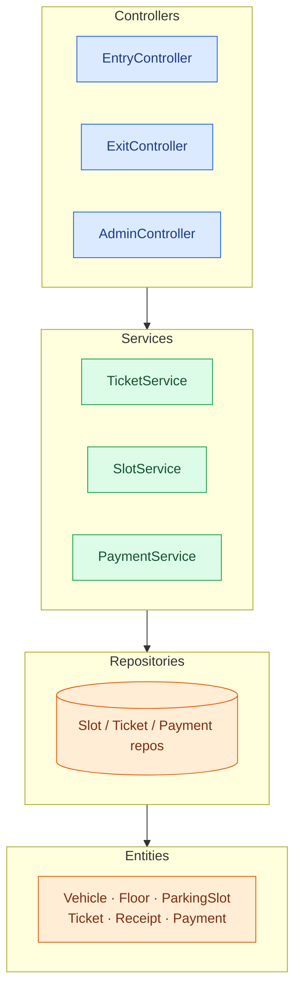
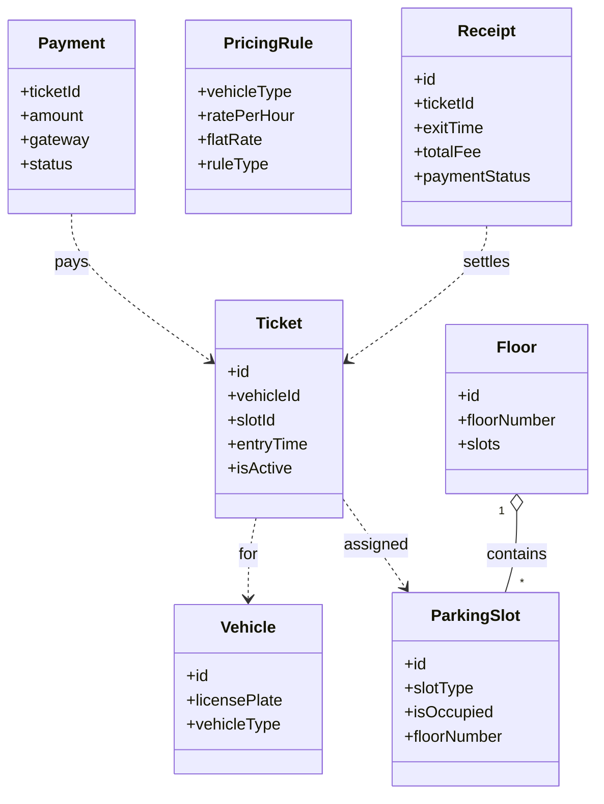

# Design a Parking Lot

Low-Level Design (LLD) design exercises test your ability to model real-world systems into scalable, extensible, and maintainable code. One of the most popular examples used in design exercises is the Parking Lot System.

In this article, we'll walk you through a 9-step approach to break down the problem just as you would in a real design exercise. At every step, we'll include pro tips to help you convey your thought process confidently and communicate your design clearly.

## Step 1: Clarify Requirements

### Functional Requirements

#### Entry Flow

- Vehicle arrives at gate
- Assign slot based on vehicle type
- Generate ticket
- Mark slot as occupied
- Return entry response

#### Exit Flow

- Present ticket
- Calculate fee using pricing rules (flat vs hourly)
- Process payment
- Release slot
- Return exit response with receipt

#### Admin Flow

- Add/Edit/Delete floors and slots
- Define/update pricing rules
- View parking lot status

💡 **Insight.** Always ask a reviewer to confirm the requirements before jumping into code. It shows clarity and alignment.

### Non-Functional Requirements

- **Scalability:** Multiple parking lots, thousands of slots
- **Availability:** Entry/Exit must work even if payment fails
- **Consistency:** Accurate slot status at all times
- **Extensibility:** Easy addition of new vehicle types or gateways
- **Security:** Role-based access for admin operations
- **Latency:** < 500ms for key flows

### Edge Cases to Consider

- Payment failure at exit
- Lost ticket
- System clock mismatch
- Slot marked occupied wrongly

## Step 2: Identify Core Entities

| Entity | Key Attributes |
| --- | --- |
| Vehicle | id, licensePlate, vehicleType |
| ParkingSlot | id, slotType, isOccupied, floorNumber |
| Floor | id, floorNumber, slots |
| Ticket | id, vehicleId, slotId, entryTime, isActive |
| Receipt | id, ticketId, exitTime, totalFee, paymentStatus |
| PricingRule | vehicleType, ratePerHour, flatRate, ruleType |
| Payment | ticketId, amount, gateway, status |
| EntryResult / ExitResult | success, data, message |

💡 **Insight.** Model your entities using enums and flags where applicable. It adds clarity and control.

## Step 3: Visual Interaction Flows

### Entry Flow

- Vehicle arrives
- Slot allocated
- Ticket generated
- Slot marked as occupied

### Exit Flow

- Ticket scanned
- Fee calculated
- Payment processed (with retries)
- Receipt generated
- Slot released
- Ticket deactivated

### Admin Flow

- Add floor
- Add slot
- Update pricing

💡 **Insight.** Draw simple flow diagrams if you're at the whiteboard or use sequence steps clearly when virtual.

## Step 4: Defines Class Structures & Relationships

### Layers of Architecture

We will design the architecture layers of the system in a structured way, ensuring separation of concerns and modularity. The system will be organized into the following layers:

Client Layer → Controller Layer → Service Layer → Repository Layer → Domain Layer

Each layer has a distinct role:

- **The Client Layer** is responsible for user interaction and presenting information to the user.
- **The Controller Layer** handles incoming requests from the client and delegates the tasks to the appropriate service.
- **The Service Layer** contains the business logic, such as ticket generation and fee calculation.
- **The Repository Layer** manages data access and persistence.
- **The Domain Layer** defines the core entities like vehicles, slots, tickets, etc.

### Controllers

- `EntryController.enterVehicle()`
- `ExitController.exitVehicle()`
- `AdminController.addFloor(), addSlot(), updatePricing()`

### Services

The system will include several services responsible for core business operations. Each service will handle specific tasks:

- **TicketService:** Generates and retrieves tickets
- **SlotService:** Allocates and releases parking slots
- **PricingService:** Calculates fees based on parking duration and type
- **PaymentService:** Processes payments for parking tickets
- **ReceiptService:** Generates receipts after payment
- **AdminService:** Handles administrative tasks like adding floors, updating pricing, and slot management

### Repositories

The Repositories will abstract data access for the core entities like TicketRepository, SlotRepository, FloorRepository, PricingRuleRepository, PaymentRepository. Each repository will be responsible for:

- Managing CRUD operations (Create, Read, Update, Delete) for Tickets, Slots, Floors, Pricing Rules, and Payments
- Providing methods to query and persist data efficiently

### Interfaces and Adapters

We will use interfaces and adapters to integrate external services: PaymentGatewayAdapter, RazorpayAdapter, StripeAdapter. The adapter pattern will allow for:

- Abstracting payment gateway interactions
- Easily switching or adding new payment services like Razorpay or Stripe by implementing the PaymentGatewayAdapter interface

💡 **Insight.** Discuss layering and interfaces to show that you understand separation of concerns.

## Step 5: Implement Core Use Cases

The system will be designed around key use cases, with each use case mapped to corresponding service and repository methods.

### Entry Use Case

`enterVehicle() → SlotService.allocateSlot() → TicketService.generateTicket() → TicketRepository.save() → Return EntryResult`

### Exit Use Case

`exitVehicle() → Get Ticket → Calculate Fee → Process Payment (with retries) → Release Slot → Generate Receipt → Return ExitResult`

### Admin Use Cases

- `addFloor()`: Save new floor
- `addSlot()`: Save new slot
- `updatePricing()`: Update pricing rules

💡 **Insight.** During a design exercise, make sure to map each use case directly to the services and repositories it interacts with. This shows clarity in your design and ensures the workflow is easily understandable.

## Step 6: Apply OOP Principles & Design Patterns

The system design incorporates essential design patterns and OOP principles to ensure flexibility, scalability, and maintainability.

### Design Pattern Used

- **Adapter Pattern:** Abstraction of payment gateways
- **Repository Pattern:** Isolation of database operations
- **Service Layer Pattern:** Centralization of business logic

### OOP and SOLID Principles Applied

- **SRP (Single Responsibility Principle):** Each class has one clear responsibility
- **ISP (Interface Segregation Principle):** Role-specific interfaces (e.g., for payment)
- **DIP (Dependency Inversion Principle):** Services depend on interfaces, not concrete implementations
- **Open/Closed Principle:** The system is open for extension but closed for modification
- **Encapsulation:** Domain entities encapsulate both data and behavior

💡 **Insight.** Highlight how applying these design patterns and principles ensures the system is both flexible and easy to extend, allowing for new features like additional payment gateways or vehicle types without major code changes.

## Step 7: Handling Edge Cases

Handling edge cases is a crucial part of designing a real-world system. In actual production systems, you can't always rely on perfect input or ideal conditions. It's important to plan for unexpected situations, such as failed payments, lost tickets, or mismatched data, that could arise during regular operations. Properly handling these edge cases ensures that the system remains resilient, reliable, and user-friendly, even under less-than-ideal conditions.

Here are some common edge cases and their strategies for handling them:

| Edge Case | Strategy |
| --- | --- |
| Lost ticket | Provide admin override functionality to manually validate and process the exit. |
| Payment failure | Implement retry logic through the PaymentGatewayAdapter to handle payment failures (e.g., due to network issues). |
| Mismatched vehicle type | Ensure validation of vehicle type during entry and exit, allowing the system to reject incompatible vehicle-slot assignments. |
| Clock issues | Use a centralized time service to ensure consistent timestamps across all services and avoid issues like clock skew. |
| Slot state mismatch | Implement a reconciliation service to periodically check and correct discrepancies between the system's slot states and the database. |

💡 **Insight.** Mention failure scenarios to show you think beyond the happy path.

## Step 8: Package Structure & Class Diagram

### Package Structure

The design layers into controllers (the entry points), services (the business logic), repositories (persistence), and the entity model — each layer depending only on the one below it:

### Class Diagram

The core entities from Step 2 and the relationships between them:

