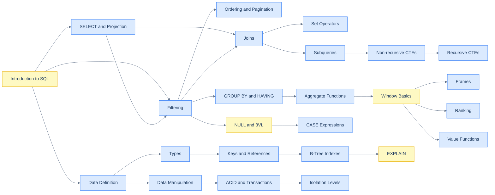
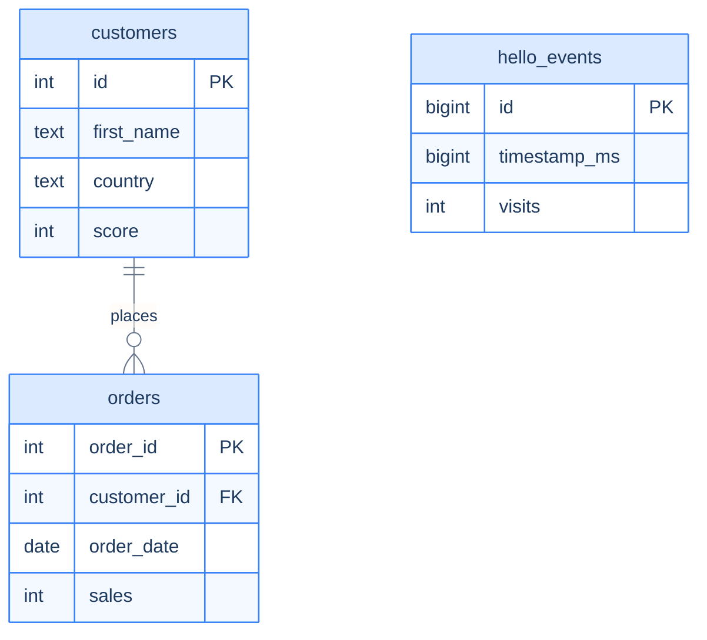

# SQL

A curriculum for engineers who want to *think* in SQL — not just translate one-line questions into SELECT statements, but reason about what the database is actually doing under each clause, why an index helped here and didn't help there, why a query that worked in staging melted in production. The book starts with the foundations every later chapter assumes (logical execution order, three-valued logic, the relational model), walks through joins, aggregation, row functions, and window functions with worked examples on a single sample schema, and ends with the production-reality module: indexes, EXPLAIN plans, transactions, and concurrency.

The goal is not breadth-as-a-checklist. The goal is for you to be able to **read a SELECT and predict its plan**, **derive a schema from the questions you'll ask of it**, and **debug the slow query when it goes wrong** — the three things that separate engineers who *use* SQL from engineers who *understand* it.

---

## Reading conventions

- Every chapter opens with a hook — a real-world scenario or a "you've done this and not realised" moment — before any formal syntax.
- Code blocks use **PostgreSQL** as the canonical dialect; brief inline callouts mark divergences for SQLite, MySQL, and SQL Server T-SQL when the difference matters in practice.
- The same **sample schema** (three tables: `customers`, `orders`, `hello_events`) is used across every chapter. It's defined once in the [Introduction to SQL](/cortex/languages/sql/foundations/introduction-to-sql) chapter and re-used everywhere; you can always run any chapter's queries against the same data.
- Every chapter closes with **Production reality** (where this lives in real systems — Postgres internals, codefolio's own schema, real EXPLAIN output), a **Practice ladder** of 3–5 problems with hints (not solutions), and a **Final takeaway** of 2–4 punchy bullets.

---

## Curriculum map

The curriculum is organised as **Modules → Tutorials**. Each module is a self-contained area you can read top-to-bottom; each tutorial states its prerequisites in frontmatter so you can navigate sideways too.

1. [**Foundations**](/cortex/languages/sql/foundations/index) — what SQL is, the logical execution order, SELECT and projection, filtering, ordering and pagination, DDL, DML.
2. **Working with Multiple Tables** *(coming soon)* — joins, set operators, subqueries, anti-joins.
3. **Aggregation** *(coming soon)* — GROUP BY, aggregate functions, ROLLUP/CUBE/GROUPING SETS.
4. **Row Functions** *(coming soon)* — strings, numbers, dates, NULL handling and three-valued logic, CASE expressions.
5. **Window Functions** *(coming soon)* — OVER, PARTITION BY, frames, ranking, value functions, real-world patterns.
6. **CTEs and Recursion** *(coming soon)* — WITH clauses, recursive queries, hierarchies and graphs.
7. **Schema and Constraints** *(coming soon)* — types, keys and references, normalisation.
8. **Indexes and Performance** *(coming soon)* — B-trees, other index types, EXPLAIN plans, anti-patterns.
9. **Transactions and Concurrency** *(coming soon)* — ACID, isolation levels, MVCC and locking.
10. **Advanced Patterns** *(coming soon)* — hierarchies, JSON, pivoting, time series.

---

## Three reading paths

Pick the one that matches your goal.

### Path A — From scratch (the "first SQL of my life" path)

You can program in *some* language and have never written SQL — or you've copy-pasted a couple of `SELECT * FROM users` queries and want to learn the language properly. Walk this in order; do not skip the Introduction.

1. Foundations: Introduction → SELECT and Projection → Filtering → Ordering and Pagination → DDL → DML.
2. Multiple Tables: Joins → Set Operators → Subqueries.
3. Aggregation: GROUP BY → Aggregate Functions.
4. Row Functions: NULL and Three-Valued Logic → CASE → Strings → Numbers → Dates.
5. Window Functions: Window Basics → Ranking.
6. Schema: Types → Keys and References.

That covers everything you need to be productive against a real database. Indexes, performance, and transactions can wait until you have a query that's actually slow.

### Path B — Brushing up for an interview

You've written SQL and you need to fill the gaps that interviews will probe.

1. Foundations: Introduction (only — for the **logical execution order**, which is the single highest-leverage idea in SQL).
2. Multiple Tables: full module — every join type, every set operator, correlated subqueries, anti-joins.
3. Aggregation: full module.
4. Row Functions: NULL and Three-Valued Logic (essential — interviewers love `NULL` traps), CASE expressions.
5. Window Functions: full module — window functions are the single most-asked SQL topic in modern interviews after joins.
6. CTEs: full module — recursive CTEs especially.
7. Indexes: B-Tree Indexes, EXPLAIN.

### Path C — Filling specific gaps

You've been writing SQL professionally for years and know most of this. Use the prerequisite graph below to find the boundary of "stuff I already know" and walk forward from there. Each chapter states its prerequisites in a frontmatter block, and the index for each module lists what's covered in plain English.

Most engineers in this category find their gaps in: window functions (frames especially), recursive CTEs, advanced index types (GIN/GiST/BRIN), MVCC and isolation levels, and JSON-in-SQL.

---

## Prerequisite graph

The yellow nodes (Introduction, NULL/3VL, Window Basics, EXPLAIN) are the four leverage points — short investments of time that make many later chapters dramatically easier. If you read nothing else, read those four.

---

## Sample schema

Every chapter in this book uses one shared three-table schema. The full DDL and seed data live in the [Introduction to SQL](/cortex/languages/sql/foundations/introduction-to-sql) chapter; the high-level shape is:

`customers` and `orders` are the classic e-commerce pair — five customers, six orders, enough rows to demonstrate every join type without overwhelming the page. `hello_events` is the time-series table from codefolio's own [hello pipeline](/cortex/codefolio-onboarding/start-here-overview) — an append-only log of `(timestamp, visits)` pairs that gives us realistic data for window functions, time-bucketing, and JSON-in-SQL chapters.

When a chapter introduces a new query, it works against this same schema. You won't have to re-learn fourteen different schemas across the curriculum.

---

## A note on dialects

SQL is a standard. SQL implementations are not. PostgreSQL, MySQL/MariaDB, SQLite, SQL Server, and Oracle all share an ANSI-shaped core but diverge on the edges — sometimes silently, sometimes spectacularly. This book chooses **PostgreSQL** as canonical because:

1. It's what the codefolio stack uses (see [`docker-compose.yml`](/cortex/codefolio-onboarding/start-here-overview)), so every example runs on the same engine the user runs in production.
2. It tracks the SQL standard most aggressively of the major engines — `LATERAL`, `WITHIN GROUP`, window `FILTER`, `ORDINAL`, `JSONB`, named windows, deferrable constraints, generated columns. If you learn standard SQL on Postgres, you learn the most of it.
3. It has the deepest open documentation and the most introspectable internals (the `pg_*` system catalogues, `EXPLAIN ANALYZE` with rich plan output) — invaluable for the production-reality sections in later modules.

When a chapter shows a query that doesn't work the same on SQLite, MySQL, or T-SQL, it'll say so inline. You don't need to know all four dialects to read this book — but when you change jobs and inherit a MySQL stack, you'll have a map of where the bumps are.

> **Why not start with SQLite, since the codefolio dev environment ships an in-memory SQLite for the cortex playground?** Because the gap between SQLite's "good-enough" SQL and what production engines actually do is the gap between toy code and shipped code. We use Postgres in this book and let SQLite catch up where it can.
