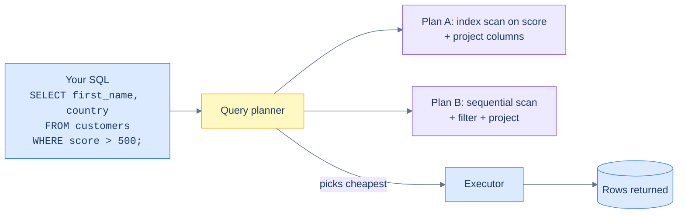
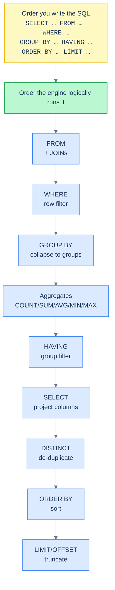

# 1. Introduction to SQL

## The Hook

A product manager walks up to your desk on a Friday at 4:45 p.m.

"Quick one — how many orders did we get from German customers last month?"

You have access to the production database. The data is in there. You don't have a dashboard for this; nobody's built one. You don't have time to build one. The PM is waiting.

If you don't know SQL, the answer to this question is "let me get back to you Monday." You'll write a script that opens a database connection, pulls every order into your program's memory, joins it against the customer table, filters by country, filters by date, and counts. Twenty lines, an hour to write, ten minutes to run, two more rounds of "actually I also need…".

If you know SQL, the answer is six lines, eight seconds, before the PM finishes their next sentence:

```sql run
-- Sample schema bundled inline so the block is self-contained.
CREATE TABLE customers (id INT, first_name TEXT, country TEXT, score INT);
CREATE TABLE orders (order_id INT, customer_id INT, order_date DATE, sales INT);
INSERT INTO customers VALUES (1,'Maria','Germany',350),(2,'John','USA',900),(3,'Georg','UK',750),(4,'Martin','Germany',500),(5,'Peter','USA',0);
INSERT INTO orders VALUES
  (1001,1,'2026-04-03',120),(1002,1,'2026-04-15',80),(1003,2,'2026-04-22',450),
  (1004,3,'2026-04-28',200),(1005,4,'2026-05-01',300),(1006,9,'2026-05-04',150);

-- The PM's question. Click ▶ to see the answer the database gives.
SELECT COUNT(*) AS german_orders_in_april
FROM orders o
JOIN customers c ON c.id = o.customer_id
WHERE c.country = 'Germany'
  AND o.order_date >= '2026-04-01'
  AND o.order_date <  '2026-05-01';
```

The gap between those two responses is what this section of the book is about. It's not the syntax — the syntax of `SELECT … FROM … WHERE …` is the easy part, and you'll absorb it within the first three chapters. The gap is **knowing how to *think* in terms of sets of rows, predicates, and projections**, instead of loops and arrays. That's the muscle SQL builds. Once you have it, every database question collapses from "let me write a script" to "let me write a query."

This chapter sets up the language. What SQL is. Why it's *declarative* and what that buys you. The relational model in fifteen lines. The eight-step **logical execution order** that drives every SELECT you'll ever read. And the three-table sample schema (`customers`, `orders`, `hello_events`) that every chapter in this book uses, so you can run any query in any chapter against the same data.

If you read no other chapter in the Foundations module, read this one — and read the *Logical execution order* section twice.

---

## Table of contents

1. [What SQL is](#what-sql-is)
2. [Declarative, not imperative](#declarative-not-imperative)
3. [The relational model in fifteen lines](#the-relational-model-in-fifteen-lines)
4. [The five families of SQL statements](#the-five-families-of-sql-statements)
5. [The logical execution order — FWGHD](#the-logical-execution-order)
6. [Anatomy of a SQL statement](#anatomy-of-a-sql-statement)
7. [The sample schema used across this book](#the-sample-schema)
8. [Edge cases and pitfalls](#edge-cases-and-pitfalls)
9. [Production reality](#production-reality)
10. [Practice ladder](#practice-ladder)
11. [Cross-links](#cross-links)
12. [Final takeaway](#final-takeaway)

***

# What SQL is

SQL — pronounced "sequel" or "S-Q-L", both are correct, and senior engineers routinely flip between the two mid-sentence — stands for **Structured Query Language**. It's the language databases speak.

That definition is correct but useless. Here's the more useful definition: SQL is a language for **asking sets of rows questions about themselves**. You point it at a table (or several tables joined together), describe the rows you care about, describe the shape you want the answer in, and the database figures out *how* to fetch them. You never tell it which file on disk to open, which index to use, what order to scan in, or how to merge results from two tables. You describe the *what*; the database picks the *how*.

That's an enormous abstraction. A modern relational database like PostgreSQL is millions of lines of code dedicated to picking the *how* well. The query planner reads your SQL, considers dozens of possible execution plans (sequential scan? index lookup? hash join? merge join?), estimates the cost of each based on table statistics, and picks the cheapest one. You wrote six lines. The planner spent maybe a millisecond turning those into the actual execution.

This is why a SQL programmer who has *never* thought about how the database works can still write fast queries 90% of the time. The planner does most of the lifting. The other 10% — when the planner picks badly, when statistics are stale, when the query shape blocks an index, when a JOIN explodes from a million rows to a billion — is what the [Indexes and Performance](/cortex/languages/sql/index) module of this book teaches you to debug. But you can be productive long before then.

**A first SQL query you can read — and run — right now:**

```sql run
CREATE TABLE customers (id INT, first_name TEXT, country TEXT, score INT);
INSERT INTO customers VALUES (1,'Maria','Germany',350),(2,'John','USA',900),(3,'Georg','UK',750),(4,'Martin','Germany',500),(5,'Peter','USA',0);

SELECT first_name, country
FROM customers
WHERE score > 500;
```

Read aloud: "Give me the `first_name` and `country` columns, from the `customers` table, but only for the rows where `score > 500`." That's the model. You're not iterating; you're describing. Click ▶ Run; edit the predicate; run it again. **Every code block in this book with a Run button is a real database** — your edits land in an isolated SQLite session that runs your query and prints the result.

---

# Declarative, not imperative

Imperative code says *how*:

```python
results = []
for customer in customers:
    if customer.score > 500:
        results.append((customer.first_name, customer.country))
```

You wrote the loop. You wrote the condition. You wrote the append. If `customers` is in a database you'd also write the file open, the deserialisation, and the close. You're directing the machine step by step.

Declarative SQL says *what*:

```sql
SELECT first_name, country
FROM customers
WHERE score > 500;
```

Same answer. No loop. No append. No file handles. You named the columns you want, the table they come from, and the condition the rows must satisfy. The database picks the loop, picks the order, picks whether to use the index on `score` or scan the whole table, picks how to deliver results back to your client.

That difference is the central thing about SQL. It's why a six-line SQL query can replace twenty lines of Python — you're skipping all the *how*. It's also why SQL has a learning curve that surprises people: the *what*-only mindset is a different mode of thinking from the *how*-by-default mode every imperative language teaches.



<p align="center"><strong>The query planner is the bridge between declarative SQL and the actual loop that runs. You don't see it. It runs once per query, picks the cheapest plan from a search space of dozens, and hands the plan to the executor. The plan you'd have written by hand in Python is hidden inside that orange box.</strong></p>

The flip side: when the planner picks badly, the abstraction leaks. Your "what" hasn't changed, but the "how" silently went from milliseconds to minutes. Senior SQL engineers spend most of their performance work *learning to predict what the planner will do* and adjusting the query (or the schema, or the indexes) when it picks the wrong plan. That's a topic for [EXPLAIN and query plans](/cortex/languages/sql/index); for now, just internalise that the abstraction is leaky and that's *okay*.

---

# The relational model in fifteen lines

Everything in a relational database is a **table**. A table is a grid of **rows** and **columns**, and that's it. There are no nested objects, no arrays-of-arrays, no XML inside cells (well — you *can* put JSON inside a cell in modern Postgres, and a later chapter shows when to and when not to).

- A **column** is an attribute. `first_name`, `country`, `score`. Each column has a **type**: text, integer, date, boolean, etc. The type is fixed for the column — every row has a `score` of the same type.
- A **row** is a record. One customer. One order. One event.
- A **primary key** is the column (or columns) that uniquely identify a row. `customers.id` is the primary key of the customers table — every customer has a different `id`, and you can find any customer by their `id` in `O(log n)` time using the index the database automatically builds for primary keys.
- A **foreign key** is a column that *points* to a primary key in another table. `orders.customer_id` is a foreign key referencing `customers.id`. That's how relationships are modelled — not by nesting orders inside customers, but by giving each order a customer ID that says "this order belongs to that customer."

That's it. Fifteen lines, the entire relational model. Everything fancier — joins, set operators, indexes, transactions — is an operation *on* tables, not a richer structure than tables.

If this looks austere, it is. The whole point of relational databases is that this restriction (tables, rows, columns, no nesting) is *liberating*. You can ask questions that the original schema designer never thought to ask, because the data isn't pre-arranged into one access pattern. Want orders grouped by country? `JOIN orders ON customers, GROUP BY country`. Want customers who haven't ordered in six months? Anti-join. The data doesn't change; the questions do; SQL is the language for asking them.

---

# The five families of SQL statements

SQL statements fall into five families. You'll meet all of them in this book.

| Family | Stands for | What it does | Examples |
|---|---|---|---|
| **DQL** | Data Query Language | Read data | `SELECT` |
| **DML** | Data Manipulation Language | Modify data | `INSERT`, `UPDATE`, `DELETE`, `MERGE` |
| **DDL** | Data Definition Language | Define and change schema | `CREATE`, `ALTER`, `DROP`, `TRUNCATE` |
| **TCL** | Transaction Control Language | Group statements into atomic transactions | `BEGIN`, `COMMIT`, `ROLLBACK`, `SAVEPOINT` |
| **DCL** | Data Control Language | Manage access control | `GRANT`, `REVOKE` |

The first three are what 95% of application code uses. Most of this book is about DQL — `SELECT` and its many variations. DML gets a chapter ([Data Manipulation](/cortex/languages/sql/foundations/data-manipulation)). DDL gets a chapter and a deeper module ([Data Definition](/cortex/languages/sql/foundations/data-definition), [Schema and Constraints](/cortex/languages/sql/index)). TCL is foundational for [Transactions and Concurrency](/cortex/languages/sql/index). DCL is operational and out of scope for this book — most engineers configure access via Terraform, Liquibase, or a cloud console, not by hand-writing `GRANT`.

> *Predict before reading on:* without scrolling, which family does each of these belong to?
>
> - `DROP TABLE customers;`
> - `INSERT INTO orders VALUES (...)`
> - `SELECT 1;`
> - `COMMIT;`
>
> Answers: DDL, DML, DQL, TCL.

---

# The logical execution order

This is the highest-leverage idea in SQL. If you take one thing from this chapter, take this.

You **write** a SELECT in this order:

```sql
SELECT    column_list
FROM      table(s) and joins
WHERE     row predicates
GROUP BY  grouping columns
HAVING    group predicates
ORDER BY  sort keys
LIMIT     row count
```

But the database **logically processes** it in *this* order:

1. **`FROM`** — pick the table(s); apply joins; produce a virtual table of all source rows.
2. **`WHERE`** — filter that virtual table row by row; rows where the predicate is `false` or `NULL` get dropped.
3. **`GROUP BY`** — collapse remaining rows into groups by the grouping columns.
4. **Aggregates** — for each group, compute `COUNT()`, `SUM()`, `AVG()`, etc.
5. **`HAVING`** — filter groups using the aggregates from step 4.
6. **`SELECT`** — project the columns and expressions you asked for. Aliases are bound here.
7. **`DISTINCT`** — drop duplicate rows from the projection.
8. **`ORDER BY`** — sort.
9. **`LIMIT` / `OFFSET` / `FETCH`** — keep only N rows.

This is the **logical** order. The actual *physical* order of execution can be wildly different — the planner reorders steps for efficiency, pushes filters down into joins, pre-aggregates in parallel, and so on. But every legal optimisation has to *produce the same answer* as if it had run in the logical order. So the logical order is what determines what's *legal* to write, even if the planner reshuffles it under the hood.



<p align="center"><strong>The order you write a query and the order the engine logically runs it are not the same. WHERE runs before SELECT — which is why you can't reference a SELECT alias in a WHERE clause. ORDER BY runs after SELECT — which is why you can.</strong></p>

## Why this matters in practice

Once you have this order in your head, three classes of "this query won't compile and I don't know why" errors disappear:

**(a)** **You cannot use an aggregate in `WHERE`.**

```sql
-- ❌ ERROR: aggregate functions are not allowed in WHERE
SELECT customer_id, COUNT(*) AS order_count
FROM orders
WHERE COUNT(*) > 5
GROUP BY customer_id;
```

`WHERE` runs at step 2; aggregates compute at step 4. The aggregate doesn't exist yet. Use `HAVING` instead — it runs at step 5, after aggregates have computed.

```sql
-- ✅ correct
SELECT customer_id, COUNT(*) AS order_count
FROM orders
GROUP BY customer_id
HAVING COUNT(*) > 5;
```

**(b)** **You usually cannot reference a `SELECT` alias in `WHERE`.**

```sql
-- ❌ ERROR (in standard SQL, including Postgres): column "score_band" does not exist
SELECT first_name,
       CASE WHEN score > 750 THEN 'high'
            WHEN score > 250 THEN 'mid'
            ELSE 'low' END AS score_band
FROM customers
WHERE score_band = 'high';
```

`WHERE` runs at step 2; aliases bind at step 6. The alias doesn't exist yet either. Either repeat the expression in `WHERE`, or wrap the whole thing in a subquery / CTE so the alias exists before the outer `WHERE` runs.

> **Dialect note:** MySQL is unusually lenient and *does* let you reference SELECT aliases in WHERE in some versions. PostgreSQL, SQLite, and SQL Server enforce the standard. Don't rely on the MySQL-specific leniency — it'll bite you when you change engines.

**(c)** **You *can* reference a `SELECT` alias in `ORDER BY`.**

```sql
-- ✅ this works everywhere
SELECT first_name, score * 0.1 AS bonus
FROM customers
ORDER BY bonus DESC;
```

`ORDER BY` runs at step 8, after `SELECT` has bound the alias at step 6. The alias is in scope.

## The mnemonic

Memorising the order helps. The note-book material this chapter inherits proposes:

> **F**resh **W**ater **G**ets **A**thletes **H**ydrated **S**o **D**on't **O**ver **T**rain.
>
> FROM → WHERE → GROUP BY → Aggregates → HAVING → SELECT → DISTINCT → ORDER BY → TOP/LIMIT

Pick a mnemonic, write it on a sticky note, glance at it every time a query won't compile. Within a few weeks you'll never need it again — the order will be in your fingertips. But until then, this is your most useful debugging tool.

---

# Anatomy of a SQL statement

Before we move on, a brief vocabulary tour. Every SQL statement is built from the same primitives:

```sql
-- Customers from a country, with their names lowercased.
SELECT first_name, LOWER(country) AS country_lower
FROM customers
WHERE country = 'Italy';
```

| Piece | What it is | In this query |
|---|---|---|
| **Comment** | Ignored by the engine | `-- Customers from a country, …` |
| **Clause** | A keyword + the thing it operates on | `SELECT first_name, LOWER(country) AS country_lower` |
| **Keyword** | A reserved word | `SELECT`, `FROM`, `WHERE`, `AS` |
| **Identifier** | A name (table, column, alias) | `first_name`, `country`, `customers`, `country_lower` |
| **Function call** | A built-in operation on values | `LOWER(country)` |
| **Operator** | An expression-level operator | `=` |
| **Literal** | A constant value | `'Italy'` |
| **Alias** | A new name for a column or table | `country_lower` (column alias, via `AS`) |

Three small conventions worth picking up early:

- **Keywords are conventionally written in UPPERCASE** (`SELECT`, not `select`). They're case-insensitive in every major dialect, but the convention helps queries skim faster. This book uses uppercase keywords throughout.
- **Identifiers are conventionally written in `snake_case`** (`first_name`, not `firstName`). Postgres folds unquoted identifiers to lowercase by default, which makes camelCase fragile.
- **Strings use single quotes** (`'Italy'`, not `"Italy"`). Double quotes are reserved for identifiers in standard SQL — a misplaced double quote will give you a "column does not exist" error that takes ten minutes to debug if you haven't been bitten by it before.

---

# The sample schema

Every chapter in this book uses one shared schema. Defining it once lets later chapters jump straight to the new idea without re-introducing tables. The schema is small enough to keep in your head and rich enough to demonstrate joins, aggregation, time-series queries, and JSON.

## The three tables

The block below is the canonical schema. **Click ▶ Run** to seed an empty SQLite, then `SELECT * FROM …` any of the three tables to see the data.

```sql run
-- =============================================================
-- customers — five customers across three countries.
-- =============================================================
CREATE TABLE customers (
    id          INT  NOT NULL PRIMARY KEY,
    first_name  TEXT NOT NULL,
    country     TEXT,
    score       INT
);

INSERT INTO customers (id, first_name, country, score) VALUES
    (1, 'Maria',  'Germany', 350),
    (2, 'John',   'USA',     900),
    (3, 'Georg',  'UK',      750),
    (4, 'Martin', 'Germany', 500),
    (5, 'Peter',  'USA',       0);

-- =============================================================
-- orders — six orders, one customer with no orders, one order
-- by a customer not in `customers` (orphan FK by design — we
-- want to demonstrate referential-integrity questions in later
-- chapters).
-- =============================================================
CREATE TABLE orders (
    order_id     INT  NOT NULL PRIMARY KEY,
    customer_id  INT  NOT NULL,
    order_date   DATE NOT NULL,
    sales        INT  NOT NULL
);

INSERT INTO orders (order_id, customer_id, order_date, sales) VALUES
    (1001, 1, '2026-04-03',  120),
    (1002, 1, '2026-04-15',   80),
    (1003, 2, '2026-04-22',  450),
    (1004, 3, '2026-04-28',  200),
    (1005, 4, '2026-05-01',  300),
    (1006, 9, '2026-05-04',  150);  -- customer 9 doesn't exist; intentional.

-- =============================================================
-- hello_events — append-only event log of /api/hello calls,
-- modelled after codefolio's own MongoDB hello_events collection
-- but represented here as a SQL table for SQL purposes.
-- Realistic time-series data for window-function and JSON chapters.
-- =============================================================
CREATE TABLE hello_events (
    id            BIGINT NOT NULL PRIMARY KEY,
    timestamp_ms  BIGINT NOT NULL,
    visits        INT    NOT NULL
);

INSERT INTO hello_events (id, timestamp_ms, visits) VALUES
    (1, 1714766400000,  1),  -- 2024-05-03 16:00:00 UTC
    (2, 1714766402000,  2),
    (3, 1714766415000,  3),
    (4, 1714770000000,  4),  -- 2024-05-03 17:00:00 UTC
    (5, 1714770010000,  5),
    (6, 1714773600000,  6);  -- 2024-05-03 18:00:00 UTC

-- Verify all three tables loaded; expect: 5 customers, 6 orders, 6 events.
SELECT 'customers' AS tbl, COUNT(*) AS rows FROM customers
UNION ALL SELECT 'orders',       COUNT(*) FROM orders
UNION ALL SELECT 'hello_events', COUNT(*) FROM hello_events;
```

> Each runnable block in this book is **isolated** — your changes in one block don't carry into the next. Every block that depends on the schema repeats a compact CREATE/INSERT preamble at the top so you can run any block in any order. The full schema above is the canonical reference.

## What each table is for

- **`customers`** — five rows, three countries. Small enough that you can hold every row in your head when reasoning about a query. Five customers gives us enough variety for filtering, grouping, and joining without overwhelming the page.
- **`orders`** — six rows. Notice **customer 5 (Peter) has no orders** — that's deliberate, so anti-joins and `LEFT JOIN`s have something to demonstrate. Notice **order 1006 references customer_id 9 which doesn't exist** — also deliberate, so referential-integrity chapters have a real example. Real schemas constrain this with a foreign key; we'll add the constraint in [Schema and Constraints](/cortex/languages/sql/index) and watch the orphan row fail to insert.
- **`hello_events`** — six rows representing six `/api/hello` requests across three hour-buckets. Realistic time-series shape. Used for [Window Functions](/cortex/languages/sql/index), [Time-series patterns](/cortex/languages/sql/index), and [JSON in SQL](/cortex/languages/sql/index) chapters.

## Why this schema

Three reasons.

1. **It maps directly to codefolio's actual stack.** `hello_events` is real — it's the MongoDB collection in [`server/src/main/scala/codefolio/server/helloPipeline/`](https://github.com/) that stores every `/api/hello` request. Bringing it into the SQL curriculum means the production-reality sections of later chapters can show real query plans against real data shapes.
2. **It's small.** Fewer tables than a textbook example, smaller rows than a sample-database download. You can `SELECT *` from any table in this book and the page won't scroll.
3. **It's adversarial in good ways.** A customer with no orders. An order with no matching customer. NULL countries. Zero scores. Each "weird" data point exists because some chapter uses it to demonstrate an edge case.

When a chapter introduces a query, assume these tables are loaded with the data above unless the chapter explicitly seeds different data.

---

# Edge cases and pitfalls

A handful of "gotchas" that catch every SQL beginner and a non-trivial number of senior engineers. Mentioned briefly here; each gets a deeper treatment in its own chapter.

## SQL is case-insensitive, except where it isn't

- **Keywords** are case-insensitive: `SELECT` and `select` and `SeLeCt` all work.
- **Unquoted identifiers** are case-insensitive *but folded to lowercase* in Postgres: `Customers` and `customers` and `CUSTOMERS` all refer to the same table; internally Postgres stores it as `customers`.
- **Quoted identifiers** (with `"double quotes"`) are case-sensitive: `"Customers"` and `"customers"` are *different* tables. Avoid quoting identifiers unless you have a reason.
- **String literals** are *value*-case-sensitive on `=`: `WHERE country = 'germany'` will not match `'Germany'`. Use `LOWER()` on both sides if you don't care about case.

## NULL is not "no value", it's "unknown"

`NULL` doesn't equal anything — not even another `NULL`. `WHERE x = NULL` is *never true*, even when `x` is `NULL`. Use `WHERE x IS NULL` instead. This is the single most common bug in beginner SQL, and the [NULL and three-valued logic](/cortex/languages/sql/index) chapter is dedicated entirely to it.

## `SELECT *` is fine to type, dangerous to ship

`SELECT *` is unfussy when you're exploring data interactively — perfect for `psql` at 4 p.m. on a Friday. In production code, it's a footgun. If a future migration adds a column, your `SELECT *` quietly returns a wider result, breaking client code that expected a fixed shape. Production SQL in shipped code should always list columns explicitly. We'll show both styles in this book; assume the shipped style unless we say otherwise.

## Semicolons matter, sort of

Every SQL statement ends with a semicolon. In an interactive shell or a query file, the semicolon is what separates one statement from the next — without it, the engine waits for more input. Inside a programmatic API (JDBC, `psycopg2`, libpq) the semicolon is *optional* because the API knows where the statement ends. This book uses semicolons throughout, which is the safe default.

## A query against an empty table returns an empty result, not an error

```sql
SELECT * FROM customers;
```

…against a table with no rows returns zero rows, not an error. SQL is a *set*-oriented language; the empty set is a valid set. Beginner code often forgets this and crashes on `KeyError` after a fetchone-style call.

---

# Production reality

Where does this all live in the actual codefolio stack?

**The Postgres instance** is started by [`docker compose up db`](https://github.com/) — the `db` service in [`docker-compose.yml`](https://github.com/) runs PostgreSQL 16 with a persistent volume. It listens on `localhost:5432` in dev. The codefolio server connects via HikariCP (see [`server/src/main/scala/codefolio/server/db/`](https://github.com/)) and runs raw `PreparedStatement`s — no ORM in the way, so the SQL you see in the source code is the SQL the planner sees.

**Schema migrations** live in [`server/src/main/resources/db/`](https://github.com/) and are applied by Liquibase at server startup. The actual `visits` table that backs `/api/hello` is defined there:

```sql
CREATE TABLE visits (
    id    INT GENERATED ALWAYS AS IDENTITY PRIMARY KEY,
    count BIGINT NOT NULL DEFAULT 0
);
INSERT INTO visits (count) VALUES (0);
```

That's a real production table. It has one row. Every `/api/hello` request runs `UPDATE visits SET count = count + 1 RETURNING count;` — DML against a one-row table to atomically increment a counter. Two SQL features in one statement: the `UPDATE` and the `RETURNING` clause that gives you the new value back without a second query. We'll meet `RETURNING` properly in [Data Manipulation](/cortex/languages/sql/foundations/data-manipulation).

**The `psql` shell** is your friend. From the codefolio repo root:

```bash
docker compose exec db psql -U codefolio
```

drops you into a PostgreSQL prompt connected to the running database. Try the queries from this book there. `\d customers` shows the schema of a table; `\l` lists databases; `\?` lists every shell command; `\h SELECT` shows the syntax for any SQL statement.

**Swagger UI** at `http://localhost:8080/docs/` and the `/api/hello` endpoint behind it are running real SQL right now, against the running Postgres. Hit `/api/hello` a few times, then `SELECT * FROM visits;` — the count is the same number Swagger just returned to you. That's the round trip from HTTP to SQL.

You don't need to follow any of these production details to write SQL — the syntax is the same against any Postgres database. But knowing where it lives in the actual stack you're working in turns SQL from "language I learn for interviews" into "tool I use every day", and that shift in attitude is most of the battle.

---

# Practice ladder

Each problem below has a hint, not a solution. The point is to make you flex the muscle, not to read code. Spin up `psql` (instructions in *Production reality* above), seed the sample schema, and try.

1. **List the names of every customer.** *Hint: one column, one table, no filter.*
2. **List the names of every customer in Germany.** *Hint: add a `WHERE` to (1).*
3. **Count how many customers there are.** *Hint: `COUNT(*)` returns one row, not many.*
4. **Count how many customers there are per country.** *Hint: which clause makes the result one row per country?*
5. **List the names and countries, with the country in lowercase, of customers whose score is above 500.** *Hint: this combines projection (column expressions in `SELECT`) and filtering (`WHERE`). The function for lowercase is `LOWER()`.*
6. **Without running it, predict whether this query is legal:**
   ```sql
   SELECT first_name AS name
   FROM customers
   WHERE name = 'Maria';
   ```
   *Hint: in which logical step does `WHERE` run, and in which logical step does the alias `name` get bound? If the alias hasn't been bound when `WHERE` runs, what error do you expect?*
7. **Without running it, predict whether this query is legal:**
   ```sql
   SELECT customer_id, SUM(sales) AS total
   FROM orders
   WHERE total > 200
   GROUP BY customer_id;
   ```
   *Hint: same shape as (6) but the unbound name is an aggregate alias. Same logical step. What's the right keyword to filter aggregates?*

***

# Cross-links

- **Next in this module:** [SELECT and Projection](/cortex/languages/sql/foundations/select-and-projection) — the column-list half of the FROM/SELECT pair, including aliases, computed columns, `DISTINCT`, and the alias-namespace trap from problem (6) above.
- **Then:** [Filtering](/cortex/languages/sql/foundations/filtering) — `WHERE` properly: comparison, range, set-membership, pattern-matching predicates, and the NULL trap.
- **Cited from every later chapter** — the *logical execution order* in this chapter is the single most-referenced idea in the rest of the SQL book. Every join chapter, every aggregation chapter, every window-function chapter assumes you have it in your fingertips.
- **DSA cross-reference:** the relational model rests on the [Hash Table](/cortex/data-structures-and-algorithms/linear-structures-hash-table-introduction-to-hash-tables) and [B-Tree](/cortex/data-structures-and-algorithms/trees/b-tree/introduction-to-b-trees) chapters from the DSA book — the two data structures that make primary-key lookups fast. You don't need to read those to write SQL, but if you want to know *why* an indexed lookup is `O(log n)` instead of `O(n)`, that's where to start.

***

# Final Takeaway

SQL is not just "the syntax for talking to a database." It's a particular *way of thinking* about data — declarative, set-oriented, no loops — that pays off the moment you stop fighting it. Three patterns to internalise:

1. **You describe *what*, not *how*.** The planner picks the loop, the index, the join order, the parallelism. You name the columns, the table, and the condition. The skill is learning to *trust* the planner 90% of the time and to *override* it with intent the other 10%.
2. **The logical execution order — `FROM → WHERE → GROUP BY → Aggregates → HAVING → SELECT → DISTINCT → ORDER BY → LIMIT` — is the mental model that explains every "why won't this query compile" error you'll hit in your first month.** Memorise it, write it on a sticky note, and refer back until it's automatic.
3. **The relational model is austere on purpose.** Tables, rows, columns, primary keys, foreign keys. No nesting. The constraint is what lets the *same data* answer questions the original schema designer never anticipated — which is the entire point of using a relational database in the first place.

Master those three and the rest of this curriculum — every join, every aggregate, every window — falls into place.

## Your Turn

Before you move on, check your understanding with the coach — explain the idea, apply it, weigh the trade-offs, then defend your reasoning.

<div class="concept-coach"></div>
