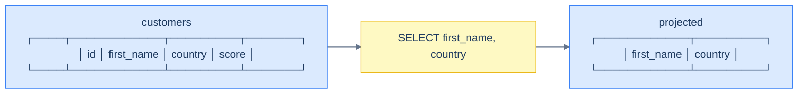
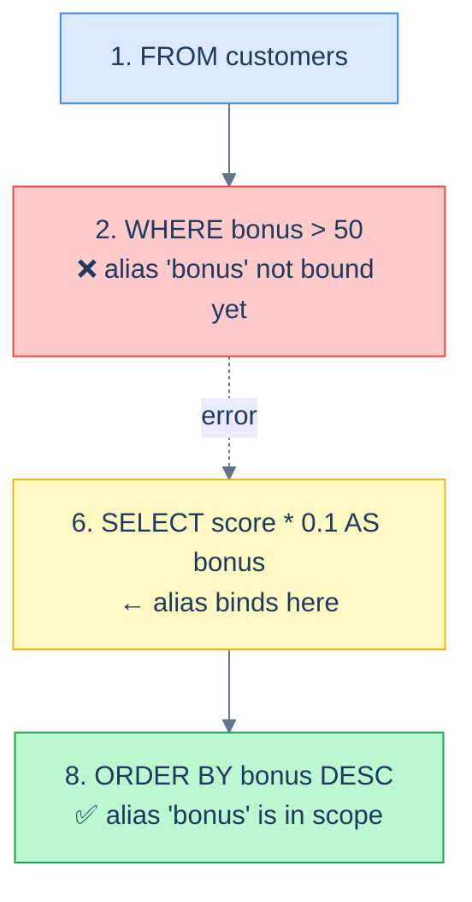

# 1. SELECT and Projection

## The Hook

A junior engineer's first SQL query, three days into the job:

```sql
SELECT * FROM customers WHERE country = 'Germany';
```

Two German customers come back. Five columns each. Twelve values. They send a screenshot to Slack. PR merged.

Six months later, a migration adds an `email` column to `customers`. Production code does `customer = result.fetchone(); first_name, country, score = customer`. The migration ships. Production explodes. Three values won't unpack into a four-tuple. Pager goes off at 2 a.m.

The first line of that fix is a `git log -p` showing what changed. The second line is a `SELECT * FROM customers` from six months ago, ten lines into the unpack. That is the entire incident. A single character — the `*` — turned into a contract that nobody updated.

This chapter is about the column list — the half of a query that lives between `SELECT` and `FROM`. It's the simplest part of SQL to learn and the part where the most production-grade habits get formed. The shape of your column list determines whether your query is a *throwaway exploration* or a *contract that other code depends on*. Both are valid; this chapter teaches you to know which one you're writing.

By the end you'll know the difference between a column reference and an expression, when an alias is required versus optional, what `DISTINCT` actually de-duplicates, and the one trap involving aliases that catches every junior engineer at least once.

---

## Table of contents

1. [What projection means](#what-projection-means)
2. [Column expressions](#column-expressions)
3. [Aliases — `AS`, why, and when](#aliases)
4. [`SELECT *` — fine to type, dangerous to ship](#select-star)
5. [Qualifying column names](#qualifying-column-names)
6. [`DISTINCT` — what it actually de-duplicates](#distinct)
7. [The alias-namespace trap](#the-alias-namespace-trap)
8. [Edge cases and pitfalls](#edge-cases-and-pitfalls)
9. [Production reality](#production-reality)
10. [Practice ladder](#practice-ladder)
11. [Cross-links](#cross-links)
12. [Final takeaway](#final-takeaway)

***

# What projection means

In relational algebra, **projection** is the operation that picks columns out of a table. The original table has columns A, B, C, D, E; you project A and C; you get a new table with only columns A and C.

That's what `SELECT first_name, country FROM customers;` does. Project the `customers` table down to two columns.



<p align="center"><strong>Projection slices columns. WHERE slices rows. They're orthogonal — projection narrows the table sideways, filtering narrows it lengthways.</strong></p>

Projection in SQL is more flexible than projection in pure relational algebra: you can project not just *columns*, but **column expressions** — anything that produces a value from the row. Arithmetic, string concatenation, function calls, conditional expressions, even constants. The `SELECT` clause is "what you want each output row to look like, computed from the input row."

```sql run
CREATE TABLE customers (id INT, first_name TEXT, country TEXT, score INT);
INSERT INTO customers VALUES (1,'Maria','Germany',350),(2,'John','USA',900),(3,'Georg','UK',750),(4,'Martin','Germany',500),(5,'Peter','USA',0);

-- Five different output columns, all computed from the input row.
SELECT id,                                             -- a column reference
       first_name || ' from ' || country AS bio,       -- string concatenation
       score * 1.0 / 1000.0 AS score_pct,              -- arithmetic
       UPPER(first_name) AS shouted_name,              -- function call
       'customer' AS row_type                          -- constant
FROM customers;
```

Each output row has five fields. None of them have to be column references; only the first one is. The other four are *derived*. SQL doesn't distinguish between "real" columns and "computed" columns in the result — both are just columns of the output.

---

# Column expressions

A column expression is anything that evaluates to a value when applied to a row. There are five kinds you'll meet daily.

## Column references

The most basic: just the column name.

```sql
SELECT first_name, country, score FROM customers;
```

Three column references. The result has three columns, named `first_name`, `country`, `score`.

## Literals

Constant values. Useful when you want to inject a tag into output rows or pad a value.

```sql
SELECT 'customer' AS row_type, first_name FROM customers;
```

Every output row has `row_type = 'customer'`. The literal is the same in every row; it doesn't depend on the input.

This shows up in production code more than you'd expect — when you `UNION ALL` two tables together to combine "customers" and "leads" into one result, a literal column tags which table each row came from.

## Arithmetic

```sql
SELECT first_name, score, score * 0.1 AS bonus
FROM customers;
```

Standard arithmetic operators: `+`, `-`, `*`, `/`, `%` (modulo), `^` (exponent in Postgres; varies by dialect). Integer division behaves the way C/Java do: `7 / 2 = 3`, not `3.5`. To force a real-number division, cast one operand: `score * 1.0 / 1000` or `CAST(score AS DECIMAL) / 1000`.

> **Dialect note:** SQL Server's `/` on integers returns an integer too. SQLite returns a real number. Postgres returns an integer. When you're not sure, cast — it's free and explicit.

## String operations

The standard string-concatenation operator is `||`:

```sql
SELECT first_name || ' from ' || country AS bio
FROM customers;
```

Returns `'Maria from Germany'`, `'John from USA'`, etc.

> **Dialect note:** SQL Server uses `+` for string concatenation, not `||`. MySQL uses `CONCAT(a, b, c)`. Postgres and SQLite use `||`. The Postgres-canonical syntax in this book is `||`. If you switch to MySQL, swap to `CONCAT()`.

A subtlety: `||` propagates `NULL`. `'hello' || NULL` is `NULL`, not `'hello'`. If `country` is `NULL` for a customer, the entire `bio` for that row is `NULL`. Use `COALESCE(country, 'unknown')` to substitute a default. We'll meet `COALESCE` properly in [NULL and three-valued logic](/cortex/languages/sql/index).

## Function calls

```sql
SELECT first_name,
       LOWER(first_name) AS lower_name,
       LENGTH(first_name) AS name_len,
       UPPER(country) AS country_upper
FROM customers;
```

Hundreds of built-in functions ship with Postgres — string functions (`UPPER`, `LOWER`, `LENGTH`, `SUBSTRING`, `TRIM`, `REPLACE`), numeric functions (`ABS`, `ROUND`, `CEIL`, `FLOOR`), date functions (`NOW`, `DATE_TRUNC`, `EXTRACT`, `AGE`), conversion functions (`CAST`, `TO_CHAR`, `TO_NUMBER`). The [Row Functions](/cortex/languages/sql/index) module of this book is dedicated to them.

For now: a function call inside `SELECT` produces a value per row, just like a column reference does. The result is a new column.

## Conditional expressions: `CASE`

A `CASE` expression is the SQL equivalent of an `if/else` chain:

```sql run
CREATE TABLE customers (id INT, first_name TEXT, country TEXT, score INT);
INSERT INTO customers VALUES (1,'Maria','Germany',350),(2,'John','USA',900),(3,'Georg','UK',750),(4,'Martin','Germany',500),(5,'Peter','USA',0);

SELECT first_name, score,
       CASE
         WHEN score > 750 THEN 'high'
         WHEN score > 250 THEN 'mid'
         ELSE 'low'
       END AS score_band
FROM customers;
```

Output:

```
 first_name | score | score_band
------------+-------+------------
 Maria      |   350 | mid
 John       |   900 | high
 Georg      |   750 | mid
 Martin     |   500 | mid
 Peter      |     0 | low
```

A `CASE` evaluates each `WHEN` clause top-to-bottom and returns the first one whose condition is true; if none match and there's an `ELSE`, the `ELSE` value; if none match and there's no `ELSE`, the result is `NULL`. The [CASE Expressions](/cortex/languages/sql/index) chapter goes deep; for projection purposes, just know that `CASE` is a value-producing expression, so you can put it anywhere a column reference can go.

---

# Aliases

An **alias** is a new name for a column expression. The keyword is `AS`, though it's optional in most dialects:

```sql
-- with AS
SELECT first_name AS name, score * 0.1 AS bonus FROM customers;

-- without AS (also legal)
SELECT first_name name, score * 0.1 bonus FROM customers;
```

Both produce a result with columns `name` and `bonus`. The `AS` is conventionally used because skipping it is *legal but ambiguous-looking* — `SELECT first_name name` looks like a typo. **This book uses `AS` everywhere except for table aliases (where it's conventionally dropped — see [Joins](/cortex/languages/sql/index)).**

## When you *need* an alias

Three situations require an alias:

**(1) When the expression has no natural name.** A computed column needs a name in the result. Without an alias, the dialect picks something — Postgres might call it `?column?`, SQL Server might call it `(No column name)`. Either is unhelpful.

```sql
-- ❌ result has a column literally named "?column?"
SELECT score * 0.1 FROM customers;

-- ✅ result has a column named "bonus"
SELECT score * 0.1 AS bonus FROM customers;
```

**(2) When two expressions would otherwise have the same name.** Two columns named `id` after a join is a problem; one of them needs an alias.

```sql
-- ❌ result has two columns both named id; ambiguous on consumption
SELECT customers.id, orders.id FROM customers JOIN orders ...;

-- ✅
SELECT customers.id AS customer_id, orders.id AS order_id FROM customers JOIN orders ...;
```

**(3) When a downstream clause needs to refer to the value.** `ORDER BY` can refer to a `SELECT` alias by name; without the alias, you'd have to repeat the entire expression. (Whether `WHERE` and `HAVING` can refer to aliases is the trap covered in [The alias-namespace trap](#the-alias-namespace-trap) below.)

## Quoted aliases

If you need an alias that contains spaces, special characters, or differs from your normal naming convention, quote it:

```sql
SELECT first_name AS "First Name", country AS "Country" FROM customers;
```

Double quotes (`"…"`) are the standard for quoted identifiers — *not* single quotes. Single quotes are reserved for string literals; using them around an alias is a common SQL Server-ism that doesn't work in standard SQL. **Avoid quoted aliases in shipped code unless you have a presentation reason** — they're brittle and case-sensitive.

---

# `SELECT *`

`SELECT *` returns every column of every source table, in the order they were defined. It's perfect for interactive exploration:

```sql
SELECT * FROM customers;
```

shows every column without you having to remember what's there. Five seconds of typing, the entire table comes back.

In shipped code — application source, scheduled jobs, view definitions, anything that isn't being typed at a `psql` prompt — `SELECT *` is a footgun for three reasons.

**(a) The column list is a contract you didn't realise you wrote.** Application code that does `(first_name, country, score) = row` is *implicitly* relying on the table having exactly those three columns in that order. Add a column to the table and the unpack breaks at runtime, far away from the migration that caused it.

**(b) It returns more data than you need.** If a row has a `BLOB` column with 200 KB of binary data and you only wanted `id`, `SELECT *` pulls the whole 200 KB over the wire. This is invisible in dev with three rows; catastrophic in prod with three million.

**(c) The query plan is harder to optimise.** A planner that knows you only need three columns might be able to use an *index-only scan* — the index has those three columns, no need to visit the heap. With `SELECT *`, the planner has to fetch every column, which means the index-only scan is off the table.

The rule of thumb: **`SELECT *` is fine for exploration. Shipped code lists columns explicitly.** This book uses `SELECT *` in interactive examples and explicit column lists in production-shaped queries.

There's one legitimate `SELECT *` in shipped code — `EXISTS (SELECT * FROM ...)` and `EXISTS (SELECT 1 FROM ...)` are equivalent because the planner ignores the column list inside `EXISTS`. By convention many codebases use `SELECT 1` to make the intent obvious.

```sql
-- Both work; convention prefers SELECT 1
SELECT first_name FROM customers c
WHERE EXISTS (SELECT 1 FROM orders o WHERE o.customer_id = c.id);
```

---

# Qualifying column names

When more than one table is involved, column names can clash. Both `customers` and `orders` could plausibly have an `id` column. To disambiguate, prefix the column name with the table:

```sql
SELECT customers.id, orders.id
FROM customers
JOIN orders ON customers.id = orders.customer_id;
```

Or, more usefully, give each table an alias and prefix columns with the alias:

```sql
SELECT c.id AS customer_id, o.order_id, o.sales
FROM customers AS c
JOIN orders AS o ON c.id = o.customer_id;
```

Two aliases (`c`, `o`) for the two tables. `c.id` is unambiguously the `customers.id`. **Table aliases are conventionally short** — `c`, `o`, `e` — because they're written many times in a single query. Long table aliases (`customers AS customer_table`) hurt more than they help.

> **Style note:** the `AS` between `customers` and `c` is optional and most engineers drop it for table aliases (`FROM customers c`) while keeping it for column aliases (`SELECT name AS n`). This book follows that convention.

When all referenced columns are unambiguous (i.e., only one source table has a column by that name), prefixes are optional. But making a habit of *always* prefixing in multi-table queries makes them easier to read and refactor — six months from now, when you add a third table, you don't have to chase down which `id` belongs to which table.

---

# `DISTINCT`

`DISTINCT` removes duplicate rows from the projection.

```sql run
CREATE TABLE customers (id INT, first_name TEXT, country TEXT, score INT);
INSERT INTO customers VALUES (1,'Maria','Germany',350),(2,'John','USA',900),(3,'Georg','UK',750),(4,'Martin','Germany',500),(5,'Peter','USA',0);

SELECT DISTINCT country FROM customers;
```

Three rows, not five — the duplicate `'Germany'` and `'USA'` are collapsed. Try removing `DISTINCT` and re-running to see all five.

## What "duplicate" means

`DISTINCT` operates on the *entire output row*, not on a single column. These are different:

```sql
-- Distinct countries: 3 rows
SELECT DISTINCT country FROM customers;

-- Distinct (first_name, country) pairs: 5 rows (no two customers share both)
SELECT DISTINCT first_name, country FROM customers;
```

A common beginner mistake: assuming `DISTINCT first_name, country` means "distinct first names, with the country alongside." It doesn't. It means "distinct *pairs* of (first_name, country)". If two customers shared both a first name and a country, only one of those pairs would appear. Otherwise all five.

## When `DISTINCT` is the wrong tool

`DISTINCT` is the right tool when you genuinely have duplicates and you want to drop them. It's the *wrong* tool when you've got duplicates because of a bug in your join — typically a missing or incorrect join condition that's caused a Cartesian explosion.

```sql
-- ❌ "I added DISTINCT to make the duplicates go away"
SELECT DISTINCT c.first_name
FROM customers c, orders o     -- implicit Cartesian product! Buggy join.
WHERE c.country = 'Germany';

-- ✅ "I fixed the join"
SELECT DISTINCT c.first_name
FROM customers c
JOIN orders o ON o.customer_id = c.id
WHERE c.country = 'Germany';
```

Both queries return distinct German first names. The first is a 5×6 = 30-row Cartesian product crammed through `DISTINCT` to give the right answer by accident; it would be slow on real data and would silently break if the same customer ever made the same order twice. **`DISTINCT` is fine in the second query and a smell in the first.** When you find yourself reaching for it, ask: "do I have duplicates because the data is duplicated, or because my join is wrong?" The first is a `DISTINCT` job; the second is a join-fix job.

## `DISTINCT` is sorting in disguise

To return distinct rows, the engine has to compare every row against every other row. The standard implementation is to *sort* the result and emit a row only when it differs from the previous one. So `DISTINCT` is `O(n log n)` work, often more expensive than the rest of the query.

```sql
-- This costs about as much as
SELECT DISTINCT country FROM customers;

-- ...this:
SELECT country FROM customers GROUP BY country;
```

In fact, in Postgres they often produce the *same execution plan*. `GROUP BY` and `DISTINCT` are siblings; `DISTINCT` is short for "GROUP BY every column you selected." Use whichever reads better; performance is the same.

---

# The alias-namespace trap

This is the single most asked-about beginner SQL question, and it's worth understanding deeply because it's the place where the [logical execution order](/cortex/languages/sql/foundations/introduction-to-sql) suddenly *matters*.

## The trap

You write:

```sql
SELECT first_name AS name, score * 0.1 AS bonus
FROM customers
WHERE bonus > 50;
```

You expect: every customer whose `score * 0.1 > 50`, i.e., score > 500.

You get: `ERROR: column "bonus" does not exist`.

## Why

`WHERE` runs at step 2 of the [logical execution order](/cortex/languages/sql/foundations/introduction-to-sql#the-logical-execution-order). Aliases bind in `SELECT`, which is step 6. At step 2, the alias `bonus` doesn't exist yet. The engine doesn't know what you mean.



<p align="center"><strong>Aliases bind at step 6. Anything earlier (FROM, WHERE, GROUP BY, HAVING) cannot reference them. Anything later (ORDER BY, LIMIT) can.</strong></p>

## Three ways to fix it

**(a) Repeat the expression.** The simplest fix:

```sql
SELECT first_name AS name, score * 0.1 AS bonus
FROM customers
WHERE score * 0.1 > 50;
```

`WHERE` references `score` directly. The alias is irrelevant to the filter. This is fine for simple expressions; it gets ugly when the expression is a 20-line `CASE`.

**(b) Use a subquery.** Wrap the projection in a subquery; the alias binds inside, then the outer query filters on it:

```sql
SELECT *
FROM (
  SELECT first_name AS name, score * 0.1 AS bonus
  FROM customers
) c
WHERE c.bonus > 50;
```

Because the inner `SELECT` has already run by the time the outer `WHERE` evaluates, the alias is in scope. We'll meet subqueries properly in [Working with Multiple Tables](/cortex/languages/sql/index).

**(c) Use a CTE.** Same idea as (b), prettier syntax:

```sql
WITH scored AS (
  SELECT first_name AS name, score * 0.1 AS bonus
  FROM customers
)
SELECT * FROM scored WHERE bonus > 50;
```

Common Table Expressions (CTEs) get their own [chapter](/cortex/languages/sql/index). For now: `WITH name AS (subquery) SELECT … FROM name` is a way of naming a sub-result so you can refer to it in the outer query. The alias `bonus` is in scope inside the CTE and inside the outer `SELECT`.

## When aliases *do* work

`ORDER BY` runs at step 8, after `SELECT`. So this works fine:

```sql
SELECT first_name AS name, score * 0.1 AS bonus
FROM customers
ORDER BY bonus DESC;
```

`HAVING` runs at step 5, *before* `SELECT` at step 6 — so by the rules, aliases shouldn't work there either. In standard SQL they don't. Postgres extends this: HAVING *can* reference aggregate-function results from `SELECT`, but only by repeating the expression. For now, when in doubt, use the full expression in `WHERE` and `HAVING`; use the alias in `ORDER BY`.

> **MySQL exception:** MySQL allows aliases in `WHERE` and `HAVING` in some versions. **Don't write code that depends on this.** It's a non-standard extension, doesn't work on Postgres or SQLite or SQL Server, and breaks the moment you change engines. Standard-SQL habit will save you a 3 a.m. debugging session in a year.

---

# Edge cases and pitfalls

## `SELECT` without `FROM`

You can select expressions without any source table:

```sql
SELECT 1 + 1 AS two, NOW() AS now_time, 'hello' AS greeting;
```

Returns one row with three columns. Useful for testing functions interactively, computing values that don't depend on data, or producing a single-row result for a `UNION`. Postgres allows this; SQL Server requires a special `FROM dual`-equivalent (`FROM (SELECT 1) AS x`); MySQL and SQLite allow it like Postgres.

## Column position vs column name

Older SQL allowed `ORDER BY 1, 2` (sort by the first column, then the second). Most engines still support it, including Postgres. **Avoid it in shipped code.** It's brittle: if someone adds a column to your `SELECT`, the position shifts and the ordering changes silently. Reference columns by name or by alias instead. The position syntax is fine for ad-hoc exploration in `psql`.

```sql
-- Fine in psql; not in production code
SELECT first_name, score FROM customers ORDER BY 2 DESC;
```

## Trailing commas are illegal

Unlike Python or modern JS, SQL doesn't tolerate a trailing comma in the column list:

```sql
-- ❌ syntax error
SELECT first_name, country, FROM customers;

-- ✅
SELECT first_name, country FROM customers;
```

This bites everyone who edits a column list and forgets to remove a comma. Many SQL formatters auto-fix it.

## Implicit casts can surprise you

```sql
SELECT '1' = 1 AS result;
```

In Postgres, this is `true` — Postgres implicitly casts the string `'1'` to an integer and compares. In SQLite, it's `false` — SQLite does string comparison and `'1' != 1`. Implicit casts vary across dialects and lead to non-portable code. **Cast explicitly when types are mixed:** `WHERE id = CAST(:input AS INT)` is unambiguous in every dialect.

## NULL in the projection

```sql
SELECT first_name, NULL AS placeholder FROM customers;
```

Returns the customers and a column of `NULL`s. Useful for `UNION ALL` shaping (when one side has a column the other doesn't) and harmless. The column has type "unknown" by default; if you need a specific type, cast: `SELECT first_name, CAST(NULL AS INT) AS placeholder FROM customers;`.

---

# Production reality

Three places where the projection lessons in this chapter show up in real codefolio code.

**(1) The visit-counter increment.** The actual SQL behind `/api/hello`, in [`server/src/main/scala/codefolio/server/helloPipeline/`](https://github.com/), is:

```sql
UPDATE visits SET count = count + 1 RETURNING count;
```

That `RETURNING count` is *projection on a DML statement*. The `UPDATE` modifies the row; the `RETURNING` clause projects the new value back. It's the same projection mental model as `SELECT count FROM visits` — one row, one column — applied to a write instead of a read. The handler reads exactly one column of one row.

**(2) The `hello_events` query for `/api/recent`.** The Mongo-side query that backs `/api/recent` returns `{timestampEpochMs, visits}` for each event — two fields, projected explicitly. If we'd written the SQL equivalent against the `hello_events` table from this book's sample schema:

```sql
SELECT timestamp_ms, visits
FROM hello_events
ORDER BY timestamp_ms DESC
LIMIT 10;
```

Two columns. Not `SELECT *`. The handler depends on the result having exactly that shape — adding an `event_type` column to the table later would not break this query, because the projection is explicit. That's the reason explicit projection is the production rule.

**(3) Computed columns for analytics.** A typical analytics query in a real codebase (this is sketched, not in codefolio's source):

```sql
SELECT customer_id,
       COUNT(*) AS order_count,
       SUM(sales) AS total_sales,
       SUM(sales) / COUNT(*) AS avg_order_size,
       MAX(order_date) AS last_order
FROM orders
GROUP BY customer_id;
```

Five columns in the output, four of them computed. Aliases on every computed column because the consumer (a BI tool, a reporting service, a CSV export) needs stable names. This is the shape of a thousand production SQL queries you'll write.

---

# Practice ladder

1. **List every customer's name and `score / 100` as a percentage.** *Hint: arithmetic in SELECT; integer division will bite you.*
2. **Produce a table of "First name, Country (uppercase), Bonus = score × 0.1" for every customer.** *Hint: three columns; `UPPER()` on country; arithmetic on score.*
3. **Without using `DISTINCT`, list every distinct country a customer is from.** *Hint: which clause from the [logical execution order](/cortex/languages/sql/foundations/introduction-to-sql#the-logical-execution-order) groups rows by a column and returns one row per group?*
4. **Predict the output of:**
   ```sql
   SELECT DISTINCT first_name, country FROM customers;
   ```
   *and compare it with*
   ```sql
   SELECT DISTINCT first_name FROM customers;
   ```
   *Hint: what does `DISTINCT` operate on?*
5. **Why does this fail, and what's the fix?**
   ```sql
   SELECT first_name AS name, score * 0.1 AS bonus
   FROM customers
   WHERE bonus > 50
   ORDER BY bonus DESC;
   ```
   *Hint: in which logical step does `WHERE` run? In which step does `ORDER BY` run? Where do aliases bind?*
6. **Use a `CASE` expression to label every customer's `score` as `'high'` (>750), `'mid'` (>250), `'low'` otherwise. Project name and label.** *Hint: `CASE WHEN ... THEN ... ELSE ... END`.*
7. **Project `first_name || ' (' || country || ')'` and notice what happens when `country` is `NULL`. Then fix it with `COALESCE(country, 'unknown')`.** *Hint: `||` propagates `NULL`, so any string with a `NULL` part becomes the entire string `NULL`.*

***

# Cross-links

- **Previous in this module:** [Introduction to SQL](/cortex/languages/sql/foundations/introduction-to-sql) — the logical execution order this chapter's alias-trap section depends on.
- **Next in this module:** [Filtering](/cortex/languages/sql/foundations/filtering) — `WHERE`, the row-filtering counterpart to projection. Together with `SELECT`, these are 90% of every read query you'll write.
- **Cited from later chapters** — projection shows up in every query in the book. The [Joins](/cortex/languages/sql/index) chapter uses table-qualified column names heavily; the [Aggregation](/cortex/languages/sql/index) module relies on `SELECT` aliases for `GROUP BY` outputs; the [Window Functions](/cortex/languages/sql/index) chapter projects window expressions.
- **Forward reference:** [NULL and three-valued logic](/cortex/languages/sql/index) — the `||` propagation behaviour mentioned in this chapter is a special case of the general rule that operations on `NULL` return `NULL`. The full treatment of why is in the 3VL chapter.

***

# Final Takeaway

The column list looks simple. It's the place where the most production-grade habits get formed.

1. **`SELECT *` is for exploration; explicit columns are for shipped code.** A `SELECT *` is a contract you didn't write down — and the day someone adds a column to the table is the day you find out.
2. **Aliases bind in `SELECT`, at step 6 of the logical order.** Anything earlier (`WHERE`, `GROUP BY`, `HAVING` in standard SQL) cannot reference them; anything later (`ORDER BY`) can. When in doubt, repeat the expression — or wrap it in a subquery / CTE so the alias is in scope by the time you need it.
3. **`DISTINCT` is the right tool when the data has duplicates, the wrong tool when your join has a bug.** When you reach for it, ask which one you're dealing with.

Master these three and the column list becomes invisible — exactly as it should be, so you can focus on the harder parts of the query.

## Your Turn

Before you move on, check your understanding with the coach — explain the idea, apply it, weigh the trade-offs, then defend your reasoning.

<div class="concept-coach"></div>
