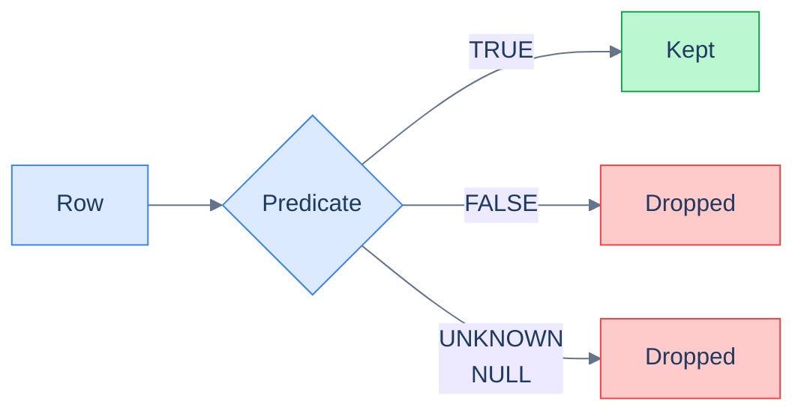
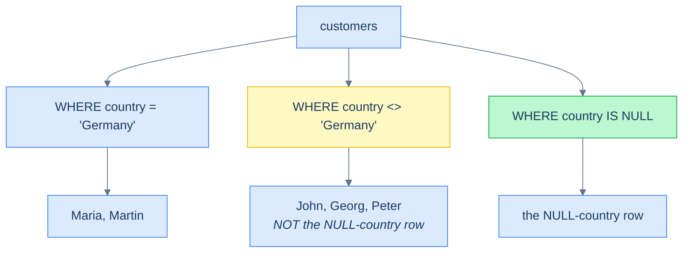

# 1. Filtering

## The Hook

A backend engineer is on call. An alert says the abandoned-cart job is missing customers. Open the SQL:

```sql
SELECT id FROM customers WHERE country != 'Germany';
```

That's the query that decides which customers get the abandoned-cart email — anyone not in Germany, because the German market has its own opted-out flow. There are five customers in the table. Three are in the USA, one in the UK. Plus a fifth who was created last week with `country = NULL` because the signup form's geolocation timed out.

The query returns four rows. The fifth — the customer with `NULL` country — is nowhere. They don't get the email. They also don't appear in the *other* query, the one filtering `WHERE country = 'Germany'`. They're invisible to both branches. They're invisible to all the *if-not-then-else* logic that everyone in the codebase has been writing for the last year.

This is not a bug in the abandoned-cart job. It is the way SQL filtering works. **`NULL` is not a value. It is the *absence* of a value, and the rules for comparing it to anything — including itself — are different from what every imperative language teaches you.** The query is doing exactly what it says; the bug is in the engineer's mental model. Every senior SQL engineer has written that bug at least once, usually at 2 a.m.

This chapter is about `WHERE`. Six families of predicates — comparison, logical, range, set-membership, pattern-matching, and existence. The mechanics of how `WHERE` evaluates them per row. And the NULL trap, which gets a brief introduction here and a full chapter ([NULL and three-valued logic](/cortex/languages/sql/index)) later, because every working SQL engineer needs the reflexes for it.

By the end you'll be able to write any row-level filter you need, predict whether `NOT IN` will silently swallow your `NULL`s, and read a complex `WHERE` clause without parenthesising-by-feel.

---

## Table of contents

1. [What `WHERE` does](#what-where-does)
2. [Comparison operators](#comparison-operators)
3. [Logical operators and precedence](#logical-operators-and-precedence)
4. [Range filtering: `BETWEEN`](#range-filtering)
5. [Set membership: `IN` and `NOT IN`](#set-membership)
6. [Pattern matching: `LIKE`](#pattern-matching)
7. [The NULL trap](#the-null-trap)
8. [Edge cases and pitfalls](#edge-cases-and-pitfalls)
9. [Production reality](#production-reality)
10. [Practice ladder](#practice-ladder)
11. [Cross-links](#cross-links)
12. [Final takeaway](#final-takeaway)

***

# What `WHERE` does

`WHERE` runs at **step 2** of the [logical execution order](/cortex/languages/sql/foundations/introduction-to-sql#the-logical-execution-order), right after `FROM`. It looks at every row produced by `FROM`, evaluates a **predicate** against each row, and **keeps the rows for which the predicate is `TRUE`**.

A predicate is any expression that evaluates to one of three values: `TRUE`, `FALSE`, or `UNKNOWN` (which Postgres displays as `NULL`). That third value is the source of every NULL trap in this chapter, and is the central reason the [NULL and three-valued logic](/cortex/languages/sql/index) chapter exists.

The crucial sentence: **`WHERE` keeps rows where the predicate is `TRUE`. Rows where the predicate is `FALSE` *or* `UNKNOWN` are dropped.** That's the rule. Memorise it. The unknown-rows-get-dropped behaviour is what bites engineers who think `NULL` will pass through "not equal" filters.



<p align="center"><strong>The three-valued outcome of every WHERE predicate. UNKNOWN — produced by any comparison involving NULL — is treated as a drop, not a "maybe keep". This is the source of nearly every NULL bug in beginner SQL.</strong></p>

A predicate is built from values, columns, comparison operators, logical connectives, and the special predicates `IS NULL`, `BETWEEN`, `IN`, `LIKE`, `EXISTS`. Most of this chapter is the catalogue.

---

# Comparison operators

The six standard comparison operators:

| Operator | Meaning | Example | Returns |
|---|---|---|---|
| `=` | equal | `score = 500` | `TRUE` if score is exactly 500 |
| `<>` or `!=` | not equal | `country <> 'Germany'` | `TRUE` if country is not Germany (and is not NULL) |
| `>` | strictly greater than | `score > 500` | `TRUE` if score is 501 or more |
| `>=` | greater than or equal | `score >= 500` | `TRUE` if score is 500 or more |
| `<` | strictly less than | `score < 500` | `TRUE` if score is 499 or less |
| `<=` | less than or equal | `score <= 500` | `TRUE` if score is 500 or less |

> **`<>` vs `!=`:** The standard form is `<>`, inherited from older SQL. `!=` is supported by every major dialect today and is conventionally read as "not equal." This book uses `<>` to match the standard but recognises `!=` is more common in modern code.

The comparison operators work on more than just numbers. They work on **strings** (lexicographic ordering — `'apple' < 'banana'`), on **dates** (chronological — `'2026-01-01' < '2026-02-01'`), on **booleans** (`FALSE < TRUE`), and on **anything else with an ordering**.

**Numeric** — customers with above-average score:

```sql run
CREATE TABLE customers (id INT, first_name TEXT, country TEXT, score INT);
INSERT INTO customers VALUES (1,'Maria','Germany',350),(2,'John','USA',900),(3,'Georg','UK',750),(4,'Martin','Germany',500),(5,'Peter','USA',0);

SELECT first_name, score FROM customers WHERE score > 500;
```

**String (lexicographic)** — customers whose first_name comes after `'M'`. Strings compare character-by-character against the column's collation:

```sql run
CREATE TABLE customers (id INT, first_name TEXT, country TEXT, score INT);
INSERT INTO customers VALUES (1,'Maria','Germany',350),(2,'John','USA',900),(3,'Georg','UK',750),(4,'Martin','Germany',500),(5,'Peter','USA',0);

SELECT first_name FROM customers WHERE first_name > 'M';
```

**Date** — orders placed in May 2026 or later. SQLite stores dates as ISO-8601 strings; the lexicographic comparison happens to be chronological:

```sql run
CREATE TABLE orders (order_id INT, customer_id INT, order_date DATE, sales INT);
INSERT INTO orders VALUES (1001,1,'2026-04-03',120),(1002,1,'2026-04-15',80),(1003,2,'2026-04-22',450),(1004,3,'2026-04-28',200),(1005,4,'2026-05-01',300),(1006,9,'2026-05-04',150);

SELECT order_id, order_date FROM orders WHERE order_date >= '2026-05-01';
```

## The NULL caveat (preview)

Every comparison operator follows the same rule: **if either side is `NULL`, the result is `NULL`** — not `TRUE`, not `FALSE`. So:

```sql
SELECT * FROM customers WHERE country = NULL;     -- ❌ matches no rows, ever
SELECT * FROM customers WHERE country <> NULL;    -- ❌ matches no rows, ever
SELECT * FROM customers WHERE country IS NULL;    -- ✅ the right way
SELECT * FROM customers WHERE country IS NOT NULL; -- ✅
```

If you remember nothing else about `NULL`, remember that **you compare to `NULL` with `IS NULL` / `IS NOT NULL`, never with `=` or `<>`.** The full reasoning is in [The NULL trap](#the-null-trap) below.

```sql run
CREATE TABLE customers (id INT, first_name TEXT, country TEXT, score INT);
-- Note: customer 6 has NULL country to demonstrate the trap.
INSERT INTO customers VALUES
  (1,'Maria','Germany',350),(2,'John','USA',900),(3,'Georg','UK',750),
  (4,'Martin','Germany',500),(5,'Peter','USA',0),(6,'Lisa',NULL,200);

-- Wrong: comparing to NULL with = always returns UNKNOWN. Returns 0 rows.
SELECT 'with = NULL'    AS test, COUNT(*) AS rows FROM customers WHERE country = NULL
UNION ALL
-- Wrong: <> NULL is also UNKNOWN. Returns 0 rows.
SELECT 'with <> NULL',          COUNT(*)          FROM customers WHERE country <> NULL
UNION ALL
-- Right: IS NULL returns the one Lisa row.
SELECT 'with IS NULL',          COUNT(*)          FROM customers WHERE country IS NULL
UNION ALL
-- Right: IS NOT NULL returns the other five.
SELECT 'with IS NOT NULL',      COUNT(*)          FROM customers WHERE country IS NOT NULL;
```

---

# Logical operators and precedence

The three logical connectives are `AND`, `OR`, `NOT`, in **descending order of precedence**:

1. **`NOT`** binds tightest.
2. **`AND`** binds tighter than `OR`.
3. **`OR`** binds loosest.

This is the same precedence as Boolean algebra and as Python's `not`/`and`/`or`. So:

```sql
-- ✅ "(country = 'USA' AND score > 500) OR country = 'Germany'"
SELECT * FROM customers
WHERE country = 'USA' AND score > 500 OR country = 'Germany';
```

That returns: every USA customer with score > 500, *plus* every German customer (regardless of score). The `AND` binds first, then the `OR` extends the set.

If that's not what you wanted — if you wanted "USA customers, but only with score > 500 *or* country = Germany" — you must parenthesise:

```sql
SELECT * FROM customers
WHERE country = 'USA' AND (score > 500 OR country = 'Germany');
-- ⚠ this is the same as "country = 'USA' AND score > 500", because USA customers
-- are never also from Germany. Often a sign you meant something else.
```

**Rule of thumb: when mixing `AND` and `OR`, parenthesise even when you don't have to.** It costs nothing, it makes the query unambiguous on the page, and it survives the next engineer who reads your code. There's no precedence puzzle to solve if every grouping is explicit.

## Truth tables

The exact behaviour of `AND`, `OR`, `NOT` over the three values `TRUE`, `FALSE`, `UNKNOWN` matters, especially when `NULL` is in play:

**`AND`:**

|  | TRUE | FALSE | UNKNOWN |
|---|---|---|---|
| **TRUE** | TRUE | FALSE | UNKNOWN |
| **FALSE** | FALSE | FALSE | FALSE |
| **UNKNOWN** | UNKNOWN | FALSE | UNKNOWN |

**`OR`:**

|  | TRUE | FALSE | UNKNOWN |
|---|---|---|---|
| **TRUE** | TRUE | TRUE | TRUE |
| **FALSE** | TRUE | FALSE | UNKNOWN |
| **UNKNOWN** | TRUE | UNKNOWN | UNKNOWN |

**`NOT`:**

| Input | Output |
|---|---|
| TRUE | FALSE |
| FALSE | TRUE |
| UNKNOWN | UNKNOWN |

The pattern: `AND` only goes `TRUE` if both operands are definitely `TRUE`; `FALSE` "wins" because anything-AND-FALSE is FALSE. `OR` only goes `FALSE` if both are definitely `FALSE`; `TRUE` "wins". `NOT` flips `TRUE`/`FALSE` but leaves `UNKNOWN` alone.

The non-obvious cell: `NOT UNKNOWN = UNKNOWN`, *not* `TRUE`. This is why `WHERE NOT (country = 'Germany')` does *not* return rows where `country` is `NULL`. The full discussion is in [The NULL trap](#the-null-trap).

---

# Range filtering

`BETWEEN` filters rows where a value falls within a range:

```sql run
CREATE TABLE customers (id INT, first_name TEXT, country TEXT, score INT);
INSERT INTO customers VALUES (1,'Maria','Germany',350),(2,'John','USA',900),(3,'Georg','UK',750),(4,'Martin','Germany',500),(5,'Peter','USA',0);

SELECT first_name, score FROM customers WHERE score BETWEEN 100 AND 500;
```

is equivalent to:

```sql
SELECT * FROM customers WHERE score >= 100 AND score <= 500;
```

**`BETWEEN` is inclusive on both endpoints.** A customer with `score = 100` is included; a customer with `score = 500` is included.

`BETWEEN` works on dates and strings too:

```sql
-- April 2026 orders
SELECT * FROM orders WHERE order_date BETWEEN DATE '2026-04-01' AND DATE '2026-04-30';

-- Customers whose first name is in the alphabetic range G–N
SELECT * FROM customers WHERE first_name BETWEEN 'G' AND 'N';
```

The negated form is `NOT BETWEEN`:

```sql
SELECT * FROM customers WHERE score NOT BETWEEN 100 AND 500;
```

## Date-range gotcha

The "include the whole day" trap with `BETWEEN`:

```sql
-- ⚠ subtle bug
SELECT * FROM orders
WHERE order_date BETWEEN DATE '2026-04-01' AND DATE '2026-04-30';
```

If `order_date` were a `TIMESTAMP` (date + time) instead of a `DATE`, this would *miss* every order placed on April 30 after midnight — the upper bound `DATE '2026-04-30'` is implicitly `'2026-04-30 00:00:00'`, so an order at `'2026-04-30 14:32:11'` is *after* the upper bound and gets dropped.

The robust form for timestamp ranges is **half-open**: greater-than-or-equal to the start, strictly-less-than the day *after* the end:

```sql
SELECT * FROM orders
WHERE order_date >= TIMESTAMP '2026-04-01 00:00:00'
  AND order_date <  TIMESTAMP '2026-05-01 00:00:00';
```

Half-open ranges are the production-grade pattern for time windows; closed ranges (`BETWEEN`) are fine for plain `DATE` columns where the day-resolution boundary isn't a concern. We'll go deeper in [Dates and Times](/cortex/languages/sql/index).

---

# Set membership

`IN` filters rows where a value matches *any* of a list:

```sql run
CREATE TABLE customers (id INT, first_name TEXT, country TEXT, score INT);
INSERT INTO customers VALUES (1,'Maria','Germany',350),(2,'John','USA',900),(3,'Georg','UK',750),(4,'Martin','Germany',500),(5,'Peter','USA',0);

SELECT first_name, country FROM customers WHERE country IN ('Germany', 'USA');
```

is equivalent to:

```sql
SELECT * FROM customers WHERE country = 'Germany' OR country = 'USA';
```

`IN` shines when the list grows — three, ten, fifty values — without inflating to a wall of `OR`s. It's also more efficient: many engines short-circuit `IN` with a hash-set lookup behind the scenes.

The list can be values, or it can be the result of a subquery:

```sql
-- Customers who have placed at least one order
SELECT first_name FROM customers
WHERE id IN (SELECT customer_id FROM orders);
```

We meet subquery `IN` properly in [Subqueries](/cortex/languages/sql/index).

## `NOT IN` and the NULL footgun

This one is famous. `NOT IN` returns rows where the value is in *none* of the listed values. So:

```sql
-- Customers NOT from Germany or USA. Should return Georg (UK).
SELECT first_name FROM customers WHERE country NOT IN ('Germany', 'USA');
```

That works, returns one row.

But suppose we add a sixth customer with `country = NULL` and run:

```sql
SELECT first_name FROM customers WHERE country NOT IN ('Germany', 'USA');
```

The new customer with `NULL` country is *also* dropped. Worse — and this is where `NOT IN` is genuinely treacherous — if any value *inside* the list is `NULL`, `NOT IN` returns no rows at all:

```sql
-- ⚠ This returns ZERO rows, even though Georg is from the UK.
SELECT first_name FROM customers WHERE country NOT IN ('Germany', 'USA', NULL);
```

Why? `NOT IN (a, b, c)` desugars to `country <> a AND country <> b AND country <> c`. If `c` is `NULL`, then `country <> NULL` is `UNKNOWN`. Anything `AND UNKNOWN` is at best `UNKNOWN`, never `TRUE`. So no row passes.

This bites in real codebases when the `IN` list comes from a subquery that *might* return a `NULL`:

```sql
-- ⚠ if any order has customer_id = NULL, this returns zero customers
SELECT first_name FROM customers
WHERE id NOT IN (SELECT customer_id FROM orders);
```

The defence: use **`NOT EXISTS`** instead, which handles `NULL` correctly:

```sql
-- ✅ correct
SELECT first_name FROM customers c
WHERE NOT EXISTS (SELECT 1 FROM orders o WHERE o.customer_id = c.id);
```

We'll meet `EXISTS` in [Anti-joins and existence](/cortex/languages/sql/index). For now: **prefer `NOT EXISTS` over `NOT IN` in production code** — it's correct under `NULL` and the optimiser handles both equally well.

---

# Pattern matching

`LIKE` filters strings against a wildcard pattern:

| Wildcard | Matches |
|---|---|
| `%` | zero or more characters |
| `_` | exactly one character |

Examples — edit the pattern in any block to feel the wildcard semantics:

```sql run
CREATE TABLE customers (id INT, first_name TEXT, country TEXT, score INT);
INSERT INTO customers VALUES (1,'Maria','Germany',350),(2,'John','USA',900),(3,'Georg','UK',750),(4,'Martin','Germany',500),(5,'Peter','USA',0);

-- First name starts with 'M'
SELECT first_name FROM customers WHERE first_name LIKE 'M%';
-- Try also: '%n' (ends with n), '%r%' (contains r), '__r%' (r in 3rd position)
```

The negated form is `NOT LIKE`:

```sql
SELECT first_name FROM customers WHERE first_name NOT LIKE 'M%';
```

## Case sensitivity

`LIKE` is **case-sensitive** by default in Postgres. `'M%'` matches `'Maria'` but not `'maria'`. To compare case-insensitively, either lowercase both sides:

```sql
WHERE LOWER(first_name) LIKE 'm%'
```

…or use Postgres's `ILIKE` (case-insensitive `LIKE`):

```sql
WHERE first_name ILIKE 'm%'
```

> **Dialect note:** `ILIKE` is Postgres-only. SQLite, MySQL, and SQL Server all default to *case-insensitive* `LIKE` if the column's collation is case-insensitive, and case-sensitive otherwise. The `LOWER()` form is the most portable.

## Escaping

If you need to search for a literal `%` or `_`, escape it with `\` (or any character if you specify it via `ESCAPE`):

```sql
-- Find rows where first_name contains a literal underscore
WHERE first_name LIKE '%\_%' ESCAPE '\';

-- Or use ESCAPE with another character
WHERE first_name LIKE '%/_%' ESCAPE '/';
```

The default escape character is engine-specific — Postgres has none by default; you must spell it out with `ESCAPE`.

## Regex

For pattern matching beyond `LIKE`'s simple wildcards, Postgres has `~` (match) and `~*` (case-insensitive match) for POSIX regex:

```sql
-- First name starts with M or P
WHERE first_name ~ '^[MP]';
```

Standard SQL has `SIMILAR TO`, which is between `LIKE` and full regex. Most production code that needs more than `LIKE` jumps to the engine-specific regex form. SQL regex is its own large topic; we'll touch on it in [String Functions](/cortex/languages/sql/index).

## Performance

`LIKE 'pattern%'` (anchored at the start) can use a B-tree index. `LIKE '%pattern'` (anchored at the end) and `LIKE '%pattern%'` (unanchored) cannot — the index has to scan every row. For unanchored pattern search at scale, Postgres has GIN-based trigram indexes via the `pg_trgm` extension, which we'll meet in [Other Index Types](/cortex/languages/sql/index).

---

# The NULL trap

Reading this section twice is worth more than reading the rest of the chapter once.

`NULL` in SQL is **not "no value"**. It's **"unknown value"**. The distinction is the entire reason `NULL` behaves the way it does.

## The rule

**Any expression involving `NULL` produces `NULL`** (with a few documented exceptions).

```sql
SELECT NULL = NULL;         -- NULL (NOT true)
SELECT NULL = 1;            -- NULL
SELECT NULL <> 1;           -- NULL
SELECT NULL > 1;            -- NULL
SELECT NULL + 1;            -- NULL
SELECT NULL || 'hello';     -- NULL
SELECT NOT NULL;            -- NULL
```

Ten thousand junior SQL bugs come from expecting `NULL = NULL` to be `TRUE`. It isn't. Two unknown values *might* be equal; they might not. SQL refuses to commit, returns `UNKNOWN`, which `WHERE` treats as a drop.



<p align="center"><strong>Three filters that look like they partition the customers into "Germany" and "not Germany". They don't. The NULL-country rows are absent from BOTH the equal and not-equal queries; they only show up under <code>IS NULL</code>. Together, the three queries partition the table — but you have to write all three explicitly.</strong></p>

## Why this design

The decision that `NULL = NULL` is `UNKNOWN` rather than `TRUE` was deliberate. The argument: `NULL` represents *missing information*. If two records both have `salary = NULL`, you have no idea whether their salaries are equal — they might be, but you don't *know*. SQL's three-valued logic models this honestly. The cost is the trap; the benefit is queries that don't quietly assert "two unknowns are the same number."

## How to handle it

Three patterns, in order of preference:

**(a) Use `IS NULL` / `IS NOT NULL` for null checks.** These are the only operators that return `TRUE`/`FALSE` (never `UNKNOWN`) when applied to `NULL`.

```sql
SELECT * FROM customers WHERE country IS NULL;
SELECT * FROM customers WHERE country IS NOT NULL;
```

**(b) Substitute a default with `COALESCE`.** When you want `NULL` to be treated as a specific value:

```sql
-- Treat NULL country as 'unknown' for filtering
SELECT * FROM customers WHERE COALESCE(country, 'unknown') <> 'Germany';
```

`COALESCE(a, b)` returns `a` if `a` is non-null, else `b`. Now the predicate evaluates to `TRUE` or `FALSE` for every row — no `UNKNOWN`, no silently dropped rows. Full treatment in [NULL and three-valued logic](/cortex/languages/sql/index).

**(c) Use `IS DISTINCT FROM` for null-safe inequality.** Postgres standard SQL provides `IS DISTINCT FROM` and `IS NOT DISTINCT FROM`, which treat `NULL` as just another value:

```sql
SELECT * FROM customers WHERE country IS DISTINCT FROM 'Germany';
-- Returns: USA, USA, UK, AND the NULL-country row.
```

`IS DISTINCT FROM` is `<>` with `NULL = NULL` returning `FALSE`. It's the right tool when you want "not equal, with `NULL`s counted as different." Ugly name; useful operator.

---

# Edge cases and pitfalls

## `WHERE TRUE`, `WHERE FALSE`, `WHERE 1=1`

You can put a constant predicate in `WHERE`:

```sql
SELECT * FROM customers WHERE TRUE;     -- returns everything
SELECT * FROM customers WHERE FALSE;    -- returns nothing
SELECT * FROM customers WHERE 1 = 1;    -- returns everything (older idiom)
```

`WHERE 1 = 1` is a programmatic-SQL idiom — generators that build `WHERE` clauses by appending `AND clause` use `WHERE 1 = 1` as the seed so that every appendage is a clean `AND`. You'll see it in ORM-generated SQL.

## `WHERE` on the wrong side of a `LEFT JOIN`

```sql
-- "Customers and their orders, but only orders > $200"
SELECT c.first_name, o.order_id, o.sales
FROM customers c
LEFT JOIN orders o ON o.customer_id = c.id
WHERE o.sales > 200;
```

Surprise: this **converts the LEFT JOIN into an INNER JOIN**. Customers with no orders had `o.sales = NULL`, the predicate `NULL > 200` is `UNKNOWN`, those rows get dropped — exactly what `LEFT JOIN` was supposed to preserve.

The fix: put the post-join filter *inside* the join condition, or use `WHERE o.sales > 200 OR o.sales IS NULL`. Full treatment in [Joins](/cortex/languages/sql/index).

## `WHERE` runs before grouping

```sql
-- ❌ aggregates aren't allowed in WHERE
SELECT customer_id FROM orders WHERE COUNT(*) > 1 GROUP BY customer_id;
```

`WHERE` runs at step 2; aggregates compute at step 4 (post-`GROUP BY`). To filter on aggregates, use `HAVING`:

```sql
-- ✅
SELECT customer_id FROM orders GROUP BY customer_id HAVING COUNT(*) > 1;
```

This is in the alias-namespace explanation in [SELECT and Projection](/cortex/languages/sql/foundations/select-and-projection#the-alias-namespace-trap), but it bites in `WHERE` form often enough to repeat here.

## Implicit Boolean coercion is mostly absent

In Python or JavaScript, `if x:` is true for many "truthy" values. SQL has no truthiness — a `WHERE` clause must evaluate to `TRUE`, `FALSE`, or `UNKNOWN`. `WHERE 1` is illegal in standard SQL because `1` is an integer, not a boolean. (MySQL allows it; Postgres does not.)

```sql
-- ❌ Postgres: error, expression is not boolean
SELECT * FROM customers WHERE 1;

-- ✅
SELECT * FROM customers WHERE 1 = 1;
```

The exception: a column of type `BOOLEAN` works directly:

```sql
SELECT * FROM customers WHERE is_active;   -- if is_active is BOOLEAN
```

That's evaluating the boolean column itself, not coercing an integer.

## Function calls in `WHERE` block index use

```sql
-- ⚠ index on score might NOT be used; the function-on-column hides the column from the index
SELECT * FROM customers WHERE ABS(score) > 500;

-- ✅ rewrite when possible to a column-on-the-left form
SELECT * FROM customers WHERE score > 500 OR score < -500;
```

This is a *performance* gotcha rather than a correctness one — but it's important enough that the [Indexes and Performance](/cortex/languages/sql/index) module spends a chapter on **sargability**: writing predicates the planner can use an index for. The rule of thumb: `WHERE column op constant` is sargable; `WHERE function(column) op constant` usually isn't.

---

# Production reality

Three concrete places where filtering shows up in real codefolio code.

**(1) The `/api/recent` query.** It surfaces the last ten `/api/hello` events from MongoDB. The SQL-shaped equivalent against the `hello_events` table from the [sample schema](/cortex/languages/sql/foundations/introduction-to-sql#the-sample-schema):

```sql
SELECT timestamp_ms, visits
FROM hello_events
ORDER BY timestamp_ms DESC
LIMIT 10;
```

No `WHERE` — the endpoint returns the most recent ten regardless of any filter. But notice the ordering on `timestamp_ms`. Postgres's *descending B-tree index* on `timestamp_ms` makes this query `O(log n)`; without one, it's a sort over the whole table. The [Indexes](/cortex/languages/sql/index) module shows how to add the right index.

**(2) Filtering by user role for an internal dashboard.** Imagine codefolio grew an admin panel that shows orders flagged for review. Engineers commonly write:

```sql
-- ❌ subtly wrong: misses NULL-flagged orders
SELECT * FROM orders WHERE flagged = TRUE;

-- ✅ explicit: matches both intentionally-true and intentionally-not-true (assuming
--    NULL means "not yet evaluated")
SELECT * FROM orders WHERE flagged IS TRUE;     -- or COALESCE(flagged, FALSE) = TRUE
```

In a Postgres column of type `BOOLEAN`, `flagged = TRUE` returns rows where flagged is exactly `TRUE`; `flagged IS TRUE` does the same; *neither* returns rows where `flagged` is `NULL`. The decision of whether `NULL`-flagged rows should be in the result is a *product* decision; the SQL just enforces what you tell it to. Be explicit.

**(3) Date-window filtering for a daily aggregate job.** A daily cron job that aggregates yesterday's `hello_events`:

```sql
SELECT DATE_TRUNC('hour', TO_TIMESTAMP(timestamp_ms / 1000)) AS hour_bucket,
       COUNT(*) AS event_count
FROM hello_events
WHERE timestamp_ms >= (EXTRACT(EPOCH FROM CURRENT_DATE - INTERVAL '1 day') * 1000)::bigint
  AND timestamp_ms <  (EXTRACT(EPOCH FROM CURRENT_DATE) * 1000)::bigint
GROUP BY hour_bucket
ORDER BY hour_bucket;
```

Note the **half-open** time window — `>=` start of yesterday, `<` start of today — to avoid the day-boundary trap discussed in [Range filtering](#range-filtering). Production-grade time-window queries always use half-open ranges; closed `BETWEEN` is for ad-hoc human-shaped questions.

---

# Practice ladder

Spin up the [sample schema](/cortex/languages/sql/foundations/introduction-to-sql#the-sample-schema) in `psql` and try each one. Hints, not answers.

1. **Customers with `score > 500` *and* from the USA.** *Hint: two predicates joined with `AND`.*
2. **Customers from Germany *or* with `score >= 750`.** *Hint: two predicates joined with `OR`. Use parentheses if mixing with anything else.*
3. **Orders placed in April 2026, inclusive.** *Hint: `BETWEEN` works on dates; mind the half-open form when timestamps are involved.*
4. **Customers whose `country` is one of Germany, USA, or UK.** *Hint: `IN`.*
5. **Customers whose first name does *not* start with `'M'`.** *Hint: `NOT LIKE`.*
6. **Customers whose `country` is unknown (`NULL`).** *Hint: which special operator?*
7. **Predict the number of rows returned by this query, given the [sample schema](/cortex/languages/sql/foundations/introduction-to-sql#the-sample-schema):**
   ```sql
   SELECT * FROM customers WHERE country NOT IN ('Germany', NULL);
   ```
   *Hint: walk through the desugaring `country <> 'Germany' AND country <> NULL`. What does `country <> NULL` evaluate to? What does `anything AND UNKNOWN` evaluate to? How many rows would `WHERE` keep?*
8. **Rewrite the query in (7) so that it correctly returns "customers not from Germany, including those with `NULL` country".** *Hint: split the predicate explicitly. Or use `COALESCE`. Or use `IS DISTINCT FROM`.*

***

# Cross-links

- **Previous in this module:** [SELECT and Projection](/cortex/languages/sql/foundations/select-and-projection) — the column-list half of every read query.
- **Next in this module:** [Ordering and Pagination](/cortex/languages/sql/foundations/ordering-and-pagination) — once you've selected and filtered, the next two clauses (`ORDER BY`, `LIMIT`) shape the order and size of the result.
- **Forward reference:** [NULL and three-valued logic](/cortex/languages/sql/index) — the full treatment of `NULL`, including `COALESCE`, `NULLIF`, `IS DISTINCT FROM`, and the family of bugs that come from `NULL` propagation through expressions.
- **Forward reference:** [Anti-joins and existence](/cortex/languages/sql/index) — the `NOT EXISTS` form that solves the `NOT IN`/`NULL` footgun mentioned in [Set membership](#set-membership).
- **Forward reference:** [Indexes and query plans](/cortex/languages/sql/index) — sargability, the property that lets the planner use an index for a `WHERE` predicate.
- **Forward reference:** [Joins](/cortex/languages/sql/index) — the `WHERE`-on-the-wrong-side-of-a-LEFT-JOIN pitfall mentioned in [Edge cases](#edge-cases-and-pitfalls).

***

# Final Takeaway

`WHERE` is the row-filtering clause and looks deceptively simple. Three patterns to internalise:

1. **`WHERE` keeps rows where the predicate is `TRUE`. `FALSE` and `UNKNOWN` both drop the row.** The asymmetry between "FALSE" and "UNKNOWN" is silent — and is the source of nearly every NULL bug in beginner SQL.
2. **`NULL` is unknown, not absent.** Compare with `IS NULL` / `IS NOT NULL`, never with `=` / `<>`. `NOT IN` against a list that might contain `NULL` is a bug; prefer `NOT EXISTS`. Use `COALESCE` to substitute a default when you want `NULL`-rows to participate in a comparison.
3. **Half-open ranges (`>= start AND < end_plus_one`) for time windows; closed ranges (`BETWEEN`) for plain `DATE` columns.** This single habit prevents an entire class of "we missed the rows from 30 April after lunch" bugs.

Internalise those three and `WHERE` becomes the predictable, boring clause it should be — leaving your attention free for the joins, aggregations, and windows that *are* hard.

## Your Turn

Before you move on, check your understanding with the coach — explain the idea, apply it, weigh the trade-offs, then defend your reasoning.

<div class="concept-coach"></div>
