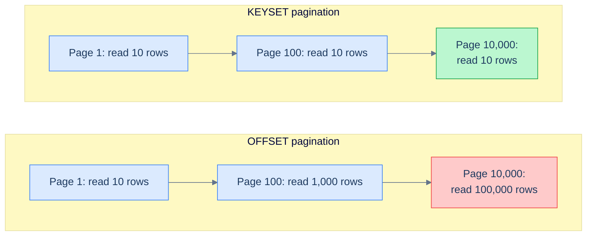

# 1. Ordering and Pagination

## The Hook

The product team adds infinite scroll to the customer list. The implementation is straightforward — page 1 is `LIMIT 50 OFFSET 0`, page 2 is `LIMIT 50 OFFSET 50`, page N is `LIMIT 50 OFFSET 50*(N-1)`. Tests pass. Staging works. Ships.

Three months later the customer table has grown from 5,000 rows to 5 million. Two reports come in.

Report 1, from a power user: "I scrolled down 200 pages and the page now takes 8 seconds to load."

Report 2, from a different power user: "I scrolled, came back, and a customer I just saw on page 3 is now on page 4. Some are duplicated. Some are missing."

Both reports are about pagination, and both are correct. The first is a *performance* bug — `OFFSET 10000` makes Postgres read and discard 10,000 rows before returning the next 50, so deep pagination is `O(N)` on the offset. The second is a *correctness* bug — `LIMIT/OFFSET` is computed against a view of the table that may have changed between page loads, so a row that gets inserted before your current cursor *shifts everything down by one*, and a row that gets deleted shifts things up.

Both are solved by the same idea: **stop counting rows; start tracking the value of the last row you saw.** That's keyset pagination, and it's the technique behind every "load more" button on every social-feed app you've ever used. It's also a technique that works against an indexed column and runs in the same milliseconds at page 200 as at page 1.

This chapter is about `ORDER BY` and `LIMIT`/`OFFSET` — the two clauses you write at the *bottom* of a query and that the database executes at the *end* of the [logical execution order](/cortex/languages/sql/foundations/introduction-to-sql#the-logical-execution-order). They look like cosmetic clauses ("just sort and trim"); they're not. Together they are how a query becomes a *page* the user sees.

---

## Table of contents

1. [What `ORDER BY` does](#what-order-by-does)
2. [Sort keys and direction](#sort-keys-and-direction)
3. [`NULLS FIRST` and `NULLS LAST`](#nulls-ordering)
4. [Stability and tiebreakers](#stability-and-tiebreakers)
5. [`LIMIT` and `OFFSET`](#limit-and-offset)
6. [Why `OFFSET` is slow](#why-offset-is-slow)
7. [Keyset pagination — the production pattern](#keyset-pagination)
8. [Edge cases and pitfalls](#edge-cases-and-pitfalls)
9. [Production reality](#production-reality)
10. [Practice ladder](#practice-ladder)
11. [Cross-links](#cross-links)
12. [Final takeaway](#final-takeaway)

***

# What `ORDER BY` does

`ORDER BY` runs at **step 8** of the [logical execution order](/cortex/languages/sql/foundations/introduction-to-sql#the-logical-execution-order), after `SELECT`. Its job is to take the projected rows and put them in a deterministic order.

The crucial sentence: **without `ORDER BY`, the order of rows returned by a query is undefined.** Many beginners write:

```sql
SELECT * FROM customers;
```

…notice that the rows come back in `id` order, and conclude that the database "naturally" returns rows in primary-key order. It doesn't. Postgres returns rows in the order it physically reads them, which depends on the plan, on the buffer cache, on whether `VACUUM` has shuffled pages, on the moon phase. **A query without `ORDER BY` may return rows in any order, and that order may change between runs.**

If a query "works" because the rows happen to come back in a useful order, the query has a latent bug. The day you add an index, change the table, or upgrade Postgres, the bug fires. **In any code that depends on row order, write `ORDER BY` explicitly.**

```sql run
CREATE TABLE customers (id INT, first_name TEXT, country TEXT, score INT);
INSERT INTO customers VALUES (1,'Maria','Germany',350),(2,'John','USA',900),(3,'Georg','UK',750),(4,'Martin','Germany',500),(5,'Peter','USA',0);

SELECT first_name, score FROM customers ORDER BY score DESC;
```

That's the contract: highest-score first, lowest last, with ties broken arbitrarily (more on that in [Stability and tiebreakers](#stability-and-tiebreakers)). Now the order is part of the query, not an accident.

---

# Sort keys and direction

`ORDER BY` takes a comma-separated list of **sort keys**. Each key is an expression — a column reference, a column alias, an arithmetic expression, a function call — and an optional direction.

```sql run
CREATE TABLE customers (id INT, first_name TEXT, country TEXT, score INT);
INSERT INTO customers VALUES (1,'Maria','Germany',350),(2,'John','USA',900),(3,'Georg','UK',750),(4,'Martin','Germany',500),(5,'Peter','USA',0);

SELECT first_name, country, score FROM customers
ORDER BY country ASC, score DESC;
```

`ASC` (ascending) is the default and is conventionally omitted. `DESC` (descending) must be explicit. So the query above can be written:

```sql
ORDER BY country, score DESC;
```

Multi-column sort: rows are first sorted by the first key; within each block of rows that tie on the first key, sorted by the second; within ties on the second, by the third; etc. So customers are grouped by country, and within each country sorted by score descending.

| first_name | country | score |
|---|---|---|
| Maria | Germany | 350 |
| Martin | Germany | 500 |
| Georg | UK | 750 |
| John | USA | 900 |
| Peter | USA | 0 |

…wait, that's wrong. Let me re-do: with `country ASC, score DESC`, Germany comes first (alphabetically), and within Germany the rows sort by score descending — so Martin (500) before Maria (350). Within USA, John (900) before Peter (0). The corrected output:

| first_name | country | score |
|---|---|---|
| Martin | Germany | 500 |
| Maria | Germany | 350 |
| Georg | UK | 750 |
| John | USA | 900 |
| Peter | USA | 0 |

## Sorting by expression

The sort key doesn't have to be a column — it can be any expression:

```sql
-- Sort by score percentage (essentially the same as sort by score, since /1000 is monotonic)
SELECT * FROM customers ORDER BY score * 1.0 / 1000.0 DESC;

-- Sort by length of name
SELECT * FROM customers ORDER BY LENGTH(first_name);

-- Sort by a CASE expression — bucket ordering
SELECT * FROM customers
ORDER BY CASE
           WHEN score > 750 THEN 1
           WHEN score > 250 THEN 2
           ELSE 3
         END,
         score DESC;
```

The last one is a useful pattern: bucket the rows into three score-bands, then sort within each band by raw score. The `CASE` produces an ordinal `1, 2, 3` per row that becomes the primary sort key.

## Sorting by alias

Because `ORDER BY` runs *after* `SELECT`, it can reference column aliases bound in the `SELECT`:

```sql
SELECT first_name, score * 0.1 AS bonus
FROM customers
ORDER BY bonus DESC;
```

This is one of the few clauses where aliases work. (See [The alias-namespace trap](/cortex/languages/sql/foundations/select-and-projection#the-alias-namespace-trap) for the full story.)

## Sorting by ordinal position

Old-style SQL allows `ORDER BY 1, 2` — sort by the first column in the `SELECT`, then the second. Postgres still supports this. **Don't use it in shipped code:** if someone adds a column to your `SELECT`, the position shifts and the ordering silently changes. Reference columns by name or alias.

```sql
-- Fine in psql for quick exploration
SELECT first_name, score FROM customers ORDER BY 2 DESC;

-- Better in production code
SELECT first_name, score FROM customers ORDER BY score DESC;
```

---

# NULLS ordering

`NULL` doesn't have a natural place in an ordering — is unknown bigger or smaller than 500? SQL lets you choose:

```sql
SELECT * FROM customers ORDER BY score DESC NULLS LAST;
SELECT * FROM customers ORDER BY score DESC NULLS FIRST;
```

The defaults vary by dialect:

| Dialect | Default for `ASC` | Default for `DESC` |
|---|---|---|
| PostgreSQL | `NULLS LAST` | `NULLS FIRST` |
| Oracle | `NULLS LAST` | `NULLS FIRST` |
| SQL Server | `NULLS FIRST` | `NULLS LAST` |
| MySQL | `NULLS FIRST` | `NULLS LAST` |
| SQLite | `NULLS FIRST` | `NULLS LAST` |

Postgres treats `NULL` as "infinitely large" by default, which is why ascending puts `NULL` last and descending puts it first. SQL Server and MySQL go the other way.

**The portable production answer: always specify `NULLS FIRST` or `NULLS LAST` explicitly when ordering on a nullable column.** It costs a few keystrokes and removes the dialect dependency.

```sql
-- The customer with NULL score should be last in either direction
SELECT * FROM customers ORDER BY score DESC NULLS LAST;
SELECT * FROM customers ORDER BY score ASC NULLS LAST;
```

---

# Stability and tiebreakers

A sort is **stable** if rows that tie on the sort key keep their relative input order. SQL `ORDER BY` is **not** guaranteed to be stable — different plans (sequential scan + sort vs index scan) can produce different orders for tied rows.

This bites when you paginate. Imagine:

```sql
SELECT first_name FROM customers ORDER BY country LIMIT 2;
-- Page 1: Maria, Martin

SELECT first_name FROM customers ORDER BY country LIMIT 2 OFFSET 2;
-- Page 2: ???
```

The first query returns the two German customers in *some* order. If the planner uses an index scan on `country`, Maria (id=1) comes before Martin (id=4) because that's the index order. If the planner uses a hash-join-style plan, the order might be different. The next query has to skip whatever-came-on-page-1 and return the next two — but if the orderings disagree, you lose.

The defence: **always include enough sort keys to make the order total**. If `country` ties, add `id` as a tiebreaker:

```sql
SELECT first_name FROM customers ORDER BY country, id LIMIT 2;
SELECT first_name FROM customers ORDER BY country, id LIMIT 2 OFFSET 2;
```

Now the order is fully determined: rows are sorted by country, then by id. There are no ties (because `id` is a primary key and unique). The two queries together return the first four customers in a stable, repeatable order.

**Rule: every `ORDER BY` for a paginated query should end with a unique-column tiebreaker** — the primary key, if there's one, is the simplest choice. Without it, pagination is silently non-deterministic.

---

# LIMIT and OFFSET

`LIMIT N` keeps the first N rows after `ORDER BY`. `OFFSET M` drops the first M rows. Together: `LIMIT 10 OFFSET 20` returns rows 21 through 30 of the ordering.

Top 3 customers by score — `ORDER BY` then `LIMIT` chops the top off the sorted result:

```sql run
CREATE TABLE customers (id INT, first_name TEXT, country TEXT, score INT);
INSERT INTO customers VALUES (1,'Maria','Germany',350),(2,'John','USA',900),(3,'Georg','UK',750),(4,'Martin','Germany',500),(5,'Peter','USA',0);

SELECT first_name, score FROM customers ORDER BY score DESC LIMIT 3;
```

"Page 2" of the customer list, page size 2 — `OFFSET 2` skips the first two rows after sorting, then `LIMIT 2` takes the next two:

```sql run
CREATE TABLE customers (id INT, first_name TEXT, country TEXT, score INT);
INSERT INTO customers VALUES (1,'Maria','Germany',350),(2,'John','USA',900),(3,'Georg','UK',750),(4,'Martin','Germany',500),(5,'Peter','USA',0);

SELECT first_name, score FROM customers ORDER BY score DESC LIMIT 2 OFFSET 2;
```

`LIMIT` runs at step 9 of the logical order — last. The engine has already sorted everything; `LIMIT` just chops the top off.

> **Dialect note:** `LIMIT N OFFSET M` is the Postgres/MySQL/SQLite syntax. Standard SQL is `OFFSET M ROWS FETCH NEXT N ROWS ONLY`. SQL Server uses both forms. Oracle adopted the standard form in 12c. The `LIMIT` form is what you'll see in 95% of code; the `FETCH NEXT` form is what you'll write if you're targeting the SQL standard or older Oracle.
>
> ```sql
> -- Standard SQL form (also works in Postgres):
> SELECT first_name FROM customers
> ORDER BY score DESC
> OFFSET 2 ROWS FETCH NEXT 2 ROWS ONLY;
> ```

`LIMIT` without `ORDER BY` is *legal but meaningless*. Without an order, "the first three rows" is undefined. Always pair `LIMIT` with `ORDER BY` — and always make the `ORDER BY` deterministic with a tiebreaker.

```sql
-- ❌ "first three" is undefined
SELECT first_name FROM customers LIMIT 3;

-- ⚠ "first three by score" — but with score-ties undefined
SELECT first_name FROM customers ORDER BY score DESC LIMIT 3;

-- ✅ deterministic
SELECT first_name FROM customers ORDER BY score DESC, id LIMIT 3;
```

---

# Why OFFSET is slow

`LIMIT 10 OFFSET 0` is fast: read the first 10 rows of the sort, return them.

`LIMIT 10 OFFSET 1000000` is slow: **read the first 1,000,010 rows**, throw the first 1,000,000 away, return the last 10.

That is literally what the database does. There's no shortcut. To know which row is row 1,000,001 of the ordering, the engine has to *count through* the previous million. If those rows live on a B-tree index, it's a logarithmic seek to the start plus a linear walk through a million leaf entries. If they're on disk, it's a million page reads. Either way, the cost grows with the offset.

This is the **OFFSET tax**: pagination cost is `O(offset + limit)`, not `O(limit)`. For the first ten pages it doesn't matter. For page 10,000 it's a disaster.



<p align="center"><strong>OFFSET pagination grows with the page number; keyset pagination doesn't. At small N they look identical; at large N they diverge by orders of magnitude. This is why every infinite-scroll feed on the web is built with keyset, not OFFSET.</strong></p>

`OFFSET` is also the source of the **shifting-row** correctness bug from this chapter's hook. If a row is inserted with a sort key smaller than your current cursor, every later row shifts down by one — and the next page repeats a row. If a row is deleted, every later row shifts up — and the next page skips a row. `OFFSET` paginates by *position*, and position changes when the table changes.

---

# Keyset pagination

The fix for both problems: **stop counting rows; start tracking the value of the last row you saw**. The query for "page N" becomes "give me 50 rows where the sort key is greater than the last row of page N-1."

```sql
-- Page 1: top 50 by score, no anchor
SELECT first_name, score, id
FROM customers
ORDER BY score DESC, id ASC
LIMIT 50;

-- Page 2: top 50 by score, where (score, id) is "after" the last row of page 1.
-- Suppose page 1's last row was (score=750, id=3).
SELECT first_name, score, id
FROM customers
WHERE (score, id) < (750, 3)
ORDER BY score DESC, id ASC
LIMIT 50;
```

The `(score, id) < (750, 3)` is **row-value comparison**: tuple-wise lexicographic. It's `TRUE` when `score < 750`, *or* `score = 750 AND id < 3`. That's exactly "in the ordering, strictly after `(750, 3)`."

> **Dialect note:** Row-value comparison is standard SQL and works in PostgreSQL and SQLite. MySQL supports it too. SQL Server doesn't — there you write the predicate explicitly: `WHERE score < 750 OR (score = 750 AND id < 3)`.

## Why this is fast

If there's an index on `(score DESC, id ASC)`, the planner does an **index range scan** starting at the entry just past `(750, 3)` and emits the next 50 in order. That's `O(log n)` to find the start plus `O(50)` to walk forward. The cost does not grow with the page number — it's the same on page 1, page 100, and page 10,000.

```sql
-- The index that makes the keyset query O(log n + page_size)
CREATE INDEX customers_by_score_id ON customers (score DESC, id ASC);
```

A composite index on the sort keys is what turns keyset pagination from "asymptotically nice" into "actually fast." Without the index, the planner falls back to a sequential scan + sort, which negates the win. We'll go deep on this in [B-Tree Indexes](/cortex/languages/sql/index).

## Why this is correct

A row inserted *after* the cursor doesn't change the cursor's position in the ordering. A row deleted *before* the cursor doesn't either. Each page is computed against the value of the cursor, which is stable across writes. No shifting, no duplication, no skipping.

The trade-off: you can't "jump to page 47" without knowing the cursor for page 47. Keyset is great for "next page" / "previous page" / "infinite scroll." It's bad for "give me page 47 directly." Most modern UIs are infinite-scroll; the few that need direct page jumps either accept the OFFSET cost or use a different strategy (precomputed page boundaries, for example).

## The pattern in shape

A keyset-paginated endpoint typically looks like this in HTTP-API form:

```
GET /customers?after_score=750&after_id=3&limit=50
```

The client sends back the cursor it received (the `after_score`, `after_id` from the last row of the previous page). The server translates that into the SQL above.

If there's no `after` cursor (first page), the WHERE drops; if there's a cursor, it's a row-value comparison. Either way, the query is `O(log n + page_size)`.

---

# Edge cases and pitfalls

## Sorting by a `NULL`-able column without specifying NULL handling

The dialect default kicks in. On Postgres, descending puts `NULL` first, which is rarely what a UI wants. Always be explicit when the column is nullable: `ORDER BY score DESC NULLS LAST`.

## Sorting by a non-deterministic expression

```sql
SELECT * FROM customers ORDER BY RANDOM();
```

Returns the customers in a random order, freshly randomised each call. Useful for sampling. **Never combine with `LIMIT/OFFSET` for pagination** — page 2 would re-randomise and you'd see entirely different rows.

## Locale-dependent string ordering

`'b' < 'A'` in some locales (because lowercase comes before uppercase in ASCII), `'A' < 'b'` in others. Postgres uses your database's locale settings; on a server set to a German locale, `ä` sorts differently than on a US locale. **For predictable string ordering across environments, sort on a normalised form**: `ORDER BY LOWER(first_name)` or use Postgres's `COLLATE` clause to pin the locale: `ORDER BY first_name COLLATE "C"` (binary byte-wise sort).

## `ORDER BY` after `UNION`

```sql
SELECT first_name FROM customers WHERE country = 'Germany'
UNION ALL
SELECT first_name FROM customers WHERE country = 'USA'
ORDER BY first_name;
```

The `ORDER BY` applies to the *combined* result of the `UNION`, not to each `SELECT` separately. To order each side individually you'd need subqueries — but that's almost never what you want.

## `LIMIT 0` for "give me the schema"

```sql
SELECT * FROM customers LIMIT 0;
```

Returns zero rows but a valid result-set with the column metadata. Some clients use this to introspect the columns of a query without actually fetching data.

## `LIMIT 1` to get a single row

```sql
SELECT first_name FROM customers ORDER BY score DESC LIMIT 1;
```

The customer with the highest score. The cleanest "top 1" pattern in SQL — equivalent in spirit to `MAX(score)` for the score itself, but lets you return *the customer* (not just the value). For "all customers tied at the top," see [Window functions: ranking](/cortex/languages/sql/index).

---

# Production reality

The codefolio stack uses `ORDER BY ... LIMIT` for `/api/recent`. The Mongo query inside [`server/src/main/scala/codefolio/server/helloPipeline/HelloEventLog.scala`](https://github.com/) does the equivalent of:

```sql
SELECT timestamp_ms, visits
FROM hello_events
ORDER BY timestamp_ms DESC
LIMIT 10;
```

Notice the descending sort on `timestamp_ms`. The corresponding index — built at startup in `HelloEventLog.live`'s `createIndex` call — is on `timestamp_ms` descending. With that index, the query is `O(log n)`: jump to the highest timestamp via the index, walk backwards 10 entries, done.

This is keyset pagination's exact shape, just with no cursor (always page 1, "the latest 10"). To extend it to "the next 10 older than this point", you'd add:

```sql
SELECT timestamp_ms, visits
FROM hello_events
WHERE timestamp_ms < :last_timestamp_seen
ORDER BY timestamp_ms DESC
LIMIT 10;
```

`:last_timestamp_seen` is the cursor. Pages run in constant time per page, no matter how many rows the table has accumulated. **This is the production pattern.** Any time codefolio grows a "load older events" button, the SQL is exactly that shape.

The wrong shape — what a junior engineer might reach for first — would be:

```sql
-- Don't ship this for time-series pagination.
SELECT timestamp_ms, visits
FROM hello_events
ORDER BY timestamp_ms DESC
LIMIT 10 OFFSET 990;   -- "page 100"
```

Functional in dev. Linearly slower in prod. After a year of `/api/hello` traffic, page 1000 might take seconds. Replacing it with the keyset form fixes both the slowness and the shifting-row correctness bug at the same time.

---

# Practice ladder

1. **List all customers, sorted by score from highest to lowest.** *Hint: `ORDER BY ... DESC`.*
2. **List all customers, sorted by country alphabetically and then by score descending within each country.** *Hint: two sort keys, comma-separated, each with its own direction.*
3. **List the top 3 customers by score, breaking ties by id.** *Hint: two-key `ORDER BY` plus `LIMIT 3`.*
4. **Predict what `ORDER BY score DESC` returns when there's a customer with `score = NULL`. Check your answer against Postgres's default. Then make the query portable by being explicit.** *Hint: `NULLS LAST` or `NULLS FIRST`.*
5. **Page 1 of customers ordered by score-descending-then-id, page size 2.** *Hint: `ORDER BY score DESC, id ASC LIMIT 2 OFFSET 0`.*
6. **Convert (5) into the keyset form for page 2, given that page 1's last row was `(score=750, id=3)`.** *Hint: row-value comparison `(score, id) < (750, 3)`. The `LIMIT 2` stays.*
7. **Why is the keyset form's predicate `(score, id) < (750, 3)` instead of `score < 750 AND id < 3`?** *Hint: try the second form on a customer with `(score=350, id=1)`. Should they be on page 2 or page 1? What does each form say?*
8. **Suppose `customers` has 5 million rows. Estimate how much work the engine does for `OFFSET 0`, `OFFSET 1000`, `OFFSET 1000000`, with and without an index on `(score, id)`.** *Hint: think in terms of rows-walked. The index lets you jump to the offset; the heap doesn't.*

***

# Cross-links

- **Previous in this module:** [Filtering](/cortex/languages/sql/foundations/filtering) — `WHERE` runs at step 2, `ORDER BY` runs at step 8. Together they answer "which rows, in what order."
- **Next in this module:** [Data Definition](/cortex/languages/sql/foundations/data-definition) — `CREATE TABLE`, types, constraints. The schema your `ORDER BY` lives on top of.
- **Forward reference:** [Window functions: ranking](/cortex/languages/sql/index) — `ROW_NUMBER`, `RANK`, `DENSE_RANK` for "give me the top N per group" and "label each row with its position", which keyset pagination's tiebreaker logic generalises into.
- **Forward reference:** [B-Tree Indexes](/cortex/languages/sql/index) — the index that makes keyset pagination `O(log n)`. Without the index, all the elegance evaporates into a sequential scan.
- **DSA cross-reference:** [B-Tree](/cortex/data-structures-and-algorithms/trees/b-tree/introduction-to-b-trees) — why a B-tree index supports range scans efficiently. The shape of the B-tree is what makes "find the entry after `(750, 3)` and walk forward 50 leaves" the natural operation it is.

***

# Final Takeaway

`ORDER BY` and `LIMIT` look like they cap off a query for presentation. They're really the gateway to two of the most production-relevant questions in SQL: how do you sort large data, and how do you paginate without melting?

1. **`ORDER BY` makes order part of the contract; without it, row order is undefined and changes silently.** Always include enough sort keys for a *total* order — typically the primary key as a tiebreaker — so that pagination is deterministic.
2. **`OFFSET` is fine for the first ten pages and ruinous for the ten-thousandth.** Cost is `O(offset)`, not `O(limit)`. It's also racy when rows are inserted or deleted concurrently.
3. **Keyset pagination is the production answer for infinite scroll, time-series feeds, and any "load more" UI.** Track the cursor, not the offset. With the right composite index, every page is `O(log n + page_size)` regardless of where you are in the sequence — and a row inserted while you're scrolling doesn't shift the page under you.

Internalise these three and your sort-and-page queries scale from prototype to production without rewrites.

## Your Turn

Before you move on, check your understanding with the coach — explain the idea, apply it, weigh the trade-offs, then defend your reasoning.

<div class="concept-coach"></div>
