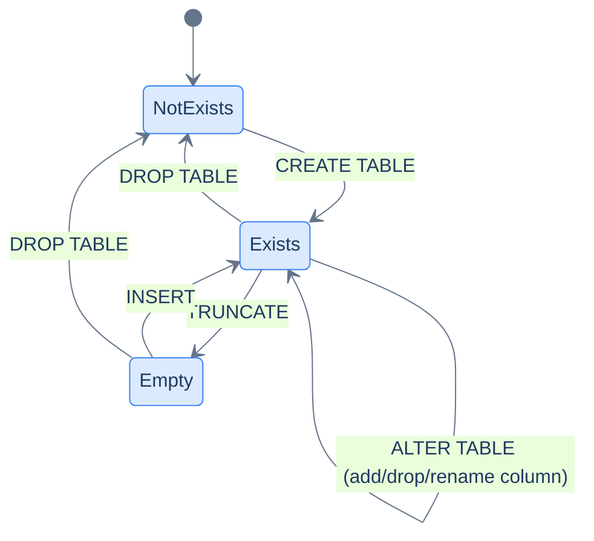

# 1. Data Definition

## The Hook

A team is shipping a new feature. The migration adds a column:

```sql
ALTER TABLE orders ADD COLUMN promo_code TEXT NOT NULL;
```

The migration runs against the empty test database. Tests pass. The migration runs against staging — staging has 100 rows in `orders`, all from a script that seeded them last week. Migration succeeds. The migration runs against production. Production has 14 million rows in `orders`, 12 million of which were placed before the `promo_code` feature existed.

Migration error: `column "promo_code" contains null values`.

The deploy halts. Pages fire. The feature ships a day late.

The bug is a single word: `NOT NULL`. Adding a `NOT NULL` column requires every existing row to have a value for it — and the existing 12 million rows can't possibly. The fix is one of: drop the `NOT NULL`, add a `DEFAULT` so old rows get a value, or do the change in two steps (add nullable, backfill, alter to NOT NULL). What kind of constraint a column has and how it interacts with existing data is the central concern of DDL — Data Definition Language.

This chapter is the foundations-level introduction to DDL: the four kinds of statements (`CREATE`, `ALTER`, `DROP`, `TRUNCATE`), the column types you'll use most often, and the five constraints that turn a column from "any value" into a contract. Deep treatment of types, foreign keys, indexes, and migration patterns lives in [Schema and Constraints](/cortex/languages/sql/index) and [Indexes and Performance](/cortex/languages/sql/index). What this chapter teaches: enough DDL to design a table you can `INSERT` into, `SELECT` from, and `JOIN` against — with a few pitfalls flagged that will save you the migration-fails-in-prod story above.

---

## Table of contents

1. [The four DDL statements](#the-four-ddl-statements)
2. [`CREATE TABLE`](#create-table)
3. [Column types you'll use most](#column-types)
4. [The five constraints](#the-five-constraints)
5. [`ALTER TABLE`](#alter-table)
6. [`DROP TABLE` and `TRUNCATE TABLE`](#drop-and-truncate)
7. [DDL inside transactions](#ddl-inside-transactions)
8. [Edge cases and pitfalls](#edge-cases-and-pitfalls)
9. [Production reality](#production-reality)
10. [Practice ladder](#practice-ladder)
11. [Cross-links](#cross-links)
12. [Final takeaway](#final-takeaway)

***

# The four DDL statements

The Data Definition Language family — DDL — is the family of statements that change the *shape* of the database, not the data inside it.

| Statement | What it does |
|---|---|
| `CREATE TABLE` | Bring a new table into existence |
| `ALTER TABLE` | Add, drop, or modify columns and constraints on an existing table |
| `DROP TABLE` | Remove a table entirely |
| `TRUNCATE TABLE` | Empty a table without dropping its definition |



<p align="center"><strong>Table lifecycle. CREATE brings the table into existence; ALTER mutates its shape; TRUNCATE clears all rows; DROP removes the table entirely.</strong></p>

There are also `CREATE INDEX`, `CREATE VIEW`, `CREATE FUNCTION`, `CREATE SCHEMA`, etc. — DDL covers the entire schema. This chapter is about tables; the rest get their own chapters in module 7 ([Schema and Constraints](/cortex/languages/sql/index)) and module 8 ([Indexes and Performance](/cortex/languages/sql/index)).

DDL is *not* DML. `INSERT`/`UPDATE`/`DELETE` change the *rows* in a table; DDL changes the *table itself*. Most application code is DML. DDL is for *migrations* — files that change the schema as the application evolves. In codefolio those migrations live in [`server/src/main/resources/db/`](https://github.com/) and are applied by Liquibase at server startup.

---

# CREATE TABLE

The simplest form:

```sql run
CREATE TABLE customers (
    id          INT          NOT NULL PRIMARY KEY,
    first_name  TEXT         NOT NULL,
    country     TEXT,
    score       INT
);

-- Verify it now exists in the schema. Empty result is success — the table is there but has no rows.
SELECT name, sql FROM sqlite_master WHERE type='table' AND name='customers';
```

Reads as: "a new table called `customers`, with columns `id` (integer, required, primary key), `first_name` (text, required), `country` (text, optional), `score` (integer, optional)."

Three things are happening:

1. **The table is created** — Postgres allocates storage and registers the table in the system catalogue.
2. **Each column is defined** with a name, a type, and zero or more constraints.
3. **Table-level constraints** can also be defined (the `PRIMARY KEY` here happens to be inline with the column, but it can also be written separately as a table-level constraint).

The same table with table-level constraints written separately:

```sql
CREATE TABLE customers (
    id          INT          NOT NULL,
    first_name  TEXT         NOT NULL,
    country     TEXT,
    score       INT,
    CONSTRAINT pk_customers PRIMARY KEY (id)
);
```

Both forms are equivalent. Inline is more compact for single-column constraints. Table-level (with the optional `CONSTRAINT name` prefix) is necessary when the constraint spans multiple columns — a composite primary key, a multi-column unique constraint, a foreign key, etc.

> **`CONSTRAINT name` is optional but useful.** If you don't name it, Postgres picks a name like `customers_pkey`. Naming it explicitly (`pk_customers`) makes future `ALTER TABLE … DROP CONSTRAINT pk_customers` readable; the auto-generated name works but reads worse and varies by dialect.

## `IF NOT EXISTS`

Idempotent variant — the migration won't fail if the table is already there:

```sql
CREATE TABLE IF NOT EXISTS customers (
    id INT NOT NULL PRIMARY KEY,
    first_name TEXT NOT NULL
);
```

Useful in idempotent migration tooling. Liquibase's `<createTable>` is idempotent by default; raw `CREATE TABLE` is not, so `IF NOT EXISTS` is the safety net.

---

# Column types

Postgres ships with dozens of column types. The handful you'll use 90% of the time:

## Numeric

| Type | Range | When to use |
|---|---|---|
| `INTEGER` (or `INT`) | -2³¹ to 2³¹-1 (~ ±2.1 billion) | Most ID columns, counts, bounded integers |
| `BIGINT` | -2⁶³ to 2⁶³-1 (~ ±9.2 quintillion) | Unbounded counters, timestamps in milliseconds, large IDs |
| `SMALLINT` | -2¹⁵ to 2¹⁵-1 (~ ±32k) | Tiny integers (e.g., enum-as-int) |
| `NUMERIC(p, s)` | Arbitrary precision decimal | **Money**, scientific calculations, anything where binary float would lose precision |
| `DOUBLE PRECISION` (or `FLOAT`) | IEEE 754 double | Approximate floats — physics, ML embeddings, *not money* |

The big three rules:

- **Use `NUMERIC` for money.** Never `FLOAT` / `DOUBLE PRECISION`. Binary floats can't represent `0.10` exactly; `0.10 + 0.20` is `0.30000000000000004`; finance-shaped tests fail eventually. `NUMERIC(12, 2)` means "12 digits total, 2 after the decimal" — the precision is exact.
- **Default to `INTEGER`. Reach for `BIGINT` when you might exceed 2 billion.** `id` columns on growing tables are the classic case for `BIGINT`. Codefolio's `hello_events.id` is `BIGINT` for exactly this reason.
- **Don't use `NUMERIC` without `(p, s)` if you can help it.** It works (Postgres treats unbounded `NUMERIC` as arbitrary-precision), but the storage and the precision are unbounded too — a typo in client code can write a 10,000-digit number into a column.

## Character (string)

| Type | When to use |
|---|---|
| `TEXT` | Variable-length strings of any length. The default in Postgres. |
| `VARCHAR(n)` | Variable-length strings, max length n |
| `CHAR(n)` | Fixed-length strings, padded to n |

**On Postgres, prefer `TEXT` over `VARCHAR(n)` for most columns.** Storage and performance are identical; `TEXT` doesn't have a length cap to revisit later when "first names can't exceed 50 characters" turns out to be wrong.

`VARCHAR(n)` is useful when you want the database to enforce a length cap *as a constraint*, e.g., for a column receiving externally-validated input where exceeding the length is a sign of a bug. `CHAR(n)` is rarely useful — the trailing-space padding behaviour surprises people.

> **Dialect note:** SQL Server's `VARCHAR` historically had stricter behaviour (case sensitivity depends on collation). MySQL's `TEXT` is a different type from `VARCHAR` (with subtly different indexing behaviour). The note-book material this chapter inherits uses `VARCHAR(50)` everywhere for SQL Server compatibility; this book uses `TEXT` because we're Postgres-canonical.

## Date and time

| Type | What it is | Example |
|---|---|---|
| `DATE` | Calendar date, no time | `DATE '2026-04-15'` |
| `TIME` | Wall-clock time, no date | `TIME '14:30:00'` |
| `TIMESTAMP` | Date + time, no timezone | `TIMESTAMP '2026-04-15 14:30:00'` |
| `TIMESTAMPTZ` | Date + time with timezone | `TIMESTAMPTZ '2026-04-15 14:30:00+02:00'` |
| `INTERVAL` | A duration | `INTERVAL '1 day'`, `INTERVAL '3 hours'` |

**For most timestamp use cases, prefer `TIMESTAMPTZ` over `TIMESTAMP`.** Without timezone awareness, "what timezone is this?" becomes a runtime question that bites you the day someone in another office writes a row. `TIMESTAMPTZ` stores the moment in UTC and converts on display.

For the codefolio `hello_events` table, the timestamp is stored as `BIGINT` (milliseconds since epoch) instead of `TIMESTAMPTZ`. That's a deliberate choice for cross-system portability — the same `BIGINT` is what JavaScript's `Date.getTime()` returns and what JSON serialises. If the source of truth were Postgres, `TIMESTAMPTZ` would be cleaner. The trade-off is per-table.

## Boolean

```sql
is_active BOOLEAN NOT NULL DEFAULT TRUE
```

Postgres's `BOOLEAN` accepts the literals `TRUE`, `FALSE`, and (if nullable) `NULL`. SQL Server doesn't have a `BOOLEAN` type — it uses `BIT` (a 0/1 integer). MySQL aliases `BOOLEAN` to `TINYINT(1)`. Postgres's first-class `BOOLEAN` is the cleanest of the bunch.

## JSON

```sql
metadata JSONB
```

`JSONB` (binary JSON) is the indexable, queryable form — what you almost always want for production. `JSON` (text JSON) is just stored text. We'll cover JSON deeply in [JSON in SQL](/cortex/languages/sql/index).

## Other types worth knowing

- **`UUID`** — globally unique 128-bit identifier; useful when you can't centralise ID generation.
- **`BYTEA`** — binary data; useful for small blobs, generally bad for large files (use object storage).
- **Arrays** (`INTEGER[]`, `TEXT[]`) — Postgres-specific; arrays as a column type. Useful for short tag lists; rapidly painful at scale (the [Schema and Constraints](/cortex/languages/sql/index) module discusses when arrays are good versus when you actually want a child table).

---

# The five constraints

A constraint is a rule that values in a column must satisfy. Five constraints account for nearly all real-world use:

## `NOT NULL`

The column cannot be null. Required.

```sql
first_name TEXT NOT NULL
```

When inserting a row, you must supply a value for `first_name` (or the column must have a `DEFAULT` to fall back on). `NOT NULL` is the most useful and most common constraint — it turns "this column might be missing" into a compile-time error in your application code.

**Default to `NOT NULL` unless you know the column is genuinely optional.** Schemas with `NULL`-everywhere are harder to reason about. Schemas with `NOT NULL` everywhere fail loudly when an application bug forgets to populate a field, which is what you want.

## `PRIMARY KEY`

A unique, non-null identifier for each row. Implies `NOT NULL` and `UNIQUE`.

```sql
id INT NOT NULL PRIMARY KEY
```

Or table-level for composite keys:

```sql
CREATE TABLE order_items (
    order_id INT NOT NULL,
    line_no  INT NOT NULL,
    product  TEXT NOT NULL,
    PRIMARY KEY (order_id, line_no)
);
```

Each table can have at most one primary key. Postgres automatically creates a unique B-tree index on the primary-key column(s) — this is what makes `WHERE id = ...` an `O(log n)` lookup.

**Every table should have a primary key.** Tables without primary keys are harder to update, harder to replicate, harder to reason about, and silently allow duplicate rows.

## `UNIQUE`

Each row has a different value in this column (or combination of columns). A column can be `UNIQUE` without being the primary key — typical example, an `email` column where every email must be different but the primary key is a numeric `id`.

```sql
email TEXT NOT NULL UNIQUE
```

Or table-level:

```sql
CREATE TABLE accounts (
    id INT NOT NULL PRIMARY KEY,
    tenant_id INT NOT NULL,
    handle TEXT NOT NULL,
    UNIQUE (tenant_id, handle)         -- handles are unique within a tenant
);
```

`UNIQUE` allows multiple `NULL`s by default in Postgres (because each `NULL` is "unknown" and unknowns are not equal to each other). If you need to enforce that all non-null values are distinct *and* there's at most one null, you may want `UNIQUE NULLS NOT DISTINCT` (Postgres 15+) or an additional `WHERE column IS NOT NULL` clause on a *partial* unique index.

## `FOREIGN KEY`

A column whose values must match the primary key of another table.

```sql
CREATE TABLE orders (
    order_id    INT NOT NULL PRIMARY KEY,
    customer_id INT NOT NULL,
    order_date  DATE NOT NULL,
    sales       INT NOT NULL,
    FOREIGN KEY (customer_id) REFERENCES customers (id)
);
```

Now `INSERT INTO orders VALUES (1006, 9, ...)` *fails* if there's no customer with `id = 9`. The schema enforces the relationship; you can't put orphan rows in.

Foreign keys also let you control what happens when the *referenced* row is deleted — `ON DELETE CASCADE` (delete dependent rows), `ON DELETE SET NULL` (null out the foreign-key column), `ON DELETE RESTRICT` (refuse to delete if dependents exist; this is the default). Full coverage in [Keys and References](/cortex/languages/sql/index).

For the [sample schema](/cortex/languages/sql/foundations/introduction-to-sql#the-sample-schema) used in this book, we *deliberately omit* the foreign key on `orders.customer_id` so we can demonstrate referential-integrity questions and anti-joins. Real schemas should include it.

## `CHECK`

An arbitrary boolean predicate that every row must satisfy.

```sql run
CREATE TABLE customers (
    id          INT  NOT NULL PRIMARY KEY,
    first_name  TEXT NOT NULL,
    score       INT  CHECK (score >= 0 AND score <= 1000)
);

-- This insert is fine.
INSERT INTO customers VALUES (1, 'Maria', 500);

-- This insert violates the CHECK and fails. Run the block to see the error.
INSERT INTO customers VALUES (2, 'Bad', 1500);
```

Now `INSERT INTO customers VALUES (..., score=1500)` fails. The constraint is checked on every insert and update.

`CHECK` constraints are the cleanest way to encode invariants: "score is between 0 and 1000," "end_date must be after start_date," "either email or phone must be non-null." You enforce them in the schema, once, instead of in every client.

## `DEFAULT`

A value that fills the column when an `INSERT` doesn't specify one. *Not* a constraint in the strict sense (it's a default, not a rule values must satisfy), but lives in the same column-attribute space.

```sql
created_at TIMESTAMPTZ NOT NULL DEFAULT CURRENT_TIMESTAMP,
score      INT         NOT NULL DEFAULT 0
```

Two interactions worth knowing:

**(a) `DEFAULT` and `NOT NULL` cooperate.** A column can be `NOT NULL DEFAULT X` — required, but with a fallback if the insert omits it. This is the right pattern for `created_at`-style audit columns.

**(b) `DEFAULT` saves "add a NOT NULL column to a populated table" migrations.** The chapter's hook bug — `ALTER TABLE orders ADD COLUMN promo_code TEXT NOT NULL` failing on existing rows — is fixed by adding a default:

```sql
ALTER TABLE orders ADD COLUMN promo_code TEXT NOT NULL DEFAULT '';
```

Existing rows now get `promo_code = ''`; new rows can supply their own value or fall back to `''`. The migration runs against any size of table.

In modern Postgres (11+), this kind of `ADD COLUMN DEFAULT` is implemented *without* rewriting the table — Postgres remembers the default and applies it on read. So adding a defaulted column is fast even on a 100M-row table. Older Postgres rewrote the table; the rewrite was slow enough to lock the table for minutes. Liquibase migrations in codefolio assume the modern behaviour.

---

# ALTER TABLE

`ALTER TABLE` modifies an existing table. The most common forms:

## Add a column

```sql run
CREATE TABLE customers (id INT, first_name TEXT, country TEXT, score INT);
INSERT INTO customers VALUES (1,'Maria','Germany',350),(2,'John','USA',900);

ALTER TABLE customers ADD COLUMN email TEXT;

-- Existing rows get NULL for the new column.
SELECT * FROM customers;
```

If you want a default for existing rows:

```sql run
CREATE TABLE customers (id INT, first_name TEXT);
INSERT INTO customers VALUES (1,'Maria'),(2,'John');

ALTER TABLE customers ADD COLUMN email TEXT NOT NULL DEFAULT '';

-- Existing rows now have email = '' (the default).
SELECT * FROM customers;
```

The default fills existing rows, and `NOT NULL` is enforced going forward. (See the discussion above of why this is now fast in modern Postgres.)

## Drop a column

```sql
ALTER TABLE customers DROP COLUMN email;
```

The column and all its data go away. Postgres marks the column as dropped immediately (instant) and reclaims the storage on the next `VACUUM FULL` (or never, if you don't run one — the storage is small).

**`DROP COLUMN` is irreversible** and should be approached carefully in production. The standard safer pattern is two migrations: first stop reading and writing the column from application code; then, after the application has been deployed and everyone's confident, drop the column.

## Rename a column or table

```sql
ALTER TABLE customers RENAME COLUMN first_name TO given_name;
ALTER TABLE customers RENAME TO clients;
```

Renames are *also* a deploy hazard — the application's queries reference the old name. The standard production pattern is a column-coexistence dance: add the new column, dual-write to both, dual-read and reconcile, switch reads to the new column, drop the old. Real-world rename migrations are surprisingly involved; we'll cover the patterns in [Schema and Constraints](/cortex/languages/sql/index).

## Add or drop a constraint

```sql
-- Add NOT NULL to an existing column (the column must currently have no NULL values)
ALTER TABLE customers ALTER COLUMN country SET NOT NULL;

-- Drop NOT NULL
ALTER TABLE customers ALTER COLUMN country DROP NOT NULL;

-- Add a CHECK
ALTER TABLE customers ADD CONSTRAINT score_range CHECK (score BETWEEN 0 AND 1000);

-- Drop a constraint by name
ALTER TABLE customers DROP CONSTRAINT score_range;
```

Adding a `NOT NULL` to an existing column requires every existing row to have a non-null value. Adding a `CHECK` similarly requires every row to satisfy it. The migration fails if any row violates the new constraint — at which point you fix the data first, then re-run the constraint addition.

## Change a column's type

```sql
ALTER TABLE customers ALTER COLUMN score TYPE BIGINT;
```

Postgres rewrites the column. The cast must be valid for every row (e.g., `INT` to `BIGINT` always works; `TEXT` to `INT` requires every value to parse). Type changes are rare and risky enough that they warrant a written migration plan in any production codebase.

---

# DROP and TRUNCATE

## `DROP TABLE`

Removes the table and all its data:

```sql
DROP TABLE customers;
```

The table is gone. Indexes, constraints, triggers — everything tied to the table — are gone with it.

`DROP TABLE` against a populated production table is a destructive action. **Never run a bare `DROP TABLE` against production without a backup and a rehearsal.** The standard production pattern is `RENAME` then `DROP` after a cooling-off period:

```sql
-- Day 1
ALTER TABLE customers RENAME TO customers_to_drop_2026_06_01;

-- Day 30, after no incidents
DROP TABLE customers_to_drop_2026_06_01;
```

If anyone is still reading the table, they fail loudly on Day 1 (table doesn't exist by that name) — recoverable. If you'd dropped on Day 1 and a forgotten consumer was still using the data, you'd have lost it.

## `TRUNCATE TABLE`

Empties the table without dropping it:

```sql
TRUNCATE TABLE customers;
```

The schema stays. Every row is gone. The operation is *much* faster than `DELETE FROM customers` because it bypasses row-by-row deletion (no triggers fire, no MVCC tombstones, no transaction-log entries per row). It's the right tool for "clear out test data" or "reset between integration tests."

`TRUNCATE` is *not* the same as `DELETE FROM`:

| | `DELETE FROM customers` | `TRUNCATE customers` |
|---|---|---|
| Speed | Slow (per-row) | Fast (bulk) |
| Triggers fire? | Yes | No (Postgres has `TRUNCATE` triggers but they're rare) |
| Resets identity columns? | No | Yes (with `RESTART IDENTITY`) |
| Works inside a transaction? | Yes | Yes (in Postgres) |
| Cascades through foreign keys? | Per the FK's `ON DELETE` | Only with `CASCADE` keyword |

For application code that means "clear out a table cleanly," `TRUNCATE TABLE customers RESTART IDENTITY CASCADE` is the right form. For application code that means "delete some specific rows," it's `DELETE FROM`.

---

# DDL inside transactions

In Postgres, **DDL is transactional**. You can wrap a `CREATE TABLE` or `ALTER TABLE` in a `BEGIN`/`COMMIT` block, and if anything inside fails the schema change rolls back as if it never happened.

```sql
BEGIN;
  CREATE TABLE new_audit (id BIGINT PRIMARY KEY, event TEXT NOT NULL);
  ALTER TABLE customers ADD COLUMN audit_ref BIGINT REFERENCES new_audit(id);
COMMIT;
```

If the `ALTER` fails (say, because of a constraint conflict), the `CREATE` is also rolled back. You don't end up with half-applied changes.

This is unusual — MySQL doesn't support transactional DDL, Oracle has only partial support. Postgres's transactional DDL is one of its quietly important strengths and is what makes Liquibase migrations safe by default.

The implication for migration writing: **wrap each migration in a transaction**. Liquibase does this automatically. If a multi-statement migration fails halfway, you don't end up with a database in an in-between state — you're back where you started.

A few DDL operations are *not* transactional in Postgres:

- `CREATE INDEX CONCURRENTLY` (specifically designed to not block; can't be in a transaction)
- `VACUUM`, `REINDEX CONCURRENTLY`, etc. (maintenance commands)
- `ALTER SYSTEM` (server config; out of scope)

For everything else, `BEGIN`/`COMMIT` is your friend.

---

# Edge cases and pitfalls

## Reserved words as column names

Some words are SQL keywords and can't be used unquoted as column or table names:

```sql
-- ❌ "user" is a reserved word
CREATE TABLE user (id INT, name TEXT);
```

Postgres lets you quote the identifier (`CREATE TABLE "user" ...`), but then *every* reference to it must be quoted, and quoted identifiers are case-sensitive. **Avoid keywords entirely**: `users`, `accounts`, `members`. Ditto for column names: `name`, `value`, `order`, `user`, `from` — all reserved or near-reserved. `user_name`, `customer_value`, `display_order` are safer.

## `IDENTITY` vs `SERIAL` vs explicit IDs

For auto-incrementing primary keys, Postgres has three options:

```sql
-- (a) Modern, standard: GENERATED ALWAYS AS IDENTITY
id INT GENERATED ALWAYS AS IDENTITY PRIMARY KEY,

-- (b) Older Postgres-specific: SERIAL (a sequence + DEFAULT under the hood)
id SERIAL PRIMARY KEY,

-- (c) Explicit, if your application generates the ID
id INT NOT NULL PRIMARY KEY
```

**Modern Postgres code should use `GENERATED ALWAYS AS IDENTITY`** — it's the SQL standard form, makes the intent explicit, and avoids `SERIAL`'s subtle behaviour around manual inserts. Codefolio's `visits` table uses this form (see *Production reality* below). The note-book material in this book inherits some `INT NOT NULL` style from the original SQL Server schema; when you build your own tables in Postgres, prefer `GENERATED ALWAYS AS IDENTITY`.

## Adding indexes is DDL too

```sql
CREATE INDEX idx_customers_country ON customers (country);
```

Adding an index is a DDL operation and should generally be wrapped in transactions just like other DDL. The exception is **`CREATE INDEX CONCURRENTLY`**, which builds the index without blocking writes — and for that reason can't be inside a transaction. Production systems use `CREATE INDEX CONCURRENTLY` for any non-trivial index addition; we'll see why in [B-Tree Indexes](/cortex/languages/sql/index).

## Schema migrations are forward-only in production

Strict production discipline says: never modify a migration that's already been applied to production. If a migration was wrong, the fix is a *new* migration that corrects it. The "down migration" idea — undo a migration — is mostly a dev-environment convenience; in production, undoing a schema change is its own forward migration.

## DDL holds an exclusive lock

Most `ALTER TABLE` operations in Postgres take an `ACCESS EXCLUSIVE` lock — no reads, no writes, no other queries — for the duration of the operation. On a small table this is microseconds. On a large table it can be minutes. For any non-trivial production migration, the question "how long does this hold the lock?" is the question that determines whether the deploy is safe at peak traffic. Postgres has clever ways to make many `ALTER`s near-instant (the `ADD COLUMN DEFAULT` improvement in PG11, the `ATTACH PARTITION` instant operation, etc.) — but you have to know which ones. We'll catalogue the lock implications in [Schema and Constraints](/cortex/languages/sql/index).

---

# Production reality

The codefolio Postgres schema is defined by Liquibase migrations under [`server/src/main/resources/db/`](https://github.com/). The actual `visits` table — backing the `/api/hello` counter — is created by a migration that looks like this in Liquibase YAML, but its underlying SQL is:

```sql
CREATE TABLE visits (
    id    INT GENERATED ALWAYS AS IDENTITY PRIMARY KEY,
    count BIGINT NOT NULL DEFAULT 0
);

INSERT INTO visits (count) VALUES (0);
```

Two things to notice:

**(1) `id` is `GENERATED ALWAYS AS IDENTITY`.** The standard, modern form for auto-incrementing IDs. Postgres internally creates a sequence, makes it the column's default, and ensures any manual insert that tries to specify `id` gets an error (because of `ALWAYS`). For inserts not specifying `id`, the next sequence value is used.

**(2) `count` is `BIGINT NOT NULL DEFAULT 0`.** It must be present (`NOT NULL`); if an insert omits it, it's `0` (`DEFAULT 0`); the type is `BIGINT` because the counter is unbounded — a busy site can exceed 2 billion in years.

The `INSERT INTO visits (count) VALUES (0)` seed is part of the same migration. The `visits` table is logically a single-row counter; the seed creates that single row at migration time. Application code never inserts new rows; it only `UPDATE`s the existing one:

```sql
UPDATE visits SET count = count + 1 RETURNING count;
```

This is a very specific schema shape — a *singleton table*, where the entire table is one row. Not common in application schemas, but exactly right for "atomic counter." Other production patterns we'll meet in [Schema and Constraints](/cortex/languages/sql/index).

**Liquibase + Postgres + transactional DDL** is the codefolio migration story. Each Liquibase changeset is wrapped in a transaction; if any statement fails, the whole changeset rolls back; the migration tracker (`databasechangelog` table) records exactly which changesets have run, so re-running on startup re-applies only the new ones. This is the production shape — and learning DDL through this lens, instead of "type DDL into psql and hope," is what separates someone who *writes* SQL from someone who *operates* it.

---

# Practice ladder

Use a scratch database (or `docker compose exec db psql -U codefolio` and a temporary `CREATE SCHEMA scratch; SET search_path TO scratch;` to isolate yourself).

1. **Create a `products` table** with `id` as a `GENERATED ALWAYS AS IDENTITY` primary key, `name` (`TEXT NOT NULL`), `price_cents` (`INT NOT NULL` with a `CHECK` that it's `>= 0`), and `created_at` (`TIMESTAMPTZ NOT NULL DEFAULT CURRENT_TIMESTAMP`). *Hint: each constraint is one phrase; chain them on the column line.*
2. **Add a foreign key** to a new `product_reviews` table that references `products(id)`. *Hint: the FK can be inline (after the type) or table-level (`FOREIGN KEY (product_id) REFERENCES products(id)`).*
3. **Insert a product, then try inserting another with `price_cents = -100`. What happens?** *Hint: the `CHECK` constraint should reject it.*
4. **Add an `is_active BOOLEAN` column to `products`, defaulting to `TRUE`. Verify that existing rows get `is_active = TRUE`.** *Hint: `ALTER TABLE … ADD COLUMN … DEFAULT …`.*
5. **Why might this fail?**
   ```sql
   ALTER TABLE products ADD COLUMN sku TEXT NOT NULL;
   ```
   *Hint: existing rows have no `sku` value. What error do you expect? What's the fix?*
6. **Drop the `is_active` column you added in (4). Then try to query the column to confirm it's gone.** *Hint: `ALTER TABLE … DROP COLUMN …`.*
7. **Wrap a multi-step DDL change in a transaction:**
   ```
   BEGIN;
     ALTER TABLE products ADD COLUMN tag TEXT NOT NULL DEFAULT '';
     ALTER TABLE products ADD CONSTRAINT tag_nonblank CHECK (LENGTH(tag) > 0);
   COMMIT;
   ```
   **Predict whether this commits, and why.** *Hint: existing rows had `tag = ''` after the first ALTER. Does the new CHECK pass for those rows?*
8. **Rename the `products` table to `merchandise`. Confirm old queries against `products` now fail.** *Hint: `ALTER TABLE … RENAME TO …`. The query against `products` will say "relation does not exist".*

***

# Cross-links

- **Previous in this module:** [Ordering and Pagination](/cortex/languages/sql/foundations/ordering-and-pagination) — the read-side counterpart to DDL: how to sort and slice the rows you defined here.
- **Next in this module:** [Data Manipulation](/cortex/languages/sql/foundations/data-manipulation) — `INSERT`, `UPDATE`, `DELETE`. The write-side cousin to DDL: once the table exists, how do rows get into it?
- **Forward reference:** [Schema and Constraints](/cortex/languages/sql/index) — the deep treatment of every constraint mentioned here, plus normalisation, schema design heuristics, and how to evolve schemas without downtime.
- **Forward reference:** [B-Tree Indexes](/cortex/languages/sql/index) — primary keys are indexed automatically; what about the *other* columns? When to add an index, when not to, and the migration patterns for adding indexes safely on busy tables.
- **Forward reference:** [Transactions and Concurrency](/cortex/languages/sql/index) — DDL inside transactions in Postgres, and what locks each `ALTER` form takes.

***

# Final Takeaway

DDL is the half of SQL most engineers learn last and use least often — but the half where mistakes are slowest to fix and most expensive when they go wrong in production. Three patterns to internalise:

1. **Default to `NOT NULL`.** `NULL`-everywhere schemas push the "is this present?" question into application code, where it ends up being asked inconsistently. `NOT NULL` lets the database be the gatekeeper, exactly once.
2. **Constraints are contracts; encode them once, in the schema.** `CHECK (score BETWEEN 0 AND 1000)` is a single, persistent line in DDL. The same rule scattered across five client codebases is five places to fix when the rule changes.
3. **Schema migrations have a lifecycle: forward-only in production, transactional where possible, and aware of locks.** Postgres's transactional DDL is a quiet superpower; use it. The migration that almost causes an incident is the one that holds an `ACCESS EXCLUSIVE` lock for two minutes during peak traffic — the one that takes a second in dev where the table has 100 rows.

Master those three and the rest of DDL — types, indexes, foreign keys, normalisation — are details, not surprises.

## Your Turn

Before you move on, check your understanding with the coach — explain the idea, apply it, weigh the trade-offs, then defend your reasoning.

<div class="concept-coach"></div>
