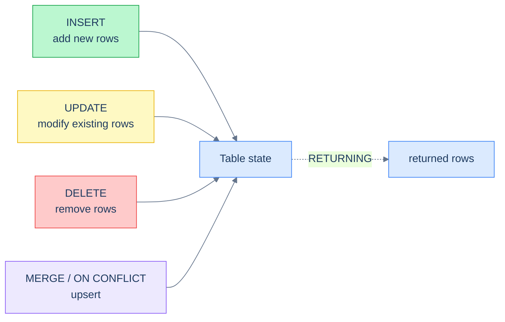

# 1. Data Manipulation

## The Hook

3:14 a.m. A senior engineer is fixing a bug in the customer-support tool. They've identified a single misconfigured customer — id 7 — and need to bump their score to 100. They open `psql` against production, draft the query, and hit return:

```sql
UPDATE customers SET score = 100;
```

Notice anything missing?

The query updates **every customer in the table to score 100**. There is no `WHERE` clause. SQL's `UPDATE` doesn't require one — without a `WHERE`, the implicit predicate is "every row." The engineer paused, hit enter, and the update committed before they could `Ctrl-C`.

Restore from backup, page the on-call DBA, write the post-mortem, learn the lesson. Every senior engineer has done this once, or has worked with someone who did. The rule that comes out of it is permanent: **never write a `DELETE` or `UPDATE` without a `WHERE` clause unless you genuinely mean every row** — and even then, type it twice.

This chapter is about DML — Data Manipulation Language. The four statements (`INSERT`, `UPDATE`, `DELETE`, plus `MERGE` and Postgres's `INSERT … ON CONFLICT`) that change the rows in a table. The `RETURNING` clause that lets a write also read. The brief introduction to transactions — the safety net under every DML statement, covered properly in the [Transactions and Concurrency](/cortex/languages/sql/index) module. And the pitfalls that put DML, not DDL, at the top of the list of "ways to take down production."

By the end you'll know how to insert, update, delete, and upsert correctly; how to use `RETURNING` to fold two queries into one; and how transactions protect you when you forget the `WHERE`.

---

## Table of contents

1. [The four DML statements](#the-four-dml-statements)
2. [`INSERT` — single row, multi-row, from `SELECT`](#insert)
3. [`INSERT … ON CONFLICT` — the upsert](#on-conflict)
4. [`UPDATE`](#update)
5. [`DELETE`](#delete)
6. [The `RETURNING` clause](#the-returning-clause)
7. [Transactions in fifty lines](#transactions-in-fifty-lines)
8. [Edge cases and pitfalls](#edge-cases-and-pitfalls)
9. [Production reality](#production-reality)
10. [Practice ladder](#practice-ladder)
11. [Cross-links](#cross-links)
12. [Final takeaway](#final-takeaway)

***

# The four DML statements

The Data Manipulation Language family changes the *rows* in a table. Compare to DDL ([previous chapter](/cortex/languages/sql/foundations/data-definition)), which changes the *table itself*.

| Statement | What it does |
|---|---|
| `INSERT` | Add new rows |
| `UPDATE` | Modify existing rows |
| `DELETE` | Remove rows |
| `MERGE` | Insert / update / delete in one statement based on a match condition |

`MERGE` is standard SQL but historically poorly supported across dialects. PostgreSQL got it in 15 (2022); SQL Server has had it since 2008; Oracle has it; MySQL doesn't. Most production code uses Postgres's older but battle-tested **`INSERT … ON CONFLICT`** (covered in [§3](#on-conflict)) instead of `MERGE` — both express "insert, or update if there's a conflict" but `ON CONFLICT` is more concise and well-understood. We'll meet `MERGE` properly in the deeper [Schema and Constraints](/cortex/languages/sql/index) module.

DML statements **always run inside a transaction** — even when you don't see one. If you don't `BEGIN` explicitly, every statement gets its own implicit transaction and auto-commits. The implications are covered in [§7](#transactions-in-fifty-lines).



<p align="center"><strong>The DML family. Each statement mutates the table's rows; <code>RETURNING</code> (Postgres / SQLite ≥3.35) optionally returns the affected rows in the same round-trip.</strong></p>

---

# INSERT

`INSERT` adds new rows to a table. The two main forms are *with explicit values* and *from a `SELECT`*.

## INSERT with VALUES

```sql run
CREATE TABLE customers (id INT, first_name TEXT, country TEXT, score INT);

INSERT INTO customers (id, first_name, country, score)
VALUES (6, 'Anna', 'USA', NULL);

SELECT * FROM customers;
```

Reads as: "into the `customers` table, with these four columns, insert one row whose values in column-order are (6, 'Anna', 'USA', NULL)."

**Multi-row insert** — much faster than N single-row inserts because there's one round-trip and one transaction. The values lists are comma-separated:

```sql run
CREATE TABLE customers (id INT, first_name TEXT, country TEXT, score INT);

INSERT INTO customers (id, first_name, country, score)
VALUES
    (6, 'Anna',    'USA',     NULL),
    (7, 'Sam',     NULL,      100),
    (8, 'Andreas', 'Germany', 200);

SELECT * FROM customers;
```

Three rows, one statement. The same applies whether you're inserting 3 rows or 30,000 (with a hard upper bound determined by the engine's bind-parameter limit; Postgres's default is 32,767 parameters per statement).

## Why list the columns?

You *can* omit the column list:

```sql
-- ⚠ legal but fragile
INSERT INTO customers VALUES (9, 'Andreas', 'Germany', NULL);
```

…but **don't, in shipped code**. The order of columns in the table is determined by the schema and can change (`ADD COLUMN` adds at the end; a future DDL might reorder). Without the column list, your `INSERT` silently maps positionally — and the day someone adds a column, your insert breaks or, worse, *quietly puts data in the wrong column*. Always list the columns in shipped DML.

## INSERT … SELECT

You can insert the result of a query:

```sql
-- Copy customers' first_names into a separate persons table
INSERT INTO persons (id, person_name, birth_date, phone)
SELECT id, first_name, NULL, 'Unknown'
FROM customers;
```

Five rows in `customers` → five rows inserted into `persons`. The `SELECT` runs first; the `INSERT` consumes the result. This is the pattern for backfills, ETL, and "copy data from one table to another" migrations.

The number and types of expressions in the `SELECT` must match the column list of the `INSERT`. If they don't, the statement errors out before any rows are inserted (DML statements are atomic — all or nothing within their transaction).

## INSERT and DEFAULT / GENERATED columns

If a column has a `DEFAULT` and you don't list it, the default applies:

```sql
-- visits.id is GENERATED ALWAYS AS IDENTITY; visits.count has DEFAULT 0
INSERT INTO visits DEFAULT VALUES;
-- One row inserted: id auto-assigned, count defaulted to 0.
```

`DEFAULT VALUES` means "use the default for every column." For columns with `GENERATED ALWAYS AS IDENTITY`, you *can't* override the value (that's the difference between `ALWAYS` and `BY DEFAULT`); `GENERATED BY DEFAULT AS IDENTITY` lets you override.

## ON CONFLICT preview

What if you `INSERT` a row whose primary key already exists?

```sql
-- ❌ assume id=1 already exists; this fails
INSERT INTO customers (id, first_name) VALUES (1, 'Maria-2');
-- ERROR: duplicate key value violates unique constraint "customers_pkey"
```

The whole statement fails — no rows inserted. The next section is about handling this gracefully.

---

# ON CONFLICT

The **upsert** — "insert if new, update if existing" — is one of the most common DML patterns in real code. Postgres expresses it as `INSERT … ON CONFLICT`:

## Do nothing on conflict

```sql
INSERT INTO customers (id, first_name, country, score)
VALUES (1, 'Maria-2', 'Germany', 999)
ON CONFLICT (id) DO NOTHING;
```

If `id = 1` already exists, the insert is silently skipped. If not, the row is inserted. Useful when you're batch-inserting from an upstream that may contain duplicates and you want the existing row to win.

## Update on conflict

```sql run
CREATE TABLE customers (id INT PRIMARY KEY, first_name TEXT, country TEXT, score INT);
INSERT INTO customers VALUES (1,'Maria','Germany',350),(2,'John','USA',900);

-- id=1 already exists → update; id=2 not affected; id=3 doesn't exist → insert.
INSERT INTO customers (id, first_name, country, score)
VALUES (1, 'Maria-2', 'Germany', 999),
       (3, 'Lisa',    'France',  600)
ON CONFLICT (id) DO UPDATE
SET first_name = EXCLUDED.first_name,
    country    = EXCLUDED.country,
    score      = EXCLUDED.score;

SELECT * FROM customers ORDER BY id;
```

If `id = 1` exists, update its `first_name`, `country`, `score` to the values that *would have been* inserted. The pseudo-table `EXCLUDED` holds the would-have-inserted row; `EXCLUDED.first_name` is the value from the `VALUES` clause.

This is what most engineers mean by "upsert." Insert if absent; merge if present. The conflict target — `(id)` — is the unique constraint that defines what counts as a conflict; it doesn't have to be the primary key, it just has to be a `UNIQUE` constraint.

## Conditional update on conflict

You can add a `WHERE` to the update:

```sql
INSERT INTO customers (id, first_name, country, score)
VALUES (1, 'Maria-2', 'Germany', 999)
ON CONFLICT (id) DO UPDATE
SET score = EXCLUDED.score
WHERE customers.score < EXCLUDED.score;
-- Only update if the new score is higher than the existing one.
```

The `WHERE` references both `customers` (the existing row) and `EXCLUDED` (the would-be-inserted row). This is "max(existing, incoming)" expressed as an upsert — the canonical pattern for syncing a counter or a high-water-mark from an external source.

> **Dialect note:** SQL Server uses `MERGE`. MySQL has `INSERT … ON DUPLICATE KEY UPDATE`. SQLite supports both `ON CONFLICT` and `INSERT OR REPLACE`. Postgres's `ON CONFLICT` is the most explicit and least error-prone of the lot — once you're used to it, the others read awkwardly.

---

# UPDATE

`UPDATE` modifies existing rows. The shape:

```sql
UPDATE table
SET column1 = expr1, column2 = expr2, ...
WHERE predicate;
```

The `WHERE` filters which rows get updated, *exactly the same way* as the `WHERE` in `SELECT`. The `SET` lists the changes. Each updated row gets its specified columns replaced; other columns are untouched.

```sql run
CREATE TABLE customers (id INT, first_name TEXT, country TEXT, score INT);
INSERT INTO customers VALUES
  (1,'Maria','Germany',350),(2,'John','USA',900),(3,'Georg','UK',750),
  (6,'Anna','USA',NULL),(10,'Sahra','USA',NULL);

-- Set the score of customer 6 to zero
UPDATE customers SET score = 0 WHERE id = 6;

-- Set both score and country for customer 10
UPDATE customers SET score = 0, country = 'UK' WHERE id = 10;

-- Update many rows: set NULL scores to 0
UPDATE customers SET score = 0 WHERE score IS NULL;

-- Verify
SELECT * FROM customers ORDER BY id;
```

The third query updates every customer with `score IS NULL` — could be one row, could be a thousand, depending on the data.

## UPDATE without WHERE updates everything

This is the chapter's hook bug:

```sql
-- ⚠ updates every row in the table
UPDATE customers SET score = 100;
```

Every customer's score becomes 100. There's no syntactic warning, no popup, no confirmation — SQL is happy to update every row. The defence isn't a tool; it's a discipline:

- **In `psql` against production, `BEGIN;` first.** Then `UPDATE`. Then check the row count. Then `COMMIT;` or `ROLLBACK;`. We'll cover transactions in [§7](#transactions-in-fifty-lines).
- **In application code, never use bare `UPDATE`s; always include the `WHERE`.** Most ORMs make this hard to forget; raw SQL doesn't.
- **In code review, treat any `UPDATE`/`DELETE` without a `WHERE` as a bug.** Even if it's intentional (e.g., resetting a flag on every row), the discipline of asking is cheaper than the cost of the one time it wasn't intentional.

## UPDATE … FROM (Postgres extension)

A common need: "update each row of A based on a join with B." Postgres expresses this with `UPDATE … FROM`:

```sql
-- Increase score by 100 for every customer with a recent order
UPDATE customers c
SET score = c.score + 100
FROM orders o
WHERE o.customer_id = c.id
  AND o.order_date >= DATE '2026-04-01';
```

Reads as: "update `customers` (aliased `c`); for each customer, look at the rows in `orders` (aliased `o`) where the customer matches and the order is recent; for each match, set `score = score + 100`."

Note: if a customer has multiple matching orders, the `SET` runs once per match — the customer's score increases by 100 for each order, not just once. To increase by 100 if they have *any* recent order, use a subquery or an `EXISTS`:

```sql
UPDATE customers c
SET score = c.score + 100
WHERE EXISTS (
  SELECT 1 FROM orders o
  WHERE o.customer_id = c.id AND o.order_date >= DATE '2026-04-01'
);
```

The standard SQL form (without `FROM` extension) is to use a subquery in `SET`:

```sql
UPDATE customers c
SET score = c.score + (
  SELECT 100 FROM orders o WHERE o.customer_id = c.id AND o.order_date >= DATE '2026-04-01' LIMIT 1
)
WHERE EXISTS (
  SELECT 1 FROM orders o WHERE o.customer_id = c.id AND o.order_date >= DATE '2026-04-01'
);
```

…which is unwieldy. The Postgres `UPDATE … FROM` is far more readable and is the production-Postgres pattern.

---

# DELETE

`DELETE` removes rows.

```sql run
CREATE TABLE customers (id INT, first_name TEXT, country TEXT, score INT);
INSERT INTO customers VALUES
  (1,'Maria','Germany',350),(2,'John','USA',900),(3,'Georg','UK',750),
  (4,'Martin','Germany',500),(5,'Peter','USA',0),(9,'Spam','XX',0);

DELETE FROM customers WHERE id = 9;
DELETE FROM customers WHERE country = 'Germany';

-- Verify: USA + UK customers remain.
SELECT * FROM customers ORDER BY id;
```

Same `WHERE` shape as `SELECT` and `UPDATE`. The `WHERE` is what differentiates "delete this row" from "delete every row that matches a predicate" from — the dangerous one — "delete every row in the table."

## DELETE without WHERE

```sql
-- ⚠ deletes every row
DELETE FROM customers;
```

Every row is gone. The schema (table definition, indexes, constraints) is intact, but no rows remain. Same discipline as `UPDATE` without `WHERE`: never in shipped code without explicit intent; always inside a transaction in interactive use; always reviewed.

For "empty the table," the right tool is usually `TRUNCATE` (covered in the [previous chapter](/cortex/languages/sql/foundations/data-definition#drop-and-truncate)) — faster, doesn't fire row-level triggers, can reset identity sequences. `DELETE FROM` is the right tool when you want a row-by-row delete (with triggers, with cascade), even if it deletes every row.

## DELETE with USING (Postgres extension)

Like `UPDATE … FROM`, Postgres supports `DELETE … USING` for delete-with-join:

```sql
-- Delete orders for customers with score = 0
DELETE FROM orders o
USING customers c
WHERE o.customer_id = c.id
  AND c.score = 0;
```

Standard SQL alternative is a subquery:

```sql
DELETE FROM orders
WHERE customer_id IN (SELECT id FROM customers WHERE score = 0);
```

Both work; the `USING` form is more efficient when the join is large.

## CASCADE deletes

If `orders.customer_id` had a foreign key with `ON DELETE CASCADE`, deleting a customer would automatically delete their orders. This is convenient for cleanup but dangerous if you didn't intend it; full discussion in [Keys and References](/cortex/languages/sql/index).

---

# The RETURNING clause

A Postgres feature (also in some other dialects, including SQLite ≥3.35) that lets a `INSERT`, `UPDATE`, or `DELETE` *also return rows*. It folds two questions into one round-trip.

```sql run
CREATE TABLE customers (id INTEGER PRIMARY KEY, first_name TEXT, country TEXT, score INT);

-- After insert, return the auto-assigned id and the inserted name in one round-trip.
INSERT INTO customers (first_name, country, score)
VALUES ('Lisa', 'France', 200)
RETURNING id, first_name;
```

The insert has happened, *and* the new id is returned. Without `RETURNING`, the application would have to do `INSERT` then `SELECT … WHERE first_name = 'Lisa' AND country = 'France' …` — two round-trips, plus a race condition if there's another insert in between.

`RETURNING` works on `UPDATE` and `DELETE` too:

```sql
-- Update and return the new value
UPDATE visits SET count = count + 1 RETURNING count;

-- Delete and return what was deleted
DELETE FROM orders WHERE order_date < DATE '2025-01-01' RETURNING order_id, customer_id;
```

The `UPDATE … RETURNING count` is the **exact production query** behind codefolio's `/api/hello` counter. One round-trip, one statement, atomic increment, the new value returned. We'll cover this in [Production reality](#production-reality) below.

`RETURNING *` returns every column, like `SELECT *` does. Same caveats apply (don't ship it; list columns explicitly).

> **Dialect note:** SQL Server uses `OUTPUT` for the same feature. Oracle has `RETURNING INTO`. MySQL doesn't have a portable equivalent — common workaround is `LAST_INSERT_ID()` after the insert. The Postgres/SQLite `RETURNING` form is the most flexible.

---

# Transactions in fifty lines

A transaction is a group of statements that either all succeed or all fail — atomically. The full treatment is in [Transactions and Concurrency](/cortex/languages/sql/index); the foundations-level summary:

```sql
BEGIN;                          -- start a transaction
  UPDATE accounts SET balance = balance - 100 WHERE id = 1;
  UPDATE accounts SET balance = balance + 100 WHERE id = 2;
COMMIT;                         -- both updates land, atomically
```

If you want to abandon the transaction:

```sql
BEGIN;
  UPDATE customers SET score = 0;       -- ⚠ forgot the WHERE
  -- "Oh no."
ROLLBACK;                                -- undo. No customer changed.
```

`ROLLBACK` undoes every change since `BEGIN`. The customer scores are intact.

This is the safety net for interactive DML. If you're typing into `psql` against production, **make `BEGIN;` your first action**. Run your statements. Run a `SELECT` to verify the result. Then `COMMIT;` if it's right, `ROLLBACK;` if it's wrong. The cost is two extra keystrokes; the upside is recoverable typos.

Outside an explicit `BEGIN`, every statement runs in its own implicit transaction and auto-commits. This is fine for `SELECT`s and intentional point-in-time DML; it's a footgun the moment you make a mistake.

The full chapters in [Transactions and Concurrency](/cortex/languages/sql/index) cover ACID guarantees, isolation levels, MVCC, locks, and savepoints. For now: **`BEGIN`/`COMMIT`/`ROLLBACK` is your friend whenever you're touching DML interactively.**

---

# Edge cases and pitfalls

## `WHERE`-less DML

Already discussed in [§4](#update) and [§5](#delete) but worth repeating: every `WHERE`-less `UPDATE` or `DELETE` should be deliberate, reviewed, and (in interactive use) inside a transaction. The cost of the one time it bites you is permanent.

## DML inside a long-running transaction

If you `BEGIN;` and then forget to `COMMIT;` or `ROLLBACK;`, your transaction stays open. In Postgres, an open transaction holds locks on the rows it's modified, blocks `VACUUM`, prevents schema changes, and can pile up `xmin` horizons that bloat the database. **Don't leave transactions open.** Some `psql` UIs warn you; some don't. The standard discipline: every `BEGIN;` you type, type the matching `COMMIT;` or `ROLLBACK;` before you tab away.

## Triggers fire on DML

If a table has a trigger (a function that runs on insert/update/delete), every row affected by the DML fires the trigger. A `DELETE FROM customers` against a million-row table with a trigger is not just a million row deletions — it's a million trigger invocations. Triggers are out of scope for this chapter, but flag them mentally as "more is happening than the SQL shows."

## Auto-increment / IDENTITY values are not reused

If you `INSERT` and roll back, the auto-assigned `id` value is *consumed* — the next insert gets the next id, not the rolled-back one. This is a feature, not a bug; reusing ids would create races between concurrent transactions. The implication: there will be gaps in your ids over time. That's normal. **If your application logic requires "no gaps in ids," your application logic is wrong** — IDs are unique identifiers, not ordinal counters.

## NULL behaviour in DML

Same NULL rules as in `SELECT` (see [Filtering](/cortex/languages/sql/foundations/filtering#the-null-trap)). `WHERE country = NULL` matches nothing in `UPDATE` and `DELETE` too; use `WHERE country IS NULL` for the rows you want.

## RETURNING vs SELECT after-the-fact

It's tempting to write:

```sql
-- ⚠ race condition: another transaction can insert between these two
INSERT INTO customers (first_name) VALUES ('Lisa');
SELECT id FROM customers WHERE first_name = 'Lisa' ORDER BY id DESC LIMIT 1;
```

…to get the auto-assigned id. **Don't.** Between the `INSERT` and the `SELECT`, another transaction can insert another `'Lisa'`, and you'd return the wrong id. Use `RETURNING` instead:

```sql
INSERT INTO customers (first_name) VALUES ('Lisa') RETURNING id;
```

One round-trip, no race.

---

# Production reality

The codefolio `/api/hello` endpoint is *almost entirely DML*. Here's the canonical SQL that runs on every request to that endpoint, drawn from [`server/src/main/scala/codefolio/server/helloPipeline/Visits.scala`](https://github.com/):

```sql
UPDATE visits SET count = count + 1 RETURNING count;
```

One statement. Three SQL features:

**(1) `UPDATE`** — modifying the single row of the `visits` table. `count = count + 1` is an in-place atomic increment; the database reads the current value, adds one, writes it back. (This is atomic at the row level: two concurrent requests will produce two distinct increments, never a lost update.)

**(2) No `WHERE`** — but it's safe in this case because the table is by-design a *singleton*. Only one row exists. Updating "every row" is updating exactly one row. The DDL that creates the table seeds it with `INSERT INTO visits (count) VALUES (0)` so the row always exists before the first `UPDATE`. (See the [DDL chapter](/cortex/languages/sql/foundations/data-definition#production-reality) for the full schema.)

**(3) `RETURNING count`** — fold the read into the write. Without `RETURNING`, the handler would `UPDATE` then `SELECT count FROM visits` — two round-trips, racy under concurrency. With `RETURNING`, one round-trip, the value the increment landed on is the value returned.

This single SQL statement embodies the production pattern: minimal round-trips, atomic semantics, no unnecessary data fetched, no race conditions to reason about. It's six lines of Scala in `Visits.scala` to wire it up — a `PreparedStatement`, a `ResultSet.getLong("count")`, and an exception handler. Every endpoint in the codebase that increments a counter, marks a flag, or atomically updates a row should look like this.

The other DML endpoints in the codebase follow the same pattern. The Mongo `hello_events` collection is appended to with an `insertOne` for every request — the SQL equivalent (if `hello_events` were Postgres-backed) would be:

```sql
INSERT INTO hello_events (timestamp_ms, visits)
VALUES ($1, $2);
```

Two `PreparedStatement` parameters, no `RETURNING` (we don't need the auto-assigned id), one round-trip per write. Append-only, idempotent-on-replay, minimal coupling.

Production SQL in real codebases is heavily DML by volume — every write is some form of `INSERT` or `UPDATE`. The discipline is to keep each one small, atomic, and explicit. The discipline is also to use transactions when atomicity *across* statements is needed — and *not* to use them when each statement is its own atomic unit, because long transactions cause their own problems.

---

# Practice ladder

Use the [sample schema](/cortex/languages/sql/foundations/introduction-to-sql#the-sample-schema) in a scratch database. **Do every DML inside a `BEGIN; … ROLLBACK;` block** so your sample data isn't lost.

1. **Insert a new customer with `id = 6`, first_name `'Lisa'`, country `'France'`, score `200`. Return the new row using `RETURNING *`.** *Hint: column-listed `INSERT … RETURNING …`.*
2. **Insert two customers in one statement.** *Hint: multi-row `VALUES`.*
3. **Update Maria's (`id = 1`) country to `'Austria'`. Verify with a `SELECT`. Then `ROLLBACK` to undo.** *Hint: `UPDATE` + `WHERE id = 1`.*
4. **Predict what this query does, then run it inside a transaction:**
   ```sql
   UPDATE customers SET score = score * 2;
   ```
   *Hint: count the `WHERE` clauses. How many rows does it affect?*
5. **Use `RETURNING` to delete every order placed before April 15, 2026, and return the deleted rows.** *Hint: `DELETE … WHERE order_date < … RETURNING *`.*
6. **Upsert a customer with `id = 1`: if the row exists, update country to `'Switzerland'` and score to `999`; if not, insert with those values.** *Hint: `INSERT … ON CONFLICT (id) DO UPDATE SET … = EXCLUDED.…`.*
7. **Use `INSERT … SELECT` to copy every customer with score > 500 into a new `vip_customers` table.** *Hint: create the empty `vip_customers` first (with the same column shape as `customers`), then `INSERT INTO vip_customers (…) SELECT … FROM customers WHERE …`.*
8. **Why is this query racy, and how do you fix it without `RETURNING`?**
   ```sql
   INSERT INTO customers (first_name) VALUES ('Lisa');
   SELECT MAX(id) FROM customers;
   ```
   *Hint: what could happen between the two statements? What's the right answer?*

***

# Cross-links

- **Previous in this module:** [Data Definition](/cortex/languages/sql/foundations/data-definition) — the table-creation cousin to DML. DDL builds the bottle; DML pours the wine.
- **Next module:** [Working with Multiple Tables](/cortex/languages/sql/index) — joins, set operators, subqueries. Once you have data in multiple tables, the question becomes how to combine them — which is also where `UPDATE … FROM` and `DELETE … USING` (mentioned briefly here) get their full treatment.
- **Forward reference:** [Transactions and Concurrency](/cortex/languages/sql/index) — ACID, isolation levels, MVCC, locking, deadlocks. The full story behind the fifty-line summary in [§7](#transactions-in-fifty-lines).
- **Forward reference:** [Schema and Constraints](/cortex/languages/sql/index) — `MERGE`, advanced foreign-key cascades, partition-aware DML. The deeper concerns that touch DML once your schemas grow up.
- **DSA cross-reference:** [Hash Table](/cortex/data-structures-and-algorithms/linear-structures-hash-table-introduction-to-hash-tables) — `INSERT … ON CONFLICT (key) DO UPDATE` is the SQL form of "if the key is there, update; else, insert," which is the exact semantics of a hash-table `set` operation. Same idea, different scale.

***

# Final Takeaway

DML is where SQL meets production. Three patterns to internalise:

1. **Always include the `WHERE` clause unless you genuinely mean every row.** A `WHERE`-less `UPDATE` or `DELETE` looks identical to one with a `WHERE` until it runs. The defence is discipline (and `BEGIN; … ROLLBACK;`), not syntax — SQL won't catch you.
2. **`RETURNING` folds two questions into one round-trip.** Insert and get the new id; update and get the new value; delete and audit what was removed. Whenever your application code does "DML, then `SELECT` to find out what happened," replace it with `RETURNING`.
3. **Wrap interactive DML in transactions; keep them short.** `BEGIN; … COMMIT;` is the safety net for typed-into-psql changes. Long-running transactions are themselves a problem — they hold locks, block `VACUUM`, and bloat the database. Open, do the work, close.

Master these three and DML becomes the boring, predictable layer it should be — leaving your attention free for the fun parts: joins, aggregations, and windows in the modules ahead.

## Your Turn

Before you move on, check your understanding with the coach — explain the idea, apply it, weigh the trade-offs, then defend your reasoning.

<div class="concept-coach"></div>
