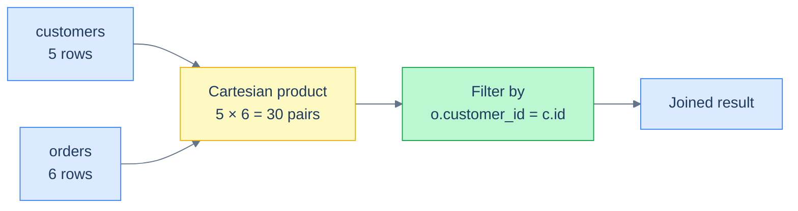
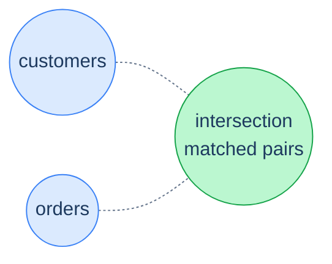

# 1. Joins

## The Hook

A junior engineer writes a report. "Customers and their orders." They run:

```sql
SELECT c.first_name, o.order_id, o.sales
FROM customers c, orders o;
```

The result has 30 rows. There are 5 customers and 6 orders. The engineer didn't ask for 30; they asked for "customers and their orders." But that's what the query *says* — every customer paired with every order, regardless of whether the order is theirs. **5 × 6 = 30**. The first time this happens to you in production with a million rows on each side, you produce a trillion-row Cartesian explosion that fills the buffer, the planner gives up, and your query hits the timeout.

The bug is the *missing join condition*. `FROM customers, orders` says "give me every combination of a customer-row and an order-row." It's the **CROSS JOIN** in disguise — usually wrong, occasionally what you want. The engineer meant to ask "give me each customer paired with their *own* orders" — which requires telling the database what makes a row in `customers` "match" a row in `orders`. That's the `ON` clause:

```sql
SELECT c.first_name, o.order_id, o.sales
FROM customers c
JOIN orders o ON o.customer_id = c.id;
```

5 customers and 6 orders, but only 5 of those 6 orders link to a real customer (order 1006 references the non-existent customer 9). So the result is 5 rows. The shape of the join — `INNER`, `LEFT`, etc. — controls what happens to the orphan order, and to customers with no orders. This chapter is about the five shapes, the difference between `ON` and `WHERE`, and the two or three patterns that account for 80% of real-world join bugs.

By the end you'll know which join to reach for in each situation, why a `WHERE` clause on the wrong side of a `LEFT JOIN` silently turns it into an `INNER JOIN`, and how to read a multi-table join without losing track of which table each column belongs to.

---

## Table of contents

1. [Why join](#why-join)
2. [`INNER JOIN`](#inner-join)
3. [`LEFT JOIN`](#left-join)
4. [`RIGHT JOIN` and `FULL OUTER JOIN`](#right-and-full-join)
5. [`CROSS JOIN`](#cross-join)
6. [`ON` vs `WHERE`](#on-vs-where)
7. [Multi-table joins](#multi-table-joins)
8. [Self-joins](#self-joins)
9. [Edge cases and pitfalls](#edge-cases-and-pitfalls)
10. [Production reality](#production-reality)
11. [Practice ladder](#practice-ladder)
12. [Cross-links](#cross-links)
13. [Final takeaway](#final-takeaway)

***

# Why join

The relational model factors data across multiple tables. Customers go in `customers`. Orders go in `orders`. The relationship between an order and its customer is captured by `orders.customer_id` — a foreign key referencing `customers.id`. When you ask a question that needs both tables — "which country does this order's customer live in?", "how many orders did Maria place?" — the database has to *combine* rows from both. That combination is the **join**.

A join is conceptually two steps:

1. **Pair every row in A with every row in B** (the Cartesian product).
2. **Keep only the pairs that satisfy the join condition** (the `ON` predicate).



<p align="center"><strong>The mental model. Cartesian product is the gross-up; the join condition filters back down to the pairs that mean something. The query planner doesn't actually materialise the whole Cartesian product — it uses indexes and hash tables to find matches efficiently — but the <em>semantics</em> are exactly this.</strong></p>

In practice you almost never write the Cartesian-product form. You write `JOIN ... ON ...` and let the engine do both steps in one shot. The five join shapes differ in *what happens to rows that don't have a match*:

| Join | Rows kept |
|---|---|
| `INNER JOIN` | only rows where the condition matches on both sides |
| `LEFT JOIN` | every row from the left table, with NULLs for unmatched right rows |
| `RIGHT JOIN` | every row from the right table, with NULLs for unmatched left rows |
| `FULL OUTER JOIN` | every row from both, with NULLs where there's no match |
| `CROSS JOIN` | every pair (the Cartesian product, with no filter) |

That's the catalogue. Now the details.

---

# INNER JOIN

The default. `INNER JOIN` keeps only rows where the `ON` condition matches on both sides. Customers without orders disappear; orders without a matching customer disappear.

```sql run
CREATE TABLE customers (id INT, first_name TEXT, country TEXT, score INT);
CREATE TABLE orders (order_id INT, customer_id INT, order_date DATE, sales INT);
INSERT INTO customers VALUES (1,'Maria','Germany',350),(2,'John','USA',900),(3,'Georg','UK',750),(4,'Martin','Germany',500),(5,'Peter','USA',0);
INSERT INTO orders VALUES (1001,1,'2026-04-03',120),(1002,1,'2026-04-15',80),(1003,2,'2026-04-22',450),(1004,3,'2026-04-28',200),(1005,4,'2026-05-01',300),(1006,9,'2026-05-04',150);

-- Customers with their orders. Peter (no orders) and order 1006 (orphan) both vanish.
SELECT c.first_name, o.order_id, o.sales
FROM customers c
INNER JOIN orders o ON o.customer_id = c.id
ORDER BY c.id, o.order_id;
```

5 rows: every order that has a matching customer, every customer that has at least one order. Peter (id 5, no orders) is missing. Order 1006 (customer 9 doesn't exist) is missing. That's the *inner* part — only the *inner* intersection of the two sides.

The keyword `INNER` is optional — `JOIN` alone means `INNER JOIN`. Both forms are common; this book uses `INNER JOIN` when explicitness aids reading and `JOIN` in tight queries.



<p align="center"><strong>INNER JOIN: only the matched pairs are kept. Customers without orders fall outside the intersection; orders without customers fall outside.</strong></p>

This is the right join when both sides are *required* — you're asking "which customer placed which order", and a customer without an order has no answer.

---

# LEFT JOIN

`LEFT JOIN` keeps **every row from the left table**, even if the right table has no match. Unmatched right-side columns come back as `NULL`.

```sql run
CREATE TABLE customers (id INT, first_name TEXT, country TEXT, score INT);
CREATE TABLE orders (order_id INT, customer_id INT, order_date DATE, sales INT);
INSERT INTO customers VALUES (1,'Maria','Germany',350),(2,'John','USA',900),(3,'Georg','UK',750),(4,'Martin','Germany',500),(5,'Peter','USA',0);
INSERT INTO orders VALUES (1001,1,'2026-04-03',120),(1002,1,'2026-04-15',80),(1003,2,'2026-04-22',450),(1004,3,'2026-04-28',200),(1005,4,'2026-05-01',300),(1006,9,'2026-05-04',150);

-- Every customer; orders if they have any, NULL columns if they don't.
SELECT c.first_name, o.order_id, o.sales
FROM customers c
LEFT JOIN orders o ON o.customer_id = c.id
ORDER BY c.id, o.order_id;
```

6 rows. Maria appears twice (two orders). John, Georg, Martin appear once each. **Peter appears with NULL order_id and NULL sales** — that's the LEFT JOIN behaviour. Order 1006 is still missing because it's on the right side and has no matching customer.

> The keyword `LEFT JOIN` is short for `LEFT OUTER JOIN`. The `OUTER` is optional and conventionally dropped. This book uses `LEFT JOIN`.

`LEFT JOIN` is the right tool whenever you want to keep every row of the "primary" side and *augment* it with optional information from another table. "Customers and their last order, even customers who never ordered." "Products and their reviews, even products with no reviews." "Users and their preferences, with sensible defaults if no preferences row exists."

The `NULL` columns are the signal: a `LEFT JOIN` says "here are some rows; if you see `NULL` in the right-side columns, this row had no match." The next chapter ([Anti-joins and Existence](/cortex/languages/sql/multiple-tables/anti-joins-and-existence)) shows how to filter for *only* the unmatched rows.

---

# RIGHT and FULL JOIN

`RIGHT JOIN` is the mirror of `LEFT JOIN`: every row from the **right** table, with NULLs for unmatched left rows.

```sql run
CREATE TABLE customers (id INT, first_name TEXT, country TEXT, score INT);
CREATE TABLE orders (order_id INT, customer_id INT, order_date DATE, sales INT);
INSERT INTO customers VALUES (1,'Maria','Germany',350),(2,'John','USA',900),(3,'Georg','UK',750),(4,'Martin','Germany',500),(5,'Peter','USA',0);
INSERT INTO orders VALUES (1001,1,'2026-04-03',120),(1002,1,'2026-04-15',80),(1003,2,'2026-04-22',450),(1004,3,'2026-04-28',200),(1005,4,'2026-05-01',300),(1006,9,'2026-05-04',150);

-- Every order; customer info if known, NULL if not.
-- Note: SQLite supported RIGHT JOIN starting in 3.39 (June 2022).
SELECT c.first_name, o.order_id, o.sales
FROM customers c
LEFT JOIN orders o ON o.customer_id = c.id        -- LEFT JOIN equivalent below
ORDER BY c.id, o.order_id;
```

> **Style note:** in production code, prefer `LEFT JOIN` over `RIGHT JOIN`. The two are equivalent — `A RIGHT JOIN B` produces the same result as `B LEFT JOIN A` — and pinning the "primary" table on the left makes the query read top-down. Most senior engineers I know never write `RIGHT JOIN` voluntarily.

`FULL OUTER JOIN` keeps every row from **both** tables. Customers without orders appear with NULL order columns; orders without customers appear with NULL customer columns; matched pairs appear once.

```sql run
CREATE TABLE customers (id INT, first_name TEXT, country TEXT, score INT);
CREATE TABLE orders (order_id INT, customer_id INT, order_date DATE, sales INT);
INSERT INTO customers VALUES (1,'Maria','Germany',350),(2,'John','USA',900),(3,'Georg','UK',750),(4,'Martin','Germany',500),(5,'Peter','USA',0);
INSERT INTO orders VALUES (1001,1,'2026-04-03',120),(1002,1,'2026-04-15',80),(1003,2,'2026-04-22',450),(1004,3,'2026-04-28',200),(1005,4,'2026-05-01',300),(1006,9,'2026-05-04',150);

-- Every customer AND every order. Peter shows up (no orders); order 1006 shows up (no customer).
SELECT c.first_name, o.order_id, o.sales
FROM customers c
FULL OUTER JOIN orders o ON o.customer_id = c.id
ORDER BY COALESCE(c.id, 999), o.order_id;
```

7 rows: 5 matched + Peter (no orders) + order 1006 (no customer). Useful when you genuinely want to inventory both sides — typical use case is a reconciliation query: "find rows that exist on one side and not the other."

> **Dialect note:** MySQL doesn't support `FULL OUTER JOIN`. The portable workaround is `LEFT JOIN UNION RIGHT JOIN`, which is verbose. SQLite gained `FULL OUTER JOIN` in 3.39 (June 2022), so older SQLite versions may not support it.

---

# CROSS JOIN

`CROSS JOIN` is the explicit Cartesian product — every row of A paired with every row of B, with no filter.

```sql run
CREATE TABLE customers (id INT, first_name TEXT);
CREATE TABLE products (product_id INT, name TEXT);
INSERT INTO customers VALUES (1,'Maria'),(2,'John');
INSERT INTO products VALUES (101,'Widget'),(102,'Gadget'),(103,'Sprocket');

-- Every customer × every product. 2 customers × 3 products = 6 rows.
SELECT c.first_name, p.name
FROM customers c
CROSS JOIN products p
ORDER BY c.id, p.product_id;
```

Six rows. Useful when you genuinely want all pairs: a calendar × a product line, a date dimension × a metric list, a "show me every combination" report.

The two forms below are equivalent — both produce a Cartesian product:

```sql
-- Explicit:
SELECT * FROM customers CROSS JOIN products;

-- Implicit (from older comma syntax — danger zone):
SELECT * FROM customers, products;
```

The implicit form (`FROM A, B`) is the one in this chapter's hook — it produces a Cartesian product, which is *almost never* what you want. Modern code uses the explicit `CROSS JOIN` form when a Cartesian product is desired and `JOIN ... ON ...` everywhere else. If you see `FROM A, B` in unfamiliar code without an `ON`-style condition in the `WHERE`, treat it as suspicious until proven correct.

---

# ON vs WHERE

The single most common production SQL bug is putting a filter in the wrong place. `ON` and `WHERE` look interchangeable; they're not.

For an `INNER JOIN`, they happen to produce the same result — both filter rows, and the order doesn't matter. For an outer join (`LEFT`/`RIGHT`/`FULL`), they behave **completely differently**.

## The trap

"Customers and their April orders, including customers with no April orders":

```sql run
CREATE TABLE customers (id INT, first_name TEXT);
CREATE TABLE orders (order_id INT, customer_id INT, order_date DATE);
INSERT INTO customers VALUES (1,'Maria'),(2,'John'),(5,'Peter');
INSERT INTO orders VALUES (1001,1,'2026-04-03'),(1003,2,'2026-04-22'),(1005,1,'2026-05-01');

-- ❌ WRONG: filter in WHERE turns LEFT JOIN into INNER JOIN.
-- Peter is missing because his row has o.order_date = NULL,
-- and `NULL >= '2026-04-01'` is UNKNOWN, which WHERE drops.
SELECT c.first_name, o.order_id, o.order_date
FROM customers c
LEFT JOIN orders o ON o.customer_id = c.id
WHERE o.order_date >= '2026-04-01' AND o.order_date < '2026-05-01';
```

Run that. Peter is missing — even though we asked for "customers with no April orders" to be included. The `LEFT JOIN` did its job: every customer including Peter got a row, with `NULL` for Peter's order columns. Then `WHERE` evaluated `NULL >= '2026-04-01'`, got `UNKNOWN`, and dropped Peter's row. The `LEFT JOIN` was silently turned into an `INNER JOIN`.

The fix: put the filter in `ON`, not `WHERE`. `ON` runs *before* the outer-join NULL-padding, so it filters the right side without affecting the left:

```sql run
CREATE TABLE customers (id INT, first_name TEXT);
CREATE TABLE orders (order_id INT, customer_id INT, order_date DATE);
INSERT INTO customers VALUES (1,'Maria'),(2,'John'),(5,'Peter');
INSERT INTO orders VALUES (1001,1,'2026-04-03'),(1003,2,'2026-04-22'),(1005,1,'2026-05-01');

-- ✅ CORRECT: filter in ON. Peter still gets his NULL row.
SELECT c.first_name, o.order_id, o.order_date
FROM customers c
LEFT JOIN orders o
  ON o.customer_id = c.id
 AND o.order_date >= '2026-04-01'
 AND o.order_date < '2026-05-01'
ORDER BY c.id;
```

Now Peter is in the result with NULL order columns — and Maria's order 1005 (May 1) is excluded. That's the right answer.

## The rule of thumb

- **Filter on the OUTER (preserved) side?** Put it in `WHERE`.
- **Filter on the INNER (NULL-padded) side?** Put it in `ON`.
- **Filter on the matched-pairs intersection (INNER JOIN)?** Either works; convention is `WHERE` for row-level filters, `ON` for join conditions.

Get this rule wrong and a `LEFT JOIN` silently behaves like an `INNER JOIN`. The bug is invisible — the query runs, returns rows, just the wrong rows. **Every join review at code-review time should ask "is this filter where the author intended it?"**

---

# Multi-table joins

Joins chain: `A JOIN B ON ... JOIN C ON ...`. Each step joins the running result to the next table. The order matters for *readability*; the planner is free to execute in any order it thinks is fastest.

A four-table join from the [sample schema](/cortex/languages/sql/foundations/introduction-to-sql#the-sample-schema):

```sql run
CREATE TABLE customers (id INT, first_name TEXT, country TEXT, score INT);
CREATE TABLE orders (order_id INT, customer_id INT, order_date DATE, sales INT);
CREATE TABLE hello_events (id INT, timestamp_ms INT, visits INT);
INSERT INTO customers VALUES (1,'Maria','Germany',350),(2,'John','USA',900),(3,'Georg','UK',750),(4,'Martin','Germany',500),(5,'Peter','USA',0);
INSERT INTO orders VALUES (1001,1,'2026-04-03',120),(1002,1,'2026-04-15',80),(1003,2,'2026-04-22',450),(1004,3,'2026-04-28',200),(1005,4,'2026-05-01',300);

-- For each customer with orders, total sales by country.
SELECT c.country,
       c.first_name,
       SUM(o.sales) AS total_sales
FROM customers c
JOIN orders o ON o.customer_id = c.id
GROUP BY c.country, c.id, c.first_name
ORDER BY c.country, total_sales DESC;
```

That brings two tables together, groups, aggregates, and orders. We'll cover `GROUP BY` in detail in [the next module](/cortex/languages/sql/aggregation/index); the join shape is the relevant part here.

When chaining joins, **each `ON` clause must reference the running result and the new table**, not just any two tables. If `B` joins to `A` on `B.a_id = A.id`, and `C` joins to `B` on `C.b_id = B.id`, you can't `JOIN C ON C.b_id = B.id` unless `B` is in scope — meaning you've already joined it. The order in which joins appear is the order in which their `ON` clauses can reference earlier tables.

## Always alias your tables

In a multi-table join, **alias every table**. Long names + repeated qualifications turn unreadable fast. Single-letter aliases — `c`, `o`, `p` — are conventional and readable in real codebases.

```sql
-- ❌ Painful to read.
SELECT customers.first_name, orders.sales, products.name
FROM customers
JOIN orders ON orders.customer_id = customers.id
JOIN order_items ON order_items.order_id = orders.order_id
JOIN products ON products.product_id = order_items.product_id;

-- ✅ Same query, with aliases.
SELECT c.first_name, o.sales, p.name
FROM customers     c
JOIN orders        o  ON o.customer_id = c.id
JOIN order_items   oi ON oi.order_id   = o.order_id
JOIN products      p  ON p.product_id  = oi.product_id;
```

The aliases also disambiguate column names — if `customers.id` and `orders.id` are both in scope, `id` alone is ambiguous; `c.id` and `o.id` are not.

---

# Self-joins

A table can be joined with *itself*. Useful when each row references another row in the same table — typically through a hierarchy or a graph relationship.

Suppose `employees` has a `manager_id` column referencing another row's `id`. To list each employee with their manager's name:

```sql run
CREATE TABLE employees (id INT, name TEXT, manager_id INT);
INSERT INTO employees VALUES
  (1,'Alice',  NULL),  -- CEO
  (2,'Bob',    1),
  (3,'Charlie',1),
  (4,'Diana',  2),
  (5,'Eve',    2);

-- Self-join: e is the employee, m is their manager.
SELECT e.name AS employee, m.name AS manager
FROM employees e
LEFT JOIN employees m ON m.id = e.manager_id
ORDER BY e.id;
```

Note we use a **`LEFT JOIN`** because Alice (CEO) has `manager_id = NULL` — using an INNER JOIN would drop her. Both aliases (`e`, `m`) refer to the same physical table; the alias is what makes the query make sense.

For deeper hierarchical traversal — "everyone in Alice's reporting chain" — you reach for **recursive CTEs**, covered in the [CTEs and Recursion](/cortex/languages/sql/index) module.

---

# Edge cases and pitfalls

## Forgetting the `ON` clause

```sql
-- ❌ Most engines refuse this; some quietly do a Cartesian product.
SELECT * FROM customers JOIN orders;
```

Postgres errors: "syntax error". MySQL silently does a `CROSS JOIN`. SQLite errors. Always include `ON` for explicit-syntax joins, or use `CROSS JOIN` if a Cartesian product is genuinely desired.

## Duplicating rows by joining a many-to-one

If you join `customers` to `orders` and a customer has 10 orders, that customer appears 10 times in the result. Then if you `SUM(c.score)` you've summed each customer's score 10 times. **Aggregating after a join is the most common source of "the numbers are 10× too high" bugs.**

The rule: aggregate the many-side *first* (in a subquery or CTE), then join to the one-side. Or use `SELECT DISTINCT` if you genuinely just want the unique customer rows.

## `USING` and `NATURAL JOIN`

Two shorthand forms worth knowing about, even if you avoid them:

```sql
-- USING(col): the join condition is `a.col = b.col`. Both sides must have a column with this name.
SELECT * FROM customers c JOIN orders o USING (id);  -- ⚠ probably not what you want

-- NATURAL JOIN: join on every column with the same name in both tables. Magic and dangerous.
SELECT * FROM customers c NATURAL JOIN orders;
```

`NATURAL JOIN` is the sharper footgun: if both tables happen to have a `created_at` column, `NATURAL JOIN` joins on it, silently. Avoid it. `USING` is less dangerous but still depends on column-naming conventions; production code generally uses explicit `ON`.

## `ON ... = NULL` doesn't match

A foreign-key column with NULL means "this row has no link." `ON c.id = o.customer_id` won't match a row where `o.customer_id` is NULL — same NULL trap as in [Filtering](/cortex/languages/sql/foundations/filtering#the-null-trap). To deliberately match NULL on both sides, use `IS NOT DISTINCT FROM`:

```sql
ON c.id IS NOT DISTINCT FROM o.customer_id
```

`IS NOT DISTINCT FROM` is `=` but with `NULL = NULL` returning `TRUE`. Rare in practice — usually NULLs in foreign keys mean "no relationship," and you don't want to match them.

## The order of joins is not the execution order

When you write `A JOIN B JOIN C JOIN D`, the planner is free to execute the joins in any order — it might join `A` and `C` first if that's cheaper, then bring in `B` and `D`. Don't assume the textual order is the execution order. The result is always the same; the cost can differ enormously. We'll see this in [EXPLAIN and Query Plans](/cortex/languages/sql/index).

---

# Production reality

Codefolio's stack uses joins lightly today (the schema is small) but the patterns scale. The `/api/recent` query in [`HelloEventLog.scala`](https://github.com/) currently surfaces just the `hello_events` collection. Imagine extending it to "recent events with the customer who triggered them" — a typical product evolution. The query becomes a join:

```sql
SELECT e.timestamp_ms, e.visits, c.first_name, c.country
FROM hello_events e
LEFT JOIN customers c ON c.id = e.customer_id  -- if hello_events grows a customer_id
ORDER BY e.timestamp_ms DESC
LIMIT 10;
```

`LEFT JOIN` because not every event needs to belong to a logged-in customer (anonymous visits exist). Postgres makes this fast with a B-tree index on `hello_events.timestamp_ms` (already exists) and a B-tree on `hello_events.customer_id` (would be added with the new column).

A more realistic production join is the *reconciliation* shape — find rows on one side that aren't on the other:

```sql
-- Find events whose customer record was deleted (e.g., GDPR right-to-be-forgotten).
SELECT e.id, e.timestamp_ms
FROM hello_events e
LEFT JOIN customers c ON c.id = e.customer_id
WHERE e.customer_id IS NOT NULL
  AND c.id IS NULL;
```

This is the **anti-join** pattern — "rows in events with no matching customer." Full coverage in [Anti-joins and Existence](/cortex/languages/sql/multiple-tables/anti-joins-and-existence). It's how reconciliation jobs catch dangling references in production data — usually as a scheduled query that emits a list to a monitoring dashboard.

---

# Practice ladder

Use the [sample schema](/cortex/languages/sql/foundations/introduction-to-sql#the-sample-schema) — runnable blocks above bundle the seed data inline.

1. **List every customer's name and the date of each of their orders.** *Hint: `INNER JOIN customers c JOIN orders o ON …`.*
2. **List every customer, plus the dates of their orders if any. Customers with no orders should still appear, with NULLs for date.** *Hint: which join keeps unmatched left rows?*
3. **List every order, plus its customer's name. Include orders with no matching customer.** *Hint: which join keeps unmatched right rows? (Or: rewrite to keep them on the left.)*
4. **Predict the row count of:**
   ```sql
   SELECT * FROM customers c, orders o;
   ```
   *Hint: rows in customers × rows in orders. What is the multiplier? Is this what you wanted?*
5. **For each customer in Germany, list their total order-sales.** *Hint: `JOIN ... GROUP BY ... SUM(...)`. Watch out for customers with no orders.*
6. **What does this query return, and why is the WHERE clause arguably wrong?**
   ```sql
   SELECT c.first_name, o.order_id
   FROM customers c
   LEFT JOIN orders o ON o.customer_id = c.id
   WHERE o.sales > 200;
   ```
   *Hint: which side does the filter run on? What does it do to NULL `o.sales`? Where should the filter go to preserve the LEFT JOIN's intent?*
7. **Self-join: list every pair of customers from the same country.** *Hint: `customers c1 JOIN customers c2 ON c1.country = c2.country AND c1.id < c2.id` — the second condition prevents pairing a customer with themselves and prevents listing each pair twice.*

***

# Cross-links

- **Previous in this module:** [Working with Multiple Tables — index](/cortex/languages/sql/multiple-tables/index).
- **Next in this module:** [Set Operators](/cortex/languages/sql/multiple-tables/set-operators) — the cousin operation: combining *result-sets* (`UNION`, `INTERSECT`, `EXCEPT`) rather than columns.
- **Forward reference:** [Subqueries](/cortex/languages/sql/multiple-tables/subqueries) — when "join" isn't the right shape; when a query-inside-a-query is.
- **Forward reference:** [Anti-joins and Existence](/cortex/languages/sql/multiple-tables/anti-joins-and-existence) — the LEFT JOIN ... IS NULL idiom for "rows where no match" plus the NOT EXISTS alternative.
- **Forward reference:** [B-Tree Indexes](/cortex/languages/sql/index) and [EXPLAIN and Query Plans](/cortex/languages/sql/index) — what the planner does with a join, and how to make it fast.

***

# Final Takeaway

Joins are 80% of multi-table SQL. Three patterns to internalise:

1. **Pick the join shape that matches your business question.** "I want both sides matched" → `INNER`. "I want every row from the primary side, with optional info from the other" → `LEFT`. "I want every row from both sides" → `FULL`. The wrong shape silently produces the wrong rows.
2. **`ON` filters during the join; `WHERE` filters after.** For `INNER JOIN`, the difference is invisible. For `LEFT`/`RIGHT`/`FULL`, putting an inner-side filter in `WHERE` collapses your outer join into an inner join — silently. The fix is always: filter on the inner side via `ON`; filter on the outer side via `WHERE`.
3. **Always alias your tables, especially in multi-table joins.** Two-letter abbreviations (`c`, `o`, `p`) are the convention; long names (`customer_table`, `orders_table`) hurt readability without adding precision.

Master these three and joins become predictable. Most production join bugs trace back to one of them.

## Your Turn

Before you move on, check your understanding with the coach — explain the idea, apply it, weigh the trade-offs, then defend your reasoning.

<div class="concept-coach"></div>
