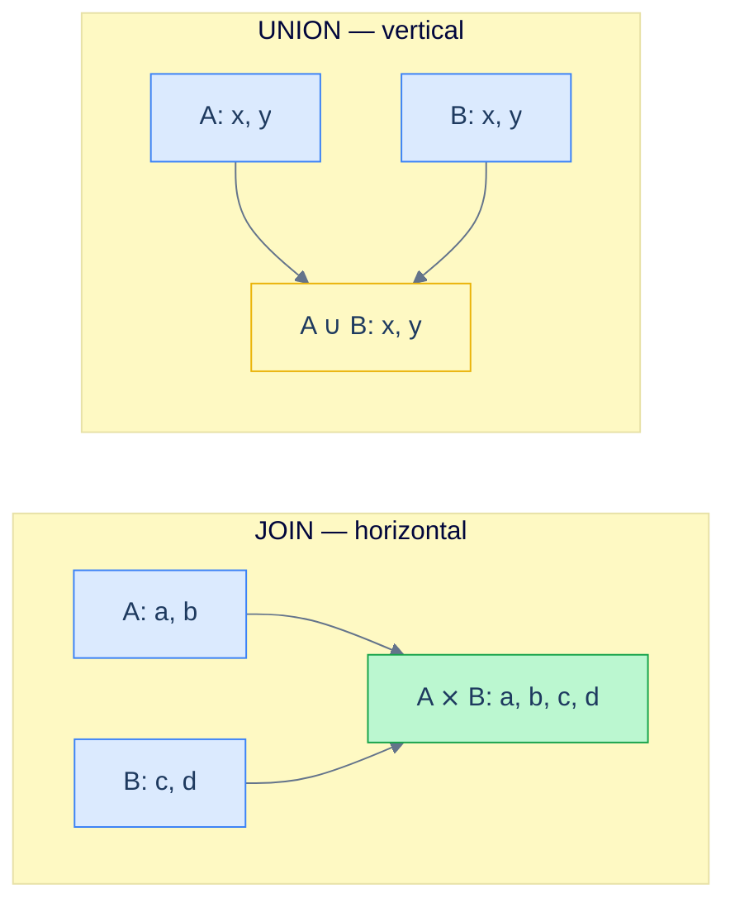

# 1. Set Operators

## The Hook

Two database engineers are arguing in PR review.

Engineer A wrote: "find every email address we know about — the customers' emails *plus* the staff emails." They wrote it as a `UNION`.

Engineer B says it should have been a `JOIN`. "Why are you doing a `UNION` over two queries when a single `SELECT FROM customers JOIN staff` would do?"

Both engineers are wrong, but in different ways. The right answer depends on what they actually want: a single column of email strings *combined* across two tables (set operator), or one row per (customer, staff) match (join). They're solving *different shapes of question* — and the failure to name which question they're solving is the bug.

This chapter is about the four **set operators** — `UNION`, `UNION ALL`, `INTERSECT`, `EXCEPT` — that combine *result-sets* row-by-row, not column-by-column. They're the right tool when you have two queries that produce comparable rows and you want their union, intersection, or difference. They're the *wrong* tool when the question is "give me one row per match between two tables" — that's a join.

By the end you'll know which operator to reach for in each situation, why `UNION ALL` is almost always faster than `UNION`, and why mismatched column counts produce one of the worst error messages in SQL.

---

## Table of contents

1. [Set operators vs joins](#set-operators-vs-joins)
2. [`UNION` and `UNION ALL`](#union-and-union-all)
3. [`INTERSECT`](#intersect)
4. [`EXCEPT` (a.k.a. `MINUS`)](#except)
5. [Column compatibility rules](#column-compatibility-rules)
6. [Edge cases and pitfalls](#edge-cases-and-pitfalls)
7. [Production reality](#production-reality)
8. [Practice ladder](#practice-ladder)
9. [Cross-links](#cross-links)
10. [Final takeaway](#final-takeaway)

***

# Set operators vs joins

A **join** combines rows *horizontally* — pulls columns from two tables side by side, keyed by a relationship.

A **set operator** combines rows *vertically* — stacks the rows of one query on top of another. The result has the same number of columns as either input; the column count must match.



<p align="center"><strong>JOIN extends rows sideways with more columns. UNION stacks rows together; the column shape stays the same on both sides.</strong></p>

Use a join when the two tables have a relationship (foreign key) and you want them combined in one row. Use a set operator when you have two *similar* result-sets — same column shape — and you want them stacked, deduplicated, intersected, or differenced.

---

# UNION and UNION ALL

`UNION` stacks two result-sets on top of each other and **removes duplicates**.

```sql run
CREATE TABLE customers (id INT, first_name TEXT, country TEXT);
CREATE TABLE staff     (id INT, first_name TEXT, country TEXT);
INSERT INTO customers VALUES (1,'Maria','Germany'),(2,'John','USA'),(3,'Georg','UK');
INSERT INTO staff     VALUES (101,'Alice','UK'),(102,'John','USA'),(103,'Maria','Germany');

-- Combined list of names+country across customers and staff. Duplicates collapsed.
SELECT first_name, country FROM customers
UNION
SELECT first_name, country FROM staff
ORDER BY country, first_name;
```

The result has 4 distinct rows: Maria-Germany, Alice-UK, Georg-UK, John-USA. The duplicates (Maria-Germany and John-USA appearing in both) are collapsed by `UNION`.

`UNION ALL` does the same stacking **without** the deduplication step:

```sql run
CREATE TABLE customers (id INT, first_name TEXT, country TEXT);
CREATE TABLE staff     (id INT, first_name TEXT, country TEXT);
INSERT INTO customers VALUES (1,'Maria','Germany'),(2,'John','USA'),(3,'Georg','UK');
INSERT INTO staff     VALUES (101,'Alice','UK'),(102,'John','USA'),(103,'Maria','Germany');

-- Same shape; duplicates kept.
SELECT first_name, country FROM customers
UNION ALL
SELECT first_name, country FROM staff
ORDER BY country, first_name;
```

The result has 6 rows — every row from each side, no deduplication. If `customers` and `staff` happen to share rows by accident, those appear twice.

## When to use which

**`UNION ALL` is faster.** Deduplication requires sorting or hashing every row of the combined result. `UNION ALL` skips that step and just streams rows. On large result-sets the cost difference can be 10× or more.

**`UNION ALL` is also more honest** when you know there are no duplicates by construction — the deduplication isn't doing useful work, it just costs time.

**Use `UNION` only when**:
1. The inputs *might* overlap, *and*
2. You actually want one row per distinct value rather than one row per source.

A quick rule of thumb: when in doubt, write `UNION ALL`. If a downstream consumer breaks because of duplicates, switch to `UNION`. **Don't reach for `UNION` reflexively** — it's the SQL equivalent of `Set` everywhere when a `List` would do.

## Set operators run in step 7-ish of the logical order

Set operators apply *after* both subqueries have produced their result-sets. The `ORDER BY` at the end applies to the combined result, not to either subquery. The clauses in each subquery (`WHERE`, `GROUP BY`, `HAVING`, `SELECT`) run independently for each side.

```sql
-- ❌ This ORDER BY applies to the WHOLE combined result, not just to customers.
SELECT first_name FROM customers
ORDER BY first_name      -- Syntax error in standard SQL: ORDER BY must come last.
UNION ALL
SELECT first_name FROM staff;

-- ✅ ORDER BY at the end. Applies to the combined union.
SELECT first_name FROM customers
UNION ALL
SELECT first_name FROM staff
ORDER BY first_name;
```

To order each side individually before combining, wrap each in a subquery.

---

# INTERSECT

`INTERSECT` keeps rows that appear in **both** result-sets. It's a set operation, so duplicates are removed.

```sql run
CREATE TABLE customers (id INT, first_name TEXT, country TEXT);
CREATE TABLE staff     (id INT, first_name TEXT, country TEXT);
INSERT INTO customers VALUES (1,'Maria','Germany'),(2,'John','USA'),(3,'Georg','UK');
INSERT INTO staff     VALUES (101,'Alice','UK'),(102,'John','USA'),(103,'Maria','Germany');

-- People who are both customers AND staff.
SELECT first_name, country FROM customers
INTERSECT
SELECT first_name, country FROM staff
ORDER BY first_name;
```

The result has 2 rows: Maria-Germany and John-USA. Alice (staff but not a customer) and Georg (customer but not staff) drop out.

> **Dialect note:** SQLite, PostgreSQL, and SQL Server all support `INTERSECT`. MySQL added it in 8.0.31 (October 2022); older MySQL doesn't. The portable workaround is `INNER JOIN`:
> ```sql
> SELECT DISTINCT c.first_name, c.country FROM customers c
> INNER JOIN staff s ON s.first_name = c.first_name AND s.country = c.country;
> ```

## INTERSECT vs INNER JOIN

These two return the same rows for the example above:

```sql
-- (a) INTERSECT
SELECT first_name, country FROM customers
INTERSECT
SELECT first_name, country FROM staff;

-- (b) INNER JOIN with all-columns equality
SELECT DISTINCT c.first_name, c.country FROM customers c
INNER JOIN staff s ON s.first_name = c.first_name AND s.country = c.country;
```

`INTERSECT` is shorter when the two queries match on every column. `INNER JOIN` is more flexible — it can match on a subset of columns and project a different set. Use whichever reads better for the question you're asking.

---

# EXCEPT

`EXCEPT` keeps rows from the **first** result-set that **don't appear** in the second. Set operation, so duplicates are removed.

```sql run
CREATE TABLE customers (id INT, first_name TEXT, country TEXT);
CREATE TABLE staff     (id INT, first_name TEXT, country TEXT);
INSERT INTO customers VALUES (1,'Maria','Germany'),(2,'John','USA'),(3,'Georg','UK');
INSERT INTO staff     VALUES (101,'Alice','UK'),(102,'John','USA'),(103,'Maria','Germany');

-- Customers who are NOT also staff.
SELECT first_name, country FROM customers
EXCEPT
SELECT first_name, country FROM staff
ORDER BY first_name;
```

The result has 1 row: Georg-UK. Maria and John drop out because they appear in `staff` too.

The reverse direction is also useful:

```sql run
CREATE TABLE customers (id INT, first_name TEXT, country TEXT);
CREATE TABLE staff     (id INT, first_name TEXT, country TEXT);
INSERT INTO customers VALUES (1,'Maria','Germany'),(2,'John','USA'),(3,'Georg','UK');
INSERT INTO staff     VALUES (101,'Alice','UK'),(102,'John','USA'),(103,'Maria','Germany');

-- Staff who are NOT also customers.
SELECT first_name, country FROM staff
EXCEPT
SELECT first_name, country FROM customers
ORDER BY first_name;
```

One row: Alice-UK.

> **Dialect note:** Oracle calls it `MINUS` instead of `EXCEPT`. Postgres/SQLite/SQL Server use `EXCEPT`. MySQL added it in 8.0.31 alongside `INTERSECT`.

## EXCEPT for reconciliation

`EXCEPT` shines in reconciliation queries — "what's in source A but not in target B?". The classic shape:

```sql
-- Records that exist in production but not in the analytics warehouse.
-- Useful as a daily monitoring query.
SELECT id, updated_at FROM prod.events
EXCEPT
SELECT id, updated_at FROM warehouse.events;
```

If this returns rows, your ETL is missing data; an alert fires. The same shape catches deleted rows that should have been propagated, type mismatches that produce different `updated_at` values, etc.

---

# Column compatibility rules

Set operators have one strict rule: **the column count and types of both sides must match**. Specifically:

1. **Same number of columns.** `SELECT a, b UNION SELECT a, b, c` errors out.
2. **Compatible types per column position.** Position 1 in side A must have a type that's compatible with position 1 in side B. (Most engines coerce — `INT` and `BIGINT` work together — but `TEXT` and `INT` may not.)
3. **Column names come from the *first* query.** `SELECT a AS foo UNION SELECT b AS bar` produces a result with column name `foo`. The second query's alias is ignored.

```sql run
CREATE TABLE customers (id INT, first_name TEXT, country TEXT);
INSERT INTO customers VALUES (1,'Maria','Germany'),(2,'John','USA');

-- ⚠ One side has 2 columns, the other has 3 — error.
SELECT first_name, country FROM customers
UNION ALL
SELECT id, first_name, country FROM customers;
```

The error is dialect-specific but always says "different number of columns" or similar. The fix: match the column counts. If you need a "missing" column on one side, add a literal:

```sql run
CREATE TABLE customers (id INT, first_name TEXT, country TEXT);
INSERT INTO customers VALUES (1,'Maria','Germany'),(2,'John','USA');

-- Match column count by adding a NULL placeholder.
SELECT NULL AS id, first_name, country FROM customers
UNION ALL
SELECT id,        first_name, country FROM customers
ORDER BY first_name;
```

The first query injects a `NULL` in the `id` slot for every customer row. Both sides now have 3 columns and the union works.

## A useful tagging pattern

When combining rows from multiple sources, **inject a literal that identifies the source**. Future-you reading the result will thank you:

```sql run
CREATE TABLE customers (id INT, first_name TEXT, country TEXT);
CREATE TABLE staff     (id INT, first_name TEXT, country TEXT);
INSERT INTO customers VALUES (1,'Maria','Germany'),(2,'John','USA'),(3,'Georg','UK');
INSERT INTO staff     VALUES (101,'Alice','UK'),(102,'John','USA');

-- Combined directory with the source baked into each row.
SELECT 'customer' AS role, first_name, country FROM customers
UNION ALL
SELECT 'staff'    AS role, first_name, country FROM staff
ORDER BY role, first_name;
```

Now the consumer can tell which row came from which side without doing another query. This is one of the most common production uses of `UNION ALL` — combining heterogeneous-looking-but-structurally-similar tables into one stream.

---

# Edge cases and pitfalls

## Order of evaluation across multiple set operators

`A UNION B UNION C` is evaluated left-to-right: `(A UNION B) UNION C`. With a mix of operators, precedence applies:

| Operator | Precedence |
|---|---|
| `INTERSECT` | higher |
| `UNION`, `EXCEPT` | lower |

So `A UNION B INTERSECT C` becomes `A UNION (B INTERSECT C)`, which may not be what you wanted. **Use parentheses when mixing**:

```sql
(A UNION B) INTERSECT C   -- explicit
A UNION (B INTERSECT C)   -- explicit
```

## `UNION` is sorting in disguise

To remove duplicates, `UNION` must compare every row against every other row — typically by sorting. So `UNION` is `O(n log n)` even when both inputs are small. `UNION ALL` is `O(n)` (just streams rows). On large queries the difference is often the difference between "fast" and "the planner picked a hash-aggregate that ran out of work_mem and spilled to disk."

## NULL and set equality

For set operators, `NULL = NULL` is treated as equal — a row with NULLs in `customers` *will* deduplicate against a row with the same NULLs in `staff` under `UNION` and `INTERSECT`. This is *different* from the regular `WHERE x = NULL` behaviour. Set operators use `IS NOT DISTINCT FROM` semantics under the hood.

## ORDER BY before UNION

Putting `ORDER BY` between subqueries (instead of at the end) is illegal in standard SQL:

```sql
-- ❌ ORDER BY in the first subquery is rejected.
SELECT first_name FROM customers ORDER BY first_name
UNION ALL
SELECT first_name FROM staff;
```

To order each side, use a subquery:

```sql
-- ✅
SELECT * FROM (SELECT first_name FROM customers ORDER BY first_name) c
UNION ALL
SELECT * FROM (SELECT first_name FROM staff     ORDER BY first_name) s;
```

But note: even with the subqueries, the *combined* result's order is not guaranteed unless you add another `ORDER BY` at the end. UNION may interleave rows.

## `UNION` doesn't preserve row order

The output of `UNION` (and especially `UNION ALL`) appears in *some* order — it's not guaranteed to be "all rows from the first query, then all rows from the second." Different planners interleave differently. If you want a specific order, add `ORDER BY` at the end.

---

# Production reality

A common production pattern: **archive table + live table** as one logical view.

Imagine codefolio's `hello_events` table grows beyond a manageable size and is partitioned into `hello_events_recent` (last 30 days) and `hello_events_archive` (older). A query that needs "all events" stitches them with `UNION ALL`:

```sql
SELECT id, timestamp_ms, visits FROM hello_events_recent
UNION ALL
SELECT id, timestamp_ms, visits FROM hello_events_archive;
```

`UNION ALL` (not `UNION`) because there are no duplicates by construction — each event lives in exactly one table. The planner can run both legs in parallel, sometimes pruning entire archive partitions when a `WHERE timestamp_ms > …` filter excludes them.

Another production shape — the **reconciliation query**:

```sql
-- Find IDs in the source that aren't in the target.
SELECT id FROM source_events
EXCEPT
SELECT id FROM target_events;
```

If this returns any rows, the ETL is broken. Wrap it in a scheduled query that emits to alerting; the day it returns rows is the day you find your data pipeline drifting before users notice.

A third production shape — the **"every email address" tagged-source pattern**:

```sql
SELECT 'customer' AS source, email FROM customers WHERE email IS NOT NULL
UNION ALL
SELECT 'lead',    email FROM leads     WHERE email IS NOT NULL
UNION ALL
SELECT 'staff',   email FROM staff     WHERE email IS NOT NULL
ORDER BY email;
```

This is the right *shape* of the chapter's hook — combining email-shaped data across three otherwise-unrelated tables. Each row knows where it came from. A `JOIN` would be wrong here because the tables don't have a foreign-key relationship; the rows are simply *similar*, not *related*.

---

# Practice ladder

Use the [sample schema](/cortex/languages/sql/foundations/introduction-to-sql#the-sample-schema), or the small `customers`/`staff` schema from this chapter's runnable blocks.

1. **Combine `customers.first_name` and `staff.first_name` into one list. Should duplicates be kept?** *Hint: which operator do you reach for if duplicates are okay? If not?*
2. **Find the names of people who are both customers and staff.** *Hint: `INTERSECT` — or the equivalent `INNER JOIN`.*
3. **Find customers who are *not* also staff.** *Hint: `EXCEPT`.*
4. **Tag each row in a combined list with its source ('customer' or 'staff') so the result tells you where each name came from.** *Hint: a literal in the `SELECT` list — `SELECT 'customer' AS role, …`.*
5. **Why is `UNION ALL` typically faster than `UNION`?** *Hint: what extra work does `UNION` do?*
6. **Predict the output of:**
   ```sql
   SELECT first_name FROM customers
   UNION ALL
   SELECT first_name FROM customers;
   ```
   *Hint: are duplicates removed?*
7. **Build a reconciliation query: "events in `hello_events` whose `id` is missing from a hypothetical `events_audit` table."** *Hint: `EXCEPT`. Or anti-join with `LEFT JOIN ... IS NULL` (next chapter).*

***

# Cross-links

- **Previous in this module:** [Joins](/cortex/languages/sql/multiple-tables/joins) — combining columns horizontally; the cousin to set operators' vertical combine.
- **Next in this module:** [Subqueries](/cortex/languages/sql/multiple-tables/subqueries) — query-inside-a-query patterns that overlap with both joins and set operators.
- **Forward reference:** [Anti-joins and Existence](/cortex/languages/sql/multiple-tables/anti-joins-and-existence) — the `EXCEPT`-vs-`NOT EXISTS`-vs-`NOT IN`-vs-`LEFT JOIN ... IS NULL` family of "rows not in another set" patterns.
- **Forward reference:** [Indexes and Performance](/cortex/languages/sql/index) — when `UNION ALL` enables parallel-scanning of partitioned tables, and when `UNION`'s deduplication blocks streaming.

***

# Final Takeaway

Set operators combine result-sets, not tables. Three patterns to internalise:

1. **Default to `UNION ALL`. Reach for `UNION` only when you genuinely need deduplication.** `UNION ALL` streams rows; `UNION` sorts the entire combined result. The default should be the cheaper one.
2. **`INTERSECT` and `EXCEPT` are reconciliation tools.** "Rows in both sources" → `INTERSECT`. "Rows in this source but not that one" → `EXCEPT`. Useful for ETL audits, drift detection, and "what's missing?" queries.
3. **The column count and types must match on both sides.** When they don't, inject literals or `NULL`s to force the shapes to align — and consider tagging each row with its source so the consumer knows where it came from.

Master these three and set operators become a clean, predictable second tool — joins for related tables, set operators for similar-shaped result-sets.

## Your Turn

Before you move on, check your understanding with the coach — explain the idea, apply it, weigh the trade-offs, then defend your reasoning.

<div class="concept-coach"></div>
