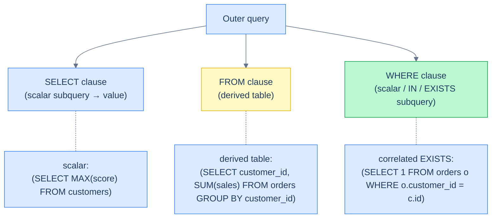

# 1. Subqueries

## The Hook

A junior engineer is asked: "Find the customer with the highest score." They write:

```sql
SELECT first_name FROM customers WHERE score = MAX(score);
```

It errors out — `MAX(score)` is an aggregate, and `WHERE` runs *before* aggregates compute (see the [logical execution order](/cortex/languages/sql/foundations/introduction-to-sql#the-logical-execution-order)). They try `HAVING`, which doesn't help because there's no `GROUP BY`. They try `ORDER BY score DESC LIMIT 1`, which works for one row but produces the wrong answer if there's a tie.

The right answer involves a **subquery** — a query whose *result* is used as a value or a table inside another query:

```sql
SELECT first_name FROM customers
WHERE score = (SELECT MAX(score) FROM customers);
```

`(SELECT MAX(score) FROM customers)` runs first, returns a single value (`900`), and then becomes a literal in the outer `WHERE`. Two queries glued together. Returns every customer whose score equals the maximum — handles ties naturally.

This chapter is about the four flavours of subquery: **scalar** (returns one value), **derived table** (used in `FROM`), **`IN`/`EXISTS`** (membership / existence), and **correlated** (the inner query references the outer row). Each has its niche. The shared lesson: a subquery is a *deferred* computation — the outer query treats it like a value, a table, or a predicate, and the optimiser figures out how to interleave them.

By the end you'll know which flavour to reach for, why `EXISTS` is almost always preferable to `IN` for membership checks against a subquery, and how to read a correlated subquery without losing track of which row each scope refers to.

---

## Table of contents

1. [Four flavours of subquery](#four-flavours-of-subquery)
2. [Scalar subqueries](#scalar-subqueries)
3. [Subqueries in `FROM` (derived tables)](#derived-tables)
4. [`IN` and `NOT IN` against a subquery](#in-and-not-in)
5. [`EXISTS` and `NOT EXISTS`](#exists-and-not-exists)
6. [`ANY` and `ALL`](#any-and-all)
7. [Correlated subqueries](#correlated-subqueries)
8. [When to choose which](#when-to-choose-which)
9. [Edge cases and pitfalls](#edge-cases-and-pitfalls)
10. [Production reality](#production-reality)
11. [Practice ladder](#practice-ladder)
12. [Cross-links](#cross-links)
13. [Final takeaway](#final-takeaway)

***

# Four flavours of subquery

A **subquery** is a `SELECT` nested inside another statement. Where it appears determines what shape it must produce:

| Position | Subquery shape | Example |
|---|---|---|
| In `WHERE`, compared to a value | scalar — one row, one column | `WHERE score = (SELECT MAX(score) FROM …)` |
| In `WHERE`, with `IN`/`EXISTS` | a column or row stream | `WHERE id IN (SELECT customer_id FROM orders)` |
| In `FROM` | a result-set with multiple columns/rows | `FROM (SELECT … FROM orders) o` |
| In `SELECT` | scalar — one row, one column | `SELECT (SELECT MAX(...) FROM …) AS max_score` |



<p align="center"><strong>Subqueries appear in different positions of the outer query, with different shape requirements. Scalar (one row, one column) for SELECT and value-comparison WHERE; result-set for FROM; row-stream for IN/EXISTS.</strong></p>

The fourth row above — subquery as an expression in `SELECT` — is essentially the same as a scalar subquery, just used in a different position.

A subquery can also be **correlated** — the inner query references columns from the outer query's *current row*. That's a separate dimension from "where in the outer query the subquery appears." Most subqueries are *uncorrelated*; correlated subqueries are powerful but trickier to read.

---

# Scalar subqueries

A **scalar subquery** returns exactly one row with exactly one column — i.e., a single value. You can use it anywhere a value is allowed.

```sql run
CREATE TABLE customers (id INT, first_name TEXT, country TEXT, score INT);
INSERT INTO customers VALUES (1,'Maria','Germany',350),(2,'John','USA',900),(3,'Georg','UK',750),(4,'Martin','Germany',500),(5,'Peter','USA',0);

-- The customer(s) with the highest score.
SELECT first_name, score
FROM customers
WHERE score = (SELECT MAX(score) FROM customers);
```

The inner query produces `900`. The outer query becomes effectively `WHERE score = 900`. Returns John. If two customers tied at 900, both would appear.

Scalar subqueries can also appear in `SELECT`:

```sql run
CREATE TABLE customers (id INT, first_name TEXT, country TEXT, score INT);
INSERT INTO customers VALUES (1,'Maria','Germany',350),(2,'John','USA',900),(3,'Georg','UK',750),(4,'Martin','Germany',500),(5,'Peter','USA',0);

-- Each customer with their score and the gap from the maximum.
SELECT first_name, score,
       (SELECT MAX(score) FROM customers) - score AS gap_from_max
FROM customers
ORDER BY gap_from_max;
```

The subquery runs once (the engine recognises it doesn't depend on the outer row) and the result is reused for every output row.

## The trap: subquery returns more than one row

If a scalar subquery accidentally returns multiple rows, most engines error:

```sql
-- ⚠ ERROR if the subquery returns more than one row.
SELECT first_name FROM customers WHERE score = (SELECT score FROM customers WHERE country = 'USA');
```

That subquery returns two rows (John 900, Peter 0). The outer `=` doesn't know which to compare against; the engine raises "more than one row returned by a subquery used as an expression" or similar. The fix: change `=` to `IN`, or constrain the subquery with `LIMIT 1` or aggregation.

---

# Derived tables

A subquery in `FROM` produces a **derived table** — a result-set that the outer query treats like a regular table. Useful when you need to compute something *first*, then operate on the result.

```sql run
CREATE TABLE customers (id INT, first_name TEXT, country TEXT, score INT);
CREATE TABLE orders (order_id INT, customer_id INT, order_date DATE, sales INT);
INSERT INTO customers VALUES (1,'Maria','Germany',350),(2,'John','USA',900),(3,'Georg','UK',750),(4,'Martin','Germany',500),(5,'Peter','USA',0);
INSERT INTO orders VALUES (1001,1,'2026-04-03',120),(1002,1,'2026-04-15',80),(1003,2,'2026-04-22',450),(1004,3,'2026-04-28',200),(1005,4,'2026-05-01',300);

-- For each customer, their total sales — but only show customers whose total exceeds 100.
SELECT c.first_name, totals.total_sales
FROM customers c
JOIN (SELECT customer_id, SUM(sales) AS total_sales
      FROM orders
      GROUP BY customer_id) totals
  ON totals.customer_id = c.id
WHERE totals.total_sales > 100
ORDER BY totals.total_sales DESC;
```

The inner query computes per-customer totals. The outer query joins customers to those totals and filters. **Derived tables are *required* to have an alias** in standard SQL (`totals` here); Postgres enforces this strictly.

For multi-step queries with many derived tables, [Common Table Expressions](/cortex/languages/sql/index) (`WITH` clauses) read better. Both have the same semantic — a CTE is just a derived table named at the top of the query rather than inline.

---

# IN and NOT IN

`IN` against a subquery is "is the value in the result-set?":

```sql run
CREATE TABLE customers (id INT, first_name TEXT, country TEXT, score INT);
CREATE TABLE orders (order_id INT, customer_id INT, order_date DATE, sales INT);
INSERT INTO customers VALUES (1,'Maria','Germany',350),(2,'John','USA',900),(3,'Georg','UK',750),(4,'Martin','Germany',500),(5,'Peter','USA',0);
INSERT INTO orders VALUES (1001,1,'2026-04-03',120),(1002,1,'2026-04-15',80),(1003,2,'2026-04-22',450),(1004,3,'2026-04-28',200),(1005,4,'2026-05-01',300);

-- Customers who have placed at least one order.
SELECT first_name
FROM customers
WHERE id IN (SELECT customer_id FROM orders);
```

The subquery produces a column of customer IDs; the outer `WHERE` keeps customers whose `id` appears in that column. Returns Maria, John, Georg, Martin (Peter has no orders).

## NOT IN is treacherous with NULL

`NOT IN` against a subquery has the same NULL trap as `NOT IN (literal list)` — covered in [Filtering](/cortex/languages/sql/foundations/filtering#set-membership). If the subquery returns *any* `NULL`, `NOT IN` returns zero rows, silently:

```sql
-- ⚠ If any orders.customer_id is NULL, this returns NO customers.
SELECT first_name
FROM customers
WHERE id NOT IN (SELECT customer_id FROM orders);
```

Reason: `id NOT IN (a, b, NULL)` desugars to `id <> a AND id <> b AND id <> NULL`. The last term is `UNKNOWN`, and `anything AND UNKNOWN` is at best `UNKNOWN` — which `WHERE` drops.

**The robust replacement is `NOT EXISTS`:**

```sql
SELECT first_name
FROM customers c
WHERE NOT EXISTS (SELECT 1 FROM orders o WHERE o.customer_id = c.id);
```

This handles `NULL` correctly and tends to optimise as well or better. The full treatment is in [Anti-joins and Existence](/cortex/languages/sql/multiple-tables/anti-joins-and-existence). For now: **prefer `NOT EXISTS` over `NOT IN` whenever a subquery is involved**.

---

# EXISTS and NOT EXISTS

`EXISTS` returns true if the subquery produces *at least one row*. The subquery's projection is irrelevant — only its presence/absence of rows matters.

```sql run
CREATE TABLE customers (id INT, first_name TEXT, country TEXT, score INT);
CREATE TABLE orders (order_id INT, customer_id INT, order_date DATE, sales INT);
INSERT INTO customers VALUES (1,'Maria','Germany',350),(2,'John','USA',900),(3,'Georg','UK',750),(4,'Martin','Germany',500),(5,'Peter','USA',0);
INSERT INTO orders VALUES (1001,1,'2026-04-03',120),(1002,1,'2026-04-15',80),(1003,2,'2026-04-22',450),(1004,3,'2026-04-28',200),(1005,4,'2026-05-01',300);

-- Customers who have placed at least one order — same as the IN version above,
-- but null-safe and often faster.
SELECT first_name
FROM customers c
WHERE EXISTS (SELECT 1 FROM orders o WHERE o.customer_id = c.id);
```

The subquery is `SELECT 1 FROM orders o WHERE o.customer_id = c.id` — for *each* customer row, ask "does any orders row match this customer's id?". The `1` is a placeholder; you could write `SELECT * FROM orders o …` and get the same result, but `SELECT 1` makes the intent obvious.

Note `EXISTS` is **correlated** — the subquery references `c.id` from the outer query. This is the canonical correlated-subquery pattern.

## NOT EXISTS

The mirror — true if the subquery produces *zero* rows. Customers who have *not* placed any orders:

```sql run
CREATE TABLE customers (id INT, first_name TEXT, country TEXT, score INT);
CREATE TABLE orders (order_id INT, customer_id INT, order_date DATE, sales INT);
INSERT INTO customers VALUES (1,'Maria','Germany',350),(2,'John','USA',900),(3,'Georg','UK',750),(4,'Martin','Germany',500),(5,'Peter','USA',0);
INSERT INTO orders VALUES (1001,1,'2026-04-03',120),(1002,1,'2026-04-15',80),(1003,2,'2026-04-22',450),(1004,3,'2026-04-28',200),(1005,4,'2026-05-01',300);

-- Customers who have NOT placed any orders.
SELECT first_name
FROM customers c
WHERE NOT EXISTS (SELECT 1 FROM orders o WHERE o.customer_id = c.id);
```

Returns just Peter. Notice the absence of any NULL trap — `NOT EXISTS` handles NULLs correctly because it operates on row presence, not on value comparison.

---

# ANY and ALL

`ANY` and `ALL` compare a value against *every* row of a subquery. Less common than `IN`/`EXISTS` but useful when you need a comparison other than equality.

```sql run
CREATE TABLE customers (id INT, first_name TEXT, country TEXT, score INT);
INSERT INTO customers VALUES (1,'Maria','Germany',350),(2,'John','USA',900),(3,'Georg','UK',750),(4,'Martin','Germany',500),(5,'Peter','USA',0);

-- Customers whose score is greater than ANY USA customer's score
-- (i.e., greater than the LOWEST USA score). Equivalent to: > MIN(usa.score).
SELECT first_name, score
FROM customers
WHERE score > ANY (SELECT score FROM customers WHERE country = 'USA')
  AND country <> 'USA';
```

`> ANY (subquery)` is true if the value is greater than *at least one* row in the subquery. USA has scores {0, 900}; "greater than any of those" is "greater than 0" — so Maria (350), Georg (750), Martin (500) all qualify. (Peter wouldn't, but we filtered USA out.)

`> ALL (subquery)` is true if the value is greater than *every* row in the subquery — equivalent to `> MAX(subquery)`:

```sql run
CREATE TABLE customers (id INT, first_name TEXT, country TEXT, score INT);
INSERT INTO customers VALUES (1,'Maria','Germany',350),(2,'John','USA',900),(3,'Georg','UK',750),(4,'Martin','Germany',500),(5,'Peter','USA',0);

-- Customers whose score is greater than EVERY non-USA customer's score.
SELECT first_name, score
FROM customers
WHERE score > ALL (SELECT score FROM customers WHERE country <> 'USA')
  AND country = 'USA';
```

Non-USA scores are {350, 750, 500}; max is 750. USA customers above 750: just John (900).

In practice you'll see `> MAX(...)` and `> MIN(...)` in production code more often than `> ALL` and `> ANY` — they're equivalent and read more obviously. `IN` is also a sugar for `= ANY`. Knowing `ANY`/`ALL` exist is more useful than using them.

---

# Correlated subqueries

A **correlated subquery** references columns from the outer query's *current row*. The inner query effectively runs once per outer row (logically — the optimiser has tricks).

```sql run
CREATE TABLE customers (id INT, first_name TEXT, country TEXT, score INT);
CREATE TABLE orders (order_id INT, customer_id INT, order_date DATE, sales INT);
INSERT INTO customers VALUES (1,'Maria','Germany',350),(2,'John','USA',900),(3,'Georg','UK',750),(4,'Martin','Germany',500),(5,'Peter','USA',0);
INSERT INTO orders VALUES (1001,1,'2026-04-03',120),(1002,1,'2026-04-15',80),(1003,2,'2026-04-22',450),(1004,3,'2026-04-28',200),(1005,4,'2026-05-01',300);

-- For each customer, their total sales (or 0 if no orders).
SELECT c.first_name,
       (SELECT COALESCE(SUM(o.sales), 0)
        FROM orders o
        WHERE o.customer_id = c.id) AS total_sales
FROM customers c
ORDER BY total_sales DESC;
```

The inner subquery references `c.id` — that's the correlation. For each customer row in the outer query, the inner query computes the sum of that customer's sales.

The same query as a `LEFT JOIN + GROUP BY`:

```sql
SELECT c.first_name, COALESCE(SUM(o.sales), 0) AS total_sales
FROM customers c
LEFT JOIN orders o ON o.customer_id = c.id
GROUP BY c.id, c.first_name
ORDER BY total_sales DESC;
```

Both work. The correlated-subquery form reads more naturally for "give me a per-row computed column"; the join+group-by form is often more efficient because the engine processes the data once instead of once per row. Look at `EXPLAIN` to see which the planner prefers; modern planners often *rewrite* a correlated subquery into a join internally.

## Reading correlated subqueries

The trick to reading them: **identify which alias each column belongs to**. In the example above:

- `c` is the outer query's customer.
- `o` is the inner query's orders, looking only at the rows where `o.customer_id = c.id`.

For each of the 5 outer customers, the inner subquery is logically re-evaluated with `c.id` bound to that customer's ID. The semantics is "for each row in the outer query, run this inner query and use the result." Most engines optimise this far better than the literal "run the inner query 5 times" implementation, but the *meaning* is exactly that.

---

# When to choose which

Many questions can be expressed multiple ways. A rough decision tree:

| Question | First reach for |
|---|---|
| "Customer with the highest score" | `ORDER BY score DESC LIMIT 1`, or scalar subquery `WHERE score = (SELECT MAX...)` for ties |
| "Customers who have at least one order" | `EXISTS` |
| "Customers who have *no* orders" | `NOT EXISTS` |
| "Per-customer total sales" | `LEFT JOIN + GROUP BY` (or correlated scalar subquery) |
| "Customers in countries that also have staff" | `INNER JOIN`, or `EXISTS`, or `IN` |
| "Compare a value to a max/min of another table" | scalar subquery — `> (SELECT MAX FROM ...)` |
| "Multi-step computation: aggregate, then compare" | derived table or CTE |
| "Reconciliation: rows in source not in target" | `LEFT JOIN ... IS NULL`, `NOT EXISTS`, or `EXCEPT` |

The fastest is usually the form that lets the planner stream through both tables once. Scalar subqueries (especially correlated ones) are easier to read but can hide N+1-style work — though modern Postgres typically rewrites them into joins.

A simple heuristic: **if you're computing a per-row value from another table, try a join + group-by first; reach for a correlated subquery only when the join shape doesn't express what you mean**.

---

# Edge cases and pitfalls

## Subquery that returns no rows

A scalar subquery that returns no rows produces `NULL`, not an error:

```sql
SELECT (SELECT MAX(score) FROM customers WHERE country = 'XX');
-- Returns: NULL (no rows match country = 'XX', so MAX is over an empty set)
```

Useful, but a trap when chained with other operators: `score = NULL` is `UNKNOWN`, dropped by `WHERE`. If you need a default, use `COALESCE(subquery, fallback)`.

## A correlated subquery in `SELECT` runs once per output row

A correlated subquery in `SELECT` is executed (logically) once per row of the outer query. For 1 million customers and a complex inner query, that can be 1 million inner-query executions. The planner often hoists it into a join, but not always. **Profile with `EXPLAIN ANALYZE` when a correlated subquery sits inside a query over a large table.**

## SELECT * inside EXISTS

```sql
WHERE EXISTS (SELECT * FROM orders o WHERE o.customer_id = c.id)
WHERE EXISTS (SELECT 1 FROM orders o WHERE o.customer_id = c.id)
```

Both work identically. The planner ignores the projection inside `EXISTS` — it only checks for row presence. Convention is `SELECT 1` to make the intent obvious. Some teams use `SELECT *` for consistency with explicit-projection rules; either is fine.

## Subquery in `FROM` requires an alias

```sql
-- ❌ Standard SQL requires an alias for the derived table.
SELECT * FROM (SELECT first_name FROM customers);
```

Most engines reject this. Add an alias:

```sql
SELECT * FROM (SELECT first_name FROM customers) c;
```

The alias is an internal name for the derived table; it doesn't appear in the result.

## NULL in `IN`

```sql
SELECT * FROM customers WHERE id IN (1, 2, NULL);
-- Returns customers 1 and 2. NULL doesn't match anything.
```

`IN (..., NULL)` is harmless on the *positive* side — NULL just doesn't match. The trap is `NOT IN` (covered above), where `NULL` poisons the entire predicate to `UNKNOWN`.

---

# Production reality

Subqueries show up everywhere in real codebases. Three common shapes:

**(1) Lookup against a small, dynamic set:**

```sql
-- Find events for the customers in the current "promotion eligible" cohort.
SELECT * FROM hello_events
WHERE customer_id IN (SELECT id FROM customers WHERE country = 'Germany' AND score > 500);
```

The inner query produces a small ID list; the outer query uses it as a filter. Postgres often rewrites this as a hash semi-join.

**(2) Per-row enrichment:**

```sql
-- For each event, the customer's country at the time. (Simplified — no temporal join.)
SELECT e.id, e.timestamp_ms,
       (SELECT country FROM customers c WHERE c.id = e.customer_id) AS country
FROM hello_events e;
```

A correlated scalar subquery in `SELECT`. Often equivalent to a `LEFT JOIN`; the planner usually picks one or the other.

**(3) "Latest record per group" pattern:**

```sql
-- The most recent event per customer.
SELECT *
FROM hello_events e
WHERE e.timestamp_ms = (SELECT MAX(e2.timestamp_ms)
                        FROM hello_events e2
                        WHERE e2.customer_id = e.customer_id);
```

A correlated scalar subquery. The "modern" replacement uses window functions (`ROW_NUMBER() OVER (PARTITION BY customer_id ORDER BY timestamp_ms DESC)`) — covered in [Window Functions](/cortex/languages/sql/index). The correlated-subquery form predates window functions and you'll see both in real code.

In codefolio's actual stack, the [`/api/recent` query](https://github.com/) uses a simple `ORDER BY timestamp_ms DESC LIMIT 10` — no subquery needed. But the moment we add "recent events per customer" to the dashboard, we'll either reach for a correlated subquery or a window function. The shape of the question — "the latest record *per group*" — is the canonical use-case for both.

---

# Practice ladder

Use the [sample schema](/cortex/languages/sql/foundations/introduction-to-sql#the-sample-schema). Runnable blocks above bundle the seed data inline.

1. **Find the customer with the lowest score.** *Hint: scalar subquery with `MIN`. Or `ORDER BY score ASC LIMIT 1`.*
2. **List all customers whose score is above the average.** *Hint: scalar subquery with `AVG`.*
3. **List customers who have placed at least one order in April 2026.** *Hint: `EXISTS` with a correlated subquery on `orders.order_date`.*
4. **List customers who have placed *no* orders. Why is `NOT EXISTS` safer than `NOT IN`?** *Hint: `NULL`s in the inner result.*
5. **For each customer, project their `first_name`, `country`, and the date of their most recent order (or NULL if none).** *Hint: correlated scalar subquery in `SELECT`. Use `MAX(order_date)`.*
6. **Rewrite (5) as a `LEFT JOIN + GROUP BY`. Which is easier to read?** *Hint: aggregate the `orders` per customer first, then join.*
7. **Predict the result of:**
   ```sql
   SELECT * FROM customers WHERE id NOT IN (SELECT customer_id FROM orders);
   ```
   *Hint: `orders.customer_id` is `NOT NULL` in our schema, so this is safe. But what if it weren't?*

***

# Cross-links

- **Previous in this module:** [Set Operators](/cortex/languages/sql/multiple-tables/set-operators) — vertical combine; subqueries can sit *inside* either side of a set operator.
- **Next in this module:** [Anti-joins and Existence](/cortex/languages/sql/multiple-tables/anti-joins-and-existence) — the family of "rows where no match" patterns: `NOT EXISTS`, `LEFT JOIN ... IS NULL`, `EXCEPT`, and why `NOT IN` is the wrong choice.
- **Forward reference:** [CTEs](/cortex/languages/sql/index) — when subqueries get long, name them at the top of the query with `WITH name AS (subquery)`. Same semantics, much better readability.
- **Forward reference:** [Window Functions](/cortex/languages/sql/index) — the modern replacement for "latest record per group" and other correlated-subquery patterns. Faster, cleaner, more powerful.

***

# Final Takeaway

Subqueries are queries-inside-queries. Three patterns to internalise:

1. **Pick the flavour by shape, not by habit.** Scalar subquery for a single value; derived table for a result-set in `FROM`; `EXISTS`/`NOT EXISTS` for membership; correlated subquery for per-row computation. Each has its niche; none is universally best.
2. **`EXISTS` over `IN`, `NOT EXISTS` over `NOT IN` — especially when the subquery might produce `NULL`.** `EXISTS` operates on row presence and is null-safe; `IN`/`NOT IN` operate on value comparison and are not.
3. **Correlated subqueries are powerful but watch the cost.** Logically run once per outer row; planners usually rewrite into joins, but not always. Profile with `EXPLAIN` for any correlated subquery in a hot path. When you have the option, a `LEFT JOIN + GROUP BY` (or a window function) often runs faster.

Master these three and subqueries become a clean fourth tool — alongside joins, set operators, and (next chapter) anti-joins — for combining result-sets.

## Your Turn

Before you move on, check your understanding with the coach — explain the idea, apply it, weigh the trade-offs, then defend your reasoning.

<div class="concept-coach"></div>
