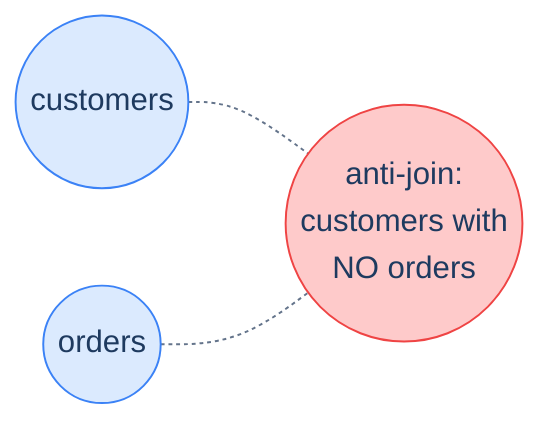
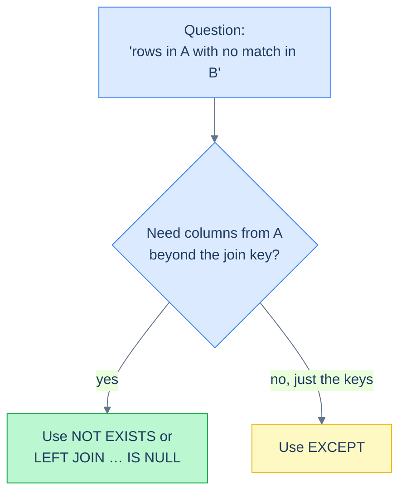

# 1. Anti-joins and Existence

## The Hook

A new feature ships: customers can now opt out of marketing emails. The opt-outs go into a `marketing_opt_outs` table. Marketing's nightly batch needs to send to every customer who *hasn't* opted out. The query, as a senior engineer would write it the first time:

```sql
SELECT email
FROM customers
WHERE id NOT IN (SELECT customer_id FROM marketing_opt_outs);
```

Looks correct. Tests pass. Ships.

The next morning the marketing job emits zero emails. Every customer is "opted out" according to the query. Customer support phones light up: people who explicitly *did* sign up for emails are silent.

The bug: `marketing_opt_outs.customer_id` is nullable, and one row has `customer_id = NULL` — a placeholder for a "site-wide opt-out" feature that's still in development. `NOT IN (..., NULL)` poisons the entire predicate to `UNKNOWN`, which `WHERE` drops for *every* customer. The opt-out table contains a `NULL`, so the marketing query returns no rows. **One row of test data took down the entire send.**

This chapter is about the **anti-join** — "rows in A where no matching row exists in B" — and the four equivalent forms it can take. The bug above is the canonical reason to **never use `NOT IN` against a subquery**. The four forms in order of preference: **`NOT EXISTS`**, **`LEFT JOIN ... IS NULL`**, **`EXCEPT`**, **`NOT IN`** (only against literal-known-non-NULL lists). All four return the same rows in the safe case; only `NOT EXISTS` and `LEFT JOIN ... IS NULL` are correct when NULLs are involved.

By the end you'll know which form to reach for, why three of the four are interchangeable in modern Postgres, and how to write reconciliation queries that survive the day someone adds a `NULL` to a previously-non-null column.

---

## Table of contents

1. [What an anti-join is](#what-an-anti-join-is)
2. [`NOT EXISTS` — the recommended form](#not-exists)
3. [`LEFT JOIN ... IS NULL` — the explicit form](#left-join-is-null)
4. [`EXCEPT` — the set-operator form](#except)
5. [`NOT IN` — the trap](#not-in)
6. [Performance: which is fastest?](#performance)
7. [Edge cases and pitfalls](#edge-cases-and-pitfalls)
8. [Production reality](#production-reality)
9. [Practice ladder](#practice-ladder)
10. [Cross-links](#cross-links)
11. [Final takeaway](#final-takeaway)

***

# What an anti-join is

An **anti-join** returns rows from one table where there is **no match** in another table. The opposite of an `INNER JOIN`, which returns only matched rows.



<p align="center"><strong>Anti-join: customers in the "outside" region — no overlap with orders. The opposite shape from INNER JOIN's intersection.</strong></p>

The shape comes up everywhere:

- "Customers who haven't ordered."
- "Articles with no comments."
- "Files referenced by no record." (orphaned files)
- "Records that exist in source but not in destination." (ETL drift)
- "Users without a verified email."

Same query shape, four expressions in SQL. Let's walk them in order of recommendation.

---

# NOT EXISTS

The recommended form. `NOT EXISTS (correlated subquery)` returns true when the subquery produces zero rows for the current outer row.

```sql run
CREATE TABLE customers (id INT, first_name TEXT, country TEXT, score INT);
CREATE TABLE orders (order_id INT, customer_id INT, order_date DATE, sales INT);
INSERT INTO customers VALUES (1,'Maria','Germany',350),(2,'John','USA',900),(3,'Georg','UK',750),(4,'Martin','Germany',500),(5,'Peter','USA',0);
INSERT INTO orders VALUES (1001,1,'2026-04-03',120),(1002,1,'2026-04-15',80),(1003,2,'2026-04-22',450),(1004,3,'2026-04-28',200),(1005,4,'2026-05-01',300);

-- Customers with no orders.
SELECT first_name
FROM customers c
WHERE NOT EXISTS (
  SELECT 1
  FROM orders o
  WHERE o.customer_id = c.id
);
```

Returns Peter (id 5), the only customer with no orders.

Why this is the recommended form:

1. **Null-safe by construction.** `NOT EXISTS` operates on *row presence*, not value comparison. Whether `o.customer_id` contains NULL is irrelevant — those rows simply fail the join condition `o.customer_id = c.id` (because `NULL = anything` is `UNKNOWN`, never `TRUE`), so they never count as a "match." Customers stay in the outer result.
2. **Reads correctly.** "Where there does not exist any orders row matching this customer" is what the query says, character-for-character.
3. **Optimises well.** Modern Postgres uses a **hash anti-join** or **anti-semi-join** plan — the same physical operator the planner picks for `LEFT JOIN ... IS NULL`. No performance penalty.

The convention: `SELECT 1 FROM ...` inside `EXISTS`/`NOT EXISTS` because the projection is irrelevant. Some teams use `SELECT * FROM ...` for visual consistency; both are equivalent.

---

# LEFT JOIN ... IS NULL

The explicit form. Do a `LEFT JOIN`, then filter for rows where the join didn't match (the right-side columns are `NULL`):

```sql run
CREATE TABLE customers (id INT, first_name TEXT, country TEXT, score INT);
CREATE TABLE orders (order_id INT, customer_id INT, order_date DATE, sales INT);
INSERT INTO customers VALUES (1,'Maria','Germany',350),(2,'John','USA',900),(3,'Georg','UK',750),(4,'Martin','Germany',500),(5,'Peter','USA',0);
INSERT INTO orders VALUES (1001,1,'2026-04-03',120),(1002,1,'2026-04-15',80),(1003,2,'2026-04-22',450),(1004,3,'2026-04-28',200),(1005,4,'2026-05-01',300);

-- Customers with no orders, expressed as LEFT JOIN ... IS NULL.
SELECT c.first_name
FROM customers c
LEFT JOIN orders o ON o.customer_id = c.id
WHERE o.order_id IS NULL;
```

Same result: Peter.

The mechanism: the `LEFT JOIN` keeps every customer, with `NULL` columns where there's no matching order. The `WHERE o.order_id IS NULL` then keeps *only* the unmatched ones.

**Important: the column you check for NULL must be a `NOT NULL` column on the right-side table.** If you check `WHERE o.sales IS NULL` and `orders.sales` itself can be NULL (separate from the no-match case), you'd accidentally include matched rows where `sales` happens to be NULL. The primary key is the safest choice: it's always `NOT NULL`, so `o.order_id IS NULL` reliably means "no match."

This form is **equivalent in result and typically equivalent in performance** to `NOT EXISTS`. Postgres often picks the same anti-join plan for both. The choice is stylistic. Many engineers prefer `NOT EXISTS` because it reads more directly; others prefer `LEFT JOIN ... IS NULL` because it's more explicit about the join shape. Both are fine; pick one and be consistent within a codebase.

---

# EXCEPT

The set-operator form. Project the column you're checking on each side, then subtract:

```sql run
CREATE TABLE customers (id INT, first_name TEXT, country TEXT, score INT);
CREATE TABLE orders (order_id INT, customer_id INT, order_date DATE, sales INT);
INSERT INTO customers VALUES (1,'Maria','Germany',350),(2,'John','USA',900),(3,'Georg','UK',750),(4,'Martin','Germany',500),(5,'Peter','USA',0);
INSERT INTO orders VALUES (1001,1,'2026-04-03',120),(1002,1,'2026-04-15',80),(1003,2,'2026-04-22',450),(1004,3,'2026-04-28',200),(1005,4,'2026-05-01',300);

-- Customer IDs that aren't in the orders.customer_id column.
-- Returns just IDs — to get names you need to join back.
SELECT id FROM customers
EXCEPT
SELECT customer_id FROM orders;
```

Returns `5`. To get the customer's name back:

```sql run
CREATE TABLE customers (id INT, first_name TEXT, country TEXT, score INT);
CREATE TABLE orders (order_id INT, customer_id INT, order_date DATE, sales INT);
INSERT INTO customers VALUES (1,'Maria','Germany',350),(2,'John','USA',900),(3,'Georg','UK',750),(4,'Martin','Germany',500),(5,'Peter','USA',0);
INSERT INTO orders VALUES (1001,1,'2026-04-03',120),(1002,1,'2026-04-15',80),(1003,2,'2026-04-22',450),(1004,3,'2026-04-28',200),(1005,4,'2026-05-01',300);

SELECT first_name
FROM customers
WHERE id IN (
  SELECT id FROM customers
  EXCEPT
  SELECT customer_id FROM orders
);
```

`EXCEPT` is **null-safe** (set operators treat `NULL = NULL` as equal for deduplication purposes), so it doesn't have the `NOT IN` trap. But it's awkward when you need *more* than just the matching column — to surface the customer's name you have to join back, which adds noise.

`EXCEPT` is at its best when the question is naturally a set operation: "IDs that are in source but missing in target," "rows in production but not in the warehouse." For "give me the customer rows" use `NOT EXISTS` or `LEFT JOIN ... IS NULL` instead.

---

# NOT IN

The trap. `NOT IN (subquery)` looks identical in spirit to `NOT EXISTS` but **breaks silently** when the subquery contains any `NULL`:

```sql run
CREATE TABLE customers (id INT, first_name TEXT);
CREATE TABLE marketing_opt_outs (customer_id INT);
INSERT INTO customers VALUES (1,'Maria'),(2,'John'),(3,'Georg'),(4,'Martin'),(5,'Peter');
-- The bug: a NULL row in the opt-outs table.
INSERT INTO marketing_opt_outs VALUES (2),(NULL);

-- ❌ Returns ZERO rows because the opt-outs subquery contains NULL.
-- Expected: Maria, Georg, Martin, Peter (everyone except John).
SELECT first_name FROM customers
WHERE id NOT IN (SELECT customer_id FROM marketing_opt_outs);
```

Run that. Zero rows. The query *looks* correct; it returns silently nothing. This is the chapter's hook bug.

The same data with `NOT EXISTS`:

```sql run
CREATE TABLE customers (id INT, first_name TEXT);
CREATE TABLE marketing_opt_outs (customer_id INT);
INSERT INTO customers VALUES (1,'Maria'),(2,'John'),(3,'Georg'),(4,'Martin'),(5,'Peter');
INSERT INTO marketing_opt_outs VALUES (2),(NULL);

-- ✅ Returns the expected 4 rows. NOT EXISTS handles NULL correctly.
SELECT first_name FROM customers c
WHERE NOT EXISTS (
  SELECT 1 FROM marketing_opt_outs o
  WHERE o.customer_id = c.id
);
```

Returns Maria, Georg, Martin, Peter — everyone except John (who actually opted out). The `NULL` row in `marketing_opt_outs` is ignored: the join `o.customer_id = c.id` simply doesn't match for any customer when `o.customer_id` is `NULL`, because `NULL = c.id` is `UNKNOWN`. Those NULL rows exist in the source, they just don't *match* anything, which is the right semantics for "opt-outs."

## Why `NOT IN` breaks

Recall the desugaring from [Filtering — Set Membership](/cortex/languages/sql/foundations/filtering#set-membership):

```
id NOT IN (a, b, NULL)
≡ id <> a AND id <> b AND id <> NULL
≡ id <> a AND id <> b AND UNKNOWN
≡ at-best UNKNOWN, never TRUE
```

`anything AND UNKNOWN` can be `FALSE` (if any other term is `FALSE`) or `UNKNOWN` (otherwise) — never `TRUE`. So `NOT IN` returns no rows once any `NULL` is in the list.

This is why **the only safe place for `NOT IN` is against a literal list of known-non-NULL values you wrote yourself**:

```sql
-- ✅ Safe: literal list, no NULLs.
WHERE country NOT IN ('Germany', 'USA', 'UK')
```

Against a subquery, *always* prefer `NOT EXISTS`. Even if today's data doesn't contain NULLs, tomorrow's might — that's exactly the failure mode in the chapter's hook.

---

# Performance

For the recommended forms — `NOT EXISTS`, `LEFT JOIN ... IS NULL`, `EXCEPT` — modern PostgreSQL produces nearly identical query plans. The optimiser sees through the syntactic differences and picks one of:

- **Hash anti-join** (typical when the right side fits in memory)
- **Merge anti-join** (when both sides are pre-sorted, e.g., on the join key)
- **Nested-loop anti-semi-join** (small outer × indexed inner)

`EXPLAIN ANALYZE` will tell you which one ran. The takeaway: **prefer the form that reads best for the question**. Performance differences across the three are typically within 5–10% on real data and within noise for small queries.

`NOT IN` against a subquery in older planners forces a different plan — typically a "hashed subplan" that's slower than the anti-join, *plus* the correctness bug under NULL. Modern Postgres has improved its `NOT IN` plans somewhat, but the correctness issue is permanent. Stick with `NOT EXISTS`.



<p align="center"><strong>The decision tree. <code>NOT EXISTS</code> for the typical case (you want the full row from A); <code>EXCEPT</code> when you genuinely just want the set difference of one column.</strong></p>

---

# Edge cases and pitfalls

## Anti-join over multiple key columns

Anti-joins on a single column are simple. On a *composite* key, all four forms still work — but `NOT IN` requires row-value syntax that's less portable:

```sql
-- Customers who haven't placed an order on any of the listed (date, customer) pairs.
-- ✅ NOT EXISTS — natural form.
SELECT * FROM customers c
WHERE NOT EXISTS (
  SELECT 1 FROM blocklist b
  WHERE b.customer_id = c.id AND b.country = c.country
);
```

The `NOT EXISTS` shape extends naturally — just add more conditions to the inner `WHERE`. The `LEFT JOIN ... IS NULL` shape extends similarly. The `EXCEPT` shape requires aligning all the columns on both sides; the `NOT IN` shape requires `WHERE (id, country) NOT IN (SELECT id, country FROM ...)`, which is row-value tuple comparison, not supported in every dialect.

## Negation in nested conditions

You sometimes want "rows where some related condition holds, *and* some other condition doesn't." Don't get this tangled:

```sql
-- Customers who have ordered something AND have not opted out of marketing.
SELECT * FROM customers c
WHERE EXISTS (SELECT 1 FROM orders o WHERE o.customer_id = c.id)
  AND NOT EXISTS (SELECT 1 FROM marketing_opt_outs m WHERE m.customer_id = c.id);
```

Two correlated subqueries, joined by `AND`. Reads cleanly. Don't try to combine into one subquery — that turns into a nested `EXCEPT`-or-something that's much harder to follow.

## Empty subquery

`NOT EXISTS (SELECT 1 FROM empty_table)` is `TRUE` for every outer row — because the subquery produces zero rows for every customer. Sometimes useful, sometimes a "wait, where did all my data come from" surprise. If you build queries dynamically and one branch produces no rows, the whole anti-join opens up.

## Anti-join is not a join in execution

Despite the name, the planner doesn't always materialise an anti-join as a join. For small inner tables, a hash-set probe is the usual implementation; for large indexed tables, a merge anti-join. The shape is "for each outer row, is there *no* match in the inner?" — and the planner picks the cheapest way to answer that question.

---

# Production reality

The chapter's hook is the canonical production shape — a marketing/notification query that filters out opt-outs. Every system that sends emails or pushes notifications has one. Every one of them has a comment on the bug-tracker for the day someone allowed a NULL in the exclusion table. **Use `NOT EXISTS`** and the bug never shows up in your codebase.

A second canonical shape — the **reconciliation query** — runs on a schedule:

```sql
-- Daily ETL audit: rows in production that haven't propagated to the warehouse.
SELECT id, updated_at
FROM prod.events e
WHERE NOT EXISTS (
  SELECT 1 FROM warehouse.events w
  WHERE w.id = e.id AND w.updated_at = e.updated_at
);
```

If this returns rows, ETL drifted. Ops gets a page. The same shape catches deleted rows that should have been propagated, schema mismatches that produce different `updated_at` values, etc. Production data engineering is full of `NOT EXISTS` queries — they're the safety net.

A third — the **orphan query**:

```sql
-- Orders whose customer was deleted (e.g., GDPR right-to-be-forgotten).
SELECT o.order_id
FROM orders o
WHERE NOT EXISTS (
  SELECT 1 FROM customers c WHERE c.id = o.customer_id
);
```

Run this regularly to find foreign-key references that have been orphaned. In a schema with proper `FOREIGN KEY` constraints, this should always return zero rows; in legacy schemas or schemas with `ON DELETE SET NULL`, the query helps you find dangling references. Codefolio's [sample schema](/cortex/languages/sql/foundations/introduction-to-sql#the-sample-schema) is *deliberately* lacking the FK so we can demonstrate this — order 1006 references customer 9 which doesn't exist, so the query above returns `1006`.

---

# Practice ladder

Use the [sample schema](/cortex/languages/sql/foundations/introduction-to-sql#the-sample-schema). Runnable blocks above bundle the seed data inline.

1. **Customers who have not placed any orders.** *Hint: `NOT EXISTS` is the canonical form.*
2. **The same query, but written as `LEFT JOIN ... IS NULL`.** *Hint: which column do you check for NULL? It must be `NOT NULL` in the source table.*
3. **Orders whose customer doesn't exist (orphan FK).** *Hint: same shape, swapped sides — `orders` outer, `customers` inner.*
4. **Why does this query potentially return zero rows even when there are real customers without opt-outs?**
   ```sql
   SELECT first_name FROM customers
   WHERE id NOT IN (SELECT customer_id FROM marketing_opt_outs);
   ```
   *Hint: the famous `NOT IN` + `NULL` interaction. What if `marketing_opt_outs.customer_id` has a `NULL`?*
5. **Rewrite (4) safely with `NOT EXISTS`.** *Hint: correlated subquery; row presence, not value.*
6. **Customers who have ordered something *and* haven't opted out of marketing.** *Hint: two correlated subqueries joined with `AND` — one `EXISTS`, one `NOT EXISTS`.*
7. **Use `EXCEPT` to find customer IDs in `customers` that are missing from `orders.customer_id`. Then explain why this approach is awkward when you need the customer's name.** *Hint: `EXCEPT` returns IDs only; you'd have to join back to `customers` to get names.*

***

# Cross-links

- **Previous in this module:** [Subqueries](/cortex/languages/sql/multiple-tables/subqueries) — `EXISTS` is a subquery; this chapter's `NOT EXISTS` is its mirror.
- **Module complete.** Next module: [Aggregation](/cortex/languages/sql/aggregation/index) — once you can combine rows, summarising them is the natural next step.
- **Forward reference:** [Schema and Constraints](/cortex/languages/sql/index) — `FOREIGN KEY` constraints prevent orphan rows in the first place. The queries in this chapter help you find orphans in schemas where the FK was never added.
- **Forward reference:** [Indexes and Performance](/cortex/languages/sql/index) — what plan the planner picks for an anti-join, and how an index on the join key changes the cost from a sequential scan to a B-tree probe.

***

# Final Takeaway

Anti-joins are "rows where no match." Three patterns to internalise:

1. **`NOT EXISTS` is the default.** Null-safe, reads correctly, optimises to the same plan as the alternatives. Reach for it first.
2. **`NOT IN` against a subquery is a bug waiting to happen.** The day someone adds a `NULL` to the inner column, your query silently returns zero rows. Reserve `NOT IN` for literal lists you wrote yourself.
3. **Reconciliation queries — the workhorse use case for anti-joins — should be on a schedule.** "Rows in source not in target," "orphan FKs," "events without their corresponding customer record." Wire them to alerting; the day they return rows is the day your pipeline drifted, and you want to know before users do.

Master these three and the anti-join shape becomes routine. With this chapter, the [Working with Multiple Tables](/cortex/languages/sql/multiple-tables/index) module is complete — you can now combine rows from any number of tables, in any of the standard shapes.

## Your Turn

Before you move on, check your understanding with the coach — explain the idea, apply it, weigh the trade-offs, then defend your reasoning.

<div class="concept-coach"></div>
