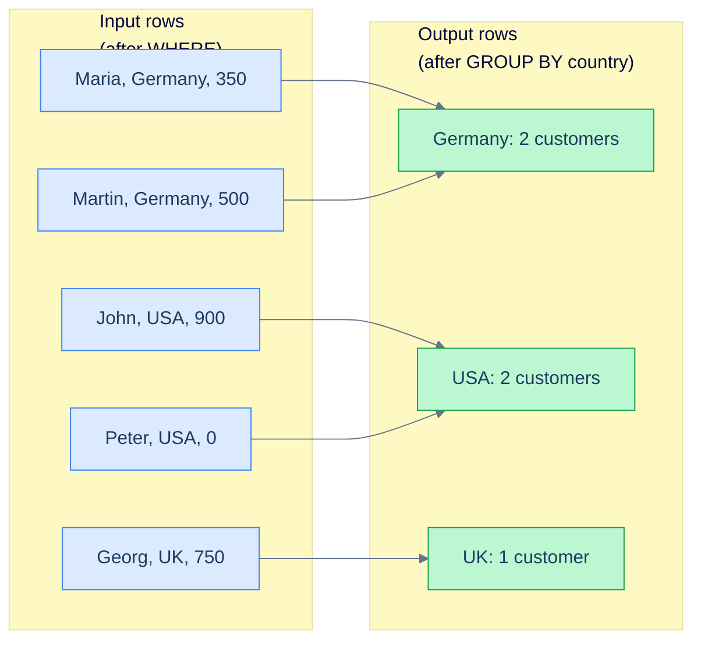

# 1. GROUP BY and HAVING

## The Hook

A senior engineer writes a "customers per country" report:

```sql
SELECT country, first_name, COUNT(*) AS customer_count
FROM customers
GROUP BY country;
```

The query errors out: *column "customers.first_name" must appear in the GROUP BY clause or be used in an aggregate function*.

The engineer sighs. They know what they want — "for each country, give me the count" — but they pasted in `first_name` because the editor autocompleted it, and now they're stuck. They consider adding `first_name` to the `GROUP BY` (which would change the query meaning to "one row per country-and-first-name pair"), or wrapping it in `MAX()` (which would silently pick *some* first name), or removing it entirely.

The correct fix depends on what they actually want. The error is the engine's way of saying "your query is ambiguous: you've collapsed five Maria-Martin-John rows into one Germany row, and now I don't know which `first_name` to put in the result." That ambiguity is the entire point of `GROUP BY` — and the rules around it are the difference between someone who *uses* aggregation and someone who *understands* it.

This chapter is about `GROUP BY` and `HAVING` — how rows collapse into groups, what's legal to project from a grouped result, and the WHERE-vs-HAVING distinction that shows up in every aggregation interview question. By the end you'll never write the autocomplete bug above, you'll understand why `GROUP BY` runs at step 3 and `HAVING` at step 5 of the logical order, and you'll be able to read a multi-table aggregation query in a glance.

---

## Table of contents

1. [What `GROUP BY` does](#what-group-by-does)
2. [The single-value-per-group rule](#the-single-value-per-group-rule)
3. [Multi-column `GROUP BY`](#multi-column-group-by)
4. [`HAVING` — filtering groups](#having)
5. [`WHERE` vs `HAVING`](#where-vs-having)
6. [`GROUP BY` after a join](#group-by-after-a-join)
7. [Edge cases and pitfalls](#edge-cases-and-pitfalls)
8. [Production reality](#production-reality)
9. [Practice ladder](#practice-ladder)
10. [Cross-links](#cross-links)
11. [Final takeaway](#final-takeaway)

***

# What `GROUP BY` does

`GROUP BY` runs at **step 3** of the [logical execution order](/cortex/languages/sql/foundations/introduction-to-sql#the-logical-execution-order). It takes the rows that survived `WHERE` (step 2) and **collapses them into groups** based on the listed columns. Every distinct combination of values in those columns becomes one group; the original rows lose their individual identity.

```sql run
CREATE TABLE customers (id INT, first_name TEXT, country TEXT, score INT);
INSERT INTO customers VALUES (1,'Maria','Germany',350),(2,'John','USA',900),(3,'Georg','UK',750),(4,'Martin','Germany',500),(5,'Peter','USA',0);

-- 5 rows in, 3 rows out — one per country.
SELECT country, COUNT(*) AS customer_count
FROM customers
GROUP BY country
ORDER BY country;
```



<p align="center"><strong>GROUP BY collapses rows that share the grouping-column value into one output row. The original rows aren't gone — they're aggregated into one summary row per group.</strong></p>

After grouping, you can ask *aggregate questions* about each group: how many rows, what's the sum/avg/min/max of some column, etc. Those are computed at step 4, immediately after the grouping.

---

# The single-value-per-group rule

The rule that catches every beginner: **after a `GROUP BY`, every column in `SELECT` must be either (a) one of the grouping columns, or (b) wrapped in an aggregate function.**

Why: the output has one row per group. If the rows in a group disagree on a value, the engine doesn't know which value to pick. So it refuses to compile the query.

```sql run
CREATE TABLE customers (id INT, first_name TEXT, country TEXT, score INT);
INSERT INTO customers VALUES (1,'Maria','Germany',350),(2,'John','USA',900),(3,'Georg','UK',750),(4,'Martin','Germany',500),(5,'Peter','USA',0);

-- ❌ ERROR: first_name disagrees within each country (Maria vs Martin in Germany).
SELECT country, first_name, COUNT(*)
FROM customers
GROUP BY country;
```

The fix depends on intent:

```sql run
CREATE TABLE customers (id INT, first_name TEXT, country TEXT, score INT);
INSERT INTO customers VALUES (1,'Maria','Germany',350),(2,'John','USA',900),(3,'Georg','UK',750),(4,'Martin','Germany',500),(5,'Peter','USA',0);

-- (a) "I want one row per (country, first_name)" — 5 rows out, no aggregation collapse.
SELECT country, first_name, COUNT(*) FROM customers GROUP BY country, first_name;
```

```sql run
CREATE TABLE customers (id INT, first_name TEXT, country TEXT, score INT);
INSERT INTO customers VALUES (1,'Maria','Germany',350),(2,'John','USA',900),(3,'Georg','UK',750),(4,'Martin','Germany',500),(5,'Peter','USA',0);

-- (b) "I want a per-country summary, with all the names concatenated."
SELECT country, GROUP_CONCAT(first_name) AS names, COUNT(*) AS n
FROM customers
GROUP BY country
ORDER BY country;
```

```sql run
CREATE TABLE customers (id INT, first_name TEXT, country TEXT, score INT);
INSERT INTO customers VALUES (1,'Maria','Germany',350),(2,'John','USA',900),(3,'Georg','UK',750),(4,'Martin','Germany',500),(5,'Peter','USA',0);

-- (c) "I want a per-country summary, with the alphabetically-first name as a representative."
SELECT country, MIN(first_name) AS sample_name, COUNT(*) AS n
FROM customers
GROUP BY country
ORDER BY country;
```

> **Dialect note:** `GROUP_CONCAT` is the SQLite/MySQL spelling. Postgres uses `STRING_AGG(col, ', ')`, with an explicit separator. SQL Server uses `STRING_AGG(col, ', ')` since 2017. Standard SQL is `LISTAGG`. We'll meet these in [Aggregate Functions](/cortex/languages/sql/aggregation/aggregate-functions).

## A quirk: MySQL's `ONLY_FULL_GROUP_BY` is off-by-default

MySQL historically allowed projecting *non-grouped, non-aggregated* columns silently — picking *some* value from the group, no error. In recent MySQL (5.7+), `ONLY_FULL_GROUP_BY` is on by default and matches the standard. Older MySQL or older `sql_mode` settings still have the silent-pick behaviour, which surprises people coming from Postgres.

**The standard rule is the right rule.** Don't disable `ONLY_FULL_GROUP_BY` to make a query "work"; the query is asking an ambiguous question, and silencing the engine doesn't fix the ambiguity.

## Functional dependencies (Postgres extension)

Postgres relaxes the rule when a column is *functionally dependent* on the grouping key. If you group by the primary key, every column in that table is functionally determined by the PK and can be projected without an aggregate:

```sql
-- ✅ Legal in Postgres: id is the PK, so first_name and country are determined by id.
SELECT c.id, c.first_name, c.country, COUNT(o.order_id) AS order_count
FROM customers c
LEFT JOIN orders o ON o.customer_id = c.id
GROUP BY c.id;
```

This is a Postgres-specific extension; standard SQL would require `c.first_name` and `c.country` in the `GROUP BY` too. Most engines have followed Postgres on this, but for portability, **list everything you project explicitly in `GROUP BY`**.

---

# Multi-column `GROUP BY`

You can group by more than one column. Each unique combination becomes a group:

```sql run
CREATE TABLE orders (order_id INT, customer_id INT, order_date DATE, sales INT);
INSERT INTO orders VALUES (1001,1,'2026-04-03',120),(1002,1,'2026-04-15',80),(1003,2,'2026-04-22',450),(1004,3,'2026-04-28',200),(1005,4,'2026-05-01',300),(1006,9,'2026-05-04',150);

-- Total sales per customer per month.
SELECT customer_id,
       SUBSTR(order_date, 1, 7) AS year_month,
       SUM(sales) AS total_sales,
       COUNT(*)   AS order_count
FROM orders
GROUP BY customer_id, SUBSTR(order_date, 1, 7)
ORDER BY customer_id, year_month;
```

The grouping is on the *combination* of (`customer_id`, `year_month`). Customer 1 has both orders in April 2026, so they collapse to one group with `total_sales = 200`.

You can group by **expressions**, not just columns — `SUBSTR(order_date, 1, 7)` is the year-month string. Postgres allows you to reference the alias too (`GROUP BY year_month`); standard SQL requires the full expression. For portability, repeat the expression.

---

# HAVING

`HAVING` filters *groups*. It runs at step 5 of the logical order, after grouping (step 3) and aggregation (step 4) — so it can reference aggregate functions, which `WHERE` cannot.

```sql run
CREATE TABLE customers (id INT, first_name TEXT, country TEXT, score INT);
INSERT INTO customers VALUES (1,'Maria','Germany',350),(2,'John','USA',900),(3,'Georg','UK',750),(4,'Martin','Germany',500),(5,'Peter','USA',0);

-- Only countries with more than one customer.
SELECT country, COUNT(*) AS customer_count
FROM customers
GROUP BY country
HAVING COUNT(*) > 1
ORDER BY country;
```

Two rows: Germany (2) and USA (2). UK (1) is dropped — its group exists, the count is computed, then `HAVING` filters it out.

`HAVING` is the *only* place in standard SQL where aggregate functions are legal in a filter. `WHERE COUNT(*) > 1` is illegal because `WHERE` runs before grouping.

---

# WHERE vs HAVING

The single most-asked aggregation question: **"why doesn't `WHERE` work here?"**

| Clause | Logical step | Operates on | Legal references |
|---|---|---|---|
| `WHERE`  | 2 | individual rows | row columns; not aggregates |
| `HAVING` | 5 | groups (one per group) | grouped columns + aggregates |

Use `WHERE` when the filter is per-row. Use `HAVING` when the filter is per-group.

```sql run
CREATE TABLE orders (order_id INT, customer_id INT, order_date DATE, sales INT);
INSERT INTO orders VALUES (1001,1,'2026-04-03',120),(1002,1,'2026-04-15',80),(1003,2,'2026-04-22',450),(1004,3,'2026-04-28',200),(1005,4,'2026-05-01',300),(1006,9,'2026-05-04',150);

-- WHERE filters the rows (April orders only).
-- HAVING filters the groups (customers with > $200 in April).
SELECT customer_id, SUM(sales) AS april_sales
FROM orders
WHERE order_date >= '2026-04-01' AND order_date < '2026-05-01'   -- per-row filter
GROUP BY customer_id
HAVING SUM(sales) > 200                                            -- per-group filter
ORDER BY april_sales DESC;
```

Two filters, two purposes. The `WHERE` removes May orders before grouping (so they don't contribute to the sum). The `HAVING` then drops customers whose April sum is too small. Order matters: April-orders-then-sum, not sum-of-everything-then-filter-by-April.

## When to put a filter in `WHERE` vs `HAVING`

If the filter doesn't reference any aggregate, **put it in `WHERE`**. `WHERE` runs first, so it shrinks the data before grouping — usually faster. A common mistake:

```sql
-- ⚠ Works, but slower than necessary.
SELECT customer_id, SUM(sales) AS total
FROM orders
GROUP BY customer_id
HAVING customer_id = 1;        -- non-aggregate filter; should be in WHERE

-- ✅
SELECT customer_id, SUM(sales) AS total
FROM orders
WHERE customer_id = 1            -- per-row filter
GROUP BY customer_id;
```

Both produce the same result, but the second one filters before grouping. On a billion-row `orders` table, the difference is the difference between "instant" and "ten seconds."

---

# GROUP BY after a join

Aggregation after a join is the bread-and-butter analytical query: total sales per country, order count per customer, etc.

```sql run
CREATE TABLE customers (id INT, first_name TEXT, country TEXT, score INT);
CREATE TABLE orders (order_id INT, customer_id INT, order_date DATE, sales INT);
INSERT INTO customers VALUES (1,'Maria','Germany',350),(2,'John','USA',900),(3,'Georg','UK',750),(4,'Martin','Germany',500),(5,'Peter','USA',0);
INSERT INTO orders VALUES (1001,1,'2026-04-03',120),(1002,1,'2026-04-15',80),(1003,2,'2026-04-22',450),(1004,3,'2026-04-28',200),(1005,4,'2026-05-01',300);

-- Total sales per country (excluding orphan orders).
SELECT c.country,
       COUNT(*)            AS order_count,
       SUM(o.sales)        AS total_sales,
       AVG(o.sales)        AS avg_sale
FROM customers c
JOIN orders o ON o.customer_id = c.id
GROUP BY c.country
ORDER BY total_sales DESC;
```

The join produces 5 rows (one per matched (customer, order) pair); `GROUP BY country` collapses to 3 rows. Each row's aggregates are computed across that country's joined rows.

## The "row inflation" trap

A subtle bug: if you join one row to *many*, the aggregates over the "one" side are *multiplied* by the join count.

```sql
-- ⚠ DANGEROUS: customers with multiple orders are counted once per order.
SELECT c.country, SUM(c.score) AS sum_score, COUNT(*) AS row_count
FROM customers c
JOIN orders o ON o.customer_id = c.id
GROUP BY c.country;
```

Maria (Germany, score=350) has 2 orders → her score appears in *two* of the joined rows → `SUM(c.score)` counts 350+350+500 (Martin) for Germany, when you probably wanted 350+500 = 850.

Two fixes:

**(a) Aggregate the orders side first**, then join:

```sql
SELECT c.country, SUM(c.score) AS sum_score, COALESCE(SUM(o.total_sales), 0) AS total_sales
FROM customers c
LEFT JOIN (
  SELECT customer_id, SUM(sales) AS total_sales
  FROM orders GROUP BY customer_id
) o ON o.customer_id = c.id
GROUP BY c.country;
```

**(b) Use `SUM(DISTINCT)` if the column you're summing is unique per group (rare and risky):**

```sql
SELECT c.country, SUM(DISTINCT c.score) AS sum_score
-- DANGER: ties on score collapse — SUM(DISTINCT 100, 100, 200) = 300, not 400.
```

(a) is the right fix. **Aggregate the many-side first, then join to the one-side.** This pattern shows up everywhere; recognising it is what separates someone who writes correct multi-table aggregations from someone who keeps producing reports where the numbers are slightly wrong.

---

# Edge cases and pitfalls

## `GROUP BY` with no aggregate

You can `GROUP BY` without any aggregate function in `SELECT` — it's equivalent to `SELECT DISTINCT` on those columns:

```sql
SELECT country FROM customers GROUP BY country;
-- Same as:
SELECT DISTINCT country FROM customers;
```

Either is fine. Convention is `DISTINCT` when you want unique values, `GROUP BY` when you intend to add aggregates.

## NULL is a group

`GROUP BY` treats `NULL` as a group of its own. All rows with NULL in the grouping column collapse into one "NULL" group. This matches what you usually want.

```sql run
CREATE TABLE customers (id INT, first_name TEXT, country TEXT);
INSERT INTO customers VALUES (1,'Maria','Germany'),(2,'John','USA'),(3,'Georg',NULL),(4,'Lisa',NULL);

-- NULL country is one group of size 2.
SELECT country, COUNT(*) AS n
FROM customers
GROUP BY country
ORDER BY country NULLS LAST;
```

## Empty groups don't appear

If a `LEFT JOIN`'s right side is empty for some left rows, you might expect a group with `COUNT(*) = 0`. You don't get one — the row exists in the join, but `COUNT(*)` counts the row (which has NULL right-side columns), giving you `1`, not `0`. Use `COUNT(o.order_id)` (which doesn't count NULLs) instead:

```sql run
CREATE TABLE customers (id INT, first_name TEXT);
CREATE TABLE orders (order_id INT, customer_id INT);
INSERT INTO customers VALUES (1,'Maria'),(2,'John'),(5,'Peter');
INSERT INTO orders VALUES (1001,1),(1002,1),(1003,2);

-- COUNT(*) counts the row (1 even for Peter who has no orders).
-- COUNT(o.order_id) counts non-NULL order_ids (0 for Peter — correct).
SELECT c.first_name,
       COUNT(*)            AS row_count,
       COUNT(o.order_id)   AS order_count
FROM customers c
LEFT JOIN orders o ON o.customer_id = c.id
GROUP BY c.id, c.first_name
ORDER BY c.id;
```

This is the canonical example of **`COUNT(*)` vs `COUNT(column)`**: count rows vs count non-NULL values. We'll go deeper in [Aggregate Functions](/cortex/languages/sql/aggregation/aggregate-functions).

## ORDER BY can reference aliases — and aggregates

Unlike `WHERE` and (mostly) `HAVING`, `ORDER BY` is permissive about aliases and aggregates:

```sql
SELECT country, SUM(score) AS total_score
FROM customers
GROUP BY country
ORDER BY total_score DESC;       -- alias works
-- equivalent
ORDER BY SUM(score) DESC;        -- aggregate also works
```

Either is legal. Use whichever reads better.

---

# Production reality

Codefolio's `hello_events` table is an obvious target for aggregation queries. A simple "events per hour" rollup:

```sql
SELECT (timestamp_ms / 1000 / 3600) * 3600 AS hour_bucket_s,
       COUNT(*)        AS event_count,
       MAX(visits)     AS peak_visits
FROM hello_events
GROUP BY hour_bucket_s
ORDER BY hour_bucket_s;
```

Bucket by hour (integer-divide milliseconds-since-epoch by 3600 seconds), count the events in each bucket, capture the peak `visits`. This is the shape of a thousand monitoring queries — bucket time, aggregate by bucket, draw a graph.

A more typical analytics shape uses `DATE_TRUNC` (Postgres) for human-readable buckets:

```sql
-- Postgres-flavour
SELECT DATE_TRUNC('hour', TO_TIMESTAMP(timestamp_ms / 1000.0)) AS hour,
       COUNT(*) AS events,
       MAX(visits) AS peak
FROM hello_events
GROUP BY hour
ORDER BY hour;
```

This is the kind of query that lives in a Grafana dashboard or a daily-summary email — a `GROUP BY` over a time column, a few aggregates, an `ORDER BY`. Once you can write this fluently, 80% of analytics SQL is in your toolkit.

The deeper production move is to *materialise* such aggregations — precompute the hourly buckets into a separate table that's incrementally updated. That's a topic for the [Schema and Constraints](/cortex/languages/sql/index) module.

---

# Practice ladder

1. **Number of customers per country.** *Hint: `GROUP BY country`, `COUNT(*)`.*
2. **Total sales per customer.** *Hint: `GROUP BY customer_id`, `SUM(sales)`.*
3. **Customers who have placed more than one order.** *Hint: `GROUP BY customer_id HAVING COUNT(*) > 1`.*
4. **Total sales per country (joining customers and orders), only including April orders.** *Hint: filter rows with `WHERE`, group with `GROUP BY`, no `HAVING` needed.*
5. **What's wrong with this query?**
   ```sql
   SELECT country, first_name, COUNT(*) FROM customers GROUP BY country;
   ```
   *Hint: the single-value-per-group rule. What does each fix mean for the query's meaning?*
6. **Why does this query potentially produce wrong totals?**
   ```sql
   SELECT c.country, SUM(c.score) FROM customers c JOIN orders o ON o.customer_id = c.id GROUP BY c.country;
   ```
   *Hint: row inflation. A customer with 5 orders contributes their score 5 times.*
7. **Number of customers with no orders, per country.** *Hint: anti-join (`LEFT JOIN ... IS NULL` or `NOT EXISTS`) plus `GROUP BY country`. Watch out: customers without orders still need their country.*

***

# Cross-links

- **Previous module:** [Anti-joins and Existence](/cortex/languages/sql/multiple-tables/anti-joins-and-existence) — once you know `NOT EXISTS`, "customers without orders" becomes a `GROUP BY` candidate.
- **Next in this module:** [Aggregate Functions](/cortex/languages/sql/aggregation/aggregate-functions) — the catalogue of `COUNT`, `SUM`, `AVG`, `MIN`, `MAX`, `STRING_AGG`, plus their `DISTINCT` and `FILTER` modifiers.
- **Forward reference:** [Window Functions](/cortex/languages/sql/index) — when you want aggregates *without* collapsing rows. Same maths, different shape.
- **Forward reference:** [EXPLAIN and Query Plans](/cortex/languages/sql/index) — `GROUP BY` is implemented as either *hash aggregate* or *sorted aggregate* depending on data and indexes; reading the plan tells you which.

***

# Final Takeaway

`GROUP BY` collapses rows into groups; aggregates summarise each group. Three patterns to internalise:

1. **The single-value-per-group rule is the engine telling you your query is ambiguous.** Every `SELECT` column must be either grouped or aggregated. The fix is always one of: add the column to `GROUP BY` (changes the granularity), wrap it in an aggregate (`MIN`, `MAX`, `STRING_AGG`), or remove it.
2. **`WHERE` filters rows; `HAVING` filters groups.** Per-row filters belong in `WHERE` even when a `GROUP BY` is present — `WHERE` runs first and shrinks the data before grouping. `HAVING` is for filters that need an aggregate.
3. **Aggregating after a join? Watch for row inflation.** A customer with 10 orders contributes their score 10 times after a `JOIN`. The fix is to aggregate the many-side *first* (in a subquery or CTE), then join to the one-side.

Master these three and aggregation queries become straightforward. Most production aggregation bugs trace back to one of them.

## Your Turn

Before you move on, check your understanding with the coach — explain the idea, apply it, weigh the trade-offs, then defend your reasoning.

<div class="concept-coach"></div>
