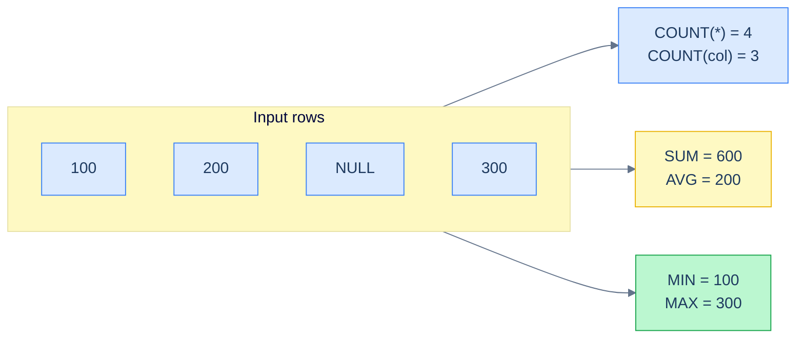

# 1. Aggregate Functions

## The Hook

A daily report runs at 3 a.m.: "average customer score." The query:

```sql
SELECT AVG(score) FROM customers;
```

The CEO emails: "Why did our average score drop from 500 to 420 this morning?"

The engineer pulls up the data. Yesterday: 5 customers, scores 350, 900, 750, 500, 0. Average = 500. Today: 6 customers, scores 350, 900, 750, 500, 0, *NULL* (a new sign-up where the score-calculation job hasn't finished yet). The NULL doesn't poison the average — `AVG` *ignores* NULLs. So the average should still be 500…

…except `0` is in the data. `AVG` doesn't ignore `0`. The new sign-up is *also* not the cause. The real cause: a *deleted* customer's score is being kept by a soft-delete flag, and that customer's row was just hard-deleted. The average shifted because the underlying data shifted. The query is correct; the *data* changed.

Or: maybe the query *isn't* correct. `AVG(score)` includes Peter's `0`. Should it? Is a customer with score 0 actually an active customer, or a placeholder, or an outlier? If you wanted "average score among customers with non-trivial activity," the right query has a `FILTER` clause, or a `WHERE` clause, or both:

```sql
SELECT AVG(score) FILTER (WHERE score > 0) FROM customers;
```

This chapter is about aggregate functions — the eight you'll reach for 90% of the time, the modifiers (`DISTINCT`, `FILTER`) that change their meaning, and the NULL behaviour that distinguishes "I want the average ignoring missing data" from "I want the average across every customer including zero-score ones." By the end you'll know which aggregate to reach for in each case, when `COUNT(*)` differs from `COUNT(column)`, and how to write aggregates that correctly handle the messy data your tables actually contain.

---

## Table of contents

1. [The eight you'll use most](#the-eight-aggregates)
2. [`COUNT(*)` vs `COUNT(column)` vs `COUNT(DISTINCT column)`](#count-variants)
3. [`SUM`, `AVG`, `MIN`, `MAX`](#sum-avg-min-max)
4. [`STRING_AGG` / `GROUP_CONCAT`](#string-agg)
5. [Boolean aggregates: `BOOL_AND`, `BOOL_OR`](#boolean-aggregates)
6. [The `DISTINCT` modifier](#distinct-modifier)
7. [The `FILTER` clause](#filter-clause)
8. [NULL behaviour](#null-behaviour)
9. [Edge cases and pitfalls](#edge-cases-and-pitfalls)
10. [Production reality](#production-reality)
11. [Practice ladder](#practice-ladder)
12. [Cross-links](#cross-links)
13. [Final takeaway](#final-takeaway)

***

# The eight aggregates

| Function | Returns | Notes |
|---|---|---|
| `COUNT(*)` | `BIGINT` — number of rows | counts all rows including those with NULLs |
| `COUNT(column)` | `BIGINT` — number of non-NULL values in `column` | NULLs are excluded |
| `COUNT(DISTINCT column)` | `BIGINT` — number of distinct non-NULL values | de-duplicates |
| `SUM(column)` | numeric — sum of non-NULL values | NULL of empty input is `NULL`, not `0` |
| `AVG(column)` | numeric — `SUM(column) / COUNT(column)` | NULLs excluded from both numerator and denominator |
| `MIN(column)` | smallest non-NULL value | works on numeric, text, date |
| `MAX(column)` | largest non-NULL value | works on numeric, text, date |
| `STRING_AGG(column, sep)` | `TEXT` — concatenation with separator | named `GROUP_CONCAT` in MySQL/SQLite |



<p align="center"><strong>Aggregates over (100, 200, NULL, 300). <code>COUNT(*)</code> sees 4 rows; <code>COUNT(col)</code> sees 3 non-NULL values. <code>SUM</code>/<code>AVG</code> ignore the NULL — average is 200, not 150.</strong></p>

Plus a couple of less-common but useful ones:

| Function | Returns | Notes |
|---|---|---|
| `BOOL_AND(predicate)` | `TRUE` if every row in the group is true | aka `EVERY` in standard SQL |
| `BOOL_OR(predicate)` | `TRUE` if at least one row is true | aka `ANY` (different from the `ANY` operator) |

These two are how you ask "do all customers have score > 0" / "does any order exceed $1000" without writing a subquery.

```sql run
CREATE TABLE customers (id INT, first_name TEXT, country TEXT, score INT);
INSERT INTO customers VALUES (1,'Maria','Germany',350),(2,'John','USA',900),(3,'Georg','UK',750),(4,'Martin','Germany',500),(5,'Peter','USA',0);

-- Each function in one query.
SELECT
  COUNT(*)                           AS row_count,
  COUNT(score)                       AS non_null_scores,
  COUNT(DISTINCT country)            AS country_count,
  SUM(score)                         AS total_score,
  AVG(score)                         AS avg_score,
  MIN(score)                         AS min_score,
  MAX(score)                         AS max_score,
  GROUP_CONCAT(first_name, ', ')     AS names_csv
FROM customers;
```

One row out, eight columns of summary statistics over the table. That's the canonical "executive summary" aggregate query.

---

# COUNT variants

`COUNT` is the most-used aggregate, and its three forms have different meanings. Confusing them is a common bug.

## `COUNT(*)`

**Counts every row** in the group, regardless of NULL.

```sql run
CREATE TABLE customers (id INT, first_name TEXT, country TEXT);
INSERT INTO customers VALUES (1,'Maria','Germany'),(2,'John',NULL),(3,'Georg','UK');

SELECT COUNT(*) AS rows FROM customers;
-- Returns 3.
```

`*` is a *placeholder for "the row"*, not "all columns" — `COUNT(*)` doesn't actually inspect any column, it just counts row-shaped things. This is why `COUNT(*)` works on tables that have NULLs, on JOIN results, on subquery outputs.

## `COUNT(column)`

**Counts non-NULL values** in the named column.

```sql run
CREATE TABLE customers (id INT, first_name TEXT, country TEXT);
INSERT INTO customers VALUES (1,'Maria','Germany'),(2,'John',NULL),(3,'Georg','UK');

-- 3 rows, but only 2 of them have a non-NULL country.
SELECT COUNT(*) AS rows, COUNT(country) AS non_null_countries
FROM customers;
```

The difference between `COUNT(*)` and `COUNT(country)` is **how many rows have NULL in `country`** — useful for data-quality queries.

The pattern from [GROUP BY and HAVING](/cortex/languages/sql/aggregation/group-by-and-having#empty-groups-dont-appear): after a `LEFT JOIN`, `COUNT(*)` always counts at least 1 per outer row (because the row exists), but `COUNT(right_side_column)` counts 0 when the join didn't match. **`COUNT(o.order_id)` is the right way to count "actual orders per customer" after a `LEFT JOIN`** — `COUNT(*)` would over-count.

## `COUNT(DISTINCT column)`

**Counts distinct non-NULL values.**

```sql run
CREATE TABLE customers (id INT, first_name TEXT, country TEXT);
INSERT INTO customers VALUES (1,'Maria','Germany'),(2,'John','USA'),(3,'Georg','UK'),(4,'Martin','Germany'),(5,'Peter','USA');

-- 5 rows, 3 unique countries.
SELECT COUNT(*) AS rows, COUNT(DISTINCT country) AS unique_countries
FROM customers;
```

`COUNT(DISTINCT ...)` is more expensive than the other forms — to find distinct values, the engine must sort or hash the column. On large tables, `COUNT(DISTINCT)` over an unindexed column can be slow. There are approximate alternatives (`approx_count_distinct`, HyperLogLog) for analytics workloads — out of scope for foundations, but useful to know they exist.

---

# SUM, AVG, MIN, MAX

The numeric "Big Four":

```sql run
CREATE TABLE orders (order_id INT, customer_id INT, sales INT);
INSERT INTO orders VALUES (1001,1,120),(1002,1,80),(1003,2,450),(1004,3,200),(1005,4,300),(1006,9,150);

SELECT SUM(sales) AS total,
       AVG(sales) AS avg,
       MIN(sales) AS min,
       MAX(sales) AS max,
       MAX(sales) - MIN(sales) AS range
FROM orders;
```

All four ignore NULLs. Some subtleties:

- **`SUM` over an empty set returns `NULL`, not `0`.** `SELECT SUM(sales) FROM orders WHERE order_id < 0` returns `NULL`. To get `0`, wrap it: `COALESCE(SUM(sales), 0)`.
- **`AVG` is integer-divisive in some dialects.** Postgres: `AVG(int_column)` returns numeric (high precision). MySQL/SQLite: also numeric. SQL Server: integer division if the column is `INT` — surprise. Cast to `DECIMAL` if portability matters.
- **`MIN` and `MAX` work on text and dates too** (lexicographic for text, chronological for dates) — `MAX(country)` returns the alphabetically-last country, `MIN(order_date)` returns the earliest order date.

---

# STRING_AGG

Concatenate values into one string, with a separator:

```sql run
CREATE TABLE customers (id INT, first_name TEXT, country TEXT);
INSERT INTO customers VALUES (1,'Maria','Germany'),(2,'John','USA'),(3,'Georg','UK'),(4,'Martin','Germany'),(5,'Peter','USA');

-- Customers per country, all in one cell.
SELECT country, GROUP_CONCAT(first_name, ', ') AS names
FROM customers
GROUP BY country
ORDER BY country;
```

> **Dialect note:**
> - **PostgreSQL & SQL Server (2017+)**: `STRING_AGG(col, ', ')`
> - **MySQL & SQLite**: `GROUP_CONCAT(col, ', ')` (the second arg is optional; defaults to `,`)
> - **Standard SQL**: `LISTAGG(col, ', ') WITHIN GROUP (ORDER BY col)` — Oracle, DB2, sometimes others
> The runnable blocks above use `GROUP_CONCAT` because Piston's SQLite supports it. In Postgres-canonical writing, you'd use `STRING_AGG(first_name, ', ')`.

`STRING_AGG` shines for "give me a comma-separated list of X per group" — a tags-on-a-blog-post column, all the products in a category, every email recipient for a notification. Postgres also lets you `STRING_AGG(... ORDER BY col)` to get them sorted, which is essential for deterministic output.

---

# Boolean aggregates

Two of them:

```sql run
CREATE TABLE customers (id INT, first_name TEXT, score INT);
INSERT INTO customers VALUES (1,'Maria',350),(2,'John',900),(3,'Georg',750),(4,'Martin',500),(5,'Peter',0);

-- "Do all customers have a positive score?"  No (Peter has 0).
-- "Does any customer have a score above 800?"  Yes (John).
SELECT
  MIN(score > 0) AS all_positive_proxy,           -- SQLite has no BOOL_AND, but MIN works (TRUE > FALSE)
  MAX(score > 800) AS any_above_800_proxy
FROM customers;
```

> **Dialect note:** Postgres has true `BOOL_AND` and `BOOL_OR`. SQLite and MySQL don't (they treat boolean as integer 0/1), but `MIN`/`MAX` over the boolean expression gives the same result: `MIN(predicate)` is true iff every row's predicate is true, `MAX(predicate)` is true iff any row's is. Standard-Postgres form:
> ```sql
> SELECT BOOL_AND(score > 0) AS all_positive,
>        BOOL_OR(score > 800) AS any_above_800
> FROM customers;
> ```

---

# DISTINCT modifier

`AGG(DISTINCT column)` aggregates only the distinct non-NULL values:

```sql run
CREATE TABLE orders (order_id INT, customer_id INT, sales INT);
INSERT INTO orders VALUES (1001,1,120),(1002,1,80),(1003,2,450),(1004,3,200),(1005,4,300),(1006,9,150);

-- 6 distinct customer_ids in orders (1, 2, 3, 4, 9 = 5 unique values).
SELECT COUNT(DISTINCT customer_id) AS unique_customers,
       SUM(DISTINCT sales)         AS sum_distinct_sales,    -- watch this one
       AVG(DISTINCT sales)         AS avg_distinct_sales
FROM orders;
```

`SUM(DISTINCT sales)` collapses ties before summing — if two orders both have `sales = 100`, only one `100` contributes to the sum. **Almost never what you want.** `SUM(DISTINCT)` and `AVG(DISTINCT)` are dangerous because they silently change the maths in a way that produces *plausible-looking* results.

`COUNT(DISTINCT)` is the legitimate use case. The other `DISTINCT` aggregates are red flags in code review.

---

# FILTER clause

The standard-SQL way to apply a per-aggregate condition. Computes the aggregate over only the rows where the filter is true:

```sql run
CREATE TABLE customers (id INT, first_name TEXT, country TEXT, score INT);
INSERT INTO customers VALUES (1,'Maria','Germany',350),(2,'John','USA',900),(3,'Georg','UK',750),(4,'Martin','Germany',500),(5,'Peter','USA',0);

-- Multiple aggregates, each with its own filter — in one query.
SELECT
  COUNT(*)                                      AS total_customers,
  COUNT(*) FILTER (WHERE score > 500)           AS high_score_customers,
  COUNT(*) FILTER (WHERE country = 'Germany')   AS german_customers,
  AVG(score) FILTER (WHERE score > 0)           AS avg_active_score
FROM customers;
```

> **Dialect note:** `FILTER` is standard SQL and supported by PostgreSQL and SQLite (since 3.30, October 2019). MySQL doesn't support it — the workaround is `SUM(CASE WHEN condition THEN 1 ELSE 0 END)` or `AVG(CASE WHEN condition THEN col ELSE NULL END)`. Both are uglier but portable.
>
> ```sql
> -- The portable rewrite for "count rows with score > 500":
> SUM(CASE WHEN score > 500 THEN 1 ELSE 0 END) AS high_score_customers
> ```

`FILTER` is the right tool for "give me different aggregates over different subsets of the same data." Without `FILTER`, you'd run separate queries and combine — slower and uglier. With `FILTER`, one query, one pass over the data.

This shape — multiple `FILTER` clauses in one `SELECT` — is the classic "dashboard query." A daily executive summary that needs "active users" and "paying users" and "users in Q4" and "users in trial" all in one row is essentially a list of `FILTER`ed aggregates.

---

# NULL behaviour

Aggregate functions handle NULL in a uniform-but-non-obvious way: **NULLs are silently excluded from the aggregation** (with one exception: `COUNT(*)`).

| Function | What it does with NULL |
|---|---|
| `COUNT(*)` | Counts rows including NULLs |
| `COUNT(col)` | Skips NULL values |
| `SUM(col)`, `AVG(col)` | Skips NULL values |
| `MIN(col)`, `MAX(col)` | Skips NULL values |
| `STRING_AGG(col, sep)` | Skips NULL values |
| Empty input | All except `COUNT` return `NULL`; `COUNT` returns `0` |

```sql run
CREATE TABLE t (x INT);
INSERT INTO t VALUES (10),(20),(NULL),(30);

-- 4 rows total; 3 have non-NULL x; NULLs ignored by SUM/AVG.
SELECT COUNT(*) AS row_count,
       COUNT(x) AS non_null_x,
       SUM(x) AS sum_x,
       AVG(x) AS avg_x;
```

`SUM(x)` is `60`. `AVG(x)` is `20` (60 / 3, not 60 / 4). The NULL is invisible to the aggregate.

This is usually what you want. The trap is that **`AVG` of `(10, 20, NULL, 30)` is `20`, not `15`**. If you intended the NULLs to count as 0, you have to say so:

```sql
SELECT AVG(COALESCE(x, 0)) FROM t;     -- 15
```

Conversely, if you want to *exclude* zeroes too, add a filter:

```sql
SELECT AVG(x) FILTER (WHERE x > 0) FROM t;
```

The decision — "do NULLs count?", "do zeroes count?" — is a *product* decision. The aggregate function does what you tell it; saying nothing means "treat NULL as missing." That default is sensible 80% of the time and a bug 20% of the time. Be explicit in production code.

---

# Edge cases and pitfalls

## SUM over an empty set is NULL, not 0

```sql
SELECT SUM(sales) FROM orders WHERE 1=0;
-- Returns NULL.
```

If you want `0`, wrap in `COALESCE`:

```sql
SELECT COALESCE(SUM(sales), 0) FROM orders WHERE 1=0;
-- Returns 0.
```

This bites every dashboard query that aggregates a recent time window — when the window has no rows, you want `0`, not `NULL`. `COALESCE` is the fix.

## COUNT(*) on a JOIN

A common gotcha. `COUNT(*)` on a `LEFT JOIN` result counts the joined rows, not the original "left" rows:

```sql run
CREATE TABLE customers (id INT, first_name TEXT);
CREATE TABLE orders (order_id INT, customer_id INT);
INSERT INTO customers VALUES (1,'Maria'),(5,'Peter');
INSERT INTO orders VALUES (1001,1),(1002,1),(1003,1);

-- Maria has 3 orders → 3 joined rows. Peter has none → 1 joined row (with NULL order_id).
-- COUNT(*) = 4. COUNT(o.order_id) = 3.
SELECT COUNT(*) AS join_rows, COUNT(o.order_id) AS actual_orders
FROM customers c
LEFT JOIN orders o ON o.customer_id = c.id;
```

Use `COUNT(o.order_id)` (or any non-NULL right-side column) to count "real" matches. Use `COUNT(*)` when you genuinely want "the row count of the joined result."

## Aggregate of an aggregate isn't allowed

```sql
-- ❌ ERROR: nested aggregates not allowed.
SELECT MAX(SUM(sales)) FROM orders GROUP BY customer_id;
```

To compute "the maximum per-customer total," you need a subquery or CTE:

```sql
SELECT MAX(total) FROM (
  SELECT customer_id, SUM(sales) AS total FROM orders GROUP BY customer_id
) t;
```

Inner query: per-customer totals. Outer query: max of those.

## DISTINCT in aggregate vs DISTINCT in SELECT

Two different things:

- `SELECT DISTINCT a, b FROM t` — keep distinct (a,b) pairs from the result.
- `SELECT COUNT(DISTINCT a) FROM t` — count distinct values of `a`.

Both legal, both useful, easy to confuse.

## Aggregates and indexes

`MIN(col)` and `MAX(col)` on an indexed column are *O(1)* — the engine just reads the first or last leaf of the B-tree index. `SUM`, `AVG`, `COUNT` always require a full scan (with no index, you must visit every row). This matters when designing schemas for large tables: knowing which aggregates you'll run informs which indexes you need. Full treatment in [B-Tree Indexes](/cortex/languages/sql/index).

---

# Production reality

Codefolio's `hello_events` is a counters-and-events table — the natural fit for aggregate queries. Three example queries you'd actually run:

**(1) Hourly request rate:**

```sql
-- Postgres-flavour
SELECT DATE_TRUNC('hour', TO_TIMESTAMP(timestamp_ms / 1000.0)) AS hour,
       COUNT(*) AS requests,
       MAX(visits) - MIN(visits) AS visits_added
FROM hello_events
WHERE timestamp_ms >= EXTRACT(EPOCH FROM NOW() - INTERVAL '24 hours') * 1000
GROUP BY hour
ORDER BY hour;
```

`COUNT(*)` is requests-per-hour. `MAX(visits) - MIN(visits)` is "how much did the visits counter advance during this hour" — a useful proxy for unique successful increments.

**(2) Activity dashboard with filters:**

```sql
-- Postgres-flavour
SELECT
  COUNT(*)                                                  AS total_24h,
  COUNT(*) FILTER (WHERE visits >= 1000)                    AS high_traffic_24h,
  AVG(visits) FILTER (WHERE timestamp_ms >= NOW() - 60000)  AS avg_last_minute
FROM hello_events
WHERE timestamp_ms >= EXTRACT(EPOCH FROM NOW() - INTERVAL '24 hours') * 1000;
```

Three different aggregates over three different time/threshold subsets, in one pass.

**(3) "Top 5 customers" report:**

```sql
SELECT customer_id,
       COUNT(*)            AS order_count,
       SUM(sales)          AS total_sales,
       AVG(sales)          AS avg_sale,
       MIN(order_date)     AS first_order,
       MAX(order_date)     AS last_order
FROM orders
GROUP BY customer_id
ORDER BY total_sales DESC
LIMIT 5;
```

Six columns of summary statistics per customer, ranked by total sales. Five rows out. Once you can write this fluently you can write half of analytics SQL.

---

# Practice ladder

1. **Count of orders per customer (including customers with zero orders).** *Hint: `LEFT JOIN`, then `COUNT(o.order_id)` (NOT `COUNT(*)`) per customer.*
2. **Average score among customers whose score is above 0.** *Hint: `AVG(score) FILTER (WHERE score > 0)`.*
3. **The earliest and latest order dates per customer.** *Hint: `MIN(order_date)`, `MAX(order_date)`, group by customer.*
4. **A comma-separated list of customer names per country.** *Hint: `GROUP_CONCAT(first_name, ', ')` (SQLite/MySQL) or `STRING_AGG(first_name, ', ')` (Postgres).*
5. **Predict the result of:**
   ```sql
   SELECT AVG(x) FROM (VALUES (10),(20),(NULL),(30)) AS t(x);
   ```
   *Hint: NULL is excluded from the count *and* the sum. What's the denominator?*
6. **Why does this query potentially return `NULL` instead of `0` for empty time windows?**
   ```sql
   SELECT SUM(sales) FROM orders WHERE order_date >= '2099-01-01';
   ```
   *Hint: `SUM` over an empty set. The fix?*
7. **Count of customers per country *and* count of distinct names per country in one query.** *Hint: `COUNT(*)` and `COUNT(DISTINCT first_name)` in the same `SELECT`.*

***

# Cross-links

- **Previous in this module:** [GROUP BY and HAVING](/cortex/languages/sql/aggregation/group-by-and-having) — the mechanics that produce groups for these aggregates to operate on.
- **Next in this module:** [Grouping Sets, ROLLUP, CUBE](/cortex/languages/sql/aggregation/grouping-sets-rollup-cube) — multi-dimensional aggregation: subtotals at multiple grouping levels in a single query.
- **Forward reference:** [Window Functions](/cortex/languages/sql/index) — the same aggregates (`SUM`, `AVG`, `COUNT`, etc.) used as windowed expressions, computing over a sliding window of rows without collapsing the result.
- **Forward reference:** [B-Tree Indexes](/cortex/languages/sql/index) — `MIN`/`MAX` on indexed columns is O(1); `SUM`/`AVG`/`COUNT` always require a scan.

***

# Final Takeaway

Aggregate functions summarise rows into one value per group. Three patterns to internalise:

1. **`COUNT(*)` counts rows; `COUNT(column)` counts non-NULL values; `COUNT(DISTINCT column)` counts unique non-NULL values.** Pick the one that matches the question. After a `LEFT JOIN`, `COUNT(*)` is almost always wrong — use `COUNT(some_right_side_column)` instead.
2. **NULLs are silently excluded from every aggregate (except `COUNT(*)`).** Whether that's the right answer is a product decision. If NULLs should count as zeroes, use `COALESCE(col, 0)`. If a particular value (like `0`) should be excluded, use `FILTER (WHERE col > 0)` or move the filter into `WHERE`.
3. **`FILTER` lets one `SELECT` produce multiple aggregates over different subsets in one pass.** "Total customers / German customers / high-score customers" should be three `FILTER`ed aggregates in one query, not three separate queries combined later. Faster, cleaner, atomic.

Master these three and aggregate functions become the predictable workhorses they should be.

## Your Turn

Before you move on, check your understanding with the coach — explain the idea, apply it, weigh the trade-offs, then defend your reasoning.

<div class="concept-coach"></div>
