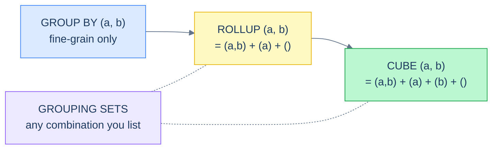

# 1. Grouping Sets, ROLLUP, CUBE

## The Hook

A finance analyst needs a quarterly report. They want **total sales by country, total sales by month, total sales by (country, month), and the grand total** — all in one report.

The naïve approach: write four queries and `UNION ALL` them:

```sql
SELECT country, NULL AS month, SUM(sales) FROM orders JOIN customers ON ... GROUP BY country
UNION ALL
SELECT NULL, MONTH(order_date), SUM(sales) FROM orders GROUP BY MONTH(order_date)
UNION ALL
SELECT country, MONTH(order_date), SUM(sales) FROM orders JOIN customers ON ... GROUP BY country, MONTH(order_date)
UNION ALL
SELECT NULL, NULL, SUM(sales) FROM orders;
```

That's four passes over the same data. On a billion-row `orders` table, that's four times the cost — plus the consistency risk that if you write `JOIN customers` differently in two of the four, you get subtly different numbers.

`GROUPING SETS`, `ROLLUP`, and `CUBE` are SQL's answer: **specify multiple grouping dimensions in one query**, and the engine produces all the requested combinations in a single pass. The result is the same as the four `UNION ALL`s, but cheaper and atomic.

This chapter is about those three operators — when to use each, how to read their output (the `NULL`-as-grand-total convention), and the `GROUPING()` function that lets you tell "subtotal NULL" apart from "data NULL." By the end you'll know which operator matches each shape of "show me the data at every level," and you'll be able to write a single-query pivot table.

---

## Table of contents

1. [Multi-dimensional aggregation](#multi-dimensional-aggregation)
2. [`GROUPING SETS`](#grouping-sets)
3. [`ROLLUP`](#rollup)
4. [`CUBE`](#cube)
5. [The `NULL` convention and the `GROUPING()` function](#null-convention)
6. [When to use which](#when-to-use-which)
7. [Edge cases and pitfalls](#edge-cases-and-pitfalls)
8. [Production reality](#production-reality)
9. [Practice ladder](#practice-ladder)
10. [Cross-links](#cross-links)
11. [Final takeaway](#final-takeaway)

***

# Multi-dimensional aggregation

A regular `GROUP BY country, month` produces one row per (country, month) combination. Two dimensions, all combinations, fine grain.

A `ROLLUP` of the same two columns produces *those* rows **plus** the per-country subtotals **plus** the grand total. Three groupings in one query.



<p align="center"><strong>The hierarchy. <code>GROUP BY</code> is one grouping. <code>ROLLUP</code> adds the parent subtotals along one hierarchy. <code>CUBE</code> adds every combination, both directions. <code>GROUPING SETS</code> lets you cherry-pick.</strong></p>

---

# GROUPING SETS

The most explicit of the three. You list every grouping you want; each becomes one "shard" of the result.

```sql run
CREATE TABLE customers (id INT, country TEXT);
CREATE TABLE orders (order_id INT, customer_id INT, order_date DATE, sales INT);
INSERT INTO customers VALUES (1,'Germany'),(2,'USA'),(3,'UK'),(4,'Germany'),(5,'USA');
INSERT INTO orders VALUES (1001,1,'2026-04-03',120),(1002,1,'2026-05-15',80),(1003,2,'2026-04-22',450),(1004,3,'2026-04-28',200),(1005,4,'2026-05-01',300);

-- Three groupings in one query: by country, by month, and grand total.
SELECT
  c.country,
  SUBSTR(o.order_date, 1, 7) AS year_month,
  SUM(o.sales) AS total
FROM customers c
JOIN orders o ON o.customer_id = c.id
GROUP BY GROUPING SETS (
  (c.country),                            -- per-country
  (SUBSTR(o.order_date, 1, 7)),           -- per-month
  ()                                       -- grand total
)
ORDER BY c.country NULLS LAST, year_month NULLS LAST;
```

> **Dialect note:** `GROUPING SETS` is in standard SQL and supported by PostgreSQL, SQL Server, Oracle. **SQLite does not support `GROUPING SETS`, `ROLLUP`, or `CUBE`** as of writing — SQLite is the runtime in this book's runnable blocks, so the block above will error in the runner. Read the query, not the runner output. The conceptual semantics still apply.
>
> The portable workaround in SQLite: write the `UNION ALL` form by hand, as in the chapter's hook.

The result has three shards interleaved:

- 3 rows from `(country)`: Germany, UK, USA totals.
- 2 rows from `(year_month)`: April 2026, May 2026 totals.
- 1 row from `()`: the grand total.

Total 6 rows, in one pass.

The `NULL` columns indicate "this row is rolled up over this dimension":

- A row in the country-only grouping has `country = 'Germany'` and `year_month = NULL`.
- A row in the month-only grouping has `country = NULL` and `year_month = '2026-04'`.
- The grand-total row has both NULL.

That's the **NULL-as-subtotal convention** — covered in detail below.

---

# ROLLUP

`ROLLUP(a, b, c)` produces a *hierarchy* of groupings:

- `(a, b, c)` — fine grain
- `(a, b)` — rolled up over `c`
- `(a)` — rolled up over `b` and `c`
- `()` — grand total

It's `GROUPING SETS` for the case where the dimensions form a hierarchy (year → quarter → month → day, or country → region → city, etc.).

```sql
-- Sales by country, then by (country, month), then grand total.
SELECT c.country,
       SUBSTR(o.order_date, 1, 7) AS year_month,
       SUM(o.sales) AS total
FROM customers c
JOIN orders o ON o.customer_id = c.id
GROUP BY ROLLUP (c.country, SUBSTR(o.order_date, 1, 7))
ORDER BY c.country NULLS LAST, year_month NULLS LAST;
```

The output has:

- N rows of `(country, year_month)` totals
- 3 rows of per-country subtotals (`year_month = NULL`)
- 1 grand total (`country = NULL, year_month = NULL`)

This is the canonical "drill-up" / "subtotals at every parent level" pattern. Spreadsheet pivot tables produce this shape; financial reports run on it.

`ROLLUP` is *order-sensitive*: `ROLLUP(a, b)` is different from `ROLLUP(b, a)`. The first rolls up `b` first, then `a`. Pick the order that matches your hierarchy.

---

# CUBE

`CUBE(a, b)` produces every possible combination of the listed columns:

- `(a, b)` — fine grain
- `(a)` — rolled up over `b`
- `(b)` — rolled up over `a`
- `()` — grand total

It's `GROUPING SETS` for "I want every possible subtotal." For two columns, that's 2² = 4 groupings. For three columns, 2³ = 8. Cube grows exponentially in the number of columns; use it sparingly.

```sql
SELECT c.country, SUBSTR(o.order_date, 1, 7) AS year_month, SUM(o.sales) AS total
FROM customers c
JOIN orders o ON o.customer_id = c.id
GROUP BY CUBE (c.country, SUBSTR(o.order_date, 1, 7))
ORDER BY c.country NULLS LAST, year_month NULLS LAST;
```

Difference from `ROLLUP`: `CUBE` *also* produces the per-month subtotals (rolled up across all countries), which `ROLLUP(country, month)` does not. If you want both per-country and per-month subtotals plus the grand total, `CUBE` is the operator. If only per-country subtotals (the natural parent of "country, month"), `ROLLUP` is the operator. If you want any specific custom combination, `GROUPING SETS`.

---

# The NULL convention and `GROUPING()`

The output rows of these operators carry `NULL` in the columns rolled-up-over. That works fine when the underlying data has no NULLs — but when it does, you can't tell "this is a real NULL country" from "this is a subtotal across all countries."

The `GROUPING()` function disambiguates. It returns `1` if the column was rolled up in the current row, `0` otherwise.

```sql
SELECT
  c.country,
  GROUPING(c.country) AS country_subtotal,
  SUM(o.sales) AS total
FROM customers c
JOIN orders o ON o.customer_id = c.id
GROUP BY ROLLUP (c.country)
ORDER BY country_subtotal, c.country;
```

For each row:

- `country_subtotal = 0` and `country = 'Germany'` → fine-grain row for Germany.
- `country_subtotal = 1` and `country = NULL` → grand total row.

If your data legitimately has a `country = NULL` row (unknown country), it'd appear with `country_subtotal = 0`, distinguishing it from the rolled-up grand-total row.

A common pattern is to use `GROUPING()` to prettify the output:

```sql
SELECT
  CASE WHEN GROUPING(c.country) = 1 THEN 'ALL COUNTRIES' ELSE c.country END AS country_or_total,
  SUM(o.sales) AS total
FROM customers c
JOIN orders o ON o.customer_id = c.id
GROUP BY ROLLUP (c.country);
```

Now the result reads cleanly: each row has either a real country name or the literal string `'ALL COUNTRIES'`. No NULL ambiguity.

---

# When to use which

| Question | Operator |
|---|---|
| Want subtotals along a strict hierarchy (year → quarter → month) | `ROLLUP` |
| Want every possible combination of subtotals | `CUBE` |
| Want a specific, custom set of groupings | `GROUPING SETS` |
| Want fine-grain only | regular `GROUP BY` |
| Need to support SQLite/MySQL pre-8 | `UNION ALL` of separate queries |

Real-world breakdown: `ROLLUP` is the most common. Reports of "sales by region with rollups," "events by hour with daily totals," "metrics by service with global totals" all match the `ROLLUP` shape. `GROUPING SETS` is the runner-up — useful when the desired subtotals don't follow a clean hierarchy. `CUBE` is rarer; for small dimensions it's fine, for many dimensions the result-set explodes.

---

# Edge cases and pitfalls

## NULL ambiguity in the underlying data

If the source has `NULL`s, the rolled-up `NULL` in the output is indistinguishable without `GROUPING()`. Any production query using these operators on a column that may contain real `NULL`s should include the `GROUPING()` flag.

## Result count grows fast with CUBE

`CUBE(a, b, c)` produces 2³ = 8 groupings. `CUBE(a, b, c, d)` produces 16. Each grouping produces N rows where N is the number of distinct combinations. The total result-set can balloon unexpectedly. Test on small data first.

## SQLite doesn't support these (yet)

As of SQLite 3.45, `GROUPING SETS`, `ROLLUP`, and `CUBE` are not implemented. The runnable blocks in this chapter that use these operators won't execute against the in-book SQLite runner. They're shown for completeness and for production-Postgres relevance. The portable workaround for SQLite is the explicit `UNION ALL` from the chapter's hook.

If you want to demonstrate the *concept* in a runnable SQLite block, the workaround:

```sql run
CREATE TABLE orders (order_id INT, customer_id INT, country TEXT, sales INT);
INSERT INTO orders VALUES (1001,1,'Germany',120),(1002,1,'Germany',80),(1003,2,'USA',450),(1004,3,'UK',200),(1005,4,'Germany',300);

-- Per-country subtotals + grand total, expressed as UNION ALL (works in SQLite).
SELECT country, SUM(sales) AS total FROM orders GROUP BY country
UNION ALL
SELECT 'GRAND TOTAL', SUM(sales) FROM orders
ORDER BY country;
```

## ORDER BY with NULL-rolled-up rows

The rolled-up `NULL` rows can appear anywhere in the output unless you sort them. Use `ORDER BY ... NULLS LAST` (or `NULLS FIRST`) to keep the subtotals together at the bottom (or top):

```sql
ORDER BY c.country NULLS LAST, year_month NULLS LAST;
```

Without this, the engine is free to interleave them.

## ROLLUP isn't the same as ROLLUP

Confusingly, in some older dialects (early Oracle) `ROLLUP(a, b)` is an *additional* clause appended after `GROUP BY`, not part of `GROUP BY` itself. Modern standard syntax is `GROUP BY ROLLUP(a, b)`. Check your dialect's manual if you see surprising behaviour.

---

# Production reality

The single most common production use of `ROLLUP` is in BI/analytics dashboards — daily reports that show metrics at multiple aggregation levels in one chart.

A monitoring example for codefolio's `hello_events`:

```sql
-- Postgres-flavour. Hourly event counts plus a daily total.
SELECT
  DATE_TRUNC('day',  TO_TIMESTAMP(timestamp_ms / 1000.0)) AS day,
  DATE_TRUNC('hour', TO_TIMESTAMP(timestamp_ms / 1000.0)) AS hour,
  COUNT(*) AS events
FROM hello_events
WHERE timestamp_ms >= EXTRACT(EPOCH FROM NOW() - INTERVAL '24 hours') * 1000
GROUP BY ROLLUP (day, hour)
ORDER BY day NULLS LAST, hour NULLS LAST;
```

Result: 24 rows of per-hour counts, 1 row per-day subtotal (with `hour = NULL`), 1 row grand total. Three "shards" in one query, no UNION ALLs, atomic.

A second pattern — financial summaries with regional and product breakdowns:

```sql
-- Sales by region, by product, by region+product, and grand total.
SELECT region, product, SUM(amount) AS revenue
FROM sales_facts
GROUP BY CUBE (region, product)
ORDER BY region NULLS LAST, product NULLS LAST;
```

Run this on a typical mid-size org's sales table and you have a complete pivot table — every drill-down level the analyst could want, in one query, in a single pass over the data.

The reason BI tools like Tableau and Looker generate these operators under the hood is exactly this: a single query, atomic snapshot, every level the dashboard needs.

---

# Practice ladder

These exercises assume Postgres-or-better. SQLite users: read the queries; the conceptual answers still apply.

1. **Total sales by country and the grand total, in one query, using `ROLLUP`.** *Hint: `GROUP BY ROLLUP(country)`. The grand-total row will have `country = NULL`.*
2. **Same as (1), but use `GROUPING()` to render the grand-total row as `'TOTAL'` instead of `NULL`.** *Hint: `CASE WHEN GROUPING(country) = 1 THEN 'TOTAL' ELSE country END`.*
3. **Total sales by (country, month), per-country subtotals, per-month subtotals, and grand total — all in one query.** *Hint: `CUBE(country, month)`. Or equivalently `GROUPING SETS ((country, month), (country), (month), ())`.*
4. **Why does this query return more rows than `GROUP BY country, month`?**
   ```sql
   SELECT country, month, SUM(sales) FROM ... GROUP BY ROLLUP(country, month);
   ```
   *Hint: ROLLUP adds extra subtotal rows. How many extra? 1 per country + 1 grand total.*
5. **For a SQLite environment, write the equivalent of `GROUPING SETS ((country), (month), ())` using `UNION ALL`.** *Hint: three queries, one per shard, each projecting the same column shape with `NULL` placeholders for the missing dimensions.*
6. **Predict the row count of `CUBE(a, b, c)` over a dataset where each of a, b, c has 10 distinct values.** *Hint: 2^3 = 8 groupings. The full-grain grouping has 10×10×10 = 1000 rows. Each one-column-rolled-up grouping has 10×10 = 100 rows × 3 = 300. Each two-column-rolled-up grouping has 10 × 3 = 30. Grand total: 1 row. Total ≈ 1331.*

***

# Cross-links

- **Previous in this module:** [Aggregate Functions](/cortex/languages/sql/aggregation/aggregate-functions) — the building blocks (`SUM`, `COUNT`, `AVG`) that compute the values inside each grouping.
- **Module complete.** Next: [Row Functions](/cortex/languages/sql/index) — string, number, date, NULL, and CASE functions; the per-row counterpart to aggregation's per-group functions.
- **Forward reference:** [Window Functions](/cortex/languages/sql/index) — when you want subtotals *alongside* the original rows, not collapsed into separate rows. Window aggregates are the alternative for some of the same shapes.
- **Forward reference:** [Indexes and Performance](/cortex/languages/sql/index) — multi-dimensional aggregations are expensive; covering indexes and materialised views are the production answers when these queries appear in hot paths.

***

# Final Takeaway

Multi-dimensional aggregation gives you subtotals at multiple levels in one pass. Three patterns to internalise:

1. **`ROLLUP` for hierarchies, `CUBE` for "every combination," `GROUPING SETS` for cherry-picked combinations.** Pick the operator that matches the shape of the question. `ROLLUP` is by far the most common in real BI/finance work.
2. **The rolled-up rows have `NULL` in the rolled-up columns — and so might your real data.** Use the `GROUPING()` function to disambiguate, and consider rendering the rolled-up `NULL`s as a literal string (`'ALL'`, `'TOTAL'`) for human readers.
3. **One query, one pass over the data, atomic snapshot.** Compared to four `UNION ALL`'d queries, the multi-dimensional operators are faster and consistent. They're why BI tools generate this syntax under the hood — and why your dashboards should too once you're past prototype scale.

With this chapter, the [Aggregation](/cortex/languages/sql/aggregation/index) module — and Phase 2 of the SQL curriculum — is complete. You can now combine rows from multiple tables and summarise them at any level; the next module ([Row Functions](/cortex/languages/sql/index)) shifts back to per-row computations: strings, dates, numbers, and the `CASE` expression.

## Your Turn

Before you move on, check your understanding with the coach — explain the idea, apply it, weigh the trade-offs, then defend your reasoning.

<div class="concept-coach"></div>
