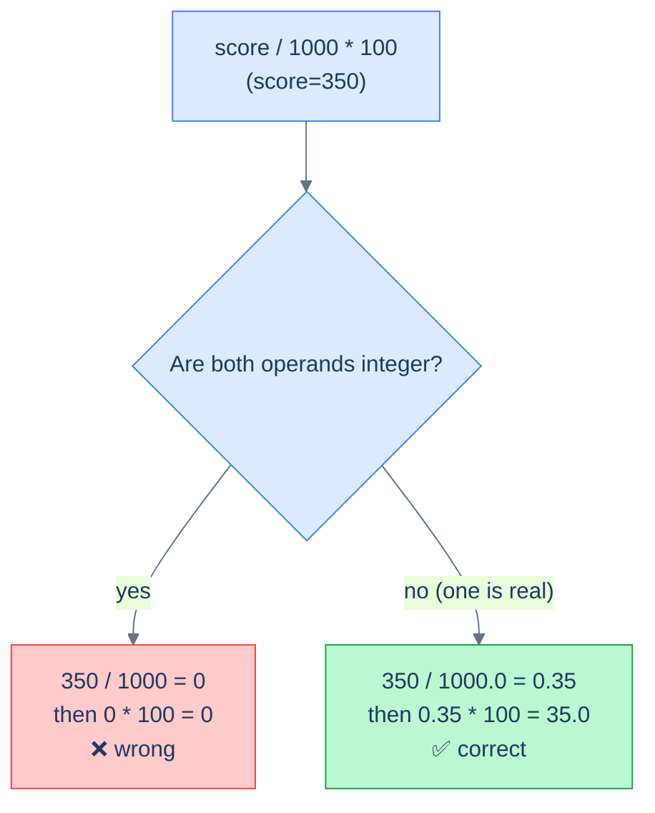

# 1. Numbers

## The Hook

A pricing engineer writes a query for a discount report:

```sql
SELECT product_id, price * 0.9 AS discounted_price FROM products;
```

For a product priced at `$19.99`, the result is `$17.991`. They round it for display. Ship it.

A month later finance reports: "The reconciliation between the sales-system and the accounting-system has a $1,247.83 discrepancy across the quarter."

The discrepancy is real. Each of 50,000 transactions had a `price * 0.9` computed in `DOUBLE PRECISION` (binary floating-point), and binary floats can't represent decimals like `19.99` exactly. The errors are tiny per row — six decimal places of noise — but accumulate. Multiply by 50,000 and you get $1,247.83. Multiply by another quarter and the gap doubles.

The fix is one keyword: `NUMERIC`. **Money goes in `NUMERIC` columns; computations on money use `NUMERIC` arithmetic.** `FLOAT`/`DOUBLE PRECISION` is for physics, ML, sensor data — anything where exact decimals don't matter and IEEE 754 noise is acceptable. The day you put money in a `FLOAT` is the day you start drifting.

This chapter is about numeric functions and the type traps. By the end you'll know when to cast, why integer division is sometimes useful and sometimes a bug, and which functions to reach for in standard arithmetic-and-rounding work.

---

## Table of contents

1. [Numeric types: a quick refresher](#numeric-types-refresher)
2. [Arithmetic operators](#arithmetic-operators)
3. [Integer division and the `%` operator](#integer-division)
4. [Rounding: `ROUND`, `FLOOR`, `CEIL`, `TRUNC`](#rounding)
5. [Other numeric functions](#other-numeric-functions)
6. [Casting and type coercion](#casting-and-type-coercion)
7. [Money: never `FLOAT`](#money)
8. [Edge cases and pitfalls](#edge-cases-and-pitfalls)
9. [Production reality](#production-reality)
10. [Practice ladder](#practice-ladder)
11. [Cross-links](#cross-links)
12. [Final takeaway](#final-takeaway)

***

# Numeric types refresher

From [Data Definition](/cortex/languages/sql/foundations/data-definition#column-types):

| Type | Range | When to use |
|---|---|---|
| `INTEGER` (`INT`) | ±2.1 billion | Most ID columns, counts, bounded integers |
| `BIGINT` | ±9.2 quintillion | Unbounded counters, ms timestamps, large IDs |
| `SMALLINT` | ±32k | Tiny ranges (e.g. enum-as-int) |
| `NUMERIC(p, s)` | Arbitrary-precision decimal | **Money**, anything where binary float would lose precision |
| `DOUBLE PRECISION` (`FLOAT`) | IEEE 754 double | Approximate floats — physics, ML, *not money* |

The choice between `INTEGER` and `NUMERIC` and `DOUBLE PRECISION` is the most consequential numeric-typing decision; everything else in this chapter assumes you've made it correctly.

---

# Arithmetic operators

```sql run
SELECT
  10 + 3      AS plus,
  10 - 3      AS minus,
  10 * 3      AS times,
  10 / 3      AS divide_int,         -- integer division: 3
  10.0 / 3    AS divide_real,        -- 3.333...
  10 % 3      AS modulo;             -- 1
```

Standard four operators (`+`, `-`, `*`, `/`) plus `%` (modulo). Postgres also has `^` for exponent (`2 ^ 10 = 1024`); SQLite uses `POWER(2, 10)`.

Operator precedence matches mathematical conventions: `*` and `/` and `%` bind tighter than `+` and `-`. Use parentheses when uncertain.

---

# Integer division

`/` between two integers in standard SQL **truncates toward zero**:

```sql run
SELECT 7 / 2 AS int_div,             -- 3, not 3.5
       -7 / 2 AS neg_int_div;        -- -3 (truncates toward zero)
```

If either operand is real, the result is real:

```sql run
SELECT 7 * 1.0 / 2 AS real_div,      -- 3.5
       7 / 2.0      AS real_div_2;   -- 3.5
```

The most common bug: integer division silently produces wrong percentages. `score / 1000 * 100` for a score of 350 is `0` (integer 350/1000 = 0, then × 100 = 0). The fix:



<p align="center"><strong>Integer division truncates toward zero. To get a fractional answer, ensure at least one operand is non-integer.</strong></p>

```sql
-- ❌ Always 0 for any score < 1000.
SELECT score / 1000 * 100 AS percentage FROM customers;

-- ✅ Force real-number arithmetic.
SELECT score * 100.0 / 1000 AS percentage FROM customers;
SELECT CAST(score AS DECIMAL) / 1000 * 100 AS percentage FROM customers;
```

The rule of thumb: **if you want a fractional answer, ensure at least one operand is non-integer.** Multiplying by `1.0` or `100.0` is the simplest trick; explicit `CAST` is more readable in production code.

> **Dialect note:** SQLite has dynamic typing — `7 / 2` returns `3` (because both operands are integer literals) but `7 / 2.0` returns `3.5`. SQL Server does integer division if both operands are typed integer; cast one side. Postgres and MySQL behave like the standard.

## Modulo

`%` (or `MOD(a, b)` in standard SQL) returns the remainder. Useful for bucketing, parity checks, and "every Nth row":

```sql run
CREATE TABLE orders (order_id INT, sales INT);
INSERT INTO orders VALUES (1001,120),(1002,80),(1003,450),(1004,200),(1005,300),(1006,150);

-- Even-numbered order IDs only.
SELECT order_id, sales FROM orders WHERE order_id % 2 = 0;
```

For negative values, `%` semantics vary by dialect — some return a negative remainder, some always positive. For portability, `((a % n) + n) % n` always gives a non-negative result.

---

# Rounding

Four ways to drop the fractional part:

```sql run
SELECT
  ROUND(3.7)   AS round_up,        -- 4
  ROUND(3.4)   AS round_down,      -- 3
  ROUND(3.5)   AS bankers_or_up,   -- depends: 4 (Postgres), 4 (SQLite), 4 (MySQL)
  ROUND(2.5)   AS half_again,      -- 3 (Postgres half-to-even? Actually 3 here), 2 in some dialects
  FLOOR(3.7)   AS floor_pos,       -- 3
  FLOOR(-3.2)  AS floor_neg,       -- -4 (rounds toward minus infinity)
  CEIL(3.2)    AS ceil_pos,        -- 4
  CEIL(-3.7)   AS ceil_neg,        -- -3 (rounds toward positive infinity)
  ROUND(3.456, 2) AS round_to_2dp; -- 3.46
```

> **Banker's rounding subtlety:** "round half to even" (banker's rounding) rounds 2.5 to 2, 3.5 to 4. This avoids the upward bias of always-round-half-up across many calculations. SQL Server, Postgres (for some types), and Python's `round` use it. SQLite's `ROUND` uses round-half-away-from-zero. **Don't depend on which rule applies for `0.5` cases**; always specify the precision and test.

The two-argument form `ROUND(value, decimals)` rounds to a specific decimal place. `ROUND(3.456, 2) = 3.46`; `ROUND(345.6, -1) = 350` (negative `decimals` means rounding to tens, hundreds, etc.).

`TRUNC(value, decimals)` (Postgres) drops digits without rounding — `TRUNC(3.999, 2) = 3.99`, no rounding up. SQLite/MySQL spell it `TRUNCATE` or use `CAST AS INTEGER` for whole-number truncation.

---

# Other numeric functions

The handful you'll use beyond arithmetic and rounding:

```sql run
SELECT
  ABS(-7)         AS absolute,        -- 7
  POWER(2, 10)    AS exponent,        -- 1024
  SQRT(2)         AS root_two,        -- 1.41421...
  EXP(1)          AS e,               -- 2.71828...
  LN(EXP(1))      AS natural_log,     -- 1
  LOG(100)        AS log10,           -- depends: 2 (base 10) or 4.605 (base e). Postgres: base 10.
  GREATEST(3, 7, 2) AS max_of_args,   -- 7
  LEAST(3, 7, 2)    AS min_of_args;   -- 2
```

> **Dialect note:** `LOG` is base-10 in SQL Server / Oracle / Postgres. In MySQL and standard SQL, `LOG()` is natural log (base e), and `LOG10()` is base 10. To be portable, use `LN(x)` for natural log, `LOG(10, x)` (Postgres) or `LOG10(x)` (MySQL) for base 10.

`GREATEST` and `LEAST` deserve a closer look. They take any number of arguments and return the largest/smallest *non-NULL* value across them. Useful for "the more recent of two timestamps," "the higher of two scores":

```sql
-- "The most recent activity" — pick the later of last_login and last_purchase.
SELECT GREATEST(last_login, last_purchase) AS last_seen FROM users;
```

These are *row-level* — they pick one value from a list of values, all on the same row. Different from the *aggregate* `MAX`/`MIN`, which operates across rows of a group.

---

# Casting and type coercion

`CAST(value AS type)` is the standard form for explicit conversion. Postgres also has the shorthand `value::type`. Both produce the same result.

```sql run
SELECT CAST('42' AS INTEGER)        AS s2i,          -- 42
       CAST(3.7 AS INTEGER)         AS f2i,          -- 3 (truncates, doesn't round)
       CAST(42 AS TEXT)             AS i2s,          -- '42'
       CAST('3.14' AS REAL)         AS s2r,          -- 3.14
       CAST('abc' AS INTEGER) AS bad;                -- error in Postgres; 0 in SQLite leniency mode
```

Implicit coercion happens too — Postgres will promote `INT` to `BIGINT` when needed, parse `'42'` into a number when comparing with an `INT` column, etc. **Implicit coercion is convenient and sometimes wrong.** Production code should be explicit when types are mixed.

A common production trap: **stringly-typed numeric columns**. A column called `amount` typed `TEXT` because legacy data sometimes contained `'unknown'`. Now all your `SUM`-style queries need `CAST(amount AS NUMERIC)`, and the moment one row has `'$3.50'` (with the dollar sign) the cast errors and your query fails. Type the column correctly at the schema level; `NUMERIC` columns reject bad input on insert, surfacing the bug at write time instead of read time.

---

# Money

Three rules for money, in increasing order of strictness:

1. **Store money in `NUMERIC(p, s)`**, never `FLOAT`/`DOUBLE PRECISION`. `NUMERIC(12, 2)` is a fine default for application-level money: 12 digits, 2 after the decimal — up to ±$10 billion with cent precision.
2. **Compute money in `NUMERIC` arithmetic.** `NUMERIC * NUMERIC` stays exact. `NUMERIC * FLOAT` introduces float error.
3. **For tax-and-discount calculations, compute in the smallest unit (cents/pence/paise) as `BIGINT`.** This avoids any rounding question entirely. Display logic divides by 100 at the boundary.

```sql
-- Schema-level: money column is NUMERIC(12, 2). Discount column is also NUMERIC.
CREATE TABLE orders (
    id      INT PRIMARY KEY,
    amount  NUMERIC(12, 2) NOT NULL,
    discount NUMERIC(5, 4) NOT NULL DEFAULT 0      -- e.g., 0.1000 for 10%
);

-- Computing the post-discount amount: NUMERIC math throughout, no FLOAT contamination.
SELECT id, amount, amount * (1 - discount) AS net_amount FROM orders;
```

The chapter's hook bug — using a `DOUBLE PRECISION` column or a `FLOAT` literal in a multiply — accumulates errors over thousands of rows. `NUMERIC` doesn't have that problem; it's exact decimal arithmetic to whatever precision you specify.

The cost is performance: `NUMERIC` operations are 5-50× slower than native integer or float ops on the CPU. For application-scale money (hundreds of rows per query, thousands per transaction), the cost is invisible. For petabyte-scale analytics where every row is multiplied by a tax rate, the cost shows up — and the typical answer is to do everything in `BIGINT` cents, with display layers handling the decimal point.

---

# Edge cases and pitfalls

## Division by zero

```sql
SELECT 7 / 0;
-- Postgres: ERROR: division by zero
-- SQLite: NULL
-- MySQL (default): NULL with a warning
```

The Postgres error is the safest behaviour — it surfaces the bug. The SQLite/MySQL "silent NULL" is convenient for ETL but masks bad inputs. To make division safe, guard with `NULLIF`:

```sql
SELECT a / NULLIF(b, 0) AS safe_div FROM t;
-- If b is 0, NULLIF returns NULL, and a/NULL is NULL (no error).
```

`NULLIF(x, y)` returns `NULL` if `x = y`, else `x`. Combined with division, it's the standard "safe divide" pattern.

## NaN, Infinity

`DOUBLE PRECISION` supports `NaN` (Not-a-Number) and infinities — `0.0/0.0 = NaN`, `1.0/0.0 = Infinity` in Postgres if both operands are explicit float. `NUMERIC` doesn't have these — its division-by-zero raises an error. This is one more reason to prefer `NUMERIC` for application-domain numbers.

## Comparing floats with `=`

```sql
SELECT 0.1 + 0.2 = 0.3;
-- Postgres: returns true (NUMERIC inferred from literals)
-- but 0.1::FLOAT + 0.2::FLOAT = 0.3::FLOAT is FALSE in float arithmetic.
```

If you cast operands to `FLOAT`, equality fails for the same reason it fails in every imperative language: `0.1` and `0.2` aren't representable exactly in binary float, and their sum is `0.30000000000000004`. **Don't compare floats with `=` for production logic.** Use `ABS(a - b) < epsilon` or — better — store as `NUMERIC` and compare exactly.

## Overflow

```sql
SELECT (2147483647 + 1)::INTEGER;
-- Postgres: ERROR: integer out of range
```

`INT` overflow is checked at runtime in Postgres and most modern engines. The fix is `BIGINT` for unbounded counts, or explicit overflow handling. For tracking timestamps in milliseconds, you need `BIGINT` (a 32-bit `INT` overflows at year 2038).

## Rounding asymmetry for negatives

`ROUND(-2.5)` is `-3` in some dialects, `-2` in others. The "round half away from zero" rule and the "round half to even" rule give different answers. Avoid relying on the half-case behaviour for negatives.

---

# Production reality

A typical production pattern: **report cards / KPI calculations** using NUMERIC arithmetic.

```sql
-- Customer-level summary with safe percentage computation.
SELECT c.id,
       c.first_name,
       SUM(o.sales)                                                   AS total_sales,
       SUM(o.sales * c.score / NULLIF(1000, 0))::NUMERIC(12, 2)       AS adjusted_total,
       ROUND(AVG(o.sales)::NUMERIC, 2)                                AS avg_order_value
FROM customers c
LEFT JOIN orders o ON o.customer_id = c.id
GROUP BY c.id, c.first_name
ORDER BY total_sales DESC NULLS LAST;
```

Three patterns visible:

- `NULLIF(1000, 0)` — defensive divide, future-proof against the day someone passes a zero.
- Explicit `::NUMERIC` cast — makes the type intent obvious and ensures no `FLOAT` contamination.
- `ROUND(..., 2)` — display precision applied at the *output*, not at intermediate steps.

A second pattern — **hourly traffic metrics for `hello_events`**:

```sql
SELECT
  (timestamp_ms / 1000 / 3600 * 3600) AS hour_bucket_s,
  COUNT(*) AS req,
  ROUND(AVG(visits)::NUMERIC, 0) AS avg_visits
FROM hello_events
GROUP BY hour_bucket_s;
```

Integer division (`/ 1000 / 3600 * 3600`) for the bucketing — *intentional* integer math here, because we want exact second-aligned hour buckets, not fractional. Casting `AVG` to `NUMERIC` before `ROUND` because some dialects' `AVG` of integer is integer, which would skip the rounding entirely.

---

# Practice ladder

1. **Compute each customer's score as a percentage of 1000, with one decimal place.** *Hint: avoid integer division. `ROUND(score * 100.0 / 1000, 1)`.*
2. **Find customers whose ID is even.** *Hint: `id % 2 = 0`.*
3. **Predict the result of `SELECT 7 / 2;` and `SELECT 7.0 / 2;`.** *Hint: integer division vs real division; the trigger is whether either operand is non-integer.*
4. **Round each order's `sales` to the nearest 10 (so 245 becomes 250).** *Hint: `ROUND(sales, -1)` or `(sales / 10 + 0.5)::INT * 10`.*
5. **Why might `SELECT amount * 0.9 FROM orders` produce slightly inaccurate results across millions of rows?** *Hint: floating-point representation. The fix?*
6. **Write a query that returns each customer's total sales divided by their order count, safely handling customers with zero orders.** *Hint: `NULLIF(COUNT(*), 0)` — or move the divide into a `LEFT JOIN`-aware shape.*
7. **`GREATEST(3, NULL, 7)` returns what?** *Hint: `GREATEST` and `LEAST` ignore NULLs; `MAX(3, NULL, 7)` returns `7`. (Different from `+`, `*`, `||` which propagate NULL.)*

***

# Cross-links

- **Previous in this module:** [Strings](/cortex/languages/sql/row-functions/strings) — same per-row philosophy, different data type.
- **Next in this module:** [Dates and Times](/cortex/languages/sql/row-functions/dates-and-times) — date arithmetic, intervals, time zones.
- **Forward reference:** [Schema and Constraints](/cortex/languages/sql/index) — choosing `NUMERIC(p, s)` vs `INT` vs `BIGINT` at schema-design time.
- **Forward reference:** [NULL and Three-Valued Logic](/cortex/languages/sql/row-functions/null-and-three-valued-logic) — `NULLIF` lives there; the safe-divide pattern relies on its NULL-propagation behaviour.

***

# Final Takeaway

Numeric SQL is mostly arithmetic and rounding. Three patterns to internalise:

1. **Pick the right type for the domain.** `INT` for counts. `BIGINT` for unbounded counters and timestamps. `NUMERIC(p, s)` for money and any computation where binary-float error would compound. `DOUBLE PRECISION` only when approximate is fine.
2. **Beware integer division.** `7 / 2` is `3`, not `3.5`. Multiply by `1.0` or `CAST(...AS NUMERIC)` to force real-number arithmetic. Most "the percentage is always 0" bugs trace here.
3. **Guard your divisors with `NULLIF`.** `a / NULLIF(b, 0)` returns `NULL` instead of crashing — turning a runtime error into a missing-value, which downstream code can handle. Build this reflex; you'll be the engineer who doesn't take the dashboard down on the day a zero shows up in production.

Master these three and numeric handling becomes the routine layer it should be.

## Your Turn

Before you move on, check your understanding with the coach — explain the idea, apply it, weigh the trade-offs, then defend your reasoning.

<div class="concept-coach"></div>
