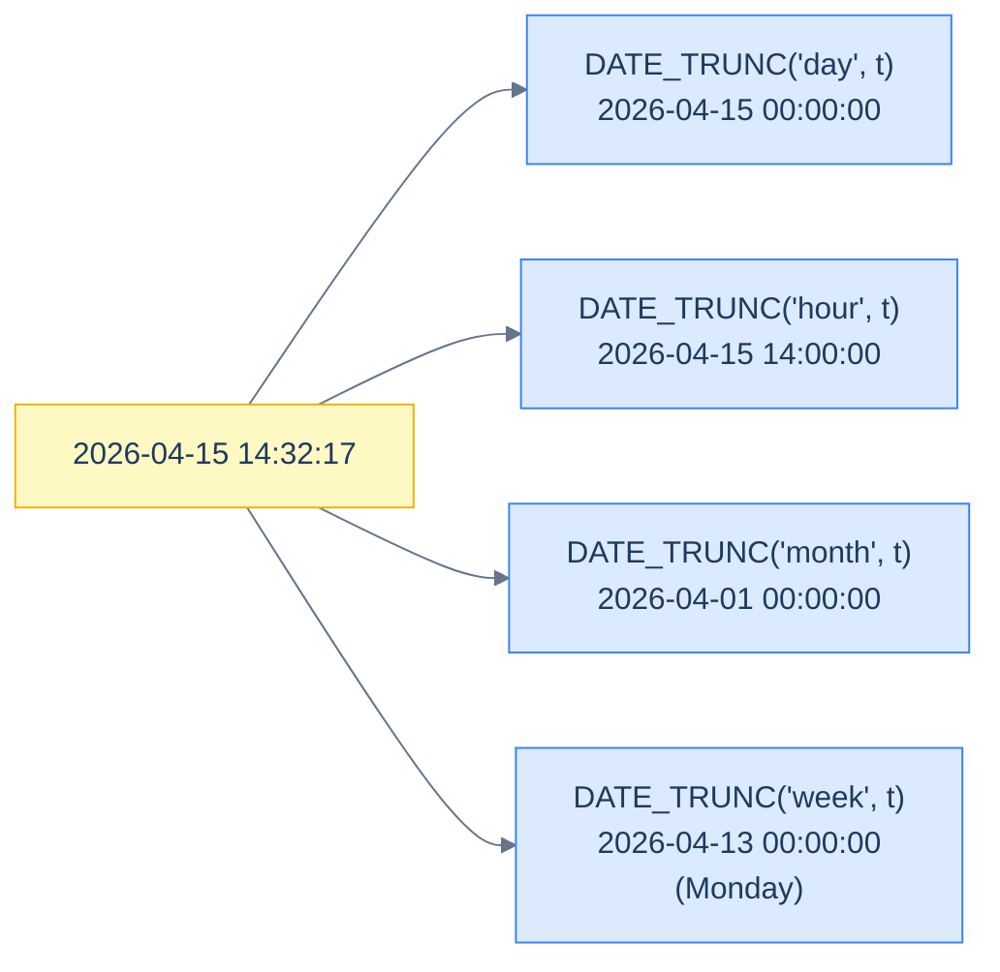

# 1. Dates and Times

## The Hook

A morning report job runs at 7:00 a.m. UTC: "yesterday's events." The query:

```sql
SELECT COUNT(*) FROM hello_events
WHERE order_date = CURRENT_DATE - 1;
```

The CEO is in San Francisco (UTC-8). At 7:00 a.m. UTC it's 11:00 p.m. *the previous day* in SF. The CEO opens the report at 8:00 a.m. SF time (16:00 UTC) — and sees yesterday's number, *not today's*, because the cutoff was 24 hours ago in UTC, but only 16 hours ago in their local time.

A different morning, a London engineer runs the same query at 9:00 a.m. local. The DST shift just happened: London is now UTC+1. The query sees `CURRENT_DATE - 1` in *server time* (UTC) and returns events between two UTC midnights — but the CEO's "yesterday" was British civil yesterday, an hour shifted. Off-by-an-hour for the day after every DST change. Fall and spring bring monthly bug reports.

Date and time SQL is *almost always* timezone bugs. The semantics of "what day is it?" depends on whose clock you're asking. The trap is that SQL's `CURRENT_DATE`, `NOW()`, `DATE '2026-04-15'`, and date arithmetic all *look* clock-agnostic but actually depend on the session's timezone setting — which is set by your client's connection, not the server. Get one of those wrong and your daily report is silently shifted by hours.

This chapter is about parsing, formatting, truncating, and arithmetic on temporal values — and the explicit-timezone discipline that makes those operations correct in production. By the end you'll know when to use `TIMESTAMP` vs `TIMESTAMPTZ`, why `DATE_TRUNC` is more reliable than string manipulation, and how to write a "yesterday's" query that returns the same answer regardless of where the user is sitting.

---

## Table of contents

1. [Date and time types](#date-and-time-types)
2. [Date and time literals](#date-and-time-literals)
3. [Current date / time functions](#current-date-time-functions)
4. [`DATE_TRUNC` and `EXTRACT`](#date_trunc-and-extract)
5. [Date arithmetic and `INTERVAL`](#date-arithmetic-and-interval)
6. [Parsing and formatting](#parsing-and-formatting)
7. [Timezones and `TIMESTAMPTZ`](#timezones-and-timestamptz)
8. [Edge cases and pitfalls](#edge-cases-and-pitfalls)
9. [Production reality](#production-reality)
10. [Practice ladder](#practice-ladder)
11. [Cross-links](#cross-links)
12. [Final takeaway](#final-takeaway)

***

# Date and time types

From [Data Definition](/cortex/languages/sql/foundations/data-definition#column-types):

| Type | What it is | Storage |
|---|---|---|
| `DATE` | Calendar date, no time | 4 bytes (days since epoch) |
| `TIME` | Time of day, no date | 8 bytes |
| `TIMESTAMP` | Date + time, **no** timezone | 8 bytes |
| `TIMESTAMPTZ` (`TIMESTAMP WITH TIME ZONE`) | Date + time, normalised to UTC | 8 bytes |
| `INTERVAL` | A duration | 16 bytes |

**The single most consequential decision: `TIMESTAMP` vs `TIMESTAMPTZ`.**

- `TIMESTAMP` (without time zone): just stores the literal year-month-day-hour-minute-second. *No timezone awareness.* "What time is it on the wall clock at the location implied by your business logic?" If the business logic doesn't have one location, this type is a footgun.
- `TIMESTAMPTZ` (with time zone): stores the *moment* (UTC internally), with conversion to/from the session's timezone on input and output. "When did this happen, irrespective of where you're sitting?" Almost always the right type for application data.

The advice: **default to `TIMESTAMPTZ` for any column representing "when something happened."** `TIMESTAMP` is for niche cases like calendar entries that should always read "9:00 AM in whatever timezone the user is currently in" — and those are rare.

> **Dialect note:** SQLite has no native date/time type. It stores dates as TEXT (`'2026-04-15'`), REAL (Julian day numbers), or INTEGER (Unix epoch). Date functions parse the storage form. **Use ISO-8601 TEXT** (`'2026-04-15'`, `'2026-04-15 14:30:00'`) — sortable as strings, parseable by every date function. The runnable blocks in this chapter use that convention.

---

# Date and time literals

```sql run
SELECT
  DATE '2026-04-15'                       AS d,
  TIME '14:30:00'                         AS t,
  TIMESTAMP '2026-04-15 14:30:00'         AS ts,
  TIMESTAMP '2026-04-15 14:30:00+02:00'   AS ts_with_tz,
  INTERVAL '1 day'                        AS one_day,
  INTERVAL '2 hours 30 minutes'           AS interval_complex;
```

The standard literal form is `<TYPE> 'string'`. Postgres also accepts string literals with implicit casting in many contexts. Use the explicit form (`DATE '2026-04-15'`) in shipped code — it documents the type and prevents implicit-cast surprises.

> **Date format:** Always use **ISO-8601** (`'YYYY-MM-DD'`). Other formats (`'04/15/2026'`, `'15-Apr-2026'`) are dialect-specific, locale-dependent, and ambiguous (`'04/15/2026'` vs `'15/04/2026'` is a flame war). ISO-8601 is unambiguous, sorts lexicographically, and parses everywhere.

---

# Current date / time functions

```sql
-- Postgres / standard SQL
SELECT
  CURRENT_DATE,            -- 2026-05-10 (the date in session's timezone)
  CURRENT_TIME,            -- 14:30:00+00:00 (the time in session's TZ)
  CURRENT_TIMESTAMP,       -- 2026-05-10 14:30:00+00:00
  NOW();                   -- same as CURRENT_TIMESTAMP

-- SQLite
SELECT date('now'), datetime('now'), strftime('%Y-%m-%d %H:%M:%S', 'now');
```

A subtle but important note: **`CURRENT_DATE` and `NOW()` are evaluated *once per statement*, not once per row**. Inside a long-running query they're constant. Inside a transaction, they're constant for the transaction (Postgres-specific behaviour with `CURRENT_TIMESTAMP`).

For "now-ish, but please re-evaluate per row," Postgres has `CLOCK_TIMESTAMP()` which fires on each call — useful for detailed logging within stored procedures, almost never needed in application queries.

---

# `DATE_TRUNC` and `EXTRACT`

The two workhorses of analytics SQL.

`DATE_TRUNC('unit', timestamp)` rounds a timestamp **down** to the nearest start of the unit:



<p align="center"><strong>DATE_TRUNC rounds down to the nearest unit boundary. The same input timestamp produces different bucket-starts depending on the unit. Group by the trunc'd value for time-bucketing.</strong></p>

```sql run
-- Postgres / SQLite via strftime workaround. Showing Postgres-canonical syntax.
-- Run in psql against codefolio's Postgres for accurate results.
-- SQLite alternative: strftime('%Y-%m-%d', timestamp_str) for day-truncation.

-- Postgres:
-- SELECT DATE_TRUNC('day',  TIMESTAMP '2026-04-15 14:30:00');  → 2026-04-15 00:00:00
-- SELECT DATE_TRUNC('hour', TIMESTAMP '2026-04-15 14:30:00');  → 2026-04-15 14:00:00
-- SELECT DATE_TRUNC('week', TIMESTAMP '2026-04-15 14:30:00');  → 2026-04-13 00:00:00 (Monday)
-- SELECT DATE_TRUNC('month',TIMESTAMP '2026-04-15 14:30:00');  → 2026-04-01 00:00:00

-- SQLite portable form: extract the prefix you want.
SELECT
  SUBSTR('2026-04-15 14:30:00', 1, 10)  AS day_prefix,        -- '2026-04-15'
  SUBSTR('2026-04-15 14:30:00', 1, 13)  AS hour_prefix,       -- '2026-04-15 14'
  SUBSTR('2026-04-15 14:30:00', 1, 7)   AS month_prefix;      -- '2026-04'
```

`DATE_TRUNC` is the right tool for **time bucketing** in analytics queries — group events by hour, day, week, month, etc. Each bucket is the truncated start of the period. The Postgres version handles month/quarter/year-to-date correctly for any input.

`EXTRACT(field FROM timestamp)` pulls a numeric component out:

```sql run
-- Postgres equivalents:
-- SELECT EXTRACT(YEAR  FROM TIMESTAMP '2026-04-15 14:30:00');  → 2026
-- SELECT EXTRACT(MONTH FROM TIMESTAMP '2026-04-15 14:30:00');  → 4
-- SELECT EXTRACT(DAY   FROM TIMESTAMP '2026-04-15 14:30:00');  → 15
-- SELECT EXTRACT(HOUR  FROM TIMESTAMP '2026-04-15 14:30:00');  → 14
-- SELECT EXTRACT(DOW   FROM TIMESTAMP '2026-04-15 14:30:00');  → 3 (Wednesday)
-- SELECT EXTRACT(EPOCH FROM TIMESTAMP '2026-04-15 14:30:00');  → 1776284200 (Unix seconds)

-- SQLite portable form: strftime
SELECT
  CAST(strftime('%Y', '2026-04-15 14:30:00') AS INT)  AS yr,    -- 2026
  CAST(strftime('%m', '2026-04-15 14:30:00') AS INT)  AS mo,    -- 4
  CAST(strftime('%d', '2026-04-15 14:30:00') AS INT)  AS dy,    -- 15
  CAST(strftime('%H', '2026-04-15 14:30:00') AS INT)  AS hr,    -- 14
  CAST(strftime('%w', '2026-04-15 14:30:00') AS INT)  AS dow;   -- 3
```

`EXTRACT(EPOCH FROM ts)` returns Unix seconds — useful when bridging SQL to systems that use epoch timestamps (like codefolio's `hello_events.timestamp_ms`). To go the other way, `TO_TIMESTAMP(epoch_seconds)` (Postgres).

---

# Date arithmetic and INTERVAL

You can add and subtract `INTERVAL`s to/from timestamps:

```sql run
-- Postgres syntax (most commonly seen in production):
-- SELECT TIMESTAMP '2026-04-15' + INTERVAL '1 day';        → 2026-04-16 00:00:00
-- SELECT CURRENT_DATE - INTERVAL '7 days';                 → a week ago
-- SELECT TIMESTAMP '2026-04-15' + INTERVAL '2 hours 30 minutes';

-- SQLite portable form: date('now', '-7 days') / datetime('now', '+2 hours')
SELECT
  date('2026-04-15', '+1 day')      AS plus_one_day,
  date('now', '-7 days')            AS week_ago,
  datetime('2026-04-15 14:30:00', '+2 hours', '+30 minutes') AS plus_2h30m;
```

The difference of two timestamps is an `INTERVAL`:

```sql
-- Postgres:
-- SELECT NOW() - last_login AS time_since_login FROM users;
-- Returns INTERVAL like '3 days 12:30:00'.

-- To get a single number (seconds), use EXTRACT(EPOCH FROM interval):
-- SELECT EXTRACT(EPOCH FROM (NOW() - last_login)) / 3600 AS hours_since_login;
```

`AGE(a, b)` (Postgres) returns the calendar-aware interval — "3 years 2 months" rather than just a duration in seconds. Useful for human-readable "user has been a member for X" output.

---

# Parsing and formatting

`TO_CHAR(timestamp, format)` (Postgres) formats a timestamp as a string:

```sql
-- Postgres
SELECT TO_CHAR(NOW(), 'YYYY-MM-DD HH24:MI:SS');           -- '2026-05-10 14:30:00'
SELECT TO_CHAR(NOW(), 'Day, DD Mon YYYY');                -- 'Sunday  , 10 May 2026'
```

`TO_DATE(string, format)` and `TO_TIMESTAMP(string, format)` parse strings into temporal types. Useful when ingesting data from CSVs or external APIs whose date strings aren't ISO-8601.

```sql
-- Postgres
SELECT TO_DATE('15/04/2026', 'DD/MM/YYYY');               -- 2026-04-15
SELECT TO_TIMESTAMP('Apr 15, 2026 2:30 PM', 'Mon DD, YYYY HH12:MI AM');
```

> **Dialect note:** MySQL uses `STR_TO_DATE(string, format)` and `DATE_FORMAT(timestamp, format)` with different format strings. SQLite uses `strftime` for both directions. Always check your dialect's format-string conventions.

For **modern code, prefer ISO-8601 throughout** and rely on direct casting (`CAST('2026-04-15' AS DATE)`). Save the format strings for when you genuinely have to parse non-ISO data.

---

# Timezones and TIMESTAMPTZ

The full story is its own rabbit hole; the executive summary:

1. **`TIMESTAMPTZ` stores UTC internally.** When you `INSERT TIMESTAMP '2026-04-15 14:30:00+02:00'` into a `TIMESTAMPTZ` column, Postgres converts it to UTC (`'2026-04-15 12:30:00+00:00'`) and stores that. On `SELECT`, it converts back to the session's `TIMEZONE` setting.

2. **Set `TIMEZONE` in the session if it matters.** Postgres lets you `SET TIMEZONE = 'UTC'` (or any IANA zone) per session. Your application's connection string typically does this; ORMs do it automatically. When in doubt, query `SHOW timezone;`.

3. **`AT TIME ZONE 'zone'` converts on demand.** To get "what time is this UTC moment in New York":
   ```sql
   SELECT TIMESTAMP WITH TIME ZONE '2026-04-15 14:30:00+00' AT TIME ZONE 'America/New_York';
   -- → 2026-04-15 10:30:00 (the local New York time at that UTC moment)
   ```

4. **`TIMESTAMP` (without TZ) is a footgun.** It stores literal numbers with no timezone interpretation, so `TIMESTAMP '2026-04-15 14:30:00'` means "14:30 in *some* timezone, ask the application." Two systems writing to the same column with different assumptions produce inconsistent data, silently. **Default to `TIMESTAMPTZ` unless you have a clear product reason not to.**

5. **DST is the gnarly edge case.** "1 day after spring-forward" is *not* always 24 hours — it's 23 in the spring-forward zone. `INTERVAL '1 day'` adds one calendar day (cross-DST aware). `INTERVAL '24 hours'` adds 86,400 seconds (raw duration). Pick the one that matches your business question.

The chapter's hook bug — "yesterday in UTC vs yesterday in SF" — is fixed by **doing the comparison in the correct timezone**:

```sql
-- ❌ Server-timezone-dependent.
WHERE created_at >= CURRENT_DATE - 1
  AND created_at <  CURRENT_DATE;

-- ✅ Explicit user-relative.
WHERE created_at >= (CURRENT_TIMESTAMP AT TIME ZONE 'America/Los_Angeles')::DATE - 1
  AND created_at <  (CURRENT_TIMESTAMP AT TIME ZONE 'America/Los_Angeles')::DATE;
```

Or — preferably — store the user's preferred timezone with their account, and compute the boundaries against that.

---

# Edge cases and pitfalls

## The DST shift

Twice a year (in countries that observe DST), one day has 23 or 25 hours. `INTERVAL '1 day'` advances the calendar date; `INTERVAL '24 hours'` advances the wall-clock by 24 hours. They differ on DST days.

## Leap seconds

Some years have a leap second inserted (or removed) — typically at midnight UTC on June 30 or December 31. Most database engines hide this; some surface it as `60` seconds in a minute. Rare but possible source of "this minute had 61 seconds" bugs.

## Year 2038 problem

A 32-bit Unix timestamp overflows on January 19, 2038, 03:14:07 UTC. If you've stored timestamps as `INTEGER` Unix seconds, they wrap around. Use `BIGINT` (which buys you ~292 billion years of headroom) or native `TIMESTAMPTZ`.

## Interval comparisons

```sql
SELECT INTERVAL '1 month' = INTERVAL '30 days';
-- Postgres: false. (1 month is calendar-aware; 30 days is not.)
```

`INTERVAL` arithmetic preserves the *unit* — "1 month" added to Jan 31 is Feb 28 (or 29), not Mar 3. Mostly DWIM, but double-check edge cases around month boundaries.

## NULL date arithmetic

`NULL + INTERVAL '1 day'` is `NULL`. `NULL - DATE '2026-04-15'` is `NULL`. The standard NULL propagation rules apply.

## SQLite has no real timezone support

SQLite's date functions accept timezone modifiers (`'utc'`, `'localtime'`) but don't store timezone info with values. For real timezone-correct work in SQLite, the application layer normalises everything to UTC strings before storing.

---

# Production reality

Codefolio's `hello_events.timestamp_ms` column is `BIGINT` — milliseconds since Unix epoch. That's a deliberate choice: it's portable across SQL/NoSQL/JS, sorts correctly as integers, and avoids timezone ambiguity at the storage layer. The interpretation as a wall-clock time happens at display.

A typical "events per hour" rollup from this column:

```sql
-- Postgres-flavour: convert ms → timestamp, truncate to hour, count.
SELECT DATE_TRUNC('hour', TO_TIMESTAMP(timestamp_ms / 1000.0)) AS hour,
       COUNT(*) AS events
FROM hello_events
WHERE timestamp_ms >= EXTRACT(EPOCH FROM NOW() - INTERVAL '24 hours') * 1000
GROUP BY hour
ORDER BY hour;
```

Three operations:

1. `TO_TIMESTAMP(timestamp_ms / 1000.0)` — convert ms-since-epoch to a Postgres `TIMESTAMPTZ`.
2. `DATE_TRUNC('hour', ...)` — bucket per hour.
3. `EXTRACT(EPOCH FROM NOW() - INTERVAL '24 hours') * 1000` — compute "24 hours ago as ms-since-epoch" for the filter.

The output is one row per hour over the last day. The exact same query produces the same answer regardless of where the user is sitting, because it operates entirely in UTC.

For *display*, the consumer might want hour buckets in the user's local time. That's a presentation-layer concern — `AT TIME ZONE` for the conversion, format with `TO_CHAR`. Keep the storage and aggregation in UTC; convert at the boundary.

---

# Practice ladder

Use codefolio's Postgres for full date-function support. The runnable blocks below use SQLite-compatible syntax where possible.

1. **Today's date.** *Hint: `CURRENT_DATE`.*
2. **The first day of the current month.** *Hint: Postgres `DATE_TRUNC('month', CURRENT_DATE)`. SQLite: `date('now', 'start of month')`.*
3. **The number of days between two dates.** *Hint: subtract them. Postgres returns an integer for `DATE - DATE`. SQLite: `julianday(d2) - julianday(d1)`.*
4. **Events from the last 24 hours.** *Hint: `WHERE timestamp_ms >= EXTRACT(EPOCH FROM NOW() - INTERVAL '24 hours') * 1000`.*
5. **What's the difference between `INTERVAL '1 day'` and `INTERVAL '24 hours'`?** *Hint: DST awareness.*
6. **Why might "yesterday's events" return different counts depending on the server's timezone?** *Hint: `CURRENT_DATE` is session-timezone-dependent.*
7. **Format a timestamp as `'YYYY-MM-DD HH24:MI'` in Postgres.** *Hint: `TO_CHAR(ts, 'YYYY-MM-DD HH24:MI')`.*

***

# Cross-links

- **Previous in this module:** [Numbers](/cortex/languages/sql/row-functions/numbers) — date arithmetic uses numeric helpers (`EXTRACT(EPOCH FROM ...)`, `EXTRACT(YEAR FROM ...)`).
- **Next in this module:** [NULL and Three-Valued Logic](/cortex/languages/sql/row-functions/null-and-three-valued-logic) — date columns are commonly nullable; the NULL trap matters here.
- **Forward reference:** [Window Functions: patterns](/cortex/languages/sql/window-functions/window-patterns) — sessionisation and gap-filling are date-arithmetic-heavy patterns.
- **Forward reference:** [Schema and Constraints](/cortex/languages/sql/index) — `TIMESTAMPTZ` vs `TIMESTAMP` is a schema decision; this chapter explains the difference, that chapter applies it.

***

# Final Takeaway

Dates and times are SQL's most timezone-bug-prone area. Three patterns to internalise:

1. **Default to `TIMESTAMPTZ` for "when did this happen" columns.** It stores the moment unambiguously and converts on display. `TIMESTAMP` (without TZ) is a footgun for application data.
2. **`DATE_TRUNC` for time bucketing, `EXTRACT` for component access, `INTERVAL` for arithmetic.** That trio handles 90% of analytics-shaped date work. Reach for string manipulation only when you're stuck in a dialect that doesn't have these.
3. **Compute time windows in the timezone that matters to the consumer, not the server.** "Yesterday" is timezone-relative. Store in UTC, query in UTC, convert to the user's timezone *only at the display layer* (or compute boundaries explicitly with `AT TIME ZONE`).

Master these three and date/time SQL stops being the silent source of "the report is one hour off after every DST change."

## Your Turn

Before you move on, check your understanding with the coach — explain the idea, apply it, weigh the trade-offs, then defend your reasoning.

<div class="concept-coach"></div>
