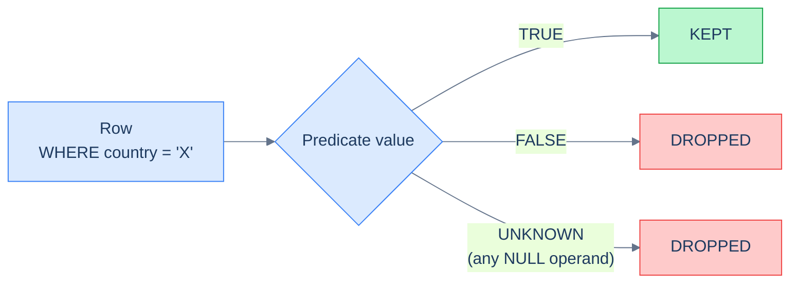

# 1. NULL and Three-Valued Logic

## The Hook

A "users with no last_login" query for a churn-warning dashboard:

```sql
SELECT id, email FROM users WHERE last_login != CURRENT_DATE - INTERVAL '90 days';
```

The query is supposed to find users whose `last_login` is *anything other than* "exactly 90 days ago" — i.e., everybody whose last login wasn't on that one day. Most users (3 million out of 3.1 million) should match.

The query returns 100,000 rows. Most users are missing.

The bug is `NULL`. `last_login` is nullable; users who never logged in have `NULL`. `NULL != CURRENT_DATE - 90` is **`UNKNOWN`**, not `TRUE`. `WHERE` drops `UNKNOWN` rows. So the 3,000,000 users with `NULL last_login` *all silently disappear* — exactly the people the churn dashboard most needs to surface.

Every working SQL engineer has written this bug at least once. The chapter on [Filtering](/cortex/languages/sql/foundations/filtering#the-null-trap) introduced the rule: NULL comparisons return `UNKNOWN`, and `WHERE` treats `UNKNOWN` as a drop. This chapter is the deeper treatment — the truth tables behind every NULL behaviour, the four operators that handle NULLs explicitly, and the patterns that turn the three-valued logic from a footgun into a tool.

By the end you'll be able to read any predicate involving NULLs and predict its output; you'll know the difference between `IS DISTINCT FROM` and `<>`; you'll have the reflex to wrap nullable columns in `COALESCE` whenever a comparison would silently drop them.

---

## Table of contents

1. [Three values, not two](#three-values-not-two)
2. [Truth tables](#truth-tables)
3. [`IS NULL` and `IS NOT NULL`](#is-null)
4. [`COALESCE` — pick the first non-NULL](#coalesce)
5. [`NULLIF` — turn a sentinel into a real NULL](#nullif)
6. [`IS DISTINCT FROM` / `IS NOT DISTINCT FROM`](#is-distinct-from)
7. [Aggregates and NULL](#aggregates-and-null)
8. [Joins and NULL](#joins-and-null)
9. [Edge cases and pitfalls](#edge-cases-and-pitfalls)
10. [Production reality](#production-reality)
11. [Practice ladder](#practice-ladder)
12. [Cross-links](#cross-links)
13. [Final takeaway](#final-takeaway)

***

# Three values, not two

Boolean logic in most programming languages has two values: `TRUE` and `FALSE`. Every expression evaluates to one or the other.

SQL's logic has **three** values: `TRUE`, `FALSE`, and `UNKNOWN` (often displayed as `NULL`). The third is what makes SQL different.

**`UNKNOWN` is what you get when an expression involves an unknown operand.** Whenever any value in an expression is `NULL`, the result is generally `UNKNOWN`. The exceptions are tiny: `IS NULL`, `IS NOT NULL`, `IS DISTINCT FROM`, the COALESCE family — all carefully designed to give a definite `TRUE` or `FALSE` even when their inputs are `NULL`.

The single rule that explains every NULL bug:

> **`WHERE` (and `JOIN ... ON`, `HAVING`) keeps rows where the predicate is `TRUE`. `FALSE` and `UNKNOWN` both drop the row.**

Combine this with "NULL operations propagate NULL/UNKNOWN" and you have the entire mental model for NULL behaviour.

---

# Truth tables

The exact behaviour of `AND`, `OR`, `NOT` over the three values. Memorising these saves you from re-deriving the answer every time you hit a NULL bug.



<p align="center"><strong>WHERE drops rows where the predicate is FALSE <em>or</em> UNKNOWN. The asymmetry between intentional FALSE and silent UNKNOWN is where every NULL bug lives.</strong></p>

**`AND`:**

|  | TRUE | FALSE | UNKNOWN |
|---|---|---|---|
| **TRUE** | TRUE | FALSE | UNKNOWN |
| **FALSE** | FALSE | FALSE | FALSE |
| **UNKNOWN** | UNKNOWN | FALSE | UNKNOWN |

**`OR`:**

|  | TRUE | FALSE | UNKNOWN |
|---|---|---|---|
| **TRUE** | TRUE | TRUE | TRUE |
| **FALSE** | TRUE | FALSE | UNKNOWN |
| **UNKNOWN** | TRUE | UNKNOWN | UNKNOWN |

**`NOT`:**

| Input | Output |
|---|---|
| TRUE | FALSE |
| FALSE | TRUE |
| UNKNOWN | UNKNOWN |

The pattern in plain English:

- **`AND`**: `FALSE` "wins" — anything `AND FALSE` is `FALSE`. Otherwise `UNKNOWN` propagates.
- **`OR`**: `TRUE` "wins" — anything `OR TRUE` is `TRUE`. Otherwise `UNKNOWN` propagates.
- **`NOT`**: flips `TRUE`/`FALSE`, **leaves `UNKNOWN` alone**.

That last cell — `NOT UNKNOWN = UNKNOWN`, *not* `TRUE` — is the trap. "Not equal to Germany" is `UNKNOWN` for a NULL-country row, not `TRUE`. So `WHERE country != 'Germany'` drops the NULL rows. Same with `WHERE NOT (country = 'Germany')`.

---

# IS NULL and IS NOT NULL

The only operators that **always** return `TRUE` or `FALSE` (never `UNKNOWN`) when applied to nullable values:

```sql run
CREATE TABLE customers (id INT, first_name TEXT, country TEXT);
INSERT INTO customers VALUES (1,'Maria','Germany'),(2,'John','USA'),(3,'Lisa',NULL),(4,'Sam',NULL);

-- IS NULL: only matches rows where country is NULL.
SELECT first_name FROM customers WHERE country IS NULL;
```

```sql run
CREATE TABLE customers (id INT, first_name TEXT, country TEXT);
INSERT INTO customers VALUES (1,'Maria','Germany'),(2,'John','USA'),(3,'Lisa',NULL),(4,'Sam',NULL);

-- IS NOT NULL: matches rows where country is anything other than NULL.
SELECT first_name FROM customers WHERE country IS NOT NULL;
```

These are not value comparisons — they're *type-test predicates*. `country IS NULL` doesn't ask "is the value equal to some specific NULL value?" — it asks "does the row have *no value* in the country column?". That's a definite question with a definite yes/no answer.

`IS [NOT] NULL` is the **only correct way** to test for NULL. Never use `= NULL` or `<> NULL` — both always return `UNKNOWN`, no matter what the column contains.

---

# COALESCE

`COALESCE(a, b, c, ...)` returns the **first non-NULL argument**. Returns `NULL` only if all arguments are `NULL`.

```sql run
SELECT
  COALESCE(NULL, 'fallback')             AS one_fallback,    -- 'fallback'
  COALESCE('hello', 'fallback')          AS no_fallback_needed, -- 'hello'
  COALESCE(NULL, NULL, NULL, 0)          AS deep_chain,       -- 0
  COALESCE(NULL, NULL)                   AS all_null;         -- NULL
```

The canonical use: substitute a default for a NULL.

```sql run
CREATE TABLE customers (id INT, first_name TEXT, country TEXT);
INSERT INTO customers VALUES (1,'Maria','Germany'),(2,'Lisa',NULL);

-- Without COALESCE, NULL country would propagate through the concatenation.
SELECT first_name || ' from ' || COALESCE(country, 'somewhere unknown') AS bio
FROM customers;
```

`COALESCE` is the workhorse. Use it whenever:

- You want a concatenation to not vanish when a part is NULL.
- You want a default for an aggregation that could be NULL (e.g., `COALESCE(SUM(sales), 0)`).
- You want to compare against a value that "stands in" for NULL (`WHERE COALESCE(country, '') = ''` matches both NULL and empty-string countries).

`COALESCE` is **standard SQL** and supported everywhere. (`IFNULL(a, b)` is a MySQL/SQLite shorthand for the two-argument case; `NVL(a, b)` is Oracle's version. `COALESCE` is portable.)

---

# NULLIF

`NULLIF(a, b)` returns `NULL` if `a = b`, else returns `a`. The mirror of `COALESCE`.

```sql run
SELECT
  NULLIF(0, 0)              AS zeros_to_null,        -- NULL
  NULLIF('N/A', 'N/A')      AS sentinel_to_null,     -- NULL
  NULLIF(5, 0)              AS preserved;            -- 5
```

The canonical use: **safe divide**.

```sql run
CREATE TABLE products (id INT, revenue INT, units_sold INT);
INSERT INTO products VALUES (1, 1000, 50), (2, 800, 0), (3, 1200, 30);

-- Average price per unit. NULLIF protects against the zero-units row.
SELECT id, revenue, units_sold,
       revenue * 1.0 / NULLIF(units_sold, 0) AS price_per_unit
FROM products;
```

For product 2 (units_sold = 0), `NULLIF(0, 0)` is `NULL`, so the division is `revenue / NULL = NULL`. No "division by zero" error — just a sensible NULL output that downstream consumers can handle.

The other use: turn sentinel values into real NULLs. Legacy data sometimes uses `'N/A'`, `''`, or `-1` to mean "missing." `NULLIF(legacy_col, 'N/A')` converts those sentinels to real NULLs at read time.

---

# IS DISTINCT FROM

The "null-safe equality" operator. Treats NULL as just another value:

```sql run
SELECT
  NULL = NULL                 AS std_eq,            -- NULL (UNKNOWN)
  NULL IS NOT DISTINCT FROM NULL AS distinct_eq,    -- TRUE
  1 IS DISTINCT FROM NULL     AS distinct_neq,      -- TRUE
  1 IS DISTINCT FROM 1        AS same_value;        -- FALSE
```

`a IS NOT DISTINCT FROM b`: like `a = b`, but NULL is treated as equal to itself.
`a IS DISTINCT FROM b`: like `a <> b`, but NULL is treated as different from any non-NULL value (and equal to NULL).

Use cases:

```sql
-- "Show me rows where the country changed" — including NULL→non-NULL transitions.
SELECT * FROM audit
WHERE old_country IS DISTINCT FROM new_country;
```

Standard `<>` would silently miss NULL→Germany transitions. `IS DISTINCT FROM` catches them.

> **Dialect note:** `IS DISTINCT FROM` is standard SQL and supported by Postgres, SQLite, SQL Server (since 2012). MySQL has the equivalent `<=>` operator (the "spaceship" operator) for `IS NOT DISTINCT FROM`. Other engines have varying support — check the docs.

---

# Aggregates and NULL

A reminder from [Aggregate Functions](/cortex/languages/sql/aggregation/aggregate-functions#null-behaviour): aggregates **silently exclude NULLs** (with `COUNT(*)` as the exception).

| Aggregate | NULL handling |
|---|---|
| `COUNT(*)` | counts all rows including NULLs |
| `COUNT(col)` | counts only non-NULL values |
| `SUM`/`AVG`/`MIN`/`MAX` | ignores NULLs in input |
| Empty input | All except `COUNT` return `NULL` |

The often-surprising consequences:

- `AVG(score)` on a column with NULLs is `SUM(non-null) / COUNT(non-null)` — **not** `SUM(non-null) / COUNT(*)`. If you wanted NULLs to count as zero, use `AVG(COALESCE(score, 0))`.
- `SUM(sales)` over an empty result is `NULL`, not `0`. Wrap in `COALESCE(SUM(sales), 0)` for safety.
- `MIN(date)` over a column with NULLs returns the earliest non-NULL. Use `MIN(COALESCE(date, 'infinity'))` or `MIN(date) FILTER (WHERE date IS NOT NULL)` for explicit handling.

---

# Joins and NULL

`JOIN ... ON a.x = b.y` does *not* match rows where either side is NULL. Same NULL trap applied to a join condition. To deliberately match NULL on both sides, use `IS NOT DISTINCT FROM`:

```sql
JOIN ... ON a.x IS NOT DISTINCT FROM b.y
```

But this is rare in practice — usually NULL in a foreign-key column means "no relationship," and you don't want to match it against another NULL "no relationship" on the other side. Two "no relationships" aren't equivalent; they're both *missing*.

`LEFT JOIN` produces NULLs in the right-side columns when there's no match. `WHERE right_col IS NULL` is the standard "anti-join" pattern (covered in [Anti-joins](/cortex/languages/sql/multiple-tables/anti-joins-and-existence)).

The trap: a `WHERE right_col = ...` predicate after a `LEFT JOIN` silently turns it into an `INNER JOIN` (also covered in [Joins](/cortex/languages/sql/multiple-tables/joins#on-vs-where)). The fix: put the inner-side filter in `ON`, not `WHERE`.

---

# Edge cases and pitfalls

## NULL ordering

`ORDER BY` has to put NULLs *somewhere*. Default is dialect-specific (Postgres puts NULLs last for `ASC`, first for `DESC`; SQL Server / MySQL go the other way). **Always specify `NULLS FIRST` or `NULLS LAST` for deterministic output.** (Covered in [Ordering and Pagination](/cortex/languages/sql/foundations/ordering-and-pagination#nulls-ordering).)

## NULL in `IN` and `NOT IN`

```sql
SELECT * FROM customers WHERE id IN (1, 2, NULL);     -- NULL doesn't match anything; returns 1, 2
SELECT * FROM customers WHERE id NOT IN (1, 2, NULL); -- TREACHEROUS: returns ZERO rows.
```

`NOT IN` against a list with NULL is the famous bug from [Filtering](/cortex/languages/sql/foundations/filtering#set-membership). Use `NOT EXISTS` instead.

## NULL in unique constraints

`UNIQUE` allows multiple NULLs in standard SQL — because `NULL = NULL` is `UNKNOWN`, no two NULLs are "the same value." Postgres 15+ has `UNIQUE NULLS NOT DISTINCT` for the alternative semantics.

## NULL in GROUP BY

`GROUP BY` treats NULL as a group of its own. All NULL rows collapse into one group with NULL as the group key.

## CHECK constraints don't reject NULL

`CHECK (score >= 0)` allows NULL — the predicate is `UNKNOWN` for NULL, and `CHECK` only rejects rows where the predicate is `FALSE`. To require non-NULL, add `NOT NULL` separately.

## CASE and NULL

```sql
SELECT
  CASE WHEN score IS NULL THEN 'unknown' ELSE 'known' END
FROM customers;

-- vs (broken):
SELECT
  CASE WHEN score = NULL THEN 'unknown' ELSE 'known' END
-- Returns 'known' for everyone — score = NULL is UNKNOWN, never TRUE.
```

`CASE WHEN x = NULL` is a common bug. Use `CASE WHEN x IS NULL` instead.

---

# Production reality

The chapter's hook bug is a real one — every churn dashboard has it once. The defensive pattern is to **explicitly handle NULL at every comparison**:

```sql
-- Safe "users who haven't logged in for 90 days, including never-logged-in users."
SELECT id, email
FROM users
WHERE COALESCE(last_login, DATE '1900-01-01') < CURRENT_DATE - INTERVAL '90 days';
```

`COALESCE(last_login, '1900-01-01')` substitutes a far-past date for never-logged-in users — they're now eligible for the comparison and get included.

A second pattern — **null-safe joins for slowly-changing dimensions**:

```sql
SELECT *
FROM orders o
JOIN dim_customer dc
  ON dc.customer_id = o.customer_id
 AND dc.valid_from <= o.order_date
 AND (dc.valid_to IS NULL OR dc.valid_to > o.order_date);
```

`dc.valid_to IS NULL` represents "currently valid" in a temporal-dimension table. The `OR ... IS NULL` is essential — without it, currently-valid rows get dropped because `NULL > o.order_date` is `UNKNOWN`.

A third — **NUMERIC defaults for empty windows**:

```sql
-- Daily summary: events count and average per hour. COALESCE protects empty hours.
SELECT
  hour_bucket,
  COALESCE(COUNT(*), 0)            AS events,
  COALESCE(AVG(visits), 0)         AS avg_visits
FROM (
  SELECT generate_series(
    DATE_TRUNC('hour', NOW() - INTERVAL '24 hours'),
    DATE_TRUNC('hour', NOW()),
    INTERVAL '1 hour'
  ) AS hour_bucket
) hours
LEFT JOIN hello_events e ON DATE_TRUNC('hour', TO_TIMESTAMP(e.timestamp_ms / 1000.0)) = hour_bucket
GROUP BY hour_bucket
ORDER BY hour_bucket;
```

`generate_series` (Postgres) creates a row per hour. `LEFT JOIN` matches actual events. Empty hours produce NULL aggregates, which `COALESCE` fixes to `0`. Without `COALESCE`, the dashboard chart has gaps; with it, every hour shows up.

---

# Practice ladder

1. **Find customers with NULL country.** *Hint: `IS NULL`.*
2. **Find customers whose country is anything other than NULL.** *Hint: `IS NOT NULL`.*
3. **Predict the result of:**
   ```sql
   SELECT * FROM customers WHERE country != 'Germany';
   ```
   *Hint: rows with NULL country are silently dropped.*
4. **Rewrite (3) to include NULL-country rows.** *Hint: `country IS DISTINCT FROM 'Germany'`. Or `WHERE country != 'Germany' OR country IS NULL`.*
5. **Average score across customers, treating NULL as 0.** *Hint: `AVG(COALESCE(score, 0))`.*
6. **Why does `SUM(sales)` return NULL on an empty result, and how do you fix it?** *Hint: `COALESCE(SUM(sales), 0)`.*
7. **Why does `WHERE NOT (country = 'Germany')` not match NULL-country rows?** *Hint: walk through the truth table. `NULL = 'Germany'` is `UNKNOWN`. `NOT UNKNOWN` is `UNKNOWN`. `WHERE` drops `UNKNOWN`.*
8. **Use `NULLIF` to safely compute average sales per order.** *Hint: `revenue * 1.0 / NULLIF(order_count, 0)`.*

***

# Cross-links

- **Previous in this module:** [Dates and Times](/cortex/languages/sql/row-functions/dates-and-times) — date columns are commonly nullable; this chapter's patterns apply.
- **Next in this module:** [CASE Expressions](/cortex/languages/sql/row-functions/case-expressions) — the if-else construct that lets you encode NULL handling explicitly inline.
- **Forward reference:** [Anti-joins and Existence](/cortex/languages/sql/multiple-tables/anti-joins-and-existence) — the `NOT EXISTS` pattern that's null-safe by construction.
- **Cited from many chapters:** [Filtering](/cortex/languages/sql/foundations/filtering), [Joins](/cortex/languages/sql/multiple-tables/joins), [Aggregate Functions](/cortex/languages/sql/aggregation/aggregate-functions). NULL is the cross-cutting concern that touches every operator.

***

# Final Takeaway

NULL is the one piece of SQL that surprises every engineer at least once. Three patterns to internalise:

1. **NULL is "unknown," not "missing." Comparisons return `UNKNOWN`, which `WHERE` drops.** The asymmetry between `FALSE` (deliberately rejected) and `UNKNOWN` (silently rejected) is where every NULL bug lives.
2. **Use `IS NULL`, `IS NOT NULL`, `IS DISTINCT FROM`, `COALESCE`, and `NULLIF` to handle NULL explicitly.** Each has its niche. The reflex to reach for one of them whenever a column might be nullable is the single biggest difference between a junior and a senior SQL writer.
3. **`NOT IN` against a subquery is the most common NULL bug.** The fix is `NOT EXISTS`, which is null-safe by construction. (Covered fully in [Anti-joins and Existence](/cortex/languages/sql/multiple-tables/anti-joins-and-existence).)

Master these three and NULL becomes a tool you wield deliberately, not a trap that catches you.

## Your Turn

Before you move on, check your understanding with the coach — explain the idea, apply it, weigh the trade-offs, then defend your reasoning.

<div class="concept-coach"></div>
