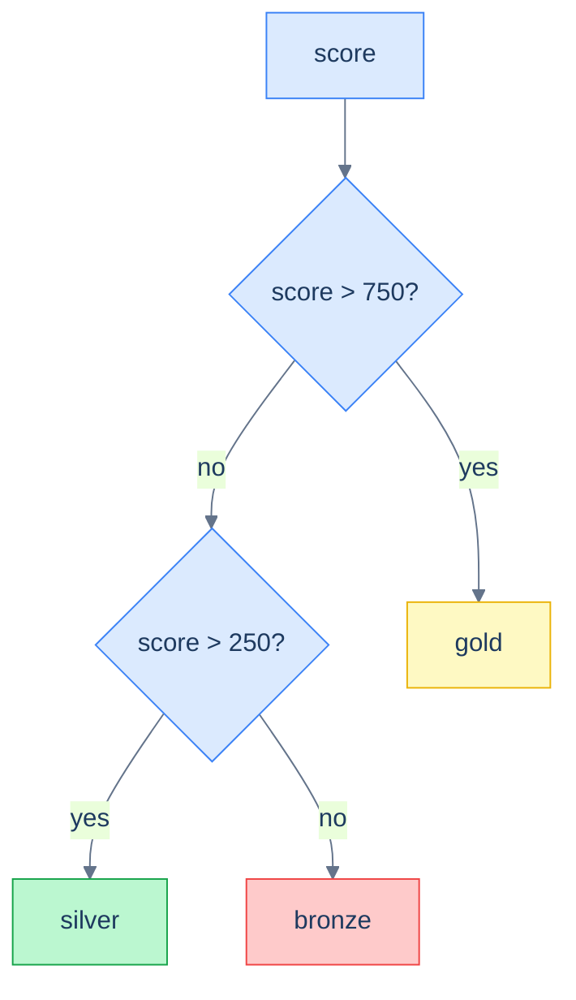

# 1. CASE Expressions

## The Hook

A finance dashboard wants per-customer billing tiers: Bronze (score < 250), Silver (250–750), Gold (> 750). The schema doesn't have a `tier` column; the rule is a business rule, not a stored value. So you compute it in the query:

```sql
SELECT first_name,
       score,
       CASE
         WHEN score > 750 THEN 'gold'
         WHEN score > 250 THEN 'silver'
         ELSE 'bronze'
       END AS tier
FROM customers;
```

That's a `CASE` expression — the SQL equivalent of an `if/elif/else` chain. It evaluates the `WHEN` clauses in order, returns the value of the first one whose condition is true, and falls through to `ELSE` if none match. One per row.

`CASE` is the most-used inline-conditional construct in SQL. It powers bucketing (this example), conditional aggregation (`SUM(CASE WHEN x THEN amount ELSE 0 END)`), pivoting (turning rows into columns), and *every* place where you'd write an if-else in a row-level computation. By the end of this chapter you'll know the two forms (`CASE WHEN` and `CASE col WHEN`), the niches each one fits, and the half-dozen idiomatic patterns that account for nearly every real-world `CASE` you'll write.

---

## Table of contents

1. [Two forms of `CASE`](#two-forms)
2. [Bucketing values](#bucketing-values)
3. [Conditional aggregation](#conditional-aggregation)
4. [Pivot — rows to columns](#pivot)
5. [Explicit NULL handling](#explicit-null-handling)
6. [`CASE` in `ORDER BY`](#case-in-order-by)
7. [`CASE` vs `COALESCE`/`NULLIF`](#case-vs-coalesce)
8. [Edge cases and pitfalls](#edge-cases-and-pitfalls)
9. [Production reality](#production-reality)
10. [Practice ladder](#practice-ladder)
11. [Cross-links](#cross-links)
12. [Final takeaway](#final-takeaway)

***

# Two forms

`CASE` has a "searched" form and a "simple" form.

**Searched form** — each `WHEN` is an arbitrary boolean expression:

```sql
CASE
  WHEN score > 750 THEN 'gold'
  WHEN score > 250 THEN 'silver'
  ELSE 'bronze'
END
```



<p align="center"><strong>CASE evaluates WHEN clauses top-to-bottom; the first match wins. Order from most-specific to least.</strong></p>

**Simple form** — each `WHEN` is a *value* compared for equality against the operand after `CASE`:

```sql
CASE country
  WHEN 'Germany' THEN 'EU'
  WHEN 'USA'     THEN 'NA'
  ELSE 'Other'
END
```

The simple form is shorthand for `CASE WHEN country = 'Germany' THEN 'EU' WHEN country = 'USA' THEN 'NA' ELSE 'Other' END`. It's only useful when every `WHEN` compares the same column for equality — which is fine for enum-style mapping but quickly limited.

**Use the searched form by default.** It's strictly more expressive, and the simple form's brevity rarely outweighs the consistency of writing one form throughout your codebase.

The semantics for both forms:

1. Evaluate `WHEN` clauses in order.
2. Return the value of the first whose condition is `TRUE`.
3. If none match and there's an `ELSE`, return its value.
4. If none match and there's no `ELSE`, return `NULL`.
5. The result type is the common type of all `THEN`/`ELSE` values (with implicit casting where the engine allows).

---

# Bucketing values

The chapter's hook example is the canonical bucketing pattern:

```sql run
CREATE TABLE customers (id INT, first_name TEXT, score INT);
INSERT INTO customers VALUES (1,'Maria',350),(2,'John',900),(3,'Georg',750),(4,'Martin',500),(5,'Peter',0);

SELECT first_name, score,
       CASE
         WHEN score >= 800 THEN 'high'
         WHEN score >= 400 THEN 'medium'
         ELSE 'low'
       END AS tier
FROM customers
ORDER BY score DESC;
```

The order of `WHEN` clauses matters: a row with `score = 850` matches the first `WHEN` (≥800) and stops. If you reversed them — `WHEN score >= 400 THEN 'medium' WHEN score >= 800 THEN 'high'` — every row with score ≥800 would also be ≥400, so the first `WHEN` would always win, and "high" would never appear. **Order from most-specific to least-specific** (or, equivalently, from highest threshold to lowest for `>` comparisons).

Bucketing with `CASE` is the *non-aggregate* sibling of `NTILE`/`PERCENT_RANK` (covered in [Window Functions: ranking](/cortex/languages/sql/window-functions/ranking)). Use `CASE` when the buckets are *defined* (gold/silver/bronze with hardcoded thresholds); use window functions when the buckets are *computed* from the data ("top quartile by score").

---

# Conditional aggregation

Every aggregate function can be combined with `CASE` to compute "per-group" or "per-condition" sums. The pattern:

```sql run
CREATE TABLE customers (id INT, first_name TEXT, country TEXT, score INT);
INSERT INTO customers VALUES (1,'Maria','Germany',350),(2,'John','USA',900),(3,'Georg','UK',750),(4,'Martin','Germany',500),(5,'Peter','USA',0);

-- One row of summary statistics combining counts of different conditions.
SELECT
  COUNT(*) AS total,
  COUNT(CASE WHEN score >= 750 THEN 1 END) AS high_count,
  COUNT(CASE WHEN country = 'Germany' THEN 1 END) AS german_count,
  SUM(CASE WHEN country = 'Germany' THEN score ELSE 0 END) AS german_total,
  AVG(CASE WHEN score > 0 THEN score END) AS avg_active   -- ELSE skipped → NULL → AVG ignores
FROM customers;
```

This pattern — multiple aggregates with embedded `CASE` — is the *portable* equivalent of the `FILTER` clause from [Aggregate Functions](/cortex/languages/sql/aggregation/aggregate-functions#filter-clause):

```sql
-- Same query, FILTER form (Postgres / SQLite ≥3.30):
SELECT
  COUNT(*) AS total,
  COUNT(*) FILTER (WHERE score >= 750) AS high_count,
  COUNT(*) FILTER (WHERE country = 'Germany') AS german_count,
  SUM(score) FILTER (WHERE country = 'Germany') AS german_total,
  AVG(score) FILTER (WHERE score > 0) AS avg_active
FROM customers;
```

Both produce the same results. `FILTER` is cleaner when available; `CASE` is portable to MySQL and older Postgres/SQLite.

The trick: **use `NULL` as the "skip" value**. `COUNT(NULL)` doesn't count, `SUM(NULL)` doesn't add, `AVG` ignores NULL. So `CASE WHEN condition THEN value END` (with no `ELSE`) returns `NULL` for non-matching rows, which the aggregate ignores.

For `SUM`, you typically want explicit `ELSE 0` (`SUM(CASE WHEN ... THEN x ELSE 0 END)`) — both work, but `ELSE 0` reads more clearly.

---

# Pivot

Turning rows into columns. Without dedicated `PIVOT` syntax, you use `CASE` + aggregate to spread one column's values across multiple output columns:

```sql run
CREATE TABLE customers (id INT, first_name TEXT, country TEXT);
INSERT INTO customers VALUES (1,'Maria','Germany'),(2,'John','USA'),(3,'Georg','UK'),(4,'Martin','Germany'),(5,'Peter','USA'),(6,'Alice','Germany');

-- Pivot: one row, three columns (one per country).
SELECT
  COUNT(CASE WHEN country = 'Germany' THEN 1 END) AS germany,
  COUNT(CASE WHEN country = 'USA'     THEN 1 END) AS usa,
  COUNT(CASE WHEN country = 'UK'      THEN 1 END) AS uk
FROM customers;
```

Three columns of counts, one per country, all computed in a single pass. The shape "rows of (country, count)" rotated to "columns of (country) × counts."

Add a grouping column to make it a 2D pivot:

```sql run
CREATE TABLE orders (order_id INT, customer_id INT, country TEXT, sales INT);
INSERT INTO orders VALUES (1001,1,'Germany',120),(1002,1,'Germany',80),(1003,2,'USA',450),(1004,3,'UK',200),(1005,4,'Germany',300);

-- One row per customer; columns = sales-by-country.
SELECT
  customer_id,
  SUM(CASE WHEN country = 'Germany' THEN sales ELSE 0 END) AS germany_sales,
  SUM(CASE WHEN country = 'USA'     THEN sales ELSE 0 END) AS usa_sales,
  SUM(CASE WHEN country = 'UK'      THEN sales ELSE 0 END) AS uk_sales
FROM orders
GROUP BY customer_id
ORDER BY customer_id;
```

Manual pivots have a cost: **the column list has to be hardcoded**. If a new country appears, the query doesn't pick up a column for it — you have to edit the SQL. For dynamic-column pivots, application code typically generates the SQL string, or the analytical engine has a `PIVOT` operator (SQL Server, Snowflake). Postgres has `crosstab` in the `tablefunc` extension. For most use-cases the hardcoded `CASE` form is fine and explicit.

---

# Explicit NULL handling

`CASE` is the right tool when the NULL handling is more than a single substitution:

```sql run
CREATE TABLE customers (id INT, first_name TEXT, country TEXT, score INT);
INSERT INTO customers VALUES (1,'Maria','Germany',350),(2,'John','USA',900),(3,'Lisa',NULL,NULL);

SELECT first_name,
       CASE
         WHEN country IS NULL AND score IS NULL THEN 'unknown'
         WHEN country IS NULL THEN 'country missing'
         WHEN score IS NULL THEN 'score missing'
         ELSE country || ' (' || score || ')'
       END AS status
FROM customers;
```

Three different NULL conditions, one combined "no-NULLs-anywhere" branch. `COALESCE` can't express this — it's a single-substitution; `CASE` can branch on multiple conditions.

Use `IS NULL` (not `= NULL`) inside `CASE WHEN` clauses, for the same reason as anywhere else.

---

# CASE in ORDER BY

Custom sort orders — when the natural ordering of a column doesn't match the business question:

```sql run
CREATE TABLE orders (order_id INT, status TEXT);
INSERT INTO orders VALUES (1,'pending'),(2,'completed'),(3,'cancelled'),(4,'pending'),(5,'completed');

-- Sort by a custom priority: pending first, then completed, then cancelled.
SELECT order_id, status
FROM orders
ORDER BY
  CASE status
    WHEN 'pending'   THEN 1
    WHEN 'completed' THEN 2
    WHEN 'cancelled' THEN 3
    ELSE 4
  END,
  order_id;
```

`CASE` returns an integer; `ORDER BY` sorts on it. This is how you express "alphabetical, except 'urgent' goes first" or "by status in this specific list order."

Don't confuse with `ORDER BY column ASC NULLS FIRST` for NULL-handling. `CASE`-in-`ORDER BY` is for *non-NULL* custom orderings.

---

# CASE vs COALESCE/NULLIF

These three are siblings; pick the one that matches the shape of the question:

| Want | Use |
|---|---|
| Substitute a single fallback for NULL | `COALESCE(col, fallback)` |
| Turn a sentinel value into NULL | `NULLIF(col, sentinel)` |
| Branch on multiple conditions | `CASE WHEN ... THEN ... END` |

```sql
-- Equivalent (single-substitution case):
COALESCE(country, 'unknown')
CASE WHEN country IS NULL THEN 'unknown' ELSE country END

-- COALESCE wins on brevity. CASE wins when the logic gets richer:
CASE
  WHEN country IS NULL THEN 'unknown'
  WHEN country = '' THEN 'blank'
  WHEN LENGTH(country) > 30 THEN 'too long: ' || LEFT(country, 27) || '...'
  ELSE country
END
```

`COALESCE` is two characters past `CASE WHEN ... IS NULL THEN ... ELSE ... END`. Reach for it for the simple substitution; reach for `CASE` when the logic branches.

---

# Edge cases and pitfalls

## Falling off the end without `ELSE` returns NULL

```sql
CASE WHEN x > 10 THEN 'big' END
```

For a row where `x = 5`, the result is `NULL`. If "small" is the right label for that case, write it: `ELSE 'small'`. If you genuinely want NULL, that's fine — but the explicit `ELSE NULL` (or just `ELSE` omitted) makes intent obvious.

## Type unification

All `THEN`/`ELSE` values must resolve to a common type:

```sql
-- Postgres: errors out — TEXT and INTEGER aren't unifiable.
CASE WHEN x > 0 THEN 'positive' ELSE 0 END

-- Fix: make them the same type.
CASE WHEN x > 0 THEN 'positive' ELSE '0' END
```

Implicit coercion sometimes saves you (Postgres will coerce `INT` to `NUMERIC` when one branch is each), but explicit types are safer.

## Order of WHEN clauses matters

```sql
-- ❌ Bug: the > 0 condition swallows everything above zero, so > 100 never triggers.
CASE
  WHEN x > 0 THEN 'positive'
  WHEN x > 100 THEN 'big'
  ELSE 'non-positive'
END

-- ✅
CASE
  WHEN x > 100 THEN 'big'
  WHEN x > 0 THEN 'positive'
  ELSE 'non-positive'
END
```

`WHEN` clauses are evaluated top-down, first match wins. Order from most-specific to least-specific.

## CASE WHEN x = NULL THEN ... never matches

The classic NULL bug, applied to `CASE`. Use `IS NULL`:

```sql
-- ❌ Always falls through to ELSE.
CASE WHEN country = NULL THEN 'unknown' ELSE country END

-- ✅
CASE WHEN country IS NULL THEN 'unknown' ELSE country END
```

This is exactly the same bug as `WHERE country = NULL`, just inside a `CASE`. Same fix.

## `CASE` is short-circuit

`CASE WHEN A THEN x WHEN B THEN y` does *not* evaluate `B` if `A` is true. Useful for guarded expressions:

```sql
-- Safe divide via CASE — divisor is never evaluated when zero.
CASE
  WHEN units = 0 THEN NULL
  ELSE revenue / units
END
```

Equivalent to the `NULLIF`-based safe-divide pattern.

---

# Production reality

The two most common production uses of `CASE`:

**(1) Conditional aggregation in dashboards.** Every executive summary has them:

```sql
SELECT
  DATE_TRUNC('day', TO_TIMESTAMP(timestamp_ms / 1000.0)) AS day,
  COUNT(*) AS total_events,
  COUNT(CASE WHEN visits >= 1000 THEN 1 END) AS high_traffic_events,
  COUNT(CASE WHEN visits  =    0 THEN 1 END) AS empty_events,
  SUM(CASE WHEN visits >= 1000 THEN visits ELSE 0 END) AS high_traffic_total
FROM hello_events
WHERE timestamp_ms >= EXTRACT(EPOCH FROM NOW() - INTERVAL '7 days') * 1000
GROUP BY day
ORDER BY day;
```

Per-day aggregates with sub-buckets — each `CASE` carves out a slice of rows for its own count or sum. Single pass over the data; one row per day.

**(2) Bucketing for cohorts and segments.** Every analytics-driven product has them:

```sql
SELECT
  CASE
    WHEN total_spend < 100 THEN 'low'
    WHEN total_spend < 1000 THEN 'mid'
    WHEN total_spend < 10000 THEN 'high'
    ELSE 'whale'
  END AS spend_tier,
  COUNT(*) AS users,
  AVG(orders_per_year) AS avg_orders
FROM customer_summary
GROUP BY spend_tier;
```

The `CASE` produces a tier label per user; the outer `GROUP BY` aggregates within each tier. The tier definitions are business rules — they live in the SQL, not in the schema.

For **storing** the tier (e.g., as a denormalised column), the `CASE` would move into a `GENERATED ALWAYS AS (...) STORED` column or a trigger that populates it on insert. For ad-hoc analytics, computing in the query is fine.

---

# Practice ladder

1. **Label each customer's score as 'high' (>750), 'mid' (>250), 'low' otherwise. Project name and label.** *Hint: searched-form `CASE`.*
2. **Count how many customers per tier (using the labels from (1)).** *Hint: wrap (1)'s expression in a subquery, then `GROUP BY`. Or `GROUP BY CASE ... END` directly.*
3. **One row of summary: `total_customers`, `high_score_customers`, `german_customers`, `germany_total_score`.** *Hint: `COUNT(*)` and three `COUNT(CASE WHEN ... THEN 1 END)`s plus a `SUM(CASE WHEN ... THEN score ELSE 0 END)`.*
4. **Pivot: one row per customer, with columns `germany_orders`, `usa_orders`, `uk_orders` showing each customer's order count per country.** *Hint: `COUNT(CASE WHEN country = 'X' THEN 1 END)` per country.*
5. **Custom sort: orders sorted by status with priority pending → completed → cancelled.** *Hint: `ORDER BY CASE status WHEN 'pending' THEN 1 ... END`.*
6. **Why does this query bucket nothing as 'big'?**
   ```sql
   CASE WHEN x > 0 THEN 'positive' WHEN x > 100 THEN 'big' END
   ```
   *Hint: WHEN-clause order. The first match wins; > 0 swallows > 100.*
7. **Predict the result of:**
   ```sql
   SELECT CASE WHEN NULL = NULL THEN 'eq' ELSE 'neq' END;
   ```
   *Hint: `NULL = NULL` is `UNKNOWN`. Falls through to `ELSE`.*

***

# Cross-links

- **Previous in this module:** [NULL and Three-Valued Logic](/cortex/languages/sql/row-functions/null-and-three-valued-logic) — `CASE` is the multi-branch tool that complements `COALESCE` and `NULLIF`.
- **Module complete.** Next: [Window Functions](/cortex/languages/sql/window-functions/index) — aggregates without collapsing rows; `CASE` shows up there too in window-frame conditional logic.
- **Forward reference:** [Aggregate Functions: FILTER clause](/cortex/languages/sql/aggregation/aggregate-functions#filter-clause) — the cleaner alternative to `COUNT(CASE WHEN ... THEN 1 END)` when your engine supports it.

***

# Final Takeaway

`CASE` is SQL's if-else. Three patterns to internalise:

1. **Bucketing:** assign one row to one category. Order `WHEN` clauses from most-specific to least.
2. **Conditional aggregation:** `COUNT(CASE WHEN cond THEN 1 END)` and `SUM(CASE WHEN cond THEN x ELSE 0 END)` are the portable forms of `FILTER`. Multiple aggregates over different sub-conditions in one pass.
3. **Custom logic that's more than a substitution:** when `COALESCE`/`NULLIF` aren't enough — multiple NULL branches, derived values, custom orderings — reach for `CASE`. It's the universal fallback for "I need a per-row computed value with branching logic."

With this chapter, the [Row Functions](/cortex/languages/sql/row-functions/index) module is complete. You can now compute on strings, numbers, dates, NULLs, and arbitrary conditions — the per-row layer of every SQL query. The next module, [Window Functions](/cortex/languages/sql/window-functions/index), generalises aggregation: per-row results that *also* incorporate context from other rows.

## Your Turn

Before you move on, check your understanding with the coach — explain the idea, apply it, weigh the trade-offs, then defend your reasoning.

<div class="concept-coach"></div>
