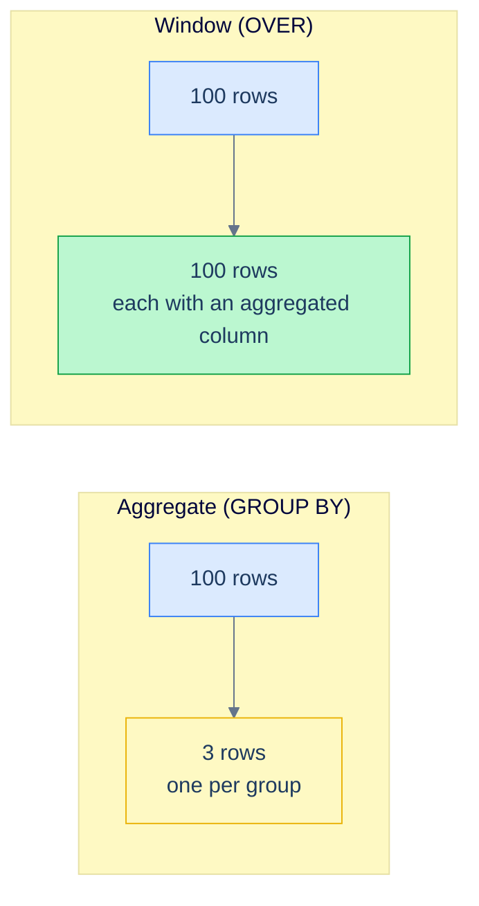

# 1. Window Basics

## The Hook

A reporting query: "for each order, show its sales amount and the running total of sales for that customer up to and including this order, ordered by date."

Without window functions, this is awful. You'd write a self-join or a correlated subquery:

```sql
-- The pre-window-function ergonomic disaster.
SELECT o.order_id, o.customer_id, o.order_date, o.sales,
       (SELECT SUM(o2.sales)
        FROM orders o2
        WHERE o2.customer_id = o.customer_id
          AND o2.order_date <= o.order_date) AS running_total
FROM orders o
ORDER BY o.customer_id, o.order_date;
```

For each row, a correlated subquery sums all earlier orders. That's `O(N²)` work — N rows × ~N comparisons each. On a million-row orders table, the query takes minutes.

With window functions, the same query is one line:

```sql
SELECT order_id, customer_id, order_date, sales,
       SUM(sales) OVER (PARTITION BY customer_id ORDER BY order_date) AS running_total
FROM orders
ORDER BY customer_id, order_date;
```

`SUM(sales)` is the same aggregate. `OVER (...)` says: don't collapse rows — instead, for each row, compute this sum over a *window* of related rows. `PARTITION BY customer_id` means "relate by customer." `ORDER BY order_date` means "the window is everything from the start of the partition up to this row." One pass through the data; `O(N)`.

This chapter is the foundation: the three pieces of `OVER` (`PARTITION BY`, `ORDER BY`, frame), the mental model for "what window does this row see," and the difference between regular aggregation and windowed aggregation. By the end you'll be able to read any window function and know what data it's looking at.

---

## Table of contents

1. [The mental model](#the-mental-model)
2. [`OVER ()` — the empty window](#empty-window)
3. [`PARTITION BY` — restricting the window](#partition-by)
4. [`ORDER BY` inside `OVER`](#order-by-inside-over)
5. [Frame default — the surprise](#frame-default)
6. [Window vs aggregate: a side-by-side](#window-vs-aggregate)
7. [Edge cases and pitfalls](#edge-cases-and-pitfalls)
8. [Production reality](#production-reality)
9. [Practice ladder](#practice-ladder)
10. [Cross-links](#cross-links)
11. [Final takeaway](#final-takeaway)

***

# The mental model

A regular aggregate (`SELECT country, SUM(sales) FROM orders GROUP BY country`) collapses rows: 100 rows in, N rows out (one per group).

A window function does *not* collapse. It keeps every row and **adds a column** with the aggregate computed over a "window" of related rows. 100 rows in, 100 rows out.



<p align="center"><strong>The fundamental difference. Regular aggregates collapse. Window functions keep every row and add an aggregated column.</strong></p>

The keyword is `OVER`. Any aggregate function (`SUM`, `COUNT`, `AVG`, `MIN`, `MAX`) plus `OVER (...)` becomes a window function. There are also dedicated window functions (`ROW_NUMBER`, `RANK`, `LAG`, `LEAD`) that *only* exist as window functions — covered in [Ranking](/cortex/languages/sql/window-functions/ranking) and [Value Functions](/cortex/languages/sql/window-functions/value-functions).

The window — the set of rows visible to the function for a given output row — is defined by the `OVER (...)` clause. It has three pieces:

1. **`PARTITION BY` columns** — partition the rows into independent windows; each row sees only the rows in its own partition.
2. **`ORDER BY` columns** — order the rows within the partition.
3. **Frame** — specify which subset of the ordered partition the row "sees." Default is "from the start of the partition through the current row."

All three are optional. The combinations produce different semantics.

---

# OVER ()

The simplest form: an empty `OVER ()`. The window is *every row in the result*.

```sql run
CREATE TABLE customers (id INT, first_name TEXT, country TEXT, score INT);
INSERT INTO customers VALUES (1,'Maria','Germany',350),(2,'John','USA',900),(3,'Georg','UK',750),(4,'Martin','Germany',500),(5,'Peter','USA',0);

-- Each row, with the global average alongside.
SELECT first_name, country, score,
       AVG(score) OVER () AS overall_avg
FROM customers;
```

5 rows out (same as the input). Each row has `overall_avg = 500` (the average of all 5 scores). The window is the whole table.

This already does something useful — it lets you compute "this row's score vs the global average" inline, without a subquery:

```sql run
CREATE TABLE customers (id INT, first_name TEXT, country TEXT, score INT);
INSERT INTO customers VALUES (1,'Maria','Germany',350),(2,'John','USA',900),(3,'Georg','UK',750),(4,'Martin','Germany',500),(5,'Peter','USA',0);

SELECT first_name, score,
       score - AVG(score) OVER () AS deviation_from_avg
FROM customers
ORDER BY deviation_from_avg DESC;
```

`SUM`, `COUNT`, `AVG`, `MIN`, `MAX` over `()` give you the global aggregate for each row.

---

# PARTITION BY

`PARTITION BY` chops the rows into independent windows. The aggregate is computed *within each partition*; rows in one partition can't see rows in another.

```sql run
CREATE TABLE orders (order_id INT, customer_id INT, sales INT);
INSERT INTO orders VALUES (1001,1,120),(1002,1,80),(1003,2,450),(1004,3,200),(1005,4,300),(1006,1,150);

-- Each order, with the total sales for that customer.
SELECT order_id, customer_id, sales,
       SUM(sales) OVER (PARTITION BY customer_id) AS customer_total
FROM orders
ORDER BY customer_id, order_id;
```

For every order belonging to customer 1, `customer_total = 120 + 80 + 150 = 350` — the sum of all of customer 1's orders. Customer 2's orders see only customer 2's total; etc.

Compare to the equivalent `GROUP BY` form:

```sql
SELECT customer_id, SUM(sales) AS customer_total FROM orders GROUP BY customer_id;
-- Returns 4 rows (one per customer), not 6.
```

The `GROUP BY` collapses; the window form does not. Pick the form based on whether you need per-row detail (window) or one row per group (aggregate).

---

# ORDER BY inside OVER

When you add `ORDER BY` inside `OVER`, the function operates over an **ordered window**. For most aggregates, this changes the meaning to "running total" — each row sees the rows from the start of the partition up to itself.

```sql run
CREATE TABLE orders (order_id INT, customer_id INT, order_date DATE, sales INT);
INSERT INTO orders VALUES (1001,1,'2026-04-03',120),(1002,1,'2026-04-15',80),(1003,1,'2026-05-04',150),(1004,2,'2026-04-22',450),(1005,3,'2026-04-28',200);

-- Running total of sales per customer, over time.
SELECT order_id, customer_id, order_date, sales,
       SUM(sales) OVER (PARTITION BY customer_id ORDER BY order_date) AS running_total
FROM orders
ORDER BY customer_id, order_date;
```

For customer 1's three orders (ordered by date):
- Apr 03: running_total = 120
- Apr 15: running_total = 200 (120 + 80)
- May 04: running_total = 350 (120 + 80 + 150)

Each row sees the rows up to and including itself, in date order. The "running" semantics come from the `ORDER BY` inside `OVER` — without it, the aggregate would be the entire customer's total (no row-by-row accumulation).

This is the **default frame** for ordered windows: `RANGE BETWEEN UNBOUNDED PRECEDING AND CURRENT ROW`. Frames are the topic of the [next chapter](/cortex/languages/sql/window-functions/frames). For now, just know that `ORDER BY` inside `OVER` changes the meaning from "the whole partition" to "everything up to this row."

---

# Frame default

A surprise that catches people learning windows: **the default frame depends on whether you specified `ORDER BY` inside `OVER`**.

| `OVER` spec | Default frame | Effective semantics |
|---|---|---|
| `OVER ()` | entire window | "the global aggregate" |
| `OVER (PARTITION BY X)` | entire partition | "the per-X aggregate" |
| `OVER (ORDER BY X)` | unbounded preceding to current row | "running total / ranks up to this row" |
| `OVER (PARTITION BY X ORDER BY Y)` | unbounded preceding to current row, within partition | "per-X running total" |

So the same aggregate (`SUM(sales)`) means different things depending on the `OVER` clause:

- `SUM(sales) OVER ()` → grand total (every row sees the same value).
- `SUM(sales) OVER (PARTITION BY customer_id)` → per-customer total (one value per customer).
- `SUM(sales) OVER (ORDER BY order_date)` → running total over time.
- `SUM(sales) OVER (PARTITION BY customer_id ORDER BY order_date)` → per-customer running total.

**The presence of `ORDER BY` is the single biggest determiner of what a window function does.** Read every `OVER` clause for `ORDER BY` first; that tells you whether the function is "aggregate over the whole window" or "running aggregate up to this row."

---

# Window vs aggregate

A side-by-side, to make the difference concrete:

```sql run
CREATE TABLE orders (order_id INT, customer_id INT, order_date DATE, sales INT);
INSERT INTO orders VALUES (1001,1,'2026-04-03',120),(1002,1,'2026-04-15',80),(1003,1,'2026-05-04',150),(1004,2,'2026-04-22',450),(1005,3,'2026-04-28',200);

-- (a) Regular aggregate: 3 rows out (one per customer).
SELECT customer_id, SUM(sales) AS total
FROM orders
GROUP BY customer_id;
```

```sql run
CREATE TABLE orders (order_id INT, customer_id INT, order_date DATE, sales INT);
INSERT INTO orders VALUES (1001,1,'2026-04-03',120),(1002,1,'2026-04-15',80),(1003,1,'2026-05-04',150),(1004,2,'2026-04-22',450),(1005,3,'2026-04-28',200);

-- (b) Window function: 5 rows out (one per order), with the customer total alongside.
SELECT customer_id, order_id, sales,
       SUM(sales) OVER (PARTITION BY customer_id) AS customer_total
FROM orders
ORDER BY customer_id, order_id;
```

Both compute "sum of sales per customer." (a) returns one row per customer; (b) returns one row per order, with the customer total repeated for each of that customer's rows. **Pick (a) when you only want the summary; pick (b) when you want the detail and the summary together.**

A common pattern: percentage-of-total:

```sql
SELECT order_id, customer_id, sales,
       sales * 100.0 / SUM(sales) OVER (PARTITION BY customer_id) AS pct_of_customer_total
FROM orders;
```

For each order, the percentage it represents of that customer's total spending. **Impossible cleanly without window functions.** With `GROUP BY` you'd lose the per-order detail.

---

# Edge cases and pitfalls

## `OVER` is required, even when empty

```sql
-- ❌ This is just an aggregate, will require GROUP BY or fail.
SELECT first_name, AVG(score) FROM customers;

-- ✅ Window-function form: no GROUP BY needed.
SELECT first_name, AVG(score) OVER () FROM customers;
```

`OVER` is what marks the function as windowed instead of aggregated. Without it, you're back to regular `GROUP BY` semantics.

## Window functions run after `WHERE`, before `ORDER BY`

In the [logical execution order](/cortex/languages/sql/foundations/introduction-to-sql#the-logical-execution-order), window functions run at step 6.5 — after `SELECT` projection and before `ORDER BY`. This means:

- `WHERE` filters rows *before* the window is computed. The window only sees post-`WHERE` rows.
- `ORDER BY` (the outer one) sorts the result *after* the window has computed.
- You **cannot** use a window function in `WHERE` or `GROUP BY`. To filter on a window result, wrap the query in a CTE or subquery.

```sql
-- ❌ Window function in WHERE — illegal.
SELECT * FROM orders
WHERE SUM(sales) OVER (PARTITION BY customer_id) > 200;

-- ✅ Wrap in a subquery / CTE.
WITH x AS (
  SELECT *, SUM(sales) OVER (PARTITION BY customer_id) AS customer_total
  FROM orders
)
SELECT * FROM x WHERE customer_total > 200;
```

## Cannot nest window functions

```sql
-- ❌ Window inside window — not allowed.
SELECT MAX(SUM(sales) OVER (PARTITION BY customer_id)) OVER () FROM orders;
```

Compute the inner window, name it via a CTE, then compute the outer window in the next layer.

## NULL in `PARTITION BY`

NULLs form their own partition. All NULL-customer-id rows are in the "NULL" partition together. Usually fine; occasionally surprising.

## NULL in `ORDER BY` inside `OVER`

Same NULL-ordering rules as the regular `ORDER BY`: dialect-specific NULL position, controllable with `NULLS FIRST`/`NULLS LAST`. Always specify when ordering on a nullable column.

---

# Production reality

The chapter's hook query — running total per customer — is one of the canonical patterns. A real-world production analogue from codefolio:

```sql
-- Cumulative visits over time, per server.
SELECT id, timestamp_ms, visits,
       SUM(visits) OVER (ORDER BY timestamp_ms) AS cumulative_visits
FROM hello_events
ORDER BY timestamp_ms;
```

For each event, the running total of visits up to that event. If you wanted per-day cumulative resets:

```sql
SELECT id, timestamp_ms, visits,
       SUM(visits) OVER (
         PARTITION BY DATE_TRUNC('day', TO_TIMESTAMP(timestamp_ms / 1000.0))
         ORDER BY timestamp_ms
       ) AS daily_running_visits
FROM hello_events;
```

`PARTITION BY` resets the running total at each day boundary. Compute once, get the full per-row detail.

A second pattern — "share of category":

```sql
-- Each order's percentage of its country's total sales.
SELECT o.order_id, c.country, o.sales,
       o.sales * 100.0 / SUM(o.sales) OVER (PARTITION BY c.country) AS country_pct
FROM orders o
JOIN customers c ON c.id = o.customer_id;
```

Per-row detail with per-group context — exactly what window functions exist for.

---

# Practice ladder

1. **Each customer's name and score, plus the global average score in a column alongside.** *Hint: `AVG(score) OVER ()`.*
2. **Each customer's name, country, score, and the average score for their country.** *Hint: `AVG(score) OVER (PARTITION BY country)`.*
3. **Each order's `order_id`, `sales`, and the running total of sales by `order_id` ascending.** *Hint: `SUM(sales) OVER (ORDER BY order_id)`.*
4. **Each order's `order_id`, `sales`, and that order's percentage of its customer's total sales.** *Hint: `sales * 100.0 / SUM(sales) OVER (PARTITION BY customer_id)`.*
5. **Why does this fail?**
   ```sql
   SELECT * FROM orders WHERE SUM(sales) OVER (PARTITION BY customer_id) > 200;
   ```
   *Hint: where do window functions run in the logical order? Where can they be referenced?*
6. **Rewrite (5) with a CTE so the filter on the window result is legal.**
7. **`SUM(sales) OVER ()` vs `SUM(sales) OVER (ORDER BY order_id)` — what's the difference, and why?** *Hint: default frame depends on whether `ORDER BY` is in `OVER`.*

***

# Cross-links

- **Previous module:** [Aggregation](/cortex/languages/sql/aggregation/index) — the `GROUP BY` aggregates that this module repurposes as windowed.
- **Next in this module:** [Frames](/cortex/languages/sql/window-functions/frames) — the third piece of `OVER`. Defaults and `ROWS`/`RANGE`/`GROUPS`.
- **Forward reference:** [Ranking](/cortex/languages/sql/window-functions/ranking) and [Value Functions](/cortex/languages/sql/window-functions/value-functions) — dedicated window functions that have no aggregate counterpart.
- **Forward reference:** [Window Patterns](/cortex/languages/sql/window-functions/window-patterns) — the canonical real-world shapes: top-N per group, gaps and islands, sessionisation.

***

# Final Takeaway

Window functions add per-row context without collapsing rows. Three patterns to internalise:

1. **`OVER (...)` is the marker.** Any aggregate plus `OVER (...)` becomes a window function. No `GROUP BY` involved; every row stays in the result, and the aggregate is computed over a window of related rows.
2. **`PARTITION BY` chops the windows; `ORDER BY` orders within them; the frame slices each window per row.** All three optional, all three change semantics.
3. **The presence of `ORDER BY` inside `OVER` flips the default frame from "entire window" to "running through current row."** This is the single most consequential detail: `SUM(x) OVER (PARTITION BY g)` is the per-group total; `SUM(x) OVER (PARTITION BY g ORDER BY t)` is the per-group running total. Same aggregate, different question.

Master these three and the rest of the window-functions module — frames, ranking, value functions — falls into place.

## Your Turn

Before you move on, check your understanding with the coach — explain the idea, apply it, weigh the trade-offs, then defend your reasoning.

<div class="concept-coach"></div>
