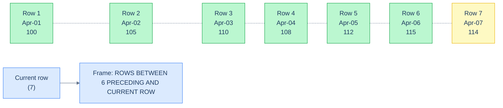

# 1. Frames

## The Hook

A trader needs a 7-day moving average of stock prices. They write the natural query:

```sql
SELECT trading_date, close_price,
       AVG(close_price) OVER (ORDER BY trading_date) AS moving_avg_7d
FROM prices;
```

`AVG(close_price) OVER (ORDER BY trading_date)`. Compute average over time. Looks right, ships.

The CTO checks it: "the moving average on day 100 should average days 94–100. But your output for day 100 averages days 1–100." 

The bug is the **default frame**. `ORDER BY trading_date` inside `OVER` defaults the frame to "from the start of the partition through the current row" — so day 100's average is over days 1–100, not days 94–100. The query computes a *running* average, not a *moving* average. Subtle, silent, mostly correct in early outputs (which is why it ships), badly wrong in later ones.

The fix is the `ROWS BETWEEN ... AND ...` clause that **explicitly defines the frame**:

```sql
SELECT trading_date, close_price,
       AVG(close_price) OVER (
         ORDER BY trading_date
         ROWS BETWEEN 6 PRECEDING AND CURRENT ROW
       ) AS moving_avg_7d
FROM prices;
```

Six rows back plus the current row = seven rows of window. Exactly what the CTO wanted.

This chapter is about frames — the third piece of `OVER`, the one that determines which subset of the partition each row sees. The default is rarely what you want for "moving averages" or "previous-N-rows" computations; explicit frames are how you control it. By the end you'll know `ROWS` vs `RANGE` vs `GROUPS`, the four useful frame shapes, and the few cases where the default is the right answer.

---

## Table of contents

1. [What a frame is](#what-a-frame-is)
2. [`ROWS` — physical row counts](#rows)
3. [`RANGE` — logical value ranges](#range)
4. [`GROUPS` — peer-aware](#groups)
5. [The default frame, restated](#default-frame)
6. [Useful frame shapes](#useful-frame-shapes)
7. [Edge cases and pitfalls](#edge-cases-and-pitfalls)
8. [Production reality](#production-reality)
9. [Practice ladder](#practice-ladder)
10. [Cross-links](#cross-links)
11. [Final takeaway](#final-takeaway)

***

# What a frame is

The window function for a given output row sees a subset of the partition — the **frame**. The frame is parameterised by an *anchor* (the current row) and *boundaries* (how far before and after to include).

Three frame *modes* — `ROWS`, `RANGE`, `GROUPS` — differ in *how the boundaries are interpreted*.

---

# ROWS

`ROWS` mode counts physical rows. `2 PRECEDING` means "the two rows immediately before the current row in the ordered partition."



<p align="center"><strong>The 7-row trailing frame anchored at row 7. The yellow row is the current row; the green rows are the 6 preceding. AVG over this frame is a 7-day moving average.</strong></p>

```sql run
CREATE TABLE prices (trading_date DATE, close_price INT);
INSERT INTO prices VALUES ('2026-04-01',100),('2026-04-02',105),('2026-04-03',110),('2026-04-04',108),('2026-04-05',112),('2026-04-06',115),('2026-04-07',114),('2026-04-08',120),('2026-04-09',118),('2026-04-10',125);

-- 7-day moving average using ROWS frame.
SELECT trading_date, close_price,
       ROUND(AVG(close_price) OVER (
         ORDER BY trading_date
         ROWS BETWEEN 6 PRECEDING AND CURRENT ROW
       ), 2) AS moving_avg_7d
FROM prices
ORDER BY trading_date;
```

The frame for each row is "the 6 rows before, plus this one" — exactly 7 rows except for the first 6, which have fewer rows available (the partition starts).

Common `ROWS BETWEEN ... AND ...` patterns:

| Frame | Meaning |
|---|---|
| `BETWEEN UNBOUNDED PRECEDING AND CURRENT ROW` | Start of partition through current — default for ordered window |
| `BETWEEN UNBOUNDED PRECEDING AND UNBOUNDED FOLLOWING` | Whole partition — default for unordered window |
| `BETWEEN N PRECEDING AND CURRENT ROW` | Trailing window of N+1 rows (moving average) |
| `BETWEEN N PRECEDING AND M FOLLOWING` | Centred window |
| `BETWEEN CURRENT ROW AND UNBOUNDED FOLLOWING` | This row through end (running total backwards) |
| `BETWEEN N FOLLOWING AND M FOLLOWING` | Future-only window (rare) |

`UNBOUNDED PRECEDING` is the start of the partition. `UNBOUNDED FOLLOWING` is the end. `CURRENT ROW` is, as it sounds, the row being computed.

`ROWS` is the most predictable mode — physical row counts mean exactly what they say. Use it for moving averages, "previous N rows" sums, and any "fixed-width window" computation.

---

# RANGE

`RANGE` mode looks at *values* of the `ORDER BY` column. `RANGE BETWEEN INTERVAL '7 days' PRECEDING AND CURRENT ROW` means "all rows whose order-by value is within 7 days of the current row's."

This sounds the same as `ROWS BETWEEN 6 PRECEDING AND CURRENT ROW`, but it's not:

- `ROWS BETWEEN 6 PRECEDING ...` always sees exactly 7 rows (or fewer at the partition start).
- `RANGE BETWEEN INTERVAL '7 days' PRECEDING ...` sees however many rows fell within those 7 calendar days. If the data has gaps (weekends, holidays), `RANGE` sees fewer rows than `ROWS`.

```sql
-- Postgres-flavour. SQLite as of 3.45 supports RANGE for some uses.
SELECT trading_date, close_price,
       AVG(close_price) OVER (
         ORDER BY trading_date
         RANGE BETWEEN INTERVAL '6 days' PRECEDING AND CURRENT ROW
       ) AS calendar_window_avg
FROM prices;
```

For trading data with weekends, this `RANGE` window for Monday looks at "Monday plus the previous 6 calendar days" — which is Tuesday-of-last-week through Monday — *but excludes Saturday and Sunday* because there are no rows for them. The average is over 5 trading days inside a 7-day calendar window.

`RANGE` is the right tool when "the past N days/weeks/months" is the question, regardless of how many rows are in that period. Use `ROWS` when "the past N rows" is the question.

## RANGE has restrictions

`RANGE` has stricter requirements than `ROWS`:

1. The frame can only use **simple `RANGE` defaults** (`UNBOUNDED PRECEDING`, `CURRENT ROW`) without an offset, OR
2. The `ORDER BY` must have exactly one column whose type supports the offset. For `INTERVAL '7 days' PRECEDING`, the column must be `DATE` or `TIMESTAMP`. For `5 PRECEDING` (numeric), the column must be numeric.
3. NULL handling differs: `RANGE` peers (rows with the same `ORDER BY` value) are all included or all excluded together.

The third point is non-obvious: if you `RANGE BETWEEN UNBOUNDED PRECEDING AND CURRENT ROW` and two rows tie on the `ORDER BY` value, both are in the frame even though one is "later." `ROWS` would include just the one row.

---

# GROUPS

A newer mode (PostgreSQL 11+, less widely supported). Counts *groups of peer rows*, not physical rows.

`GROUPS BETWEEN 1 PRECEDING AND CURRENT ROW` means "the immediately previous distinct value group, plus the current group." If there are 3 rows tied on the previous value and 2 tied on the current value, the frame is 5 rows.

`GROUPS` is the right tool for "the previous N distinct values" semantics. In practice it's rare; `ROWS` and `RANGE` cover most use cases. Mentioned for completeness.

---

# Default frame

Restated for clarity (because this is the chapter's hook bug):

| `OVER` clause | Default frame |
|---|---|
| `OVER ()` | `RANGE BETWEEN UNBOUNDED PRECEDING AND UNBOUNDED FOLLOWING` (whole window) |
| `OVER (PARTITION BY ...)` | same default — whole partition |
| `OVER (ORDER BY ...)` | `RANGE BETWEEN UNBOUNDED PRECEDING AND CURRENT ROW` |
| `OVER (PARTITION BY ... ORDER BY ...)` | same — start of partition through current |

**Adding `ORDER BY` flips the default from "whole window" to "running"**. And the default mode is `RANGE`, not `ROWS` — which means peer rows are bundled together. For a `SUM(sales) OVER (ORDER BY date)` where multiple orders share a date, the running total includes *all* same-date orders together, not the cumulative-by-row form most people imagine.

The takeaway: **always specify the frame explicitly when the answer depends on it**. The most common explicit frame in production code is:

```sql
ROWS BETWEEN N PRECEDING AND CURRENT ROW
```

Replace the default `RANGE BETWEEN UNBOUNDED PRECEDING AND CURRENT ROW` with this when:
- You want a fixed-width moving window.
- You want "exactly the previous N rows" instead of "all rows up to here."
- You want to control how peer rows are handled.

---

# Useful frame shapes

Four frames cover 90% of production use:

**(1) Running total / running average** — default behaviour, often fine to leave implicit:

```sql
SUM(x) OVER (ORDER BY t)
-- Equivalent: SUM(x) OVER (ORDER BY t ROWS BETWEEN UNBOUNDED PRECEDING AND CURRENT ROW)
```

**(2) Trailing window of N+1 rows** — moving averages, last N transactions:

```sql
AVG(x) OVER (ORDER BY t ROWS BETWEEN N PRECEDING AND CURRENT ROW)
```

**(3) Centred window** — for smoothing where you have future data available:

```sql
AVG(x) OVER (ORDER BY t ROWS BETWEEN 3 PRECEDING AND 3 FOLLOWING)
```

**(4) Full-partition aggregate** — explicit "I want the per-group total alongside each row":

```sql
SUM(x) OVER (PARTITION BY g)
-- Implicit frame is the whole partition. To force this when ORDER BY is also present:
SUM(x) OVER (PARTITION BY g ORDER BY t ROWS BETWEEN UNBOUNDED PRECEDING AND UNBOUNDED FOLLOWING)
```

Memorise these four; the rest is ad-hoc combinations.

---

# Edge cases and pitfalls

## Default `RANGE` with ties bundles peer rows

```sql
-- Two rows tied at trading_date = '2026-04-03'.
SELECT trading_date, close_price,
       SUM(close_price) OVER (ORDER BY trading_date) AS running
FROM prices;
```

In default `RANGE`, both tied rows see the *same* running total — including both of themselves. Confusing if you expected per-row accumulation.

The fix: switch to `ROWS`:

```sql
SUM(close_price) OVER (ORDER BY trading_date ROWS BETWEEN UNBOUNDED PRECEDING AND CURRENT ROW)
```

Now each row sees only itself plus prior rows (with ties broken arbitrarily by row order). Add a tiebreaker `ORDER BY` for determinism.

## Frame requires `ORDER BY`

`ROWS BETWEEN ... AND ...` only makes sense over an *ordered* partition. `OVER (PARTITION BY g ROWS BETWEEN 1 PRECEDING AND CURRENT ROW)` without `ORDER BY` is either rejected or has undefined behaviour. Always include `ORDER BY` when specifying a frame.

## Frame doesn't apply to ranking functions

`ROW_NUMBER`, `RANK`, `DENSE_RANK`, `NTILE` — covered in [Ranking](/cortex/languages/sql/window-functions/ranking) — operate on the whole partition regardless of frame. `LAG` and `LEAD` (covered in [Value Functions](/cortex/languages/sql/window-functions/value-functions)) also ignore the frame. Frames only matter for aggregate window functions and `FIRST_VALUE`/`LAST_VALUE`/`NTH_VALUE`.

## `LAST_VALUE` has a frame surprise

```sql
-- ❌ Often returns the current row, not the last partition row.
LAST_VALUE(x) OVER (ORDER BY t)
```

Because the default frame ends at `CURRENT ROW`, `LAST_VALUE` sees a frame ending at "this row" — so the "last" value in the frame is *this* row, not the partition's last. To get the actual last value:

```sql
LAST_VALUE(x) OVER (ORDER BY t ROWS BETWEEN UNBOUNDED PRECEDING AND UNBOUNDED FOLLOWING)
```

Covered in [Value Functions](/cortex/languages/sql/window-functions/value-functions); flagged here because it's a frame-related bug.

---

# Production reality

The codefolio `hello_events` table is naturally suited to moving-window analytics:

```sql
-- 5-minute moving average of `visits` for each event.
SELECT id, timestamp_ms, visits,
       AVG(visits) OVER (
         ORDER BY timestamp_ms
         ROWS BETWEEN 5 PRECEDING AND CURRENT ROW
       ) AS visits_moving_6
FROM hello_events;
```

The window of 6 events (5 preceding + current). The `AVG` is updated row-by-row.

For *time-based* windows (e.g., the last 5 minutes regardless of how many events landed), you'd use `RANGE`:

```sql
-- Postgres: RANGE BETWEEN INTERVAL '5 minutes' PRECEDING AND CURRENT ROW
SELECT id, timestamp_ms, visits,
       AVG(visits) OVER (
         ORDER BY timestamp_ms
         RANGE BETWEEN 300000 PRECEDING AND CURRENT ROW   -- 5 minutes in ms
       ) AS visits_5min_avg
FROM hello_events;
```

For Postgres with native timestamps, `RANGE BETWEEN INTERVAL '5 minutes' PRECEDING ...` is the cleaner form. Codefolio's `BIGINT timestamp_ms` doesn't support that directly — the workaround is to keep the column numeric and use a numeric offset (300000 ms).

---

# Practice ladder

1. **Fix this query so it computes a true 7-row moving average:**
   ```sql
   AVG(close_price) OVER (ORDER BY trading_date)
   ```
   *Hint: the default frame is `UNBOUNDED PRECEDING`. Replace with `ROWS BETWEEN 6 PRECEDING AND CURRENT ROW`.*
2. **Write a window that's the past 30 calendar days, not the past 30 rows.** *Hint: `RANGE` mode with an interval offset.*
3. **`SUM(x) OVER ()` vs `SUM(x) OVER (ORDER BY t)` — explain the difference.** *Hint: default frame.*
4. **Why does `LAST_VALUE(x) OVER (ORDER BY t)` often not return what you expect?** *Hint: default frame ends at `CURRENT ROW`.*
5. **Compute a centred 5-row average (2 before, 2 after, plus current).** *Hint: `ROWS BETWEEN 2 PRECEDING AND 2 FOLLOWING`.*
6. **Predict what the query in (1) returns for the *first* row of the partition.** *Hint: `6 PRECEDING` doesn't error when there aren't 6 rows; the frame is just whatever rows exist.*

***

# Cross-links

- **Previous in this module:** [Window Basics](/cortex/languages/sql/window-functions/window-basics) — `OVER`, `PARTITION BY`, `ORDER BY`. Frames build on these.
- **Next in this module:** [Ranking](/cortex/languages/sql/window-functions/ranking) — ranking functions don't use frames; they always see the whole partition.
- **Forward reference:** [Value Functions](/cortex/languages/sql/window-functions/value-functions) — `LAST_VALUE`'s frame surprise is the canonical "this is why frames matter" story.
- **Forward reference:** [Window Patterns](/cortex/languages/sql/window-functions/window-patterns) — moving averages, sessionisation, gap-filling all rely on explicit frame control.

***

# Final Takeaway

Frames are how you control which rows a window function sees. Three patterns to internalise:

1. **The default frame depends on whether `ORDER BY` is in `OVER`.** No `ORDER BY` → whole partition. With `ORDER BY` → unbounded preceding through current row. The "moving average computed as running total" bug traces here.
2. **`ROWS` for fixed row counts; `RANGE` for value-relative offsets (calendar days, score brackets).** Pick the mode that matches the question. `ROWS` is more predictable; `RANGE` is what you want when gaps in the data shouldn't shrink the window.
3. **Specify frames explicitly in production code.** Defaults are convenient but easy to misread. `ROWS BETWEEN N PRECEDING AND CURRENT ROW` is the most common explicit form — moving windows of fixed size are the bread and butter of analytics SQL.

Master these three and the moving-window patterns in the [Window Patterns](/cortex/languages/sql/window-functions/window-patterns) chapter become straightforward applications of frame control.

## Your Turn

Before you move on, check your understanding with the coach — explain the idea, apply it, weigh the trade-offs, then defend your reasoning.

<div class="concept-coach"></div>
