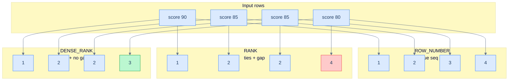

# 1. Ranking

## The Hook

A leaderboard query: "for each customer's orders, label them 1, 2, 3 in chronological order so we can show 'order #N'."

Without window functions, you'd self-join and count earlier orders — `O(N²)`. With ranking functions, it's one line:

```sql
SELECT order_id, customer_id, order_date,
       ROW_NUMBER() OVER (PARTITION BY customer_id ORDER BY order_date) AS order_seq
FROM orders;
```

Each customer gets their own counting: 1, 2, 3, ... per customer, by date. One pass through the data; per-customer order-number column for free.

That's `ROW_NUMBER`, the simplest of the ranking functions. There are five total — each handles ties differently and answers a slightly different "what position is this row?" question. This chapter is the catalogue: when to reach for each, why `ROW_NUMBER` is the workhorse, and how the "top N per group" pattern uses ranking under the hood.

---

## Table of contents

1. [The five ranking functions](#the-five-ranking-functions)
2. [`ROW_NUMBER`](#row_number)
3. [`RANK` and `DENSE_RANK`](#rank-and-dense_rank)
4. [`NTILE` — bucket assignment](#ntile)
5. [`PERCENT_RANK` and `CUME_DIST`](#percent_rank-and-cume_dist)
6. [Top-N per group](#top-n-per-group)
7. [Edge cases and pitfalls](#edge-cases-and-pitfalls)
8. [Production reality](#production-reality)
9. [Practice ladder](#practice-ladder)
10. [Cross-links](#cross-links)
11. [Final takeaway](#final-takeaway)

***

# The five ranking functions

| Function | What it returns | Tie behaviour |
|---|---|---|
| `ROW_NUMBER()` | sequential integer, starting at 1 | breaks ties arbitrarily (one row per number) |
| `RANK()` | rank with gaps | ties share a rank; next rank skips |
| `DENSE_RANK()` | rank without gaps | ties share a rank; next rank doesn't skip |
| `NTILE(N)` | bucket number 1..N | distributes rows roughly evenly into N buckets |
| `PERCENT_RANK()` | percentile in [0, 1] | based on `RANK` semantics |

All take no arguments (except `NTILE(N)`). All require an `ORDER BY` inside `OVER` — they're meaningless without an order. None use a frame (the function operates on the whole partition regardless).

---

# ROW_NUMBER

`ROW_NUMBER()` assigns 1, 2, 3, ... to rows in `ORDER BY` order. Ties are broken arbitrarily — but each row gets a unique number.

```sql run
CREATE TABLE customers (id INT, first_name TEXT, score INT);
INSERT INTO customers VALUES (1,'Maria',350),(2,'John',900),(3,'Georg',750),(4,'Martin',500),(5,'Peter',0);

SELECT first_name, score,
       ROW_NUMBER() OVER (ORDER BY score DESC) AS rank
FROM customers
ORDER BY rank;
```

Output:

| first_name | score | rank |
|---|---|---|
| John   | 900 | 1 |
| Georg  | 750 | 2 |
| Martin | 500 | 3 |
| Maria  | 350 | 4 |
| Peter  | 0   | 5 |

If two customers tied at score = 750, `ROW_NUMBER` would still give them 2 and 3 (in some order — be sure to add a tiebreaker `ORDER BY` for determinism). For real "ranking-with-ties" semantics, use `RANK` or `DENSE_RANK`.

`ROW_NUMBER` is the workhorse. Use it for:

- **Per-row position** (1st order, 2nd order, ...).
- **Top-N per group** (combined with `WHERE row_num <= N` after a CTE).
- **Deterministic deduplication** (keep the first row by some criterion, drop the rest).

---

# RANK and DENSE_RANK

`RANK()` gives ties the same rank, but the next rank *skips* by the number of tied rows. `DENSE_RANK()` gives ties the same rank, but the next rank is *immediately* the next integer.

Example: scores (90, 85, 85, 80).

| Score | `ROW_NUMBER` | `RANK` | `DENSE_RANK` |
|---|---|---|---|
| 90 | 1 | 1 | 1 |
| 85 | 2 | 2 | 2 |
| 85 | 3 | 2 | 2 |
| 80 | 4 | **4** | **3** |

`RANK` skips 3 because two rows tied at rank 2. `DENSE_RANK` doesn't skip — the score-80 row is "rank 3 of 3 distinct values."



<p align="center"><strong>Three ranking functions over the same tied input. <code>ROW_NUMBER</code> always assigns unique numbers; <code>RANK</code> ties at the duplicate (here both at 2) and skips to 4; <code>DENSE_RANK</code> ties and continues at 3. The score-80 row is the place to look: 4, 4, or 3.</strong></p>

Which to use? Depends on the question:

- "Bronze/silver/gold" tier with ties allowed → `DENSE_RANK` (so the next tier is meaningful).
- "Top 10 leaderboard with ties" → `RANK` (so a 3-way tie at rank 1 occupies positions 1, 1, 1, then the next is rank 4).
- "Numbered list, ties don't matter" → `ROW_NUMBER`.

```sql run
CREATE TABLE customers (id INT, first_name TEXT, score INT);
INSERT INTO customers VALUES (1,'Maria',850),(2,'John',900),(3,'Georg',850),(4,'Martin',850),(5,'Peter',700);

SELECT first_name, score,
       ROW_NUMBER() OVER (ORDER BY score DESC) AS rn,
       RANK()       OVER (ORDER BY score DESC) AS rk,
       DENSE_RANK() OVER (ORDER BY score DESC) AS drk
FROM customers
ORDER BY score DESC, first_name;
```

Three customers tied at 850: `ROW_NUMBER` gives them 2, 3, 4; `RANK` gives them all 2 (then Peter is rank 5); `DENSE_RANK` gives them all 2 (then Peter is rank 3).

---

# NTILE

`NTILE(N)` distributes rows into N approximately-equal buckets, labelled 1 to N. Useful for quartiles (`NTILE(4)`), deciles (`NTILE(10)`), or percentile-style cohorting.

```sql run
CREATE TABLE customers (id INT, first_name TEXT, score INT);
INSERT INTO customers VALUES (1,'Maria',350),(2,'John',900),(3,'Georg',750),(4,'Martin',500),(5,'Peter',0),(6,'Alice',600),(7,'Bob',200),(8,'Eve',800);

-- 8 customers split into 4 quartiles by score.
SELECT first_name, score,
       NTILE(4) OVER (ORDER BY score) AS quartile
FROM customers
ORDER BY score;
```

8 rows / 4 buckets = 2 rows per quartile. With 9 rows / 4 buckets, the first bucket gets 3 rows and the rest get 2.

`NTILE` is **rank-based**, not value-based. The rows are sorted by `ORDER BY` and split into buckets of equal *count*, not equal value range. For value-based bucketing (everyone with score < 250 → 'low'), use `CASE WHEN` ([CASE Expressions](/cortex/languages/sql/row-functions/case-expressions)).

---

# PERCENT_RANK and CUME_DIST

`PERCENT_RANK()` returns `(rank - 1) / (total_rows - 1)` — a value in [0, 1] indicating relative position. The lowest is 0; the highest is 1.

`CUME_DIST()` (cumulative distribution) returns "fraction of rows with values ≤ this row's." The lowest is `1/N`; the highest is 1.

```sql
SELECT first_name, score,
       PERCENT_RANK() OVER (ORDER BY score) AS pct_rank,
       CUME_DIST()    OVER (ORDER BY score) AS cume_dist
FROM customers;
```

Both useful for percentile-style analysis — "what percentile is this score?" — but in practice, `NTILE(100)` (percentile bucket) is the more commonly seen form.

---

# Top-N per group

The pattern this whole chapter exists to enable. "Top 3 orders per customer by sales." Without ranking functions, you'd write a correlated subquery per customer; with them, it's a CTE plus a filter:

```sql run
CREATE TABLE orders (order_id INT, customer_id INT, sales INT);
INSERT INTO orders VALUES (1001,1,120),(1002,1,80),(1003,1,150),(1004,1,300),(1005,2,450),(1006,2,200),(1007,2,180),(1008,3,200);

WITH ranked AS (
  SELECT order_id, customer_id, sales,
         ROW_NUMBER() OVER (PARTITION BY customer_id ORDER BY sales DESC) AS rn
  FROM orders
)
SELECT order_id, customer_id, sales
FROM ranked
WHERE rn <= 2     -- top 2 per customer
ORDER BY customer_id, rn;
```

The CTE numbers each customer's orders by sales (descending). The outer `WHERE` filters to "rank ≤ 2" — the top 2 per customer. Customer 1 gets orders 1004 (300) and 1003 (150). Customer 2 gets 1005 (450) and 1006 (200). Customer 3 gets 1008 (200) — only 1 order.

Variations:

- "Top 3 with ties allowed" → use `RANK()` instead of `ROW_NUMBER()`. Tied rows all get the same rank and all pass the filter.
- "Latest order per customer" → `ROW_NUMBER() OVER (PARTITION BY customer_id ORDER BY order_date DESC)`, then `WHERE rn = 1`.
- "First N per group based on multiple ordering criteria" → multi-column `ORDER BY` inside `OVER`.

This pattern — **rank in a CTE, filter in the outer query** — is the canonical "top N per group" shape. It replaces a class of correlated-subquery and `LATERAL`-join queries that were the only options before window functions arrived.

---

# Edge cases and pitfalls

## Ranking functions ignore the frame

Frames don't apply to `ROW_NUMBER`/`RANK`/`DENSE_RANK`/`NTILE`. They always operate on the whole partition. This is one less knob to think about.

## Add a tiebreaker `ORDER BY` for determinism

Without one, `ROW_NUMBER() OVER (ORDER BY score DESC)` puts tied rows in *some* order — but which order is plan-dependent. For deterministic output, add a unique-column tiebreaker:

```sql
ROW_NUMBER() OVER (ORDER BY score DESC, id ASC)
```

Same advice as in [Ordering and Pagination](/cortex/languages/sql/foundations/ordering-and-pagination#stability-and-tiebreakers). Critical when the rank determines pagination or filtering.

## `NTILE` doesn't always make even buckets

`NTILE(N)` over fewer than N rows gives some rows their own bucket and leaves later buckets empty. `NTILE(4)` over 3 rows: bucket 1 has 1 row, bucket 2 has 1 row, bucket 3 has 1 row, bucket 4 has nothing. Surprising for small datasets.

## NULL in `ORDER BY` of `OVER`

Same default handling as outer `ORDER BY` — dialect-specific NULLs-first or NULLs-last. Specify `NULLS FIRST` / `NULLS LAST` in the `OVER (... ORDER BY col NULLS LAST)` for explicit control.

## Filtering on rank requires a wrapping CTE/subquery

```sql
-- ❌ Window functions can't appear in WHERE.
SELECT * FROM customers WHERE ROW_NUMBER() OVER (ORDER BY score DESC) <= 3;

-- ✅ Wrap.
WITH ranked AS (
  SELECT *, ROW_NUMBER() OVER (ORDER BY score DESC) AS rn FROM customers
)
SELECT * FROM ranked WHERE rn <= 3;
```

Same as for any other window-result filter.

---

# Production reality

A typical production "top-N per group" — for a recommender system, "the top 5 most-ordered products per customer":

```sql
WITH product_counts AS (
  SELECT customer_id, product_id, COUNT(*) AS times_ordered
  FROM order_items
  GROUP BY customer_id, product_id
),
ranked AS (
  SELECT *,
         ROW_NUMBER() OVER (PARTITION BY customer_id ORDER BY times_ordered DESC) AS rn
  FROM product_counts
)
SELECT customer_id, product_id, times_ordered
FROM ranked
WHERE rn <= 5
ORDER BY customer_id, rn;
```

Two CTEs: aggregate first (per (customer, product)), then rank, then filter. Standard production shape.

For codefolio's `hello_events`, "the most-recent visit count per hour":

```sql
WITH numbered AS (
  SELECT id, timestamp_ms, visits,
         DATE_TRUNC('hour', TO_TIMESTAMP(timestamp_ms / 1000.0)) AS hour,
         ROW_NUMBER() OVER (
           PARTITION BY DATE_TRUNC('hour', TO_TIMESTAMP(timestamp_ms / 1000.0))
           ORDER BY timestamp_ms DESC
         ) AS rn
  FROM hello_events
)
SELECT hour, id, visits
FROM numbered
WHERE rn = 1
ORDER BY hour;
```

For each hour, the latest event. The pattern: bucket → `PARTITION BY` the bucket → `ORDER BY` the desired criterion → filter `rn = 1`. It's the SQL equivalent of "for each group, give me the row that maximises X."

---

# Practice ladder

1. **Number each customer's orders 1, 2, 3 in chronological order.** *Hint: `ROW_NUMBER() OVER (PARTITION BY customer_id ORDER BY order_date)`.*
2. **Rank customers by score from highest to lowest. Show rank.** *Hint: `RANK() OVER (ORDER BY score DESC)`.*
3. **For each customer, the most expensive order.** *Hint: `ROW_NUMBER() OVER (PARTITION BY customer_id ORDER BY sales DESC)` in a CTE; outer `WHERE rn = 1`.*
4. **Top 2 customers by score, allowing ties.** *Hint: `RANK()`, then `WHERE rk <= 2`.*
5. **Compare `RANK` vs `DENSE_RANK` on `(90, 85, 85, 80)`.** *Hint: `RANK` skips after a tie; `DENSE_RANK` doesn't.*
6. **Split customers into quintiles by score.** *Hint: `NTILE(5) OVER (ORDER BY score)`.*
7. **Why does this fail?**
   ```sql
   SELECT * FROM orders WHERE ROW_NUMBER() OVER (...) = 1;
   ```
   *Hint: window functions can't appear in WHERE. Wrap in a CTE/subquery.*

***

# Cross-links

- **Previous in this module:** [Frames](/cortex/languages/sql/window-functions/frames) — frames don't apply to ranking functions, but the `OVER`/`PARTITION BY`/`ORDER BY` mechanics carry over.
- **Next in this module:** [Value Functions](/cortex/languages/sql/window-functions/value-functions) — `LAG`, `LEAD`, `FIRST_VALUE` — for "previous row," "next row," "first row in window" patterns.
- **Forward reference:** [Window Patterns](/cortex/languages/sql/window-functions/window-patterns) — the canonical real-world shapes built on ranking + value functions.
- **Forward reference:** [B-Tree Indexes](/cortex/languages/sql/index) — a covering index on `(customer_id, sales DESC)` makes the "top N per customer" query nearly free.

***

# Final Takeaway

Ranking functions label each row with its position. Three patterns to internalise:

1. **`ROW_NUMBER` for unique sequence; `RANK` for ties-with-gaps; `DENSE_RANK` for ties-without-gaps; `NTILE(N)` for N buckets.** Pick based on how you want ties handled. Add a tiebreaker `ORDER BY` for determinism.
2. **Top-N per group: rank in a CTE, filter `rn ≤ N` in the outer query.** This pattern replaces correlated subqueries and self-joins for an entire category of question. Get fluent at it.
3. **Window functions can't appear in `WHERE`.** Wrap any rank-based filter in a CTE or subquery. This is the consistent rule across all window functions and the most common "wait, why does this fail" moment when learning them.

With these and frames, the [Window Functions](/cortex/languages/sql/window-functions/index) module is mostly in your fingertips. The next chapter ([Value Functions](/cortex/languages/sql/window-functions/value-functions)) covers the row-relative functions (`LAG`, `LEAD`, etc.), and the [final chapter](/cortex/languages/sql/window-functions/window-patterns) ties everything together with the canonical production patterns.

## Your Turn

Before you move on, check your understanding with the coach — explain the idea, apply it, weigh the trade-offs, then defend your reasoning.

<div class="concept-coach"></div>
