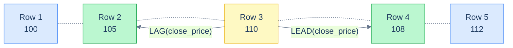

# 1. Value Functions

## The Hook

A trader needs the day-over-day price change for each stock:

```sql
-- Current price minus yesterday's price.
SELECT trading_date, close_price,
       close_price - LAG(close_price) OVER (ORDER BY trading_date) AS day_change
FROM prices;
```

`LAG(close_price) OVER (ORDER BY trading_date)` reaches *one row back* in the ordered partition and returns that row's `close_price`. Subtract it from the current row's price; you get the change.

Without `LAG`, this is a self-join with an offset condition — `O(N²)` work or a clunky correlated subquery. With `LAG`, one expression, `O(N)`.

`LAG`, `LEAD`, `FIRST_VALUE`, `LAST_VALUE`, `NTH_VALUE` are the **value functions** — window functions that don't aggregate, they *fetch* a value from a specific row in the window. By the end you'll know which one to reach for, why `LAST_VALUE` is famously confusing without an explicit frame, and how the day-over-day pattern generalises.

---

## Table of contents

1. [The five value functions](#the-five-value-functions)
2. [`LAG` and `LEAD`](#lag-and-lead)
3. [`FIRST_VALUE` and `LAST_VALUE`](#first_value-and-last_value)
4. [`NTH_VALUE`](#nth_value)
5. [Patterns: change, gap, sequence](#patterns)
6. [Edge cases and pitfalls](#edge-cases-and-pitfalls)
7. [Production reality](#production-reality)
8. [Practice ladder](#practice-ladder)
9. [Cross-links](#cross-links)
10. [Final takeaway](#final-takeaway)

***

# The five value functions

| Function | What it returns |
|---|---|
| `LAG(col, offset, default)` | the value of `col` from `offset` rows earlier (default 1) |
| `LEAD(col, offset, default)` | the value of `col` from `offset` rows later (default 1) |
| `FIRST_VALUE(col)` | the first row's value in the window |
| `LAST_VALUE(col)` | the last row's value in the window |
| `NTH_VALUE(col, n)` | the n-th row's value (1-based) |

`LAG` and `LEAD` ignore the frame; they take an offset directly. `FIRST_VALUE`, `LAST_VALUE`, `NTH_VALUE` *do* respect the frame — and that's where most of the confusion lives.

---

# LAG and LEAD

`LAG(col)` returns the value of `col` from the row *one before* the current row, in the partition's `ORDER BY`. `LEAD(col)` is the same but one row *after*.



<p align="center"><strong><code>LAG</code> looks one row backward; <code>LEAD</code> looks one row forward. Both within the partition's ORDER BY.</strong></p>

```sql run
CREATE TABLE prices (trading_date DATE, close_price INT);
INSERT INTO prices VALUES ('2026-04-01',100),('2026-04-02',105),('2026-04-03',110),('2026-04-04',108),('2026-04-05',112);

SELECT trading_date, close_price,
       LAG(close_price)  OVER (ORDER BY trading_date) AS prev_close,
       LEAD(close_price) OVER (ORDER BY trading_date) AS next_close,
       close_price - LAG(close_price) OVER (ORDER BY trading_date) AS day_change
FROM prices
ORDER BY trading_date;
```

Each row sees the previous row's `close_price` (NULL for the first row) and the next row's (NULL for the last row). The `day_change` column is the chapter's hook computation.

## Optional offset and default

```sql
LAG(col, 3, 0)
-- Row 3 back. If there are fewer than 3 prior rows in the partition, return 0.
```

The 2nd argument is the offset (default 1). The 3rd is the value to return when the offset goes off the end of the partition (default `NULL`). Useful for pattern queries like "compare to last week's value":

```sql
LAG(amount, 7, 0) OVER (ORDER BY date)
-- Returns the amount 7 rows back. 0 for the first 7 rows.
```

## Per-partition reset

`PARTITION BY` resets the LAG/LEAD context. "Day-over-day change *per stock*":

```sql
SELECT stock_id, trading_date, close_price,
       close_price - LAG(close_price) OVER (PARTITION BY stock_id ORDER BY trading_date) AS day_change
FROM prices;
```

Each stock's `LAG` looks back within its own partition only. Crossing the partition boundary returns NULL (or the default).

`LAG`/`LEAD` are the cleanest tools for **time-series row-relative computations**: change, ratio, gap, "did this row come within N seconds of the previous one," etc.

---

# FIRST_VALUE and LAST_VALUE

`FIRST_VALUE(col)` returns the first row's value *within the window's frame*. `LAST_VALUE(col)` returns the last.

```sql run
CREATE TABLE customers (id INT, first_name TEXT, country TEXT, score INT);
INSERT INTO customers VALUES (1,'Maria','Germany',350),(2,'John','USA',900),(3,'Georg','UK',750),(4,'Martin','Germany',500),(5,'Peter','USA',0);

-- Each row alongside the highest-scoring customer in its country.
SELECT first_name, country, score,
       FIRST_VALUE(first_name) OVER (
         PARTITION BY country ORDER BY score DESC
       ) AS top_in_country
FROM customers
ORDER BY country, score DESC;
```

Within each country (`PARTITION BY country`), order by score descending; `FIRST_VALUE` returns the top row's `first_name`. Every row in that country sees the same value — the country's leader.

## The famous `LAST_VALUE` surprise

The same query swapped to `LAST_VALUE`:

```sql
SELECT first_name, country, score,
       LAST_VALUE(first_name) OVER (
         PARTITION BY country ORDER BY score DESC
       ) AS bottom_in_country
FROM customers;
```

Surprise: `LAST_VALUE` returns the *current row's* value, not the lowest-score row.

The bug is the **default frame**. `OVER (PARTITION BY ... ORDER BY ...)` defaults to `RANGE BETWEEN UNBOUNDED PRECEDING AND CURRENT ROW`. So the frame for any given row ends *at that row* — the "last value in the frame" is the current row.

The fix is to explicitly extend the frame:

```sql run
CREATE TABLE customers (id INT, first_name TEXT, country TEXT, score INT);
INSERT INTO customers VALUES (1,'Maria','Germany',350),(2,'John','USA',900),(3,'Georg','UK',750),(4,'Martin','Germany',500),(5,'Peter','USA',0);

-- Correct: explicit frame covering the whole partition.
SELECT first_name, country, score,
       LAST_VALUE(first_name) OVER (
         PARTITION BY country ORDER BY score DESC
         ROWS BETWEEN UNBOUNDED PRECEDING AND UNBOUNDED FOLLOWING
       ) AS bottom_in_country
FROM customers
ORDER BY country, score DESC;
```

Now the frame covers the whole partition. `LAST_VALUE` returns the last row's value — the country's lowest-scoring customer.

**Always use an explicit frame with `LAST_VALUE`.** This is the single most common window-function bug among engineers learning the topic. The pattern in production code:

```sql
-- The defensive "last in partition" pattern.
LAST_VALUE(col) OVER (
  PARTITION BY ...
  ORDER BY ...
  ROWS BETWEEN UNBOUNDED PRECEDING AND UNBOUNDED FOLLOWING
)
```

Or, equivalently:

```sql
-- Get the last value by reversing the order and taking the first.
FIRST_VALUE(col) OVER (PARTITION BY ... ORDER BY ... DESC)
```

The `FIRST_VALUE`-with-reversed-order trick is shorter and avoids the frame trap. Many engineers prefer it.

---

# NTH_VALUE

`NTH_VALUE(col, n)` returns the n-th row's value within the frame (1-based). Rare in practice — usually you want first or last, not "the third one."

```sql
SELECT first_name, country, score,
       NTH_VALUE(first_name, 2) OVER (
         PARTITION BY country ORDER BY score DESC
         ROWS BETWEEN UNBOUNDED PRECEDING AND UNBOUNDED FOLLOWING
       ) AS second_highest_in_country
FROM customers;
```

Returns the country's second-highest scorer. Same frame caveat as `LAST_VALUE` — you usually want an explicit frame.

If `n` exceeds the frame size, returns NULL. For "rank-2 per group" you can also use `ROW_NUMBER() = 2` (covered in [Ranking](/cortex/languages/sql/window-functions/ranking)) — usually the cleaner option.

---

# Patterns

The classic value-function patterns:

## Day-over-day change

```sql
SELECT trading_date, close_price,
       close_price - LAG(close_price) OVER (ORDER BY trading_date) AS abs_change,
       (close_price - LAG(close_price) OVER (ORDER BY trading_date)) * 100.0
         / NULLIF(LAG(close_price) OVER (ORDER BY trading_date), 0) AS pct_change
FROM prices;
```

Two differences (absolute and percentage). `NULLIF(... , 0)` to avoid division by zero. The `LAG` is computed three times here; the planner usually optimises this, but you can extract to a CTE for clarity:

```sql
WITH p AS (
  SELECT trading_date, close_price, LAG(close_price) OVER (ORDER BY trading_date) AS prev
  FROM prices
)
SELECT *, close_price - prev AS change, (close_price - prev) * 100.0 / NULLIF(prev, 0) AS pct
FROM p;
```

## Gap detection

"Find rows where the gap from the previous row exceeds 1 hour":

```sql
WITH g AS (
  SELECT *, timestamp_ms - LAG(timestamp_ms) OVER (ORDER BY timestamp_ms) AS gap_ms
  FROM hello_events
)
SELECT * FROM g WHERE gap_ms > 3600000;
```

`LAG` plus a comparison flags the gaps. Useful for sessionisation (covered in [Window Patterns](/cortex/languages/sql/window-functions/window-patterns)).

## Reaching across many rows

`LAG(col, 7)` — value from 7 rows back. Useful for week-over-week comparisons in daily data:

```sql
SELECT date, sales,
       sales - LAG(sales, 7) OVER (ORDER BY date) AS week_over_week
FROM daily_sales;
```

---

# Edge cases and pitfalls

## `LAG`/`LEAD` ignore the frame

Frames don't apply to `LAG`/`LEAD` — they take an explicit offset. You can't accidentally specify a wrong frame.

## NULL when the offset goes off the end

`LAG(col)` for the first row in a partition is `NULL` (or whatever default you specified). Same for `LEAD` and the last row. Filter NULLs out if your downstream calculation needs them, or use the default-value argument:

```sql
LAG(close_price, 1, close_price) OVER (ORDER BY trading_date)
-- For the first row, return the row's own close_price (so day_change = 0 instead of NULL).
```

## NULL inside the partition

`LAG` skipping NULLs isn't standard. It returns the previous row's value, even if that value is NULL. Some engines have `IGNORE NULLS` syntax:

```sql
LAG(col) IGNORE NULLS OVER (...)
-- Postgres 16+: returns the most recent non-NULL value.
```

Check your dialect.

## `LAST_VALUE` frame trap

Already discussed. Always specify the frame explicitly when using `LAST_VALUE` (or use the `FIRST_VALUE`-with-reversed-order trick).

## Partition boundary with `LAG`/`LEAD`

`LAG(col) OVER (PARTITION BY g ORDER BY t)` does NOT cross partition boundaries. The first row of each partition gets `NULL`. This is what you usually want, but easy to forget.

## Performance

`LAG`/`LEAD`/`FIRST_VALUE` over an indexed `ORDER BY` column are essentially free — the engine reads the rows in index order and maintains a buffer of the recent values. `NTH_VALUE` and `LAST_VALUE` over wide frames are more expensive.

---

# Production reality

Codefolio's `hello_events` is naturally suited to value-function analysis:

```sql
-- For each event, time since the previous event.
SELECT id, timestamp_ms,
       (timestamp_ms - LAG(timestamp_ms) OVER (ORDER BY timestamp_ms)) AS gap_ms
FROM hello_events
ORDER BY timestamp_ms;
```

Useful for traffic-pattern analysis: histogram of gaps, p99 inter-arrival time, etc.

A second pattern — **first-event-per-day**:

```sql
-- For each event, the first event of its day.
SELECT id, timestamp_ms,
       FIRST_VALUE(id) OVER (
         PARTITION BY DATE_TRUNC('day', TO_TIMESTAMP(timestamp_ms / 1000.0))
         ORDER BY timestamp_ms
       ) AS first_event_of_day
FROM hello_events;
```

Each row knows the ID of the first event in its day. Useful for "is this the first request in this user's session?" and similar logic.

A third — **pricing-style "carry forward"**:

```sql
-- For products that don't have a price every day, carry forward the most recent.
SELECT product_id, date,
       LAG(price IGNORE NULLS) OVER (PARTITION BY product_id ORDER BY date) AS carried_price
FROM daily_prices;
```

Postgres 16+'s `IGNORE NULLS` carries the most recent non-NULL price forward to days without one. The pre-16 workaround uses a different shape (the so-called "last_value with frame" pattern).

---

# Practice ladder

1. **For each customer's orders by date, the previous order's `sales` value.** *Hint: `LAG(sales) OVER (PARTITION BY customer_id ORDER BY order_date)`.*
2. **For each row, the gap (in ms) since the previous row.** *Hint: `LAG`, then subtract.*
3. **For each customer, the customer's highest-value order alongside each row.** *Hint: `FIRST_VALUE(sales) OVER (PARTITION BY customer_id ORDER BY sales DESC)`.*
4. **Same as (3), but the *lowest* value. Why does the obvious `LAST_VALUE` query not work?** *Hint: default frame ends at current row.*
5. **Predict the result of `LAG(x)` for the first row of a partition.** *Hint: NULL (or the explicit default if you provided one).*
6. **Compute the day-over-day percentage change in close prices, safely handling division by zero.** *Hint: `(price - LAG(price)) * 100.0 / NULLIF(LAG(price), 0)`.*
7. **For events that happened more than an hour after the previous event, mark them as "session_start".** *Hint: `LAG(timestamp_ms)` plus a `CASE` for the gap check.*

***

# Cross-links

- **Previous in this module:** [Ranking](/cortex/languages/sql/window-functions/ranking) — a different family of window functions, sharing the same `OVER` mechanics.
- **Next in this module:** [Window Patterns](/cortex/languages/sql/window-functions/window-patterns) — the canonical real-world shapes that compose ranking and value functions: top-N per group, gaps and islands, sessionisation.
- **Forward reference:** [CTEs and Recursion](/cortex/languages/sql/index) — when a window-function query gets long, a CTE per layer reads better than nested subqueries.
- **Cited:** [Frames](/cortex/languages/sql/window-functions/frames) — `LAST_VALUE`'s frame surprise is the canonical "this is why frames matter" example.

***

# Final Takeaway

Value functions reach into specific rows of the window. Three patterns to internalise:

1. **`LAG`/`LEAD` for "previous/next row" computations.** The cleanest tool for day-over-day changes, gap detection, and "compare to N rows back." They take an offset directly and ignore the frame.
2. **`FIRST_VALUE`/`LAST_VALUE` need an explicit frame.** The default frame ends at the current row, so `LAST_VALUE` returns the current row's value — almost never what you want. `ROWS BETWEEN UNBOUNDED PRECEDING AND UNBOUNDED FOLLOWING` is the fix; `FIRST_VALUE` over the reversed `ORDER BY` is the cleaner alternative.
3. **`NTH_VALUE` is rare; `ROW_NUMBER = N` is usually cleaner.** When you want the n-th row of a group, ranking + filter beats `NTH_VALUE` for readability.

Master these three and you can answer every "what value did the row N positions away have?" question in a single window expression — replacing self-joins and correlated subqueries that were the only options before windows existed.

## Your Turn

Before you move on, check your understanding with the coach — explain the idea, apply it, weigh the trade-offs, then defend your reasoning.

<div class="concept-coach"></div>
