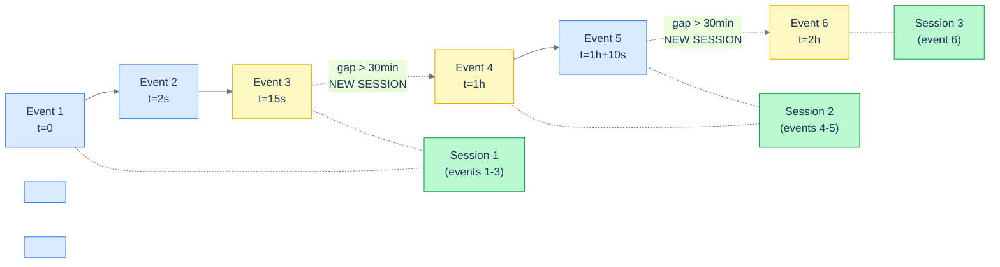

# 1. Window Patterns

## The Hook

Six SQL questions that everyone hits in real production work:

1. "Top 3 customers per region by sales."
2. "All orders, with each order's running customer total."
3. "Find user sessions" (group activity into bursts separated by 30+ minutes of silence).
4. "Detect gaps in the timestamp sequence" (where did the data feed go silent?).
5. "Each row's percentage of its country's total."
6. "Rank rows, but reset the rank when a category changes."

Each is a window-function question. Each has a canonical pattern. Once you know the patterns, every "I have rows and I need per-row context" question collapses into "which pattern is this?"

This chapter is the catalogue. The previous four chapters built the vocabulary; this one shows what to *say* with it. By the end you'll have a mental cookbook of "I've seen this shape before" templates that cover 90% of production analytical SQL.

---

## Table of contents

1. [Top-N per group](#top-n-per-group)
2. [Running total / running average](#running-total)
3. [Percent of total](#percent-of-total)
4. [Gap detection](#gap-detection)
5. [Sessionisation](#sessionisation)
6. [Gaps and islands](#gaps-and-islands)
7. [Deduplication: "keep the latest"](#deduplication)
8. [Edge cases and pitfalls](#edge-cases-and-pitfalls)
9. [Production reality](#production-reality)
10. [Practice ladder](#practice-ladder)
11. [Cross-links](#cross-links)
12. [Final takeaway](#final-takeaway)

***

# Top-N per group

The most-asked SQL interview question. From [Ranking](/cortex/languages/sql/window-functions/ranking#top-n-per-group):

```sql run
CREATE TABLE orders (order_id INT, customer_id INT, sales INT);
INSERT INTO orders VALUES (1001,1,120),(1002,1,80),(1003,1,150),(1004,1,300),(1005,2,450),(1006,2,200),(1007,2,180),(1008,3,200);

-- Top 2 orders per customer by sales.
WITH ranked AS (
  SELECT order_id, customer_id, sales,
         ROW_NUMBER() OVER (PARTITION BY customer_id ORDER BY sales DESC) AS rn
  FROM orders
)
SELECT order_id, customer_id, sales
FROM ranked
WHERE rn <= 2
ORDER BY customer_id, rn;
```

The pattern:
1. **Rank in a CTE** — `ROW_NUMBER() OVER (PARTITION BY g ORDER BY x DESC)`.
2. **Filter outer** — `WHERE rn <= N`.

Variations:
- **Top 1 per group** ("the most recent record") → `WHERE rn = 1`.
- **Top N with ties allowed** → use `RANK()` instead of `ROW_NUMBER`.
- **Bottom N** → reverse the `ORDER BY` direction.

This pattern replaces correlated subqueries (`WHERE x = (SELECT MAX FROM ...)`), self-joins on rank conditions, and `LATERAL` joins for an entire class of question.

---

# Running total

Default-frame ordered window:

```sql run
CREATE TABLE orders (order_id INT, customer_id INT, order_date DATE, sales INT);
INSERT INTO orders VALUES (1001,1,'2026-04-03',120),(1002,1,'2026-04-15',80),(1003,1,'2026-05-04',150),(1004,2,'2026-04-22',450),(1005,3,'2026-04-28',200);

-- Each customer's running spend over time.
SELECT order_id, customer_id, order_date, sales,
       SUM(sales) OVER (PARTITION BY customer_id ORDER BY order_date) AS running_total
FROM orders
ORDER BY customer_id, order_date;
```

For each row, the sum of all this customer's prior orders plus this one.

For a **moving average** (fixed-width trailing window), use an explicit `ROWS BETWEEN N PRECEDING AND CURRENT ROW` frame ([Frames](/cortex/languages/sql/window-functions/frames#useful-frame-shapes)).

---

# Percent of total

The "share of category" question:

```sql run
CREATE TABLE customers (id INT, country TEXT);
CREATE TABLE orders (order_id INT, customer_id INT, sales INT);
INSERT INTO customers VALUES (1,'Germany'),(2,'USA'),(3,'UK'),(4,'Germany'),(5,'USA');
INSERT INTO orders VALUES (1001,1,120),(1002,1,80),(1003,2,450),(1004,3,200),(1005,4,300);

-- Each order's percentage of its country's total sales.
SELECT o.order_id, c.country, o.sales,
       ROUND(o.sales * 100.0 / SUM(o.sales) OVER (PARTITION BY c.country), 1) AS country_pct
FROM orders o
JOIN customers c ON c.id = o.customer_id
ORDER BY c.country, country_pct DESC;
```

`SUM OVER (PARTITION BY c.country)` is the per-country total visible to every row. Divide each row's sales by it for the percentage. One pass; per-row detail with per-group context.

Variations:
- **Percent of grand total** → `OVER ()` (empty window).
- **Cumulative percent** → `OVER (ORDER BY ... )` for the running cumulative numerator.

---

# Gap detection

"Where did the data feed go silent for more than N seconds/minutes/hours?" — `LAG` plus a comparison.

```sql run
CREATE TABLE hello_events (id INT, timestamp_ms BIGINT);
INSERT INTO hello_events VALUES
  (1, 1714766400000), (2, 1714766402000), (3, 1714766415000),    -- close in time
  (4, 1714770000000), (5, 1714770010000),                         -- ~1 hour gap before this
  (6, 1714773600000);                                             -- another ~1 hour gap

-- Find rows where the gap from the previous row exceeds 30 minutes (1,800,000 ms).
WITH g AS (
  SELECT *, timestamp_ms - LAG(timestamp_ms) OVER (ORDER BY timestamp_ms) AS gap_ms
  FROM hello_events
)
SELECT id, timestamp_ms, gap_ms FROM g WHERE gap_ms > 1800000;
```

Two events flagged — the ones starting new "bursts" after silent gaps. This is the building block for sessionisation.

---

# Sessionisation

Group activity into "sessions" — bursts of activity separated by gaps. The standard pattern uses `LAG` to detect a session boundary, a running `SUM` to assign session IDs.



<p align="center"><strong>Sessionisation: events with a gap from the previous event larger than the threshold start a new session. The yellow events are session boundaries; the green groups are the resulting sessions.</strong></p>

```sql run
CREATE TABLE hello_events (id INT, timestamp_ms BIGINT);
INSERT INTO hello_events VALUES
  (1, 1714766400000), (2, 1714766402000), (3, 1714766415000),    -- session 1
  (4, 1714770000000), (5, 1714770010000),                         -- session 2 (>30min gap)
  (6, 1714773600000);                                             -- session 3 (>30min gap)

-- Assign a session_id to each event. New session whenever gap from previous > 30 min.
WITH boundaries AS (
  SELECT *,
         CASE
           WHEN LAG(timestamp_ms) OVER (ORDER BY timestamp_ms) IS NULL THEN 1
           WHEN timestamp_ms - LAG(timestamp_ms) OVER (ORDER BY timestamp_ms) > 1800000 THEN 1
           ELSE 0
         END AS new_session
  FROM hello_events
)
SELECT *, SUM(new_session) OVER (ORDER BY timestamp_ms) AS session_id
FROM boundaries
ORDER BY timestamp_ms;
```

Step by step:

1. **`new_session`** is 1 for rows that start a new session (the first row, or any row > 30 min after the previous), 0 otherwise.
2. **`SUM(new_session) OVER (ORDER BY timestamp_ms)`** is a running total of those 1s — which gives every row in the same session the same number.

Three sessions. The pattern generalises: any time you can detect "session boundaries" with a `LAG` comparison, the cumulative-`SUM`-of-flags trick assigns session IDs.

---

# Gaps and islands

A canonical SQL puzzle: "find consecutive runs of values, with the gaps between them." The trick: `ROW_NUMBER` minus an "expected" sequence.

```sql run
CREATE TABLE attendance (user_id INT, day DATE);
INSERT INTO attendance VALUES
  (1,'2026-04-01'),(1,'2026-04-02'),(1,'2026-04-03'),    -- streak 1: 3 days
  (1,'2026-04-07'),(1,'2026-04-08'),                      -- streak 2: 2 days
  (1,'2026-04-10');                                        -- streak 3: 1 day

-- Find each consecutive streak: start, end, length.
WITH numbered AS (
  SELECT user_id, day,
         CAST(strftime('%s', day) AS INT) / 86400 AS day_num,
         ROW_NUMBER() OVER (PARTITION BY user_id ORDER BY day) AS rn
  FROM attendance
),
grouped AS (
  SELECT *, day_num - rn AS streak_id
  FROM numbered
)
SELECT user_id, MIN(day) AS start_day, MAX(day) AS end_day, COUNT(*) AS length
FROM grouped
GROUP BY user_id, streak_id
ORDER BY start_day;
```

Three streaks identified.

The trick: when days are consecutive, `day_num - rn` is a constant. When there's a gap, the difference jumps. Grouping by `day_num - rn` collapses each consecutive run into one group.

Output shows three streaks: April 1-3 (3 days), April 7-8 (2 days), April 10 (1 day).

This pattern (or its kin) shows up in any "consecutive streaks" question — login streaks, on-call shifts, alarm-sequence detection.

---

# Deduplication

"Keep the latest version of each record" — top-1 per group with `ORDER BY ... DESC`:

```sql run
CREATE TABLE customer_versions (id INT, customer_id INT, name TEXT, updated_at INT);
INSERT INTO customer_versions VALUES
  (1, 100, 'Maria',    1000),
  (2, 100, 'Maria K.', 2000),
  (3, 100, 'Maria K.', 3000),    -- latest for 100
  (4, 200, 'John',     1500),
  (5, 200, 'John D.',  2500);    -- latest for 200

WITH latest AS (
  SELECT *, ROW_NUMBER() OVER (PARTITION BY customer_id ORDER BY updated_at DESC) AS rn
  FROM customer_versions
)
SELECT id, customer_id, name, updated_at
FROM latest
WHERE rn = 1;
```

Each customer's most-recent version. Two rows out, regardless of how many versions exist. The pattern works for any "latest by some criterion" — most recent edit, highest score, top revision.

`DISTINCT ON (col1, col2)` (Postgres-specific) is a shorthand for the same pattern; not portable but cleaner-looking. Most production code I've seen uses the `ROW_NUMBER` form for portability.

---

# Edge cases and pitfalls

## Tiebreakers, again

For all "top-N" patterns, tied rows in the `ORDER BY` produce non-deterministic output. Add a tiebreaker:

```sql
ROW_NUMBER() OVER (PARTITION BY customer_id ORDER BY sales DESC, order_id ASC)
```

The primary key is the safest tiebreaker.

## Window expressions duplicate

```sql
SELECT order_id, sales,
       SUM(sales) OVER (PARTITION BY customer_id) AS total,
       sales * 100.0 / SUM(sales) OVER (PARTITION BY customer_id) AS pct
FROM orders;
```

`SUM(sales) OVER (...)` appears twice. Most planners optimise this — the window is computed once and reused. If your dialect doesn't, hoist into a CTE.

The `WINDOW` clause (standard SQL, supported by Postgres) lets you name a window once and reuse it:

```sql
SELECT order_id, sales,
       SUM(sales) OVER w AS total,
       sales * 100.0 / SUM(sales) OVER w AS pct
FROM orders
WINDOW w AS (PARTITION BY customer_id);
```

Cleaner; less repetition.

## Watch for partition explosions

`PARTITION BY` over a high-cardinality column (e.g., `user_id` on a billion-user table) creates many small partitions. The window function runs per partition; total cost is *manageable* when partitions are small. But watch out for queries that compute a window over an entire table without partitioning — the engine has to materialise/sort the whole thing.

## Mixed window aggregates and GROUP BY

A `GROUP BY` query *can* contain window functions — but the windows operate on the *post-grouped* result, not the raw rows. Subtle. Usually you want to compute aggregates first (in a CTE), then add windows in the next layer.

---

# Production reality

Codefolio's `hello_events` is naturally suited to several of these patterns. Two production-realistic queries:

**(1) Per-hour stats with a running daily total:**

```sql
WITH hourly AS (
  SELECT DATE_TRUNC('hour', TO_TIMESTAMP(timestamp_ms / 1000.0)) AS hour,
         COUNT(*) AS events
  FROM hello_events
  WHERE timestamp_ms >= EXTRACT(EPOCH FROM NOW() - INTERVAL '7 days') * 1000
  GROUP BY hour
)
SELECT hour, events,
       SUM(events) OVER (
         PARTITION BY DATE_TRUNC('day', hour)
         ORDER BY hour
       ) AS running_daily_events
FROM hourly
ORDER BY hour;
```

Aggregate per hour first; then a partitioned running total per day. Each row shows "events this hour" and "cumulative-so-far this day."

**(2) Sessionisation against the hello-events log:**

The pattern from [Sessionisation](#sessionisation), applied to real codefolio data. Adjust the gap threshold (30 minutes here) to whatever your "session" semantics demand.

These two queries cover most of what an analytics dashboard around `hello_events` would need. Memorise the patterns; the queries write themselves.

---

# Practice ladder

1. **Top 3 customers per country by score.** *Hint: `ROW_NUMBER` + CTE + outer filter.*
2. **For each customer, their order history with a running total.** *Hint: `SUM(sales) OVER (PARTITION BY customer_id ORDER BY order_date)`.*
3. **For each event in `hello_events`, the gap (in seconds) since the previous event.** *Hint: `LAG(timestamp_ms)`, then arithmetic.*
4. **Group `hello_events` into sessions where each session is a burst of activity separated by ≥ 5-minute gaps. Output: `(session_id, start_time, end_time, event_count)`.** *Hint: `LAG` to detect new-session, cumulative `SUM` of new-session flags to assign session IDs, then `GROUP BY session_id`.*
5. **For each customer, their first and last order's `order_date` and the count of orders.** *Hint: `MIN`/`MAX`/`COUNT` per `customer_id` — could be regular `GROUP BY` or `OVER (PARTITION BY customer_id)`.*
6. **Find "streaks" of consecutive `order_date`s per customer.** *Hint: gaps-and-islands. `day_num - ROW_NUMBER()` is constant within a streak.*
7. **Why does this fail?**
   ```sql
   SELECT * FROM orders WHERE ROW_NUMBER() OVER (PARTITION BY customer_id ORDER BY sales DESC) <= 3;
   ```
   *Hint: window functions can't be in WHERE. Wrap in CTE.*

***

# Cross-links

- **Previous in this module:** [Value Functions](/cortex/languages/sql/window-functions/value-functions) — `LAG` is the workhorse for sessionisation and gap detection.
- **Module complete.** Phase 3 (Row Functions + Window Functions) is now fully covered. Next phase: [CTEs and Recursion](/cortex/languages/sql/index), [Schema and Constraints](/cortex/languages/sql/index), [Indexes and Performance](/cortex/languages/sql/index), [Transactions and Concurrency](/cortex/languages/sql/index), [Advanced Patterns](/cortex/languages/sql/index).
- **Forward reference:** [CTEs](/cortex/languages/sql/index) — many of these patterns benefit from naming intermediate windows in CTEs for clarity.
- **Forward reference:** [Indexes and Performance](/cortex/languages/sql/index) — covering indexes on `(partition_col, order_col)` make window queries dramatically faster.

***

# Final Takeaway

Window patterns are the production toolkit. Three patterns to internalise:

1. **Memorise the canonical shapes.** Top-N per group, running total, percent of total, gap detection, sessionisation, gaps-and-islands, dedup-keep-latest. Most analytical SQL is one of these or a combination.
2. **CTEs make windows readable.** A 5-line CTE that names the windowed columns is far easier to maintain than a 50-line query with windows nested in subqueries. Name your windows; chain CTEs.
3. **Tiebreakers are mandatory for any rank-and-filter query.** Without one, the answer is non-deterministic. The PK is the safest choice.

With this chapter, the [Window Functions](/cortex/languages/sql/window-functions/index) module — and Phase 3 of the curriculum — is complete. You can now write the analytical SQL that powers dashboards, reports, and recommender systems. The remaining phases (CTEs/recursion, schema, indexes, transactions, advanced patterns) round out the toolkit but are increasingly specialised; the patterns in this module are what you'll reach for daily.

## Your Turn

Before you move on, check your understanding with the coach — explain the idea, apply it, weigh the trade-offs, then defend your reasoning.

<div class="concept-coach"></div>
