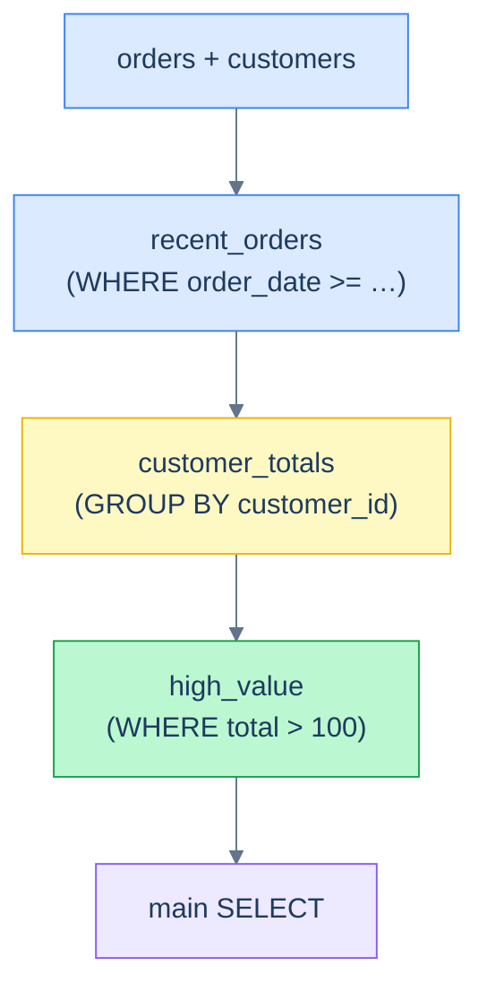

# 1. Non-recursive CTEs

## The Hook

A 5-step analytical query, written as nested subqueries:

```sql
SELECT *
FROM (
  SELECT *
  FROM (
    SELECT customer_id, SUM(sales) AS total
    FROM (
      SELECT *
      FROM orders
      WHERE order_date >= '2026-04-01'
    ) recent
    GROUP BY customer_id
  ) totals
  WHERE total > 100
) high_value;
```

Three layers of parentheses, each layer named with an alias buried at the bottom. Maintainable for the first 24 hours; a nightmare a week later.

The same query rewritten with CTEs:

```sql
WITH recent_orders AS (
  SELECT * FROM orders WHERE order_date >= '2026-04-01'
),
customer_totals AS (
  SELECT customer_id, SUM(sales) AS total FROM recent_orders GROUP BY customer_id
),
high_value AS (
  SELECT * FROM customer_totals WHERE total > 100
)
SELECT * FROM high_value;
```

Same query, same plan (in modern Postgres), wildly more readable. Each step has a name; you can read top-to-bottom and follow the data shape evolving.

CTEs are the SQL equivalent of breaking a long function into named local variables — same code, named pieces. By the end of this chapter you'll know when to use them, when *not* to (modern Postgres treats them as inline hints, not always-materialised), and the few quirks around their semantics.



<p align="center"><strong>A CTE chain. Each layer is named; each layer reads from the previous; the main query reads the last. Same plan as nested subqueries in modern Postgres, vastly more readable.</strong></p>

---

## Table of contents

1. [What a CTE is](#what-a-cte-is)
2. [Multiple CTEs in one query](#multiple-ctes)
3. [Materialisation behaviour](#materialisation)
4. [`MATERIALIZED` and `NOT MATERIALIZED` hints](#materialised-hints)
5. [Edge cases and pitfalls](#edge-cases-and-pitfalls)
6. [Production reality](#production-reality)
7. [Practice ladder](#practice-ladder)
8. [Cross-links](#cross-links)
9. [Final takeaway](#final-takeaway)

***

# What a CTE is

A **Common Table Expression** is a named subquery defined at the start of a query with `WITH name AS (subquery)`. The main query refers to the CTE by name.

```sql run
CREATE TABLE customers (id INT, country TEXT);
CREATE TABLE orders (order_id INT, customer_id INT, sales INT);
INSERT INTO customers VALUES (1,'Germany'),(2,'USA'),(3,'UK'),(4,'Germany'),(5,'USA');
INSERT INTO orders VALUES (1001,1,120),(1002,1,80),(1003,2,450),(1004,3,200),(1005,4,300);

WITH customer_totals AS (
  SELECT customer_id, SUM(sales) AS total
  FROM orders
  GROUP BY customer_id
)
SELECT c.country, ct.customer_id, ct.total
FROM customers c
JOIN customer_totals ct ON ct.customer_id = c.id
ORDER BY ct.total DESC;
```

`customer_totals` is the named subquery. The main query joins to it as if it were a real table.

CTEs work in any query type — `SELECT`, `INSERT`, `UPDATE`, `DELETE`. They scope to the single statement (you can't reference a CTE in the next query).

---

# Multiple CTEs

Define multiple CTEs comma-separated:

```sql run
CREATE TABLE customers (id INT, country TEXT);
CREATE TABLE orders (order_id INT, customer_id INT, sales INT, order_date DATE);
INSERT INTO customers VALUES (1,'Germany'),(2,'USA'),(3,'UK'),(4,'Germany'),(5,'USA');
INSERT INTO orders VALUES (1001,1,120,'2026-04-03'),(1002,1,80,'2026-04-15'),(1003,2,450,'2026-04-22'),(1004,3,200,'2026-05-04'),(1005,4,300,'2026-05-04');

WITH recent AS (
  SELECT * FROM orders WHERE order_date >= '2026-04-15'
),
totals AS (
  SELECT customer_id, SUM(sales) AS total FROM recent GROUP BY customer_id
),
ranked AS (
  SELECT *, RANK() OVER (ORDER BY total DESC) AS rk FROM totals
)
SELECT r.customer_id, c.country, r.total, r.rk
FROM ranked r
JOIN customers c ON c.id = r.customer_id
ORDER BY r.rk;
```

Three CTEs, each builds on the previous. Each step has a meaningful name; the data flow is top-down.

A CTE can reference any *previously-defined* CTE in the same `WITH` block. The order matters: `B` can reference `A`, but not vice versa.

---

# Materialisation

A CTE *might* be computed once and cached, or *might* be inlined into the main query. Pre-Postgres-12, all CTEs were materialised — computed once, then reused. This sometimes blocked optimisations (the planner couldn't push filters into the CTE).

Modern Postgres (12+) **inlines CTEs by default** — treats them as if you'd written the subquery inline. This gives the planner more freedom and is usually faster.

The implications:

- A filter outside the CTE may be pushed *into* the CTE. `WITH x AS (SELECT * FROM big_table) SELECT * FROM x WHERE id = 5` becomes effectively `SELECT * FROM big_table WHERE id = 5` — no full scan.
- A CTE referenced multiple times might be evaluated multiple times. If it's expensive, this is a regression.
- A CTE with side effects (modern Postgres allows `WITH ... AS (UPDATE ... RETURNING ...)`) is always materialised — side effects must happen exactly once.

In practice, **CTEs in modern Postgres behave like named subqueries with no performance cost**. The old "CTEs block optimisations" advice is obsolete.

---

# Materialised hints

When you want explicit control:

```sql
WITH small_set AS MATERIALIZED (
  SELECT customer_id FROM orders WHERE sales > 1000
)
SELECT * FROM small_set s JOIN customers c ON c.id = s.customer_id;
```

`AS MATERIALIZED` forces the CTE to be computed once and cached. Use when:
- The CTE is expensive and is referenced multiple times.
- You want to prevent the planner from pushing filters in (rare, but useful when your CTE has special semantics like `LIMIT` that you want preserved).

`AS NOT MATERIALIZED` forces inlining (the modern default for non-recursive, single-reference CTEs).

For most queries, leave the hint off and trust the planner. Reach for `MATERIALIZED` only after profiling.

---

# Edge cases and pitfalls

## CTE doesn't share scope across statements

```sql
WITH x AS (SELECT 1) SELECT * FROM x;
SELECT * FROM x;       -- ❌ ERROR: x doesn't exist here.
```

CTE is scoped to one statement. For cross-statement reuse, use a temp table or view.

## Recursive CTEs need the keyword

`WITH RECURSIVE cte AS (...)` — the `RECURSIVE` keyword is required for recursive CTEs (next chapter). Without it, self-references error out. Some dialects (Postgres) allow `WITH RECURSIVE` even for non-recursive CTEs in the same block.

## A CTE with side effects (DML)

```sql
WITH deleted AS (
  DELETE FROM orders WHERE order_date < '2025-01-01' RETURNING *
)
SELECT * FROM deleted;
```

Postgres allows DML in CTEs. The DML executes; the `RETURNING` rows become available to the main query. Side effects happen *exactly once*, regardless of how many times the CTE is referenced. Useful for atomic "delete then archive" or "update then audit" workflows.

## Naming collisions

```sql
WITH customers AS (...)
SELECT * FROM customers;
-- The CTE shadows the real `customers` table. Usually a bug.
```

Avoid CTE names that collide with real tables. Use suffixes (`customers_filtered`, `recent_customers`) for clarity.

## ORDER BY inside a CTE is usually meaningless

```sql
WITH ordered AS (
  SELECT * FROM orders ORDER BY order_date    -- ⚠ planner may discard this
)
SELECT * FROM ordered;
```

The outer query may rearrange rows. To preserve order, put `ORDER BY` in the *outer* query. The exception: when the CTE is `MATERIALIZED` *and* the outer query's `LIMIT`/`FETCH` benefits from the order — but even then, redundant ordering at the boundaries is safer.

---

# Production reality

CTEs are the dominant pattern in modern analytical SQL — most production reports use them throughout. A typical "monthly sales report" shape:

```sql
WITH source AS (
  SELECT * FROM orders WHERE order_date >= DATE_TRUNC('month', CURRENT_DATE)
),
per_customer AS (
  SELECT customer_id, SUM(sales) AS month_sales, COUNT(*) AS month_orders
  FROM source GROUP BY customer_id
),
ranked AS (
  SELECT *, RANK() OVER (ORDER BY month_sales DESC) AS rk
  FROM per_customer
)
SELECT c.country, r.customer_id, r.month_sales, r.month_orders, r.rk
FROM ranked r
JOIN customers c ON c.id = r.customer_id
WHERE r.rk <= 100
ORDER BY r.rk;
```

Four CTEs, each named, each one transformation step. Easy to read, easy to debug (run any CTE alone), easy to maintain.

---

# Practice ladder

1. **Refactor a 3-level nested subquery into 3 CTEs.** *Hint: name each layer with what it represents.*
2. **Write a query using 2 CTEs: first computes per-customer order count, second filters to customers with > 1 order, then joins back to `customers` for names.** *Hint: each CTE is a `SELECT`; comma-separate; reference by name.*
3. **Why does this query work in modern Postgres but might have been slow pre-12?**
   ```sql
   WITH x AS (SELECT * FROM big_table) SELECT * FROM x WHERE id = 5;
   ```
   *Hint: CTE materialisation behaviour.*
4. **What does `MATERIALIZED` do, and when would you use it?** *Hint: forces single-evaluation caching.*

***

# Cross-links

- **Previous module:** [Anti-joins and Existence](/cortex/languages/sql/multiple-tables/anti-joins-and-existence) — many anti-join queries become CTEs at scale.
- **Next in this module:** [Recursive CTEs](/cortex/languages/sql/ctes-and-recursion/recursive-ctes) — `WITH RECURSIVE` for hierarchies and graph traversal.
- **Forward reference:** [EXPLAIN and Query Plans](/cortex/languages/sql/index) — how the planner treats CTEs (inlined vs materialised).

***

# Final Takeaway

CTEs are the readability tool of modern SQL. Three patterns to internalise:

1. **Reach for a CTE whenever you would have written a 2+ level subquery.** Same plan in modern Postgres; vastly more readable.
2. **Name each CTE for what it represents.** `recent_orders`, `top_customers`, `with_total` — each step's name documents the data shape.
3. **Trust the planner's CTE inlining; reach for `MATERIALIZED` only after profiling.** The old "CTEs are an optimisation barrier" advice no longer applies.

Master these three and your analytical SQL becomes top-to-bottom readable.

## Your Turn

Before you move on, check your understanding with the coach — explain the idea, apply it, weigh the trade-offs, then defend your reasoning.

<div class="concept-coach"></div>
