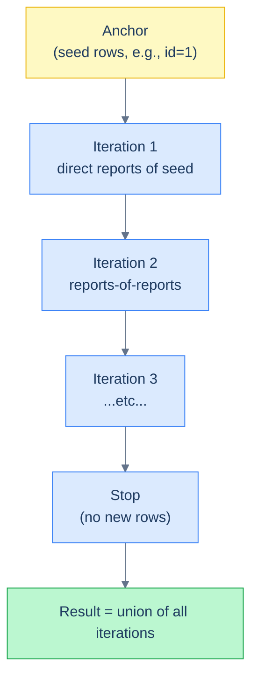

# 1. Recursive CTEs

## The Hook

An organisation chart query: "all employees in Alice's reporting tree, no matter how deep."

Without recursion, you'd write a self-join per level — and you don't know how many levels deep the tree goes:

```sql
-- Alice's directs.
SELECT * FROM employees WHERE manager_id = 1;

-- Alice's directs and their directs.
SELECT e2.* FROM employees e1
JOIN employees e2 ON e2.manager_id = e1.id
WHERE e1.manager_id = 1;

-- Three levels deep — but how many levels do we have?
```

You can't write a query that handles "any depth" without recursion. **`WITH RECURSIVE`** is the tool:

```sql
WITH RECURSIVE reports_tree AS (
  -- Anchor: start with Alice (id 1).
  SELECT id, name, manager_id FROM employees WHERE id = 1

  UNION ALL

  -- Recursive: anyone whose manager is already in the tree.
  SELECT e.id, e.name, e.manager_id
  FROM employees e
  JOIN reports_tree r ON e.manager_id = r.id
)
SELECT * FROM reports_tree;
```

The recursive CTE has two parts: an **anchor** (non-recursive seed) and a **recursive** member that references the CTE itself. Postgres iterates: anchor → first level of direct reports → second level → etc., until no new rows are added. The output is the full reporting tree.

This chapter is about `WITH RECURSIVE` — when to use it, the anchor/recursive structure, how to terminate, and the canonical patterns (hierarchies, graphs, generated sequences). By the end you'll be able to walk any tree-shaped data in SQL.

---

## Table of contents

1. [The shape of a recursive CTE](#the-shape)
2. [Walking a hierarchy](#walking-a-hierarchy)
3. [Generating sequences](#generating-sequences)
4. [Graph traversal with cycle protection](#graph-traversal)
5. [Edge cases and pitfalls](#edge-cases-and-pitfalls)
6. [Production reality](#production-reality)
7. [Practice ladder](#practice-ladder)
8. [Cross-links](#cross-links)
9. [Final takeaway](#final-takeaway)

***

# The shape

```sql
WITH RECURSIVE name AS (
  <anchor query>
  UNION ALL                  -- (or UNION for de-duplication)
  <recursive query that references `name`>
)
SELECT * FROM name;
```

Two parts:

1. **Anchor query** — the initial set of rows. Doesn't reference the CTE.
2. **Recursive query** — references the CTE name. Computes the next "level" from the current rows.

The engine iterates:
- Compute the anchor → those rows are in the result.
- Run the recursive query against those rows → new rows added.
- Run the recursive query against the *new* rows → more rows.
- Repeat until the recursive query returns no new rows.



<p align="center"><strong>Recursive CTE iteration. Each iteration produces the next level using the previous one's rows. Stops when no new rows are produced. The result is the union of all iterations including the anchor.</strong></p>

`UNION ALL` keeps duplicates (faster). `UNION` de-duplicates (sometimes needed for cycle protection in graphs).

> **Dialect note:** All major dialects support `WITH RECURSIVE` — Postgres, MySQL 8+, SQLite, SQL Server (calls it just `WITH`, no `RECURSIVE` keyword). Syntax is otherwise standard.

---

# Walking a hierarchy

```sql run
CREATE TABLE employees (id INT, name TEXT, manager_id INT);
INSERT INTO employees VALUES
  (1,'Alice',  NULL),
  (2,'Bob',    1),
  (3,'Charlie',1),
  (4,'Diana',  2),
  (5,'Eve',    2),
  (6,'Frank',  3);

-- All people in Alice's reporting tree.
WITH RECURSIVE tree AS (
  SELECT id, name, manager_id, 0 AS depth FROM employees WHERE id = 1
  UNION ALL
  SELECT e.id, e.name, e.manager_id, t.depth + 1
  FROM employees e
  JOIN tree t ON e.manager_id = t.id
)
SELECT * FROM tree ORDER BY depth, name;
```

Returns Alice (depth 0), Bob and Charlie (depth 1), Diana, Eve, Frank (depth 2).

Adding a `depth` counter is a common pattern — useful for indenting output, limiting recursion depth, or computing aggregate-by-depth stats.

To walk *up* (find Frank's full chain to the CEO), invert the join condition:

```sql run
CREATE TABLE employees (id INT, name TEXT, manager_id INT);
INSERT INTO employees VALUES (1,'Alice',NULL),(2,'Bob',1),(3,'Charlie',1),(4,'Diana',2),(5,'Eve',2),(6,'Frank',3);

-- The chain from Frank up to the CEO.
WITH RECURSIVE chain AS (
  SELECT id, name, manager_id FROM employees WHERE id = 6   -- start at Frank
  UNION ALL
  SELECT e.id, e.name, e.manager_id
  FROM employees e
  JOIN chain c ON e.id = c.manager_id     -- walk up via manager_id
)
SELECT * FROM chain;
```

Returns Frank → Charlie → Alice. The structure is the same; the join direction is different.

---

# Generating sequences

A common non-graph use: generate sequential values without a real table.

```sql run
-- Numbers 1 through 10.
WITH RECURSIVE nums AS (
  SELECT 1 AS n
  UNION ALL
  SELECT n + 1 FROM nums WHERE n < 10
)
SELECT * FROM nums;
```

The anchor seeds with 1; each recursive step adds 1; termination is `WHERE n < 10`.

Useful for generating date dimensions, calendars, hour buckets, or any "I need N rows of X" output without a real table:

```sql
-- Every day in April 2026.
WITH RECURSIVE days AS (
  SELECT DATE '2026-04-01' AS d
  UNION ALL
  SELECT d + INTERVAL '1 day' FROM days WHERE d < DATE '2026-04-30'
)
SELECT * FROM days;
```

Postgres has `generate_series` as a native shortcut — `SELECT generate_series(DATE '2026-04-01', DATE '2026-04-30', INTERVAL '1 day')` — but the recursive form is portable to engines without it.

---

# Graph traversal with cycle protection

Cycles are the trap. If your data is a graph (not a tree), recursion can loop forever.

```sql
-- DANGEROUS: if A is a friend of B and B of A, this loops.
WITH RECURSIVE friends_of_alice AS (
  SELECT * FROM friendships WHERE user1 = 'Alice'
  UNION ALL
  SELECT f.* FROM friendships f
  JOIN friends_of_alice fa ON f.user1 = fa.user2
)
SELECT * FROM friends_of_alice;
```

If the graph has cycles, the recursive query keeps producing rows forever (or until Postgres errors out at the recursion limit). Two fixes:

**(1) Use `UNION` instead of `UNION ALL`** — de-duplicates. If the same (user, friend) pair appears twice, it's only counted once. This handles the "visit each node at most once" case.

**(2) Track the path explicitly** — append visited nodes to an array and skip rows where the next node is already in the path:

```sql
WITH RECURSIVE walk AS (
  SELECT user1 AS node, ARRAY[user1] AS path FROM friendships WHERE user1 = 'Alice'
  UNION ALL
  SELECT f.user2, w.path || f.user2
  FROM friendships f
  JOIN walk w ON f.user1 = w.node
  WHERE NOT (f.user2 = ANY(w.path))     -- skip cycles
)
SELECT DISTINCT node FROM walk;
```

Postgres-specific (uses arrays). Cleaner-portable patterns are dialect-dependent.

**(3) Recursion-depth limit** — most engines cap recursion (Postgres default: 1000 iterations). You'll see an error rather than an infinite loop, but it's a crash, not a graceful answer.

---

# Edge cases and pitfalls

## Termination is up to you

The recursive query *must* eventually produce zero new rows. If it doesn't, it crashes or never returns. The most common cause: missing `WHERE` in the recursive part.

```sql
-- ❌ Infinite loop.
WITH RECURSIVE n AS (
  SELECT 1 AS x
  UNION ALL
  SELECT x + 1 FROM n         -- no WHERE — never terminates
)
SELECT * FROM n;
```

Always include a termination predicate.

## `UNION ALL` vs `UNION`

`UNION ALL` is faster but allows duplicates. `UNION` de-duplicates each iteration. For tree traversal where each node appears once, `UNION ALL` is fine. For graph traversal where the same node can be reached multiple ways, use `UNION` or explicit cycle protection.

## Recursive references must be in `FROM`

```sql
-- ✅ The recursive reference is inside FROM.
SELECT n + 1 FROM cte WHERE ...

-- ❌ Recursive reference in subquery — not allowed in some dialects.
SELECT n + 1 FROM cte WHERE n + 1 < (SELECT MAX(x) FROM cte)
```

The standard requires the recursive reference to be in the `FROM` clause of the recursive query, not in subqueries or `WHERE`. Postgres is more permissive than the standard here, but for portability, keep the recursive reference in `FROM`.

## Performance

Recursive CTEs are iterative — each level scans previous-level rows. Cost is `O(depth × per-level rows)`. Wide trees with many levels become expensive. For deep recursive walks on large data, consider **closure tables** (denormalised "ancestor" columns) — covered in [Hierarchies and Graphs](/cortex/languages/sql/index).

---

# Production reality

Recursive CTEs show up in three production shapes:

**(1) Org charts and category trees:**

```sql
-- All ancestors of category id=42 in a category tree.
WITH RECURSIVE ancestors AS (
  SELECT * FROM categories WHERE id = 42
  UNION ALL
  SELECT c.* FROM categories c JOIN ancestors a ON c.id = a.parent_id
)
SELECT * FROM ancestors;
```

E-commerce category hierarchies, file-system trees, comment threads.

**(2) Time-bucket generation:**

```sql
-- Every hour bucket for the last 24 hours, even those with no events.
WITH RECURSIVE buckets AS (
  SELECT DATE_TRUNC('hour', NOW() - INTERVAL '24 hours') AS hour
  UNION ALL
  SELECT hour + INTERVAL '1 hour' FROM buckets WHERE hour < DATE_TRUNC('hour', NOW())
)
SELECT b.hour, COUNT(e.id) AS events
FROM buckets b
LEFT JOIN hello_events e
  ON DATE_TRUNC('hour', TO_TIMESTAMP(e.timestamp_ms / 1000.0)) = b.hour
GROUP BY b.hour
ORDER BY b.hour;
```

Generate a complete time-axis (no gaps for empty hours), then `LEFT JOIN` the actual data. Useful for any chart that needs every time bucket present.

**(3) Path queries on graphs** — friend-of-friend, dependency graphs, etc.

---

# Practice ladder

1. **Find all employees in Alice's tree (Alice + everyone reporting up to her), with depth.** *Hint: anchor with Alice, recursive with `manager_id` join, `+ 1` for depth.*
2. **Find all ancestors of a given employee (the chain up to the CEO).** *Hint: invert the join direction.*
3. **Generate the integers 1..100 with a recursive CTE.** *Hint: `WITH RECURSIVE n AS (SELECT 1 ... UNION ALL SELECT n+1 FROM n WHERE n < 100)`.*
4. **Generate every day in May 2026.** *Hint: `DATE '2026-05-01'` anchor, `+ INTERVAL '1 day'` step.*
5. **Why does this loop forever?**
   ```sql
   WITH RECURSIVE x AS (SELECT 1 AS n UNION ALL SELECT n+1 FROM x) SELECT * FROM x;
   ```
   *Hint: missing termination predicate.*
6. **For graph traversal where cycles exist, what are two ways to prevent infinite recursion?** *Hint: `UNION` (deduplication), explicit path tracking with array.*

***

# Cross-links

- **Previous in this module:** [Non-recursive CTEs](/cortex/languages/sql/ctes-and-recursion/non-recursive-ctes) — the syntactic foundation. Recursive CTEs are non-recursive CTEs with a self-reference.
- **Module complete.** Next: [Schema and Constraints](/cortex/languages/sql/schema-and-constraints/index).
- **Forward reference:** [Hierarchies and Graphs](/cortex/languages/sql/index) (Advanced Patterns) — closure tables, materialised paths, and other patterns for hierarchical data when recursion alone isn't enough.

***

# Final Takeaway

Recursive CTEs walk trees and graphs. Three patterns to internalise:

1. **Anchor + recursive member, joined by `UNION ALL`.** The anchor is the seed; the recursive member produces the next level. Iteration is automatic.
2. **Always include a termination predicate** in the recursive member, or you get an infinite loop.
3. **Cycles need protection.** `UNION` deduplicates; explicit path-tracking with arrays is more robust. For deep graphs, consider denormalising into closure tables instead of pure recursion.

With this chapter, the [CTEs and Recursion](/cortex/languages/sql/ctes-and-recursion/index) module is complete.

## Your Turn

Before you move on, check your understanding with the coach — explain the idea, apply it, weigh the trade-offs, then defend your reasoning.

<div class="concept-coach"></div>
