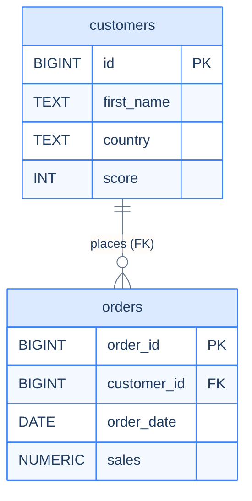

# 1. Keys and References

## The Hook

A "delete user" feature is launched. The implementation: `DELETE FROM users WHERE id = ?`. Easy.

A week later support reports orphaned data: orders without customers, comments without authors, audit logs referencing deleted user IDs. The feature deleted users but left their *related* data dangling — because the schema had no foreign keys, just naked `customer_id` columns that the database treated as opaque integers.

Foreign keys (with appropriate `ON DELETE` behaviour) prevent this: either the related rows are deleted automatically (`CASCADE`), or the delete is rejected (the default — `RESTRICT`). Either is a deliberate choice; neither is the "do nothing and let orphans accumulate" default the original schema had.

This chapter is the catalogue of constraints that turn a schema from "columns of values" into "rules the data must satisfy." By the end you'll know when each constraint is appropriate and how the cascade options shape your delete semantics.

---

## Table of contents

1. [Primary keys](#primary-keys)
2. [Foreign keys](#foreign-keys)
3. [`ON DELETE` and `ON UPDATE` cascades](#on-delete-on-update)
4. [Unique constraints](#unique-constraints)
5. [Check constraints](#check-constraints)
6. [Default values](#default-values)
7. [Edge cases and pitfalls](#edge-cases-and-pitfalls)
8. [Production reality](#production-reality)
9. [Practice ladder](#practice-ladder)
10. [Cross-links](#cross-links)
11. [Final takeaway](#final-takeaway)

***

# Primary keys

Every table should have a primary key — a column (or combination) that uniquely identifies each row.

```sql
CREATE TABLE customers (
  id BIGINT GENERATED ALWAYS AS IDENTITY PRIMARY KEY,
  ...
);
```

PK implies `NOT NULL` and `UNIQUE`. Postgres builds a B-tree index automatically, making PK lookups `O(log n)`.

**Composite PK** (multiple columns):

```sql
CREATE TABLE order_items (
  order_id INT NOT NULL,
  line_no  INT NOT NULL,
  PRIMARY KEY (order_id, line_no)
);
```

Useful when the natural identifier is multi-column. Order matters for the index — `(order_id, line_no)` indexes lookups on `order_id` alone (because B-tree); `(line_no, order_id)` would not.

**Surrogate vs natural keys.** A *surrogate* PK is a synthetic ID (`BIGINT IDENTITY`); a *natural* PK is a meaningful identifier (`email`, `iso_country_code`). Surrogates are the modern default — they're stable across business changes, fast to index, and don't leak meaning. Natural keys can become PKs when they're truly stable (ISO country codes, currency codes); but most application data has surrogate PKs and unique constraints on the natural identifiers.

---

# Foreign keys

A foreign key is a column whose values must match a primary-key value in another table.



<p align="center"><strong>FK from <code>orders.customer_id</code> to <code>customers.id</code>. The relationship is <em>one-to-many</em> — each order belongs to one customer; each customer can have many orders. The schema enforces that an order's customer_id always matches a real customer.</strong></p>

```sql
CREATE TABLE orders (
  order_id BIGINT GENERATED ALWAYS AS IDENTITY PRIMARY KEY,
  customer_id BIGINT NOT NULL REFERENCES customers(id),
  ...
);
```

Now `INSERT INTO orders VALUES (..., 9999, ...)` *fails* if `customers.id = 9999` doesn't exist. The schema enforces the relationship.

Composite FK works the same way:

```sql
FOREIGN KEY (order_id, line_no) REFERENCES order_items(order_id, line_no)
```

**Why FKs matter:**

1. **Data integrity.** Orphan rows — references to nonexistent parents — are a category of bug FKs prevent at the schema level. No application code needs to handle them; they can't exist.
2. **Documentation.** A schema with FKs documents its relationships explicitly. Future engineers (and `psql \d` output) see the structure.
3. **Optimisation.** The planner uses FK information for join elimination and other optimisations.

The cost: each FK check requires a lookup on every insert/update. Negligible for normal application traffic; visible in bulk-load scenarios (where you might `ALTER TABLE ... DISABLE FK` for the load and re-enable after).

---

# ON DELETE and ON UPDATE

What happens when the *referenced* row is deleted (or its key changes)? Six options, applied per FK:

| `ON DELETE` action | What happens when parent is deleted |
|---|---|
| `RESTRICT` (default) | Reject the delete if children exist |
| `NO ACTION` | Same as RESTRICT, but checked at end of transaction |
| `CASCADE` | Delete the children too |
| `SET NULL` | Set the FK column to NULL in children |
| `SET DEFAULT` | Set the FK column to its default value |

```sql
-- Cascade: deleting a customer deletes their orders.
FOREIGN KEY (customer_id) REFERENCES customers(id) ON DELETE CASCADE

-- SET NULL: deleting a customer keeps the orders, sets customer_id = NULL.
FOREIGN KEY (customer_id) REFERENCES customers(id) ON DELETE SET NULL

-- RESTRICT (default): can't delete a customer who has orders.
FOREIGN KEY (customer_id) REFERENCES customers(id)
```

**Choice depends on business semantics:**

- `CASCADE` for compositional relationships — `order_items` belong to an `order`; deleting the order should delete the items.
- `RESTRICT` for shared/referenced relationships — `customers` are referenced by `orders`; deleting the customer should be a deliberate choice that handles the orders separately.
- `SET NULL` for "soft" references — a `manager_id` referencing `employees`; when a manager leaves, the report's `manager_id` becomes NULL pending reassignment.

**Default `RESTRICT` is the safe choice.** It surfaces the question at delete time. The application code can then do a soft-delete, archive the dependents, or reassign — explicitly.

`ON UPDATE` is the same set of actions, applied when the *parent's PK changes*. Almost never relevant in practice — well-designed schemas use immutable surrogate PKs, so they never update.

---

# Unique constraints

A column (or combination) where each value (or combination) must be distinct.

```sql
CREATE TABLE users (
  id BIGINT GENERATED ALWAYS AS IDENTITY PRIMARY KEY,
  email TEXT NOT NULL UNIQUE
);
```

`email` must be unique across the table. Inserts that conflict raise an error.

**Composite UNIQUE:**

```sql
CREATE TABLE memberships (
  ...
  UNIQUE (user_id, group_id)
);
```

A given (user, group) pair appears at most once.

**Unique vs primary key:** PK is one per table; UNIQUE can be many. PK implies NOT NULL; UNIQUE permits NULL (and allows multiple NULLs in standard SQL — see the [Filtering NULL trap](/cortex/languages/sql/foundations/filtering#the-null-trap) for why).

**Postgres 15+: `UNIQUE NULLS NOT DISTINCT`** treats NULL values as equal for uniqueness, so only one NULL is allowed. Use when "missing" should also be unique.

---

# Check constraints

An arbitrary boolean predicate every row must satisfy.

```sql
CREATE TABLE customers (
  id BIGINT PRIMARY KEY,
  email TEXT NOT NULL,
  age INT,
  CHECK (age IS NULL OR age >= 0),
  CHECK (email LIKE '%@%')
);
```

Each `CHECK` is enforced on every insert/update. Powerful for invariants:

- Range constraints (`score >= 0 AND score <= 100`).
- Format constraints (`email LIKE '%@%'`).
- Cross-column constraints (`end_date >= start_date`).
- Either-or constraints (`(email IS NOT NULL) OR (phone IS NOT NULL)`).

**Limitation: `CHECK` can't reference other tables.** For "this customer's score doesn't exceed their tier's max," you'd need a trigger or application-layer validation. `CHECK` is for *intra-row* invariants.

`CHECK` doesn't reject NULL: `CHECK (score >= 0)` allows NULL because `NULL >= 0` is `UNKNOWN`. To require non-NULL, add `NOT NULL` separately.

---

# Default values

Not strictly a constraint, but lives in the same column-attribute space.

```sql
created_at TIMESTAMPTZ NOT NULL DEFAULT CURRENT_TIMESTAMP
```

If an INSERT doesn't specify `created_at`, the current timestamp is used. Combined with `NOT NULL`, this guarantees every row has a meaningful `created_at` without forcing every INSERT to specify it.

Common defaults:
- `created_at TIMESTAMPTZ NOT NULL DEFAULT CURRENT_TIMESTAMP`
- `is_active BOOLEAN NOT NULL DEFAULT TRUE`
- `score INT NOT NULL DEFAULT 0`

---

# Edge cases and pitfalls

## FK to a non-PK unique column

Standard SQL requires the referenced column to be a PK or UNIQUE. Postgres allows referencing any UNIQUE-constrained column, not just the PK.

## Self-referencing FK

```sql
CREATE TABLE employees (
  id BIGINT PRIMARY KEY,
  manager_id BIGINT REFERENCES employees(id)
);
```

A column referencing the same table's PK. Used for hierarchies. Inserts must seed the root (NULL `manager_id`) first.

## Deferred constraints

```sql
ALTER TABLE orders ADD CONSTRAINT fk_customer FOREIGN KEY (customer_id) REFERENCES customers(id) DEFERRABLE INITIALLY DEFERRED;
```

The check happens at COMMIT, not on each statement. Useful when inserting circular-referencing data — insert both sides in one transaction, FKs check at the end. Rare; specialised use case.

## Cascading deletes are powerful

A `CASCADE` chain — `customers → orders → order_items → ...` — can delete thousands of rows from one user-level action. Test cascade chains carefully; an unintended cascade can wipe data.

---

# Production reality

The codefolio sample schema deliberately *omits* the FK between `orders.customer_id` and `customers.id` so we can demonstrate the orphan-row anti-join scenarios in earlier chapters. A real production schema would include it:

```sql
CREATE TABLE orders (
  order_id BIGINT GENERATED ALWAYS AS IDENTITY PRIMARY KEY,
  customer_id BIGINT NOT NULL REFERENCES customers(id) ON DELETE RESTRICT,
  order_date DATE NOT NULL,
  sales NUMERIC(12, 2) NOT NULL CHECK (sales >= 0)
);
```

Two constraints: FK to `customers` (rejects orphans), CHECK on `sales` (rejects negative values). The schema enforces what every application code path would otherwise need to validate.

---

# Practice ladder

1. **Add a FK from `orders.customer_id` to `customers.id` with `ON DELETE RESTRICT`. Verify deleting a customer with orders fails.** *Hint: `ALTER TABLE ... ADD FOREIGN KEY ... ON DELETE RESTRICT`.*
2. **What's the difference between `CASCADE` and `SET NULL`?** *Hint: cascade deletes children; SET NULL keeps them with NULL FK.*
3. **Add a CHECK constraint that orders' `sales` must be ≥ 0.** *Hint: `ADD CONSTRAINT sales_nonneg CHECK (sales >= 0)`.*
4. **Make `email` unique on the customers table.** *Hint: `ADD CONSTRAINT customers_email_unique UNIQUE (email)`.*
5. **What's the rule of thumb for choosing `CASCADE` vs `RESTRICT`?** *Hint: compositional vs shared relationships.*

***

# Cross-links

- **Previous in this module:** [Types](/cortex/languages/sql/schema-and-constraints/types).
- **Next in this module:** [Normalisation](/cortex/languages/sql/schema-and-constraints/normalisation).
- **Forward reference:** [B-Tree Indexes](/cortex/languages/sql/indexes-and-performance/b-tree-indexes) — PKs and UNIQUE constraints automatically create indexes; FK columns benefit from explicit indexes for join performance.

***

# Final Takeaway

Constraints turn a schema into a contract. Three patterns to internalise:

1. **Every table has a PK; every reference is a FK.** The combination prevents orphan rows at the schema level — no application code needed.
2. **`ON DELETE RESTRICT` is the safe default.** Surface the question at delete time; let the application decide. Use `CASCADE` only for compositional relationships.
3. **`CHECK` constraints encode invariants once.** Range checks, format checks, cross-column constraints — write them in DDL, enforce on every write, never have to repeat the validation in application code.

## Your Turn

Before you move on, check your understanding with the coach — explain the idea, apply it, weigh the trade-offs, then defend your reasoning.

<div class="concept-coach"></div>
