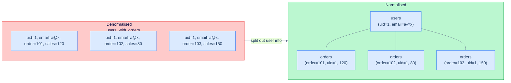

# 1. Normalisation

## The Hook

A "users with their orders" table, designed by someone in a hurry:

```sql
CREATE TABLE users_with_orders (
  user_id INT,
  user_email TEXT,
  user_country TEXT,
  order_id INT,
  order_date DATE,
  sales NUMERIC(12, 2)
);
```

User 1 has 5 orders. Their email and country are stored *5 times*. When the user changes their email, you have to remember to update all 5 rows. Miss one, and the database now thinks they have two emails. Add a 6th order: you have to copy the email and country again. Delete all the user's orders: you've lost their email and country entirely.

These are **update anomalies** — and they're what normalisation prevents. Split the table into `users (user_id, email, country)` and `orders (order_id, user_id, order_date, sales)`, and the email exists once, the orders exist N times referring back. One source of truth.



<p align="center"><strong>Denormalised: every order row repeats the user's email. Normalised: email lives in one row, orders refer to it. Update the email once vs three times; never out of sync.</strong></p>

This chapter is the normalisation forms (1NF through BCNF) explained in plain English, plus the **denormalisation** decisions that production systems sometimes make for performance.

---

## Table of contents

1. [What normalisation is](#what-normalisation-is)
2. [1NF — atomic values](#1nf)
3. [2NF — full functional dependency](#2nf)
4. [3NF — no transitive dependencies](#3nf)
5. [BCNF — the strict version](#bcnf)
6. [Denormalisation](#denormalisation)
7. [Edge cases and pitfalls](#edge-cases-and-pitfalls)
8. [Production reality](#production-reality)
9. [Practice ladder](#practice-ladder)
10. [Cross-links](#cross-links)
11. [Final takeaway](#final-takeaway)

***

# What normalisation is

Normalisation is the process of organising columns and tables to **eliminate redundancy** and **prevent update anomalies**. The core idea: every fact lives in exactly one place. Update it there; everywhere else gets the right value via a join.

Five canonical "normal forms" exist (1NF–5NF); the practically important ones are **3NF** and **BCNF**. Most production schemas aim for 3NF and accept some denormalisation for performance.

---

# 1NF — atomic values

A table is in 1NF if **every column holds a single, atomic value** (no lists, no nested rows, no comma-separated mini-columns).

```sql
-- ❌ Not 1NF: tags is a comma-separated list.
CREATE TABLE posts (id INT, title TEXT, tags TEXT);
-- INSERT INTO posts VALUES (1, 'Hello', 'sql, beginner, tutorial');

-- ✅ 1NF: tags is a child table.
CREATE TABLE posts (id INT, title TEXT);
CREATE TABLE post_tags (post_id INT, tag TEXT);
```

Why: comma-separated lists make queries painful. "Posts tagged 'sql'" requires `LIKE '%sql%'` (slow, fragile — matches "sqlite" too). The child-table form makes it `WHERE tag = 'sql'` — fast, indexable, exact.

Postgres arrays and JSONB technically violate strict 1NF, but they're a pragmatic alternative to child tables for *short, opaque* lists. The judgment call is in [Types](/cortex/languages/sql/schema-and-constraints/types#arrays).

---

# 2NF — full functional dependency

A table is in 2NF if it's in 1NF *and* every non-key column depends on the *whole* primary key, not just part of it.

This only matters for **composite PKs**. With a single-column PK, 2NF is automatic.

```sql
-- ❌ Not 2NF: PK is (order_id, product_id), but `customer_id` only depends on `order_id`.
CREATE TABLE order_items (
  order_id INT,
  product_id INT,
  quantity INT,
  customer_id INT,    -- depends on order_id alone, not on (order_id, product_id)
  PRIMARY KEY (order_id, product_id)
);

-- ✅ 2NF: customer_id moves to the orders table.
CREATE TABLE orders (order_id INT PRIMARY KEY, customer_id INT);
CREATE TABLE order_items (order_id INT, product_id INT, quantity INT, PRIMARY KEY (order_id, product_id));
```

If you store `customer_id` in `order_items`, you'll have it duplicated for every line item of an order — same anomaly as the chapter's hook.

---

# 3NF — no transitive dependencies

A table is in 3NF if it's in 2NF *and* no non-key column depends on another non-key column.

```sql
-- ❌ Not 3NF: city_country depends on city, not on the PK.
CREATE TABLE customers (
  id INT PRIMARY KEY,
  name TEXT,
  city TEXT,
  city_country TEXT     -- determined by city, not by id
);

-- ✅ 3NF: split out the city → country mapping.
CREATE TABLE customers (id INT PRIMARY KEY, name TEXT, city_id INT REFERENCES cities(id));
CREATE TABLE cities (id INT PRIMARY KEY, name TEXT, country TEXT);
```

Now "Berlin" appears once with `country = 'Germany'`, regardless of how many customers live there.

3NF is the **practical target** for most production schemas. Reaching it eliminates the worst update anomalies without going overboard on table proliferation.

---

# BCNF — the strict version

Boyce-Codd Normal Form is 3NF plus a stricter rule: every functional dependency must be from a key. Most 3NF schemas are also in BCNF; the differences only matter in specific edge cases.

For practical purposes, **3NF and BCNF are interchangeable target levels for production schemas**.

---

# Denormalisation

Sometimes 3NF is the wrong target. Common cases:

**(1) Read-heavy reports** — joining 8 tables for every dashboard read is expensive. A denormalised "summary" table updated nightly avoids the joins.

**(2) Immutable historical facts** — order line items might denormalise the product name, price, and tax rate at order time, so a later product rename or price change doesn't retroactively rewrite history.

**(3) Cached computed values** — `customer_total_spent` stored on the `customers` row, updated by a trigger or scheduled job, replaces the SUM-on-every-read.

The trade-offs: denormalised data is faster to read, slower to update, and can drift if not kept consistent. **Normalise first; denormalise deliberately, with a documented reason and a sync strategy.**

```sql
-- Cached column: total_spend updated by trigger when orders change.
ALTER TABLE customers ADD COLUMN total_spend NUMERIC(12, 2) NOT NULL DEFAULT 0;
```

Or — increasingly the modern pattern — **materialised views**:

```sql
-- Postgres-flavour: a precomputed view of the per-customer summary.
CREATE MATERIALIZED VIEW customer_summary AS
SELECT customer_id, SUM(sales) AS total_spent, COUNT(*) AS order_count
FROM orders
GROUP BY customer_id;

-- Refresh on a schedule.
REFRESH MATERIALIZED VIEW customer_summary;
```

Materialised views give you the read speed of denormalisation while keeping the write side normalised.

---

# Edge cases and pitfalls

## Over-normalisation

Splitting every column-pair into a separate table doesn't make the schema better — it makes it unreadable. 3NF is the target; further normalisation usually hurts more than it helps.

## "Soft" denormalisation

Storing a country *code* (`'DE'`) and the country *name* (`'Germany'`) in the same row is technically a 3NF violation (name depends on code, not on the PK). Pragmatically, since country codes never change, the duplication is acceptable — and faster than joining `countries` on every read. Use judgment.

## "EAV" anti-pattern

Entity-Attribute-Value: storing flexible attributes as `(entity_id, attribute_name, value)` rows. Flexible but slow, no type safety, hard to query. Almost always the wrong answer in modern Postgres — use JSONB or proper columns instead.

---

# Production reality

The codefolio sample schema is properly 3NF — `customers`, `orders`, `hello_events` each model one entity, with FK references for relationships. No data is duplicated.

In a real growing application, the typical evolution:

1. Start fully 3NF.
2. Identify slow reports.
3. Add materialised views or cached columns for those specific reads.
4. Document the denormalisation source-of-truth.

Don't denormalise prematurely. Don't tolerate update anomalies; normalise. Denormalise *only* with a profiling justification.

---

# Practice ladder

1. **Identify the 1NF violation in `posts (id, title, tags TEXT)` where `tags = 'a,b,c'`.** *Hint: atomic values.*
2. **Refactor the violation in (1) to 1NF.** *Hint: child table.*
3. **What 3NF violation does this schema have?**
   ```sql
   employees (id, name, dept_id, dept_name, dept_manager)
   ```
   *Hint: dept_name and dept_manager depend on dept_id, not id.*
4. **When might you deliberately store `country_name` alongside `country_code` in a `customers` row?** *Hint: read-heavy, country names rarely change, denormalisation for performance.*
5. **What does a materialised view buy you over a regular query?** *Hint: precomputed; refreshed on demand.*

***

# Cross-links

- **Previous in this module:** [Keys and References](/cortex/languages/sql/schema-and-constraints/keys-and-references).
- **Module complete.** Next: [Indexes and Performance](/cortex/languages/sql/indexes-and-performance/index).
- **Forward reference:** [Window Functions](/cortex/languages/sql/window-functions/index) — when you can express a denormalised metric as a window function, you may not need the denormalised column at all.

***

# Final Takeaway

Normalisation eliminates redundancy. Three patterns to internalise:

1. **Every fact lives in exactly one place.** That's the whole game. The normal forms are formal expressions of this rule for different cases.
2. **Aim for 3NF; reach for BCNF if it costs nothing extra.** Most production schemas live here. Lower forms have anomalies; higher forms have diminishing returns.
3. **Denormalise deliberately, never accidentally.** Cached columns, materialised views, immutable historical fields — each with a documented reason and a sync strategy. Drift is the tax.

## Your Turn

Before you move on, check your understanding with the coach — explain the idea, apply it, weigh the trade-offs, then defend your reasoning.

<div class="concept-coach"></div>
