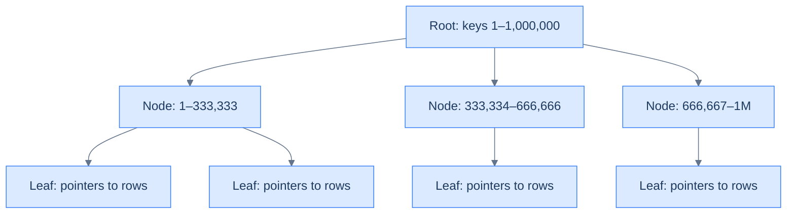

# 1. B-Tree Indexes

## The Hook

A query that takes 12 seconds against a 50-million-row `events` table:

```sql
SELECT * FROM events WHERE user_id = 42 ORDER BY created_at DESC LIMIT 10;
```

`EXPLAIN ANALYZE` shows: sequential scan, 50,000,000 rows examined, sort, return 10. The engine read every row to find user 42's events.

Add one index:

```sql
CREATE INDEX events_user_id_created_at_idx ON events (user_id, created_at DESC);
```

Same query: 5 milliseconds. `EXPLAIN ANALYZE` now shows: index scan, 10 rows read. The engine jumped to user 42's section of the index, walked backwards through `created_at`, returned 10 rows.

12,000× speedup, no schema change, no data change, just an index. **Indexes are the single biggest lever in production SQL performance** — and B-trees are the workhorse, the type that backs every PK and most application indexes.

This chapter is how a B-tree works (in just enough detail to predict its behaviour), the rules for which queries an index can accelerate, and the production discipline of choosing which indexes to add.

---

## Table of contents

1. [How a B-tree index works](#how-a-b-tree-index-works)
2. [When an index helps](#when-an-index-helps)
3. [Sargability](#sargability)
4. [Composite indexes](#composite-indexes)
5. [Covering indexes](#covering-indexes)
6. [Index size and write cost](#index-size-and-write-cost)
7. [`CREATE INDEX CONCURRENTLY`](#create-index-concurrently)
8. [Edge cases and pitfalls](#edge-cases-and-pitfalls)
9. [Production reality](#production-reality)
10. [Practice ladder](#practice-ladder)
11. [Cross-links](#cross-links)
12. [Final takeaway](#final-takeaway)

***

# How a B-tree index works

A B-tree is a balanced tree where each node holds many keys (typically hundreds). The depth is logarithmic in the number of keys; for a billion-row index, the depth is about 4-5.



To find a value: descend the tree (O(log n)). Each leaf contains a pointer to the row in the table.

The B-tree is **sorted by the indexed column(s)**. This means it's fast for:
- **Equality lookup** (`WHERE x = 42`): descend, find, done. O(log n).
- **Range scans** (`WHERE x BETWEEN 100 AND 200`): find the start, walk leaves left-to-right.
- **Ordered output** (`ORDER BY x`): walk the leaves in order; no separate sort.
- **Prefix matching** (`LIKE 'foo%'`): same as a range — find the first 'foo*', walk leaves while still in 'foo*' range.

It's *not* fast for:
- **Function-on-column** (`WHERE LOWER(x) = 'foo'`): the function transforms the value; the index is on the raw value. (Unless you build an *expression index* — see below.)
- **Suffix or anywhere matching** (`LIKE '%foo'`, `LIKE '%foo%'`): can't use the sort order.
- **Operators other than `=`, `<`, `>`, `BETWEEN`**: e.g., regex `~`, full-text search.

For these cases, other index types ([Other Index Types](/cortex/languages/sql/indexes-and-performance/other-index-types)) are the answer.

---

# When an index helps

Three rules of thumb:

**(1) The index helps when the predicate is *selective* — when only a small fraction of rows match.** An index lookup is `O(log n) + O(matched_rows)`. If 90% of rows match, the index lookup *plus* the table reads cost more than a full scan.

The planner's threshold is usually around 5–20% of rows. Below that, index scan wins. Above, sequential scan wins. The planner makes this decision per query based on table statistics.

**(2) The index helps when the column is in `WHERE`, `JOIN ... ON`, or `ORDER BY`.** Indexes on columns that never appear in these positions are wasted space.

**(3) The first column of a composite index is what matters most.** `CREATE INDEX i ON t (a, b)` accelerates queries on `a` alone, on `(a, b)`, but *not* on `b` alone. (More on this in [Composite indexes](#composite-indexes).)

---

# Sargability

A predicate is **sargable** ("Search-ARGument-able") if the planner can use an index to evaluate it. Many subtle patterns make a predicate non-sargable.

```sql
-- ✅ Sargable. Index on email → fast.
WHERE email = 'alice@example.com'

-- ❌ Not sargable. Function on column → can't use index on email.
WHERE LOWER(email) = 'alice@example.com'

-- ✅ Fix: expression index.
CREATE INDEX users_email_lower_idx ON users (LOWER(email));
-- Now WHERE LOWER(email) = 'alice@example.com' is sargable against this specific index.
```

Common non-sargable patterns:

- `WHERE function(col) = ...` — function-on-column hides the column.
- `WHERE col + 1 = 100` — arithmetic on the indexed column.
- `WHERE col LIKE '%foo'` — leading wildcard.
- `WHERE CAST(col AS INT) = 42` — explicit cast.
- `WHERE col IS NOT DISTINCT FROM 'x'` (depends on dialect).

Fix: rewrite the predicate to put the column on the left and a constant on the right, or build an expression index.

---

# Composite indexes

`CREATE INDEX i ON t (a, b, c)` creates a B-tree sorted by `(a, b, c)` — first by `a`, then within ties by `b`, then within ties by `c`.

Useful for:
- `WHERE a = ?` — uses the index (a is the leading column).
- `WHERE a = ? AND b = ?` — uses the index (a + b prefix).
- `WHERE a = ? AND b = ? AND c = ?` — uses the index fully.
- `WHERE a = ? ORDER BY b` — uses the index for both filter and order.

*Not* useful for:
- `WHERE b = ?` (without `a`) — `b` isn't the leading column.
- `WHERE c = ?` (without `a` and `b`) — same.

**Order the columns by selectivity:** most-selective filter column first. Or: order to match the most common query pattern.

A common pattern: `(tenant_id, created_at DESC)` for multi-tenant SaaS apps. Every query starts with `WHERE tenant_id = ?`; many also do `ORDER BY created_at DESC`. The composite index covers both.

---

# Covering indexes

If an index contains *all the columns the query needs*, the planner can use an **index-only scan** — no need to visit the heap (the actual table). Much faster.

```sql
-- Index includes both filter and select column.
CREATE INDEX events_user_kind_idx ON events (user_id, kind);

-- This query uses an index-only scan — no heap visits.
SELECT kind FROM events WHERE user_id = 42;
```

Postgres also has the `INCLUDE` clause for composite indexes that include extra columns *only* for covering, not for sorting:

```sql
CREATE INDEX events_user_idx ON events (user_id) INCLUDE (kind, created_at);
```

The index is sorted by `user_id`, but each leaf entry also stores `kind` and `created_at` — so a query reading only those columns avoids the heap.

Covering indexes are powerful but increase index size. Use for hot-path queries.

---

# Index size and write cost

Indexes aren't free. Each index:
- **Takes disk space** — typically 10-30% of the table size for a single-column index.
- **Slows writes** — every INSERT/UPDATE/DELETE that affects the indexed column has to update the index too.
- **Slows VACUUM and bulk operations** — more work to maintain.

For a write-heavy table, every additional index has a measurable write cost. Don't add indexes "just in case." **Add indexes for queries that are profiled-slow; remove indexes that aren't used** (`pg_stat_user_indexes` shows index usage in Postgres).

---

# CREATE INDEX CONCURRENTLY

`CREATE INDEX` takes an `ACCESS EXCLUSIVE` lock on the table. For a 100-million-row table, this might block all writes for minutes — unacceptable in production.

**Postgres has `CREATE INDEX CONCURRENTLY`** — builds the index without taking the exclusive lock, allowing concurrent reads and writes. The trade-offs:
- Slower (multiple passes over the table).
- Can't be inside a transaction.
- Failure leaves an invalid index that you must drop and retry.

For any production index addition on a busy table, **always use `CREATE INDEX CONCURRENTLY`**.

```sql
CREATE INDEX CONCURRENTLY events_user_id_idx ON events (user_id);
```

If the index build fails, drop the invalid index (`DROP INDEX CONCURRENTLY ...`) before retrying.

---

# Edge cases and pitfalls

## Indexes on small tables don't help much

A 100-row table has overhead vs benefit roughly equal — the planner often prefers a sequential scan even with an index. Don't bother indexing small lookup tables (countries, statuses).

## Unique indexes are often automatic

`PRIMARY KEY` and `UNIQUE` constraints automatically create unique indexes. You don't need to add them separately.

## Functional indexes for case-insensitive search

```sql
CREATE INDEX users_email_lower_idx ON users (LOWER(email));
```

Then `WHERE LOWER(email) = ?` is sargable. The standard idiom for case-insensitive lookups.

## Partial indexes

`CREATE INDEX i ON t (col) WHERE condition` — index only the rows matching the condition. Smaller index, faster builds, used only for queries that share the condition.

```sql
-- Index only active users — much smaller than indexing all users if 90% are inactive.
CREATE INDEX users_active_email_idx ON users (email) WHERE is_active = TRUE;
```

## NULLs in indexes

B-tree indexes include NULL values. `WHERE x IS NULL` can use an index. Postgres orders NULLs depending on direction; `ORDER BY x ASC NULLS LAST` may or may not match the index order.

## Index won't be used for `<>`

`WHERE x <> 5` typically can't use an index (most rows match). Reformulate if possible.

---

# Production reality

The codefolio `hello_events` table has a B-tree index on `timestamp_ms` for the `/api/recent` query (per CLAUDE.md). The query:

```sql
SELECT * FROM hello_events ORDER BY timestamp_ms DESC LIMIT 10;
```

With an index on `(timestamp_ms DESC)`, this is `O(log n) + 10` reads. Without it, the engine reads every row, sorts, returns 10 — `O(n log n)` for a few thousand rows daily, growing forever. The index is what makes the endpoint scale.

The general production pattern:

1. Identify slow queries (slow query log, `pg_stat_statements`).
2. Run `EXPLAIN ANALYZE` on each.
3. Find the missing index.
4. Add it `CONCURRENTLY` in a deploy.
5. Re-profile.

Don't add indexes prophylactically. Don't accept slow queries as "just how it is."

---

# Practice ladder

1. **Add a B-tree index on `customers.country` to speed up "customers from Germany" queries.** *Hint: `CREATE INDEX customers_country_idx ON customers (country);`.*
2. **Why does this query *not* use the index above?**
   ```sql
   SELECT * FROM customers WHERE LOWER(country) = 'germany';
   ```
   *Hint: function-on-column. Fix: expression index on `LOWER(country)`.*
3. **Composite index `(customer_id, order_date)` — which queries does it accelerate?** *Hint: queries on `customer_id` alone, on both, ordered by `order_date` within `customer_id` — but not on `order_date` alone.*
4. **Why is `CREATE INDEX CONCURRENTLY` important in production?** *Hint: avoids blocking the table for the duration of the build.*
5. **A 50% selectivity query — does an index help?** *Hint: usually no. Index scan + heap reads cost more than a sequential scan when half the rows match.*

***

# Cross-links

- **Previous module:** [Schema and Constraints](/cortex/languages/sql/schema-and-constraints/index).
- **Next in this module:** [Other Index Types](/cortex/languages/sql/indexes-and-performance/other-index-types).
- **Forward reference:** [EXPLAIN and Query Plans](/cortex/languages/sql/indexes-and-performance/explain-and-query-plans) — how to confirm the planner is using your index.
- **DSA cross-reference:** [B-Tree](/cortex/data-structures-and-algorithms/trees/b-tree/introduction-to-b-trees) — the data structure behind the index.

***

# Final Takeaway

B-tree indexes are the workhorse of SQL performance. Three patterns to internalise:

1. **Index for queries, not for tables.** Look at slow queries first; add indexes that accelerate them. Indexes "just in case" are pure cost.
2. **Sargability is the rule.** Function-on-column, leading wildcards, and arithmetic on the indexed column hide it from the planner. Rewrite the predicate or build an expression index.
3. **Always `CREATE INDEX CONCURRENTLY` in production.** The exclusive-lock duration of a regular `CREATE INDEX` is unacceptable for any table that's actively read or written.

## Your Turn

Before you move on, check your understanding with the coach — explain the idea, apply it, weigh the trade-offs, then defend your reasoning.

<div class="concept-coach"></div>
