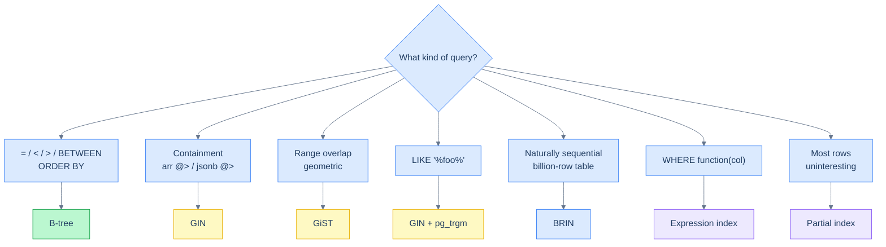

# 1. Other Index Types

## The Hook

A full-text-search query against an `articles` table:

```sql
SELECT * FROM articles WHERE body LIKE '%postgres%';
```

`body` is indexed with a B-tree. The query is slow — leading wildcard means the B-tree can't help; sequential scan over millions of rows.

The fix isn't a different B-tree, it's a different *index type* — a GIN index over a `tsvector` representation of `body`:

```sql
CREATE INDEX articles_body_fts_idx ON articles USING GIN (to_tsvector('english', body));
SELECT * FROM articles WHERE to_tsvector('english', body) @@ to_tsquery('postgres');
```

GIN (Generalised Inverted Index) is built for "find rows containing this token" — exactly the shape of full-text search. Microseconds instead of seconds.

This chapter is the catalogue of index types beyond B-tree, when each one is the right answer, and the production patterns where they show up.

---

## Table of contents

1. [Hash indexes](#hash)
2. [GIN — for arrays, JSONB, full-text](#gin)
3. [GiST — for geometric and range data](#gist)
4. [BRIN — for naturally-ordered huge tables](#brin)
5. [Partial indexes](#partial)
6. [Expression indexes](#expression)
7. [When to use which](#when-to-use-which)
8. [Edge cases and pitfalls](#edge-cases-and-pitfalls)
9. [Production reality](#production-reality)
10. [Practice ladder](#practice-ladder)
11. [Cross-links](#cross-links)
12. [Final takeaway](#final-takeaway)

***

# Hash

A hash index supports equality lookups (`=`) only — no range, no ordering. In Postgres 10+ it's WAL-logged and crash-safe; before, it was unsafe.

**Rarely used in modern Postgres** — B-tree handles equality just as well and supports more operators. Useful only for very wide-key columns (e.g., URL strings) where the hash is much smaller than the key.

```sql
CREATE INDEX users_email_hash_idx ON users USING HASH (email);
```

For most workloads, ignore hash indexes; B-tree is the default.

---

# GIN

**Generalised Inverted Index** — designed for "containment" queries. Indexes the *components* of a composite value, lets you query "rows whose value contains X."

The classic uses:

**(1) Full-text search** — index a `tsvector` (parsed text), query with `@@`:

```sql
CREATE INDEX articles_body_fts_idx ON articles USING GIN (to_tsvector('english', body));
SELECT * FROM articles WHERE to_tsvector('english', body) @@ to_tsquery('postgres');
```

**(2) Array containment** — `WHERE tags @> ARRAY['urgent']`:

```sql
CREATE INDEX posts_tags_idx ON posts USING GIN (tags);
SELECT * FROM posts WHERE tags @> ARRAY['urgent'];
```

**(3) JSONB queries** — `WHERE data @> '{"status": "active"}'`:

```sql
CREATE INDEX events_data_idx ON events USING GIN (data jsonb_path_ops);
SELECT * FROM events WHERE data @> '{"status": "active"}';
```

GIN indexes are larger and slower to build than B-trees, but they're the *only* practical answer for these query shapes at scale.

---

# GiST

**Generalised Search Tree** — supports nearest-neighbour, range overlap, and geometric queries. Used for:

- **PostGIS spatial data** ("find restaurants within 1km").
- **`tsvector` full-text** (alternative to GIN — different trade-offs).
- **`range` types** ("does this date range overlap any reservation?").
- **Trigram indexes** for unanchored `LIKE '%foo%'` queries (via `pg_trgm` extension).

```sql
-- Trigram index: makes LIKE '%foo%' fast.
CREATE EXTENSION IF NOT EXISTS pg_trgm;
CREATE INDEX articles_body_trgm_idx ON articles USING GIN (body gin_trgm_ops);
SELECT * FROM articles WHERE body LIKE '%postgres%';
```

(Trigrams can use either GIN or GiST — `gin_trgm_ops` for GIN, `gist_trgm_ops` for GiST. GIN is usually preferred for trigrams.)

---

# BRIN

**Block Range INdex** — stores summary statistics per block (e.g., min/max of a column over each 1MB chunk of the table). Tiny — kilobytes for billion-row tables. Useful when the data is **naturally ordered** by the indexed column (e.g., `created_at` in an append-only table).

```sql
-- Tiny index. Useful for time-series queries on a sequentially-written table.
CREATE INDEX events_created_at_brin_idx ON events USING BRIN (created_at);
```

A BRIN scan reads the summaries, identifies which blocks *might* contain matching rows, then scans those blocks. Fast for naturally-ordered data; useless for randomly-ordered data (every block "might match").

The win: for a 100GB events table, a B-tree on `created_at` might be 10GB; the BRIN equivalent is < 1MB.

---

# Partial indexes

Index only the rows matching a condition. Smaller, faster, used only for queries with that condition.

```sql
-- Only active users — much smaller than indexing everyone.
CREATE INDEX users_active_email_idx ON users (email) WHERE is_active = TRUE;

-- Now this query is fast and only walks active users.
SELECT * FROM users WHERE is_active = TRUE AND email = 'alice@example.com';
```

Useful when:
- A large fraction of rows are "uninteresting" (soft-deleted, draft state, etc.).
- A query consistently filters on a stable predicate.

---

# Expression indexes

Index a *computed expression* instead of a raw column.

```sql
-- Case-insensitive email lookup.
CREATE INDEX users_email_lower_idx ON users (LOWER(email));
SELECT * FROM users WHERE LOWER(email) = 'alice@example.com';

-- Date-truncated lookup.
CREATE INDEX events_day_idx ON events (DATE_TRUNC('day', created_at));
SELECT * FROM events WHERE DATE_TRUNC('day', created_at) = '2026-04-15';
```

The query *must* use the same expression as the index. Different expressions → no use.

A common pattern: **expression index on a JSONB field**:

```sql
CREATE INDEX events_user_id_idx ON events ((data->>'user_id'));
SELECT * FROM events WHERE data->>'user_id' = '42';
```

Now JSONB lookups are as fast as a regular indexed column.

---

# When to use which

| Query shape | Index type |
|---|---|
| `WHERE x = ?`, `WHERE x BETWEEN ?`, `ORDER BY x` | B-tree |
| `WHERE arr @> ARRAY[...]`, JSONB containment, full-text | GIN |
| Range overlap, geometric, `LIKE '%foo%'` | GiST (often with trigrams) |
| Sequentially-ordered data, billions of rows, low selectivity | BRIN |
| Most rows are "uninteresting"; query filters consistently | Partial |
| Filter is a function/expression, not a raw column | Expression |
| Equality only, key is very large | Hash (rare) |



<p align="center"><strong>Index-type decision tree. B-tree handles 80% of cases; the others are specialised.</strong></p>

---

# Edge cases and pitfalls

## GIN inserts are slow

GIN indexes maintain inverted lists per token; inserts that touch many tokens (e.g., a new article with thousands of words) are slow. For high-write workloads, consider `gin_pending_list_limit` to defer indexing.

## BRIN over randomly-ordered data is useless

If the data isn't naturally ordered by the indexed column (e.g., `id` is a random UUID), BRIN summaries are non-discriminating. Stick with B-tree.

## Expression-index pickiness

The query must use the *exact same expression* as the index. `LOWER(email)` and `LCASE(email)` would not share an index. Standardise on one form.

## Index bloat

Frequent updates can leave dead entries in indexes; `VACUUM` cleans them. For heavily-updated tables, occasional `REINDEX CONCURRENTLY` recovers space.

---

# Production reality

A typical Postgres-backed application uses:
- **B-tree** for PKs, FKs, most filters.
- **Partial B-tree** for "soft-delete" tables (`WHERE deleted_at IS NULL`).
- **GIN** on JSONB columns for arbitrary key lookups.
- **GIN with trigrams** for autocomplete and search-as-you-type features.
- **BRIN** on append-only event tables' `created_at` column.

Each index type has its niche; mixing them in one schema is normal.

---

# Practice ladder

1. **Add a partial index on `customers` for `WHERE is_active = TRUE`.** *Hint: `CREATE INDEX ... WHERE is_active = TRUE`.*
2. **Add an expression index for case-insensitive `email` lookups.** *Hint: `LOWER(email)`.*
3. **For a JSONB column `data`, add an index that makes `WHERE data->>'user_id' = '42'` fast.** *Hint: expression index on `(data->>'user_id')`.*
4. **For a 100GB append-only events table indexed mostly on `created_at`, would you use B-tree or BRIN?** *Hint: BRIN — much smaller, naturally-ordered data.*
5. **For full-text search on a `body` column, what index type?** *Hint: GIN over `to_tsvector(...)`.*

***

# Cross-links

- **Previous in this module:** [B-Tree Indexes](/cortex/languages/sql/indexes-and-performance/b-tree-indexes).
- **Next in this module:** [EXPLAIN and Query Plans](/cortex/languages/sql/indexes-and-performance/explain-and-query-plans).

***

# Final Takeaway

B-tree is the default; specialised index types are the answer for specific query shapes. Three patterns to internalise:

1. **Match the index type to the query shape.** Containment → GIN; range overlap / geometry → GiST; sequentially-ordered huge tables → BRIN.
2. **Partial and expression indexes are powerful refinements.** Not a different *type*, but a different *coverage*. Use to tailor an index to the actual query patterns.
3. **`pg_stat_user_indexes` shows which indexes get used.** Drop the ones that don't. Index maintenance has a real cost.

## Your Turn

Before you move on, check your understanding with the coach — explain the idea, apply it, weigh the trade-offs, then defend your reasoning.

<div class="concept-coach"></div>
