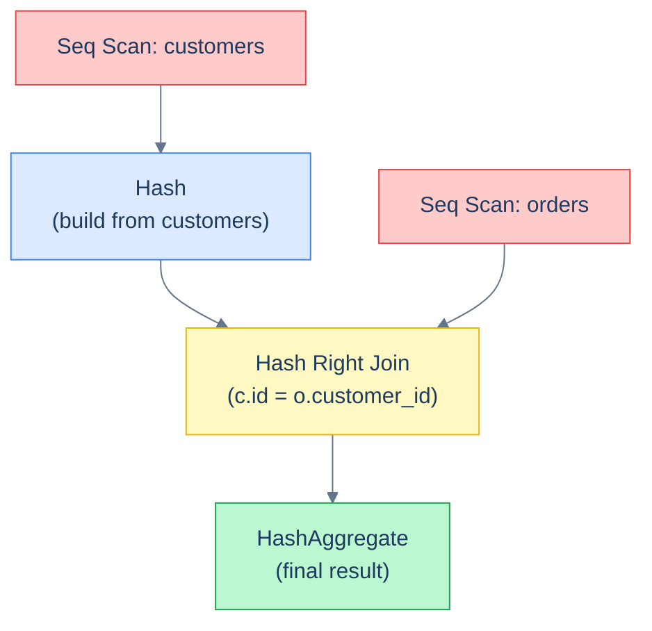

# 1. EXPLAIN and Query Plans

## The Hook

A query is slow. You've added the index. It's still slow.

`EXPLAIN ANALYZE` is the answer:

```sql
EXPLAIN ANALYZE
SELECT * FROM events WHERE user_id = 42 AND created_at >= '2026-01-01';
```

The output tells you **exactly** what the planner did: which scan it picked, which indexes it used (or didn't), how many rows it actually read vs estimated, where the time went. If you can read this output, you can answer "why is this slow" deterministically — instead of guessing and re-running benchmarks.

This chapter is the field guide. Plan node types, the cost-vs-actual reading skill, the half-dozen patterns that account for most "slow query" diagnoses.

---

## Table of contents

1. [`EXPLAIN` vs `EXPLAIN ANALYZE`](#explain-vs-explain-analyze)
2. [Reading a plan](#reading-a-plan)
3. [Scan node types](#scan-node-types)
4. [Join algorithms](#join-algorithms)
5. [Cost vs actual](#cost-vs-actual)
6. [Common diagnoses](#common-diagnoses)
7. [Edge cases and pitfalls](#edge-cases-and-pitfalls)
8. [Production reality](#production-reality)
9. [Practice ladder](#practice-ladder)
10. [Cross-links](#cross-links)
11. [Final takeaway](#final-takeaway)

***

# EXPLAIN vs EXPLAIN ANALYZE

- **`EXPLAIN query`** — shows the planner's *intended* plan. No execution. Cheap, safe.
- **`EXPLAIN ANALYZE query`** — *actually runs* the query and shows the real plan with actual times and row counts. Expensive (runs the query for real, including any DML side effects). For `INSERT`/`UPDATE`/`DELETE`, wrap in a transaction and roll back.

```sql
EXPLAIN ANALYZE
SELECT c.first_name, COUNT(o.order_id) AS orders
FROM customers c
LEFT JOIN orders o ON o.customer_id = c.id
GROUP BY c.id, c.first_name;
```

Output (Postgres-style, slightly trimmed):

```
HashAggregate  (cost=23.50..28.50 rows=200 width=40) (actual time=0.123..0.130 rows=5 loops=1)
  Group Key: c.id
  ->  Hash Right Join  (cost=11.50..21.00 rows=500 width=18) (actual time=0.045..0.080 rows=6 loops=1)
        Hash Cond: (o.customer_id = c.id)
        ->  Seq Scan on orders o  (cost=0.00..8.00 rows=500 width=14) (actual time=0.005..0.020 rows=6 loops=1)
        ->  Hash  (cost=10.00..10.00 rows=200 width=12) (actual time=0.025..0.025 rows=5 loops=1)
              ->  Seq Scan on customers c  (cost=0.00..10.00 rows=200 width=12) (actual time=0.005..0.015 rows=5 loops=1)
Planning Time: 0.245 ms
Execution Time: 0.180 ms
```

Read it inside-out: leaves first, then the joins/aggregates above them.

---

# Reading a plan

The plan is a tree. The leaves are scans of base tables; intermediate nodes are joins, aggregates, sorts; the root is the final result. **Time flows up:** child nodes feed their output to their parent.



<p align="center"><strong>A typical join+aggregate plan as a tree. Read leaves first (Seq Scans), then up to the join, then the aggregate at the root. Each node's "actual time" is the cost of producing its output, including its children's costs.</strong></p>

Each node line shows:
- **Node type** (`Seq Scan`, `Index Scan`, `Hash Join`, `Nested Loop`, ...).
- **Cost** — `cost=startup..total` — the planner's estimate.
- **Estimated rows / width** — the planner's guess at output size.
- **Actual time** — `time=startup..total ms` (only with `ANALYZE`).
- **Actual rows** — what really happened (only with `ANALYZE`).
- **Loops** — how many times this node was executed (relevant for nested loops).

The two columns to compare: **estimated rows vs actual rows**. If the planner thought 5 and got 50,000, its plan was based on bad statistics — and probably bad. Run `ANALYZE table_name` to refresh statistics; if the gap remains, dig deeper.

---

# Scan node types

How the planner reads from a base table:

| Node | What it does |
|---|---|
| `Seq Scan` | Sequential scan — read every row in the table |
| `Index Scan` | Use an index to find rows, then visit the heap for full row data |
| `Index Only Scan` | Use an index that *covers* the query — no heap visit |
| `Bitmap Index Scan` + `Bitmap Heap Scan` | Build a bitmap of matching rows from the index, then read heap pages efficiently |
| `Tid Scan` | Direct tuple-ID lookup (rare) |

**`Seq Scan` is fine for small tables and high-selectivity queries.** It's a problem only when an index *should* have helped but the planner chose to ignore it (usually because of bad statistics or a non-sargable predicate).

**`Bitmap Index Scan`** is what the planner picks when an index would help but selectivity is moderate (1-50% of rows). It batches reads to be cache-friendly.

**`Index Only Scan`** is the fastest — the index covers all the columns the query needs, so the heap is never visited. See [B-Tree Indexes: covering indexes](/cortex/languages/sql/indexes-and-performance/b-tree-indexes#covering-indexes).

---

# Join algorithms

Three main types:

**Nested Loop Join** — for each row in A, scan B for matches.
- Best when A is small or B has an index on the join key.
- Cost: `|A| × cost-of-finding-match-in-B`.
- Fast for small results, terrible for large ones.

**Hash Join** — build a hash table from B, scan A and probe.
- Best when both sides are large but neither is indexed on the join key.
- Cost: `|A| + |B| + memory for the hash table`.
- Common in analytical queries.

**Merge Join** — both sides sorted on the join key, walk in lockstep.
- Best when both sides are already sorted (e.g., both have indexes on the join key).
- Cost: `|A| + |B| + sort cost (if not already sorted)`.

The planner picks. You can influence with indexes (encouraging Index Nested Loop or Merge Join) or with `enable_hashjoin = off` etc. (last resort — usually leave the planner alone).

---

# Cost vs actual

The fields to focus on:

```
Seq Scan on events  (cost=0.00..50000.00 rows=1000000 width=...) (actual time=0.5..3500 ms rows=1500 loops=1)
```

- **cost=0..50000** — the planner's estimate (arbitrary cost units).
- **rows=1000000** estimated; **rows=1500** actual.
- **time=3500 ms** actual.

The estimated 1,000,000 rows vs actual 1,500 means the planner *over-estimated by 666×*. It chose `Seq Scan` because it thought a million rows would match. With accurate statistics, it'd have used the index. **Run `ANALYZE table_name`** to refresh.

The reverse — estimated 100, actual 1,000,000 — is the worse error. The planner picked `Nested Loop`, expecting tiny intermediate sizes; the actual size made it `O(N²)`. The query takes hours.

**Big estimate-vs-actual gaps are the #1 sign of statistics being stale.** Run `VACUUM ANALYZE` regularly.

---

# Common diagnoses

| Symptom | Likely cause |
|---|---|
| `Seq Scan` on a big table | Missing index, or planner thinks too many rows match |
| `Index Scan` then heap reads dominate the time | Lots of matches; use covering index or expression index |
| `Nested Loop` with millions of iterations | Wrong join algorithm; usually bad estimates |
| Estimated rows wildly off actual | `ANALYZE` the table to refresh statistics |
| Plan changes between runs | Stale statistics, or `random_page_cost`/`effective_cache_size` misconfigured |
| `Sort` near the top | Missing index that would have provided the order |
| `Filter` in a node when an index expression should match | Non-sargable predicate (function-on-column) |

---

# Edge cases and pitfalls

## EXPLAIN ANALYZE has overhead

The instrumentation adds cost. A query that takes 100 ms might `EXPLAIN ANALYZE` in 150 ms. Don't trust EXPLAIN ANALYZE timings as the absolute truth — use them for *relative* comparisons.

## Cached vs cold

A query's first run is slower (data not in buffer cache). `EXPLAIN ANALYZE` reflects whichever state. Run twice and check.

## Plans change with table size

A plan that's optimal on 10k rows might be wrong on 10M rows. Re-profile after data growth. `auto_explain` (Postgres extension) can log slow plans automatically.

## EXPLAIN options

`EXPLAIN (ANALYZE, BUFFERS, VERBOSE, FORMAT JSON) query` — gives buffer hits/misses (whether data was in cache), full output names, and machine-readable JSON. Useful for deep diagnosis.

---

# Production reality

The standard performance-debugging loop:

1. **Identify slow query.** `pg_stat_statements` extension shows the slowest queries by total time.
2. **Run `EXPLAIN ANALYZE` against the slow query.**
3. **Compare estimated vs actual rows.** If wildly different, run `ANALYZE table_name`.
4. **Identify the slow node** — usually the deepest one with the most actual time.
5. **Fix it** — add an index, rewrite the predicate to be sargable, denormalise, partition, etc.
6. **Re-profile.**

For codefolio, every query that hits the `/api/recent` or `/api/hello` endpoints is in a hot path. Adding the index on `hello_events.timestamp_ms` is the difference between a single-digit ms response and a sequential scan that scales linearly with table size.

---

# Practice ladder

1. **Run `EXPLAIN ANALYZE SELECT * FROM customers WHERE country = 'Germany';` against your scratch DB. Identify the scan type.** *Hint: probably `Seq Scan` on a small table.*
2. **Add an index on `customers.country` and re-run. Did the plan change?** *Hint: small tables often still get `Seq Scan`; it depends on size and selectivity.*
3. **Identify the join algorithm in a 2-table join's plan.** *Hint: look for `Nested Loop`, `Hash Join`, or `Merge Join`.*
4. **What does it mean if estimated rows = 100 but actual rows = 1,000,000?** *Hint: stale stats. Run `ANALYZE`.*

***

# Cross-links

- **Previous in this module:** [Other Index Types](/cortex/languages/sql/indexes-and-performance/other-index-types).
- **Next in this module:** [Anti-Patterns](/cortex/languages/sql/indexes-and-performance/anti-patterns) — the predicates that block index use.

***

# Final Takeaway

`EXPLAIN ANALYZE` turns "slow query" into "I know exactly why." Three patterns to internalise:

1. **Estimated vs actual rows is the first thing to read.** Big gaps = stale statistics. `ANALYZE table_name` is the first fix.
2. **The slowest node is usually the deepest sequential scan.** Adding an index on its filter column is usually the biggest win.
3. **Make `EXPLAIN ANALYZE` part of every PR that touches a hot query.** Production query plans should be checked, not assumed.

## Your Turn

Before you move on, check your understanding with the coach — explain the idea, apply it, weigh the trade-offs, then defend your reasoning.

<div class="concept-coach"></div>
