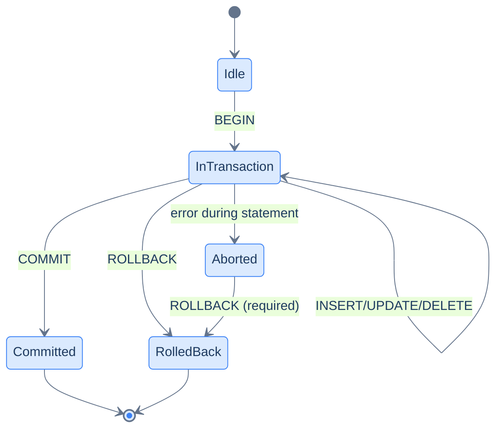

# 1. ACID and Transactions

## The Hook

Transferring $100 from account A to account B is two updates:

```sql
UPDATE accounts SET balance = balance - 100 WHERE id = 'A';
-- if a power failure hits HERE, A is debited but B isn't credited.
UPDATE accounts SET balance = balance + 100 WHERE id = 'B';
```

If anything between the two statements fails, money disappears. That's why every banking-shaped operation runs in a **transaction** — a group of statements that all succeed or all fail, atomically:

```sql
BEGIN;
  UPDATE accounts SET balance = balance - 100 WHERE id = 'A';
  UPDATE accounts SET balance = balance + 100 WHERE id = 'B';
COMMIT;
```

If anything inside fails, `ROLLBACK` (explicit or automatic from a crash) undoes both updates. The system is back to consistency — A is still debited only after B is also credited, or neither.

The four properties this gives you — **ACID** — are the foundation of relational databases. This chapter covers what each means in practice, the SQL syntax, and the patterns for using transactions correctly.

---

## Table of contents

1. [The four ACID properties](#the-four-acid-properties)
2. [`BEGIN`, `COMMIT`, `ROLLBACK`](#begin-commit-rollback)
3. [Implicit transactions](#implicit-transactions)
4. [`SAVEPOINT`](#savepoint)
5. [What gets rolled back](#what-gets-rolled-back)
6. [Edge cases and pitfalls](#edge-cases-and-pitfalls)
7. [Production reality](#production-reality)
8. [Practice ladder](#practice-ladder)
9. [Cross-links](#cross-links)
10. [Final takeaway](#final-takeaway)

***

# The four ACID properties

**A — Atomicity.** Either all statements in a transaction commit, or none do. No partial commits. The chapter's hook example.

**C — Consistency.** A transaction takes the database from one valid state to another. Constraints (PK, FK, CHECK, UNIQUE) are enforced at commit time. If a transaction would violate any, it's rolled back.

**I — Isolation.** Concurrent transactions don't interfere. The exact level of isolation is configurable — covered in [Isolation Levels](/cortex/languages/sql/transactions-and-concurrency/isolation-levels). The default isolation prevents most anomalies.

**D — Durability.** Once a transaction has committed, its changes survive crashes. The database has fsync'd the changes to disk before reporting "COMMITTED" to the client.

Every relational database aims to provide all four. Compromises (eventual consistency, "last write wins" reconciliation) are the territory of NoSQL stores; if you need strict ACID, you reach for SQL.

---

# BEGIN, COMMIT, ROLLBACK

```sql
BEGIN;                          -- start a transaction
  -- ... statements ...
COMMIT;                         -- make changes permanent

-- or:

BEGIN;
  -- ... statements ...
ROLLBACK;                       -- discard all changes since BEGIN
```

`BEGIN` opens a transaction. Subsequent statements are part of it. `COMMIT` makes them permanent and visible to other transactions. `ROLLBACK` discards them — as if they never happened.



<p align="center"><strong>Transaction state machine. From <code>Idle</code>, <code>BEGIN</code> opens a transaction. Statements run inside; an error puts the transaction in an aborted state where only <code>ROLLBACK</code> is accepted. <code>COMMIT</code> makes changes permanent; <code>ROLLBACK</code> discards them.</strong></p>

If a statement *inside* a transaction fails (constraint violation, syntax error, etc.), most engines auto-rollback the transaction. Postgres puts the transaction into an "aborted" state where every subsequent statement errors with "current transaction is aborted, commands ignored until end of transaction block" — you must `ROLLBACK` to recover.

> **Dialect note:** SQL Server uses `BEGIN TRANSACTION` (or `BEGIN TRAN`); MySQL/Postgres/SQLite accept just `BEGIN`. `ROLLBACK` and `COMMIT` are universal.

---

# Implicit transactions

If you don't explicitly `BEGIN`, **every individual statement is its own implicit transaction**. The statement runs, commits automatically. This is the default in every dialect — sometimes called "autocommit mode."

```sql
INSERT INTO orders VALUES (...);   -- implicit transaction: BEGIN; INSERT ...; COMMIT;
```

For single-statement operations, autocommit is fine. For multi-statement operations that need atomicity, **explicit `BEGIN`/`COMMIT` is mandatory**.

Application code typically uses transactions through the database driver:

```java
// JDBC pattern.
conn.setAutoCommit(false);
try {
    // ... statements ...
    conn.commit();
} catch (Exception e) {
    conn.rollback();
    throw e;
}
```

The `setAutoCommit(false)` is the equivalent of `BEGIN`. The `commit` / `rollback` close the transaction. **Always wrap the body in try/catch** — if the catch is missing, an exception leaves the transaction open, holding locks indefinitely.

---

# SAVEPOINT

A `SAVEPOINT` is a checkpoint inside a transaction. You can roll back to it without rolling back the whole transaction:

```sql
BEGIN;
  INSERT INTO orders VALUES (1, ...);
  SAVEPOINT after_first;
  INSERT INTO orders VALUES (2, ...);
  -- Oops — the second insert violated something.
  ROLLBACK TO SAVEPOINT after_first;
  -- The first insert is still active; the second was undone.
  INSERT INTO orders VALUES (2.5, ...);   -- retry with corrected data
COMMIT;
```

Useful for:
- "Try this insert; if it fails, fall back" patterns.
- Loops that may have some failed iterations without aborting the whole batch.
- Subroutines within a larger transaction that should be undoable independently.

Most application code doesn't use `SAVEPOINT` explicitly — the language's exception handling does the equivalent. ORMs may use them for nested transactions.

---

# What gets rolled back

`ROLLBACK` undoes:
- `INSERT`/`UPDATE`/`DELETE` row changes.
- DDL changes (`CREATE`/`ALTER`/`DROP TABLE`) — in dialects that support transactional DDL (Postgres yes, MySQL no, Oracle partial).
- Schema-level changes (constraints added/dropped, indexes built — `CREATE INDEX CONCURRENTLY` is the exception, can't be in a transaction).

`ROLLBACK` does *not* undo:
- Sequence advances (used by `IDENTITY` columns). If you `INSERT` and roll back, the sequence still advanced — the next insert gets the next value, leaving a gap. This is a feature; reusing sequence values would require coordination across concurrent transactions.
- Side effects outside the database — emails sent, payments processed, files written.

**Treat external side effects as commit-time work.** Send the email *after* the transaction commits, not inside it. (The pattern: store an "outbox" message inside the transaction; a background worker reads the outbox and sends. The "transactional outbox" pattern.)

---

# Edge cases and pitfalls

## Long-running transactions

A transaction holds locks on the rows it's modified. A transaction left open for hours blocks other transactions, prevents `VACUUM`, bloats the database. **Keep transactions short.** Open, do the work, commit. If you need user input mid-transaction, design around it — don't hold a transaction open across an HTTP boundary.

## Implicit commits in some dialects

MySQL: DDL statements (`CREATE TABLE`, `ALTER TABLE`) implicitly commit the current transaction *before* executing. Surprising. Postgres doesn't have this — DDL participates in the transaction.

## Read-only transactions

```sql
BEGIN ISOLATION LEVEL SERIALIZABLE READ ONLY;
```

Postgres optimisation: a read-only transaction can skip some locking, allowing the planner to be more aggressive. Useful for analytics queries that should see a consistent snapshot.

## Nested BEGIN

```sql
BEGIN;
  BEGIN;       -- usually a warning; the second BEGIN is a no-op or starts a savepoint.
  ...
```

Most engines treat the second `BEGIN` inside a transaction as either a no-op (with a warning) or as an implicit `SAVEPOINT`. Application code shouldn't rely on this; use explicit `SAVEPOINT` if you need nesting.

## Auto-rollback on disconnect

If the client disconnects mid-transaction, the transaction is rolled back. Useful safety net; *not* a substitute for explicit handling.

---

# Production reality

The codefolio `/api/hello` increment is implicit-transaction shape:

```sql
UPDATE visits SET count = count + 1 RETURNING count;
```

One statement, autocommit, atomic-by-the-engine. Two concurrent requests produce two distinct increments — never a lost update.

For a multi-statement operation — say, "create a customer and their first order in one atomic step" — the application code wraps in an explicit transaction:

```scala
ZIO.scoped {
  for {
    _ <- jdbc.execute("BEGIN")
    customerId <- insertCustomer(...)
    _ <- insertOrder(customerId, ...)
    _ <- jdbc.execute("COMMIT")
  } yield ()
}.catchAll(e => jdbc.execute("ROLLBACK") *> ZIO.fail(e))
```

The pattern: `BEGIN` → work → `COMMIT` (with `ROLLBACK` on any failure). HikariCP and similar connection pools handle this automatically when you set `setAutoCommit(false)` and call `commit()` / `rollback()`.

---

# Practice ladder

1. **Wrap two updates in a transaction; commit them together.** *Hint: `BEGIN; ...; COMMIT;`.*
2. **Wrap two updates in a transaction; intentionally violate a constraint in the second; observe both being rolled back.** *Hint: try a unique-constraint violation; then `ROLLBACK`.*
3. **Use `SAVEPOINT` to undo the second of three statements without losing the first.** *Hint: `SAVEPOINT name`, then `ROLLBACK TO SAVEPOINT name`.*
4. **What's the difference between `ROLLBACK` and `ROLLBACK TO SAVEPOINT name`?** *Hint: full rollback vs partial.*
5. **Why should you avoid long-running transactions?** *Hint: locks, VACUUM, bloat.*

***

# Cross-links

- **Previous module:** [Indexes and Performance](/cortex/languages/sql/indexes-and-performance/index).
- **Next in this module:** [Isolation Levels](/cortex/languages/sql/transactions-and-concurrency/isolation-levels).

***

# Final Takeaway

ACID is the foundation of relational SQL. Three patterns to internalise:

1. **Multi-statement operations need explicit transactions.** Single statements get implicit autocommit transactions; multi-statement work needs `BEGIN`/`COMMIT`.
2. **Always pair `BEGIN` with a try/catch and matching `COMMIT`/`ROLLBACK`.** Open transactions left dangling hold locks and bloat the database.
3. **Side effects outside the database aren't transactional.** Emails, webhooks, payments — handle these *after* commit, ideally via the outbox pattern.

## Your Turn

Before you move on, check your understanding with the coach — explain the idea, apply it, weigh the trade-offs, then defend your reasoning.

<div class="concept-coach"></div>
