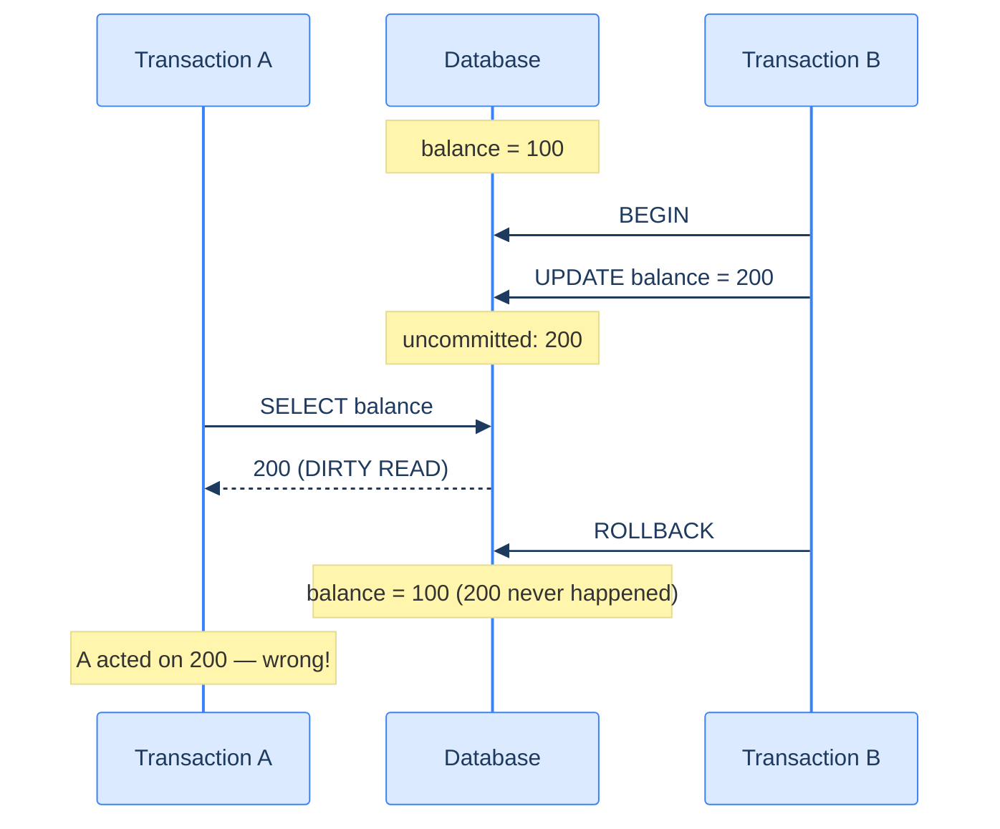

# 1. Isolation Levels

## The Hook

A bank-balance query reads $100 — your account looks good. Half a second later, you spend $80 in another transaction. Your first transaction reads the balance again — now $20. Same query, two different results, within the same logical "view" of the data.

That's a **non-repeatable read**, one of four classical isolation anomalies. Whether it can happen depends on the **isolation level** of your transaction.

The SQL standard defines four levels — `READ UNCOMMITTED`, `READ COMMITTED`, `REPEATABLE READ`, `SERIALIZABLE` — each preventing more anomalies than the last, at the cost of more locking / more retries / more overhead.

This chapter is what each level prevents, what it allows, the dialect defaults, and how to choose.

---

## Table of contents

1. [The four anomalies](#the-four-anomalies)
2. [The four isolation levels](#the-four-isolation-levels)
3. [Setting the level](#setting-the-level)
4. [Snapshot isolation (Postgres-specific)](#snapshot-isolation)
5. [Serializable in Postgres (SSI)](#serializable-in-postgres)
6. [Choosing a level](#choosing-a-level)
7. [Edge cases and pitfalls](#edge-cases-and-pitfalls)
8. [Production reality](#production-reality)
9. [Practice ladder](#practice-ladder)
10. [Cross-links](#cross-links)
11. [Final takeaway](#final-takeaway)

***

# The four anomalies

Classical concurrency anomalies, in escalating severity:

**1. Dirty read.** Transaction A reads a row that transaction B has modified but not yet committed. If B rolls back, A has read a value that "never happened."



<p align="center"><strong>Dirty read: A sees a value B has not yet committed. If B rolls back, A's view was never real. Postgres prevents this at all levels above READ UNCOMMITTED.</strong></p>

**2. Non-repeatable read.** Transaction A reads a row, then reads it again (same query) and gets a *different* value because B modified and committed in between. The chapter's hook example.

**3. Phantom read.** Transaction A runs a query, then runs the same query and gets *more rows* than before because B inserted matching rows in between. Different from non-repeatable read (which is about *changing* rows; phantom is about *new* rows).

**4. Serialization anomaly.** A complex consistency violation — concurrent transactions whose effects can't be explained by *any* serial ordering. The most subtle and the hardest to spot in code review.

---

# The four isolation levels

| Level | Dirty read | Non-repeatable read | Phantom read | Serialization anomaly |
|---|---|---|---|---|
| `READ UNCOMMITTED` | possible | possible | possible | possible |
| `READ COMMITTED` | prevented | possible | possible | possible |
| `REPEATABLE READ` | prevented | prevented | possible *(in standard SQL)* | possible |
| `SERIALIZABLE` | prevented | prevented | prevented | prevented |

Each level prevents more. Each costs more in terms of locking, blocking, or retries.

---

# Setting the level

```sql
-- For a single transaction:
BEGIN ISOLATION LEVEL REPEATABLE READ;
  ...
COMMIT;

-- Or per session:
SET TRANSACTION ISOLATION LEVEL SERIALIZABLE;

-- Or per database (default for new connections):
ALTER DATABASE codefolio SET default_transaction_isolation = 'serializable';
```

---

# Snapshot isolation

Postgres's `REPEATABLE READ` is actually **snapshot isolation** — slightly stronger than the SQL standard's `REPEATABLE READ`. It prevents *phantom reads* in addition to non-repeatable reads (the standard allows phantoms at this level).

The mechanism: each transaction sees a *snapshot* of the database as of its `BEGIN`. All reads see that snapshot, regardless of what other transactions commit in the meantime. Concurrent writes don't block reads (the reader sees the snapshot's old value); concurrent writes to the *same row* fail with a serialization error if both try to commit.

This is the Postgres MVCC story — covered in [MVCC and Locking](/cortex/languages/sql/transactions-and-concurrency/mvcc-and-locking).

---

# Serializable in Postgres

Postgres `SERIALIZABLE` is implemented as **Serializable Snapshot Isolation (SSI)** — snapshot isolation plus extra checks that detect anomalies and abort offending transactions with a "could not serialize access" error.

When you use `SERIALIZABLE`, your application code must be **prepared to retry on serialization errors**:

```scala
def runWithRetry(body: ZIO[...]): ZIO[...] = body.catchSome {
  case e: SQLException if e.getSQLState == "40001" =>
    runWithRetry(body)
}
```

The retry loop is inevitable — `SERIALIZABLE` trades blocking for retries. Most applications stick with `READ COMMITTED` and use explicit locks (`SELECT ... FOR UPDATE`) where they need stronger guarantees.

---

# Choosing a level

| Use case | Level |
|---|---|
| Most application reads/writes | `READ COMMITTED` (default) |
| Reports needing internal consistency | `REPEATABLE READ` (snapshot isolation) |
| Money / inventory / tightly-correlated counters | `SERIALIZABLE` (with retry loop) |
| Bulk loads, archival reads | `READ COMMITTED` |
| Anything where dirty reads are acceptable | `READ UNCOMMITTED` (rarely useful) |

**Defaults:**
- Postgres: `READ COMMITTED`.
- MySQL (InnoDB): `REPEATABLE READ`.
- SQL Server: `READ COMMITTED`.
- Oracle: `READ COMMITTED`.

The MySQL default is unusual; it's been a source of cross-engine surprise for two decades. Check `SHOW TRANSACTION ISOLATION LEVEL` if your code targets multiple engines.

---

# Edge cases and pitfalls

## Read Uncommitted is rarely useful

In Postgres, `READ UNCOMMITTED` is treated as `READ COMMITTED` — Postgres never has dirty reads. Other engines actually allow them (and surface "dirty data" temporarily).

## REPEATABLE READ doesn't prevent ALL anomalies

Even Postgres's snapshot isolation doesn't prevent *write skew* — two transactions read overlapping data, each updates a different row based on what they read, and the result is inconsistent. Example: two doctors both checking "is at least one other doctor on call?" — both find "yes" — both go off call — now zero on call. SSI catches this; standard `REPEATABLE READ` doesn't.

## SERIALIZABLE has retry overhead

Under load, `SERIALIZABLE` produces serialization-failure errors that the application must retry. Each retry is a wasted attempt. For high-contention workloads, the throughput hit is significant. Optimistic control + retries vs explicit locking is a design decision.

## Long-running transactions and snapshots

In Postgres, a long-running `REPEATABLE READ` transaction holds back the snapshot horizon — `VACUUM` can't reclaim space for tuples updated/deleted while that transaction is open. A reporting query that runs for hours can balloon table sizes.

---

# Production reality

For most application code:

- **`READ COMMITTED`** for routine CRUD. Fast, blocks little, prevents dirty reads.
- **Explicit row locks** (`SELECT ... FOR UPDATE`) for "read, decide, write" patterns where you need to ensure no concurrent change between read and write. Covered in [MVCC and Locking](/cortex/languages/sql/transactions-and-concurrency/mvcc-and-locking).
- **`REPEATABLE READ` (snapshot)** for reports that need internal consistency — every join sees the same view of the world.
- **`SERIALIZABLE` + retry loop** for the rare cases where you genuinely need full serializability and the contention is low enough that retries aren't a throughput killer.

The codefolio `/api/hello` increment uses `READ COMMITTED` (the Postgres default). Each `UPDATE visits SET count = count + 1` is atomic at the row level — concurrent requests safely increment, no missed updates. No need for stronger isolation.

---

# Practice ladder

1. **What anomaly does `READ COMMITTED` prevent that `READ UNCOMMITTED` doesn't?** *Hint: dirty reads.*
2. **What anomaly does `REPEATABLE READ` prevent that `READ COMMITTED` doesn't?** *Hint: non-repeatable reads.*
3. **When would you use `SERIALIZABLE`?** *Hint: complex consistency invariants across multiple rows; accept retry overhead.*
4. **Why does Postgres's `REPEATABLE READ` prevent phantom reads while standard `REPEATABLE READ` doesn't?** *Hint: snapshot isolation.*
5. **Why must application code retry on serialization-failure errors when using `SERIALIZABLE`?** *Hint: Postgres aborts conflicting transactions; retry pushes the work through eventually.*

***

# Cross-links

- **Previous in this module:** [ACID and Transactions](/cortex/languages/sql/transactions-and-concurrency/acid-and-transactions).
- **Next in this module:** [MVCC and Locking](/cortex/languages/sql/transactions-and-concurrency/mvcc-and-locking).

***

# Final Takeaway

Isolation levels trade strength for performance. Three patterns to internalise:

1. **`READ COMMITTED` is the right default.** Prevents the worst anomaly (dirty read), keeps things fast.
2. **Reach for `REPEATABLE READ` when a single transaction needs internal consistency** — long reports, multi-step calculations.
3. **`SERIALIZABLE` requires a retry loop in application code.** Powerful, expensive. Use when you genuinely need full serializability; otherwise prefer explicit locking at strategic points.

## Your Turn

Before you move on, check your understanding with the coach — explain the idea, apply it, weigh the trade-offs, then defend your reasoning.

<div class="concept-coach"></div>
