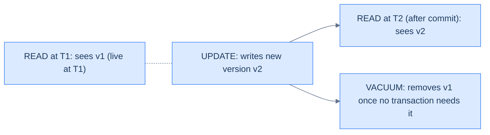
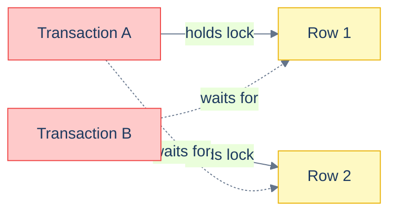

# 1. MVCC and Locking

## The Hook

Two requests arrive at the same instant: both want to mark order #42 as "shipped." Without coordination, both UPDATE the row, both succeed, both think they were the first. Now the system has emitted two shipping confirmations, charged the customer twice, and triggered two webhook deliveries.

The fix: **explicit row locking**:

```sql
BEGIN;
  SELECT * FROM orders WHERE id = 42 FOR UPDATE;   -- acquire lock
  -- now the row is mine until COMMIT/ROLLBACK
  UPDATE orders SET status = 'shipped' WHERE id = 42 AND status = 'pending';
COMMIT;
```

The second request blocks at `FOR UPDATE` until the first commits. When the second resumes, the row's status is now 'shipped', so its UPDATE matches zero rows — the second handler sees "no update" and returns "already shipped."

This chapter is about Postgres's MVCC concurrency model, the locks that govern who sees what when, deadlocks, and explicit-locking primitives like `FOR UPDATE` and advisory locks. By the end you'll know what blocks what under each isolation level and how to coordinate concurrent writes safely.

---

## Table of contents

1. [MVCC mental model](#mvcc-mental-model)
2. [Implicit locks (row, table)](#implicit-locks)
3. [`SELECT ... FOR UPDATE`](#select-for-update)
4. [`SELECT ... FOR SHARE`, `NOWAIT`, `SKIP LOCKED`](#select-for-share)
5. [Deadlocks](#deadlocks)
6. [Advisory locks](#advisory-locks)
7. [Edge cases and pitfalls](#edge-cases-and-pitfalls)
8. [Production reality](#production-reality)
9. [Practice ladder](#practice-ladder)
10. [Cross-links](#cross-links)
11. [Final takeaway](#final-takeaway)

***

# MVCC mental model

**MVCC = Multi-Version Concurrency Control.** Postgres (and most modern engines) keeps multiple versions of each row. When you `UPDATE` a row, the old version isn't overwritten — a new version is appended, with a "this is now the live version" pointer. The old version stays around until no transaction needs it.

The benefit: **readers don't block writers; writers don't block readers**. A `SELECT` running at `READ COMMITTED` sees the latest committed version of each row; if another transaction is updating it concurrently, the `SELECT` sees the old version, the UPDATE proceeds, and both finish without contention.

The cost: dead rows accumulate. `VACUUM` cleans them up — usually automatically (autovacuum). A long-running transaction holds back the "horizon" — rows newer than the oldest open transaction can't be vacuumed, leading to bloat.



<p align="center"><strong>MVCC: each update creates a new version. Readers see the version active at their snapshot. VACUUM eventually reclaims dead versions.</strong></p>

The implication: **the same row can have multiple "current" versions from different transactions' perspectives**. This is what makes snapshot isolation work — your transaction's snapshot is just a fixed pointer to a particular version of every row.

---

# Implicit locks

Even without explicit `FOR UPDATE`, the engine takes locks:

- **Row locks (write).** `UPDATE`/`DELETE` takes an exclusive lock on each modified row until commit. Two transactions trying to UPDATE the same row: one waits for the other.
- **Row locks (read).** `READ COMMITTED` reads don't lock rows. `REPEATABLE READ` and `SERIALIZABLE` use snapshot isolation; reads still don't lock, but writes detect conflicts.
- **Table locks.** DDL operations take `ACCESS EXCLUSIVE` (no concurrent reads/writes). Most `ALTER TABLE` forms briefly hold this. `CREATE INDEX CONCURRENTLY` is the exception.

You don't usually think about implicit locks. You feel them when:
- A migration takes the table offline for minutes.
- Two `UPDATE`s on the same row contend.
- A long-running transaction blocks `VACUUM` and your tables bloat.

---

# SELECT ... FOR UPDATE

Explicitly lock a row for the duration of the current transaction. Other transactions trying to lock or modify the same row block until commit.

```sql
BEGIN;
  SELECT * FROM accounts WHERE id = 'A' FOR UPDATE;  -- lock A
  -- ... compute new balance, no other transaction can change A ...
  UPDATE accounts SET balance = ? WHERE id = 'A';
COMMIT;
```

The pattern: read-then-write where the write depends on the read, and you can't tolerate another transaction sneaking in between.

`FOR UPDATE` only locks the rows the `SELECT` returns. For "lock all rows matching this predicate," `FOR UPDATE` does that. For locks that span multiple unrelated rows, you'd take multiple `SELECT ... FOR UPDATE` calls or escalate to a table lock.

---

# SELECT ... FOR SHARE, NOWAIT, SKIP LOCKED

Variants of explicit locking:

- **`FOR SHARE`** — shared lock; multiple transactions can hold simultaneously, but no `FOR UPDATE` until all release. Use when you need to read consistently with the guarantee that the row won't change until you're done.
- **`FOR UPDATE NOWAIT`** — try to lock; if blocked, error immediately (don't wait). Useful for "is this work already being done?" patterns.
- **`FOR UPDATE SKIP LOCKED`** — try to lock; if a row is already locked by another transaction, skip it (don't include in the result). The classic "queue worker" pattern.

```sql
-- A queue worker fetches the next available job, ignoring jobs being processed by other workers.
BEGIN;
  SELECT * FROM jobs WHERE status = 'pending' ORDER BY created_at LIMIT 1 FOR UPDATE SKIP LOCKED;
  -- ... process the job ...
  UPDATE jobs SET status = 'done' WHERE id = ?;
COMMIT;
```

`SKIP LOCKED` is the foundation of pure-SQL job queues. Multiple workers compete; each gets a different job, no double-processing.

---

# Deadlocks

A **deadlock** is when two (or more) transactions are each waiting for a lock the other holds. Classic:

- Transaction A: `UPDATE row 1; UPDATE row 2;`
- Transaction B: `UPDATE row 2; UPDATE row 1;`

A locks row 1, B locks row 2. A tries to lock row 2 — blocks. B tries to lock row 1 — blocks. Both wait forever.



<p align="center"><strong>Deadlock: a lock cycle. Postgres detects this and aborts one of the transactions with <code>40P01</code>. Avoid by acquiring locks in a consistent order — both transactions lock row 1 first, then row 2.</strong></p>

Postgres detects deadlocks and aborts one of the transactions with `40P01: deadlock detected`. The other proceeds. The aborted side typically retries the whole operation.

**Avoidance:** **always acquire locks in a consistent order.** If both A and B always lock rows in `id` ascending order, they can't deadlock — one always wins, one always waits, neither is stuck.

---

# Advisory locks

Postgres-specific locks not tied to any row. You name them with an integer (or pair of integers); Postgres tracks who's holding what.

```sql
SELECT pg_advisory_lock(42);     -- block until lock available
-- ... critical section ...
SELECT pg_advisory_unlock(42);

-- Or non-blocking:
SELECT pg_try_advisory_lock(42); -- returns true if acquired, false if not
```

Useful for application-level coordination that doesn't fit a row lock — "only one process should run this scheduled job at a time," "this region is being processed by one worker."

Two flavours: **transaction-scoped** (`pg_advisory_xact_lock`, releases at COMMIT) and **session-scoped** (`pg_advisory_lock`, releases when the session ends or you explicitly unlock).

---

# Edge cases and pitfalls

## Lost updates without FOR UPDATE

```sql
-- ❌ Two transactions both read balance=100, both compute 100-50=50, both write 50.
-- Result: 50, not 0. One update was lost.
SELECT balance FROM accounts WHERE id = 'A';     -- 100
-- ... in app code: new = 100 - 50 = 50
UPDATE accounts SET balance = 50 WHERE id = 'A';
```

The fix: either `SELECT ... FOR UPDATE` to serialise, or use atomic SQL: `UPDATE accounts SET balance = balance - 50 WHERE id = 'A'`.

## Long transactions and bloat

A transaction left open for hours holds back the snapshot horizon. Updated/deleted rows can't be vacuumed because that transaction might still need them. Result: table bloat, index bloat, slow queries. **Keep transactions short.**

## Lock timeouts

```sql
SET lock_timeout = '5s';
```

Configurable per-session. After 5 seconds waiting for a lock, the statement errors. Useful for migrations that don't want to block forever; the alternative is acquiring a long-held lock that takes the table offline.

## Rollback releases locks

`ROLLBACK` releases all locks held by the transaction. So does an aborted/auto-rolled-back transaction. The locks don't outlive the transaction.

---

# Production reality

Codefolio's `/api/hello` doesn't need explicit locks because the increment is one atomic UPDATE:

```sql
UPDATE visits SET count = count + 1 RETURNING count;
```

The row lock is implicit; concurrent calls serialise on the row lock. No data race, no need for `FOR UPDATE`.

For more complex shapes — "mark order shipped if currently pending" — explicit locking is required:

```sql
-- One worker per order.
BEGIN;
  SELECT * FROM orders WHERE id = ? AND status = 'pending' FOR UPDATE;
  -- if zero rows, someone else got there first; ROLLBACK and return "already shipped"
  UPDATE orders SET status = 'shipped' WHERE id = ?;
COMMIT;
```

The `FOR UPDATE` ensures only one worker proceeds even if multiple try at the same instant. Combined with `SKIP LOCKED`, this is also the foundation of pure-Postgres job-queue libraries.

---

# Practice ladder

1. **Use `SELECT ... FOR UPDATE` to atomically mark an order as shipped.** *Hint: BEGIN, SELECT FOR UPDATE, check, UPDATE, COMMIT.*
2. **What's the difference between `FOR UPDATE` and `FOR UPDATE SKIP LOCKED`?** *Hint: blocking vs skipping.*
3. **Two transactions update rows in different orders. Why might they deadlock?** *Hint: A locks row 1 then row 2; B locks row 2 then row 1.*
4. **How to prevent the deadlock in (3)?** *Hint: lock in a consistent order.*
5. **What does an advisory lock buy you that a row lock doesn't?** *Hint: not tied to any row; coordinate at application level.*

***

# Cross-links

- **Previous in this module:** [Isolation Levels](/cortex/languages/sql/transactions-and-concurrency/isolation-levels).
- **Module complete.** Next: [Advanced Patterns](/cortex/languages/sql/index).
- **Forward reference:** [Indexes and Performance](/cortex/languages/sql/indexes-and-performance/index) — locks happen at the row/index/page level; index choice affects lock granularity.

***

# Final Takeaway

MVCC and locking are how SQL handles concurrent access. Three patterns to internalise:

1. **MVCC means readers don't block writers (and vice versa).** Each update creates a new row version; readers see the version active at their snapshot. The cost is bloat from dead rows; `VACUUM` cleans up.
2. **`SELECT ... FOR UPDATE` for "read, decide, write" patterns.** When the write depends on the read, the explicit lock guarantees no concurrent change in between.
3. **Lock in a consistent order to avoid deadlocks; use `SKIP LOCKED` for queue workers; advisory locks for application-level coordination beyond rows.** These three primitives cover most real-world concurrency needs.

With this chapter, the [Transactions and Concurrency](/cortex/languages/sql/transactions-and-concurrency/index) module is complete. The final module ([Advanced Patterns](/cortex/languages/sql/index)) covers JSON, hierarchies, pivoting, and time-series patterns that don't fit cleanly elsewhere.

## Your Turn

Before you move on, check your understanding with the coach — explain the idea, apply it, weigh the trade-offs, then defend your reasoning.

<div class="concept-coach"></div>
